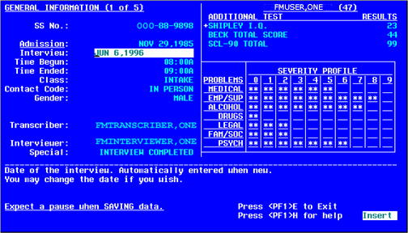

VA FileMan

ScreenMan Tutorial for Developers

Version 22.0

June 1996

Revised August 2014

Department of Veterans Affairs (VA)

Office of Information and Technology (OI&T)

Product Development (PD)

Revision History

<table>
<caption>
Table .
Documentation revision history
</caption>
<colgroup>
<col style="width: 13%" />
<col style="width: 11%" />
<col style="width: 45%" />
<col style="width: 29%" />
</colgroup>
<thead>
<tr class="header">
<th>Date</th>
<th>Revision</th>
<th>Description</th>
<th>Author</th>
</tr>
</thead>
<tbody>
<tr class="odd">
<td>08/13/2014</td>
<td>3.0</td>
<td>
Tech Edit:

<ul>
<li>
Reformatted document to conform to current heading and style
format document.
</li>
<li>
Updated all sections and procedural steps. This includes
rerunning all steps to make sure procedural steps are complete and
create new screen captures.
</li>
<li>
Updated all organizational references, URLs, references, etc.
throughout.
</li>
<li>
Made document Section 508 conformant. Replaced most graphic
representations of VistA screens with text screen captures
throughout.
</li>
<li>
Redacted names, URLs, and other data if deemed sensitive and
subject to redaction.
</li>
<li>
Made sure the Word version is in sync with the corresponding HTML
version of this document.
</li>
</ul></td>
<td><ul>
<li>
REDACTED
</li>
</ul></td>
</tr>
<tr class="even">
<td>12/28/2004</td>
<td>2.0</td>
<td>Updated documentation in compliance with new conventions for
displaying TEST data. See <a href="#data_conventions">Orientation</a>
section for details.</td>
<td>REDACTED</td>
</tr>
<tr class="odd">
<td>06/--/1996</td>
<td>1.0</td>
<td>Initial document.</td>
<td>REDACTED</td>
</tr>
</tbody>
</table>

Table . Documentation
revision history

 **REF:** For the
current patch history related to this software, see the Patch Module
(i.e., Patch User Menu \[A1AE USER\]) on FORUM.

Contents

[Revision History [iv](#_Toc41989686)](#_Toc41989686)

[Figures and Tables [xii](#_Toc331400980)](#_Toc331400980)

[Orientation [xvi](#_Toc395709451)](#_Toc395709451)

[1 Introduction [1](#_Toc395709452)](#_Toc395709452)

[1.1 Objectives [1](#objectives)](#objectives)

[1.2 Files Used [2](#files-used)](#files-used)

[1.3 Advance Preparation
[2](#advance-preparation)](#advance-preparation)

[2 Starting Out with Forms
[3](#starting-out-with-forms)](#starting-out-with-forms)

[2.1 Create a Form [4](#create-a-form)](#create-a-form)

[2.1.1 Overview [4](#overview)](#overview)

[2.1.1.1 ScreenMan Forms [4](#screenman-forms)](#screenman-forms)

[2.1.1.2 Form Editor [5](#form-editor)](#form-editor)

[2.1.2 Procedure [7](#procedure)](#procedure)

[2.1.3 Summary [9](#summary)](#summary)

[2.2 Add a DISPLAY Block to the Form
[9](#add-a-display-block-to-the-form)](#add-a-display-block-to-the-form)

[2.2.1 Overview [9](#overview-1)](#overview-1)

[2.2.2 Procedure [10](#procedure-1)](#procedure-1)

[2.2.3 Summary [12](#summary-1)](#summary-1)

[2.3 Add a Title (Caption-Only Field)
[13](#add-a-title-caption-only-field)](#add-a-title-caption-only-field)

[2.3.1 Overview [13](#overview-2)](#overview-2)

[2.3.2 Procedure [13](#procedure-2)](#procedure-2)

[2.3.3 Summary [15](#summary-2)](#summary-2)

[2.4 Reposition Fields on a Block
[15](#reposition-fields-on-a-block)](#reposition-fields-on-a-block)

[2.4.1 Overview [15](#overview-3)](#overview-3)

[2.4.2 Procedure [16](#procedure-3)](#procedure-3)

[2.4.3 Summary [16](#summary-3)](#summary-3)

[2.5 Add Data Dictionary Fields
[17](#add-data-dictionary-fields)](#add-data-dictionary-fields)

[2.5.1 Overview [17](#overview-4)](#overview-4)

[2.5.2 Procedure [17](#procedure-4)](#procedure-4)

[2.5.2.1 Adding Name Field [17](#adding-name-field)](#adding-name-field)

[2.5.2.2 Adding SSN Field [19](#adding-ssn-field)](#adding-ssn-field)

[2.5.2.3 Reposition Fields [20](#reposition-fields)](#reposition-fields)

[2.5.2.4 Deleting Fields [20](#deleting-fields)](#deleting-fields)

[2.5.3 Summary [20](#summary-4)](#summary-4)

[2.6 Run the Form [21](#run-the-form)](#run-the-form)

[2.6.1 Overview [21](#overview-5)](#overview-5)

[2.6.2 Procedure [21](#procedure-5)](#procedure-5)

[2.6.3 Summary [22](#summary-5)](#summary-5)

[2.7 Add an Edit Block to the Form
[22](#add-an-edit-block-to-the-form)](#add-an-edit-block-to-the-form)

[2.7.1 Overview [22](#overview-6)](#overview-6)

[2.7.2 Procedure [22](#procedure-6)](#procedure-6)

[2.7.3 Summary [24](#summary-6)](#summary-6)

[2.8 Add Data Dictionary Fields to the EDIT Block
[25](#add-data-dictionary-fields-to-the-edit-block)](#add-data-dictionary-fields-to-the-edit-block)

[2.8.1 Overview [25](#overview-7)](#overview-7)

[2.8.2 Procedure [26](#procedure-7)](#procedure-7)

[2.8.2.1 Add Fields [26](#add-fields)](#add-fields)

[2.8.2.2 Change Field Order
[28](#change-field-order)](#change-field-order)

[2.8.2.3 Reset Field Order [28](#reset-field-order)](#reset-field-order)

[2.8.3 Summary [29](#summary-7)](#summary-7)

[2.9 Use PRINT^DDS to List Form Characteristics
[29](#use-printdds-to-list-form-characteristics)](#use-printdds-to-list-form-characteristics)

[2.9.1 Overview [29](#overview-8)](#overview-8)

[2.9.2 Procedure [29](#procedure-8)](#procedure-8)

[2.9.3 Summary [32](#summary-8)](#summary-8)

[3 Pages, Multiples, and Computed Fields
[33](#pages-multiples-and-computed-fields)](#pages-multiples-and-computed-fields)

[3.1 Add a Page to a Form
[33](#add-a-page-to-a-form)](#add-a-page-to-a-form)

[3.1.1 Overview [33](#overview-9)](#overview-9)

[3.1.2 Procedures [33](#procedures)](#procedures)

[3.1.2.1 Add a Page to a Form
[33](#add-a-page-to-a-form-1)](#add-a-page-to-a-form-1)

[3.1.2.2 Add a Second Page to a Form
[34](#add-a-second-page-to-a-form)](#add-a-second-page-to-a-form)

[3.1.2.3 Add an Edit Block [35](#add-an-edit-block)](#add-an-edit-block)

[3.1.2.4 Link Pages [37](#link-pages)](#link-pages)

[3.2 Summary [38](#summary-9)](#summary-9)

[3.3 Add a Multiple Field (in a Repeating Block)
[39](#add-a-multiple-field-in-a-repeating-block)](#add-a-multiple-field-in-a-repeating-block)

[3.3.1 Overview [39](#overview-10)](#overview-10)

[3.3.2 Procedures [40](#procedures-1)](#procedures-1)

[3.3.2.1 Add Repeating Block
[40](#add-repeating-block)](#add-repeating-block)

[3.3.2.2 Add the SECONDARY MENU OPTIONS .01 Field
[42](#add-the-secondary-menu-options-.01-field)](#add-the-secondary-menu-options-.01-field)

[3.3.2.3 Add the SECONDARY MENU OPTIONS (SYNONYM) Field
[43](#add-the-secondary-menu-options-synonym-field)](#add-the-secondary-menu-options-synonym-field)

[3.3.2.4 Add Caption-only Field Columnar Headings to the Repeating Block
[44](#add-caption-only-field-columnar-headings-to-the-repeating-block)](#add-caption-only-field-columnar-headings-to-the-repeating-block)

[3.3.3 Summary [46](#summary-10)](#summary-10)

[3.4 Add a Multiple Field (in a Popup Page)
[47](#add-a-multiple-field-in-a-popup-page)](#add-a-multiple-field-in-a-popup-page)

[3.4.1.1 Overview [47](#overview-11)](#overview-11)

[3.4.2 Procedures [47](#procedures-2)](#procedures-2)

[3.4.2.1 Add the DIVISION Multiple Field
[47](#add-the-division-multiple-field)](#add-the-division-multiple-field)

[3.4.2.2 Add a Popup Page for the DIVISION Multiple
[48](#add-a-popup-page-for-the-division-multiple)](#add-a-popup-page-for-the-division-multiple)

[3.4.2.3 Add a Block to the Popup Page
[50](#add-a-block-to-the-popup-page)](#add-a-block-to-the-popup-page)

[3.4.2.4 Add the Fields for the DIVISION Multiple
[51](#add-the-fields-for-the-division-multiple)](#add-the-fields-for-the-division-multiple)

[3.4.3 Summary [52](#summary-11)](#summary-11)

[3.5 Reposition and Resize the Popup Page
[52](#reposition-and-resize-the-popup-page)](#reposition-and-resize-the-popup-page)

[3.5.1 Overview [52](#overview-12)](#overview-12)

[3.5.2 Procedures [52](#procedures-3)](#procedures-3)

[3.5.2.1 Reposition Popup Page
[52](#reposition-popup-page)](#reposition-popup-page)

[3.5.2.2 Resize the Popup Page
[53](#resize-the-popup-page)](#resize-the-popup-page)

[3.5.3 Summary [54](#summary-12)](#summary-12)

[3.6 Add a ScreenMan Computed Field
[55](#add-a-screenman-computed-field)](#add-a-screenman-computed-field)

[3.6.1 Overview [55](#overview-13)](#overview-13)

[3.6.2 Procedure [55](#procedure-9)](#procedure-9)

[3.6.3 Summary [58](#summary-13)](#summary-13)

[4 Advanced Features for Forms
[59](#advanced-features-for-forms)](#advanced-features-for-forms)

[4.1 Edit Fields in Other Files
[59](#edit-fields-in-other-files)](#edit-fields-in-other-files)

[4.1.1 Overview [59](#overview-14)](#overview-14)

[4.1.2 Procedures [60](#procedures-4)](#procedures-4)

[4.1.2.1 Add the SERVICE/SECTION Field
[60](#add-the-servicesection-field)](#add-the-servicesection-field)

[4.1.2.2 Add a Block to Edit Fields
[61](#add-a-block-to-edit-fields)](#add-a-block-to-edit-fields)

[4.1.2.3 Add Data Dictionary Fields
[62](#add-data-dictionary-fields-1)](#add-data-dictionary-fields-1)

[4.1.3 Summary [63](#summary-14)](#summary-14)

[4.2 Add Branching Logic for Fields
[63](#add-branching-logic-for-fields)](#add-branching-logic-for-fields)

[4.2.1 Overview [63](#overview-15)](#overview-15)

[4.2.2 Procedure [64](#procedure-10)](#procedure-10)

[4.2.2.1 Add Branching Logic
[64](#add-branching-logic)](#add-branching-logic)

[4.2.3 Summary [65](#summary-15)](#summary-15)

[4.3 Use Form-Only Fields for User Input
[66](#use-form-only-fields-for-user-input)](#use-form-only-fields-for-user-input)

[4.3.1 Overview [66](#overview-16)](#overview-16)

[4.3.2 Procedure [66](#procedure-11)](#procedure-11)

[4.3.3 Summary [68](#summary-16)](#summary-16)

[4.4 Turn Your ScreenMan Form into an Option
[68](#turn-your-screenman-form-into-an-option)](#turn-your-screenman-form-into-an-option)

[4.4.1 Overview [68](#overview-17)](#overview-17)

[4.4.2 Procedures [68](#procedures-5)](#procedures-5)

[4.4.2.1 Create a Run-Routine-Type Option
[68](#create-a-run-routine-type-option)](#create-a-run-routine-type-option)

[4.4.2.2 Create a ScreenMan-Type Option
[70](#create-a-screenman-type-option)](#create-a-screenman-type-option)

[4.4.3 Summary [71](#summary-17)](#summary-17)

[4.5 Where to Go From Here
[71](#where-to-go-from-here)](#where-to-go-from-here)

[4.6 Delete a Form [73](#delete-a-form)](#delete-a-form)

[5 Appendix A—M Code and Variables in ScreenMan Forms
[74](#appendix-am-code-and-variables-in-screenman-forms)](#appendix-am-code-and-variables-in-screenman-forms)

[5.1 M code in Field Properties
[74](#m-code-in-field-properties)](#m-code-in-field-properties)

[5.2 Variables [75](#variables)](#variables)

[5.2.1 DDSBR Variable [75](#ddsbr-variable)](#ddsbr-variable)

[5.2.2 DDSSTACK Variable [75](#ddsstack-variable)](#ddsstack-variable)

[5.3 Other Places for M Code in Forms
[76](#other-places-for-m-code-in-forms)](#other-places-for-m-code-in-forms)

[5.4 Validating Data [76](#validating-data)](#validating-data)

[6 Appendix B—Tutorial Keystroke Summary
[77](#appendix-btutorial-keystroke-summary)](#appendix-btutorial-keystroke-summary)

[6.1 Form Editor—Invoking
[77](#form-editorinvoking)](#form-editorinvoking)

[6.2 Page Navigation [77](#page-navigation)](#page-navigation)

[6.3 Screen Element Navigation
[77](#screen-element-navigation)](#screen-element-navigation)

[6.4 Creating New Elements
[78](#creating-new-elements)](#creating-new-elements)

[6.5 Selecting a Screen Element
[78](#selecting-a-screen-element)](#selecting-a-screen-element)

[6.6 Switching to Block Viewer Screen
[78](#switching-to-block-viewer-screen)](#switching-to-block-viewer-screen)

[6.7 Editing Screen Element Properties
[79](#editing-screen-element-properties)](#editing-screen-element-properties)

[6.8 Deleting a Page, Block, or Field
[79](#deleting-a-page-block-or-field)](#deleting-a-page-block-or-field)

[Index [81](#_Toc339773635)](#_Toc339773635)

**  
**

Figures and Tables

Figures

[Figure 1. Relationships with blocks, pages, and forms
[5](#_Ref390176444)](#_Ref390176444)

[Figure 2. Accessing ScreenMan options
[6](#_Ref391365483)](#_Ref391365483)

[Figure 3. Creating a form—Sample user dialogue
[7](#_Toc395709581)](#_Toc395709581)

[Figure 4. Sample blank form [8](#_Toc395709582)](#_Toc395709582)

[Figure 5. Adding a DISPLAY block—Sample user dialogue
[10](#_Toc395709583)](#_Toc395709583)

[Figure 6. Sample DISPLAY Block properties
[11](#_Ref390177169)](#_Ref390177169)

[Figure 7. Adding a caption-only field—Sample user dialogue (1 of 3)
[13](#_Ref390177138)](#_Ref390177138)

[Figure 8. Adding a caption-only field—Sample user dialogue (2 of 3)
[14](#_Toc395709586)](#_Toc395709586)

[Figure 9. Adding a Caption-Only field—Sample user dialogue (3 of 3)
[14](#_Ref390246801)](#_Ref390246801)

[Figure 10. Adding a Caption-Only field—Sample form
[14](#_Toc395709588)](#_Toc395709588)

[Figure 11. Sample repositioning fields on a block
[16](#_Ref390246542)](#_Ref390246542)

[Figure 12. Adding a Name field—Sample user dialogue
[17](#_Ref390246059)](#_Ref390246059)

[Figure 13. Adding a Name field—Confirming correct field
[18](#_Ref391368153)](#_Ref391368153)

[Figure 14. Adding a Name field—Sample form
[18](#_Ref390177084)](#_Ref390177084)

[Figure 15. Adding a SSN field—Sample user dialogue
[19](#_Ref390246145)](#_Ref390246145)

[Figure 16. Adding a SSN field—Sample form
[19](#_Toc395709594)](#_Toc395709594)

[Figure 17. Selecting a form—Sample user dialogue
[21](#_Toc395709595)](#_Toc395709595)

[Figure 18. Sample completed form with added fields
[22](#_Ref390245828)](#_Ref390245828)

[Figure 19. Sample EDIT Block properties
[23](#_Ref391369712)](#_Ref391369712)

[Figure 20. Adding fields—Sample user dialogue
[26](#_Ref390245001)](#_Ref390245001)

[Figure 21. Sample form with added fields
[27](#_Ref390245203)](#_Ref390245203)

[Figure 22. Using PRINT^DDS direct-mode utility—Sample user dialogue
[29](#_Ref390243698)](#_Ref390243698)

[Figure 23. Using PRINT^DDS direct-mode utility—Sample form report
generated [30](#_Toc395709601)](#_Toc395709601)

[Figure 24. Sample “Page Properties” dialogue
[35](#_Ref390243512)](#_Ref390243512)

[Figure 25. Sample form with added EDIT block
[36](#_Ref390243361)](#_Ref390243361)

[Figure 26. Sample “Page Properties” dialogue—Link pages
[38](#_Ref391375884)](#_Ref391375884)

[Figure 27. Adding a Repeating Block—Sample user dialogue
[40](#_Toc395709605)](#_Toc395709605)

[Figure 28. Sample Repeating Block properties
[41](#_Toc395709606)](#_Toc395709606)

[Figure 29. Adding secondary menu options—Sample user dialogue
[42](#_Toc395709607)](#_Toc395709607)

[Figure 30. Adding secondary menu options—Sample form
[43](#_Toc395709608)](#_Toc395709608)

[Figure 31. Adding a DATA DICTIONARY field—Sample user dialogue
[43](#_Toc395709609)](#_Toc395709609)

[Figure 32. Adding a DATA DICTIONARY field—Sample form
[44](#_Toc395709610)](#_Toc395709610)

[Figure 33. Adding a CAPTION ONLY field—Sample user dialogue
[44](#_Toc395709611)](#_Toc395709611)

[Figure 34. Adding a field and displaying Multiple field values—Sample
form [46](#_Toc395709612)](#_Toc395709612)

[Figure 35. Adding a popup page for the DIVISION Multiple—Sample “Page
Properties” dialogue [48](#_Toc395709613)](#_Toc395709613)

[Figure 36. Adding a popup page for the DIVISION Multiple—Sample form
[49](#_Toc395709614)](#_Toc395709614)

[Figure 37. Adding a Block to the popup page—Sample Block properties
[50](#_Toc395709615)](#_Toc395709615)

[Figure 38. Adding the fields for the DIVISION Multiple—Sample form (1
of 2) [51](#_Ref390250285)](#_Ref390250285)

[Figure 39. Adding the fields for the DIVISION Multiple—Sample form (2
of 2) [51](#_Toc395709617)](#_Toc395709617)

[Figure 40. Repositioning the popup page—Selecting the popup window
[53](#_Toc395709618)](#_Toc395709618)

[Figure 41. Sample resize of the popup page
[54](#_Toc395709619)](#_Toc395709619)

[Figure 42. Adding a ScreenMan Computed field—Sample “Computed Field
Properties” dialogue [56](#_Toc395709620)](#_Toc395709620)

[Figure 43. Adding a ScreenMan Computed field—Sample form
[57](#_Toc395709621)](#_Toc395709621)

[Figure 44. Adding a ScreenMan Computed field—Sample form
[58](#_Toc395709622)](#_Toc395709622)

[Figure 45. Adding a Block to Edit Fields—Sample Block properties
[61](#_Ref390251073)](#_Ref390251073)

[Figure 46. Adding Data Dictionary fields—Sample form
[62](#_Toc395709624)](#_Toc395709624)

[Figure 47. Adding branching logic—Sample user dialogue
[64](#_Toc395709625)](#_Toc395709625)

[Figure 48. Adding form only parameters READ TYPE—Sample user dialogue
[67](#_Toc395709626)](#_Toc395709626)

[Figure 49. Adding caption and branching logic—Sample user dialogue
[67](#_Toc395709627)](#_Toc395709627)

[Figure 50. Sample routine that determines the record number of the NEW
PERSON file (#200) and Calls ^DDS [69](#_Ref390252918)](#_Ref390252918)

[Figure 51. Sample ScreenMan-type option setup
[70](#_Ref390253520)](#_Ref390253520)

[Figure 52. Sample finished, detailed ScreenMan form
[72](#_Ref390253989)](#_Ref390253989)

Tables

[Table 1. Documentation revision history
[iv](#_Toc389742484)](#_Toc389742484)

[Table 2. Documentation symbol descriptions
[xvii](#_Ref386466666)](#_Ref386466666)

[Table 3. BRANCHING LOGIC property Variables
[63](#_Toc395709633)](#_Toc395709633)

[Table 4. DDSBR Variable Format Pieces
[63](#_Toc395709634)](#_Toc395709634)

[Table 5. ^DDS Entry Point—Input Variables
[69](#_Ref390252840)](#_Ref390252840)

[Table 6. ScreenMan-defined M Code Variables
[74](#_Ref390254704)](#_Ref390254704)

[Table 7. Form Levels Used M code in Property Fields
[76](#_Ref390255301)](#_Ref390255301)

[Table 8. Page Navigation [77](#_Toc395709638)](#_Toc395709638)

[Table 9. Screen Element Navigation
[77](#_Toc395709639)](#_Toc395709639)

[Table 10. Creating New Elements [78](#_Toc395709640)](#_Toc395709640)

[Table 11. Switching to Block Viewer Screen
[78](#_Toc395709641)](#_Toc395709641)

[Table 12. Editing Screen Element Properties
[79](#_Toc395709642)](#_Toc395709642)

Orientation

How to Use this Manual

The *VA FileMan ScreenMan Tutorial for Developers* is intended to help
VistA developers create ScreenMan forms using VA FileMan’s Form Editor.
The Form Editor provides a major improvement in the speed and ease of
creating ScreenMan forms. The tutorial emphasizes the use of the Form
Editor in creating forms.

HTML Manuals

Why produce an HTML (Hypertext Markup Language) edition of the *VA
FileMan ScreenMan Tutorial for Developers*?

- The HTML versions of the VA FileMan manuals are useful as online
  documentation support as you use VA FileMan. HTML manuals allow you to
  instantly jump (link) to specific sections or references online.

- The VA FileMan HTML manuals are “living” documents that are
  continuously updated with the most current VA FileMan information
  (unlike paper or printed documentation). They are updated based on new
  versions, patches, or enhancements to VA FileMan.

- Presenting manuals in an HTML format on a Web server also gives new
  opportunities, such as accessing embedded multimedia training material
  (e.g., movies) directly in the manuals themselves.

- Manuals are accessible over the VA Intranet network.

Intended Audience

The intended audience of this tutorial is all key stakeholders. The
stakeholders include:

- Office of Information and Technology (OI&T)—VistA legacy development
  teams.

- Information Resource Management (IRM)—System administrators at
  Department of Veterans Affairs (VA) sites who are responsible for
  computer management and system security on the VistA M Servers.

- Health Product Support (HPS).

Legal Requirements

There are no special legal requirements involved in the use of VA
FileMan.

Disclaimers

This manual provides an overall explanation of VA FileMan ScreenMan
functionality contained in VA FileMan 22.0; however, no attempt is made
to explain how the overall VistA programming system is integrated and
maintained. Such methods and procedures are documented elsewhere. We
suggest you look at the various VA Internet and Intranet websites for a
general orientation to VistA. For example, visit the Office of
Information and Technology (OI&T) VistA Development Intranet website.

 DISCLAIMER:
The appearance of external hyperlink references in this manual does
*not* constitute endorsement by the Department of Veterans Affairs (VA)
of this Website or the information, products, or services contained
therein. The VA does *not* exercise any editorial control over the
information you can find at these locations. Such links are provided and
are consistent with the stated purpose of the VA.

Documentation Conventions

This manual uses several methods to highlight different aspects of the
material:

- Various symbols are used throughout the documentation to alert the
  reader to special information. <u>Table 2</u> gives a description of
  each of these symbols:

|                                                           |                                                                                                                     |
|-----------------------------------------------------------|---------------------------------------------------------------------------------------------------------------------|
| Symbol                                                    | Description                                                                                                         |
|        | **NOTE/REF:** Used to inform the reader of general information including references to additional reading material. |
|   | **CAUTION/RECOMMENDATION/DISCLAIMER:** Used to caution the reader to take special notice of critical information.   |
|                               | **TIP:** Used to inform the reader of helpful tips or tricks they can use when working with VA FileMan.             |

Table . Documentation
symbol descriptions

- Descriptive text is presented in a proportional font (as represented
  by this font).

- Conventions for displaying TEST data in this document are as follows:

<!-- -->

- The first three digits (prefix) of any Social Security Numbers (SSN)
  begin with either “000” or “666”.

- Patient and user names are formatted as follows: \[Application
  Name\]PATIENT,\[N\] and \[Application Name\]USER,\[N\] respectively,
  where “Application Name” is defined in the Approved Application
  Abbreviations document and “N” represents the first name as a number
  spelled out and incremented with each new entry. For example, in VA
  FileMan (FM) test patient and user names would be documented as
  follows: FMPATIENT,ONE; FMPATIENT,TWO; FMPATIENT,THREE; etc.

<!-- -->

- Sample HL7 messages, “snapshots” of computer online displays
  (i.e., roll-and-scroll screen or character-based screen
  captures/dialogues) and computer source code, if any, are shown in a
  *non*-proportional font and enclosed within a box.

- User’s responses to online prompts are **bold** typeface and
  highlighted in yellow (e.g., **\<Enter\>**).

- Emphasis within a dialogue box is **bold** typeface and highlighted in
  blue (e.g., STANDARD LISTENER: RUNNING).

- Some software code reserved/key words are **bold** typeface with
  alternate color font.

- References to “**\<Enter\>**“ within these snapshots indicate that the
  user should press the **Enter** key on the keyboard. Other special
  keys are represented within **\< \>** angle brackets. For example,
  pressing the **PF1** key can be represented as pressing **\<PF1\>**.

- Author’s comments are displayed in italics or as “callout” boxes.

 **NOTE:** Callout
boxes refer to labels or descriptions usually enclosed within a box,
which point to specific areas of a displayed image.

- All uppercase is reserved for the representation of M code, variable
  names, or the formal name of options, field/file names, and security
  keys (e.g., DIEXTRACT).

 **NOTE:** Other
software code (e.g., Delphi/Pascal and Java) variable names and
file/folder names can be written in lower or mixed case.

Documentation Navigation

This document uses Microsoft® Word’s built-in navigation for internal
hyperlinks. To add **Back** and **Forward** navigation buttons to your
toolbar, do the following:

1.  Right-click anywhere on the customizable Toolbar in Word 2007 or
    higher (*not* the Ribbon section).

2.  Select **Customize Quick Access Toolbar** from the secondary menu.

3.  Click the drop-down arrow in the “Choose commands from:” box.

4.  Select **All Commands** from the displayed list.

5.  Scroll through the command list in the left column until you see the
    **Back** command (green circle with arrow pointing left).

6.  Click/Highlight the **Back** command and click **Add** to add it to
    your customized toolbar.

7.  Scroll through the command list in the left column until you see the
    **Forward** command (green circle with arrow pointing right).

8.  Click/Highlight the Forward command and click **Add** to add it to
    your customized toolbar.

9.  Click **OK**.

You can now use these **Back** and **Forward** command buttons in your
Toolbar to navigate back and forth in your Word document when clicking
on hyperlinks within the document.

 **NOTE:** This is a
one-time setup and is automatically available in any other Word document
once you install it on the Toolbar.

How to Obtain Technical Information Online

Exported VistA M Server-based software file, routine, and global
documentation can be generated through the use of Kernel, MailMan, and
VA FileMan utilities.

 **NOTE:** Methods
of obtaining specific technical information online is indicated where
applicable under the appropriate section.

 **REF:** For
further information, see the *VA FileMan Technical Manual*.

Help at Prompts

VistA M Server-based software provides online help and commonly used
system default prompts. Users are encouraged to enter question marks at
any response prompt. At the end of the help display, you are immediately
returned to the point from which you started. This is an easy way to
learn about any aspect of the software.

Obtaining Data Dictionary Listings

Technical information about VistA M Server-based files and the fields in
files is stored in data dictionaries (DD). You can use the List File
Attributes option \[DILIST\] on the Data Dictionary Utilities menu \[DI
DDU\] in VA FileMan to print formatted data dictionaries.

 **REF:** For
details about obtaining data dictionaries and about the formats
available, see the “List File Attributes” section in the “File
Management” section in the *VA FileMan Advanced User Manual*.

Assumptions

This manual is written with the assumption that the reader is familiar
with the following:

- VistA computing environment:

<!-- -->

- Kernel—VistA M Server software

- VA FileMan data structures, terminology, and Application Programming
  Interfaces (APIs)—VistA M Server software

<!-- -->

- Microsoft Windows environment

- M programming language

It is also assumed that the user of the tutorial has full, unrestricted
programmer access in an M test account.

References

Readers who wish to learn more about VA FileMan should consult the
following documents:

- *VA FileMan Release Notes* (PDF format)

- *VA FileMan Installation Guide* (PDF format)

- *VA FileMan Technical Manual* (PDF format)

- *VA FileMan User Manual* (PDF and HTML format)

- *VA FileMan Advanced User Manual* (PDF and HTML format)

- *VA FileMan Developer’s Guide* (PDF and HTML format)

- *VA FileMan ScreenMan Tutorial for Developers* (this manual; PDF and
  HTML format)

>  style="width:0.3125in;height:0.3125in" alt="Note" /> **REF:** Zip
> files of the VA FileMan documentation in HTML format are located on
> the VA FileMan Intranet Product website and VDL at:
> REDACTED

Using a Web browser, open the **HTML** documents “table of contents”
page (i.e., index.shtml). The *VA FileMan User Manual*, *VA FileMan
Advanced User Manual*, and *VA FileMan Developer’s Guide* are all linked
together.

VistA documentation is made available online in Microsoft Word format
and in Adobe Acrobat Portable Document Format (PDF). The PDF documents
*must* be read using the Adobe Acrobat Reader, which is freely
distributed by Adobe® Systems Incorporated at:
<http://www.adobe.com/>

VistA software documentation can be downloaded from the VA Software
Document Library (VDL) at: <http://www.va.gov/vdl/>

 **REF:** VA FileMan
manuals are located on the VDL at:
<http://www.va.gov/vdl/application.asp?appid=5>

VistA documentation and software can also be downloaded from the Health
Product Support (HPS) anonymous directories.

# Introduction

This tutorial is intended to help VistA developers create ScreenMan
forms using VA FileMan’s Form Editor. The Form Editor provides a major
improvement in the speed and ease of creating ScreenMan forms. The
tutorial emphasizes the use of the Form Editor in creating forms.

The tutorial can take 10 to 20 hours to complete, depending on your
familiarity with VA FileMan.

 **NOTE:** Some of
the lessons in the HTML version of this tutorial come with companion
movies in Lotus ScreenCam format. The intent of including these movies
is to provide a visual demonstration of the techniques discussed in each
lesson.

 **REF:** There is
Zip file of an HTML version of this tutorial available on the VA
Software Document Library (VDL) at:
<http://www.va.gov/vdl/application.asp?appid=5>

## Objectives

After completing this tutorial, you should have the skills to create a
ScreenMan interface to VA FileMan files. You will be able to:

- Create a ScreenMan Form.

- Add read-only fields to the form.

- Add editable fields to the form.

- Use the form editor to visually position fields on blocks.

- Add additional pages to the form.

- Edit multiples on the form (two methods).

- Add ScreenMan computed fields and form-only fields to the form.

- Edit fields in another file’s related entries.

- Use branching logic to jump from one field to another.

- Turn the ScreenMan form into a Menu Manager option.

## Files Used

This tutorial needs the following files to be present in your test
account:

- NEW PERSON (#200)—Primary file; you add a ScreenMan form to it.

- OPTION (#19)—Form navigates to edit fields in this file.

- SERVICE/SECTION (#49)—Form navigates to edit fields in this file.

## Advance Preparation

This is a hands-on tutorial, requiring a safe (i.e., *non*-production) M
account in which you can build a ScreenMan form.

The following software *must* be installed in the test account you use
for the tutorial:

- VA FileMan 22.0

- Kernel 8.0

This tutorial needs the following files to be present in your test
account:

- NEW PERSON (#200)—Primary file used by the tutorial; you add a
  ScreenMan form to it.

- OPTION (#19)—ScreenMan form navigates to edit fields in this file.

- SERVICE/SECTION (#49)—ScreenMan form navigates to edit fields in this
  file.

Kernel provides access to the ScreenMan options, as well as providing
the files for which you build a ScreenMan form during the tutorial.

You need to be granted the following privileges in the M test account
used for the tutorial:

- The XUSCREENMAN security key.

- A File Manager Access code of at-sign (“**@**”).

It is further assumed that you have full, unrestricted programmer access
in this test account, including the ability to run any option and to add
options to your menu tree without supervision.

Each tutorial user should choose a unique namespace beginning with
**Z**, concatenated with two or three other letters (e.g., Z*YXU*). Use
this namespace as the beginning of the names for all forms and blocks
that you create during this tutorial. Using your namespace protects the
system you are using from having existing forms and blocks overwritten.
This namespace is referred to as Z*xxx* during the tutorial.

# Starting Out with Forms

This section of the tutorial shows you how to start building a form. It
demonstrates:

- Initial building of a form.

- How to add blocks to a form.

- How to add simple fields to a block.

In this section of the tutorial, you will do the following:

- <u>Create a Form</u>.

- <u>Add a DISPLAY Block to the Form</u>.

- <u>Add a Title (Caption-Only Field)</u>.

- <u>Reposition Fields on a Block</u>.

- <u>Add Data Dictionary Fields</u>.

- <u>Run the Form</u>.

- <u>Add an Edit Block to the Form</u>.

- <u>Add Data Dictionary Fields to the EDIT Block</u>.

- <u>Use PRINT^DDS to List Form Characteristics</u>.

## Create a Form

### Overview

ScreenMan is a tool for screen-oriented, form-oriented data entry into
VA FileMan files. The Form Editor tool was introduced with VA FileMan
21.0. It assists developers in creating ScreenMan interfaces. This
tutorial concentrates on creating forms with the Form Editor.

In this tutorial, you will:

- Create a form to edit entries in the NEW PERSON file (#200).

 **NOTE:** You will
*not* edit every field in the NEW PERSON file (#200), because that could
be a big form!

- Add selected fields from the NEW PERSON file (#200) to the form, in
  such a way that you get experience using a variety of the features
  ScreenMan.

- At the end of the tutorial, you will have built a form that is very
  similar to Kernel’s Edit User Characteristics option (although your
  form edits a different set of fields).

#### ScreenMan Forms

When you create a form, a first page is created for the form by default.
You *cannot* place fields directly on either a form or page; you *must*
create blocks first. This is because the only place fields can be placed
on is a block. A block provides a place to logically group a set of
fields; you might edit a Multiple’s fields in one block on one page, and
the top-level fields for the file on a block on another page. You can
also designate whether the fields on any given block are display-only or
editable.

<u>Figure 1</u> shows the relationships with blocks, pages, and forms:

Figure . Relationships
with blocks, pages, and forms

Thus, to create a form, the first step is to create the form itself. The
first page of the form is created automatically when the form is
created. However, before you can add fields to the form, you *must* add
at least one block to the form. Adding a block to the form you create
will be your second step.

#### Form Editor

The most basic element in a ScreenMan form is the form itself. To create
the form, you use a tool called the Form Editor. You can invoke the Form
Editor from the following:

- <u>Using the Edit/Create a Form Option</u> \[DDS EDIT/CREATE A FORM\]

- <u>Using the Direct Mode Utility</u>

##### Using the Edit/Create a Form Option

From the **VA FileMan** main menu \[DIUSER**\]**, do the following:

1.  At the “Select VA FileMan Option:” prompt, select **Other Options**
    menu \[DIOTHER\].

2.  At the “Select Other Options Option:” prompt, select the
    **ScreenMan** main menu \[DDS SCREEN MENU\].

 **NOTE:** This
option is locked with the XUSCREENMAN security key.

3.  At the “Select ScreenMan Option:” prompt, select the **Edit/Create a
    Form** option \[DDS EDIT/CREATE A FORM\].

Figure . Accessing
ScreenMan options

Select Systems Manager Menu Option: **FM1
\<Enter\>** VA FileMan

VA FileMan Version 22.0

Enter or Edit File Entries

Print File Entries

Search File Entries

Modify File Attributes

Inquire to File Entries

Utility Functions ...

Data Dictionary Utilities ...

Transfer Entries

Other Options ...

Select VA FileMan Option: **OTHER \<Enter\>**
Options

ScreenMan ...

Statistics

VA FileMan Management ...

Data Export to Foreign Format ...

Import Data

Browser

Select Other Options Option: **SCREEN
\<Enter\>** Man

Edit/Create a Form

Run a Form

Delete a Form

Purge Unused Blocks

Select ScreenMan Option: **EDIT \<Enter\>**
/Create a Form

EDIT/CREATE FORM FOR WHAT FILE: NEW PERSON//

##### Using the Direct Mode Utility

Alternatively, you can invoke the Form Editor from programmer mode using
the following direct-mode utility:

**D ^DDGF**

### Procedure

To create the first form, do the following:

1.  Invoke the Form Editor, using either the menu option (see <u>Figure
    2</u>) or the direct-mode utility (see Section <u>2.1.1.2.2</u>).

2.  The first thing you are asked is for what file to create a form.
    Since you are creating a form to edit the NEW PERSON file (#200),
    enter **NEW PERSON**.

3.  You are now asked for a form name. Entering two question marks
    (“**??**”) lists current forms defined for the NEW PERSON file
    (#200). Enter a new unique form name using your student namespace
    concatenated with “ **EDIT**”. For example, if your namespace is
    Z*YXU*, add a form called Z*YXU* EDIT.

 **NOTE:** From
hereon in, the namespace part of a name is referred to as “Z*xxx*” in
the tutorial.

> Figure . Creating a
> form—Sample user dialogue

Select ScreenMan \<TEST ACCOUNT\> Option: **EDIT
\<Enter\>** /Create a Form

EDIT/CREATE FORM FOR WHAT FILE: PERSON CLASS// **NEW
PERSON \<Enter\>**

(392 entries)

Select FORM: **Z*xxx* EDIT**

Are you adding ‘Z*xxx* EDIT’ as a new FORM? No//
**YES \<Enter\>** (Yes)

4.  Once you select a name for the form, you are placed in the
    ScreenMan’s Form Editor:

Figure . Sample blank
form

\_\_\_\_\_\_\_\_\_\_\_\_\_\_\_\_\_\_\_\_\_\_\_\_\_\_\_\_\_\_\_\_\_\_\_\_\_\_\_\_\_\_\_\_\_\_\_\_\_\_\_\_\_\_\_\_\_\_\_\_\_\_\_\_\_\_\_\_\_\_\_\_\_\_\_\_\_

File: NEW PERSON (#200) R1,C1

Form: Z*xxx* EDIT

Page: 1 (Page 1)

**\<PF1\>Q=Quit \<PF1\>E=Exit \<PF1\>S=Save \<PF1\>V=Block Viewer
\<PF1\>H=Help**

 **NOTE:** In
subsequent tutorial sections, you will build on this form using the Form
Editor, gradually creating a robust interface to the NEW PERSON file
(#200).

5.  Press **\<PF1\>E** to save the new form and exit the Form Editor.

 **REF:** In Section
<u>2.2</u> you will add a DISPLAY block to the new form.

### Summary

In this lesson you learned how to create a ScreenMan form using the Form
Editor.

The Form Editor can be invoked with the Edit/Create a Form option, and
also with the direct-mode utility: **D ^DDGF**.

## Add a DISPLAY Block to the Form

### Overview

The form you created in Section <u>2.1</u> has a page (page 1 is created
by default), but no blocks yet. In order to add any fields to the form,
you need to place a block on the form. Thus, the first thing to do with
your form is to add a block.

There are two types of blocks:

- **EDIT—**Allows fields to be changed by the user.

- **DISPLAY—**Allows fields to be displayed but *not* changed by the
  user.

The cursor position, at the time you add a block, defines the region of
the block. The region of the page covered by the block starts at the
cursor position, and moves down and to the right. Thus, if the block
covers only the bottom half of the page, you are only able to place
fields on the bottom-half of that page (for that block only).

You can add more than one block on a page. The following are some
reasons why you might use more than one block on a page:

- **Reusing Blocks—**You have a multi-page form, for example, and want
  the same header information on each page of the form. You can create a
  block for the header information only, and reuse the same block on
  each page of the form. Each page would then need an additional block
  for the fields unique to each page.

- **Separate Blocks—**If fields on the same page come from different
  data dictionary file numbers (either from a Multiple, or from another
  file), you need to use separate blocks. You can only place fields from
  a single data dictionary file number on any given block.

 **NOTE:** Both of
these situations are covered in subsequent sections in this tutorial.

- **Display-only Blocks—**You can make a field on an EDIT block
  “display-only” by individually setting that field’s DISABLE EDITING
  property. You can have a large number of display-only fields, as well
  as some fields to edit, however. In this case, it can be easier to
  place the display-only fields on their own DISPLAY block, rather than
  set each field’s DISABLE EDITING property.

### Procedure

In this section, you will add a single block to the page, and make it a
DISPLAY block.

To add a DISPLAY block, do the following:

1.  In the Form Editor, with your Z*xxx* EDIT form loaded, use the
    **arrow keys** to position the cursor at row 1, column 1 if it is
    *not* already at that position. This is the top-left corner on the
    form.

 **TIP:** Cursor Position:  
  
The current cursor position is always displayed at the lower-right
corner of the Form Editor screen.

2.  At the current cursor position (row 1, column 1), press **\<PF2\>B**
    to add a block to the form at the cursor.

3.  When asked to select a new block name, enter your namespace
    concatenated with “**MAIN 1**” (e.g., ”**Z*xxx* MAIN 1**”):

> Figure . Adding a
> DISPLAY block—Sample user dialogue



 

 Select NEW BLOCK NAME: **Zxxx MAIN 1** 

 



\_\_\_\_\_\_\_\_\_\_\_\_\_\_\_\_\_\_\_\_\_\_\_\_\_\_\_\_\_\_\_\_\_\_\_\_\_\_\_\_\_\_\_\_\_\_\_\_\_\_\_\_\_\_\_\_\_\_\_\_\_\_\_\_\_\_\_\_\_\_

COMMAND: Press \<PF1\>H for help Insert

4.  At the “Are you adding ‘Z*xxx* MAIN 1’ as a new BLOCK? No//” prompt,
    enter **YES**.

5.  At the “Are you adding Z*xxx* MAIN 1 as a new block on this page?”
    prompt, enter **YES**.

6.  You are now given a chance to enter the properties for the Z*xxx*
    MAIN 1 block.

<!-- -->

1.  Change **TYPE OF BLOCK** to **DISPLAY**.

2.  Verify **BLOCK ORDER** is **1**.

3.  Accept the other defaults.

The block properties should match those shown in <u>Figure 6</u>:

> Figure . Sample DISPLAY
> Block properties

------------------- Block Properties Stored in FORM File
------------------

\| \|

\| BLOCK NAME: Z*xxx* MAIN 1 BLOCK ORDER: **1** \|

\| TYPE OF BLOCK: **EDIT** OTHER PARAMETERS... \|

\| \|

\| POINTER LINK: \|

\| PRE ACTION: \|

\| POST ACTION: \|

\| \|

\|----------------- Block Properties Stored in BLOCK File
------------------\|

\| \|

\| NAME: **Z***xxx* **MAIN 1** DESCRIPTION (WP): \|

\| DD NUMBER: **200** DISABLE NAVIGATION: \|

\| \|

\| PRE ACTION: \|

\| POST ACTION: \|

---------------------------------------------------------------------------

\_\_\_\_\_\_\_\_\_\_\_\_\_\_\_\_\_\_\_\_\_\_\_\_\_\_\_\_\_\_\_\_\_\_\_\_\_\_\_\_\_\_\_\_\_\_\_\_\_\_\_\_\_\_\_\_\_\_\_\_\_\_\_\_\_\_\_\_\_\_\_\_\_\_\_\_\_\_

COMMAND: Press \<PF1\>H for help Insert

7.  Press **\<PF1\>E** to save the new block.

Any fields placed on this block are read-only, since this is a DISPLAY
block; in the next section, you will add several fields to the block.

 TIP: Seeing Blocks, and Editing Block
Properties:  
  
To see what blocks are on a page, press **\<PF1\>V** to switch to the
Block Viewer screen. The name of each block is displayed as a caption on
the page.  
  
To move the position of a block, do the following:

1.  *Select the block.*

2.  *Move the cursor to the label of the block.*

3.  *Press **Spacebar** or **Enter**.*

4.  *Move it with the **arrow keys**,*

5.  *Deselect it by pressing **Spacebar** or **Enter** again.*

To edit the properties of the block, do the following:

1.  *Move the cursor to the block’s caption.*

<!-- -->

10. *Select it by pressing **Spacebar** or **Enter**.*

11. *Press **PF4** to edit the properties of the block.  
      
    When you are done working with blocks and want to exit the Block
    Viewer screen, press **\<PF1\>V** again to switch back to the main
    Form Editor screen.*

### Summary

To add an EDIT or DISPLAY block to a form:

1.  Press **\<PF2\>B**.

Select the block properties.

The position your cursor is at when you press **\<PF2\>B** defines the
regions of the block. You need to add at least one block to every page,
because fields *must* be placed on blocks (*not* directly on the page).

## Add a Title (Caption-Only Field)

### Overview

Once you have added a block to the form, you can start adding fields to
the block. First, you add a caption to the block, displaying the title
“NEW PERSON EDIT” at the top of the form.

### Procedure

To add a caption-only field to the block, do the following:

1.  Using the **arrow keys**, position the cursor at row 1, column 1.

At the current cursor position:

1.  Press **\<PF2\>F**. This brings up a dialogue similar to <u>Figure
    7</u>:

> Figure . Adding a
> caption-only field—Sample user dialogue (1 of 3)

----------------------------------------------

\| \|

\| Select BLOCK: Z*xxx* MAIN 1 \|

\| FIELD ORDER: **1** \|

\| FIELD TYPE: **DATA DICTIONARY FIELD** \|

\| \|

----------------------------------------------

\_\_\_\_\_\_\_\_\_\_\_\_\_\_\_\_\_\_\_\_\_\_\_\_\_\_\_\_\_\_\_\_\_\_\_\_\_\_\_\_\_\_\_\_\_\_\_\_\_\_\_\_\_\_\_\_\_\_\_\_\_\_\_\_\_\_\_\_\_\_\_\_\_\_\_\_\_\_

COMMAND: Press \<PF1\>H for help Insert

4.  Accept the defaults for **BLOCK** and **FIELD ORDER**.

5.  Change the **FIELD TYPE** to **CAPTION ONLY**.

6.  Press **\<PF1\>E** to save the settings and exit this dialogue.

> Figure . Adding a
> caption-only field—Sample user dialogue (2 of 3)

----------------------------------------------

\| \|

\| Select BLOCK: Z*xxx* MAIN 1 \|

\| FIELD ORDER: **1** \|

\| FIELD TYPE: **CAPTION ONLY** \|

\| \|

----------------------------------------------

\_\_\_\_\_\_\_\_\_\_\_\_\_\_\_\_\_\_\_\_\_\_\_\_\_\_\_\_\_\_\_\_\_\_\_\_\_\_\_\_\_\_\_\_\_\_\_\_\_\_\_\_\_\_\_\_\_\_\_\_\_\_\_\_\_\_\_\_\_\_\_\_\_\_\_\_\_\_

COMMAND: Press \<PF1\>H for help Insert

Once you save the initial field settings, the Form Editor presents the
Caption-Only Field Properties dialogue (<u>Figure 9</u>). Set the
properties as follows:

> Figure . Adding a
> Caption-Only field—Sample user dialogue (3 of 3)

---------------------- Caption-Only Field Properties -------------------

\| \|

\| FIELD ORDER: **1** \|

\| <u>CAPTION</u>: **NEW PERSON EDIT** \|

\| UNIQUE NAME: \|

\| \|

\| EXECUTABLE CAPTION: \|

\| <u>CAPTION COORDINATE</u>: **1,1** \|

------------------------------------------------------------------------

Press **\<PF1\>E** to save the field properties and exit this dialogue.

The form should now have the caption “NEW PERSON EDIT”, left-justified
on the first line:

Figure . Adding a
Caption-Only field—Sample form

NEW PERSON EDIT

\_\_\_\_\_\_\_\_\_\_\_\_\_\_\_\_\_\_\_\_\_\_\_\_\_\_\_\_\_\_\_\_\_\_\_\_\_\_\_\_\_\_\_\_\_\_\_\_\_\_\_\_\_\_\_\_\_\_\_\_\_\_\_\_\_\_\_\_\_\_\_\_\_\_\_\_\_\_

File: NEW PERSON (#200) R1,C1

Form: Z*xxx* EDIT

Page: 1 (Page 1)

**\<PF1\>Q=Quit \<PF1\>E=Exit \<PF1\>S=Save \<PF1\>V=Block Viewer
\<PF1\>H=Help**

 **TIP: Re-Editing Field Properties:  
**  
To re-edit the properties of a field:

1.  *Move the cursor to the field’s caption.*

2.  *Press **Spacebar** or **Enter** to select the field.*

3.  *Press **PF4** to edit the properties.*

### Summary

Press **\<PF2\>F** to add fields to a block and fill in the properties.

To add a caption to a block, choose a field type of **CAPTION ONLY**.

## Reposition Fields on a Block

### Overview

In Section <u>2.3</u>, you added a caption field to the first block.
Now, use the Form Editor’s visual editing capabilities to reposition the
caption field on the block.

To reposition the caption field on the block, do the following:

1.  Select the field.

2.  Move it.

3.  De-select the field.

### Procedure

To reposition fields on a block, do the following:

1.  In the Form Editor, use the **arrow keys** to position the cursor at
    the first letter in the *caption* **N**EW
    PERSON EDIT.

Press **Spacebar** *or* **Enter** with the cursor in the field caption
to select the field; this highlights the entire field.

Move the field:

1.  With the field highlighted, move it by pressing the **arrow keys**.

<!-- -->

7.  Move the field to the center of row 1.  
      
    The leftmost character of the field should be at row 1, column 32;
    you can tell by the R1,C32 indicator in the lower-right corner of
    the window: as shown in <u>Figure 11</u>:

> Figure . Sample
> repositioning fields on a block

NEW PERSON EDIT

\_\_\_\_\_\_\_\_\_\_\_\_\_\_\_\_\_\_\_\_\_\_\_\_\_\_\_\_\_\_\_\_\_\_\_\_\_\_\_\_\_\_\_\_\_\_\_\_\_\_\_\_\_\_\_\_\_\_\_\_\_\_\_\_\_\_\_\_\_\_\_\_\_\_\_\_\_\_

File: NEW PERSON (#200) R1,C32

Form: Z*xxx* EDIT

Page: 1 (Page 1)

**\<PF1\>Q=Quit \<PF1\>E=Exit \<PF1\>S=Save \<PF1\>V=Block Viewer
\<PF1\>H=Help**

De-select the field. With the field highlighted (and in position), press
**Spacebar** *or* **Enter** to deselect (and drop) the field into place.

 **TIP:** Moving Screen Elements:  
  
There are other shortcut keystrokes that you can use when moving screen
elements (e.g., fields). These keystrokes (move field to top of screen,
move field to bottom of screen, etc.) are described in the “ScreenMan”
section in the VA FileMan User Manual.

### Summary

The Form Editor provides visual field positioning capabilities. This
lets you quickly position fields on blocks, which helps you build
visually attractive forms very quickly.

## Add Data Dictionary Fields

### Overview

At this point, you have added one field, a caption-only field, to the
first block. Now, you will add the following data dictionary fields to
the DISPLAY-only block from the NEW PERSON file (#200):

- NAME

- SSN

Because these fields are placed on a DISPLAY-only block, the values are
displayed to the form user, but are *not* editable.

### Procedure

#### Adding Name Field

To add the **NAME** field, do the following:

1.  Position the cursor at the beginning of the third line on the
    screen, using the **arrow keys**:

<!-- -->

1.  Press **\<PF2\>F** to add a field to the block.

2.  Set the field up as shown in <u>Figure 12</u>:

> Figure . Adding a Name
> field—Sample user dialogue

----------------------------------------------

\| \|

\| Select BLOCK: Z*xxx* MAIN 1 \|

\| FIELD ORDER: **2** \|

\| FIELD TYPE: **DATA DICTIONARY FIELD** \|

\| \|

----------------------------------------------

8.  Press **\<PF1\>E** to save these field settings.

<!-- -->

2.  The Form Editor presents the “Data Dictionary Field Properties”
    dialogue. For FIELD, choose **NAME**.

3.  Press **\<PF1\>E** to save the field properties.

4.  Since there are two fields that begin with “NAME”, choose option 1,
    as shown in <u>Figure 13</u>:

> Figure . Adding a Name
> field—Confirming correct field

-------------------- Data Dictionary Field Properties
---------------------

\| \|

\| FIELD ORDER: **2** <u>FIELD</u>: **NAME**
\|

\| OTHER PARAMETERS... SUPPRESS COLON AFTER CAPTION? \|

\| UNIQUE NAME: \|

\| \|

\| CAPTION: \|

\| DEFAULT: \|

\| EXECUTABLE CAPTION: \|

\| EXECUTABLE DEFAULT: \|

\| \|

\| BRANCHING LOGIC: \|

\| PRE ACTION: \|

\| POST ACTION: \|

\| POST ACTION ON CHANGE: \|

---------------------------------------------------------------------------

\_\_\_\_\_\_\_\_\_\_\_\_\_\_\_\_\_\_\_\_\_\_\_\_\_\_\_\_\_\_\_\_\_\_\_\_\_\_\_\_\_\_\_\_\_\_\_\_\_\_\_\_\_\_\_\_\_\_\_\_\_\_\_\_\_\_\_\_\_\_\_\_\_\_\_\_\_\_

1 NAME

2 NAME COMPONENTS

Choose 1-2 or ‘^’ to quit: **1**

5.  The Form Editor returns you to the form screen, and you should see
    the NAME field on the screen (<u>Figure 14</u>):

> Figure . Adding a Name
> field—Sample form

NEW PERSON EDIT

NAME:
\_\_\_\_\_\_\_\_\_\_\_\_\_\_\_\_\_\_\_\_\_\_\_\_\_\_\_\_\_\_\_\_\_\_\_

\_\_\_\_\_\_\_\_\_\_\_\_\_\_\_\_\_\_\_\_\_\_\_\_\_\_\_\_\_\_\_\_\_\_\_\_\_\_\_\_\_\_\_\_\_\_\_\_\_\_\_\_\_\_\_\_\_\_\_\_\_\_\_\_\_\_\_\_\_\_\_\_\_\_\_\_\_\_

File: NEW PERSON (#200) R3,C1

Form: Z*xxx* EDIT

Page: 1 (Page 1)

**\<PF1\>Q=Quit \<PF1\>E=Exit \<PF1\>S=Save \<PF1\>V=Block Viewer
\<PF1\>H=Help**

#### Adding SSN Field

To add the **SSN** field, do the following:

1.  Position the cursor on the middle of the third line after the NAME
    field:

<!-- -->

1.  Press **\<PF2\>** **F** to add the SSN field.

2.  Set it up as shown in <u>Figure 15</u>:

> Figure . Adding a SSN
> field—Sample user dialogue

----------------------------------------------

\| \|

\| Select BLOCK: Z*xxx* MAIN 1 \|

\| FIELD ORDER: **3** \|

\| FIELD TYPE: **DATA DICTIONARY FIELD** \|

\| \|

----------------------------------------------

9.  Press **\<PF1\>E** to save these field settings.

The Form Editor presents the “Data Dictionary Field Properties”
dialogue. For FIELD, choose **SSN**.

Press **\<PF1\>E** to save the field properties.

The Form Editor returns you to the form screen. You should see the SSN
field on the block:

> Figure . Adding a SSN
> field—Sample form

NEW PERSON EDIT

NAME:
\_\_\_\_\_\_\_\_\_\_\_\_\_\_\_\_\_\_\_\_\_\_\_\_\_\_\_\_\_\_\_\_\_\_\_
SSN: \_\_\_\_\_\_\_\_\_

\_\_\_\_\_\_\_\_\_\_\_\_\_\_\_\_\_\_\_\_\_\_\_\_\_\_\_\_\_\_\_\_\_\_\_\_\_\_\_\_\_\_\_\_\_\_\_\_\_\_\_\_\_\_\_\_\_\_\_\_\_\_\_\_\_\_\_\_\_\_\_\_\_\_\_\_\_\_

File: NEW PERSON (#200) R3,C43

Form: Z*xxx* EDIT

Page: 1 (Page 1)

**\<PF1\>Q=Quit \<PF1\>E=Exit \<PF1\>S=Save \<PF1\>V=Block Viewer
\<PF1\>H=Help**

If you need to, you can re-position the fields in the same way that you
re-positioned the “NEW PERSON EDIT” caption in Section <u>2.4.2</u>.

#### Reposition Fields

To reposition fields, do the following:

1.  Select a field:

<!-- -->

1.  Move the cursor to the field **caption**.

2.  Press **Spacebar** *or* **Enter**.

Use the **arrow keys** to move the field.

Press **Enter** to drop the field in its new location.

 **TIP: Positioning Data Dictionary Fields:
Caption Portion and Data Field Portion:**  
  
Data dictionary fields have two parts, caption and data field, which can
be positioned independently. If you position the cursor under the
caption of a data dictionary field and press **Spacebar** or **Enter**,
you select the caption and data field parts together. However, if you
position the cursor under the data field (the underlined portion) and
then select, you select the data field only, and can position it
independently of the field caption. In this tutorial, you should always
move the caption and data field together.

#### Deleting Fields

To delete a field, do the following:

1.  Select a field:

<!-- -->

1.  Move the cursor to the field **caption**.

<!-- -->

3.  Press **Spacebar** *or* **Enter**.

Press **PF4** to edit the properties of the element.

At the “Field Order:” prompt, enter an at-sign (“**@**”).

At the “Are you sure you want to delete this entire Subrecord (Y/N)?”
prompt, enter **YES**.

 CAUTION:
Deletions are done *immediately*! Exiting *without* saving will *not*
restore deleted records.

### Summary

Adding data dictionary fields is similar to adding caption-only fields;
you simply need to choose what field you want to add.

## Run the Form

### Overview

At this point, you have added one block and three fields to the form. To
see what the form looks like so far from a user’s point of view, use the
VA FileMan Run a Form option (on the same menu as the Edit/Create a Form
option).

### Procedure

To see what the form looks like, do the following:

1.  In the Form Editor screen, press **\<PF1\>E** to save the form you
    have been working on and exit.

Choose the **Run a Form** option:

1.  Run a form from the NEW PERSON file (#200).

2.  Choose the form you have been building.

Figure . Selecting a
form—Sample user dialogue

Edit/Create a Form

Run a Form

Delete a Form

Purge Unused Blocks

Select ScreenMan \<TEST ACCOUNT\> Option: **RUN
\<Enter\>** a Form

RUN FORM FROM WHAT FILE: NEW PERSON//
**\<Enter\>**

Select FORM: **Z*xxx* EDIT \<Enter\>** Z*xxx*
EDIT

(Jun 24, 2014@09:34)User \#8 File \#200

Select NEW PERSON NAME: **FMUSER,ONE
\<Enter\>** OF TECHNICAL WRITER

NEW PERSON EDIT

Your form should look something like <u>Figure 18</u>.

 **NOTE:** You
*cannot* edit the NAME or SSN fields, which reside on a DISPLAY block.

Figure . Sample completed
form with added fields

NEW PERSON EDIT

NAME: FMUSER,ONE SSN: **000323232**

\_\_\_\_\_\_\_\_\_\_\_\_\_\_\_\_\_\_\_\_\_\_\_\_\_\_\_\_\_\_\_\_\_\_\_\_\_\_\_\_\_\_\_\_\_\_\_\_\_\_\_\_\_\_\_\_\_\_\_\_\_\_\_\_\_\_\_\_\_\_\_\_\_\_\_\_\_\_

COMMAND: Press \<PF1\>H for help Insert

### Summary

Use the Run a Form option to run and test your forms.

## Add an Edit Block to the Form

### Overview

In previous sections, you added fields to a DISPLAY-type block. Because
of the block they were added to, these fields are read-only. In this
section, you will add an EDIT-type block to the form; this lets you add
fields to the form that the user can actually edit.

### Procedure

To add the EDIT block, do the following:

1.  Invoke the Form Editor again, and load the Z*xxx* EDIT form.

In the Form Editor, use the **arrow keys** to position the cursor at row
5, column 1 on the form.

Press **\<PF2\>B** to add a block to the form at the cursor position
(row 5, column 1).

When asked to select a new block name, enter your namespace concatenated
with “**MAIN 2**” (e.g., ”**Z*xxx* MAIN 2**”).

At the “Are you adding ‘Z*xxx* MAIN 2’ as a new block? No//” prompt,
enter **YES**.

At the “Are you adding Z*xxx* MAIN 2 as a new block on this page?”
prompt, enter **YES**. You are now given a chance to enter the
properties for the Z*xxx* MAIN 2 block.

In the “Block Properties Stored I n a FORM File” dialogue (see <u>Figure
19</u>), verify the following data:

1.  **BLOCK ORDER** should be **2**.

2.  **TYPE OF BLOCK** should be **EDIT**.

3.  Accept the other defaults.

4.  Press **\<PF1\>E** to save the new block and exit.

> Figure . Sample EDIT
> Block properties

---------------- Block Properties Stored in FORM File
--------------------

\| \|

\| BLOCK NAME: **Z*xxx* MAIN 2** <u>BLOCK ORDER</u>:
2 \|

\| <u>TYPE OF BLOCK</u>: **EDIT** OTHER
PARAMETERS... \|

\| \|

\| POINTER LINK: \|

\| PRE ACTION: \|

\| POST ACTION: \|

\| \|

\|----------------- Block Properties Stored in BLOCK File
------------------\|

\| \|

\| NAME: **Z*xxx* MAIN 2** DESCRIPTION (WP): \|

\| DD NUMBER: **200** DISABLE NAVIGATION: \|

\| \|

\| PRE ACTION: \|

\| POST ACTION: \|

--------------------------------------------------------------------------

\_\_\_\_\_\_\_\_\_\_\_\_\_\_\_\_\_\_\_\_\_\_\_\_\_\_\_\_\_\_\_\_\_\_\_\_\_\_\_\_\_\_\_\_\_\_\_\_\_\_\_\_\_\_\_\_\_\_\_\_\_\_\_\_\_\_\_\_\_\_\_\_\_\_\_\_\_\_

COMMAND: Press \<PF1\>H for help Insert

 **TIP: Editing Block Properties at a Later
Time.**  
  
To edit a block’s properties at a later time:

1.  *Press **\<PF1\>V** to go to the Block Viewer screen.*

2.  *Select the block whose properties you want to edit by positioning
    the cursor over it and pressing **Spacebar** or **Enter**.*

3.  *Press **PF4** to edit the block’s properties in the Block
    Properties dialogue.*

4.  *Once you are done editing properties, save the changes and exit by
    pressing **\<PF1\>E**, or quit without saving by pressing
    **\<PF1\>Q**.*

5.  *Once you are back in the Block Viewer screen, press **\<PF1\>V** to
    return to the normal Form Editor screen.*

*To delete a block:*

1.  *Edit the block’s properties.*

2.  *Delete the block by entering an at-sign (“**@**”) in the BLOCK NAME
    field.*

### Summary

Adding an EDIT block to a form enables the editing of any data
dictionary fields placed on the EDIT-type block.

## Add Data Dictionary Fields to the EDIT Block

### Overview

In Section <u>2.7</u>, you added an EDIT-type block to the form. Now,
you can add some data dictionary fields to the EDIT block. This means
that the user is actually able to edit data in the NEW PERSON file
(#200) when they use the form.

In this section, you will add the following fields to the edit block
(Z*xxx* MAIN 2), in the order listed below:

1.  PHONE (HOME)

PHONE \#3

PHONE \#4

OFFICE PHONE

AUTO MENU

INITIAL

NICK NAME

PREFERRED EDITOR

TYPE-AHEAD

### Procedure

#### Add Fields

To add each field, do the following:

1.  Position the cursor somewhere on the Z*xxx* MAIN 2 block, which is
    anywhere from row 5 to the bottom of the form; roughly where you
    would like to place the field.

Press **\<PF2\>F** to add the individual field.

When the Form Editor asks for block, make sure you choose **Z*xxx* MAIN
2**:

1.  Accept the default FIELD ORDER.

2.  Make sure the **FIELD TYPE** is **DATA DICTIONARY FIELD**, as shown
    in <u>Figure 20</u>.

> Figure . Adding
> fields—Sample user dialogue

----------------------------------------------

\| \|

\| Select BLOCK: Z*xxx* MAIN 2 \|

\| FIELD ORDER: **1** \|

\| FIELD TYPE: **DATA DICTIONARY FIELD** \|

\| \|

----------------------------------------------

Press **\<PF1\>E** to save and exit this dialogue.

When you reach the “Data Dictionary Field Properties” dialogue:

1.  Choose the appropriate field by entering the field name in the FIELD
    property. Enter one of the following fields (in the order listed):

- PHONE (HOME)

- PHONE \#3

- PHONE \#4

- OFFICE PHONE

- AUTO MENU

- INITIAL

- NICK NAME

- PREFERRED EDITOR

- TYPE-AHEAD

2.  Press **\<PF1\>E** to save the new field.

3.  Repeat Steps 1 through 5b for each of the fields listed in Step 5a.

After you have added each of the fields to the block, arrange the fields
so that their captions are all right-aligned (i.e., colons terminating
each caption should be in a vertical line). Use the Form Editor’s visual
capabilities to do this:

1.  As you did before with the NEW PERSON EDIT caption, select each
    field:

<!-- -->

1.  Place the cursor over the first letter of the field caption.

2.  Press **Spacebar** or **Enter**. This selects (highlights) the
    field.

<!-- -->

2.  Use the **arrow keys** to move the field.

3.  Press **Spacebar** *or* **Enter** again to drop the field into place
    and deselect the field.

By default, the “edit order” of the fields on the form is the same order
in which you add fields to the form. You can change the field order on
the block at a later time, however.

Press **\<PF1\>E** to exit the Form Editor.

Choose the Run a Form option to run and test the form. The form should
now look like <u>Figure 21</u> (with sample data):

> Figure . Sample form
> with added fields

NEW PERSON EDIT

<u>NAME</u>: FMUSER,ONE SSN: **000323232**

PHONE (HOME): **555-555-5555**

PHONE \#3:

PHONE \#4:

OFFICE PHONE: **555-555-5555**

AUTO MENU: **YES, MENUS GENERATED**

INITIAL: **OF**

NICK NAME: **ONE**

PREFERRED EDITOR: **SCREEN EDITOR - VA FILEMAN**

TYPE-AHEAD: **ALLOWED**

\_\_\_\_\_\_\_\_\_\_\_\_\_\_\_\_\_\_\_\_\_\_\_\_\_\_\_\_\_\_\_\_\_\_\_\_\_\_\_\_\_\_\_\_\_\_\_\_\_\_\_\_\_\_\_\_\_\_\_\_\_\_\_\_\_\_\_\_\_\_\_\_\_\_\_\_\_\_

COMMAND: Press \<PF1\>H for help Insert

1.  Test the field order. Starting at the initial field that ScreenMan
    places you in, press **Enter** at each field; you should move to the
    next field down on the form, until you traverse all fields and are
    placed at the COMMAND prompt.

2.  If the field order is *not* correct, however, you can return to the
    Form Editor and change the field order for any field.

#### Change Field Order

To change the field order for any field, do the following:

1.  Select the field whose order you want to change:

<!-- -->

1.  Move the cursor to the field **caption**.

2.  Press **Spacebar** *or* **Enter** to select the field.

Press **PF4** to edit the field properties.

Change the field order to a different number (decimal fractions are
allowed).

#### Reset Field Order

Alternatively, you can reset the field order of *all* fields to be
left-to-right, top-to-bottom.

To reset the field order of all fields to left-to-right, top-to-bottom,
do the following:

1.  From the Form Editor, go to the Block Viewer screen by pressing
    **\<PF1\>V**.

Select the block in question:

1.  Move cursor to it.

2.  Press **Spacebar** *or* **Enter** to select the block.

Press **\<PF1\>O** to reorder the field sequence.

Press **Spacebar** *or* **Enter** again to de-select the block.

Press **\<PF1\>V** to return to the normal Form Editor screen.

 **TIP: Display Width vs. Actual Width for
Fields:  
**  
Some fields are longer than a form is wide; fields can be up to 245
characters in length. How can you edit a field like this in a ScreenMan
form, which is only 80 characters wide? The answer is that when you
place a field like this on a form, you can set the field’s display width
by setting its DATA LENGTH property. You could set its DATA LENGTH to be
75, for example. Then, when the user runs the form, the field is
displayed in a 75-character-wide window. To see and edit the entire
field, the user can press **\<PF1\>Z**; this opens a large edit area at
the bottom of the screen.  
  
You can use this technique even with fields that fit within the width of
your form. For example, you might have a field that is 60 characters in
length, but set it so that it only takes up 30 characters when displayed
on your form (by setting its DATA LENGTH to 30).

CONGRATULATIONS: Making an interface to edit fields in the NEW PERSON
file (#200) was as easy as that!

### Summary

To let users edit data in a VA FileMan file, you can add data dictionary
fields to an Edit-type block on the form. The field order (when the user
traverses fields by pressing **Enter**) is, by default, the order you
add fields to the form. You can change the field order at a later time,
if necessary.

## Use PRINT^DDS to List Form Characteristics

### Overview

At this point, you have added several blocks and a number of fields to
the form.

When you are working with forms, you can generate a report on your form
so that you can review your form’s characteristics. ScreenMan provides a
way to do this using the following direct-mode utility:

**D PRINT^DDS**

This lists all characteristics of a form. It lists the properties of the
form itself and all properties of the blocks and fields used on the
form.

### Procedure

To generate a report on your form so that you can review your form’s
characteristics, do the following:

1.  From the M programmer prompt, run **PRINT^DDS**.

Compare the output for your form to the output listed below. The
printout for your form thus far should correspond to the printout listed
in <u>Figure 22</u>:

> Figure . Using
> PRINT^DDS direct-mode utility—Sample user dialogue

*TEST ACCOUNT*\>**D PRINT^DDS**

Select FORM: **ZXXX EDIT \<Enter\>** (Jun 24,
2014@09:34)User \#8 File \#200

Start each page of the form on a new page? Yes//
**NO**

DEVICE: HOME// **\<Enter\>** Network

Figure . Using PRINT^DDS
direct-mode utility—Sample form report generated

FORM LISTING - Z*xxx* EDIT (#78)

FILE: NEW PERSON (#200) JUN 24, 2014 11:37 PAGE 1

------------------------------------------------------------------------------

PRIMARY FILE: 200 READ ACCESS: @

DATE CREATED: JUN 24, 2014@09:34 WRITE ACCESS: @

DATE LAST USED: JUN 24, 2014@11:15 CREATOR: 8

Page Page

Number Properties

------ ----------

1 Page 1

PAGE COORDINATE: 1,1

Block Block

Order Properties (Form File)

----- ----------------------

1 Z*xxx* MAIN 1 (#327)

TYPE OF BLOCK: EDIT

BLOCK COORDINATE: 1,1

Block Properties (Block File)

-----------------------------

DATA DICTIONARY NUMBER: 200

Field Field

Order Properties

----- ----------

1 FIELD TYPE: CAPTION ONLY

CAPTION: NEW PERSON EDIT

CAPTION COORDINATE: 1,32

2 FIELD TYPE: DATA DICTIONARY FIELD

CAPTION: NAME

FIELD: .01

CAPTION COORDINATE: 3,1

DATA COORDINATE: 3,7

DATA LENGTH: 35

3 FIELD TYPE: DATA DICTIONARY FIELD

CAPTION: SSN

FIELD: 9

CAPTION COORDINATE: 3,43

DATA COORDINATE: 3,48

DATA LENGTH: 9

2 Z*xxx* MAIN 2 (#328)

TYPE OF BLOCK: EDIT

BLOCK COORDINATE: 5,1

Block Properties (Block File)

-----------------------------

DATA DICTIONARY NUMBER: 200

Field Field

Order Properties

----- ----------

1 FIELD TYPE: DATA DICTIONARY FIELD

CAPTION: PHONE (HOME)

FIELD: .131

CAPTION COORDINATE: 1,6

DATA COORDINATE: 1,20

DATA LENGTH: 20

2 FIELD TYPE: DATA DICTIONARY FIELD

CAPTION: PHONE \#3

FIELD: .133

CAPTION COORDINATE: 2,10

DATA COORDINATE: 2,20

DATA LENGTH: 20

3 FIELD TYPE: DATA DICTIONARY FIELD

CAPTION: PHONE \#4

FIELD: .134

CAPTION COORDINATE: 3,10

DATA COORDINATE: 3,20

DATA LENGTH: 20

4 FIELD TYPE: DATA DICTIONARY FIELD

CAPTION: OFFICE PHONE

FIELD: .132

CAPTION COORDINATE: 4,6

DATA COORDINATE: 4,20

DATA LENGTH: 20

5 FIELD TYPE: DATA DICTIONARY FIELD

CAPTION: AUTO MENU

FIELD: 200.06

CAPTION COORDINATE: 5,9

DATA COORDINATE: 5,20

DATA LENGTH: 20

6 FIELD TYPE: DATA DICTIONARY FIELD

CAPTION: INITIAL

FIELD: 1

CAPTION COORDINATE: 6,11

DATA COORDINATE: 6,20

DATA LENGTH: 5

7 FIELD TYPE: DATA DICTIONARY FIELD

CAPTION: NICK NAME

FIELD: 13

CAPTION COORDINATE: 7,9

DATA COORDINATE: 7,20

DATA LENGTH: 10

8 FIELD TYPE: DATA DICTIONARY FIELD

CAPTION: PREFERRED EDITOR

FIELD: 31.3

CAPTION COORDINATE: 8,2

DATA COORDINATE: 8,20

DATA LENGTH: 30

9 FIELD TYPE: DATA DICTIONARY FIELD

CAPTION: TYPE-AHEAD

FIELD: 200.09

CAPTION COORDINATE: 9,8

DATA COORDINATE: 9,20

DATA LENGTH: 11

*TEST ACCOUNT*\>

### Summary

Use the PRINT^DDS direct mode utility to list the characteristics of a
form.

CONGRATULATIONS: This is the end of the first section of the hands-on
tutorial! You have:

- Created a ScreenMan form.

- Linked it to a file.

- Added both display-only and editable fields to the form.

If you want to try out some of the more advanced features of ScreenMan,
continue on to the next section of this tutorial!

# Pages, Multiples, and Computed Fields

 **NOTE:** This
section continues to build on the form you designed in Section <u>2</u>.

This section demonstrates some of the more typical things a developer
might want to do with a form, beyond the adding of simple fields to a
single page. It shows how to add pages to a form, and shows two ways of
editing Multiple fields on a form. Also, it shows how to enhance the
presentation of information with ScreenMan computed fields. You will do
the following:

- Add a second page to your form.

- Edit a Multiple field using a repeating block.

- Edit a Multiple field using a popup page.

- Resize and reposition the popup page.

- Add a ScreenMan computed field, enhancing the presentation of the
  Multiple in the repeating block.

## Add a Page to a Form

### Overview

Forms can have more than one page. They can have many pages, each page
with its own blocks. Some reasons to use more than one page in a form
are:

- There are too many fields to fit on one page.

- You want to edit fields in a different file or in a Multiple.

- You want to display information in a “popup” page.

### Procedures

#### Add a Page to a Form

To add a page to a form, do the following:

1.  Invoke the Form Editor, using either the menu option (see <u>Figure
    2</u>) or the direct-mode utility (see Section <u>2.1.1.2.2</u>).

The first thing you are asked is for what file to create a form. Since
we are creating a form to edit the NEW PERSON file (#200), enter **NEW
PERSON**.

You are now asked for a form name. Entering two question marks lists
current forms defined for the NEW PERSON file (#200). For this section,
continue editing the form you created in Section <u>2</u>.

 **NOTE:** From
hereon in, the namespace part of a name is referred to as “Z*xxx*” in
the tutorial.

Once you select a name for the form, you are placed in the ScreenMan’s
Form Editor.

Press **\<PF2\>P** to add a page.

Choose a unique page number for the page.

In the new page’s properties, fill in a page number for both the **NEXT
PAGE** and **PREVIOUS PAGE** properties. This tells ScreenMan what pages
to go to when the user moves backwards or forwards from the page.

Adjust the **PREVIOUS PAGE** and **NEXT PAGE** properties of other pages
to make sure that the total sequence of pages is adjusted to include the
new page.

Add a block to the new page. Every page should have at least one block.

#### Add a Second Page to a Form

To add a second page to a form, do the following:

1.  In the Form Editor, load the Z*xxx* EDIT USER form.

2.  Press **\<PF2\>P** to add a page.

3.  In a popup window, you are asked for the **NEW PAGE NUMBER**. In
    general, you should number the pages in your form sequentially, so
    it is easy to keep track of them. Since this is the second page in
    the form, enter **2**.

4.  At the “Are you adding Page 2 as a new page on this form?” prompt,
    enter **YES**.

5.  The Form Editor presents a “Page Properties” dialogue letting you
    edit the characteristics of the new page.

<!-- -->

1.  Enter **1** for the **NEXT PAGE** and **PREVIOUS PAGE** properties.

2.  Accept the defaults for all other properties.

The page properties should match those in <u>Figure 24</u>:

> Figure . Sample “Page
> Properties” dialogue

------------------------ Page Properties
--------------------------------

\| \|

NA\| PAGE NUMBER: **2** \|

\| <u>PAGE NAME</u>: **Page 2** \|

\| HEADER BLOCK: \|

\| \|

\| <u>PAGE COORDINATE</u>: **1,1** IS THIS A POP UP PAGE? \|

\| LOWER RIGHT COORDINATE: \|

\| NEXT PAGE: **1**
\|

\| PREVIOUS PAGE:
**1** \|

\| PARENT FIELD: \|

P\| \|

\| DESCRIPTION (WP): \|

\| PRE ACTION: \|

\| POST ACTION: \|

\| \|

-------------------------------------------------------------------------

\_\_\_\_\_\_\_\_\_\_\_\_\_\_\_\_\_\_\_\_\_\_\_\_\_\_\_\_\_\_\_\_\_\_\_\_\_\_\_\_\_\_\_\_\_\_\_\_\_\_\_\_\_\_\_\_\_\_\_\_\_\_\_\_\_\_\_\_\_\_\_\_\_\_\_\_\_\_

COMMAND: Press \<PF1\>H for help Insert

6.  Press **\<PF1\>E** to save the new page.

7.  The Form Editor now displays the blank second page of the form.

 **NOTE:** Next, you
will need to add a block to the page.

#### Add an Edit Block

The new page needs at least one block.

To add an edit-type block to the page, do the following**:**

1.  In the Form Editor, on Page 2, position the cursor at row 1, column
    1 (top-left corner).

Press **\<PF2\>B** to add a block to the form at the cursor position
(row 1, column 1).

When asked to select a new block name, enter your namespace concatenated
with “ **MAIN 3**” (e.g., ”**Z*xxx* MAIN 3**”).

At the “Are you adding ‘Z*xxx* MAIN 3’ as a new BLOCK? No//” prompt,
enter **YES**.

At the “Are you adding ‘Z*xxx* MAIN 3’ as a new block on this page?”
prompt, enter **YES**.

You are now given a chance to enter the properties for the Z*xxx* MAIN 3
block.

Verify the following entries:

- **BLOCK ORDER** should be **1**.

- **TYPE OF BLOCK** should be **EDIT**.

- Accept the other defaults.

The block properties should match those shown in <u>Figure 25</u>:

> Figure . Sample form
> with added EDIT block

----------------- Block Properties Stored in FORM File
-------------------

\| \|

\| BLOCK NAME: **Z*xxx* MAIN 3** <u>BLOCK ORDER</u>:
**1** \|

\| <u>TYPE OF BLOCK</u>: **EDIT** OTHER
PARAMETERS... \|

\| \|

\| POINTER LINK: \|

\| PRE ACTION: \|

\| POST ACTION: \|

\| \|

\|----------------- Block Properties Stored in BLOCK File
------------------\|

\| \|

\| NAME: **Z*xxx* MAIN 3** DESCRIPTION (WP): \|

\| DD NUMBER: **200** DISABLE NAVIGATION: \|

\| \|

\| PRE ACTION: \|

\| POST ACTION: \|

--------------------------------------------------------------------------

\_\_\_\_\_\_\_\_\_\_\_\_\_\_\_\_\_\_\_\_\_\_\_\_\_\_\_\_\_\_\_\_\_\_\_\_\_\_\_\_\_\_\_\_\_\_\_\_\_\_\_\_\_\_\_\_\_\_\_\_\_\_\_\_\_\_\_\_\_\_\_\_\_\_\_\_\_\_

COMMAND: Press \<PF1\>H for help Insert

Press **\<PF1\>E** to save the new block.

 Shortcuts to Move to Another Page:  
  
For other shortcuts besides **\<PF1\>P** for navigating from one page to
another, see the “ScreenMan” section in the VA FileMan User Manual.

#### Link Pages

Link the first page to the second by moving back to the first page and
setting the first page’s **NEXT PAGE** property to **2**.

To link the first page to the second, do the following:

1.  Press **\<PF1\>P** to change pages, and enter **1** as the “change
    to” page.

Once Page 1 is the current page, enter **\<PF4\>P** to edit the Page 1
properties.

For the **NEXT PAGE** and **PREVIOUS PAGE** properties, enter **2** (see
<u>Figure 26</u>).

Press **\<PF1\>E** to save the properties for Page 1.

Once you are back in the Form Editor, press **\<PF1\>E** to save the
form and exit.

Run and test the form using the Run a Form option:

1.  You should have a new choice, **Next Page**, from Page 1 at the
    COMMAND prompt.

<!-- -->

10. Choosing **Next Page** at the COMMAND prompt should move you to the
    (currently blank) second page of the form.

11. Pressing **\<PF1\>\<ARROWDOWN\>** should move you to the next page.

12. Pressing **\<PF1\>\<ARROWUP\>** should move you to the previous
    page.

As a final touch, you can add two CAPTION fields at the top-right
corners of the two pages:

- “Page 1 of 2” on the first page.

- “Page 2 of 2” on the second page.

 **REF:** For
instructions on entering a caption-only field, see Section <u>2.3</u>.

Figure . Sample “Page
Properties” dialogue—Link pages

------------------------- Page Properties
-------------------------------

\| \|

NA\| PAGE NUMBER: **1** \|

\| <u>PAGE NAME</u>: **Page 1** \|

\| HEADER BLOCK: \|

\| \|

\| <u>PAGE COORDINATE</u>: **1,1** IS THIS A POP UP PAGE? \|

\| LOWER RIGHT COORDINATE: \|

\| NEXT PAGE: **2**
\|

\| PREVIOUS PAGE:
**2** \|

\| PARENT FIELD: \|

P\| \|

\| DESCRIPTION (WP): \|

\| PRE ACTION: \|

\| POST ACTION: \|

\| \|

-------------------------------------------------------------------------

\_\_\_\_\_\_\_\_\_\_\_\_\_\_\_\_\_\_\_\_\_\_\_\_\_\_\_\_\_\_\_\_\_\_\_\_\_\_\_\_\_\_\_\_\_\_\_\_\_\_\_\_\_\_\_\_\_\_\_\_\_\_\_\_\_\_\_\_\_\_\_\_\_\_\_\_\_\_

COMMAND: Press \<PF1\>H for help Insert

## Summary

Forms can have multiple pages. When you add pages, your main task is to
make sure that your pages all have appropriate **PREVIOUS PAGE** and
**NEXT PAGE** links, so that a correct sequence of pages is available to
users of your form.

## Add a Multiple Field (in a Repeating Block)

### Overview

You can provide users with the ability to edit data that is in a
Multiple. The two common ways to edit Multiples on forms are:

- Add a repeating block that is dedicated to the Multiple.

- Add a popup page that is dedicated to the Multiple.

In this section, you will let the user edit data in a Multiple using a
repeating block. You will add the ability on the form to edit the
SECONDARY MENU OPTIONS Multiple in the NEW PERSON file (#200).

A repeating block presents multiple entries in a scrolling list, making
it possible to display more than one entry from the Multiple to the user
at the same time. The main limitation to using a repeating block is that
*all* fields to be edited *must* fit on one line on the screen.

The general process to set up a Multiple in a repeating block is:

1.  Add a new block (of type EDIT) to a page.

In the new block’s **OTHER PARAMETERS** section, set the **REPLICATION**
property to the length of the list to in which to display Multiple
entries.

Set the **DD NUMBER** property of the new block to the DD number of the
Multiple.

Add the fields to edit in the Multiple (all in one line) to the
repeating block (remove all captions).

If you want to add column “heading” captions above the row of fields,
you can do so, but add the captions to a different block (*not* the
repeating block). The only fields that should be on the repeating block
should be one line of data fields.

In this section, you will add a repeating block to Page 2 of the form to
edit the SECONDARY MENU OPTIONS Multiple in the NEW PERSON file (#200).

### Procedures

#### Add Repeating Block

To add a repeating block, do the following:

1.  Position the cursor on the Page 2 of the form, at row 5, column 7.

Press **\<PF2\>B** to add a new block to the current page.

For block name, enter **Z*xxx* REPEATING 1**.

At the “Are you adding ‘Z*xxx* REPEATING 1’ as a new BLOCK? No//”
prompt, enter **YES**.

At the “Are you adding Z*xxx* REPEATING 1 as a new block on this page?”
prompt, enter **YES**.

Enter the following data:

1.  **BLOCK ORDER** should be **2**.

2.  **TYPE OF BLOCK** should be **EDIT**.

At the “OTHER PARAMETERS…” prompt, press **Enter**.

In the “Other Block Parameter” dialogue, do the following:

1.  Set **REPLICATION** to be **4**. This makes the block a repeating
    block and sets the number of entries to display on screen to 4.

> Figure . Adding a
> Repeating Block—Sample user dialogue

------------ Block Properties Stored in FORM File ------------- 2

\| \|

\| \|

\| BLOCK NAME: **Z*xxx* REPEATING 1** <u>BLOCK ORDER</u>: **2** \|

\| <u>TYPE OF</u> --------- Other Block
Parameters ---------- ... \|

\| \| \| \|

\| POINTE\| <u>BLOCK COORDINATE</u>: **5,7** \| \|

\| PRE \| \| \|

\| POST \| Parameters for Repeating Blocks \| \|

\| \| \| \|

\|--------\| REPLICATION:
**4** \|-----------\|

\| \| INDEX: \| \|

\| \| INITIAL POSITION: \|P): \|

\| DD NU\| DISALLOW LAYGO: \|ON: \|

\| \| FIELD FOR SELECTION: \| \|

\| PRE AC\| ASK ‘OK’: \| \|

\| POST AC ------------------------------------------- \|

----------------------------------------------------------------

\_\_\_\_\_\_\_\_\_\_\_\_\_\_\_\_\_\_\_\_\_\_\_\_\_\_\_\_\_\_\_\_\_\_\_\_\_\_\_\_\_\_\_\_\_\_\_\_\_\_\_\_\_\_\_\_\_\_\_\_\_\_\_\_\_\_\_

COMMAND: Press \<PF1\>H for help Insert

2.  Press **\<PF1\>C** to close the “Other Block Parameter” dialogue.

Set the **DD NUMBER** block property to be **200.03** (i.e., data
dictionary number of the SECONDARY MENU OPTIONS Multiple).

> Figure . Sample
> Repeating Block properties

----------------- Block Properties Stored in FORM File
------------------- 2

\| \|

\| BLOCK NAME: **Z*xxx* REPEATING 1** <u>BLOCK ORDER</u>: **2** \|

\| <u>TYPE OF BLOCK</u>: **EDIT** OTHER PARAMETERS... \|

\| \|

\| POINTER LINK: \|

\| PRE ACTION: \|

\| POST ACTION: \|

\| \|

\|----------------- Block Properties Stored in BLOCK File
------------------\|

\| \|

\| NAME: **Z*xxx* REPEATING 1** DESCRIPTION (WP): \|

\| DD NUMBER:
**200.03** DISABLE NAVIGATION: \|

\| \|

\| PRE ACTION: \|

\| POST ACTION: \|

--------------------------------------------------------------------------

\_\_\_\_\_\_\_\_\_\_\_\_\_\_\_\_\_\_\_\_\_\_\_\_\_\_\_\_\_\_\_\_\_\_\_\_\_\_\_\_\_\_\_\_\_\_\_\_\_\_\_\_\_\_\_\_\_\_\_\_\_\_\_\_\_\_\_\_\_\_\_\_\_\_\_\_\_\_

COMMAND: Press \<PF1\>H for help Insert

Press **\<PF1\>E** on the “Block Properties” dialogue to save the new
block.

#### Add the SECONDARY MENU OPTIONS .01 Field

Add the fields to the repeating block that you want users to be able to
edit. Remember, you can only add fields that fit on one line to a
repeating block. You will add two fields on one line:

- .01 field

- SYNONYM field

To add the SECONDARY MENU OPTIONS .01 field to the repeating block, do
the following:

1.  Position the cursor on Page 2 of the form, at row 5, column 7.

Press **\<PF2\>F** to add a field at the cursor position.

Add the field to the Z*xxx* REPEATING 1 block, with a field type of
**DATA DICTIONARY FIELD**.

> Figure . Adding
> secondary menu options—Sample user dialogue

----------------------------------------------

\| \|

\| Select BLOCK: **Z*xxx* REPEATING 1** \|

\| FIELD ORDER: **1** \|

\| FIELD TYPE: **DATA DICTIONARY FIELD** \|

\| \|

----------------------------------------------

Press **\<PF1\>E** to save the changes.

On the “Data Dictionary Field Properties” dialogue for the new field,
set the **FIELD** to **SECONDARY MENU OPTIONS** (# .01). You see that
the only fields selectable are those in the SECONDARY MENU OPTIONS
Multiple, because you set the block to DD NUMBER 200.03.

Delete the text in the **CAPTION** property.

Press **\<PF1\>E** to save the field properties.

You should see an underlined field on the Form Editor screen, with no
caption:

> Figure . Adding
> secondary menu options—Sample form

Page 2 of 2

\_\_\_\_\_\_\_\_\_\_\_\_\_\_\_\_\_\_\_\_\_\_\_\_\_\_\_\_\_\_

\_\_\_\_\_\_\_\_\_\_\_\_\_\_\_\_\_\_\_\_\_\_\_\_\_\_\_\_\_\_\_\_\_\_\_\_\_\_\_\_\_\_\_\_\_\_\_\_\_\_\_\_\_\_\_\_\_\_\_\_\_\_\_\_\_\_\_\_\_\_\_\_\_\_\_\_\_\_

File: NEW PERSON (#200) R5,C7

Form: Z*xxx* EDIT

Page: 2 (Page 2)

**\<PF1\>Q=Quit \<PF1\>E=Exit \<PF1\>S=Save \<PF1\>V=Block Viewer
\<PF1\>H=Help**

#### Add the SECONDARY MENU OPTIONS (SYNONYM) Field

To add the SECONDARY MENU OPTIONS (SYNONYM) field to the repeating
block, do the following:

1.  Position the cursor on Page 2 of the form, at row 5, column 40.

Press **\<PF2\>F** to add a field at the cursor position.

Add the field to the Z*xxx* REPEATING 1 block, with a field type of
**DATA DICTIONARY FIELD**.

Figure . Adding a DATA
DICTIONARY field—Sample user dialogue

----------------------------------------------

\| \|

\| Select BLOCK: Z*xxx* REPEATING 1 \|

\| FIELD ORDER: **2** \|

\| FIELD TYPE: **DATA DICTIONARY FIELD** \|

\| \|

----------------------------------------------

Press **\<PF1\>E** to save the changes.

In the “Data Dictionary Field Properties” dialogue for the new field,
set the **FIELD** to **SYNONYM** (#2).

Delete the text in the **CAPTION** property.

Press **\<PF1\>E** to save the field properties.

You should see a second underlined field on the Form Editor screen, with
no caption:

Figure . Adding a DATA
DICTIONARY field—Sample form

Page 2 of 2

\_\_\_\_\_\_\_\_\_\_\_\_\_\_\_\_\_\_\_\_\_\_\_\_\_\_\_\_\_\_
\_\_\_\_

\_\_\_\_\_\_\_\_\_\_\_\_\_\_\_\_\_\_\_\_\_\_\_\_\_\_\_\_\_\_\_\_\_\_\_\_\_\_\_\_\_\_\_\_\_\_\_\_\_\_\_\_\_\_\_\_\_\_\_\_\_\_\_\_\_\_\_\_\_\_\_\_\_\_\_\_\_\_

File: NEW PERSON (#200) R5,C40

Form: Z*xxx* EDIT

Page: 2 (Page 2)

**\<PF1\>Q=Quit \<PF1\>E=Exit \<PF1\>S=Save \<PF1\>V=Block Viewer
\<PF1\>H=Help**

#### Add Caption-only Field Columnar Headings to the Repeating Block

Finally, add four caption-only fields just above the repeating block to
provide neat columnar headings for the repeating block fields below.

To add caption-only field columnar headings to the repeating block, do
the following:

1.  On Page 2, position the cursor at row 3, column 7:

<!-- -->

1.  Add a caption-only field to the Z*xxx* MAIN 3 block (***not* the
    repeating block!**); see Section <u>2.3</u> for instructions.

2.  Make sure you set the **FIELD TYPE** to **CAPTION ONLY**:

> Figure . Adding a
> CAPTION ONLY field—Sample user dialogue

----------------------------------------------

\| \|

\| Select BLOCK: **Z*xxx* MAIN 3** \|

\| FIELD ORDER: 2 \|

\| FIELD TYPE: **CAPTION ONLY** \|

\| \|

----------------------------------------------

13. Press **\<PF1\>E** to save the changes.

In the “Caption-Only Field Properties” dialogue:

1.  Set the CAPTION to “**Secondary Menu Option**”.

2.  Press **\<PF1\>E** to save the changes.

Position the cursor at row 3, column 40:

1.  Add a caption-only field to the Z*xxx* MAIN 3 block.

2.  Set the **CAPTION** to “**Synonym**”.

Position the cursor at row 4, column 7:

1.  Add a caption-only field to the Z*xxx* MAIN 3 block.

2.  At the **CAPTION** property, enter:

**!DUP(“-”,30)**

This is a shortcut way of making a caption of 30 hyphens.

Position the cursor at row 4, column 40:

1.  Add a caption-only field to the Z*xxx* MAIN 3 block.

2.  Set the **CAPTION** to “**-------**”.

If you do *not* get the captions to line up exactly:

1.  Select the caption-only field in question.

2.  Move cursor to the field and press **Spacebar** *or* **Enter** to
    select the field.

3.  Use the **arrow keys** to position the caption.

4.  Press **Spacebar** *or* **Enter** again to de-select the field.

Press **\<PF1\>E** to exit the Form Editor.

Run and test the form:

1.  Press **\<PF1\>\<ARROW DOWN\>**, **\<NEXT SCREEN\>**, or **\<PAGE
    DOWN\>** to go to Page 2.

<!-- -->

14. There are four display lines for the SECONDARY MENU OPTIONS
    Multiple. Below the last item in the list, try entering some
    options. For example:

- XU FINDUSER

- XU EPCS UTILITY FUNCTIONS

15. You can scroll up and down the list. Enter more than four options in
    the Multiple, so that you can see how the scrolling works.

> Figure . Adding a field
> and displaying Multiple field values—Sample form

Page 2 of 2

Secondary Menu Option Synonym

------------------------------ -------

**XQSMD USER MENU**

**XUAR AUTOMATED ACCESS REQ MAIN AAR**

**XUTM SYSTEM MONITOR**

**+XU EPCS UTILITY FUNCTIONS ePCS**

\_\_\_\_\_\_\_\_\_\_\_\_\_\_\_\_\_\_\_\_\_\_\_\_\_\_\_\_\_\_\_\_\_\_\_\_\_\_\_\_\_\_\_\_\_\_\_\_\_\_\_\_\_\_\_\_\_\_\_\_\_\_\_\_\_\_\_\_\_\_\_\_\_\_\_\_\_\_

Exit Save Next Page Refresh

Enter a command or ‘^’ followed by a caption to jump to a specific
field.

COMMAND: Press \<PF1\>H for help Insert

 **TIP:** Caption Prompt Shortcuts:  
  
Other shortcuts at the caption prompt are listed in the “ScreenMan”
section in the VA FileMan User Manual.

### Summary

You can use a repeating block to edit Multiples:

- Advantage—You can present a list of entries from a Multiple on your
  form.

- Disadvantage—All the fields from the Multiple that you want to display
  or edit *must* fit on a single line.

## Add a Multiple Field (in a Popup Page)

#### Overview

In Section <u>3.3</u>, you used a repeating block to let the user edit
*one* line’s worth of fields from a Multiple. If you want the user to be
able to edit *many* fields from a given a Multiple, you can create a
popup page and set up the Multiple to be edited there.

The general process to set up a Multiple to be edited in a popup page
is:

1.  Add the parent field of the Multiple in question (at the DD level of
    the form’s primary file) to your form.

Add a popup page, dedicated to the DD number of the Multiple.

Link the popup page back to the Multiple’s parent field through the
page’s **PARENT FIELD** property.

Add a block to the popup page.

Add the desired fields from the Multiple to the popup page’s block.

### Procedures

In this section, you will edit the DIVISION Multiple in a popup page:

1.  **<u>Add the DIVISION Multiple Field</u>—**Add the DIVISION field to
    the appropriate block on an existing page.

2.  **<u>Add a Popup Page for the DIVISION Multiple</u>—**Link that
    field to a popup page you will build, where you will place that
    Multiple’s fields.

#### Add the DIVISION Multiple Field

To add the DIVISION Multiple field to the **Z*xxx* MAIN 3** block, do
the following:

1.  In the Form Editor, go to Page 2 of your form:

<!-- -->

1.  Press **\<PF1\>P**.

2.  Enter **2**.

Position the cursor at row 10, column 7, and press **\<PF2\>F** to add a
field.

Add the field to the block **Z*xxx* MAIN 3**:

1.  Accept the default field order.

2.  Make sure the field type is **DATA DICTIONARY FIELD**.

3.  Press **\<PF1\>E** to save the changes.

In the “Data Dictionary Field Properties” dialogue, do the following:

1.  Set **FIELD** to **DIVISION**.

2.  Press **\<PF1\>E** to save the field properties.

You should now see a field for DIVISION on the Form Editor screen.

#### Add a Popup Page for the DIVISION Multiple

To add a popup page for the DIVISION Multiple, do the following:

1.  Press **\<PF2\>P** to add a new page.

2.  One scheme for numbering popup pages is to number them as some
    fraction added to the page number from which they pop up.

Set the **PAGE NUMBER** field to **2.5**, since this popup page “pops
up” from Page 2.

Set the **PAGE COORDINATE** field to **5,5**.

In the “Page Properties” dialogue, set the **IS THIS A POP UP PAGE?**
field to **YES**.

Set the **LOWER RIGHT COORDINATE** field to **15,75**.

Fill in **PARENT FIELD**. The format for PARENT FIELD is:

field id,block name,page name

Set **PARENT FIELD** to “**DIVISION,Z*xxx* MAIN 3,2**”. This links the
popup page to the DIVISION field on block Z*xxx* MAIN 3, on Page 2.

> Figure . Adding a popup
> page for the DIVISION Multiple—Sample “Page Properties” dialogue

----------------------- Page Properties --------------------------------
2

\| \|

\| PAGE NUMBER: **2.5** \|

\| <u>PAGE NAME</u>: **Page 2.5** \|

\| HEADER BLOCK: \|

\| \|

\| <u>PAGE COORDINATE</u>: **5,5** IS THIS A
POP UP PAGE? **YES** \|

\| LOWER RIGHT COORDINATE: **15,75** \|

\| NEXT PAGE: \|

\| PREVIOUS PAGE: \|

\| PARENT FIELD: **DIVISION,Z*xxx* MAIN 3,2**
\|

\| \|

\| DESCRIPTION (WP): \|

\| PRE ACTION: \|

\| POST ACTION: \|

\| \|

-------------------------------------------------------------------------

The popup page is linked to the DIVISION field entirely through the
PARENT FIELD property. That is all it takes to invoke the popup page!

Press **\<PF1\>E** to save the new page.

The Form Editor should now display a rectangular box on the screen, from
row 5, column 5 to row 15, column 75.

> Figure . Adding a popup
> page for the DIVISION Multiple—Sample form

---------------------------------------------------------------------

\| \|

\| \|

\| \|

\| \|

\| \|

\| \|

\| \|

\| \|

\| \|

---------------------------------------------------------------------

\_\_\_\_\_\_\_\_\_\_\_\_\_\_\_\_\_\_\_\_\_\_\_\_\_\_\_\_\_\_\_\_\_\_\_\_\_\_\_\_\_\_\_\_\_\_\_\_\_\_\_\_\_\_\_\_\_\_\_\_\_\_\_\_\_\_\_\_\_\_\_\_\_\_\_\_\_\_

File: NEW PERSON (#200) R5,C5

Form: Z*xxx* EDIT

Page: 2.5 (Page 2.5)

**\<PF1\>Q=Quit \<PF1\>E=Exit \<PF1\>S=Save \<PF1\>V=Block Viewer
\<PF1\>H=Help**

#### Add a Block to the Popup Page

To add a block to the popup page, since every page needs a block, do the
following:

1.  Position the cursor at row 6, column 6 on the screen (just inside
    the top-left corner of the box).

2.  Press **\<PF2\>B** to add a new block.

For block name, enter **Z*xxx* POPUP 1**.

At the “Are you adding ‘Z*xxx* POPUP 1’ as a new BLOCK? No//” prompt,
enter **YES**.

At the “Are you adding Z*xxx* POPUP 1 as a new block on this page?”
prompt, enter **YES**.

> Figure . Adding a Block
> to the popup page—Sample Block properties

----------------- Block Properties Stored in FORM File
-------------------

\| \|

\| BLOCK NAME: Z*xxx* POPUP 1 <u>BLOCK
ORDER</u>: **1** \|

\| <u>TYPE OF BLOCK</u>: **EDIT** OTHER PARAMETERS... \|

\| \|

\| POINTER LINK: \|

\| PRE ACTION: \|

\| POST ACTION: \|

\| \|

\|----------------- Block Properties Stored in BLOCK File
------------------\|

\| \|

\| NAME: **Z*xxx* POPUP 1** DESCRIPTION (WP): \|

\| DD NUMBER: **200.02** DISABLE NAVIGATION: \|

\| \|

\| PRE ACTION: \|

\| POST ACTION: \|

--------------------------------------------------------------------------

\_\_\_\_\_\_\_\_\_\_\_\_\_\_\_\_\_\_\_\_\_\_\_\_\_\_\_\_\_\_\_\_\_\_\_\_\_\_\_\_\_\_\_\_\_\_\_\_\_\_\_\_\_\_\_\_\_\_\_\_\_\_\_\_\_\_\_\_\_\_\_\_\_\_\_\_\_\_

COMMAND: Press \<PF1\>H for help Insert

In the “Block Properties Stored in FORM File” dialogue:

1.  **TYPE OF BLOCK** should be **EDIT**.

2.  Set the **DD NUMBER** to **200.02** (tying all fields on the block
    to the DIVISION Multiple).

Press **\<PF1\>E** to save the new block.

#### Add the Fields for the DIVISION Multiple

Once you have created a popup page and a block on the popup page, you
can add the fields for the DIVISION Multiple to the new Z*xxx* POPUP 1
block.

1.  Add the following fields, in the usual manner, to the new block:

- “Division Information” (Caption field)

- DIVISION

- DEFAULT

When you are done adding fields, the popup page should look like
<u>Figure 38</u>:

> Figure . Adding the
> fields for the DIVISION Multiple—Sample form (1 of 2)

---------------------------------------------------------------------

\| Division Information \|

\| \|

\| DIVISION:
\_\_\_\_\_\_\_\_\_\_\_\_\_\_\_\_\_\_\_\_\_\_\_\_\_\_\_\_\_\_ \|

\| DEFAULT: \_\_\_ \|

\| \|

\| \|

\| \|

\| \|

\| \|

---------------------------------------------------------------------

Run and test the form. On Page 2, when you select a DIVISION entry and
press **Enter**, you should be able to access the DIVISION Multiple
through a popup page!

> Figure . Adding the
> fields for the DIVISION Multiple—Sample form (2 of 2)

Page 2 of 2

Secondary Menu Option Synonym

------------------------------ -------

---------------------------------------------------------------------

\| Division Information \|

\| \|

\| DIVISION: PALO ALTO \|

\| DEFAULT: \|

\| \|

\| \|

\| \|

\| \|

\| \|

---------------------------------------------------------------------

\_\_\_\_\_\_\_\_\_\_\_\_\_\_\_\_\_\_\_\_\_\_\_\_\_\_\_\_\_\_\_\_\_\_\_\_\_\_\_\_\_\_\_\_\_\_\_\_\_\_\_\_\_\_\_\_\_\_\_\_\_\_\_\_\_\_\_\_\_\_\_\_\_\_\_\_\_\_

COMMAND: Press \<PF1\>H for help Insert

### Summary

To edit a Multiple when the needed fields do *not* fit on one screen
line, use a popup page instead:

1.  Place the top-level of the Multiple as a single field on a block.

Create a popup page for the Multiple fields.

Link the popup page back to the single field using the page’s **PARENT
FIELD** property.

## Reposition and Resize the Popup Page

### Overview

The Form Editor provides ways to visually resize and reposition popup
pages. In this section, you will reposition and resize the popup page
you created in Section <u>3.4</u> for the DIVISION Multiple.

### Procedures

#### Reposition Popup Page

To reposition the popup page, do the following:

1.  Move to Page 2 of the form:

<!-- -->

1.  Press**\<PF1\>P**.

2.  Choose Page **2**.

Move to Page **2.5** of the form:

1.  Press **\<PF1\>P**.

2.  Choose Page **2.5**.

The popup page should now be displayed, superimposed over Page 2.

You can use the \<**TAB\>** key to move the cursor to each screen
element on Page 2.5. Press **TAB** repeatedly until the cursor is
positioned on the top-left corner of the popup page.

1.  Press **Spacebar** *or* **Enter** to select the popup page.

<!-- -->

16. The four corners of the popup page should be highlighted:

> Figure . Repositioning
> the popup page—Selecting the popup window

Page 2 of 2

Secondary Menu Option Synonym

------------------------------ -------

********

 Division Information 

 

 DIVISION:
\_\_\_\_\_\_\_\_\_\_\_\_\_\_\_\_\_\_\_\_\_\_\_\_\_\_\_\_\_\_ 

 DEFAULT: \_\_\_ 

 

 

 

 

 

********

\_\_\_\_\_\_\_\_\_\_\_\_\_\_\_\_\_\_\_\_\_\_\_\_\_\_\_\_\_\_\_\_\_\_\_\_\_\_\_\_\_\_\_\_\_\_\_\_\_\_\_\_\_\_\_\_\_\_\_\_\_\_\_\_\_\_\_\_\_\_\_\_\_\_

File: NEW PERSON (#200) R5,C5

Form: Z*xxx* EDIT

Page: 2.5 (Page 2.5)

**\<PF1\>Q=Quit \<PF1\>E=Exit \<PF1\>S=Save \<PF1\>V=Block Viewer
\<PF1\>H=Help**

Experiment with moving the cursor up, down, left, and right. The corners
will position accordingly, this time representing the new position of
the popup window.

Press **Spacebar** *or* **Enter** again to de-select the popup page, at
which time it is repositioned to fit where you moved the page corners.

#### Resize the Popup Page

To resize the popup page, do the following:

1.  With the popup page still displayed, press the **\<TAB\>** key until
    the cursor is positioned at the lower-right corner of the popup
    page. Selecting a popup page when the cursor is at the lower-right
    corner lets you resize the page.

Press **Spacebar** *or* **Enter** to select the popup page.

The four corners of the page should be highlighted.

Experiment with moving the cursor up, down, left, and right. The corners
will position accordingly, representing the new size of the window.

Press **Spacebar** *or* **Enter** to de-select the popup page, at which
time it is resized to fit where you moved the page corners.

> Figure . Sample resize
> of the popup page

Page 2 of 2

Secondary Menu Option Synonym

------------------------------ -------

********

 Division Information 

 

 DIVISION: \_\_\_\_\_\_\_\_\_\_\_\_\_\_\_\_\_\_\_\_\_\_\_\_\_\_\_\_\_\_


 DEFAULT: \_\_\_ 

 

 

 

 

 

****
****

\_\_\_\_\_\_\_\_\_\_\_\_\_\_\_\_\_\_\_\_\_\_\_\_\_\_\_\_\_\_\_\_\_\_\_\_\_\_\_\_\_\_\_\_\_\_\_\_\_\_\_\_\_\_\_\_\_\_\_\_\_\_\_\_\_\_\_\_\_\_\_\_\_\_\_\_\_\_

File: NEW PERSON (#200) R15,C77

Form: Z*xxx* EDIT

Page: 2.5 (Page 2.5)

**\<PF1\>Q=Quit \<PF1\>E=Exit \<PF1\>S=Save \<PF1\>V=Block Viewer
\<PF1\>H=Help**

### Summary

You can visually resize and reposition popup pages by selecting them,
and pressing the **arrow keys** to resize and reposition the page.

## Add a ScreenMan Computed Field

### Overview

A ScreenMan computed field exists only on a form; it is *not* a data
dictionary field. A computed field can be useful to display information
that is computed “on-the-fly”.

The value of a ScreenMan computed field is determined by an M expression
that sets the variable Y. In the M code (in the field’s COMPUTED
EXPRESSION property), you can:

- Refer to values of other fields on the current block, by using the
  other field name in braces. For example:

{SECONDARY MENU OPTIONS}.

- Use navigational syntax when referring to fields as well. For example:

{SECONDARY MENU OPTIONS:MENU TEXT}.

### Procedure

In this section, you will add a computed field to the form to provide a
user-friendly description for the list of secondary menu options you
added in a previous lesson. The computed field uses navigational syntax
to retrieve and display the MENU TEXT field value (from the OPTION file
\[#19\]) based on the value of the SECONDARY MENU OPTIONS field.

To add the computed field, do the following:

1.  Return to Page 2 of the form:

<!-- -->

1.  Press **\<PF1\>P**.

2.  Choose Page **2**.

On Page 2 of the form, position the cursor at row 5, column 50.

Press **\<PF2\>F** to add a field at the cursor position.

Place the new field on block Z*xxx* REPEATING 1:

- **FIELD ORDER** should be **3.**

- **FIELD TYPE** should be **COMPUTED**.

Press **\<PF1\>E** to save the changes.

In the “Computed Field Properties” dialogue, set the COMPUTED EXPRESSION
to be:

**S Y={SECONDARY MENU OPTIONS:MENU TEXT}**

This expression uses the SECONDARY MENU OPTIONS field, which is on the
same block as the computed field. It also uses navigational syntax to
retrieve the value of the MENU TEXT field, which is in the OPTION file
(#19) and is linked via the SECONDARY MENU OPTIONS pointer field.

> Figure . Adding a
> ScreenMan Computed field—Sample “Computed Field Properties” dialogue

----------------------- Computed Field Properties
----------------------- 2

\| \|

\| FIELD ORDER: 3 \|

\| OTHER PARAMETERS... SUPPRESS COLON AFTER CAPTION? \|

\| UNIQUE NAME: \|

\| \|

\| CAPTION: \|

\| EXECUTABLE CAPTION: \|

\| \|

\| <u>COMPUTED EXPRESSION</u>:
**S Y={SECONDARY MENU OPTIONS:MENU TEXT}** \|

\| \|

-------------------------------------------------------------------------

Press **\<PF1\>E** in the “Computed Field Properties” dialogue to save
the new field.

You should see a third underlined field on the Form Editor screen on row
5, with a length of 1.

Resize the field. To set the size of the new field, do the following:

1.  With the cursor positioned at the new field (its length is only 1),
    press **PF3**.

2.  The field should now be highlighted. Also, the R,C row/column
    indicator in the lower-right corner of the screen changes to L=1
    (now indicating length of the field is 1).

3.  With the field highlighted, use the **right-arrow** key to expand
    the size of the field until its length is **25** (L=25 in
    indicator).

4.  Press **PF3** again to “un-highlight” the field.

> Figure . Adding a
> ScreenMan Computed field—Sample form

Page 2 of 2

Secondary Menu Option Synonym

------------------------------ -------

\_\_\_\_\_\_\_\_\_\_\_\_\_\_\_\_\_\_\_\_\_\_\_\_\_\_\_\_\_\_ \_\_\_\_
**\_\_\_\_\_\_\_\_\_\_\_\_\_\_\_\_\_\_\_\_\_\_\_\_\_**

Select DIVISION:
\_\_\_\_\_\_\_\_\_\_\_\_\_\_\_\_\_\_\_\_\_\_\_\_\_\_\_\_\_\_

\_\_\_\_\_\_\_\_\_\_\_\_\_\_\_\_\_\_\_\_\_\_\_\_\_\_\_\_\_\_\_\_\_\_\_\_\_\_\_\_\_\_\_\_\_\_\_\_\_\_\_\_\_\_\_\_\_\_\_\_\_\_\_\_\_\_\_\_\_\_\_\_\_\_\_

File: NEW PERSON (#200) L=25

Form: Z*xxx* EDIT

Page: 2 (Page 2)

**\<PF1\>Q=Quit \<PF1\>E=Exit \<PF1\>S=Save \<PF1\>V=Block Viewer
\<PF1\>H=Help**

Add caption-only fields. To add two more caption-only fields above the
repeating block to add headers for the new MENU TEXT field, do the
following:

1.  Position the cursor on row 3, column 50.

2.  Press **\<PF2\>F** to add a caption-only field to block **Z*xxx*
    MAIN 3**.

3.  Make the caption “**Menu Text**”.

4.  Position the cursor on row 4, column 50.

5.  Add another caption-only field with the caption set to:

**!DUP(“-”,25)**

Run and test the form. Notice that the menu text for each secondary
option, retrieved by the computed field from the OPTION file (#19), is
displayed.

> Figure . Adding a
> ScreenMan Computed field—Sample form

Page 2 of 2

Secondary Menu Option Synonym Menu Text

------------------------------ ------- -------------------------

**XQSMD USER MENU** **Delegate's Menu Managemen**

**XU FINDUSER** **XUF** **Find a user**

**XUAR AUTOMATED ACCESS REQ MAIN** **AAR** **Automated Access Request**

\+**XUTM SYSTEM MONITOR** **KERNEL System Monitor RPC**

Select DIVISION: PALO ALTO

\_\_\_\_\_\_\_\_\_\_\_\_\_\_\_\_\_\_\_\_\_\_\_\_\_\_\_\_\_\_\_\_\_\_\_\_\_\_\_\_\_\_\_\_\_\_\_\_\_\_\_\_\_\_\_\_\_\_\_\_\_\_\_\_\_\_\_\_\_\_\_\_\_\_\_\_\_\_

COMMAND: Press \<PF1\>H for help Insert

### Summary

Computed fields provide a way to display “on-the-fly” computed
information to the user. Computed fields can be totally standalone, or
can be based on the values of other fields on the same block.

CONGRATULATIONS: This is the end of the second section of the hands-on
tutorial! You have explored some of the advanced capabilities of
ScreenMan forms, including:

- Adding pages to a form.

- Editing Multiples.

- Working with computed fields.

If you want to try out some more of the advanced features of ScreenMan,
continue on to the next (and last) section of this tutorial!

# Advanced Features for Forms

 **NOTE:** This
section continues to build on the form you designed in Section <u>3</u>.

This section demonstrates some of finishing touches you can use to
fine-tune your forms. It shows how to edit fields in another file, how
to use branching logic, and how to use form-only fields to read user
input. It also shows how to make a Kernel option out of your form. You
will do the following:

- Edit fields in another file, using pointer navigation to reach the
  other file.

- Add branching logic for fields.

- Use ScreenMan Form-only fields for user input.

- Create a Kernel option to make the form accessible to users.

## Edit Fields in Other Files

### Overview

When you create a form, you tie the form to a particular file. For
example, the form you have been building is tied to the NEW PERSON file
(#200).

You can edit fields in another file on your form, however. The easiest
way is if there is a pointer field from the form’s primary file to the
file you want to edit fields in. In this case:

1.  Your form’s primary file already has a forward pointer field to the
    other file.

2.  You need to add a new block (a block can only hold fields from one
    DD level).

3.  Tie the new block, through its **POINTER LINK** property, to the
    field that is the forward pointer in the primary file. The pointer
    link is the expression that describes the relational jump.

4.  Tie the new block, through its **DD NUMBER** property, to the data
    dictionary number of the other file.

5.  To edit fields in the other file, add them to the block that is tied
    to the DD number of the other file.

There are other types of relational navigation that can establish the
link between files also:

- Backward pointers

- Lookups

 **REF:** For more
information on using other types of relational navigation in ScreenMan
forms, see the “Relational Navigation” section in the *VA FileMan
Advanced User Manual*.

### Procedures

In this section you will:

1.  Add the SERVICE/SECTION pointer field to the form; it points from
    the NEW PERSON file (#200) to the SERVICE/SECTION file (#49).

Use that forward pointer field to navigate to the SERVICE/SECTION file
(#49). This lets the form users edit the entry in the SERVICE/SECTION
file (#49) being pointed to by the entry they are editing in the NEW
PERSON file (#200).

#### Add the SERVICE/SECTION Field

To add the SERVICE/SECTION field to Page 2 of the form, do the
following:

1.  Invoke the Form Editor, using either the menu option (see <u>Figure
    2</u>) or the direct-mode utility (see Section <u>2.1.1.2.2</u>).

The first thing you are asked is for what file to create a form. Since
we are creating a form to edit the NEW PERSON file (#200), enter **NEW
PERSON**.

You are now asked for a form name. Entering two question marks lists
current forms defined for the NEW PERSON file (#200). For this section,
continue editing the form you created in Section <u>3</u>.

 **NOTE:** From
hereon in, the namespace part of a name is referred to as “Z*xxx*” in
the tutorial.

Once you select a name for the form, you are placed in the ScreenMan’s
Form Editor.

On Page 2 of the form:

1.  Position the cursor at row 14, column 18.

2.  Press **\<PF2\>F** to add a new field at the cursor position.

When the Form Editor asks for block, make sure you choose **Z*xxx* MAIN
3**:

1.  Accept the default **FIELD ORDER**.

2.  Make sure the **FIELD TYPE** is **DATA DICTIONARY FIELD**.

Press **\<PF1\>E** to save and exit this dialogue.

When you reach the “Data Dictionary Field Properties“ dialogue, set
**FIELD** to **SERVICE/SECTION**.

Press **\<PF1\>E** to save the new field.

#### Add a Block to Edit Fields

You can add a block to the form to edit fields in the SERVICE/SECTION
file (#49). This allows users to edit several fields in the
SERVICE/SECTION file (#49) for whichever entry they have selected as
their current SERVICE/SECTION.

To add a block to edit fields in the SERVICE/SECTION file (#49), do the
following:

1.  On Page 2 of the form:

<!-- -->

1.  Position the cursor at row 12, column 7.

2.  Press **\<PF2\>B** to add a new block at the cursor position.

<!-- -->

2.  Enter **Z*xxx* POINTER 1** as the new block name.

3.  At the “Are you adding 'Z*xxx* POINTER 1' as a new BLOCK? No//”
    prompt, enter **YES**.

4.  At the “Are you adding Z*xxx* POINTER 1 as a new block on this
    page?” prompt, enter **YES**.

5.  In the “Block Properties Stored in FORM File” dialogue, the **TYPE
    OF BLOCK** should be **EDIT**.

6.  In the **POINTER LINK** field, enter **SERVICE/SECTION**. This is
    the navigational syntax needed to read fields in the SERVICE/SECTION
    file (#49) from the NEW PERSON file (#200).

7.  In the **DD NUMBER** field, enter **49**. This is the DD number of
    the SERVICE/SECTION file (#49). This means that only SERVICE/SECTION
    file (#49) fields can be added as data dictionary fields to this
    block.

8.  The block properties should look like <u>Figure 45</u>:

> Figure . Adding a Block
> to Edit Fields—Sample Block properties

----------------- Block Properties Stored in FORM File
------------------- 2

\| \|

\| BLOCK NAME: **Z*xxx* POINTER 1** <u>BLOCK ORDER</u>: **3** \|

\| <u>TYPE OF BLOCK</u>: **EDIT** OTHER PARAMETERS... \|

\| \|

\| POINTER LINK:
**SERVICE/SECTION** \|

\| PRE ACTION: \|

\| POST ACTION: \|

\| \|

\|----------------- Block Properties Stored in BLOCK File
------------------\|

\| \|

\| NAME: **Z*xxx* POINTER 1** DESCRIPTION (WP): \|

\| DD NUMBER: **49**
DISABLE NAVIGATION: \|

\| \|

\| PRE ACTION: \|

\| POST ACTION: \|

--------------------------------------------------------------------------

\_\_\_\_\_\_\_\_\_\_\_\_\_\_\_\_\_\_\_\_\_\_\_\_\_\_\_\_\_\_\_\_\_\_\_\_\_\_\_\_\_\_\_\_\_\_\_\_\_\_\_\_\_\_\_\_\_\_\_\_\_\_\_\_\_\_\_\_\_\_\_\_\_\_\_\_\_\_

COMMAND: Press \<PF1\>H for help Insert

9.  Press **\<PF1\>E** to save the new block.

#### Add Data Dictionary Fields

Once you have created the new block, do the following:

1.  Add fields to the block (**Z*xxx* POINTER 1**) in the usual manner.

2.  Position them below the SERVICE/SECTION field.

3.  Add the following three Data Dictionary fields from the
    SERVICE/SECTION file (#49) to the new block (**Z*xxx* POINTER 1**):

- MAIL SYMBOL (use a caption of “SERVICE MAIL SYMBOL”).

- CHIEF (use a caption of “SERVICE CHIEF”).

- ASST CHIEF (use a caption of “SERVICE ASST CHIEF”).

 **NOTE:** To
prevent the user from deleting or changing the name of the
SERVICE/SECTION entry being edited, you are *not* letting users edit the
.01 field.

Add caption fields above the four SERVICE/SECTION fields, with the
heading “Service Information”.

Run and test the form. You should now be able to edit fields in the
SERVICE/SECTION; this is accomplished by navigating from the NEW PERSON
file (#200) via the SERVICE/SECTION field!

Figure . Adding Data
Dictionary fields—Sample form

Page 2 of 2

Secondary Menu Option Synonym Menu Text

------------------------------ ------- -------------------------

**XQSMD USER MENU** **Delegate's Menu Managemen**

**XU FINDUSER** **XUF** **Find a user**

**XUAR AUTOMATED ACCESS REQ MAIN** **AAR** **Automated Access Request**

\+**XUTM SYSTEM MONITOR** **KERNEL System Monitor RPC**

Select DIVISION: **PALO ALTO**

Service Information

-------------------

SERVICE/SECTION: **VHIT Field Office**

SERVICE MAIL SYMBOL: **IRM**

SERVICE CHIEF: **FMUSER,ONE**

SERVICE ASST CHIEF: **FMUSER,TWO**

\_\_\_\_\_\_\_\_\_\_\_\_\_\_\_\_\_\_\_\_\_\_\_\_\_\_\_\_\_\_\_\_\_\_\_\_\_\_\_\_\_\_\_\_\_\_\_\_\_\_\_\_\_\_\_\_\_\_\_\_\_\_\_\_\_\_\_\_\_\_\_\_\_\_\_\_\_\_\_

Exit Save Next Page Refresh

Enter a command or '^' followed by a caption to jump to a specific
field.

COMMAND: Press \<PF1\>H for help Insert

### Summary

You can use ScreenMan to edit the fields in any associated entry from
another file. Fields from another file *must* be placed on their own
block, and the navigational link to the block is described through the
block’s **POINTER LINK** property.

## Add Branching Logic for Fields

### Overview

You can automatically branch the user from one field on the form to
another by setting the DDSBR variable in the **BRANCHING LOGIC** field
property. The BRANCHING LOGIC is executed when the user presses
**Enter** at the field.

The following variables are defined for any code executed from a field’s
**BRANCHING LOGIC** property (and other properties that accept M code):

| Variable | Value                                 |
|----------|---------------------------------------|
| X        | Current internal value of the field.  |
| DDSEXT   | Current external value of the field.  |
| DDSOLD   | Previous internal value of the field. |

Table . BRANCHING LOGIC
property Variables

To jump to another field on the form, you can set the DDSBR variable in
the original field’s BRANCHING LOGIC field. You should set the DDSBR
variable in the following format:

Field ID^Block ID^Page ID

Where:

| Piece    | Value                                                                              |
|----------|------------------------------------------------------------------------------------|
| Field ID | Caption of field, Unique Name of field, or Field Order number of field to jump to. |
| Block ID | Block Order number or Block Name to jump to.                                       |
| Page ID  | Page Number or Page Name to jump to.                                               |

Table . DDSBR Variable
Format Pieces

### Procedure

In this example, you will add branching logic to the OFFICE PHONE field,
which is on page 1 of the form. You set up the branching logic so that
if there is a defined value for OFFICE PHONE, the user goes directly to
the SERVICE/SECTION fields on Page 2 of the form. If there is *not* a
defined value, the user stays on Page 1.

#### Add Branching Logic

To add branching logic to the OFFICE PHONE field, do the following:

1.  Go to Page 1 of the form:

<!-- -->

1.  Press **\<PF1\>P**.

2.  Choose Page **1**.

<!-- -->

2.  Move the cursor to the OFFICE PHONE field caption, and select it.

3.  With the OFFICE PHONE selected, press **PF4** to edit its field
    properties. In the **BRANCHING LOGIC** field property, enter:

S:\$L(X) DDSBR=“SERVICE/SECTION^Z*xxx* MAIN 3^PAGE 2”

This code conditionally branches to the field with the “SERVICE/SECTION”
caption, on block **Z*xxx* MAIN 3**, on Page 2 of the form, provided
that there is a defined value for the OFFICE PHONE field.

Figure . Adding branching
logic—Sample user dialogue

-------------------- Data Dictionary Field Properties
--------------------- 2

\| \|

\| FIELD ORDER: **4** <u>FIELD</u>: **.132** \|

\| OTHER PARAMETERS... SUPPRESS COLON AFTER CAPTION? **NO** \|

\| UNIQUE NAME: \|

\| \|

\| CAPTION: **OFFICE PHONE** \|

\| DEFAULT: \|

\| EXECUTABLE CAPTION: \|

\| EXECUTABLE DEFAULT: \|

\| \|

\| BRANCHING LOGIC:
**S:\$L(X) DDSBR="SERVICE/SECTION^Zxxx MAIN 3^PAGE
2"** \|

\| PRE ACTION: \|

\| POST ACTION: \|

\| POST ACTION ON CHANGE: \|

---------------------------------------------------------------------------

\_\_\_\_\_\_\_\_\_\_\_\_\_\_\_\_\_\_\_\_\_\_\_\_\_\_\_\_\_\_\_\_\_\_\_\_\_\_\_\_\_\_\_\_\_\_\_\_\_\_\_\_\_\_\_\_\_\_\_\_\_\_\_\_\_\_\_\_\_\_\_\_\_\_\_\_\_\_

COMMAND: Press \<PF1\>H for help Insert

4.  Press **\<PF1\>E** to save the changed field properties.

5.  Press **\<PF1\>E** to save the form and exit.

6.  Run and test the form:

<!-- -->

1.  Enter a value for OFFICE PHONE. You should branch immediately to the
    SERVICE/SECTION fields on Page 2 of the form.

2.  Go back and delete the value for OFFICE PHONE. In this case, the
    branching logic should leave you where you are, on Page 1 of the
    form.

 **TIP: Other Properties Where You Can Set
DDSBR:**  
  
You can also set the DDSBR variable at the field level properties PRE
ACTION, POST ACTION, and POST ACTION ON CHANGE, as well as at the form
level property DATA VALIDATION. You can set the DDSSTACK variable only
at the field level **BRANCHING LOGIC** property, however.

 **TIP: Using DDSSTACK to “Stack” Another
Form Location:**  
  
Rather than simply “going” to another location on the form using the
DDSBR variable, you can “stack” another location of the form using the
DDSSTACK variable. The difference with the DDSSTACK variable is that
when a user jumps to another location, does their work, and closes the
jumped to page, they are returned to the original page. DDSBR, on the
other hand, acts similarly to the M **GOTO** command; the user is not
returned to their original location after a jump.

### Summary

You can use branching logic to conditionally branch from one location on
a form to another location on the form; even if the locations are on
different pages.

## Use Form-Only Fields for User Input

### Overview

ScreenMan provides Form-Only fields as a way to read user input without
tying that input to a dictionary field. They act similarly to the VA
FileMan ^DIR reader call, allowing you to read data as a VA FileMan data
type (e.g., Free Text, Yes/No, Numeric, etc.)

To use form only fields, do the following:

1.  Create a field and set the field type to **FORM ONLY**.

2.  In the field’s properties, under FORM ONLY FIELD PARAMETERS, set the
    field’s **READ TYPE** property to reflect the type of read you want
    to do.

3.  To retrieve the value of the field in M code, you can refer to the
    regular variables for a field:

- X (current internal value)

- DDSEXT (current external value)

- DDSOLD (previous internal value)

### Procedure

Add a form-only field to Page 1 of the form, asking the user whether
they want to jump to page 2 of the form or *not*. If they answer
**YES**, you use the DDSBR variable to branch them to Page 2 of the
form.

To add a form-only field, do the following:

1.  Go to Page 1 of the form:

<!-- -->

1.  Press **\<PF1\>P**.

2.  Choose Page **1**.

Move the cursor to row 16, column 8:

1.  Press **\<PF2\>F** to add a field.

2.  Add the field to the **Z*xxx* MAIN 2** block.

3.  Choose **FORM ONLY** as the **FIELD TYPE**.

In the “Form Only Field Properties” dialogue:

1.  Press **Enter** at the **FORM ONLY FIELD PARAMETERS…** field.

2.  In the “Other Form Only Field Properties” dialogue, set the **READ
    TYPE** field to “**YES OR NO**”. This makes the field read a **YES**
    or **NO** response from the user.

3.  Press **\<PF1\>E** to save the new field parameters.

> Figure . Adding form
> only parameters READ TYPE—Sample user dialogue

--------------------- Form Only Field Properties ----------------------
2

\| \|

\| ------------------ Other Form Only Field Parameters ---------------
\|

\| \| \| \|

\| \| <u>READ TYPE</u>:
**YES OR NO** \| \|

\| \| PARAMETERS: \| \|

\| \| QUALIFIERS: \| \|

\| \| \| \|

\| \| HELP (WP): \| \|

\| \| \| \|

\| \| INPUT TRANSFORM: \| \|

\| \| SCREEN: \| \|

\| \| SAVE CODE: \| \|

\| \| \| \|

\| -------------------------------------------------------------------
\|

-----------------------------------------------------------------------

Back on the “Form Only Field Properties” dialogue, set the **CAPTION**
property to “**Go to Page 2**”.

Add branching logic in the **BRANCHING LOGIC** property as follows:

**S:+X DDSBR=“^^Page 2”**

This branches to Page 2, if X (the value of the form-only field in
internal format) is positive (if the user answered **YES** at the
field).

> Figure . Adding caption
> and branching logic—Sample user dialogue

----------------------- Form Only Field Properties
------------------------ 2

\| \|

\| FIELD ORDER: **10** FORM ONLY FIELD PARAMETERS... \|

\| OTHER PARAMETERS... SUPPRESS COLON AFTER CAPTION? \|

\| UNIQUE NAME: \|

\| \|

\| CAPTION: **Go to Page
2** \|

\| DEFAULT: \|

\| EXECUTABLE CAPTION: \|

\| EXECUTABLE DEFAULT: \|

\| \|

\| BRANCHING LOGIC: **S:+X
DDSBR="^^Page 2"** \|

\| PRE ACTION: \|

\| POST ACTION: \|

\| POST ACTION ON CHANGE: \|

---------------------------------------------------------------------------

Press **\<PF1\>E** to save the new field properties.

Exit the Form Editor.

Run and test the form:

1.  If you answer **YES** in the new form-only field, you should jump to
    Page 2 of the form.

2.  If you answer **NO**, you should stay on the current page.

### Summary

You can use form-only fields to read a variety of input from the user,
*without* that input having to be tied to a data dictionary field.

## Turn Your ScreenMan Form into an Option

### Overview

Until now, you have been running your form using ScreenMan’s Run a Form
option. However, end-users would need your form set up as an option.
This section shows you how to turn the form into an option in the menu
system.

The two most typical ways to set up an option for a ScreenMan form are:

- Create a Run Routine-type option, and a routine to run.

- Create a ScreenMan-type option.

In either case (Run Routine or ScreenMan-type option), your option needs
to:

1.  Determine the record number of the NEW PERSON file (#200) entry to
    edit.

2.  Call ScreenMan and load the form once the record number is known
    (^DDS entry point).

### Procedures

#### Create a Run-Routine-Type Option

To create a Run Routine-type option, do the following:

1.  Create a routine that determines the record number to edit (use the
    ^DIC entry point).

2.  Invoke ScreenMan (^DDS entry point) to edit the record.

 **REF:** For more
information on these entry points, see the *VA FileMan Developer’s
Guide*.

<u>Table 5</u> lists the input variables you need for the ^DDS entry
point:

| Input Variable | Description                                                                                                                                      |
|----------------|--------------------------------------------------------------------------------------------------------------------------------------------------|
| **DDSFILE**    | The number or global root of the primary file of the form.                                                                                       |
| **DR**         | The name of the form, enclosed in square brackets (**\[ \]**).                                                                                   |
| **DA**         | The record number of the file entry to display or edit.                                                                                          |
| **DDSPAGE**    | (Optional) The page number of the first page to display to the user. If DDSPAGE is *not* defined, there *must* be a page number = 1 in the form. |
| **DDSPARM**    | (Optional) Flags controlling return values from ScreenMan.                                                                                       |

Table . ^DDS Entry
Point—Input Variables

Clone the routine in <u>Figure 50</u> in your namespace. This routine
does the following:

- Determines the record number of the NEW PERSON file (#200) entry to
  edit.

- Calls ^DDS.

> Figure . Sample routine
> that determines the record number of the NEW PERSON file (#200) and
> Calls ^DDS

ZYXWED1 ;isc-sf/fm routine for ScreenMan Tutorial ;5-June-96

;;1.0;;

EN ;

N DIC

S DIC=“^VA(200,”,DIC(0)=“AEMQ” D ^DIC

D:Y\>0

.N DIC,DIE,DR,DA,DDSPARM,DDSFILE,DDSPAGE

.S DA=+Y,DDSFILE=200,DR=“\[ZYXW EDIT\]”,DDSPAGE=1

.D ^DDS

Create a “Run Routine”-type option that calls EN^Z*xxx*ED1 as the
routine to run.

Run the option.

You should now have a Menu Manager option that runs your form!

#### Create a ScreenMan-Type Option

You can quickly set up a ScreenMan-type option to run your form. This
option does exactly what the run routine-type option shown above does:

1.  Uses ^DIC to determine a record to edit \[controlled by the **DIC
    {DIC}** and **DIC(0)** fields\].

Uses ^DDS to load your ScreenMan form \[controlled by the **DR{DDS}**,
**DDSFILE**, and **DDSPAGE** fields\].

To create a ScreenMan-type option, do the following:

1.  Set up the option as shown in <u>Figure 51</u> (substitute your
    namespace for Z*xxx*). Setting up the option this way is quicker
    than writing a routine!

Figure . Sample
ScreenMan-type option setup

NAME: Z*xxx* NEW PERSON EDIT MENU TEXT: Z*xxx* NEW PERSON EDIT

TYPE: ScreenMan

DIC {DIC}: VA(200, DIC(0): AEMQ

DR{DDS}: \[Z*xxx* EDIT\] DDSFILE: 200

DDSPAGE: 1

UPPERCASE MENU TEXT: Z*xxx* NEW PERSON EDIT

2.  Run and test the option.

 **TIP: Record Selection within
ScreenMan:**  
  
The options in this lesson determine what record to edit before invoking
ScreenMan. To edit a subsequent record, the user must exit ScreenMan,
choose another record, and then enter ScreenMan again. You can, however,
set up a Record Selection Page to allow record selection to happen
within ScreenMan. To do this:

1.  *Add a popup page to your form.*

2.  *Add an edit block to the page.*

<!-- -->

12. *Add one field to this page: a pointer-type form-only field.*

13. *In the **Qualifiers** property of the form-only field, specify the
    number of the file that is your ScreenMan form’s primary file.*

14. *Set the field’s caption to something like “Choose a record to
    edit”, and set its data length property to an appropriate size for
    entering the name of a record in your file.*

15. *Set the **form-level** property **Record Selection Page** to the
    page number of this page.*

Once you have done this, you can invoke ^DDS without specifying the DA
of the record to edit; with no DA, ScreenMan uses the record selection
page to prompt the user to choose a record. Once they are editing a
record, the user can press **\<PF1\>L** to choose another record to
edit, without leaving ScreenMan.

### Summary

To run your form from an option, you can make either a run routine or
ScreenMan-type option. In either case, the option *must*:

1.  Determines the record number to edit from your form’s primary file.

Calls ^DDS to invoke ScreenMan.

## Where to Go From Here

CONGRATULATIONS: This is the end of the hands-on tutorial!

At this point, you have done the following:

- Built a ScreenMan form from scratch.

- Enhanced the form with a number of advanced ScreenMan features.

- Made a Kernel option out of the form.

You can try creating ScreenMan forms for your own projects now. Feel
free to turn back to this tutorial as you do so.

 **REF:** For a full
reference for the ScreenMan Form Editor and other ScreenMan features,
see the “ScreenMan” section in the *VA FileMan User Manual.*  
  
For a full reference on the ScreenMan API, see the *VA FileMan
Developer’s Guide*.

Challenge yourself; the sky is the limit!

<u>Figure 52</u> is just one example of the kind of visually appealing,
usable forms that you can create with ScreenMan:

Figure . Sample finished,
detailed ScreenMan form

 **NOTE:** Some
additional features of ScreenMan and the Form Editor are *not* covered
by this tutorial. For example, there are additional properties for
fields, blocks, pages, and forms that are *not* described in this
tutorial.

 **REF:** For more
information on these additional properties and other ScreenMan and Form
Editor features, see the “ScreenMan” section in the *VA FileMan User
Manual*.

## Delete a Form

As a final step in the tutorial, you can delete your test form.

To delete a form, do the following:

1.  Use the Delete a Form option, which is on the same menu (ScreenMan)
    as the Edit/Create a Form and Run a Form options.

2.  Select the form to be deleted. When you choose a form to delete with
    the Delete a Form option, it lists all blocks on the form, noting
    whether or *not* the blocks are used on any other form.

 **NOTE:** None of
the blocks you have used in this tutorial should be part of any other
form.

3.  The option asks whether to delete all “deletable” blocks on your
    form. For the form you have built for this tutorial, you should
    answer **YES**.

4.  The option then deletes your form and all “deletable” blocks on your
    form.

# Appendix A—M Code and Variables in ScreenMan Forms

## M code in Field Properties

You can enter M code for the following field properties:

- Branching Logic

- Pre Action

- Post Action

- Post Action on Change

- Data Validation

The M code for these properties can rely on the variables listed in
<u>Table 6</u>, which are being defined by ScreenMan:

| Variable | Description                               |
|----------|-------------------------------------------|
| X        | The current internal value of the field.  |
| DDSEXT   | The current external value of the field.  |
| DDSOLD   | The previous internal value of the field. |

Table . ScreenMan-defined
M Code Variables

You can also enter M code in a field’s Executable Caption and Executable
Default properties, but you *cannot* depend on the X, DDSEXT, or DDSOLD
variables.

## Variables

### DDSBR Variable

ScreenMan allows you to conditionally branch the user to a field. This
can be done with M code in the:

- Branching Logic

- Pre Action

- Post Action

- Post Action on Change properties at the field-level

- Data Validation property at the form-level

The M code should set the DDSBR variable to the location of the field to
which you wish to take the user. The DDSBR variable should be set in the
following format:

Field ID^Block ID^Page ID”

Where:

| Piece    | Value                                                          |
|----------|----------------------------------------------------------------|
| Field ID | Caption of field, Unique Name of field, or Field Order number. |
| Block ID | Block Order number or Block Name.                              |
| Page ID  | Page Number or Page Name.                                      |

Table . Form Levels Used
M code in Property Fields

For example:

S:X=“Y” DDSBR=“FIELD 1^BLOCK 1^PAGE 2”

This takes the user to the field with unique name or caption “FIELD 1”
on the block named “BLOCK 1” on the page named “PAGE 2”, if the internal
value of the field = Y.

### DDSSTACK Variable

The DDSSTACK variable can be set only in the Branching Logic property of
a field. It can be used to branch users to another page when they press
**Enter** at the field. After the user closes the page defined in
DDSSTACK, ScreenMan takes the user back to the parent page, to the field
*immediately* following the field from which the branch occurred.

For example, set DDSSTACK equal to the Page Number or Page Name:

S:X=“Y” DDSSTACK=“Page 1.1”

This takes the user to Page 1.1 if the internal value of the field is
“Y” and the user presses **Enter** at the field. When Page 1.1 is
closed, the user returns to the parent page, to the field *immediately*
following the field from which the branch occurred.

ScreenMan provides another way to achieve this kind of “branch and
return” behavior. You can link a field to a subpage by defining a
Subpage Link for the field or by defining a Parent Field for the
subpage. The Subpage Link and Parent Field methods, however, do *not*
allow branching conditionally.

## Other Places for M Code in Forms

Besides the field-level, you can use M code at the following levels:

- Form

- Page

- Block

<u>Table 7</u> lists the levels in a form that you can use M code in
property fields:

<table>
<caption>
Table . Page
Navigation
</caption>
<colgroup>
<col style="width: 10%" />
<col style="width: 89%" />
</colgroup>
<thead>
<tr class="header">
<th>Level</th>
<th>Property Fields</th>
</tr>
</thead>
<tbody>
<tr class="odd">
<td>Form</td>
<td>Pre Action, Post Action, Data Validation, or Post Save.</td>
</tr>
<tr class="even">
<td>Page</td>
<td>Pre Action or Post Action.</td>
</tr>
<tr class="odd">
<td>Block</td>
<td>
Pre Action or Post Action (stored in the FORM file [#.403]
only).

Pre Action or Post Action (stored in the BLOCK file
[#.404]).
</td>
</tr>
</tbody>
</table>

Table . Page Navigation

## Validating Data

ScreenMan uses the definition of a field to automatically validate
values inputted by the user. You can use the **Data Validation**
property of a field to validate the value even further.

Data Validation is M code that is executed *after* a user enters a new
value for a field and *after* the automatic validation that ScreenMan
normally performs. If the M code sets the DDSERROR variable, ScreenMan
rejects the value. You might also want to ring the bell and make a call
to HLP^DDSUTL to display a message to the user that indicates the reason
the value was rejected.

# Appendix B—Tutorial Keystroke Summary

## Form Editor—Invoking

To invoke the Form Editor, do either of the following:

- D ^DDGF

- Use VA FileMan option Edit/Create a Form

## Page Navigation

| Key Sequence                    | Navigation                   |
|---------------------------------|------------------------------|
| **\<PF1\>P**                    | Go to Page (Ask which page). |
| **\<PF1\>\<PF1\>\<ARROWUP\>**   | Go to Next Page.             |
| **\<PF1\>\<PF1\>\<ARROWDOWN\>** | Go to Previous Page.         |

Table . Screen Element
Navigation

## Screen Element Navigation

| Key Sequence | Navigation                       |
|--------------|----------------------------------|
| **\<TAB\>**  | Move to next screen element.     |
| **Q**        | Move to previous screen element. |

Table . Creating New
Elements

## Creating New Elements

| Key Sequence | Navigation       |
|--------------|------------------|
| **\<PF2\>P** | Add a New Page.  |
| **\<PF2\>B** | Add a New Block. |
| **\<PF2\>F** | Add a New Field. |

Table . Switching to
Block Viewer Screen

## Selecting a Screen Element

To select a screen element, do the following:

1.  Position the cursor within the element (field caption, field data,
    or block).

Press **Spacebar** *or* **Enter** to select the element.

Press **Spacebar** *or* **Enter** to de-select the element.

## Switching to Block Viewer Screen

| Key Sequence | Navigation                                             |
|--------------|--------------------------------------------------------|
| **\<PF1\>V** | Toggles between Block Viewer screen and normal screen. |

Table . Editing Screen
Element Properties

## Editing Screen Element Properties

| Screen Element Property | Action                                                                         |
|-------------------------|--------------------------------------------------------------------------------|
| Field                   | Select the field and press **PF4**.                                            |
| Field Caption           | Position cursor at field and press **PF3**.                                    |
| Field Data Length       | Position cursor at field and press **PF3**; use arrow keys to adjust length.   |
| Block                   | Switch to Block Viewer Screen (**\<PF1\>V**), select block, and press **PF4**. |
| Current Page            | Press **\<PF4\>P**.                                                            |
| Current Form            | Press **\<PF4\>M**.                                                            |

## Deleting a Page, Block, or Field

Edit the item’s properties, and enter an at-sign (“**@**”) in the first
field.

Index

# ^

^DDGF

Invoke Form Editor, 7

Invoke Form Editor), 81

^DDGF Direct Mode Utility, 7

# A

Add

Block to Edit Fields, 62

Block to the Popup Page, 51

Branching Logic, 66

Branching Logic for Fields, 65

Caption-only Field Columnar Headings to the Repeating Block, 45

Data Dictionary Fields, 63

DIVISION Multiple Field, 48

Edit Block, 36

EDIT Block to the Form, 22

Fields, 26

Fields for the DIVISION Multiple, 52

Multiple Field

Popup Page, 48

Multiple Field (in a Repeating Block), 40

Page to a Form, 34

Popup Page for the DIVISION Multiple, 49

Repeating Block, 41

ScreenMan Computed Field, 56

Second Page to a Form, 35

SECONDARY MENU OPTIONS (SYNONYM) Field, 44

SECONDARY MENU OPTIONS .01 Field, 43

SERVICE/SECTION Field, 61

Add Data Dictionary Fields to the EDIT Block, 25

Adding Blocks, 9

Adding Name Field, 17

Adding Pages, 34–39

Adding SSN Field, 19

Advance Preparation, 2

Advanced Features for Forms, 60

Appendix A—M Code and Variables in ScreenMan Forms, 76

Appendix B—Tutorial Keystroke Summary, 81

Assumptions, xix

# B

Block Viewer screen, 82

Block-level, 78

Blocks

Adding, 9

Block Viewer screen, 82

Deleting, 83

DISPLAY, 9, 10, 11

Display Blocks, 17–20

EDIT, 9

EDIT Block, 22

Edit blocks, 25

Properties, 11, 74, 78

Repeating Blocks, 40–47

Branching Logic, 65–67, 76, 77, 78

# C

Callout Boxes, xvii

Caption-only Fields, 13–15

Change

Field Order, 28

Computed fields, 56–58

Computed Fields, 34

Conventions

Documentation, xvi

Create

Forms, 4

New Elements, 82

Run-Routine-Type Option, 70

ScreenMan-Type Option, 72

Cursor

Positioning Shortcuts, 81

# D

Data

Validation, 79

Data Dictionary

Data Dictionary Utilities Menu, xix

Listings, xix

Data Dictionary Fields, 17–20

Data Validation, 76

Property at the Form-level, 77

DDS EDIT/CREATE A FORM Option, 5, 6

DDS SCREEN MENU, 6

DDSBR variable, 65

DDSBR Variable, 77

DDSEXT Variable, 65, 76

DDSOLD Variable, 65, 76

DDSSTACK Variable, 78

Delete

Form, 75

Delete a Form Option, 75

Deleting

Blocks, 83

Fields, 83

Forms, 73–75

Pages, 83

DI DDU Menu, xix

DILIST Option, xix

DIOTHER Menu, 6

Direct Mode Utilities

^DDGF, 7

PRINT^DDS, 29, 32

Disclaimers, xvi

Display Block, 17–20

DISPLAY Block, 9, 10, 11

DIUSER Menu, 6

Documentation

Conventions, xvi

Symbols, xvi

Documentation Navigation, xviii

# E

Edit

Fields in Other Files, 60

EDIT Block, 9, 22

Edit blocks, 25

EDIT Blocks, 22

Edit User Characteristics Option, 4

Edit/Create a Form Option, 5, 6, 9, 21, 75, 81

Editing Screen Element Properties, 83

Elements

Create New, 82

Selecting, 82

# F

Fields

Add, 26

Adding Name Field, 17

Adding SSN Field, 19

Branching Logic, 65–67

Caption-only, 13–15

Change Order, 28

Computed, 34, 56–58

Data Dictionary, 17–20

Deleting, 83

Display-only, 17

Form-only, 68–70

In Other files (Navigating to), 60–64

Pointer, 60–64

Properties, 74, 78

M Code, 76

Reposition, 20

Repositioning, 15

Reset Order, 28

SECONDARY MENU OPTIONS Multiple, 40

Selecting, 15

File Manager Access Code, 2

Files

NEW PERSON (#200), 2, 4, 7, 8, 17, 21, 25, 34, 35, 40, 60, 61, 62, 63,
70, 71

OPTION (#19), 2, 56, 57, 58

SERVICE/SECTION (#49), 2, 61, 62, 63

Used, 2

Files (Navigating to), 60–64

Form Editor, 5

Invoking, 7, 81

Form-level, 78

Form-only Fields, 68–70

Forms

Advanced Features, 60

Create, 4

Deleting, 73–75

Properties, 74, 78

Running

Run a Form Option, 21

ScreenMan, 4

Starting Out, 3

# H

Help

At Prompts, xix

Online, xix

Question Marks, xix

Home Pages

Adobe Website, xx

VA Software Document Library (VDL) Website, xx

How to

Obtain Technical Information Online, xviii

Use this Manual, xv

HPS Anonymous Directories, xx

HTML Manuals, xv

# I

Intended Audience, xv

Introduction, 1

# K

Keystroke Summary, 81

# L

Legal Requirements, xv

Levels

Block, 78

Form, 78

Page, 78

Link Pages, 38

List File Attributes Option, xix

List Form Characteristics

PRINT^DDS, 29

# M

M Code in Field Properties, 76

Manuals

In HTML, xv

Menus

Data Dictionary Utilities, xix

DDS SCREEN MENU, 6

DI DDU, xix

DIOTHER, 6

DIUSER, 6

Other Options, 6

ScreenMan, 6

VA FileMan, 6

Multiples, 34

In a Popup Page, 48–53

In a Repeating Block, 40–47

# N

Navigating to Other Files, 60–64

Navigation

Page, 81

Screen Element, 81

NEW PERSON File (#200), 2, 4, 7, 8, 17, 21, 25, 34, 35, 40, 60, 61, 62,
63, 70, 71

# O

Objectives, 1

Online

Documentation, xix

Technical Information, How to Obtain, xviii

OPTION File (#19), 2, 56, 57, 58

Options

Create Run-Routine-Type Option, 70

Create ScreenMan-Type Option, 72

Data Dictionary Utilities, xix

DDS EDIT/CREATE A FORM, 5, 6

DDS SCREEN MENU, 6

Delete a Form, 75

DI DDU, xix

DILIST, xix

DIOTHER, 6

DIUSER, 6

Edit User Characteristics, 4

Edit/Create a Form, 5, 6, 9, 21, 75, 81

List File Attributes, xix

Other Options, 6

Run a Form, 21, 22, 27, 38, 70, 75

ScreenMan, 6

Turn Your ScreenMan Form into an Option, 70

VA FileMan, 6

Orientation, xv

Other Options Menu, 6

Other Places for M Code in Forms, 78

# P

Page Navigation, 81

Page-level, 78

Pages, 34

Adding, 34–39

Deleting, 83

Link, 38

Linking, 38

Moving to another Page, 81

Popup, 48–53

Properties, 36, 74, 78

Resizing/repositioning Popup Pages, 53

Pointer fields, 60–64

Popup Pages, 48–53

Resizing/Repositioning, 53

Popups

Reposition, 53

Resize, 54

Post Action, 76, 77

Change Properties at the Field-level, 77

On Change, 76

Pre Action, 76, 77

PRINT^DDS

Direct Mode Utility, 29, 32

List Form Characteristics, 29

Properties

Block properties, 11, 74

Block Properties, 78

Editing (Keystrokes), 83

Field properties, 74

Field Properties, 76, 78

Form properties, 74

Form Properties, 78

Page properties, 36, 74

Page Properties, 78

# Q

Question Mark Help, xix

# R

References, xx

Repeating Blocks, 40–47

Reposition

Popup Page, 53

Reposition Fields, 20

Repositioning Fields, 15

Requirements

Legal, xv

Reset Field Order, 28

Resize the Popup Page, 54

Resize/Reposition

Popup Pages, 53

Revision History, iii

Run a Form Option, 21, 22, 27, 38, 70, 75

Running a Form, 21

# S

Screen Element Navigation, 81

Screen Elements

Selecting, 82

ScreenMan Forms, 4

ScreenMan Menu, 6

SECONDARY MENU OPTIONS Field Multiple, 40

Security Keys

XUSCREENMAN, 2, 6

Selecting

Fields, 15

Selecting a Screen Element, 82

SERVICE/SECTION File (#49), 2, 61, 62, 63

Starting Out with Forms, 3

Switching to Block Viewer Screen, 82

Symbols

Found in the Documentation, xvi

# T

Turn Your ScreenMan Form into an Option, 70

Tutorial Keystroke Summary, 81

# U

URLs

Adobe Website, xx

VA Software Document Library (VDL) Website, xx

Use Form-Only Fields for User Input, 68

Use PRINT^DDS to List Form Characteristics, 29

# V

VA FileMan Menu, 6

VA Software Document Library (VDL)

Website, xx

Validating

Data, 79

Variables

DDSBR, 77

DDSEXT, 65, 76

DDSOLD, 65, 76

DDSSTACK, 78

X, 65

X, 76

# W

Websites

Adobe Website, xx

VHA Software Document Library (VDL), xx

Where to Go From Here, 73

# X

X Variable, 65, 76

XUSCREENMAN Security Key, 2, 6
