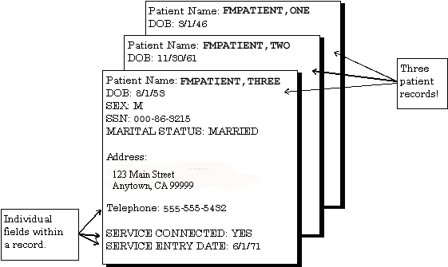

January 2017

Department of Veterans Affairs (VA)

Office of Information and Technology (OI&T)

Enterprise Program Management Office (EPMO)

Revision History

<table>
<caption>
Table 1:
Documentation Symbol Descriptions
</caption>
<colgroup>
<col style="width: 13%" />
<col style="width: 11%" />
<col style="width: 46%" />
<col style="width: 28%" />
</colgroup>
<thead>
<tr class="header">
<th>Date</th>
<th>Revision</th>
<th>Description</th>
<th>Author</th>
</tr>
<tr class="odd">
<th>11/29/2016</th>
<th>1.3</th>
<th>
Changes to support release of Patch DI*22.2*4:

<ul>
<li>
Updated Section <a
href="file:///C:\Users\vacokiciet\AppData\Local\Microsoft\Windows\Temporary%20Internet%20Files\Content.IE5\AG7LO87F\PRINT_FIELD:#_"><u>4.2.2.2</u></a>
to reflect change in behavior of computed expressions as print
fields.
</li>
<li>
Added Section <a
href="#start-with-and-go-to-sort-values">4.2.2.5</a>.
</li>
<li>
Updated Figure numbering from Figure 78 onward and corresponding
cross-references.
</li>
<li>
Updated ToC, LoF and LoT.
</li>
</ul></th>
<th><strong>REDACTED</strong></th>
</tr>
</thead>
<tbody>
<tr class="odd">
<td>01/17/2017</td>
<td>1.4</td>
<td>
Changes for patch DI*22.2*2.

<ul>
<li>
Updated Section 9.2.2. Added eight new data types to <u>Table
91</u>.
</li>
<li>
Added Sections <u>9.2.12</u> – <u>9.2.19</u>
</li>
<li>
Updated Section <u>9.3</u>. Added eight new data types.
</li>
<li>
Added Sections <u>9.8.9</u> – <u>9.8.16</u>.
</li>
<li>
Added Section <u>17</u> – Meta Data Dictionary.
</li>
</ul></td>
<td>REDACTED</td>
</tr>
<tr class="even">
<td>09/26/2016</td>
<td>1.2</td>
<td>
Tech Edit:

<ul>
<li>
Updated document for Section 508 conformance.
</li>
<li>
Updated user entries in <u>Figure 93</u> and <u>Figure
94</u>.
</li>
<li>
Updated Section <u>8.4</u> and removed PII from <u>Figure
112</u>.
</li>
<li>
Updated Section <u>8.5</u> and user entries in <u>Figure 113</u>
and <u>Figure 114</u>.
</li>
<li>
Added/Updated Section <u>11.2.4</u> and <u>Figure
231</u>.
</li>
<li>
Added/Updated Section <u>11.2.5</u> and <u>Figure
232</u>.
</li>
<li>
Added/Updated Section <u>11.2.6</u> and <u>Figure
233</u>.
</li>
<li>
Updated “<a href="#_Toc446123570">Glossary</a>” table
entries.
</li>
<li>
Updated document styles and formatting to follow current
documentation standards and style guidelines.
</li>
</ul></td>
<td>REDACTED</td>
</tr>
<tr class="odd">
<td>09/15/2016</td>
<td>1.1</td>
<td>
Changes to support release of Patch DI*22.2*3:

<ul>
<li>
Note regarding output device added to Section <u>1.3.2</u> (How
to Export Data).
</li>
<li>
Note regarding Option setup added to Section <u>10.1</u> (Verify
Fields).
</li>
<li>
Note regarding auditing of the Description and Technical
Description fields added to Section <u>11.2</u> (Auditing a Data
Dictionary).
</li>
</ul></td>
<td><ul>
<li>
REDACTED
</li>
</ul></td>
</tr>
<tr class="even">
<td>08/03/2016</td>
<td>1.0</td>
<td>Initial release of VA FileMan 22.2 Advanced User Manual.</td>
<td><ul>
<li>
VA FileMan 22.2 Development Team
</li>
</ul></td>
</tr>
</tbody>
</table>

Table 1: Documentation
Symbol Descriptions

 **REF:** For the
current patch history related to this software, see the Patch Module
(i.e., Patch User Menu \[A1AE USER\]) on FORUM.

Table of Contents

[Revision History [ii](#_Toc472601833)](#_Toc472601833)

[List of Figures [xi](#_Toc472601834)](#_Toc472601834)

[List of Tables [xix](#_Toc472601835)](#_Toc472601835)

[Orientation [xxii](#_Hlt446130591)](#_Hlt446130591)

[1 Import and Export Tools [1](#_Toc472601837)](#_Toc472601837)

[1.1 What Applications Can You Exchange Data With?
[1](#what-applications-can-you-exchange-data-with)](#what-applications-can-you-exchange-data-with)

[1.2 How Data is Moved between Applications
[1](#how-data-is-moved-between-applications)](#how-data-is-moved-between-applications)

[1.3 Dependency on Correct Data Communication
[2](#dependency-on-correct-data-communication)](#dependency-on-correct-data-communication)

[1.3.1 Data Formats [2](#data-formats)](#data-formats)

[1.3.2 How to Export Data [4](#how-to-export-data)](#how-to-export-data)

[1.3.3 How to Import Data
[16](#how-to-import-data)](#how-to-import-data)

[1.3.4 Foreign Formats [22](#foreign-formats)](#foreign-formats)

[2 Relational Navigation [34](#_Toc472601845)](#_Toc472601845)

[2.1 Simple Extended Pointer
[35](#simple-extended-pointer)](#simple-extended-pointer)

[2.1.1 Simple Extended Pointer Syntax (Short form)
[36](#simple-extended-pointer-syntax-short-form)](#simple-extended-pointer-syntax-short-form)

[2.1.2 Simple Extended Pointer Syntax (Long Form)
[36](#simple-extended-pointer-syntax-long-form)](#simple-extended-pointer-syntax-long-form)

[2.1.3 Examples [37](#examples)](#examples)

[2.1.4 How to Navigate With a Variable Pointer Field
[37](#how-to-navigate-with-a-variable-pointer-field)](#how-to-navigate-with-a-variable-pointer-field)

[2.2 Relational Jumps across Files
[38](#relational-jumps-across-files)](#relational-jumps-across-files)

[2.3 Backward Extended Pointer
[40](#backward-extended-pointer)](#backward-extended-pointer)

[2.4 Join Extended Pointer
[42](#join-extended-pointer)](#join-extended-pointer)

[2.4.1 Limitations [42](#limitations)](#limitations)

[2.4.2 Example [43](#example)](#example)

[2.5 Multiline Return Values
[43](#multiline-return-values)](#multiline-return-values)

[2.5.1 WORD-PROCESSING Field
[44](#word-processing-field)](#word-processing-field)

[2.5.2 Multiples [44](#multiples)](#multiples)

[2.5.3 Backward Pointer [45](#backward-pointer)](#backward-pointer)

[3 Advanced Edit Techniques
[47](#advanced-edit-techniques)](#advanced-edit-techniques)

[3.1 Field Value Stuffing
[47](#field-value-stuffing)](#field-value-stuffing)

[3.1.1 Set Field Default (2 //)
[47](#set-field-default-2)](#set-field-default-2)

[3.1.2 Stuff/Delete Field Value (3///)
[47](#stuffdelete-field-value-3)](#stuffdelete-field-value-3)

[3.1.3 Unvalidated Stuffs: (4////)
[48](#unvalidated-stuffs-4)](#unvalidated-stuffs-4)

[3.1.4 Variable Stuffs [48](#variable-stuffs)](#variable-stuffs)

[3.1.5 WORD-PROCESSING Field Stuffing
[49](#word-processing-field-stuffing)](#word-processing-field-stuffing)

[3.1.6 Looping (^LOOP) [49](#looping-loop)](#looping-loop)

[3.2 INPUT Templates [51](#input-templates)](#input-templates)

[3.2.1 Overview [51](#overview)](#overview)

[3.2.2 Branching within INPUT Templates
[52](#branching-within-input-templates)](#branching-within-input-templates)

[3.3 Edit Qualifiers [55](#edit-qualifiers)](#edit-qualifiers)

[3.3.1 Edit Qualifiers and Customizing Data Editing
[55](#edit-qualifiers-and-customizing-data-editing)](#edit-qualifiers-and-customizing-data-editing)

[3.3.2 Forcing Special Prompts
[55](#forcing-special-prompts)](#forcing-special-prompts)

[3.3.3 Duplicating Input Values
[56](#duplicating-input-values)](#duplicating-input-values)

[3.3.4 Forcing Required Input
[56](#forcing-required-input)](#forcing-required-input)

[3.4 Text Formatting in Word-processing Fields
[57](#text-formatting-in-word-processing-fields)](#text-formatting-in-word-processing-fields)

[3.4.1 Word Wrapping [57](#word-wrapping)](#word-wrapping)

[3.4.2 Tabs [57](#tabs)](#tabs)

[3.4.3 Formatting Text with Word-processing Windows (Frames) \| \|
[57](#formatting-text-with-word-processing-windows-frames)](#formatting-text-with-word-processing-windows-frames)

[3.4.4 Text Formatting Expressions in Word-processing Windows
[58](#text-formatting-expressions-in-word-processing-windows)](#text-formatting-expressions-in-word-processing-windows)

[4 Computed Expressions [60](#_Toc472601881)](#_Toc472601881)

[4.1 Syntax [60](#syntax)](#syntax)

[4.1.1 Elements of Computed Expressions
[60](#elements-of-computed-expressions)](#elements-of-computed-expressions)

[4.1.2 Operators in Computed Expressions
[61](#operators-in-computed-expressions)](#operators-in-computed-expressions)

[4.1.3 Data Types in Computed Expressions
[63](#data-types-in-computed-expressions)](#data-types-in-computed-expressions)

[4.1.4 Using Functions as Elements in Computed Expressions
[64](#using-functions-as-elements-in-computed-expressions)](#using-functions-as-elements-in-computed-expressions)

[4.2 Where to Use [65](#where-to-use)](#where-to-use)

[4.2.1 Using Computed Expressions in COMPUTED Fields
[65](#using-computed-expressions-in-computed-fields)](#using-computed-expressions-in-computed-fields)

[4.2.2 Where to Use Computed Expressions “On-the-Fly”
[67](#where-to-use-computed-expressions-on-the-fly)](#where-to-use-computed-expressions-on-the-fly)

[5 VA FileMan Functions [73](#_Toc472601890)](#_Toc472601890)

[5.1 How to Use VA FileMan Functions
[73](#how-to-use-va-fileman-functions)](#how-to-use-va-fileman-functions)

[5.2 Documentation Conventions for VA FileMan Functions
[73](#documentation-conventions-for-va-fileman-functions)](#documentation-conventions-for-va-fileman-functions)

[5.3 VA FileMan Function Categories
[74](#va-fileman-function-categories)](#va-fileman-function-categories)

[5.3.1 Date/Time Functions
[76](#datetime-functions)](#datetime-functions)

[5.3.2 Environmental Functions
[83](#environmental-functions)](#environmental-functions)

[5.3.3 File and File Data Functions
[86](#file-and-file-data-functions)](#file-and-file-data-functions)

[5.3.4 Mathematical Functions
[93](#mathematical-functions)](#mathematical-functions)

[5.3.5 Printing Related Functions
[96](#printing-related-functions)](#printing-related-functions)

[5.3.6 String Functions [97](#string-functions)](#string-functions)

[5.3.7 Temporary Data Storage Functions
[100](#temporary-data-storage-functions)](#temporary-data-storage-functions)

[5.3.8 M-Related Functions
[102](#m-related-functions)](#m-related-functions)

[6 Statistics [110](#statistics)](#statistics)

[6.1 How to Generate Statistics from Reports
[110](#how-to-generate-statistics-from-reports)](#how-to-generate-statistics-from-reports)

[6.2 Descriptive Statistics
[110](#descriptive-statistics)](#descriptive-statistics)

[6.2.1 Initial Print [111](#initial-print)](#initial-print)

[6.2.2 Generating the Descriptive Statistics
[111](#generating-the-descriptive-statistics)](#generating-the-descriptive-statistics)

[6.3 Scattergram [112](#scattergram)](#scattergram)

[6.3.1 Initial Print [112](#initial-print-1)](#initial-print-1)

[6.3.2 Generating the Scattergram
[113](#generating-the-scattergram)](#generating-the-scattergram)

[6.4 Histogram [114](#histogram)](#histogram)

[7 System Management [117](#system-management)](#system-management)

[7.1 Setup [117](#setup)](#setup)

[7.1.1 Initialization [117](#initialization)](#initialization)

[7.1.2 Security [117](#security)](#security)

[7.2 Standalone VA FileMan
[118](#standalone-va-fileman)](#standalone-va-fileman)

[7.2.1 Device Handling for Standalone VA FileMan
[118](#device-handling-for-standalone-va-fileman)](#device-handling-for-standalone-va-fileman)

[7.2.2 NEW PERSON File for Standalone VA FileMan
[123](#new-person-file-for-standalone-va-fileman)](#new-person-file-for-standalone-va-fileman)

[7.3 ^%ZOSF Nodes [126](#zosf-nodes)](#zosf-nodes)

[7.3.1 Manually Setting ^%ZOSF Nodes
[126](#manually-setting-zosf-nodes)](#manually-setting-zosf-nodes)

[7.4 Alternate Editors [127](#alternate-editors)](#alternate-editors)

[7.4.1 Setting Up Alternate Editors
[127](#setting-up-alternate-editors)](#setting-up-alternate-editors)

[7.5 COMPILED ROUTINE File
[129](#compiled-routine-file)](#compiled-routine-file)

[7.5.1 COMPILED ROUTINE File Cleanup: ENRLS^DIOZ( )
[129](#compiled-routine-file-cleanup-enrlsdioz)](#compiled-routine-file-cleanup-enrlsdioz)

[7.6 Compare Data and Data Dictionaries cross Environments
[129](#compare-data-and-data-dictionaries-cross-environments)](#compare-data-and-data-dictionaries-cross-environments)

[7.6.1 Compare Data Dictionaries
[129](#compare-data-dictionaries)](#compare-data-dictionaries)

[7.6.2 Compare File Entries
[130](#compare-file-entries)](#compare-file-entries)

[8 List File Attributes [132](#_Toc472601927)](#_Toc472601927)

[8.1 List File Attributes Option
[132](#list-file-attributes-option)](#list-file-attributes-option)

[8.1.1 Brief Data Dictionary
[133](#brief-data-dictionary)](#brief-data-dictionary)

[8.1.2 Condensed Data Dictionary
[135](#condensed-data-dictionary)](#condensed-data-dictionary)

[8.1.3 Standard and Modified Standard Data Dictionaries
[138](#standard-and-modified-standard-data-dictionaries)](#standard-and-modified-standard-data-dictionaries)

[8.1.4 Custom-Tailored Data Dictionary
[141](#custom-tailored-data-dictionary)](#custom-tailored-data-dictionary)

[8.1.5 Templates Only Format
[144](#templates-only-format)](#templates-only-format)

[8.1.6 Global Map [144](#global-map)](#global-map)

[8.1.7 Indexes and Cross-references Only
[145](#indexes-and-cross-references-only)](#indexes-and-cross-references-only)

[8.1.8 Keys Only [146](#keys-only)](#keys-only)

[8.2 Map Pointer Relations Option
[146](#map-pointer-relations-option)](#map-pointer-relations-option)

[8.3 Check/Fix DD Structure Option
[147](#checkfix-dd-structure-option)](#checkfix-dd-structure-option)

[8.4 Find Pointers Into a File Option
[148](#find-pointers-into-a-file-option)](#find-pointers-into-a-file-option)

[8.5 Meta Data Dictionary
[150](#meta-data-dictionary)](#meta-data-dictionary)

[9 Creating Files and Fields
[153](#creating-files-and-fields)](#creating-files-and-fields)

[9.1 Creating a File [153](#creating-a-file)](#creating-a-file)

[9.1.1 Naming a New File [153](#naming-a-new-file)](#naming-a-new-file)

[9.2 Creating Fields [154](#creating-fields)](#creating-fields)

[9.2.1 Screen Mode Field Editing
[154](#screen-mode-field-editing)](#screen-mode-field-editing)

[9.2.2 Field Data Types [156](#field-data-types)](#field-data-types)

[9.2.3 DATE/TIME Data Type
[157](#datetime-data-type-1)](#datetime-data-type-1)

[9.2.4 NUMERIC Data Type [158](#numeric-data-type)](#numeric-data-type)

[9.2.5 SET OF CODES Data Type
[159](#set-of-codes-data-type)](#set-of-codes-data-type)

[9.2.6 FREE TEXT Data Type
[160](#free-text-data-type)](#free-text-data-type)

[9.2.7 WORD-PROCESSING Data Type
[161](#word-processing-data-type-1)](#word-processing-data-type-1)

[9.2.8 COMPUTED Data Type
[162](#computed-data-type)](#computed-data-type)

[9.2.9 POINTER TO A FILE Data Type
[163](#pointer-to-a-file-data-type)](#pointer-to-a-file-data-type)

[9.2.10 VARIABLE-POINTER Data Type
[164](#variable-pointer-data-type)](#variable-pointer-data-type)

[9.2.11 MUMPS Data Type [166](#mumps-data-type)](#mumps-data-type)

[9.2.12 BOOLEAN Data Type [166](#boolean-data-type)](#boolean-data-type)

[9.2.13 LABEL REFERENCE Data Type
[166](#label-reference-data-type)](#label-reference-data-type)

[9.2.14 TIME Data Type [167](#time-data-type)](#time-data-type)

[9.2.15 YEAR Data Type [167](#year-data-type)](#year-data-type)

[9.2.16 UNIVERSAL TIME Data Type
[167](#universal-time-data-type)](#universal-time-data-type)

[9.2.17 FT POINTER Data Type
[167](#ft-pointer-data-type)](#ft-pointer-data-type)

[9.2.18 FT DATE Data Type [167](#ft-date-data-type)](#ft-date-data-type)

[9.2.19 RATIO Data Type [167](#ratio-data-type)](#ratio-data-type)

[9.3 Multiple-Valued Field (Multiples)
[168](#multiple-valued-field-multiples)](#multiple-valued-field-multiples)

[9.4 Making a Field Mandatory
[169](#making-a-field-mandatory)](#making-a-field-mandatory)

[9.5 Field Number Sequences
[169](#field-number-sequences)](#field-number-sequences)

[9.6 NUMBER (.001) Field [169](#number-.001-field)](#number-.001-field)

[9.6.1 Forced Lookups Using Numbers
[170](#forced-lookups-using-numbers)](#forced-lookups-using-numbers)

[9.7 Changing and Deleting Fields
[171](#changing-and-deleting-fields)](#changing-and-deleting-fields)

[9.7.1 Changing Field Attributes
[171](#changing-field-attributes)](#changing-field-attributes)

[9.7.2 Changing a Field’s DATA TYPE Value
[174](#changing-a-fields-data-type-value)](#changing-a-fields-data-type-value)

[9.7.3 Deleting an Existing Field
[174](#deleting-an-existing-field)](#deleting-an-existing-field)

[9.8 Examples of File and Field Creation
[175](#examples-of-file-and-field-creation)](#examples-of-file-and-field-creation)

[9.8.1 File Creation [176](#file-creation)](#file-creation)

[9.8.2 DATE/TIME Fields [177](#datetime-fields)](#datetime-fields)

[9.8.3 SET OF CODES Field
[178](#set-of-codes-field)](#set-of-codes-field)

[9.8.4 FREE TEXT Field [179](#free-text-field)](#free-text-field)

[9.8.5 WORD-PROCESSING Field
[180](#word-processing-field-1)](#word-processing-field-1)

[9.8.6 COMPUTED Field [182](#computed-field)](#computed-field)

[9.8.7 POINTER TO A FILE Field
[183](#pointer-to-a-file-field)](#pointer-to-a-file-field)

[9.8.8 VARIABLE-POINTER Field
[184](#variable-pointer-field)](#variable-pointer-field)

[9.8.9 BOOLEAN Field [185](#boolean-field)](#boolean-field)

[9.8.10 LABEL REFERENCE Field
[185](#label-reference-field)](#label-reference-field)

[9.8.11 TIME Field [187](#time-field)](#time-field)

[9.8.12 YEAR Field [188](#year-field)](#year-field)

[9.8.13 UNIVERSAL TIME Field
[189](#universal-time-field)](#universal-time-field)

[9.8.14 FT POINTER Field [190](#ft-pointer-field)](#ft-pointer-field)

[9.8.15 FT DATE Field [190](#ft-date-field)](#ft-date-field)

[9.8.16 RATIO Field [191](#ratio-field)](#ratio-field)

[9.8.17 Creating a Multiple
[192](#creating-a-multiple)](#creating-a-multiple)

[10 File Utilities [196](#_Toc472601991)](#_Toc472601991)

[10.1 Verify Fields [196](#verify-fields)](#verify-fields)

[10.2 Cross-Reference a Field or File
[197](#cross-reference-a-field-or-file)](#cross-reference-a-field-or-file)

[10.2.1 Types of Traditional Cross-references
[198](#types-of-traditional-cross-references)](#types-of-traditional-cross-references)

[10.2.2 Edit a Traditional Cross-reference
[199](#edit-a-traditional-cross-reference)](#edit-a-traditional-cross-reference)

[10.2.3 Create a Traditional Cross-reference
[200](#create-a-traditional-cross-reference)](#create-a-traditional-cross-reference)

[10.2.4 Delete a Traditional Cross-reference
[200](#delete-a-traditional-cross-reference)](#delete-a-traditional-cross-reference)

[10.2.5 New-Style Cross-references
[201](#new-style-cross-references)](#new-style-cross-references)

[10.2.6 Edit a New-Style Cross-reference
[203](#edit-a-new-style-cross-reference)](#edit-a-new-style-cross-reference)

[10.2.7 Create a New-Style Cross-reference
[205](#create-a-new-style-cross-reference)](#create-a-new-style-cross-reference)

[10.2.8 Delete a New-Style Cross-reference
[207](#delete-a-new-style-cross-reference)](#delete-a-new-style-cross-reference)

[10.3 Identifier [207](#_Toc472602002)](#_Toc472602002)

[10.4 Re-Index File Option
[209](#re-index-file-option)](#re-index-file-option)

[10.4.1 Limits on Reindexing Files
[210](#limits-on-reindexing-files)](#limits-on-reindexing-files)

[10.5 INPUT Transform (Syntax)
[211](#input-transform-syntax)](#input-transform-syntax)

[10.6 Edit File [211](#edit-file)](#edit-file)

[10.7 OUTPUT Transform [214](#output-transform)](#output-transform)

[10.8 Template Edit [214](#template-edit)](#template-edit)

[10.9 Uneditable Data [219](#uneditable-data)](#uneditable-data)

[10.10 Mandatory/Required Field Check
[219](#mandatoryrequired-field-check)](#mandatoryrequired-field-check)

[10.11 Key Definition [219](#key-definition)](#key-definition)

[10.11.1 Create a Key [220](#create-a-key)](#create-a-key)

[10.11.2 Edit a Key [222](#edit-a-key)](#edit-a-key)

[10.11.3 Delete a Key [222](#delete-a-key)](#delete-a-key)

[10.11.4 Verify a Key [224](#verify-a-key)](#verify-a-key)

[11 Auditing [225](#_Toc472602016)](#_Toc472602016)

[11.1 Auditing a Data Field
[225](#auditing-a-data-field)](#auditing-a-data-field)

[11.1.1 Overview [226](#overview-1)](#overview-1)

[11.1.2 Setting a Data Field Audit
[226](#setting-a-data-field-audit)](#setting-a-data-field-audit)

[11.1.3 Turning Data Field Audit On/Off
[227](#turning-data-field-audit-onoff)](#turning-data-field-audit-onoff)

[11.1.4 Reviewing the Data Field Audit Trail
[228](#reviewing-the-data-field-audit-trail)](#reviewing-the-data-field-audit-trail)

[11.1.5 Tracking Data Field Audits
[230](#tracking-data-field-audits)](#tracking-data-field-audits)

[11.1.6 Purging a Data Field Audit Trail
[230](#purging-a-data-field-audit-trail)](#purging-a-data-field-audit-trail)

[11.2 Auditing a Data Dictionary
[232](#auditing-a-data-dictionary)](#auditing-a-data-dictionary)

[11.2.1 Setting Automatic Data Dictionary Auditing
[232](#setting-automatic-data-dictionary-auditing)](#setting-automatic-data-dictionary-auditing)

[11.2.2 Reviewing the Data Dictionary Audit Trail
[232](#reviewing-the-data-dictionary-audit-trail)](#reviewing-the-data-dictionary-audit-trail)

[11.2.3 Purging a Data Dictionary Audit Trail
[234](#purging-a-data-dictionary-audit-trail)](#purging-a-data-dictionary-audit-trail)

[11.2.4 Auditable Word Processing Fields
[236](#auditable-word-processing-fields)](#auditable-word-processing-fields)

[11.2.5 Word Processing Fields Can be Made Uneditable
[236](#word-processing-fields-can-be-made-uneditable)](#word-processing-fields-can-be-made-uneditable)

[11.2.6 Reviewing a User’s Data Access
[237](#reviewing-a-users-data-access)](#reviewing-a-users-data-access)

[12 Data Security [238](#_Toc472602031)](#_Toc472602031)

[12.1 Security at the File Level
[238](#security-at-the-file-level)](#security-at-the-file-level)

[12.1.1 Access Code Security on Files
[238](#access-code-security-on-files)](#access-code-security-on-files)

[12.1.2 File Access Security (Formerly Part 3 of Kernel)
[239](#file-access-security-formerly-part-3-of-kernel)](#file-access-security-formerly-part-3-of-kernel)

[12.2 Protection for Fields in a File
[240](#protection-for-fields-in-a-file)](#protection-for-fields-in-a-file)

[12.3 Protection for Templates
[240](#protection-for-templates)](#protection-for-templates)

[13 Transferring File Entries
[241](#transferring-file-entries)](#transferring-file-entries)

[13.1 Transfer File Entries Option
[241](#transfer-file-entries-option)](#transfer-file-entries-option)

[13.1.1 Transferring Data within the Same File
[242](#transferring-data-within-the-same-file)](#transferring-data-within-the-same-file)

[13.1.2 Transferring Entries between Files
[244](#transferring-entries-between-files)](#transferring-entries-between-files)

[13.1.3 Transferring Entries into a New File
[245](#transferring-entries-into-a-new-file)](#transferring-entries-into-a-new-file)

[13.2 Compare/Merge File Entries Option
[246](#comparemerge-file-entries-option)](#comparemerge-file-entries-option)

[13.2.1 Comparing Entries [246](#comparing-entries)](#comparing-entries)

[13.2.2 Merging Entries [247](#merging-entries)](#merging-entries)

[14 Extract Tool [253](#_Toc472602045)](#_Toc472602045)

[14.1 Extract Overview [253](#extract-overview)](#extract-overview)

[14.2 Important Items to Note
[253](#important-items-to-note)](#important-items-to-note)

[14.2.1 Source File [254](#source-file)](#source-file)

[14.2.2 Destination File [254](#destination-file)](#destination-file)

[14.3 Mapping Information
[255](#mapping-information)](#mapping-information)

[14.4 ARCHIVAL ACTIVITY File
[256](#archival-activity-file)](#archival-activity-file)

[14.5 Extract Steps [257](#extract-steps)](#extract-steps)

[14.5.1 Select Entries to Extract Option (1 of 9)
[258](#select-entries-to-extract-option-1-of-9)](#select-entries-to-extract-option-1-of-9)

[14.5.2 Add/Delete Selected Entries Option (2 of 9)
[260](#adddelete-selected-entries-option-2-of-9)](#adddelete-selected-entries-option-2-of-9)

[14.5.3 Print Selected Entries Option (3 of 9)
[261](#print-selected-entries-option-3-of-9)](#print-selected-entries-option-3-of-9)

[14.5.4 Modify Destination File Option (4 of 9)
[262](#modify-destination-file-option-4-of-9)](#modify-destination-file-option-4-of-9)

[14.5.5 Create Extract Template Option (5 of 9)
[263](#create-extract-template-option-5-of-9)](#create-extract-template-option-5-of-9)

[14.5.6 Update Destination File Option (6 of 9)
[265](#update-destination-file-option-6-of-9)](#update-destination-file-option-6-of-9)

[14.5.7 Purge Extracted Entries Option (7 of 9)
[267](#purge-extracted-entries-option-7-of-9)](#purge-extracted-entries-option-7-of-9)

[14.5.8 Cancel Extract Selection Option (8 of 9)
[268](#cancel-extract-selection-option-8-of-9)](#cancel-extract-selection-option-8-of-9)

[14.5.9 Validate Extract Template Option (9 of 9)
[269](#validate-extract-template-option-9-of-9)](#validate-extract-template-option-9-of-9)

[15 Filegrams [269](#filegrams)](#filegrams)

[15.1 FILEGRAM-type Templates
[270](#filegram-type-templates)](#filegram-type-templates)

[15.2 Filegram and Archiving Relationship
[270](#filegram-and-archiving-relationship)](#filegram-and-archiving-relationship)

[15.3 Using Filegrams [270](#using-filegrams)](#using-filegrams)

[15.4 Filegram Steps [271](#filegram-steps)](#filegram-steps)

[15.4.1 Create/Edit Filegram Template Option
[271](#createedit-filegram-template-option)](#createedit-filegram-template-option)

[15.4.2 Display Filegram Template Option
[273](#display-filegram-template-option)](#display-filegram-template-option)

[15.4.3 Specifiers Option [274](#specifiers-option)](#specifiers-option)

[15.4.4 Generate Filegram Option
[275](#generate-filegram-option)](#generate-filegram-option)

[15.4.5 Receiving Filegrams with MailMan
[276](#receiving-filegrams-with-mailman)](#receiving-filegrams-with-mailman)

[15.4.6 View Filegram Option
[277](#view-filegram-option)](#view-filegram-option)

[15.4.7 Install/Verify Filegram Option
[277](#installverify-filegram-option)](#installverify-filegram-option)

[15.4.8 Deleting a Filegram
[278](#deleting-a-filegram)](#deleting-a-filegram)

[16 Archiving [279](#_Toc472602075)](#_Toc472602075)

[16.1 Considerations before Archiving
[279](#considerations-before-archiving)](#considerations-before-archiving)

[16.2 Archiving Process, including Archiving Options (1-9)
[281](#archiving-process-including-archiving-options-1-9)](#archiving-process-including-archiving-options-1-9)

[16.2.1 Select Entries to Archive
[281](#select-entries-to-archive)](#select-entries-to-archive)

[16.2.2 Add/Delete Selected Entries
[283](#adddelete-selected-entries)](#adddelete-selected-entries)

[16.2.3 Print Selected Entries
[284](#print-selected-entries)](#print-selected-entries)

[16.2.4 Create Filegram Archiving Template
[285](#create-filegram-archiving-template)](#create-filegram-archiving-template)

[16.2.5 Write Entries to Temporary Storage
[286](#write-entries-to-temporary-storage)](#write-entries-to-temporary-storage)

[16.2.6 Move Archived Data to Permanent Storage
[287](#move-archived-data-to-permanent-storage)](#move-archived-data-to-permanent-storage)

[16.2.7 Purge Stored Entries [289](#_Toc472602084)](#_Toc472602084)

[16.2.8 Cancel Archival Selection
[290](#cancel-archival-selection)](#cancel-archival-selection)

[16.2.9 Find Archived Entries
[291](#find-archived-entries)](#find-archived-entries)

[16.2.10 ARCHIVAL ACTIVITY File
[292](#archival-activity-file-1)](#archival-activity-file-1)

[17 Meta Data Dictionary
[293](#meta-data-dictionary-1)](#meta-data-dictionary-1)

[17.1 Overview [293](#overview-2)](#overview-2)

[17.2 ^DDD: Initial Creation
[293](#ddd-initial-creation)](#ddd-initial-creation)

[17.3 FILELIST^DDD: File List Partial Update
[294](#filelistddd-file-list-partial-update)](#filelistddd-file-list-partial-update)

[17.4 PARTIAL1^DDD: Partial Update using ^DIC(DDD,"%MSC")
[294](#partial1ddd-partial-update-using-dicdddmsc)](#partial1ddd-partial-update-using-dicdddmsc)

[17.5 PARTIAL2^DDD: Partial Update using ^DD(FILE,FIELD,"DT")
[294](#partial2ddd-partial-update-using-ddfilefielddt)](#partial2ddd-partial-update-using-ddfilefielddt)

[Glossary [294](#_Toc446123570)](#_Toc446123570)

[Index [306](#_Hlt446131684)](#_Hlt446131684)

List of Figures

[Figure 1: Import and Export Tools—Example of a record delimited by a
comma [2](#_Ref462325895)](#_Ref462325895)

[Figure 2: Import and Export Tools—Example of a file with records
delimited by a comma [2](#_Ref462325873)](#_Ref462325873)

[Figure 3: Import and Export Tools—Example of a record where the
delimiter between quotes is ignored [3](#_Ref462325850)](#_Ref462325850)

[Figure 4: Import and Export Tools—Example of a fixed-length record
[3](#_Ref462325815)](#_Ref462325815)

[Figure 5: Import and Export Tools—Example of a file with fixed-length
records [3](#_Ref462325785)](#_Ref462325785)

[Figure 6: Import and Export Tools—Data export options
[4](#_Ref446837180)](#_Ref446837180)

[Figure 7: Import and Export Tools—Creating the Selected Exported Fields
template [7](#_Ref446839887)](#_Ref446839887)

[Figure 8: Import and Export Tools—Creating the Export template
[9](#_Toc342980612)](#_Toc342980612)

[Figure 9: Import and Export Tools—Identifying the Foreign Format and
Export templates [9](#_Ref446997026)](#_Ref446997026)

[Figure 10: Import and Export Tools—Entering DATA TYPE field values in
an Export template [10](#_Ref446997038)](#_Ref446997038)

[Figure 11: Import and Export Tools—Searching for entries to be exported
[12](#_Ref389629584)](#_Ref389629584)

[Figure 12: Import and Export Tools—Choosing a device to send exported
data [12](#_Toc342980617)](#_Toc342980617)

[Figure 13: Import and Export Tools—Example of exported data
[14](#_Toc342980618)](#_Toc342980618)

[Figure 14: Import and Export Tools—Example of data flattening when
exporting data from Multiples [14](#_Ref462325620)](#_Ref462325620)

[Figure 15: Import and Export Tools—Example of a file structure
[15](#_Ref389633121)](#_Ref389633121)

[Figure 16: Import and Export Tools—Import Data option
[16](#_Ref447007539)](#_Ref447007539)

[Figure 17: Import and Export Tools—Example of a completed Data Import
form [17](#_Ref343503185)](#_Ref343503185)

[Figure 18: Import and Export Tools—Example of fields selected for
import [18](#_Ref343503194)](#_Ref343503194)

[Figure 19: Import and Export Tools—Exiting the Template form and
performing the import [19](#_Ref462325498)](#_Ref462325498)

[Figure 20: Import and Export Tools—Example of an Import Results report
[20](#_Ref342484948)](#_Ref342484948)

[Figure 21: Import and Export Tools—Example of fields selected for
import to a Multiple [21](#_Ref343503204)](#_Ref343503204)

[Figure 22: Import and Export Tools—Example of data *not* flattened when
importing data to a Multiple [21](#_Toc342980627)](#_Toc342980627)

[Figure 23: Import and Export Tools—Verifying the maximum record length
on a VMS system [22](#_Ref389633166)](#_Ref389633166)

[Figure 24: Import and Export Tools—Using VA FileMan functions when
exporting data [27](#_Toc342980629)](#_Toc342980629)

[Figure 25: Import and Export Tools—Print Format Documentation option
[28](#_Toc342980630)](#_Toc342980630)

[Figure 26: Import and Export Tools—Listing FOREIGN FORMAT file entries
using the Print Format Documentation option
[29](#_Ref462325309)](#_Ref462325309)

[Figure 27: Import and Export Tools—Define Foreign File Format option
[30](#_Toc342980632)](#_Toc342980632)

[Figure 28: Import and Export Tools—Choosing the Define Foreign Format
option [30](#_Ref389629618)](#_Ref389629618)

[Figure 29: Import and Export Tools—Selecting an existing FOREIGN FORMAT
file entry [31](#_Ref342485832)](#_Ref342485832)

[Figure 30: Import and Export Tools—Viewing the contents of a FOREIGN
FORMAT file entry [31](#_Ref342485882)](#_Ref342485882)

[Figure 31: Import and Export Tools—Creating a new FOREIGN FORMAT file
entry [31](#_Toc342980636)](#_Toc342980636)

[Figure 32: Import and Export Tools—ScreenMan form for editing foreign
formats [32](#_Ref343503212)](#_Ref343503212)

[Figure 33: Import and Export Tools—Second page of a Multiple’s with a
“popup” window opened [33](#_Ref343503221)](#_Ref343503221)

[Figure 34: Relational Navigation—Example Illustrating Relational
Navigation [34](#_Toc472602129)](#_Toc472602129)

[Figure 35: Relational Navigation—Example of a simple extended pointer
[35](#_Toc342980640)](#_Toc342980640)

[Figure 36: Relational Navigation—Example of a relational query
[37](#_Ref462325096)](#_Ref462325096)

[Figure 37: Relational Navigation—Example of the short form extended
Pointer syntax [37](#_Toc342980642)](#_Toc342980642)

[Figure 38: Relational Navigation—Entering print specifications and
including fields in pointed-to files
[38](#_Ref389629668)](#_Ref389629668)

[Figure 39: Relational Navigation—Example of output that includes fields
from pointed-to files [38](#_Ref389633231)](#_Ref389633231)

[Figure 40: Relational Navigation—Using relational jumps with the Enter
or Edit File Entries option [39](#_Toc342980646)](#_Toc342980646)

[Figure 41: Relational Navigation—Example illustrating a file with
pointers to another file [40](#_Ref343503121)](#_Ref343503121)

[Figure 42: Relational Navigation—Example using a backward extended
pointer [41](#_Toc342980648)](#_Toc342980648)

[Figure 43: Relational Navigation—Example of the output produced after
using a backward extended pointer [41](#_Ref389629696)](#_Ref389629696)

[Figure 44: Relational Navigation—Using a value from one file to do a
lookup in a second file [42](#_Toc342980650)](#_Toc342980650)

[Figure 45: Relational Navigation—Example of matching entries in two
files using the SORT BY field [43](#_Ref389633266)](#_Ref389633266)

[Figure 46: Relational Navigation—Example of using a WORD-PROCESSING
field in an extended pointer expression
[44](#_Toc342980652)](#_Toc342980652)

[Figure 47: Relational Navigation—Example of using the simple pointer
syntax to get data from a Multiple [44](#_Ref462324917)](#_Ref462324917)

[Figure 48: Relational Navigation—Example using a cross-referenced
backward pointer to yield a multiline response: Stored in an Input
template [45](#_Ref389631047)](#_Ref389631047)

[Figure 49: Relational Navigation—Example using an Input template with a
cross-referenced backward pointer to yield a multiline response
[45](#_Toc342980655)](#_Toc342980655)

[Figure 50: Advanced Edit Techniques—Setting a default value for a field
[47](#_Toc342980656)](#_Toc342980656)

[Figure 51: Advanced Edit Techniques—”Stuffing” a value into a field in
the database [47](#_Toc342980657)](#_Toc342980657)

[Figure 52: Advanced Edit Techniques—Deleting a value from a field in
the database [47](#_Toc342980658)](#_Toc342980658)

[Figure 53: Advanced Edit Techniques—Warning message when deleting a
value from a field in the database [47](#_Ref389633307)](#_Ref389633307)

[Figure 54: Advanced Edit Techniques—”Stuffing” default value into a
field in the database—Bypassing INPUT Transform
[48](#_Toc342980660)](#_Toc342980660)

[Figure 55: Advanced Edit Techniques—Example of “Stuffing” a variable
default value into a field in the database
[48](#_Ref462324753)](#_Ref462324753)

[Figure 56: Advanced Edit Techniques—Appending text on to a
WORD-PROCESSING field value [49](#_Ref389633348)](#_Ref389633348)

[Figure 57: Advanced Edit Techniques—Example of “Looping” through
entries in a file [50](#_Ref389631074)](#_Ref389631074)

[Figure 58: Advanced Edit Techniques—Example of loading data into a
newly created field for select records
[50](#_Ref462326558)](#_Ref462326558)

[Figure 59: Advanced Edit Techniques—Example of deleting data from a
newly created field for select records
[51](#_Toc342980665)](#_Toc342980665)

[Figure 60: Advanced Edit Techniques—Storing a list of edit fields in an
INPUT template [51](#_Ref389629724)](#_Ref389629724)

[Figure 61: Advanced Edit Techniques—Creating a special INPUT template
[52](#_Toc342980667)](#_Toc342980667)

[Figure 62: Advanced Edit Techniques—Defining INPUT template to branch
to different field based on another field’s value (1 of 2)
[53](#_Ref462326559)](#_Ref462326559)

[Figure 63: Advanced Edit Techniques—Defining INPUT template to branch
to different field based on another field’s value (2 of 2)
[53](#_Ref462326560)](#_Ref462326560)

[Figure 64: Advanced Edit Techniques—Example verifying automatic
branching to other fields based on user’s entry (1 of 2)
[54](#_Ref462326561)](#_Ref462326561)

[Figure 65: Advanced Edit Techniques—Example verifying automatic
branching to other fields based on user’s entry (2 of 2)
[54](#_Ref462326562)](#_Ref462326562)

[Figure 66: Advanced Edit Techniques—Example using the Title Edit
Qualifier [56](#_Toc342980673)](#_Toc342980673)

[Figure 67: Advanced Edit Techniques—Example Using the Duplicate Edit
Qualifier [56](#_Toc342980674)](#_Toc342980674)

[Figure 68: Advanced Edit Techniques—Example using the required Edit
Qualifier [56](#_Ref462326563)](#_Ref462326563)

[Figure 69: Computed Expressions—Example using the Print File Entries
Option to identify a caption [63](#_Ref462326566)](#_Ref462326566)

[Figure 70: Computed Expressions—Defining a DATA TYPE field as COMPUTED
[65](#_Toc342980681)](#_Toc342980681)

[Figure 71: Computed Expressions—Entering the computed expression into a
DATA TYPE field of COMPUTED [65](#_Toc342980682)](#_Toc342980682)

[Figure 72: Computed Expressions—Example of dialogue encountered with a
COMPUTED field with expected numeric result (1 of 3)
[65](#_Ref389633654)](#_Ref389633654)

[Figure 73: Computed Expressions—Example of dialogue encountered with a
COMPUTED field with expected numeric result (2 of 3)
[66](#_Toc342980684)](#_Toc342980684)

[Figure 74: Computed Expressions—Example of dialogue encountered with a
COMPUTED field with expected numeric result (3 of 3)
[66](#_Toc342980685)](#_Toc342980685)

[Figure 75: Computed Expressions—Dialogue encountered when defining a
COMPUTED field [67](#_Toc342980687)](#_Toc342980687)

[Figure 76: Computed Expressions—Entering a computed expression at a
“PRINT FIELD” prompt [68](#_Toc342980688)](#_Toc342980688)

[Figure 77: Computed Expressions—Entering a computed expression at a
“SORT BY” prompt [69](#_Toc342980689)](#_Toc342980689)

[Figure 78: Computed Expressions—Entering a computed expression at the
“Start with” and/or “Go to” prompt [70](#_Toc472602173)](#_Toc472602173)

[Figure 79: Computed Expressions—”Stuffing” a value in a field via a
computed expression [70](#_Toc342980690)](#_Toc342980690)

[Figure 80: Computed Expressions—Entering a computed expression in an
OUTPUT transform [71](#_Toc342980691)](#_Toc342980691)

[Figure 81: Computed Expressions—Entering a computed expression in an
OUTPUT transform attached to a field
[71](#_Toc342980692)](#_Toc342980692)

[Figure 82: Computed Expressions—Example of the result of an OUTPUT
transform with a computed expression
[71](#_Toc342980693)](#_Toc342980693)

[Figure 83: Computed Expressions—A \|Window\| with a computed expression
[71](#_Toc342980694)](#_Toc342980694)

[Figure 84: Computed Expressions—Example of the result of a \|Window\|
with a computed expression [72](#_Toc342980695)](#_Toc342980695)

[Figure 85: Statistics—Initial print dialogue with descriptive
statistics [111](#_Ref343503232)](#_Ref343503232)

[Figure 86: Statistics—Generating the descriptive statistics
[111](#_Toc342980769)](#_Toc342980769)

[Figure 87: Statistics—Initial print dialogue for a Scattergram
[112](#_Ref343503242)](#_Ref343503242)

[Figure 88: Statistics—Generating dialogue and sample output of a
Scattergram [113](#_Ref343503257)](#_Ref343503257)

[Figure 89: Statistics—Initial print dialogue for a Count Histogram
[115](#_Ref343503267)](#_Ref343503267)

[Figure 90: Statistics—Generating the Count Histogram diagram
[116](#_Toc472602185)](#_Toc472602185)

[Figure 91: System Management—Example of creating an ALTERNATE EDITOR
file entry [127](#_Ref389631133)](#_Ref389631133)

[Figure 92: System Management—Example where the User is prompted to
choose an Alternate Editor [129](#_Toc342980781)](#_Toc342980781)

[Figure 93: System Management—Example where the User selects to Compare
Data Dictionaries [129](#_Ref462323961)](#_Ref462323961)

[Figure 94: System Management—Example Namespace Compare File Entries
[131](#_Ref462323970)](#_Ref462323970)

[Figure 95: List File Attributes—File Attribute Listing format choices
[133](#_Toc342980782)](#_Toc342980782)

[Figure 96: List File Attributes—Choosing to display the Brief Listing
[133](#_Ref462323654)](#_Ref462323654)

[Figure 97: List File Attributes—Example of a Brief Data Dictionary
Listing [134](#_Ref389629849)](#_Ref389629849)

[Figure 98: List File Attributes—Example of a Condensed Data Dictionary
Listing [135](#_Ref389631171)](#_Ref389631171)

[Figure 99: List File Attributes—Example of a Standard Data Dictionary
Listing [138](#_Ref447512027)](#_Ref447512027)

[Figure 100: List File Attributes—Choosing the Modified Standard Data
Dictionary Listing [140](#_Ref389634271)](#_Ref389634271)

[Figure 101: List File Attributes—Choosing the Custom-Tailored Data
Dictionary Listing [141](#_Ref462323562)](#_Ref462323562)

[Figure 102: List File Attributes—Choosing from a list of field
attributes [142](#_Ref462323489)](#_Ref462323489)

[Figure 103: List File Attributes—Help on print formatting in the
Custom-Tailored Data Dictionary Listing
[143](#_Ref462323455)](#_Ref462323455)

[Figure 104: List File Attributes—Selecting the field attributes to
print [143](#_Toc342980792)](#_Toc342980792)

[Figure 105: List File Attributes—Example of a Custom-Tailored Data
Dictionary Listing [143](#_Ref462323412)](#_Ref462323412)

[Figure 106: List File Attributes—Example of a Global Map Data
Dictionary Listing [144](#_Ref389629905)](#_Ref389629905)

[Figure 107: List File Attributes—Example of an Indexes and
Cross-References Only Data Dictionary Listing
[145](#_Ref389629928)](#_Ref389629928)

[Figure 108: List File Attributes—Example of a Keys Only Data Dictionary
Listing [146](#_Ref389629952)](#_Ref389629952)

[Figure 109: List File Attributes—Example of the dialogue encountered
when using the Map Pointer Relations option
[146](#_Ref389723160)](#_Ref389723160)

[Figure 110: List File Attributes—Example of the output produced with
the Map Pointer Relations option [147](#_Toc342980798)](#_Toc342980798)

[Figure 111: List File Attributes—Example of dialogue and output
encountered when using Check/Fix DD Structure option
[148](#_Ref447515755)](#_Ref447515755)

[Figure 112: Data Dictionary Utilities—Example of dialogue and output
encountered when using the Find Pointers Into a File option
[149](#_Ref462323174)](#_Ref462323174)

[Figure 113: List File Attributes—Example setting up the Meta Data
Dictionary [150](#_Ref462322372)](#_Ref462322372)

[Figure 114: List File Attributes—Example Meta Data Dictionary
[151](#_Ref462322872)](#_Ref462322872)

[Figure 115: Creating Files and Fields—Choosing Screen Mode when using
the Modify File Attributes option [154](#_Ref389631203)](#_Ref389631203)

[Figure 116: Creating Files and Fields—Example using the Modify File
Attributes option in Screen Mode [155](#_Ref343503280)](#_Ref343503280)

[Figure 117: Creating Files and Fields—Defining a DATA TYPE field value
as DATE/TIME in Scrolling Mode (1 of 2)
[157](#_Ref389634454)](#_Ref389634454)

[Figure 118: Creating Files and Fields—Defining a DATA TYPE field value
as DATE/TIME in Scrolling Mode (2 of 2)
[157](#_Toc342980804)](#_Toc342980804)

[Figure 119: Creating Files and Fields—Defining a DATA TYPE field value
as NUMERIC in Scrolling Mode (1 of 2)
[158](#_Ref389634492)](#_Ref389634492)

[Figure 120: Creating Files and Fields—Defining a DATA TYPE field value
as NUMERIC in Scrolling Mode (2 of 2)
[158](#_Toc342980806)](#_Toc342980806)

[Figure 121: Creating Files and Fields—Defining a DATA TYPE field value
as SET OF CODES in Scrolling Mode [159](#_Ref349139780)](#_Ref349139780)

[Figure 122: Creating Files and Fields—Defining a DATA TYPE field value
as FREE TEXT in Scrolling Mode (1 of 3)
[160](#_Ref389634549)](#_Ref389634549)

[Figure 123: Creating Files and Fields—Defining a DATA TYPE field value
as FREE TEXT in Scrolling Mode (2 of 3)
[160](#_Toc342980809)](#_Toc342980809)

[Figure 124: Creating Files and Fields—Defining a DATA TYPE field value
as FREE TEXT in Scrolling Mode (3 of 3)
[160](#_Toc342980810)](#_Toc342980810)

[Figure 125: Creating Files and Fields—Defining a DATA TYPE field value
as WORD-PROCESSING in Scrolling Mode
[161](#_Ref389634584)](#_Ref389634584)

[Figure 126: Creating Files and Fields—Defining a DATA TYPE field value
as COMPUTED in Scrolling Mode (1 of 2)
[162](#_Ref389634612)](#_Ref389634612)

[Figure 127: Creating Files and Fields—Defining a DATA TYPE field value
as COMPUTED in Scrolling Mode (2 of 2)
[162](#_Toc342980813)](#_Toc342980813)

[Figure 128: Creating Files and Fields—Defining a DATA TYPE field value
as POINTER TO A FILE in Scrolling Mode (1 of 3)
[163](#_Ref389634646)](#_Ref389634646)

[Figure 129: Creating Files and Fields—Defining a DATA TYPE field value
as POINTER TO A FILE in Scrolling Mode (2 of 3)
[163](#_Toc342980815)](#_Toc342980815)

[Figure 130: Creating Files and Fields—Defining a DATA TYPE field value
as POINTER TO A FILE in Scrolling Mode (3 of 3)
[163](#_Toc342980816)](#_Toc342980816)

[Figure 131: Creating Files and Fields—Defining a DATA TYPE field value
as VARIABLE-POINTER in Scrolling Mode (1 of 5)
[164](#_Ref389634676)](#_Ref389634676)

[Figure 132: Creating Files and Fields—Defining a DATA TYPE field value
as VARIABLE-POINTER in Scrolling Mode (2 of 5)
[164](#_Toc342980818)](#_Toc342980818)

[Figure 133: Creating Files and Fields—Defining a DATA TYPE field value
as VARIABLE-POINTER in Scrolling Mode (3 of 5)
[165](#_Toc342980819)](#_Toc342980819)

[Figure 134: Creating Files and Fields—Defining a DATA TYPE field value
as VARIABLE-POINTER in Scrolling Mode (4 of 5)
[165](#_Toc342980820)](#_Toc342980820)

[Figure 135: Creating Files and Fields—Defining a DATA TYPE field value
as VARIABLE-POINTER in Scrolling Mode (5 of 5)
[165](#_Toc342980821)](#_Toc342980821)

[Figure 136: Creating Files and Fields—Example of help associated with a
VARIABLE-POINTER field [165](#_Ref389634706)](#_Ref389634706)

[Figure 137: Creating Files and Fields—Example of “sequencing” a field
[169](#_Toc342980823)](#_Toc342980823)

[Figure 138: Creating Files and Fields—Creating a NUMBER (#.001) field
[169](#_Ref452359320)](#_Ref452359320)

[Figure 139: Creating Files and Fields—Example of creating a new file
entry with a .001 field defined [170](#_Toc342980825)](#_Toc342980825)

[Figure 140: Creating Files and Fields—Looking up an entry in a file
using the IEN [170](#_Toc342980826)](#_Toc342980826)

[Figure 141: Creating Files and Fields—Looking up an entry in a file
using the FMPATIENT, 5’s IEN [170](#_Toc472602236)](#_Toc472602236)

[Figure 142: Creating Files and Fields—Looking up an entry in a file
using the IEN TEST, PHARMACY [170](#_Toc472602237)](#_Toc472602237)

[Figure 143: Editing a Field—LABEL, TITLE, and AUDIT attributes
[171](#_Toc342980827)](#_Toc342980827)

[Figure 144: Editing a Field—ACCESS Privileges attributes
[172](#_Toc342980828)](#_Toc342980828)

[Figure 145: Editing a Field—SOURCE, DESTINATION, GROUP attributes
[172](#_Toc342980829)](#_Toc342980829)

[Figure 146: Editing a Field—DESCRIPTION attributes
[172](#_Toc342980830)](#_Toc342980830)

[Figure 147: Editing a Field—DATA TYPE, LENGTH, PATTERN MATCH, MANDATORY
‘HELP’ PROMPT attributes [172](#_Toc342980831)](#_Toc342980831)

[Figure 148: Editing a Field—Adding fields to a GROUP (1 of 2)
[173](#_Toc342980832)](#_Toc342980832)

[Figure 149: Editing a Field—Adding fields to a GROUP (2 of 2)
[173](#_Toc342980833)](#_Toc342980833)

[Figure 150: Editing a Field—Deleting a field and its definition
[174](#_Toc342980834)](#_Toc342980834)

[Figure 151: Modify File Attributes option—Creating a file
[176](#_Ref389631230)](#_Ref389631230)

[Figure 152: Modify File Attributes option—Defining the NAME (#.01)
field in Screen Mode [176](#_Ref343503291)](#_Ref343503291)

[Figure 153: Modify File Attributes option—Editing a DATE/TIME field in
Screen Mode [177](#_Ref389631258)](#_Ref389631258)

[Figure 154: Modify File Attributes option—Defining a DATA TYPE field as
DATE/TIME in Screen Mode [177](#_Ref343503302)](#_Ref343503302)

[Figure 155: Modify File Attributes option—Editing a SET OF CODES field
in Screen Mode [178](#_Ref389631290)](#_Ref389631290)

[Figure 156: Modify File Attributes option—Defining a DATA TYPE field as
SET OF CODES in Screen Mode [178](#_Ref343503312)](#_Ref343503312)

[Figure 157: Modify File Attributes option—Editing a FREE TEXT field in
Screen Mode [179](#_Ref389631351)](#_Ref389631351)

[Figure 158: Modify File Attributes option—Defining a Data Type as FREE
TEXT in Screen Mode [179](#_Ref343503321)](#_Ref343503321)

[Figure 159: Modify File Attributes option—Carets (“^”) in a FREE TEXT
field: Piece position [180](#_Toc342980843)](#_Toc342980843)

[Figure 160: Modify File Attributes option—Editing a WORD-PROCESSING
field in Screen Mode [180](#_Ref389631377)](#_Ref389631377)

[Figure 161: Modify File Attributes option—Defining a DATA TYPE field as
WORD-PROCESSING in Screen Mode [181](#_Ref184736193)](#_Ref184736193)

[Figure 162: Modify File Attributes option—Editing a COMPUTED field in
Screen Mode [182](#_Ref389631401)](#_Ref389631401)

[Figure 163: Modify File Attributes option—Defining a DATA TYPE field as
COMPUTED in Screen Mode [182](#_Ref343503362)](#_Ref343503362)

[Figure 164: Modify File Attributes option—Editing a POINTER TO A FILE
field in Screen Mode [183](#_Ref389631424)](#_Ref389631424)

[Figure 165: Modify File Attributes option—Defining a DATA TYPE field as
POINTER TO A FILE in Screen Mode [183](#_Ref343503374)](#_Ref343503374)

[Figure 166: Modify File Attributes option—Editing a VARIABLE-POINTER
field in Screen Mode [184](#_Ref389631450)](#_Ref389631450)

[Figure 167: Modify File Attributes option—Defining a DATA TYPE field as
VARIABLE-POINTER in Screen Mode [184](#_Ref343503386)](#_Ref343503386)

[Figure 168: Addition/Editing of a Field of Data Type BOOLEAN
[185](#_Ref472426568)](#_Ref472426568)

[Figure 169: Addition/Editing of a Field of Data Type LABEL REFERENCE
[186](#_Ref472426853)](#_Ref472426853)

[Figure 170: Addition/editing of a field of data type TIME
[187](#_Ref472427068)](#_Ref472427068)

[Figure 171: Addition/Editing of a Field of Data Type YEAR
[188](#_Ref472427412)](#_Ref472427412)

[Figure 172: Addition/Editing of a Field of Data Type UNIVERSAL TIME
[189](#_Ref472427514)](#_Ref472427514)

[Figure 173: Addition/Editing of a Field of Data Type FT POINTER
[190](#_Ref472427774)](#_Ref472427774)

[Figure 174: Addition/Editing of a Field of Data Type FT DATE
[191](#_Ref472428138)](#_Ref472428138)

[Figure 175: Addition/editing of a field of data type RATIO
[192](#_Ref472428473)](#_Ref472428473)

[Figure 176: Modify File Attributes option—Creating a Multiple in Screen
Mode [192](#_Ref389631502)](#_Ref389631502)

[Figure 177: Modify File Attributes option—Defining a DATA TYPE field as
a NUMERIC Multiple in Screen Mode [193](#_Ref343503395)](#_Ref343503395)

[Figure 178: Modify File Attributes option—Editing a Multiple’s Subfield
in Screen Mode [193](#_Toc342980854)](#_Toc342980854)

[Figure 179: Modify File Attributes option—Reviewing/Editing the
Properties of a Multiple Data Type Field in Screen Mode
[194](#_Ref343503405)](#_Ref343503405)

[Figure 180: Modify File Attributes option—Example of a .01 Subfield of
a Multiple [194](#_Ref389631528)](#_Ref389631528)

[Figure 181: Modify File Attributes option—Defining a Data Type field as
a NUMERIC Subfield in Screen Mode [195](#_Ref343503416)](#_Ref343503416)

[Figure 182: File Utilities—Editing a Traditional cross-reference (1 of
2) [199](#_Toc342980859)](#_Toc342980859)

[Figure 183: File Utilities—Editing a Traditional cross-reference (2 of
2) [199](#_Toc342980860)](#_Toc342980860)

[Figure 184: File Utilities—Creating a Traditional cross-reference
[200](#_Ref389634788)](#_Ref389634788)

[Figure 185: File Utilities—Deleting a Traditional cross-reference
[200](#_Ref389634816)](#_Ref389634816)

[Figure 186: File Utilities—Editing a New-Style cross-reference
[203](#_Toc342980864)](#_Toc342980864)

[Figure 187: File Utilities—Editing a New-Style cross-reference in
Screen Mode [204](#_Ref343502336)](#_Ref343502336)

[Figure 188: File Utilities—Creating a New-Style cross-reference
[205](#_Ref389634846)](#_Ref389634846)

[Figure 189: File Utilities—Creating a New-Style cross-reference in
Screen Mode [206](#_Ref343503425)](#_Ref343503425)

[Figure 190: File Utilities—Deleting a New-Style cross-reference
[207](#_Ref389634870)](#_Ref389634870)

[Figure 191: File Utilities—Example of setting a field as an identifier
[208](#_Toc342980869)](#_Toc342980869)

[Figure 192: File Utilities—Example of an identifier field displayed
when doing a lookup [208](#_Toc342980870)](#_Toc342980870)

[Figure 193: File Utilities—Example of a Subfield as an identifier
[208](#_Toc342980871)](#_Toc342980871)

[Figure 194: File Utilities—Deleting an identifier field
[209](#_Toc342980872)](#_Toc342980872)

[Figure 195: File Utilities—Sample dialogue when re-indexing a file
[209](#_Ref389634899)](#_Ref389634899)

[Figure 196: File Utilities—Choosing the Edit File option
[211](#_Ref389629982)](#_Ref389629982)

[Figure 197: File Utilities—Using the Edit File option in Screen Mode
[212](#_Ref245303958)](#_Ref245303958)

[Figure 198: File Utilities—Example of creating an OUTPUT transform
[214](#_Toc342980876)](#_Toc342980876)

[Figure 199: File Utilities—Example of the *first* screen of a PRINT
template [215](#_Ref389630010)](#_Ref389630010)

[Figure 200: File Utilities—Editing a PRINT template’s properties in
Screen Mode (*first* screen) [216](#_Ref343503446)](#_Ref343503446)

[Figure 201: File Utilities—Editing a PRINT template’s properties in
Screen Mode (*second* screen) [216](#_Ref343503456)](#_Ref343503456)

[Figure 202: File Utilities—Example of the of a SORT Template (*first*
screen) [217](#_Toc342980880)](#_Toc342980880)

[Figure 203: File Utilities—Editing a SORT Template’s Properties in
Screen Mode (*first* screen) [218](#_Ref343503465)](#_Ref343503465)

[Figure 204: File Utilities—Editing a SORT Template’s Properties in
Screen Mode (*second* screen) [218](#_Ref343503475)](#_Ref343503475)

[Figure 205: File Utilities—Mandatory/Required Field Check Report
[219](#_Ref389630684)](#_Ref389630684)

[Figure 206: File Utilities—Creating a Key
[220](#_Toc342980884)](#_Toc342980884)

[Figure 207: File Utilities—Creating a Key in Screen Mode
[221](#_Toc342980885)](#_Toc342980885)

[Figure 208: File Utilities—Creating the Uniqueness Index automatically
[221](#_Toc342980886)](#_Toc342980886)

[Figure 209: File Utilities—Resolving a conflict with the Key fields and
Uniqueness Index [222](#_Toc342980887)](#_Toc342980887)

[Figure 210: File Utilities—Editing a Key
[222](#_Toc342980888)](#_Toc342980888)

[Figure 211: File Utilities—Deleting a Key
[223](#_Ref389634967)](#_Ref389634967)

[Figure 212: File Utilities—Verifying a Key
[224](#_Ref389634953)](#_Ref389634953)

[Figure 213: Auditing—Audit options
[225](#_Toc342980891)](#_Toc342980891)

[Figure 214: Auditing—Example of a Data Field Audit
[226](#_Ref389631587)](#_Ref389631587)

[Figure 215: Auditing—Turning a Data Audit On
[227](#_Toc342980894)](#_Toc342980894)

[Figure 216: Auditing—Turning a Data Audit Off
[227](#_Toc342980895)](#_Toc342980895)

[Figure 217: Auditing—CAPTIONED Output with Audit Trail
[228](#_Toc472602312)](#_Toc472602312)

[Figure 218: Auditing—AUDIT File: Query
[229](#_Toc472602313)](#_Toc472602313)

[Figure 219: Auditing—AUDIT File: Output
[229](#_Ref389631837)](#_Ref389631837)

[Figure 220: Auditing—Sample listing showing fields flagged for auditing
[230](#_Toc342980899)](#_Toc342980899)

[Figure 221: Auditing—Choosing to purge only *selected* data audit
records [230](#_Ref389631876)](#_Ref389631876)

[Figure 222: Auditing—Listing internal entry numbers for data audit
fields for possible purging [231](#_Ref386550307)](#_Ref386550307)

[Figure 223: Auditing—Purging *selected* audit records from a file
[231](#_Toc342980902)](#_Toc342980902)

[Figure 224: Auditing—Purging *all* audit records from a file
[232](#_Ref389631915)](#_Ref389631915)

[Figure 225: Auditing—Choosing to review a Data Dictionary Audit
[232](#_Ref389631942)](#_Ref389631942)

[Figure 226: Auditing—Specifying a Data Dictionary Audit
[233](#_Toc342980906)](#_Toc342980906)

[Figure 227: Auditing—Reviewing a Data Dictionary Audit
[233](#_Toc342980907)](#_Toc342980907)

[Figure 228: Auditing—Reviewing DD Changes for Time Period
[234](#_Ref462316616)](#_Ref462316616)

[Figure 229: Auditing—Purging *selected* Data Dictionary Audit records
[235](#_Ref389631978)](#_Ref389631978)

[Figure 230: Auditing—Purging *all* Data Dictionary Audit records
[235](#_Ref389632031)](#_Ref389632031)

[Figure 231: Auditing—Auditable Word Processing Fields
[236](#_Ref462318461)](#_Ref462318461)

[Figure 232: Auditing—+Uneditable Data
[236](#_Ref462319266)](#_Ref462319266)

[Figure 233: Auditing—Sample User Access Report
[237](#_Ref462319281)](#_Ref462319281)

[Figure 234: Transferring File Entries—Transferring data within a file
[242](#_Ref389631613)](#_Ref389631613)

[Figure 235: Transferring File Entries—Example displaying two records in
a file *prior* to a transfer [243](#_Ref389631638)](#_Ref389631638)

[Figure 236: Transferring File Entries—Initiating a transfer of file
entries [243](#_Ref389631666)](#_Ref389631666)

[Figure 237: Transferring File Entries—Results *after* a transfer of
file entries [243](#_Toc342980916)](#_Toc342980916)

[Figure 238: Transferring File Entries—Transferring entries from one
file to another [244](#_Toc342980917)](#_Toc342980917)

[Figure 239: Transferring File Entries—Selecting specific entries for
transfer [245](#_Toc342980918)](#_Toc342980918)

[Figure 240: Transferring File Entries—Using the Transfer File Entries
option to create a new file [245](#_Ref389630685)](#_Ref389630685)

[Figure 241: Transferring File Entries—Selecting entries to compare in a
file (1 of 2) [246](#_Ref389631690)](#_Ref389631690)

[Figure 242: Transferring File Entries—Selecting entries to compare in a
file (2 of 2) [246](#_Toc342980921)](#_Toc342980921)

[Figure 243: Transferring File Entries—Comparison output
[247](#_Toc342980922)](#_Toc342980922)

[Figure 244: Transferring File Entries—Merging entries in a file
[247](#_Toc342980923)](#_Toc342980923)

[Figure 245: Transferring File Entries—Choosing which file entry will
serve as the default entry [248](#_Toc342980924)](#_Toc342980924)

[Figure 246: Transferring File Entries—Deleting the “Merged From” file
entry [248](#_Ref452362996)](#_Ref452362996)

[Figure 247: Transferring File Entries—Setting up the merge output
[248](#_Toc342980926)](#_Toc342980926)

[Figure 248: Transferring File Entries—Merge output (1 of 2)
[249](#_Ref452362952)](#_Ref452362952)

[Figure 249: Transferring File Entries—Merge output (2 of 2)
[250](#_Toc342980928)](#_Toc342980928)

[Figure 250: Transferring File Entries—Merge options
[250](#_Toc342980929)](#_Toc342980929)

[Figure 251: Transferring File Entries—Merge PROCEED option
[251](#_Toc342980930)](#_Toc342980930)

[Figure 252: Transferring File Entries—Merge SUMMARIZE option
[251](#_Ref389630686)](#_Ref389630686)

[Figure 253: Extract Tool—Options [257](#_Ref389630687)](#_Ref389630687)

[Figure 254: Extract Tool—Search, Sort, and Print options when selecting
entries to extract [258](#_Toc342980934)](#_Toc342980934)

[Figure 255: Extract Tool—Select entries to extract output
[259](#_Toc342980935)](#_Toc342980935)

[Figure 256: Extract Tool—Example of a notice regarding an outstanding
extract activity [259](#_Ref389635027)](#_Ref389635027)

[Figure 257: Extract Tool—Using the ADD/DELETE SELECTED ENTRIES option
[260](#_Ref389632160)](#_Ref389632160)

[Figure 258: Extract Tool—Using the PRINT SELECTED ENTRIES option
[261](#_Ref389631788)](#_Ref389631788)

[Figure 259: Extract Tool—PRINT SELECTED ENTRIES option output
[261](#_Toc342980939)](#_Toc342980939)

[Figure 260: Extract Tool—Using the MODIFY DESTINATION FILE option (1 of
2) [262](#_Ref389630688)](#_Ref389630688)

[Figure 261: Extract Tool—Using the MODIFY DESTINATION FILE option (2 of
2) [262](#_Toc342980941)](#_Toc342980941)

[Figure 262: Extract Tool—Using the CREATE EXTRACT TEMPLATE option
[264](#_Toc342980942)](#_Toc342980942)

[Figure 263: Extract Tool—Example of a notice regarding a discrepancy
[264](#_Ref389632204)](#_Ref389632204)

[Figure 264: Extract Tool—Example of the warning message when the
validation check fails [265](#_Ref389630689)](#_Ref389630689)

[Figure 265: Extract Tool—Using the UPDATE DESTINATION FILE option
[265](#_Ref389630690)](#_Ref389630690)

[Figure 266: Extract Tool—Exception Report
[266](#_Ref389632252)](#_Ref389632252)

[Figure 267: Extract Tool—Using the PURGE EXTRACTED ENTRIES option (1 of
2) [267](#_Toc342980947)](#_Toc342980947)

[Figure 268: Extract Tool—Using the PURGE EXTRACTED ENTRIES option (2 of
2) [267](#_Ref451589780)](#_Ref451589780)

[Figure 269: Extract Tool—Using the CANCEL EXTRACT SELECTION option
[268](#_Ref389632299)](#_Ref389632299)

[Figure 270: Extract Tool—Using the VALIDATE EXTRACT TEMPLATE option
[269](#_Ref389629479)](#_Ref389629479)

[Figure 271: Filegrams—Creating a FILEGRAM template (1 of 3)
[271](#_Ref389632332)](#_Ref389632332)

[Figure 272: Filegrams—Creating a FILEGRAM template (2 of 3)
[271](#_Ref389632358)](#_Ref389632358)

[Figure 273: Filegrams—Creating a FILEGRAM template (3 of 3)
[272](#_Ref389632410)](#_Ref389632410)

[Figure 274: Filegrams—FILEGRAM Template output
[273](#_Ref389629524)](#_Ref389629524)

[Figure 275: Filegrams—Example of creating a specifier (1 of 2)
[274](#_Toc342980955)](#_Toc342980955)

[Figure 276: Filegrams—Example of creating a specifier (2 of 2)
[274](#_Ref389632440)](#_Ref389632440)

[Figure 277: Filegrams—Deleting a specifier
[274](#_Toc342980957)](#_Toc342980957)

[Figure 278: Filegrams—Example of generating a Filegram
[275](#_Ref389632473)](#_Ref389632473)

[Figure 279: Filegrams—Example of a Filegram received and forwarded
[276](#_Ref389630691)](#_Ref389630691)

[Figure 280: Filegrams—Example of a simple Filegram (*without* pointers)
[277](#_Ref389630950)](#_Ref389630950)

[Figure 281: Filegrams—Deleting a Filegram
[278](#_Ref389632498)](#_Ref389632498)

[Figure 282: Archiving—Options [281](#_Toc342980962)](#_Toc342980962)

[Figure 283: Archiving—Example of selecting entries to archive
[282](#_Toc342980963)](#_Toc342980963)

[Figure 284: Archiving—Example of a notice regarding an outstanding
archiving activity [283](#_Toc342980964)](#_Toc342980964)

[Figure 285: Archiving—Example of adding an entry to the Archival
Activity [283](#_Ref389630696)](#_Ref389630696)

[Figure 286: Archiving—Printing an Archival Activity in a regular format
[284](#_Ref389631009)](#_Ref389631009)

[Figure 287: Archiving—Printing an Archival Activity in a Filegram
format [284](#_Ref389630723)](#_Ref389630723)

[Figure 288: Archiving—Example of creating a Filegram Archiving template
[285](#_Ref389630745)](#_Ref389630745)

[Figure 289: Archiving—Example of writing entries to *temporary* storage
[286](#_Ref389632526)](#_Ref389632526)

[Figure 290: Archiving—Example of moving archived data to *permanent*
storage [288](#_Toc342980970)](#_Toc342980970)

[Figure 291: Archiving—Example of an Archive Activity Report
[289](#_Ref389630768)](#_Ref389630768)

[Figure 292: Archiving—Example of a notice from VA FileMan when purging
without archiving data [289](#_Ref389632562)](#_Ref389632562)

[Figure 293: Archiving—Example of purging permanently archived data
[290](#_Ref389632595)](#_Ref389632595)

[Figure 294: Archiving—VA FileMan notifies you of the number of entries
purged [290](#_Toc342980974)](#_Toc342980974)

[Figure 295: Archiving—Canceling an archival activity
[290](#_Ref389632644)](#_Ref389632644)

[Figure 296: Archiving—Example of finding archived entries
[291](#_Ref451669432)](#_Ref451669432)

[Figure 297: Meta Data Dictionary Example Entry for File 200, Field .01
[293](#_Toc472602392)](#_Toc472602392)

List of Tables

[Table 1: Documentation Symbol Descriptions
[xxvi](#_Ref386465892)](#_Ref386465892)

[Table 2: Import and Export Tools—Foreign format field prompts
[8](#_Ref386465924)](#_Ref386465924)

[Table 3: Import and Export Tools—Allowable sort qualifiers when
exporting data [11](#_Ref389633086)](#_Ref389633086)

[Table 4: Relational Navigation—Relational jumps that correspond to
extended pointer syntax [39](#_Ref462325028)](#_Ref462325028)

[Table 5: Advanced Edit Techniques—Edit Qualifiers
[55](#_Ref386465948)](#_Ref386465948)

[Table 6: Advanced Edit Techniques—Text formatting expressions in
word-processing windows [58](#_Ref447356295)](#_Ref447356295)

[Table 7: Computed Expressions—Unary Operators
[61](#_Ref462326564)](#_Ref462326564)

[Table 8: Computed Expressions—Binary Operators
[61](#_Ref389633391)](#_Ref389633391)

[Table 9: Computed Expressions—Boolean Operators
[62](#_Ref389718192)](#_Ref389718192)

[Table 10: Computed Expressions—Example Indicating Possible Results of
Computed Expression Based on Different Entries to “Totaling” Prompt
[66](#_Toc342980686)](#_Toc342980686)

[Table 11: VA FileMan Functions—Documentation Conventions
[73](#_Ref389633983)](#_Ref389633983)

[Table 12: VA FileMan Functions—By Category
[74](#_Ref447441381)](#_Ref447441381)

[Table 13: VA FileMan Functions—Date/Time Function: BETWEEN
[76](#_Toc342980698)](#_Toc342980698)

[Table 14: VA FileMan Functions—Date/Time Function: DATE
[76](#_Toc342980699)](#_Toc342980699)

[Table 15: VA FileMan Functions—Date/Time Function: DAYOFWEEK
[77](#_Toc342980700)](#_Toc342980700)

[Table 16: VA FileMan Functions—Date/Time Function: MID
[77](#_Toc342980701)](#_Toc342980701)

[Table 17: VA FileMan Functions—Date/Time Function: MINUTES
[78](#_Toc342980702)](#_Toc342980702)

[Table 18: VA FileMan Functions—Date/Time Function: MONTH
[78](#_Toc342980703)](#_Toc342980703)

[Table 19: VA FileMan Functions—Date/Time Function: MONTHNAME
[78](#_Toc342980704)](#_Toc342980704)

[Table 20: VA FileMan Functions—Date/Time Function: —NOON
[79](#_Toc342980705)](#_Toc342980705)

[Table 21: VA FileMan Functions—Date/Time Function: NOW
[79](#_Toc342980706)](#_Toc342980706)

[Table 22: VA FileMan Functions—Date/Time Function: NUMDATE
[80](#_Toc342980707)](#_Toc342980707)

[Table 23: VA FileMan Functions—Date/Time Function: NUMDATE4
[80](#_Toc342980708)](#_Toc342980708)

[Table 24: VA FileMan Functions—Date/Time Function: NUMDAY
[80](#_Toc342980709)](#_Toc342980709)

[Table 25: VA FileMan Functions—Date/Time Function: NUMMONTH
[81](#_Toc342980710)](#_Toc342980710)

[Table 26: VA FileMan Functions—Date/Time Function: NUMYEAR
[81](#_Toc342980711)](#_Toc342980711)

[Table 27: VA FileMan Functions—Date/Time Function: NUMYEAR4
[81](#_Toc342980712)](#_Toc342980712)

[Table 28: VA FileMan Functions—Date/Time Function: RANGEDATE
[82](#_Toc342980713)](#_Toc342980713)

[Table 29: VA FileMan Functions—Date/Time Function: TIME
[82](#_Toc342980714)](#_Toc342980714)

[Table 30: VA FileMan Functions—Date/Time Function: TODAY
[82](#_Toc342980715)](#_Toc342980715)

[Table 31: VA FileMan Functions—Date/Time Function: YEAR
[83](#_Toc342980716)](#_Toc342980716)

[Table 32: VA FileMan Functions—Environmental Function: BREAKABLE
[83](#_Toc342980717)](#_Toc342980717)

[Table 33: VA FileMan Functions—Environmental Function: CLOSE
[84](#_Toc342980718)](#_Toc342980718)

[Table 34: VA FileMan Functions—Environmental Function: SITENUMBER
[84](#_Toc342980719)](#_Toc342980719)

[Table 35: VA FileMan Functions—Environmental Function: USER
[85](#_Toc342980720)](#_Toc342980720)

[Table 36: VA FileMan Functions—File and File Data Function: COUNT
[86](#_Toc342980721)](#_Toc342980721)

[Table 37: VA FileMan Functions—File and File Data Function: DUPLICATED
[87](#_Toc342980722)](#_Toc342980722)

[Table 38: VA FileMan Functions—File and File Data Function: FILE
[88](#_Toc342980723)](#_Toc342980723)

[Table 39: VA FileMan Functions—File and File Data Function: INTERNAL
[88](#_Toc342980724)](#_Toc342980724)

[Table 40: VA FileMan Functions—File and File Data Function: LAST
[89](#_Toc342980725)](#_Toc342980725)

[Table 41: VA FileMan Functions—File and File Data Function: MAXIMUM
[89](#_Toc342980726)](#_Toc342980726)

[Table 42: VA FileMan Functions—File and File Data Function: MINIMUM
[90](#_Toc342980727)](#_Toc342980727)

[Table 43: VA FileMan Functions—File and File Data Function: nTH
[91](#_Toc342980728)](#_Toc342980728)

[Table 44: VA FileMan Functions—File and File Data Function: NEXT
[91](#_Toc342980729)](#_Toc342980729)

[Table 45: VA FileMan Functions—File and File Data Function: PREVIOUS
[92](#_Toc342980730)](#_Toc342980730)

[Table 46: VA FileMan Functions—File and File Data Function: TOTAL
[92](#_Toc342980731)](#_Toc342980731)

[Table 47: VA FileMan Functions—Mathematical Function: ABS
[93](#_Toc342980732)](#_Toc342980732)

[Table 48: VA FileMan Functions—Mathematical Function: BETWEEN
[93](#_Toc342980733)](#_Toc342980733)

[Table 49: VA FileMan Functions—Mathematical Function: MAX
[94](#_Toc342980734)](#_Toc342980734)

[Table 50: VA FileMan Functions—Mathematical Function: MIN
[94](#_Toc342980735)](#_Toc342980735)

[Table 51: VA FileMan Functions—Mathematical Function: MODULO
[95](#_Toc342980736)](#_Toc342980736)

[Table 52: VA FileMan Functions—Mathematical Function: SQUAREROOT
[95](#_Toc342980737)](#_Toc342980737)

[Table 53: VA FileMan Functions—Printing Related Function: IOM
[96](#_Toc342980738)](#_Toc342980738)

[Table 54: VA FileMan Functions—Printing Related Function: PAGE
[96](#_Toc342980739)](#_Toc342980739)

[Table 55: VA FileMan Functions—String Function: DUP
[97](#_Toc342980740)](#_Toc342980740)

[Table 56: VA FileMan Functions—String Function: LOWERCASE
[97](#_Toc342980741)](#_Toc342980741)

[Table 57: VA FileMan Functions—String Function: PADRIGHT
[98](#_Toc342980742)](#_Toc342980742)

[Table 58: VA FileMan Functions—String Function: REPLACE
[98](#_Toc342980743)](#_Toc342980743)

[Table 59: VA FileMan Functions—String Function: REVERSE
[99](#_Toc342980744)](#_Toc342980744)

[Table 60: VA FileMan Functions—String Function: STRIPBLANKS
[99](#_Toc342980745)](#_Toc342980745)

[Table 61: VA FileMan Functions—String Function: TRANSLATE
[99](#_Toc342980746)](#_Toc342980746)

[Table 62: VA FileMan Functions—String Function: UPPERCASE
[100](#_Toc342980747)](#_Toc342980747)

[Table 63: VA FileMan Functions—Temporary Data Storage Function: PARAM
[100](#_Toc342980748)](#_Toc342980748)

[Table 64: VA FileMan Functions—Temporary Data Storage Function:
SETPARAM [101](#_Toc342980749)](#_Toc342980749)

[Table 65: VA FileMan Functions—Temporary Data Storage Function: VAR
[101](#_Toc342980750)](#_Toc342980750)

[Table 66: VA FileMan Functions—Temporary Data Storage Function: SET
[102](#_Toc342980751)](#_Toc342980751)

[Table 67: VA FileMan Functions—M-Related Function: \$A\[SCII\]
[102](#_Toc342980752)](#_Toc342980752)

[Table 68: VA FileMan Functions—M-Related Function: \$C\[HAR\]
[103](#_Toc342980753)](#_Toc342980753)

[Table 69: VA FileMan Functions—M-Related Function: \$E\[XTRACT\]
[103](#_Ref462326565)](#_Ref462326565)

[Table 70: VA FileMan Functions—M-Related Function: \$F\[IND\]
[104](#_Toc342980755)](#_Toc342980755)

[Table 71: VA FileMan Functions—M-Related Function: \$H\[OROLOG\]
[104](#_Toc342980756)](#_Toc342980756)

[Table 72: VA FileMan Functions—M-Related Function: \$I\[O\]
[105](#_Toc342980757)](#_Toc342980757)

[Table 73: VA FileMan Functions—M-Related Function: \$J\[OB\]
[105](#_Toc342980758)](#_Toc342980758)

[Table 74: VA FileMan Functions—M-Related Function: \$J\[USTIFY\]
[106](#_Toc342980759)](#_Toc342980759)

[Table 75: VA FileMan Functions—M-Related Function: \$L\[ENGTH\]
[106](#_Toc342980760)](#_Toc342980760)

[Table 76: VA FileMan Functions—M-Related Function: \$P\[IECE\]
[107](#_Toc342980761)](#_Toc342980761)

[Table 77: VA FileMan Functions—M-Related Function: \$R\[ANDOM\]
[107](#_Toc342980762)](#_Toc342980762)

[Table 78: VA FileMan Functions—M-Related Function: \$S\[ELECT\]
[108](#_Toc342980763)](#_Toc342980763)

[Table 79: VA FileMan Functions—M-Related Function: \$S\[TORAGE\]
[108](#_Toc342980764)](#_Toc342980764)

[Table 80: VA FileMan Functions—M-Related Function: \$X
[109](#_Toc342980765)](#_Toc342980765)

[Table 81: VA FileMan Functions—M-Related Function: \$Y
[109](#_Toc342980766)](#_Toc342980766)

[Table 82: Statistics—Descriptive Statistics Qualifiers
[110](#_Ref389634022)](#_Ref389634022)

[Table 83: Statistics—Histogram Qualifiers
[114](#_Toc342980772)](#_Toc342980772)

[Table 84: System Management—%ZIS variables returned
[119](#_Ref388450930)](#_Ref388450930)

[Table 85: System Management—%ZISS variables returned
[120](#_Ref447500505)](#_Ref447500505)

[Table 86: System Management—Optimal procedures for screen-oriented
utilities: Based on terminal type [123](#_Ref389634139)](#_Ref389634139)

[Table 87: System Management—NEW PERSON file (#200) fields that enhance
standalone VA FileMan [124](#_Ref447502813)](#_Ref447502813)

[Table 88: System Management—NEW PERSON file (#200) fields to define key
variables in VA FileMan [125](#_Ref462324079)](#_Ref462324079)

[Table 89: System Management—Description of the ^%ZOSF nodes
[126](#_Ref389662098)](#_Ref389662098)

[Table 90: List File Attributes—Condensed Data Dictionary Codes
[136](#_Ref447511579)](#_Ref447511579)

[Table 91: Creating Files and Fields—Data Types
[156](#_Ref389634414)](#_Ref389634414)

[Table 92: File Utilities—Traditional Cross-references
[198](#_Ref447598334)](#_Ref447598334)

[Table 93: File Utilities—X, X1, and X2 Arrays
[202](#_Ref451240507)](#_Ref451240507)

[Table 94: Auditing—”AUDIT” prompt response
[226](#_Toc342980892)](#_Toc342980892)

[Table 95: Data Security—File Access Codes
[239](#_Ref389632076)](#_Ref389632076)

[Table 96: Data Security—Field Access Codes
[240](#_Toc342980912)](#_Toc342980912)

[Table 97: Extract Tool—DATA TYPE field value recommendations
[255](#_Ref451585774)](#_Ref451585774)

[Table 98: Glossary [294](#_Toc472602490)](#_Toc472602490)

Orientation

What is VA FileMan?

VA FileMan is the database management system for the Veterans Health
Information Systems and Technology Architecture user (VistA)
environment. VA FileMan creates and maintains a database management
system that includes features such as:

- A report writer

- A data dictionary manager

- Scrolling and screen-oriented data entry

- Text editors

- Programming utilities

- Tools for sending data to other systems

- File archiving

VA FileMan can be used as a standalone database, as a set of interactive
or “silent” routines, or as a set of application utilities; in all
modes, it is used to define, enter, and retrieve information from a set
of computer-stored files, each of which is described by a data
dictionary.

VA FileMan is a public domain software package that is developed and
maintained by the Department of Veterans Affairs. It is widely used by
VA medical centers and in clinical, administrative, and business
settings in this country and abroad.

 CAUTION: Programmer access in VistA is
defined as DUZ(0)=“@”. It grants the privilege to become a developer in
VistA. Programmer access allows you to work outside many of the security
controls enforced by VA FileMan, enables access to all VA FileMan files,
access to modify data dictionaries, etc. It is important to *proceed
with caution* when having access to the system in this way.

How to Use this Manual

The *VA FileMan Advanced User Manual* describes the “*how to*”
information of the VA FileMan functionality, VistA’s database management
system. The features of VA FileMan are used throughout most VistA
applications.

This manual shows how to use the features of VA FileMan that are likely
to be used by experienced VistA users. It introduces advanced VA FileMan
concepts, and shows you how to use VA FileMan’s advanced tools.

The *VA FileMan User Manual* is comprised of two separate documents:

- The *VA FileMan Advanced User Manual* (this manual) describes features
  that are more likely to be used by:

<!-- -->

- Automated Data Processing Application Coordinators (ADPACs)

- Information Resource Management (IRM) staff

- Other technical users

 **NOTE:** This
document is available in Microsoft Word (.docx), Adobe Acrobat Portable
Document Format (PDF), and Hypertext Markup Language (HTML) format (see
the “[HTML Manuals](#_Toc446123252)” section).

- The *VA FileMan User Manual* shows how to use VA FileMan features that
  are likely to be used by *all* VistA users.

 **NOTE:** This
document is available in Microsoft Word (.docx), Adobe Acrobat Portable
Document Format (PDF), and Hypertext Markup Language (HTML) format (see
the “[HTML Manuals](#_Toc446123252)” section).

In this manual, the following major features of VA FileMan are
introduced along with a description on how to use them:

- <u>Import and Export Tools</u>.

- <u>Relational Navigation</u>.

- <u>Advanced Edit Techniques</u>.

- <u>Computed Expressions</u>.

- <u>VA FileMan Functions</u>.

- <u>Statistics</u>.

- <u>System Management</u>.

- <u>List File Attributes</u>.

- <u>Creating Files and Fields</u>.

- <u>File Utilities</u>.

- <u>Auditing</u>.

- <u>Data Security</u>.

- <u>Transferring File Entries</u>.

- <u>Extract Tool</u>.

- <u>Filegrams</u>.

- <u>Archiving</u>.

 **REF:** For VA
FileMan installation instructions in the VistA environment see the *VA
FileMan Installation Guide* and any national patch description of the
patch being released.

HTML Manuals

Why produce an HTML (Hypertext Markup Language) edition of the VA
FileMan User Manual?

- The HTML versions of the VA FileMan manuals are useful as online
  documentation support as you use VA FileMan. HTML manuals allow you to
  instantly jump (link) to specific topics or references online.

- The VA FileMan HTML manuals are “living” documents that are
  continuously updated with the most current VA FileMan information
  (unlike paper or printed documentation). They are updated based on new
  versions, patches, or enhancements to VA FileMan.

- Presenting manuals in an HTML format on a Web server also gives new
  opportunities, such as accessing embedded multimedia training material
  (e.g., movies) directly in the manuals themselves.

- Manuals are accessible over the VA Intranet network.

Intended Audience

The intended audience of this manual is all key stakeholders. The
stakeholders include the following:

- Automated Data Processing Application Coordinators (ADPACs)

- Information Resource Management (IRM)—System administrators at
  Department of Veterans Affairs (VA) sites who are responsible for
  computer management and system security on the VistA M Servers.

- Product Development (PD)—VistA legacy development teams.

- Product Support (PS).

Disclaimers

Software Disclaimer

This software was developed at the Department of Veterans Affairs (VA)
by employees of the Federal Government in the course of their official
duties. Pursuant to title 17 Section 105 of the United States Code this
software is *not* subject to copyright protection and is in the public
domain. VA assumes no responsibility whatsoever for its use by other
parties, and makes no guarantees, expressed or implied, about its
quality, reliability, or any other characteristic. We would appreciate
acknowledgement if the software is used. This software can be
redistributed and/or modified freely provided that any derivative works
bear some notice that they are derived from it, and any modified
versions bear some notice that they have been modified.

 CAUTION: To
protect the security of VistA systems, distribution of this software for
use on any other computer system by VistA sites is prohibited. All
requests for copies of Kernel for *non*-VistA use should be referred to
the VistA site’s local Office of Information Field Office (OIFO).

Documentation Disclaimer

This manual provides an overall explanation of VA FileMan and the
functionality contained in VA FileMan 22.0; however, no attempt is made
to explain how the overall VistA programming system is integrated and
maintained. Such methods and procedures are documented elsewhere. We
suggest you look at the various VA Internet and Intranet Websites for a
general orientation to VistA. For example, visit the Office of
Information and Technology (OI&T) VistA Development Intranet website.

 DISCLAIMER:
The appearance of any external hyperlink references in this manual does
*not* constitute endorsement by the Department of Veterans Affairs (VA)
of this Website or the information, products, or services contained
therein. The VA does *not* exercise any editorial control over the
information you find at these locations. Such links are provided and are
consistent with the stated purpose of this VA Intranet Service.

Documentation Conventions

This manual uses several methods to highlight different aspects of the
material:

- Various symbols are used throughout the documentation to alert the
  reader to special information. <u>Table 1</u> gives a description of
  each of these symbols:

| Symbol                                                    | Description                                                                                                           |
|-----------------------------------------------------------|-----------------------------------------------------------------------------------------------------------------------|
|        | **NOTE / REF:** Used to inform the reader of general information including references to additional reading material. |
|   | **CAUTION / RECOMMENDATION / DISCLAIMER:** Used to caution the reader to take special notice of critical information. |
|                               | **TIP:** Used to inform the reader of helpful tips or tricks they can use when working with VA FileMan.               |

Table 2: Import and
Export Tools—Foreign format field prompts

- Descriptive text is presented in a proportional font (as represented
  by this font).

- Conventions for displaying TEST data in this document are as follows:

<!-- -->

- The first three digits (prefix) of any Social Security Numbers (SSN)
  begin with either “000” or “666”.

- Patient and user names are formatted as follows:

<!-- -->

- *\<Application Name/Abbreviation/Namespace\>*PATIENT,*\<N\>*

- *\<Application Name/Abbreviation/Namespace\>*USER,*\<N\>*

Where:

- *\<Application Name/Abbreviation/Namespace\>* is defined in the
  > Approved Application Abbreviations document.

- *\<N\>* represents the first name as a number spelled out and
  > incremented with each new entry.

For example, in Kernel (DI or FM) test patient and user names would be
documented as follows:

FMPATIENT,ONE; FMPATIENT,TWO; FMPATIENT,THREE; … FMPATIENT,14; etc.

FMUSER,ONE; FMUSER,TWO; FMUSER,THREE; … FMUSER,14; etc.

- “Snapshots” of computer online displays (i.e., screen
  captures/dialogues) and computer source code, if any, are shown in a
  *non*-proportional font and enclosed within a box.

<!-- -->

- User’s responses to online prompts are **bold** typeface and
  highlighted in yellow (e.g., **\<Enter\>**).

- Emphasis within a dialogue box is **bold** typeface and highlighted in
  blue (e.g., STANDARD LISTENER: RUNNING).

- Some software code reserved/key words are **bold** typeface with
  alternate color font.

- References to “**\<Enter\>**” within these snapshots indicate that the
  user should press the **Enter** key on the keyboard. Other special
  keys are represented within **\< \>** angle brackets. For example,
  pressing the **PF1** key can be represented as pressing **\<PF1\>**.

- Author’s comments are displayed in italics or as “callout” boxes.

 **NOTE:** Callout
boxes refer to labels or descriptions usually enclosed within a box,
which point to specific areas of a displayed image.

- All uppercase is reserved for the representation of M code, variable
  names, or the formal name of options, field/file names, and security
  keys (e.g., DIEXTRACT).

 **NOTE:** Other
software code (e.g., Delphi/Pascal and Java) variable names and
file/folder names can be written in lower or mixed case
(e.g., CamelCase).

Documentation Navigation

This document uses Microsoft® Word’s built-in navigation for internal
hyperlinks. To add **Back** and **Forward** navigation buttons to your
toolbar, do the following:

1.  Right-click anywhere on the customizable Toolbar in Word (*not* the
    Ribbon section).

2.  Select **Customize Quick Access Toolbar** from the secondary menu.

3.  Select the drop-down arrow in the “Choose commands from:” box.

4.  Select **All Commands** from the displayed list.

5.  Scroll through the command list in the left column until you see the
    **Back** command (green circle with arrow pointing left).

6.  Select/Highlight the **Back** command and select **Add** to add it
    to your customized toolbar.

7.  Scroll through the command list in the left column until you see the
    **Forward** command (green circle with arrow pointing right).

8.  Select/Highlight the Forward command and select **Add** to add it to
    your customized toolbar.

9.  Select **OK**.

You can now use these **Back** and **Forward** command buttons in your
Toolbar to navigate back and forth in your Word document when clicking
on hyperlinks within the document.

 **NOTE:** This is a
one-time setup and is automatically available in any other Word document
once you install it on the Toolbar.

How to Obtain Technical Information Online

Exported VistA M Server-based software file, routine, and global
documentation can be generated through the use of Kernel, MailMan, and
VA FileMan utilities.

 **NOTE:** Methods
of obtaining specific technical information online is indicated where
applicable under the appropriate topic.  
  
**REF:** For further information, see the *VA FileMan Technical Manual*.

Help at Prompts

VistA M Server-based software provides online help and commonly used
system default prompts. Users are encouraged to enter question marks at
any response prompt. At the end of the help display, you are immediately
returned to the point from which you started. This is an easy way to
learn about any aspect of the software.

Obtaining Data Dictionary Listings

Technical information about VistA M Server-based files and the fields in
files is stored in data dictionaries (DD). You can use the List File
Attributes option \[DILIST\] on the Data Dictionary Utilities menu \[DI
DDU\] in VA FileMan to print formatted data dictionaries.

 **REF:** For
details about obtaining data dictionaries and about the formats
available, see the “<u>List File Attributes</u>” section.

Assumptions

This manual is written with the assumption that the reader is familiar
with the following:

- VistA computing environment:

<!-- -->

- Kernel—VistA M Server software

- VA FileMan data structures and terminology—VistA M Server software

<!-- -->

- Microsoft® Windows environment

- M programming language

Reference Materials

Readers who wish to learn more about VA FileMan should consult the
following documents:

- *VA FileMan Release Notes*

- *VA FileMan Installation Guide*

- *VA FileMan Technical Manual*

- *VA FileMan User Manual* (PDF and HTML format)

- *VA FileMan Advanced User Manual* (this manual; PDF and HTML format)

- *VA FileMan Developer’s Guide* (PDF and HTML format)

 **REF:** Zip files
of the VA FileMan documentation in HTML format are located on the VA
FileMan Intranet Product website and VDL at:
<http://www.va.gov/vdl/application.asp?appid=5>.  
  
Using a Web browser, open the **HTML** documents “table of contents”
page (i.e., index.shtml). The *VA FileMan User Manual*, the *VA FileMan
Advanced User Manual*, and the *VA FileMan Developer’s Guide* are all
linked together.

VistA documentation is made available online in Microsoft®
Word format and in Adobe® Acrobat Portable Document Format
(PDF). The PDF documents *must* be read using the Adobe®
Acrobat Reader, which is freely distributed by Adobe® Systems
Incorporated at: <http://www.adobe.com/>

VistA software documentation can be downloaded from the VA Software
Document Library (VDL) at: <http://www.va.gov/vdl/>

 **REF:** VA FileMan
manuals are located on the VDL at:
<http://www.va.gov/vdl/application.asp?appid=5>

VistA documentation and software can also be downloaded from the Product
Support (PS) Anonymous Directories.

# Import and Export Tools

If you want to use an application like Microsoft® Excel to
manipulate data stored in a VA FileMan file, you need some way to
exchange that data between VA FileMan and your application. VA FileMan
provides the Import and Export Tools for this purpose.

Suppose, for example, that you want to use Microsoft® Word’s
Print Merge utility to print a form letter to a list of recipients that
is maintained in a VA FileMan file. You can use VA FileMan’s **Export
Tool** to export the list of recipients from the VA FileMan file to
Microsoft® Word. Once you have done this, you can use Word to
generate your form letters based on the exported list.

## What Applications Can You Exchange Data With?

In theory, you can exchange data with any application that supports
delimited or fixed-length ASCII data exchange. Many applications do,
using a variety of formats. Typically, you can expect the ability to
import and export data with the following types of applications:

- Databases

- Spreadsheets

- Statistical and Analysis Programs (SAS, SPSS, etc.)

- Vertical Applications

- Word Processor (data records, *not* word-processing text)

 **NOTE:** You can
export data records to a word-processor, which often uses data records
for functions such as print merges. You *cannot* use the Import or
Export Tools to exchange word-processing fields from VA FileMan files,
however.

## How Data is Moved between Applications

Movement of data between applications that do *not* “speak the same
language” is a complex process, because it involves coordinating
activities in different computer applications and often in multiple
computing environments.

VA FileMan’s **Import** and **Export Tools** use ASCII data exchange. It
is the oldest and most widely supported way of exchanging data between
applications. Data for a particular record or group of records can be
transported in one of two standard formats:

- Delimited

- Fixed-length

To ***export*** data from a VA FileMan file, use the **Export Tool** to
create an ASCII data file containing exported records. The exported data
is formatted in such a way that it can be recognized by the particular
foreign application. The ASCII data file can then be imported into the
foreign application.

To ***import*** data to a VA FileMan file, use your foreign application
to generate an ASCII data file containing records in either delimited or
fixed-length formats. Then use the **Import Tool** to load those records
into the VA FileMan file you specify.

## Dependency on Correct Data Communication

For import or export of data to succeed, the data *must* be passed
correctly on all communication pathways between VA FileMan and the
foreign application. A glitch in the communication of data can cause
data exchange to fail.

For example, suppose the foreign application expects the fields in
records you are exporting to be separated (or “delimited”) by the Tab
character (**\<TAB\>**). The Export Tool can output a **\<TAB\>**
between each field’s data value. However, if you use a communication
program’s screen capture facility to create a file of the exported data
and if that communication program automatically changes **\<TAB\>**s
into a certain number of spaces to align text, the exported data is
corrupted and the import fails.

You should be familiar with your importing or exporting application and
with any communications programs that you are using. Knowledge of all
the applications involved, starting with VA FileMan and its Import and
Export Tools, increases the likelihood of a successful transfer of data.

### Data Formats

#### Delimited Data Format

Suppose you have a record with the following data:

- LASTNAME = “FMPATIENT”

- FIRSTNAME = “ONE”

- AGE = “36”

In delimited data format, you choose a delimiter character to place
between field values. For this example, use a comma as the delimiter
character.

A comma (“**,**”) is then inserted between each of a record’s fields, to
“delimit” them. The resulting record, exported in comma-delimited
format, would look like <u>Figure 1</u>:

Figure 1: Import and
Export Tools—Example of a record delimited by a comma

FMPATIENT,ONE,36

Groups of records are exported line-by-line, one line after another. A
file of records in comma-delimited format might look like <u>Figure
2</u>:

Figure 2: Import and
Export Tools—Example of a file with records delimited by a comma

FMPATIENT,TWO,1 GREEN LANE,,,Amherst,NH,99999

FMPATIENT,THREE,0 Plaza Court,,,San Francisco,CA,99999

FMPATIENT,FOUR,0 123rd St.,,,San Francisco,CA,99999

In order to use delimited data format, both applications (the exporting
application and the importing application) *must* be able to recognize
the format.

##### Quoted Fields in Delimited Format

Now, suppose in the previous example that instead of two separate fields
for LASTNAME and FIRSTNAME, there is only a single NAME field for both.
Suppose that incoming data you want to place in the single NAME field
comes in the form FMPATIENT,FOUR, but you still want to use commas as
your delimiter. You can use the “Fields Quoted” setting in the Import
form (or the Quote Non-Numeric Fields setting in a Foreign Format) to
ignore the delimiter if it is between quotes in the incoming data.

Thus, if you set “Fields Quoted” to **YES** in your import form, and you
pass in a record that looks like <u>Figure 3</u>:

Figure 3: Import and
Export Tools—Example of a record where the delimiter between quotes is
ignored

“FMPATIENT,FOUR”,0 123rd St.,,,San Francisco,CA,99999

For quoted fields, like “FMPATIENT,FOUR”, the Import Tool ignores the
comma delimiter between the quotes and treats “FMPATIENT,FOUR” as a
single field value.

#### Fixed-Length Data Format

In fixed-length data format, a standard width is expected for each field
in the record. Suppose, for example, you have a record with LASTNAME =
“FMPATIENT”, FIRSTNAME = “ONE”, AGE = “36”. 25 characters might be set
aside for LASTNAME, 20 characters for FIRSTNAME, and 3 characters for
AGE. The resulting record, exported in fixed-length format, would look
like <u>Figure 4</u>:

Figure 4: Import and
Export Tools—Example of a fixed-length record

FMPATIENT ONE 36

Groups of records are exported line-by-line, one line after another. A
file of records in fixed-length format might look like <u>Figure 5</u>:

Figure 5: Import and
Export Tools—Example of a file with fixed-length records

FMPATIENT TWO 29

FMPATIENT THREE 47

FMPATIENT FOUR 38

In order to use fixed-length data format, both applications (the
exporting application and the importing application) *must* be able to
recognize the format.

### How to Export Data

The menu in <u>Figure 6</u> shows the options used to export data:

Figure 6: Import and
Export Tools—Data export options

VA FileMan ... \[DIUSER\]

Other Options ... \[DIOTHER\]

Data Export to Foreign Format ... \[DDXP EXPORT MENU\]

Define Foreign File Format \[DDXP DEFINE FORMAT\]

\*\*\> Locked with DDXP-DEFINE

Select Fields for Export \[DDXP SELECT EXPORT FIELDS\]

Create Export Template \[DDXP CREATE EXPORT TEMPLATE\]

Export Data \[DDXP EXPORT DATA\]

Print Format Documentation \[DDXP FORMAT DOCUMENTATION\]

 **NOTE:** The
Export Data option \[DDXP EXPORT DATA\] is used to stream data to
external devices or files. It is *not* designed to print clearly to the
screen.

If you know how to print file entries, you already know most of the
procedures to export file entries. The Export Tool is based on the
standard VA FileMan Print File Entries option.

 **REF:** For more
information on the Print File Entries option, see the “Print: How to
Print Reports from Files” section in the *VA FileMan User Manual*.

The Export Tool creates a specially formatted print output. Some
limitations apply to data exports that do *not* apply to setting up a
regular print (e.g., WORD-PROCESSING-type fields *cannot* be exported).
Some capabilities are available when exporting that are *not* when you
are printing (e.g., the records you export can be longer than 245
characters, if you are using a delimited format; see the description of
the Maximum Output Length FOREIGN FORMAT attribute below). These
differences are discussed below.

The steps to export data are:

1.  <u>Make Sure a FOREIGN FORMAT File Entry is Available</u>—Make sure
    there is a FOREIGN FORMAT file (#.44) entry available to export your
    data in the format expected by the receiving application.

<!-- -->

10. <u>Select Fields for Export Option</u>—Select the fields you want to
    export (Select Fields for Export option). This creates a SELECTED
    EXPORT FIELDS template.

11. <u>Create Export Template Option</u>—Create an EXPORT Template. This
    is where you combine the SELECTED EXPORT FIELDS template with a
    desired FOREIGN FORMAT.

12. <u>Choose Entries/Export Data</u>—Export Data option. This is where
    you select which entries to export, and perform the export.

#### Make Sure a FOREIGN FORMAT File Entry is Available

First, you need to determine an ASCII data format (some form of
delimited or fixed-length) that your foreign application recognizes.
This is the format you need the Export Tool to generate.

This data format *must* be set up in advance, as an entry in the FOREIGN
FORMAT file (#.44). The following are the major format parameters stored
in a FOREIGN FORMAT file (#.44) entry:

- What delimiters are used between fields?

- Does the export use fixed length fields?

- What headers to output before the body of the data, and what footers
  after the data

- Any special formatting for specific DATA TYPE field values
  (e.g., dates and numbers)?

Some formats are already set up in advance in the FOREIGN FORMAT file
(#.44), targeted towards specific foreign applications. These include:

- Word Data File (Comma)

- Excel (Comma)

- Excel (Tab)

- 1-2-3 Import Numbers

- 1-2-3 Data Parse

- Oracle (Delimited)

Keep in mind that applications are often updated. A format that worked
for one version may *not* work for a different version, or a more
efficient, simpler format might be possible for a different version.

 **REF:** The full
details of the export parameters that can be set up for exporting are
described in the “<u>FOREIGN FORMAT File Attributes Reference</u>”
section.

In many cases, you can use an existing FOREIGN FORMAT file (#.44) entry
for your export. If you need to create a *new* FOREIGN FORMAT file
(#.44) entry (rather than using an existing entry), set up the new entry
with the Define Foreign File Format option.

#### Select Fields for Export Option

With the <u>Define Foreign File Format Option</u>, you determined the
data format for your export, and made sure there was a corresponding
FOREIGN FORMAT file (#.44) entry. The next step is to choose what file
and field data to export. Do this using the Select Fields for Export
Option; this creates a SELECTED EXPORT FIELDS template.

The process of creating a SELECTED EXPORT FIELDS template is very
similar to the way you choose fields for printing with the Print File
Entries option.

 **REF:** For
details on selecting fields, see the “Choosing Print Fields” section in
the “Print: How to Print Reports from Files” section in the *VA FileMan
User Manual*.

First, you *must* identify the file from which you are exporting data.
This is the primary file. Then you choose from which fields to export
data.

In addition to fields from that file and its Multiples, you can export
data from other files by using the extended pointer syntax.

 **REF:** For more
information on pointer syntax, see the “<u>Relational Navigation</u>”
section.

Also, you can put other computed expressions at the “EXPORT FIELD:”
prompt to make use of VA FileMan functions or M code.

There are several kinds of specifications that are valid at the “PRINT
FIELD:” prompt that are *not* allowed at the “EXPORT FIELD:” prompt.
They are:

- WORD-PROCESSING-type fields.

- “**ALL**” signifying all the fields in a file.

- Print qualifiers following the field designation (e.g., “**;X**” or
  “**;C22**”).

- Statistical print qualifiers preceding the field (e.g., “**\#**” or
  “**&**”).

- Backward extended pointers.

- Relational jumps to other files (i.e.,** **use of a terminating
  colon); instead, use the full extended pointer syntax to obtain data
  from other files.

- Specifications that return more than one value (e.g., a Multiple in a
  pointed-to file); you can specify Multiples in the primary file.

After you enter a set of field specifications, you are *immediately*
prompted for a template in which to store the selected fields. You
*must* store your field specifications in a template to proceed with the
next step in the data export. After you specify a template name for the
SELECTED EXPORT FIELDS template, you have completed this step.

<u>Figure 7</u> is an example of the “EXPORT FIELD:” dialogue. The
example uses the sample PATIENT file (#2). Several unacceptable
responses are shown; the error messages are the ones you would receive
to these responses:

Figure 7: Import and
Export Tools—Creating the Selected Exported Fields template

Select VA FileMan OPTION: **OTHER OPTIONS**

Select OTHER OPTION: **DATA EXPORT TO FOREIGN
FORMAT**

Select DATA EXPORT TO FOREIGN FORMAT OPTION: **SELECT
FIELDS FOR EXPORT**

OUTPUT FROM WHAT FILE: **PATIENT**

FIRST EXPORT FIELD: **NAME;S**

SORRY. You cannot add ;S to the export field specifications.

FIRST EXPORT FIELD: **NAME**

THEN EXPORT FIELD: **INTERNAL(SEX)**

THEN EXPORT FIELD: **RELIGION:**

SORRY. You cannot jump to another file when selecting fields

for export.

THEN EXPORT FIELD:
**\$E(RELIGION:CLASSIFICATION,1,5)**

THEN EXPORT FIELD: **DIAGNOSIS \<Enter\>**
(multiple)

THEN EXPORT DIAGNOSIS SUB-FIELD: **DIAGNOSIS**

THEN EXPORT DIAGNOSIS SUB-FIELD: **HISTORY
\<Enter\>** (word-processing)

SORRY. You cannot choose a word processing field for export.

THEN EXPORT DIAGNOSIS SUB-FIELD: **AGE AT
ONSET**

THEN EXPORT DIAGNOSIS SUB-FIELD: **\<Enter\>**

THEN EXPORT FIELD: **\<Enter\>**

STORE EXPORT LOGIC IN TEMPLATE: **PATIENT
TEST**

Are you adding ‘PATIENT TEST’ as a new PRINT TEMPLATE? No//
**Y \<Enter\>** (Yes)

Select DATA EXPORT TO FOREIGN FORMAT OPTION:

SELECTED EXPORT FIELDS templates are sometimes referred to as PRINT
templates in the user dialogue. This is because they are stored in the
PRINT TEMPLATE file (#.4).

 **NOTE:** Even
though you *cannot* “jump” to the RELIGION file (#13) using the RELIGION
field, which is a pointer to the RELIGION file (#13), you can retrieve
data from that file by using extended pointer syntax.  
  
**REF:** For more information on pointer syntax, see the “<u>Relational
Navigation</u>” section.

You can edit a SELECTED EXPORT FIELDS template. The editing *must* occur
in the Export Data option, *not* in the standard Print File Entries
option. To edit one, enter the template name at the “FIRST EXPORT
FIELD:” prompt preceded by a left bracket (“**\[**“).

If an EXPORT template (see Section <u>1.3.2.3</u>) has been created
based on the SELECTED EXPORT FIELDS template that you edit, the SELECTED
EXPORT FIELDS template are *not* updated to reflect the changes. You
*must* create a new SELECTED EXPORT FIELDS template to make use of the
changes.

#### Create Export Template Option

The next step to export data is to create an EXPORT template with the
Create Export Template option. The EXPORT template combines the SELECTED
EXPORT FIELDS template (created in Step 2 above) with a FOREIGN FORMAT
file (#.44) (see Step 1 above).

Besides choosing a SELECTED EXPORT FIELDS template and a FOREIGN FORMAT,
you are asked for any additional information that is needed to fully
define the export. If you do *not* supply the requested information, the
EXPORT template *cannot* be created. Values in the FOREIGN FORMAT entry
you choose determine whether or not you are prompted for more
information.

<u>Table 2</u> indicates which values for which FOREIGN FORMAT fields
result in prompts:

<table>
<caption>
Table 3:
Import and Export Tools—Allowable sort qualifiers when exporting
data
</caption>
<colgroup>
<col style="width: 24%" />
<col style="width: 12%" />
<col style="width: 63%" />
</colgroup>
<thead>
<tr class="header">
<th>Foreign Format Field</th>
<th>Value</th>
<th>Information Required</th>
</tr>
</thead>
<tbody>
<tr class="odd">
<td>FIELD DELIMITER</td>
<td>“ASK”</td>
<td>The character or characters to separate fields.</td>
</tr>
<tr class="even">
<td>RECORD DELIMITER</td>
<td>“ASK”</td>
<td>The character or characters to separate records.</td>
</tr>
<tr class="odd">
<td>RECORD LENGTH FIXED?</td>
<td>“1” or “YES”</td>
<td>The number of characters in each field to be exported.</td>
</tr>
<tr class="even">
<td>NEED FOREIGN FIELD NAMES?</td>
<td>“1” or “YES”</td>
<td>The name of each field recognized by the importing application.</td>
</tr>
<tr class="odd">
<td>MAXIMUM OUTPUT LENGTH</td>
<td>“Ø”</td>
<td>The maximum number of characters on each line of output, usually the
longest possible exported record.</td>
</tr>
<tr class="even">
<td>PROMPT FOR DATA TYPE?</td>
<td>“1” or “YES”</td>
<td>
The DATA TYPE field value of each exported field; possible
choices are:

<ul>
<li>
FREE TEXT
</li>
<li>
NUMERIC
</li>
<li>
DATE/TIME
</li>
</ul></td>
</tr>
</tbody>
</table>

Table 3: Import and
Export Tools—Allowable sort qualifiers when exporting data

In the example below, the file and field specifications in the SELECTED
EXPORT FIELDS template example (<u>Figure 7</u>) are combined with the
123 Import Numbers FOREIGN FORMAT:

Figure 8: Import and
Export Tools—Creating the Export template

Select DATA EXPORT TO FOREIGN FORMAT OPTION: **CREATE
EXPORT TEMPLATE**

OUTPUT FROM WHAT FILE: **PATIENT \<Enter\>**
(10 entries)

Enter SELECTED EXPORT FIELDS Template: **PATIENT
TEST**

\*\*SELECTED EXPORT FIELDS\*\* (OCT 30, 1992@11:32) USER \#7 FILE
\#99002

Do you want to see the fields stored in the PATIENT TEST template?

Enter Yes or No: NO// **YES**

FIRST PRINT FIELD: NAME// **\<Enter\>**

THEN PRINT FIELD: INTERNAL(SEX)//
**\<Enter\>**

THEN PRINT FIELD: \$E(RELIGION:CLASSIFICATION,1,5)//
**\<Enter\>**

THEN PRINT FIELD: DIAGNOSIS// **\<Enter\>**

THEN PRINT DIAGNOSIS SUB-FIELD: DIAGNOSIS//
**\<Enter\>**

THEN PRINT DIAGNOSIS SUB-FIELD: AGE AT ONSET//
**\<Enter\>**

THEN PRINT DIAGNOSIS SUB-FIELD: //
**\<Enter\>**

THEN PRINT FIELD: // **\<Enter\>**

Do you want to use this template?

Enter Yes or No: YES// **\<Enter\>**

Do you want to delete the PATIENT TEST template

after the export template is created?

Enter Yes or No: NO// **\<Enter\>**

When asked if you want the SELECTED EXPORT FIELDS template deleted,
answer **YES** only if you know you do *not* need the template again. If
an EXPORT template is *not* successfully created, the SELECTED EXPORT
FIELDS template is *not* deleted.

Next, identify the FOREIGN FORMAT to use, and name the EXPORT template
that you are creating. You *cannot* overwrite an existing PRINT
template:

Figure 9: Import and
Export Tools—Identifying the Foreign Format and Export templates

Select FOREIGN FORMAT: **123 IMPORT NUMBERS
\<Enter\>** \*\*DISTRIBUTED BY VA FILEMAN\*\*

Enter name for EXPORT Template: **PATIENT TO
123**

Are you adding ‘PATIENT TO 123’ as

a new PRINT TEMPLATE (the 197TH)? No// **Y
\<Enter\>** (Yes)

After you choose the EXPORT template name, you are prompted for any
additional information needed. In this example, the format does require
additional information: the DATA TYPE field value for each field (in
this situation the defaults derived by the Export Tool are correct) and
the maximum length of each record:

Figure 10: Import and
Export Tools—Entering DATA TYPE field values in an Export template

Enter the data types of the fields being exported below.

Do you want to continue?

Enter Yes or No: YES// **\<Enter\>**

NAME: FREE TEXT// **\<Enter\>** FREE TEXT

INTERNAL(SEX): FREE TEXT// **\<Enter\>** FREE
TEXT

\$E(RELIGION:CLASSIFICATION,1,5): FREE TEXT//
**\<Enter\>** FREE TEXT

DIAGNOSIS in DIAGNOSIS subfile: FREE TEXT//
**\<Enter\>** FREE TEXT

AGE AT ONSET in DIAGNOSIS subfile: NUMERIC//
**\<Enter\>** NUMERIC

Enter the maximum length of a physical record that can be exported.

Enter ‘^’ to stop the creation of an EXPORT template.

MAXIMUM OUTPUT LENGTH: **100**

Export Template created.

The Export Tool checks to make sure that your SELECTED EXPORT FIELDS
template does *not* contain fields from Subfiles (Multiples) that are
*not* descendent from each other.

 **REF:** For more
information on Subfiles (Multiples), see the “<u>Exporting Data from
Multiples</u>” section.

If you have *not* followed that restriction, you receive an error
message. The SELECTED EXPORT FIELDS template would have to be modified.

#### Choose Entries/Export Data

In the final step to export data, use the Export Data option to select
which entries from the file to export, and then perform the export.

First, choose which entries to export with a “SEARCH” dialogue; then
choose the order of the exported entries with a “SORT BY” dialogue (you
are *not* given the “SORT BY” dialogue, if you are exporting fields from
Subfiles.) Finally, specify the device to send the exported data.

During either the Search or Sort process, you can use previously created
SEARCH and SORT templates. Those templates need *not* have been
originally made during a data export; however, SORT templates that
contain unacceptable qualifiers should *not* be used. At the “SORT BY:”
prompt, you can only use the subset of sort qualifiers shown in <u>Table
3</u>:

| Sort Qualifier | Description                                                                                               |
|----------------|-----------------------------------------------------------------------------------------------------------|
| **‘**          | To *not* sort. Used when you want to use the “FROM … TO” dialogue to restrict the entries to be exported. |
| **-**          | To sort in reverse order.                                                                                 |
| **;Ln**        | To sort on the first ***n***-characters only.                                                             |
| **;TXT**       | To sort following strict ASCII sorting sequence.                                                          |

Table 4: Relational
Navigation—Relational jumps that correspond to extended pointer syntax

 **REF:** For more
detailed information about searching and sorting, see the “Print: How to
Print Reports from Files” and “Search” sections in the *VA FileMan User
Manual*.

##### Export Example

<u>Figure 11</u> is an example of an export using the “PATIENT TO 123”
EXPORT template created in the previous section (<u>Figure 9</u> and
<u>Figure 10</u>). You begin by identifying the file and the EXPORT
template that you want to use for the export. Do *not* enclose the
template’s name with brackets. Again, you can delete the EXPORT template
after a successful export.

Because there is a Multiple involved, you are told that you do *not*
have the opportunity to sort. Then, you are given the opportunity to
search the file for entries to export.

Figure 11: Import and
Export Tools—Searching for entries to be exported

Select DATA EXPORT TO FOREIGN FORMAT OPTION: **EXPORT
DATA**

OUTPUT FROM WHAT FILE: PATIENT// **\<Enter\>**

Choose an EXPORT template: **PATIENT TO 123
\<Enter\>** \*\*EXPORT\*\*

(OCT 30, 1992@15:08) USER \#7 FILE \#99002

Do you want to delete the PATIENT TO 123 template

after the data export is complete?

Enter Yes or No: NO// **\<Enter\>**

Since you are exporting fields from multiples,

a sort will be done automatically.

You will not have the opportunity to sort the data before export.

Do you want to SEARCH for entries to be exported? NO//
**YES**

-A- SEARCH FOR PATIENT FIELD: **DATE OF
BIRTH**

-A- CONDITION: **\< \<Enter\>** LESS THAN

-A- LESS THAN DATE: **1980 \<Enter\>** (1980)

-B- SEARCH FOR PATIENT FIELD: **\<Enter\>**

IF: A// **\<Enter\>** DATE OF BIRTH LESS THAN
1980 (1980)

STORE RESULTS OF SEARCH IN TEMPLATE:
**\<Enter\>**

If Multiples had *not* been involved, you would now be able to respond
to the SORT BY dialogue. You can do the same things with sort here that
you can do when using the Print File Entries option.

##### What Device to Send Export Data To

After you complete the sort dialogue, you are immediately given the
“DEVICE:” prompt. Choose what device the exported data should be sent
to:

Figure 12: Import and
Export Tools—Choosing a device to send exported data

DEVICE: **\<Enter\>**

If you press the **Enter** key at the “DEVICE:” prompt, the export
output is displayed on your *screen*. Sending the formatted export data
to the screen allows you to use a PC-based screen capture to put the
data into a file. This file would be a readable ASCII file on that
computer. This method of transferring the data into a file is a simple
one that is often successful and convenient, especially if the importing
application is on the same PC.

When using a screen capture to create a file from the exported data, you
*must* consider the peculiarities of your communication and terminal
emulation software. Your communication application, for example, can
intercept certain control characters (like the **\<TAB\>**, ASCII 9) and
convert them into something else. This can cause the import to fail.
Also, your terminal emulation can *automatically* “break” lines at 80
characters by inserting an unwanted carriage return or line feed. When
emulating VT-100 and other ANSI terminals, you can avoid this last
problem by turning wraparound mode **off**.

 CAUTION: When
exporting data to your terminal’s screen, there are no page breaks.
Therefore, there is no graceful way to interrupt the export once it has
begun.

##### Sending Export Data to a Host File

Having data printed on-screen is of little use, if you are using a
terminal with no screen-capture capabilities. An alternative is to send
the data to a file on the host system, for example, to a VMS file if you
are using DSM. Another advantage to sending data to a Host file is that
only the exported data is in the file. (Often, screen captures
unavoidably contain extraneous parts of the user’s dialogue prior to or
after the export.) To export your data to a file, at the “DEVICE:”
prompt, send your export output to an HFS-type device.

Your IRM should be able to help you, if you are *not* sure how to use
HFS devices.

 **REF:** The
*Kernel Systems Management Guide* also describes how to send output to
Host files, including how to set up and use HFS-type devices.

When a Host file is created, you *must* move that ASCII file to the
computer on which the importing application resides. A file transfer
protocol (e.g., KERMIT or XMODEM) can be used to move this file.

The export can be queued, if it is *not* sent to the screen. Queuing the
export is *recommended* for large files and for complex sorts of the
data.

 **NOTE:** **On HFS
Device Setup on OpenVMS Systems:** DSM for OpenVMS requires that you add
a command parameter to the **OPEN** command, if you export records
longer than 512 characters to a Host file. The parameter is
RECORDSIZE=*nnnn*, where “*nnnn*” is greater than the longest record
that you are exporting. If you are using Kernel’s DEVICE file (#3.5),
the OPEN PARAMETER field for the HFS device you are using should be
edited to look like “(NEW:RECORDSIZE=*nnnn*)”.

##### Sample Output

The data below has been prepared for import by Lotus 1-2-3, so it need
*not* be easily read by people. However, you can see that text fields
are surrounded by quotes; empty text fields consist just of two quotes
(**“”**). A space is in between each field’s value. Numeric values have
no quotes. If a field defined as numeric in the VA FileMan data
dictionary has no value, a zero (0) is output, because this format has
SUBSTITUTE FOR NULL set to “0”.

Figure 13: Import and
Export Tools—Example of exported data

“FMPATIENT,FIVE” “m” “PROTE” “GANGRENE” 45

“FMPATIENT,SIX” “f” “CATHO” “SLEEPING SICKNESS” 28

“FMPATIENT,SEVEN” “m” “PROTE” “CIRRHOSIS” 25

“FMPATIENT,EIGHT” “f” “OTHER” “FLU” 34

“FMPATIENT,NINE” “m” ““ “BLOOD POISONING” 44

“FMPATIENT,FIVE” “m” “PROTE” “GUN SHOT “ 50

“FMPATIENT,EIGHT” “f” “OTHER” “FLU” 37

“FMPATIENT,NINE” “m” ““ “FLU” 0

“FMPATIENT,EIGHT” “f” “OTHER” “FLU” 46

“FMPATIENT,EIGHT” “f” “OTHER” “APPENDICITIS” 39

#### Special Considerations: Exporting Numbers

If a number comes from a field in your primary file that is defined as
NUMERIC or COMPUTED, that number is exported with all leading spaces or
trailing insignificant zeroes removed. This is different from the way
that the regular VA FileMan Print File Entries works. If the field had a
value of zero, the character zero (0) is exported. If the value of a
numeric field in the primary file is null, the exported value depends on
the contents of the SUBSTITUTE FOR NULL field for the format being used.

If a number comes from a source other than a DATA TYPE field of NUMERIC
or COMPUTED in the primary file, it can be output with leading spaces or
trailing insignificant zeroes. Such a number might originate from a
field in a pointed-to file reached by the relational syntax, a VA
FileMan function, or other computed expression. In these cases, the
value of the SUBSTITUTE FOR NULL field usually has no effect on what is
exported.

 **NOTE:** Whether
exported numbers have leading spaces or trailing insignificant zeroes
and whether nulls produce special output is controlled by how the field
is defined in the VA FileMan data dictionary. The DATA TYPE field input
by the user when the PROMPT FOR DATA TYPE? field contains **YES** does
*not* affect these characteristics of the export.

#### Special Considerations: Multiples

##### Exporting Data from Multiples

###### Data Flattening

Data exported from Multiples is “flattened” (i.e., data at upper levels
is repeated for each subentry). For example, take the comma-delimited
export for a top-level file’s \#.01 NAME field and a Subfile’s \#.01
DATE and \#1 TYPE fields. The output for an entry with four subentries
would look like <u>Figure 14</u>:

Figure 14: Import and
Export Tools—Example of data flattening when exporting data from
Multiples

FMPATIENT,01-JAN-95,SC

FMPATIENT,24-JUN-95,NSC

FMPATIENT,14-AUG-95,SC

FMPATIENT,21-JUL-96,NSC

 **NOTE:** The
top-level .01 field is repeated for each Subfile entry.

##### No More Than One Multiple at Any One File Level

You *cannot* export *more than one* Multiple at *any one file level*.
You can export data from one Multiple and from Subfiles directly
descendent from that Multiple (as long as you never export more than one
Subfile at the same level). Suppose you are exporting data from a file
with the structure shown in <u>Figure 15</u>:

Figure 15: Import and
Export Tools—Example of a file structure

In addition to fields in the Primary file, you can export from Subfile
1A *or* Subfile 2A, but *not* from both. Also, you can export from
Subfile 2A, Subfile 2B-1, and Subfile 2C-1, but you could *not*
additionally choose fields in Subfile 2B-2. If you need data from
Subfiles that are *not* directly descendent from each other, you can do
multiple exports and “join” the data together in the importing
application.

##### Sorting with Multiples

A special, automated sort is done to the data when Multiples are
exported; you *cannot* perform your own sort. When Subfiles are
involved, the Export Tool performs a special sort in order to format the
data. Since the Export Tool *must* do this customized sort, you *cannot*
sort the data yourself. If you need the data in a particular sequence,
sort it in the importing application. You can perform any search on the
data that is necessary to choose entries for export.

#### About EXPORT Templates

The Export Tool uses two types of templates:

- EXPORT FIELDS template (created in Step 2)

- EXPORT template (created in Step 3).

These templates are variations on standard PRINT templates. They are
stored in the PRINT TEMPLATE file (#.4) and are sometimes referred to as
PRINT templates in the user dialogue. Although similar to PRINT
templates, they do differ in important respects. For example, you
*cannot compile* either of the Export Tool’s templates.

You can delete these templates as soon as they are used if you wish.
Also, both kinds of templates can be deleted using the Template Edit
option on the Utility Functions menu \[DIUTILITY\]. In addition, you can
delete an EXPORT FIELDS template by choosing the template within the
Select Fields for Export option, editing it, and putting an at-sign
(“**@”**) at the “NAME:” prompt. Do *not* delete an EXPORT template
before a queued export has been completed.

### How to Import Data

The menu in <u>Figure 16</u> shows the option used to import data:

Figure 16: Import and
Export Tools—Import Data option

VA FileMan ... \[DIUSER\]

Other Options ... \[DIOTHER\]

Import Data \[DDMP IMPORT\]

The Import Tool lets you import records stored in an ASCII data file
into a VA FileMan file.

The Import Tool imports records from an ASCII data file by *adding* them
as new records to the VA FileMan file in question. Existing records in
the destination VA FileMan file are *never* edited or updated, and the
Import Tool does *not* prevent duplicate records from being added.

Importing data records from an ASCII file is a four-step process, as
described below.

#### Generate ASCII Source File

Generate your source file (from your non-VA FileMan application),
containing the records to be imported. Generate the file with one record
per line, with the fields in each record being set off using either the
delimited or fixed-length method. The last record in the file *must* be
terminated with the appropriate EOL (End-of-Line) characters for your
operating system.

Once you generate your ASCII source file, you need to move it to a disk
that is accessible from the computer system running VA FileMan. IRM
should be able to assist you with this.

#### Specify Data Format, Source File, and Destination File

Invoke VA FileMan’s Import Data option. It loads a two-page ScreenMan
form. On page one of the form, you need to specify the: data format,
source file, and destination file for your import.

- **DATA FORMAT—INTERNAL or EXTERNAL:** Specify if the incoming data is
  in external form (the way VA FileMan would display it) or internal
  form (the way VA FileMan would store it). Unless you are knowledgeable
  about how VA FileMan stores data, you should choose EXTERNAL. Also,
  the incoming data is only validated by VA FileMan if you choose
  EXTERNAL (validation prevents you from putting invalid data into the
  file).

- **FOREIGN FORMAT:** Choose a Foreign Format entry whose settings match
  the ASCII format for the incoming records. The only settings used from
  the Foreign Format entry are

<!-- -->

- Record Delimiter

- Record Length Fixed?

- Quote Non-numeric Fields?

Make sure the settings in the Foreign Format match the format of your
incoming data. Because some foreign applications export data in a
different format than they import it, a Foreign Format that works for
export may *not* have the appropriate settings for import.

As an alternative to specifying a Foreign Format entry, you can manually
specify the settings for your incoming data in the three provided
fields:

1\. Is the data fixed length?

2\. If not, what is the field delimiter?

3\. Are fields quoted?

- **SOURCE FILE:** Enter the path and name of your source file (the file
  containing the records to import).

- **VA FILEMAN FILE:** Specify the destination file for the imported
  records.

- **FIELD SELECTION PAGE/IMPORT TEMPLATE:** This is where you match the
  fields in the incoming records to the fields in the destination file.
  If you do *not* have an existing IMPORT template that matches incoming
  to destination fields, go to the Field Selection page and specify
  those fields individually (see the “<u>Match Source to Destination
  Fields</u>” section).

A completed page one of the form might look like <u>Figure 17</u>:

Figure 17: Import and
Export Tools—Example of a completed Data Import form

DATA IMPORT Page 1

===========

DATA FORMAT SOURCE FILE

——————————- ——————————-

Internal or external: EXTERNAL Full path: USER\$:\[FMPATIENT\]

Host file name: IMPORT.DAT

Foreign format: EXCEL (COMMA)

OR

Data fixed length? VA FILEMAN FILE

Field delimiter: ——————————————-

Fields quoted? Primary file: NEW PERSON

Field selection page...

OR

Import Template:

\_\_\_\_\_\_\_\_\_\_\_\_\_\_\_\_\_\_\_\_\_\_\_\_\_\_\_\_\_\_\_\_\_\_\_\_\_\_\_\_\_\_\_\_\_\_\_\_\_\_\_\_\_\_\_\_\_\_\_\_\_\_\_\_\_\_\_\_\_\_\_\_\_\_\_\_\_\_\_\_\_\_\_

COMMAND: Press \<PF1\>H for help Insert

#### Match Source to Destination Fields

For your import, you need to match each field in the incoming record to
a field in the destination VA FileMan file.

Fields in the incoming record are imported in order, from left to right.
Thus, for each field in the incoming record, you specify the
corresponding destination field in the VA FileMan file, in the same
order. The first VA FileMan field you specify is the destination for the
first field in the incoming record, the second matches the second field
in the incoming record, and so forth.

Figure 18: Import and
Export Tools—Example of fields selected for import

FIELD SELECTION FOR IMPORT Page 2

==========================

Choose a field from

NEW PERSON

Field:

Delete last field selected?

These are the fields selected so far:

1 – NAME

2 – STREET ADDRESS 1

3 – STREET ADDRESS 2

4 – STREET ADDRESS 3

5 – CITY

6 – STATE

7 – ZIP CODE

\_\_\_\_\_\_\_\_\_\_\_\_\_\_\_\_\_\_\_\_\_\_\_\_\_\_\_\_\_\_\_\_\_\_\_\_\_\_\_\_\_\_\_\_\_\_\_\_\_\_\_\_\_\_\_\_\_\_\_\_\_\_\_\_\_\_\_\_\_\_\_\_\_\_\_\_\_\_\_\_\_\_\_

COMMAND: Press \<PF1\>H for help Insert

Remember that you *must* include the .01 field, and any fields that are
required identifiers for the top-level of the file. The same is true for
any Subfiles (Multiples).

If you specified a fixed-length (as opposed to delimited) data format
for the incoming records, you *must* enter *not* only the destination VA
FileMan field, but also the length for each corresponding incoming
field.

Each time you enter a field at the “Field:” prompt, it’s added to the
bottom of the list of fields displayed on the form. This shows you the
destination fields you have selected, and their order. If you make a
mistake, you can delete fields from the bottom of the list, one-by-one,
by entering **YES** at the “Delete last field selected?” prompt. To
insert a field, delete back to the insertion point, enter the new field,
and then re-enter the deleted fields.

 **REF:** There are
special issues when importing data into fields in Multiples; see the
“<u>Special Considerations: Multiples</u>” section.

You can save the information you specify on the Field Selection page in
an IMPORT template. This lets you reuse the field matching criteria you
have entered for subsequent imports that use the same file and fields,
without having to re-enter it. To save your field specifications as an
IMPORT template, enter **YES** at the “Do you want to store the selected
fields in an Import Template?” prompt, which you are asked after you
exit the Import form (see the “<u>Run the Import</u>” section). Then,
for future imports, simply enter the name of the IMPORT template on Page
1 of the Import form. You can use any IMPORT template to which your VA
FileMan Access Code gives you access.

#### Run the Import

Once you have set up your data format, source file, and destination
file, and matched source to destination fields, exit the Import form
(press **\<PF1\>E**). After you exit the form, you are asked a series of
questions:

1.  Do you want to store the selected fields in an Import Template?

<!-- -->

13. Do you want to proceed with the import?

14. Device for Import Results Report

Storing your file and field specifications in an IMPORT template lets
you do subsequent imports *without* having to re-enter all of the field
information.

If you proceed with the import, enter a device to which the Import
Results report should print. You can run the Import directly or queue
it.

As the import proceeds, if an error occurs updating a field in a
particular record, the record is *not* added, and an error message is
added to the Import Report saying what the problem was.

An example of the dialogue after exiting the Import form is shown in
<u>Figure 19</u>:

Figure 19: Import and
Export Tools—Exiting the Template form and performing the import

Do you want to store the selected fields in an Import Template?
**YES**

Name of Import Template: **ZZIMPORT**

Are you adding ‘ZZIMPORT’ as a new Import Template?
**YES**

Do you want to proceed with the import?
**YES**

Device for Import Results Report: HOME//
**\<Enter\>** SYSTEM

Once the import finishes, you can review the Import Results report. It
lists:

- The criteria you chose for your import.

- Any records for which the import failed.

- The internal entry numbers of the first and last records imported.

<u>Figure 20</u> is a sample Import Results report:

Figure 20: Import and
Export Tools—Example of an Import Results report

Log for VA FileMan Data Import Page 1

==============================

Import Initiated By: 10 FMPATIENT

Source File: USER\$:\[FMPATIENT1\]IMPORT.DAT

Fixed Length: NO

Delimited By: ,

Text Values Quoted: NO

Values Are: External

Primary FileMan Destination File: NEW PERSON

Seq Len Field Name Subfile Name (if applicable)

--- --- ---------- ----------------------------

1 n/a NAME

2 n/a STREET ADDRESS 1

3 n/a STREET ADDRESS 2

4 n/a STREET ADDRESS 3

5 n/a CITY

6 n/a STATE

7 n/a ZIP CODE

Error Report

------------

Record \#4 Rejected:

The value ‘Illlinois’ for field STATE in file NEW PERSON is not valid.

Summary of Import

-----------------

Total Records Read: 7

Total Records Filed: 6

Total Records Rejected: 1

IEN of First Record Filed: 209

IEN of Last Record Filed: 214

Import Filing Started: Jul 16, 1996@08:24:36

Import Filing Completed: Jul 16, 1996@08:24:38

Time of Import Filing: 0:00:02

In this example (<u>Figure 20</u>), six records were added, and one
record was *not* added. The record that was *not* added was the fourth
record in the source file. It failed due to the misspelled value
“Illlinois” being rejected by the STATE field in the NEW PERSON file
(#200).

#### Special Considerations: Multiples

##### Importing Data into Multiples

 CAUTION:
Incoming Data Should *not* be flattened.

The Import Tool expects that any data bound for a Multiple be contained
in the same import record (line of data) as the data for the top file
level. This is different from the output of the Export Tool, which
“flattens” exported data from Multiples into separate lines of output.

For example, consider a comma-delimited import of records, each
including a name plus four subentries. Each subentry contains a DATE and
a TYPE. The records are imported into a file with a top-level NAME field
(#.01) and a Multiple with DATE field (#.01) and TYPE field (#1). For
this import, you would choose the destination fields as shown in
<u>Figure 21</u>:

Figure 21: Import and
Export Tools—Example of fields selected for import to a Multiple

FIELD SELECTION FOR IMPORT Page 2

==========================

Choose a field from

PATIENT : DATE Subfile

Field:

Delete last field selected?

These are the fields selected so far:

1 – NAME

2 – DATE:DATE

3 – DATE:TYPE

4 – DATE:DATE

5 – DATE:TYPE

6 – DATE:DATE

7 – DATE:TYPE

8 – DATE:DATE

9 – DATE:TYPE

\_\_\_\_\_\_\_\_\_\_\_\_\_\_\_\_\_\_\_\_\_\_\_\_\_\_\_\_\_\_\_\_\_\_\_\_\_\_\_\_\_\_\_\_\_\_\_\_\_\_\_\_\_\_\_\_\_\_\_\_\_\_\_\_\_\_\_\_\_\_\_\_\_\_\_\_\_\_\_\_\_\_\_

Exit Save Next Page Refresh

Enter a command or ‘^’ followed by a caption to jump to a specific
field.

COMMAND: **NEXT** Press \<PF1\>H for help
Insert

A corresponding line of data to be imported for a record, containing
data for both the top-level record and its subentries, would look like:

Figure 22: Import and
Export Tools—Example of data *not* flattened when importing data to a
Multiple

FMPATIENT,01-JAN-95,SC,24-JUN-95,NSC,14-AUG-95,SC,21-JUL-96,NSC

 **NOTE:** You
*must* file the same number of subentries in each record you import.

##### Completeness of Subfile Entries

New subentries need to be added to every Subfile on a path to the lowest
level Subfiles. Your data *must* include values for the .01 field and
all the required identifiers for every Subfile (as well as for the
top-level of the file). You can add more than one subentry in a
particular Subfile. However, you are restricted to the same set of
fields for every entry in each Subfile.

#### Importing from VMS Files

When importing from a data file that’s been transferred to a VMS-based
computer system, a problem can occur if, once transferred, the data file
does *not* get a maximum record length stored in its file header. This
can happen when a DOS file is moved to a VMS system by some protocols.
When the maximum record length is unknown, VMS uses a default maximum
size of 510. If the length of a data record in the source file is larger
than the maximum size, an error results.

The solution is to run the VMS CONVERT utility on the Host file. This
utility adds the maximum record information to the file header and
everything works just fine!

You can see if the maximum record length is stored in a file’s header on
a VMS system, by using DCL command in <u>Figure 23</u>:

Figure 23: Import and
Export Tools—Verifying the maximum record length on a VMS system

DIR filename /FULL

### Foreign Formats

#### FOREIGN FORMAT File Attributes Reference

The following fields in the FOREIGN FORMAT File (#.44) correspond to
attributes of the formatted data that you wish to export or import:

- FIELD DELIMITER

- QUOTE NON-NUMERIC FIELDS?

- SEND LAST FIELD DELIMITER?

- PROMPT FOR DATA TYPE?

- RECORD DELIMITER

- SUBSTITUTE FOR NULL

- RECORD LENGTH FIXED?

- DATE FORMAT

- MAXIMUM OUTPUT LENGTH

- FILE HEADER

- NEED FOREIGN FIELD NAMES?

- FILE TRAILER

When *exporting* records, all fields in this file are used in the export
process. When *importing* records, only three fields are used in the
import process:

- FIELD DELIMITER

- RECORD LENGTH FIXED?

- QUOTE NON-NUMERIC FIELDS?

In this section, each format characteristic is described. Some
combinations of characteristics are unacceptable; these situations are
mentioned.

Also, some of the fields allow you to enter M code.

 **REF:**
Export-specific variables you can use in this M code are described in
the “Variables Available for Programmer Use” section.

To set up a FOREIGN FORMAT file (#.44) entry, use the Define Foreign
File Format option to print out a format, use the Print Format
Documentation option.

##### FIELD DELIMITER

Many applications can import and export data, if the values of fields in
each record are separated by a known character or sequence of
characters. The application puts (or expects) data before the first
delimiter into its first field, between the first and second delimiter
into the second field, and so on. Therefore, the ability to specify and
recognize these field delimiters is a crucial aspect of many data
exchanges.

The Import and Export Tools’ FIELD DELIMITER fields allow you to specify
up to 15 characters to be placed between each field. You can directly
enter any string of characters except ones that begin with a number or
consist of characters that have special meaning when editing VA FileMan
data (e.g., “**^**” or “**@**”).

If your field delimiter begins with one of these restricted characters
or consists of an unprintable control character (like **\<TAB\>**), you
can enter the ASCII-value of the delimiter. When entering the ASCII
values, always use three digits. Thus, **\<TAB\>** (ASCII 9) becomes
“009” and “**@**” (ASCII 64) becomes “064”. You can enter up to four
ASCII values. If more than one is needed, separate the values with
commas (e.g., “048,094”).

If you want the user to be prompted for a field delimiter at the time
the EXPORT template is being created, enter “ASK” in this field.

 CAUTION: Using
unprintable control characters (ASCII values less than 32) as delimiters
may not have the effect you want. During either export or import, often
control characters are intercepted by terminal software, communication
programs, or network links; they may not be passed through unaltered as
regular printable characters usually are. For example, ASCII value 5 is
interpreted by many terminals as a request for their Answerback Message.
Thus, putting “005” in the FIELD DELIMITER field might cause an
Answerback Message to be returned by your terminal instead of the ASCII
value 5 being inserted between field values.

 **NOTE:** The
importing application will find the delimiting character, if it occurs
in the data. This causes an incorrect determination of the boundary
between fields. For example, if a comma (**,**) is the field delimiter
and the data for a field was **FMPATIENT,10**, the importing application
would put **FMPATIENT** into the first field and **10** into the second
field. You can avoid this problem by specifying that data in
*non*-numeric fields be surrounded by quotes (e.g., **“FMPATIENT,10”**).
Most importing applications ignore delimiters, if they occur within a
quoted string.  
  
**REF:** For more information on *non*-numeric fields, see the “<u>QUOTE
NON-NUMERIC FIELDS?</u>” section.

##### SEND LAST FIELD DELIMITER?

Some importing applications expect a field delimiter following every
field, including the final field in a record. Other applications only
expect delimiters between fields; nothing follows the final field. This
field allows you to specify whether or not a field delimiter should be
exported after the last field. A **YES** answer sends the delimiter, a
**NO** answer does *not*.

The contents of this field does *not* affect whether or not a delimiter
is sent after each *record*.

##### RECORD DELIMITER

Applications that import delimited fields need to know when one record
ends and a new one begins. In most cases, records are separated by a
carriage return (or by a line feed and a carriage return). This is the
same as pressing **Enter** at the end of a line. The Export Tool
*automatically* puts this separator after each record; every record
begins on a new line of output. You do *not* need to put the ASCII
values for carriage return and line feed in this field.

Some applications may also require that additional characters be placed
after each record. If this is the case, put those characters into the
RECORD DELIMITER field. The requirements for coding the field are the
same as for the FIELD DELIMITER field.

##### RECORD LENGTH FIXED?

A second common way to import and export data (in addition to using
delimited data) is with fixed length records. In a fixed length record,
each field has a predetermined, constant data length. For example, a
name field might be 30 characters long. The name “FMPATNT,10” is only 10
characters long; thus, 20 spaces would be added to the field value to
fill the required 30 characters. The next field’s value would begin in
the thirty-first column.

If you want to import or export fixed length records, answer **YES** to
this field. At the time that the EXPORT template is created (or an
import is done), the user is prompted for the length of each field in
the target or source file.

During export, in most cases data is truncated when the length of a
field is reached. Thus, if a field contains 32 characters but the
user-defined length is 30, the last 2 characters are *not* exported.
However, DATE/TIME-valued fields are always exported in their entirety.
For dates, the user *must* indicate a data length at least as long as
the exported date, which is 11 characters for standard VA FileMan dates.

 **NOTE:** Fixed
record lengths *cannot* be used in conjunction with field delimited
data. Also, the *maximum record size for exports for a fixed length
format is 255* characters. There is *no limit on record length during
import*, however.

 CAUTION: Fixed
length exports succeed only if all fields are exported on the same
physical line. Therefore, the total of all the field lengths *must not*
be more than the value stored in the MAXIMUM OUTPUT LENGTH field.

##### MAXIMUM OUTPUT LENGTH

In many cases, data import is much easier if an entire record is
contained on a single “line” of output; there are no carriage returns
within a single record, only between records. (This is a requirement for
a successful fixed length export.)

In a regular VA FileMan print, the amount of data printed before a
carriage return is dependent on the type of device being used for output
(i.e., a CRT screen would normally have 80 characters on a line, a
printer 80 or 132). For data export, however, the physical
characteristics of the output device are *not* controlling. Rather, the
capabilities of the application importing data are overriding.
Therefore, you can use the MAXIMUM OUTPUT LENGTH field to specify the
length of a physical record. For field delimited (as opposed to fixed
length) exports, this record length can be larger than the traditional M
data limit of 255 characters.

Put a number from 0 through 9999 into this field. The default record
length is 80. If you want the user to be prompted for a record length at
the time that an EXPORT template is being created, put “0” (zero) into
this field.

Regardless of the length of the maximum record, a carriage return is
written after each record is output.

 **NOTE:** The
length of a record *cannot* exceed 255 characters when using a fixed
length format.

 CAUTION: When
sending exports to a Host file on a DSM for OpenVMS (e.g., VAX) system,
you *must* add a parameter to the OPEN command, if any of your exported
records are longer than 512 characters. See the “Export Data” section
for details.

##### NEED FOREIGN FIELD NAMES?

If this field is answered **YES**, the user is prompted for a field name
for each exported field when the EXPORT template is created. The field
names are stored in the NAME OF FOREIGN FIELD field in the EXPORT FIELD
Multiple in the PRINT TEMPLATE file (#.4).

 **REF:** For one
way to use this information, see the discussion in the “<u>FILE
HEADER</u>” section.

##### QUOTE NON-NUMERIC FIELDS?

When ***importing*** data, VA FileMan ignores the field delimiter in a
quoted string when this field is set to **YES**.

When ***exporting*** data, if you want all values that do *not* belong
to a DATA TYPE field of NUMERIC to be surrounded by quotation marks,
answer **YES** to this field.

Many importing applications treat data within quotation marks (**“**) in
a special way. Sometimes such data is automatically considered to be
text, as opposed to numbers. Also, the importer may ignore the field
delimiter character, if it falls within a quoted string. Quoting a null
value from a *non*-numeric field results in two double quotes (**“”**)
being exported.

During export, the DATA TYPE field value is automatically determined for
fields in the primary file and its Multiples. DATA TYPE fields of
NUMERIC are considered NUMERIC. There may be other fields that you want
treated as NUMERIC. For example:

- COMPUTED-type fields with numeric results.

- Fields referenced by the extended pointer syntax.

- Replies to the “EXPORT FIELD:” prompt that are computed expressions
  with numeric results.

By default, these fields are assigned a FREE TEXT DATA TYPE. If you want
the user to choose the DATA TYPE when the EXPORT template is created,
answer **YES** to the PROMPT FOR DATA TYPE? field.

If the Export Tool assigns a *non*-numeric to a DATA TYPE field or if
the user chooses one of those DATA TYPE field values, the field’s values
is surrounded by quotes when this field contains **YES**.

 **NOTE:** Do *not*
set this field to **YES** if a fixed length record is being exported or
imported.

##### PROMPT FOR DATA TYPE?

The Export Tool determines the DATA TYPE field value for fields in the
primary file and its Multiples based on their definition in the data
dictionary. Other fields are automatically assigned a DATA TYPE of FREE
TEXT. If you want the user to choose the DATA TYPE of each field when
creating an EXPORT template, answer **YES** to this field. The only DATA
TYPE field values recognized by the Export Tool are the following:

- FREE TEXT

- NUMERIC

- DATE/TIME.

The DATA TYPE field value entered by the user controls whether or not
the values from that field are surrounded by quotes if the QUOTE
NON-NUMERIC FIELDS? field is set to **YES**. The user supplied DATA TYPE
field value does *not* affect how numbers are exported; numeric export
is controlled by the DATA TYPE field value in the data dictionary only.

###### SUBSTITUTE FOR NULL

Numeric fields with no data (a “null” value) results by default in
nothing being exported for that field. For fixed record length exports,
this should *not* be a problem. However, if your importing application
uses spaces as a delimiter, you may need a printable character to be
exported for null-valued numeric fields. If you want a character or
characters (such as “**0**” or “**.**”) substituted for numeric nulls,
put them into this field. Null values for DATA TYPE field values of
NUMERIC in the primary file (including its Multiples) have this
character exported. If you want quotes (**‘‘**) in your substitute
string, enter two quote marks (**““**) for each quote you want.

 **NOTE:** Do *not*
put anything in this field when defining a fixed length format.

 CAUTION: There
are no substitutions for null values if the field being exported is
*not* in the primary file; if it is reached using relational navigation.

##### DATE FORMAT

The native, or default, format for dates varies from application to
application. VA FileMan uses two formats:

- Internal or Storage format:

*YYYMMDD*

Where *YYY* is the year minus 1700.

- External or Default display format:

*MON DD,YYYY*

When data from a DATA TYPE field of DATE/TIME is exported, it is in the
external format.

Since the importing application may recognize a different format, you
can change the exported value by placing M code in this field (only
those with programmer access can enter code in this field.) When this M
code is executed, the local variable X contains the date in VA FileMan
*internal* format. Your M code should result in the local variable Y
containing the date in the format you want exported.

If your format is used with Kernel, it is *recommended* that you make
use of the date extrinsic functions provided by Kernel, if possible.

 **REF:** For more
information on Kernel date extrinsic functions, see the *Kernel
Developer’s Guide*.

Data from fields with DATA TYPE field values of DATE/TIME in the primary
file, its Multiples and pointed-to files are altered by the code in this
field; date values from other sources are *not*. There is another way to
change the exported output; you can use a VA FileMan function when
selecting fields for export:

Figure 24: Import and
Export Tools—Using VA FileMan functions when exporting data

THEN EXPORT FIELD: **NUMDATE(DATE OF BIRTH)**

The DATE FORMAT field has no effect on that output.

##### FILE HEADER

Some applications require special information to process the data in the
file that is imported. For example, the field names might be needed.
Also, you can put some special data into the file for identification or
documentation purposes.

The FILE HEADER field allows you to output information before the stream
of exported data. This field can contain either a literal string
surrounded by quotation marks (e.g., “Data for Lotus 1-2-3”) or M code
that, when executed, writes the desired output.

You can put M code here only if you have programmer access. The local
variable DDXPXTNO, which equals the internal entry number in the PRINT
TEMPLATE file (#.4) of the EXPORT template being used for data output,
is defined when the code is executed. You can use this variable to
access information about the export. The data type, length, and foreign
field name are stored in the EXPORT FIELD Multiple field (#100).

 **REF:** For
additional information, see the data dictionary for the PRINT TEMPLATE
file (#.4).

##### FILE TRAILER

You can use this field like the FILE HEADER field. The literal or M code
is output *after* the exported data.

##### Variables Available for Developer Use

Some of the fields in the FOREIGN FORMAT file (#.44) allow you to enter
M code, if you have programmer access. You can use data stored in the
EXPORT template entry at the time the export is performed. You can also
access information in the FOREIGN FORMAT file (#.44) entry used for the
export.

Two variables are available for use in the M code entered in the FOREIGN
FORMAT file (#.44) fields:

- **DDXPXTNO**—Internal entry number of the EXPORT template in the PRINT
  TEMPLATE file.

- **DDXPFFNO**—Internal entry number of the Foreign Format in the
  FOREIGN FORMAT file (#.44).

Consult the data dictionaries of the two files for fields that can
contain useful information about either the format or the specific
export itself. The EXPORT FIELD Multiple field (#100) in the PRINT
TEMPLATE file (#.4) might be of particular interest. This Multiple
contains information about each field being exported.

#### Print Format Documentation Option

Figure 25: Import and
Export Tools—Print Format Documentation option

VA FileMan ... \[DIUSER\]

Other Options ... \[DIOTHER\]

Data Export to Foreign Format ... \[DDXP EXPORT MENU\]

Print Format Documentation \[DDXP FORMAT DOCUMENTATION\]

You can list the available FOREIGN FORMAT file (#.44) entries on the
system using the Print Format Documentation option. When you use this
option, you are given the choice of specifying individual formats or of
printing all of the formats on your system. Since your system can
contain many formats, try to select individual ones.

<u>Figure 26</u> shows a typical dialogue for choosing formats and the
resulting output:

Figure 26: Import and
Export Tools—Listing FOREIGN FORMAT file entries using the Print Format
Documentation option

Select DATA EXPORT TO FOREIGN FORMAT OPTION: **PRINT
FORMAT DOCUMENTATION**

Select one of the following:

1 Only print selected foreign formats

2 Print all foreign formats

Enter response: **1 \<Enter\>** Only print
selected foreign formats

Select FOREIGN FORMAT: **123 IMPORT NUMBERS**

Select FOREIGN FORMAT: **EXCEL-COMMA**

Select FOREIGN FORMAT: **\<Enter\>**

DEVICE: **\<Enter\>**

AVAILABLE FOREIGN FORMATS NOV 2,1992 15:34 Page 1

------------------------------------------------------------------------------

NAME: 123 IMPORT NUMBERS

DESCRIPTION: This format exports data for use with LOTUS 1-2-3
spreadsheets.

Non-numeric fields will be in quotes.

Each field will be separated by a space.

USAGE NOTE: To import into 1-2-3, choose FILE-\>IMPORT-\>NUMBERS.

OTHER NAME: LOTUS 123 (NUMBERS)

DESCRIPTION:

NAME: EXCEL-COMMA

DESCRIPTION: Use this format to export data to the EXCEL spreadsheet on
the Macintosh. The exported data will have a comma between each field’s
value. The user will be asked to specify the data type of each exported
field. Those fields that are not numeric will be surrounded by quotes
(“). Commas are allowed in the

non-numeric data, but quotes (“) are not.

USAGE NOTE:

OTHER NAME: COMMA DELIMITED

DESCRIPTION: Exported data is delimited by commas. Non-numeric data is
surrounded by quotes.

OTHER NAME: CSV

DESCRIPTION: Comma Separated Values.

#### Define Foreign File Format Option

Figure 27: Import and
Export Tools—Define Foreign File Format option

VA FileMan ... \[DIUSER\]

Other Options ... \[DIOTHER\]

Data Export to Foreign Format ... \[DDXP EXPORT MENU\]

Define Foreign File Format \[DDXP DEFINE FORMAT\]

\*\*\> Locked with DDXP-DEFINE

All exports depend on a Foreign Format. In addition, you can use Foreign
Formats for imports as well. Usually, you can use an existing format to
properly format your data for export or import.

 **REF:** To find
out what formats exist on your system, see the “<u>Print Format
Documentation Option</u>” section.

If no existing format meets your needs, use the Define Foreign File
Format option to create a new one. You can use the Define Foreign File
Format option to:

- Define a new Foreign Format from scratch.

- Modify a Foreign Format that has *not* been used to create an EXPORT
  template.

- Copy an existing format in order to create a similar, modified one.

If you are using the Export Tool through Kernel’s menu system, you need
the DDXP-DEFINE key to use the Define Foreign File Format option.

<u>Figure 28</u> is an example of making a new format from an existing
one.

The Define Foreign File Format option is the first one on the Data
Export to Foreign Format submenu:

Figure 28: Import and
Export Tools—Choosing the Define Foreign Format option

Select OPTION: **OTHER OPTIONS**

Select OTHER OPTION: **DATA EXPORT TO FOREIGN
FORMAT**

Select DATA EXPORT TO FOREIGN FORMAT OPTION: **DEFINE
FOREIGN FILE FORMAT**

You are first asked for the name of a format. If you want to create a
new format from scratch, enter a new name. You are presented with the
ScreenMan form used to define a Foreign Format (see <u>Figure 29</u>).

 **NOTE:** Whenever
you are asked to choose a FOREIGN FORMAT, you can reply with either the
format’s NAME or one of its OTHER NAMES.

In <u>Figure 29</u>, an existing format’s name is given:

Figure 29: Import and
Export Tools—Selecting an existing FOREIGN FORMAT file entry

Select FOREIGN FORMAT: **123 IMPORT NUMBERS**

123 IMPORT NUMBERS foreign format has been used to create an Export
Template.

Therefore, its definition cannot be changed.

This format has already been used to create an EXPORT template. Since
that template relies on the information in the FOREIGN FORMAT file’s
(#.44) entry at the time the template was created, you *cannot* modify
this format. Instead, you are given the option of seeing what is in the
format:

Figure 30: Import and
Export Tools—Viewing the contents of a FOREIGN FORMAT file entry

Do you want to see the contents of 123 IMPORT NUMBERS format? NO//
**YES**

NAME: 123 IMPORT NUMBERS FIELD DELIMITER: 032

MAXIMUM OUTPUT LENGTH: 0 FORMAT USED?: YES

QUOTE NON-NUMERIC FIELDS?: YES PROMPT FOR DATA TYPE?: YES

SEND LAST FIELD DELIMITER?: YES SUBSTITUTE FOR NULL: 0

DESCRIPTION: This format exports data for use with LOTUS 1-2-3

spreadsheets. Non-numeric fields will be in quotes. Each field

will be separated by a space. A 0 will be exported for null-

valued numeric fields in the primary file.

USAGE NOTES: To import into 1-2-3, choose FILE-\>IMPORT-\>NUMBERS.

As this example shows (<u>Figure 30</u>), the FORMAT USED? field is
**YES**. This indicates that the format has been used to create an
EXPORT template.

Whether you ask to see the contents of the format or not, you are next
given the chance to make a copy of the format in order to modify it. You
enter a name for the new format that does *not* yet exist in the FOREIGN
FORMAT file (#.44):

Figure 31: Import and
Export Tools—Creating a new FOREIGN FORMAT file entry

Do you want to use 123 IMPORT NUMBERS as the basis

for a new format? NO// **YES \<Enter\>** (Yes)

Name for new FOREIGN FORMAT: **CLONE 123 IMPORT
NUMBERS**

Are you adding ‘CLONE 123 IMPORT NUMBERS’ as

a new FOREIGN FORMAT (the 22ND)? No// **Y
\<Enter\>** (Yes)

When the new format has been created, you are given the opportunity to
modify it. The ScreenMan form in <u>Figure 32</u> is used for editing
Foreign Formats:

Figure 32: Import and
Export Tools—ScreenMan form for editing foreign formats

<u>FOREIGN FILE FORMAT</u>: **CLONE 123 IMPORT NUMBERS** Page 1

=============================================

FIELD DELIMITER: **032** RECORD LENGTH FIXED?

SEND LAST DELIMITER? **YES** MAXIMUM OUTPUT
LENGTH: **0**

RECORD DELIMITER: NEED FOREIGN FIELD NAMES?

FILE HEADER:

FILE TRAILER:

DATE FORMAT:

SUBSTITUTE FOR NULL: **0**

QUOTE NON-NUMERIC? **YES**

PROMPT FOR DATA TYPE? **YES**

Go to next page to document format.

\_\_\_\_\_\_\_\_\_\_\_\_\_\_\_\_\_\_\_\_\_\_\_\_\_\_\_\_\_\_\_\_\_\_\_\_\_\_\_\_\_\_\_\_\_\_\_\_\_\_\_\_\_\_\_\_\_\_\_\_\_\_\_\_\_\_\_\_\_\_\_\_\_\_\_\_\_\_\_\_\_\_\_

COMMAND: Press \<PF1\>H for help Insert

 **REF:** The
meaning of the fields on this page of the form is described in the
“<u>FOREIGN FORMAT File Attributes Reference</u>” section.

You are presented with the same form whether you are modifying an
existing format or creating one from scratch.

 **TIP:** It is important to always create
and edit formats using the Data Export options because validity checks
on the relationships between the various fields are built into the
ScreenMan form. If you enter inconsistent data, you are alerted when you
try to exit the form.

There is a second page of the form that contains documenting information
about the format. The second page allows you to enter a description and
usage notes for the format. You can also enter other names for the
format (in a Multiple); these other names can then be used to reference
the format anywhere in the Export or Import Tools.

<u>Figure 33</u> is what the second page looks like with the Multiple’s
“popup” window opened:

Figure 33: Import and
Export Tools—Second page of a Multiple’s with a “popup” window opened

<u>FOREIGN FILE FORMAT</u>: **CLONE 123 IMPORT NUMBERS** Page 2

=============================================

DESCRIPTION (WP):

USAGE NOTES (WP):

Select OTHER NAME FOR FORMAT: **LOTUS 123
(NUMBERS)**

\_\_\_\_\_\_\_\_\_\_\_\_\_\_\_\_\_\_\_\_\_\_\_\_\_\_\_\_\_\_\_\_\_\_\_\_\_

\| \|

\| OTHER NAME: **LOTUS 123 (NUMB \|**

\| DESCRIPTION (WP): \|

\|\_\_\_\_\_\_\_\_\_\_\_\_\_\_\_\_\_\_\_\_\_\_\_\_\_\_\_\_\_\_\_\_\_\_\_\_\_\|

\_\_\_\_\_\_\_\_\_\_\_\_\_\_\_\_\_\_\_\_\_\_\_\_\_\_\_\_\_\_\_\_\_\_\_\_\_\_\_\_\_\_\_\_\_\_\_\_\_\_\_\_\_\_\_\_\_\_\_\_\_\_\_\_\_\_\_\_\_\_\_\_\_\_\_\_\_\_\_\_\_\_\_

COMMAND: Press \<PF1\>H for help Insert

After you have completed and filed the ScreenMan forms, you are returned
to the Data Export submenu. You can now use the new format to create an
EXPORT template or do an import.

# Relational Navigation

Relational navigation gives you a way to reach beyond the current file
to reference fields within other files.

Suppose, for example, you are doing a printout from the PATIENT file
(#2). In the PATIENT file (#2), there is a pointer to the (fictitious)
DOCTOR file. This links a given patient to a given doctor. But the only
information about the doctor available from the point of view of the
PATIENT file (#2) is the doctor’s name. What if, in your printout, you
want to print the doctor’s name, phone number, and specialty (where
phone number and specialty are fields in the DOCTOR file)?

The answer is to use relational navigation. By using the pointer
relationship between the PATIENT and the (fictitious) DOCTOR file, you
can start from the PATIENT file (#2), and for each record in the PATIENT
file (#2), retrieve not only the name of the doctor for that patient,
but also additional information about the doctor from the (fictitious)
DOCTOR file.

Figure 34: Relational
Navigation—Example Illustrating Relational Navigation

You can use relational navigation in many places in VA FileMan to *move
beyond the current file* and retrieve or edit information in related
files’ records, including:

- Reports (Print Fields, Sort Criteria, Search Criteria)

- Editing Records (edit information in related files, *not* just current
  file)

- Computed Expressions

- COMPUTED Fields

- Within word-processing **\|Windows\|**

The syntax to perform relational navigation, called Extended Pointer
syntax, is discussed throughout this section.

Several types of pointer relationships between files can be exploited to
combine information:

- <u>Simple Extended Pointer</u> (most common)

- <u>Backward Extended Pointer</u>

- <u>Join Extended Pointer</u>

A special form of relational navigation, called relational jumping, uses
these pointer relationships to let you “jump” from one file to another.
This makes it easier to specify a group of fields from another file when
specifying what fields to edit, search, print, or sort by in interactive
VA FileMan.

## Simple Extended Pointer

The most common form of relational navigation uses *simple extended
pointers*. This type of navigation requires a pointer field to exist
from the current file to another file. Using a pointer field from an
entry in the current file, you can easily retrieve information from the
pointed-to entry in another file.

For example, suppose you are printing a report from the PATIENT file
(#2). Further suppose that the PATIENT file (#2) has a pointer field
called ATTENDING PHYSICIAN field to the (fictitious) DOCTOR file. Now,
what if you wanted to include the phone number of the attending
physician for each patient in your report from the PATIENT file? The
attending physician’s phone number is stored in the (fictitious) DOCTOR
file, *not* the PATIENT file.

You can include the attending physician’s phone number for each patient
in your report, by using a simple extended pointer at the “PRINT FIELD:”
prompt:

Figure 35: Relational
Navigation—Example of a simple extended pointer

PRINT FIELD: **ATTENDING PHYSICIAN:PHONE
NUMBER**

You can use simple extended pointers in many places in VA FileMan,
including:

- Reports (Print Fields, Sort Criteria, Search Criteria)

- Editing Records (edit information in related files, *not* just current
  file)

- Computed Expressions

- COMPUTED Fields

- Within word-processing **\|Windows\|**

The syntax for simple extended pointers is described below.

### Simple Extended Pointer Syntax (Short form)

With simple extended pointers, there *must* be an existing relationship
based on a pointer field from the current file to the file you are
interested in. In this case, you can reference a field in a pointed-to
entry by using the following syntax:

pfield:element

- “**pfield**” is the name (or number, preceded by **\#**) of a pointer
  field in the current file.

- “**element**” is an element that exists in the field to which pfield
  points.

This is called the short form of extended pointer syntax.

For example, since ATTENDING PHYSICIAN is a pointer field in the current
file to the (fictitious) DOCTOR file, the short form of extended pointer
syntax to reference the PHONE NUMBER field in the (fictitious) DOCTOR
file would be:

ATTENDING PHYSICIAN:PHONE NUMBER

### Simple Extended Pointer Syntax (Long Form)

The most complete or general form of extended pointer syntax (also
called long form) is shown below:

expr:file:element

OR

expr IN file FILE:element

“**Expr**” is any expression that applies to the file that is your
current context. “**File**” is the name of any file. “**Element**” is
any element (field) in the file named by “File”.

For example, since ATTENDING PHYSICIAN is a pointer field in the current
file to the (fictitious) DOCTOR file, the long form of extended pointer
syntax to reference the PHONE NUMBER field in the (fictitious) DOCTOR
file would be:

ATTENDING PHYSICIAN:DOCTOR:PHONE NUMBER

OR

ATTENDING PHYSICIAN IN file DOCTOR:PHONE NUMBER

### Examples

#### Relational Query Example

You can use simple extended pointers to make relational queries. For
example, suppose you want to print all patients who are older than their
attending physicians. A field in the PATIENT file called ATTENDING
PHYSICIAN points to the (fictitious) DOCTOR file. Given a field PT AGE
in the PATIENT file and a field DR AGE in the (fictitious) DOCTOR file,
you can use the Print File Entries option and then enter the information
shown in <u>Figure 36</u>:

Figure 36: Relational
Navigation—Example of a relational query

OUTPUT FROM WHAT FILE: **PATIENT**

SORT BY: NAME// **PT AGE\> (ATTENDING PHYSICIAN:DR
AGE)**

WITHIN PT AGE\>(ATTENDING PHYSICIAN:DR AGE), SORT BY:
**\<Enter\>**

FIRST PRINT FIELD: **NAME**

Here, the simple extended pointer (ATTENDING PHYSICIAN:DR AGE) is used
to make a comparison between values in fields in two different files.

#### COMPUTED Field Example

Suppose the PATIENT file has an ATTENDING PHYSICIAN field that points to
the (fictitious) DOCTOR file. The (fictitious) DOCTOR file, in turn, has
a field called SPECIALTY. If you want to create a COMPUTED field within
the PATIENT file (#2) data dictionary that is equivalent to the
SPECIALTY field in the (fictitious) DOCTOR file, you can define a
COMPUTED field as:

Figure 37: Relational
Navigation—Example of the short form extended Pointer syntax

‘COMPUTED-FIELD’ EXPRESSION: **ATTENDING
PHYSICIAN:SPECIALTY**

The file does *not* have to be specified in this case, since there is a
direct link between the two files through the pointer field. This is an
example of the ***short form*** of the simple extended pointer syntax.

An equivalent computed expression that explicitly identifies the file
is: ATTENDING PHYSICIAN IN DOCTOR FILE:SPECIALTY. This is the ***long
form*** of the syntax. It is “long” because the file name is included.

### How to Navigate With a Variable Pointer Field

If the pointing field is a variable pointer, the long form of the
extended pointer syntax *must* be used so that VA FileMan knows which of
the pointed-to files to search. Here is the syntax:

vpfield IN file FILE:element

OR

vpfield:file:element

“**Vpfield**” is the variable-pointer field in the current file,
“**file**” is one of the possible pointed-to files, and “**element**”
applies to that pointed-to file.

<u>Figure 38</u> is an example from the PATIENT file (#2) where the
PROVIDER field is a variable pointer to either the (fictitious)
PHYSICIAN file or the (fictitious) PERSON file, and PHONE is a field in
the (fictitious) PERSON file. You could enter the print specifications
shown in <u>Figure 38</u>:

Figure 38: Relational
Navigation—Entering print specifications and including fields in
pointed-to files

FIRST PRINT FIELD: **NAME**

THEN PRINT FIELD: **PROVIDER**

THEN PRINT FIELD: **FILE(PROVIDER)**

THEN PRINT FIELD: **PROVIDER:PERSON:PHONE**

THEN PRINT FIELD: **\<Enter\>**

You would receive the output shown in <u>Figure 39</u>:

Figure 39: Relational
Navigation—Example of output that includes fields from pointed-to files

NAME PROVIDER FILE(PROVIDER) PROVIDER:PERSON:PHONE

---------------------------------------------------------------------------

FMPATIENT,13 FMPROVIDER,3 PHYSICIAN

FMPATIENT,14 FMPROVIDER,4 PERSON 555-3332

The long form simple pointer asked for the PHONE field from the PERSON
file. Only the variable pointer from the FMPATIENT,14 entry pointed to
the (fictitious) PERSON file. Thus, only his phone number is displayed.

## Relational Jumps across Files

In interactive VA FileMan mode, you can use the following syntax:

file:

This syntax changes your context to the file you specify; you “jump” to
the specified file. You can then select fields from the file to which
you have jumped. You can only do this in four places in VA FileMan:

- “EDIT WHICH FIELD:” prompt (Enter or Edit File Entries option)

- “SEARCH FOR FIELD:” prompt (Search File Entries option)

- “SORT BY:” prompt (Print File Entries and Search File Entries option)

- “PRINT FIELD:” prompt (Print File Entries and Search File Entries
  option)

Relational jumping is mainly a convenience to make it easier to select
more than one field from another file. By letting you temporarily “jump”
to the other file, it’s easier to pick all the fields you want directly,
rather than having to use extended pointer syntax to specify each field.

 **NOTE:** When
sorting, printing, searching, or editing, if you want to reference
several fields from another file, it is more efficient to jump to the
file and specify the needed fields than it is to use the extended
pointer syntax to reference the fields one at a time. Multiple uses of
the extended pointer cause multiple relational jumps.

<u>Table 4</u> lists the four types of relational jumps that correspond
to the four extended pointer syntax:

| Type                    | Example                  |
|-------------------------|--------------------------|
| **Simple (short form)** | ATTENDING PHYSICIAN:     |
| **Simple (long form)**  | PROVIDER IN PERSON FILE: |
| **Backward**            | RADIOLOGY EXAM:          |
| **Join**                | PAYSCALE IN FACTOR FILE: |

Table 5: Advanced Edit
Techniques—Edit Qualifiers

Within the Enter or Edit File Entries option, for example, you can
respond to the prompts as depicted in the dialogue that follows:

Figure 40: Relational
Navigation—Using relational jumps with the Enter or Edit File Entries
option

INPUT TO WHAT FILE: **PATIENT**

EDIT WHICH FIELD: ALL// **NAME**

THEN EDIT FIELD: **ATTENDING PHYSICIAN:**

EDIT WHICH DOCTOR FIELD: ALL// **NAME;”PHYSICIAN
NAME”**

THEN EDIT DOCTOR FIELD: **NICKNAME**

THEN EDIT DOCTOR FIELD: **\<Enter\>**

THEN EDIT FIELD: **\<Enter\>**

Because of a pointer linkage between the ATTENDING PHYSICIAN field in
the PATIENT file (#2) and the (fictitious) DOCTOR file, you can use the
simple, short form of the extended pointer to navigate to the
(fictitious) DOCTOR file. Then, during an interactive editing session
you can specify the fields you want to edit for each patient. In this
case, after you edit the patient’s name, you can edit that patient’s
physician’s name and nickname.

## Backward Extended Pointer

Simple extended pointers let you retrieve information from an entry in
another file that the current entry explicitly points to through a
POINTER TO A FILE field. What if you wanted to go the other way—retrieve
information from an entry in another file that points to (*not from*)
the current entry?

Figure 41: Relational
Navigation—Example illustrating a file with pointers to another file

Suppose you have selected the PATIENT file (#2) and you want to list
dates of radiology exams for certain patients. If the pointer is from
the RADIOLOGY EXAM file to the PATIENT file (*not from*), you can list
the radiology exam dates using a *Backward Extended Pointer*.

In the file that contains the POINTER TO A FILE field, one of the
following three conditions *must* be true:

1.  Either a New-Style or Traditional cross-reference on the field
    exists. If the POINTER TO A FILE field is in a subfile Multiple, the
    whole file *must* be cross-referenced. Compound cross-references can
    be used as long as the first subscript in the cross-reference is the
    pointer value with no transforms. The use of a compound
    cross-reference can result in “navigation” to only a subset of the
    pointing entries. Even though a record can have a valid POINTER TO A
    FILE field, unless all the other fields that make up subscripts on
    the compound index are also non-null, there is no entry in the index
    for that record.

<!-- -->

15. The .001 field of the file is the pointing field.

16. The .01 field of the pointing file is the pointing field, and there
    is a “DINUM” condition on the field.

To use a Backward Extended Pointer, you *must* make a relational jump
from the current file to the file in question (enter the name of the
file pointing to the current file, followed by a colon). Once you make
the relational jump to the backwards-pointer-linked file, specify which
fields/elements to access in that file.

Returning to the situation mentioned above, within the RADIOLOGY EXAM
file there is a field called EXAMINEE pointing back to the PATIENT file
(#2). That EXAMINEE pointer field is cross-referenced. You want to list
the EXAM DATE field from the RADIOLOGY EXAM file entries that point back
to a patient. From the PATIENT file (#2), enter:

Figure 42: Relational
Navigation—Example using a backward extended pointer

FIRST PRINT FIELD: **NAME;N;S1**

THEN PRINT FIELD: **RADIOLOGY EXAM:**

By ‘RADIOLOGY EXAM’, do you mean the RADIOLOGY EXAM File,

pointing via its ‘EXAMINEE’ Field? YES//
**\<Enter\>** (YES)

THEN PRINT RADIOLOGY EXAM FIELD: **EXAM DATE**

THEN PRINT RADIOLOGY EXAM FIELD: **\<Enter\>**

THEN PRINT FIELD: **\<Enter\>**

As indicated by this example, you did *not* have to specify the EXAMINEE
field. That field was identified because it is a field in the RADIOLOGY
EXAM file that points back to the current file.

<u>Figure 43</u> is the output produced by these print specifications:

Figure 43: Relational
Navigation—Example of the output produced after using a backward
extended pointer

PATIENT LIST OCT 1,1996 15:12 PAGE 1

NAME EXAM DATE

-------------------------------------------------------------------

FMPATIENT,13 DEC 22,1995

FMPATIENT,14

FMPATIENT,15 1995

1993

FMPATIENT,10 SEP 29,1995

JUN 22,1996

The resulting output is a two-column report containing names from the
PATIENT file and corresponding examination dates from the RADIOLOGY EXAM
file. Since there may be several RADIOLOGY EXAM file entries for a given
patient, this report is an example of a Multiple-valued (Multiline)
result being returned.

 **REF:** For more
information on Multiline results being returned, see the “<u>Multiline
Return Values</u>” section.

You can use Backwards Extended Pointers in the following places in VA
FileMan:

- “EDIT WHICH FIELD:” prompt (Enter or Edit File Entries option)

- “SEARCH FOR FIELD:” prompt (Search File Entries option)

- “SORT BY:” prompt (Print File Entries and Search File Entries option)

- “PRINT FIELD:” prompt (Print File Entries and Search File Entries
  option)

## Join Extended Pointer

You can establish an extended pointer link even if there is no
pre-existing pointer relationship between the two files. You use a value
from one file to do a lookup in a second file.

Suppose you store in the (fictitious) PAY FACTOR file a list of factors
for calculating taxes. Each entry in this file corresponds to a
different pay scale. In the (fictitious) PERSONNEL file, you have a
field called PAYSCALE. You want to retrieve the value of a field
DEDUCTION in the PAY FACTOR entry that equals the PAYSCALE field for
each entry in the (fictitious) PERSONNEL file. You can create a COMPUTED
field expression in the (fictitious) PERSONNEL file:

Figure 44: Relational
Navigation—Using a value from one file to do a lookup in a second file

‘COMPUTED-FIELD’ EXPRESSION: **PAYSCALE IN PAY FACTOR
FILE:DEDUCTION**

 **NOTE:** PAYSCALE
was *not* defined as pointing to the (fictitious) PAY FACTOR file. The
link to that file is made by the COMPUTED field definition. PAYSCALE
could itself be a COMPUTED field. In this situation, the value of the
PAYSCALE field in the (fictitious) PERSONNEL file is used to do a normal
lookup in the (fictitious) PAY FACTOR file using all lookup type
cross-references.

In database terminology, this extended pointer capability is similar to
a **JOIN** operation, because you can specify at any time a new
relationship between two formerly unrelated files. Therefore, this type
of pointing is called the Join Extended Pointer.

### Limitations

If the join expression matches more than one entry in the file being
joined, the first matching entry (by internal entry number) is returned
as the result of the join. Thus, if your join expression is likely to
match more than one entry, be aware that only the *first* matching entry
is returned.

### Example

You could find out if any entries in the PERSONNEL file could be matched
against the NAME field in the PATIENT file just by specifying the sort
shown in <u>Figure 45</u>:

Figure 45: Relational
Navigation—Example of matching entries in two files using the SORT BY
field

OUTPUT FROM WHAT FILE: **PATIENT**

SORT BY: **NAME IN PERSONNEL FILE**

The expression at the “SORT BY:” prompt selects entries in the PERSONNEL
file where the value of the NAME field in the PATIENT file matches the
PERSONNEL file’s .01 field. The PATIENT file’s NAME field is being used
as a lookup in the PERSONNEL file. Since we are evaluating the .01 field
of the PERSONNEL file, the “**:element**” part of the extended pointer
syntax is unnecessary.

## Multiline Return Values

When you use extended pointer syntax, a lookup is performed in the
navigated-to file. This lookup usually evaluates to a single value.
However, in some situations, extended pointer syntax can end up
returning a Multiple-valued or “Multiline” result. Multiline responses
can be generated by:

- Simple Pointer to a WORD-PROCESSING Field

- Simple Pointer to a Multiple

- Backward Pointer

You *cannot* use extended pointer syntax that can evaluate to a
Multiline value at VA FileMan’s “SORT BY:” and “SEARCH FOR FIELD:”
prompts. Some of the ways in which you *can* use extended pointers that
evaluate to a Multiline value are:

- As the definition of a COMPUTED field.

- Within word-processing **\|Windows\|** (so one document can call
  another document to print inside it).

- For input to word-processing data elements (so you can use the Enter
  or Edit File Entries option to stuff one document into another).

- As the name of a transfer document in the Line Editor’s Transfer
  option.

- As a Print Field: specification in the Print File Entries option.

- In an INPUT template when a multi-valued field is being edited.

### WORD-PROCESSING Field

WORD-PROCESSING field names (or field numbers preceded with a **\#**)
are allowed as elements in extended pointer expressions. For example, in
the PATIENT file (#2) the HISTORY field is in the DIAGNOSIS Multiple.
You can define this computed expression:

Figure 46: Relational
Navigation—Example of using a WORD-PROCESSING field in an extended
pointer expression

“B-12 Deficiency” IN DIAGNOSIS FILE:HISTORY

This Multiline computed expression would signify the WORD-PROCESSING
HISTORY field text associated with a patient’s B-12 Deficiency
DIAGNOSIS. A lookup is done on the DIAGNOSIS Multiple using “B-12
Deficiency” as the lookup value. If the patient does *not* have that
DIAGNOSIS (or no HISTORY is associated with it), the value of this
extended pointer expression would be null.

### Multiples

You can use the simple pointer syntax to get data from Multiples of
files pointed to by other files. The RADIOLOGY EXAM file described above
points to the PATIENT file (#2) by way of the EXAMINEE field. In the
PATIENT file (#2) there is a DIAGNOSIS Multiple. You could obtain a list
of diagnoses associated with RADIOLOGY EXAM file entries by doing what
is shown in <u>Figure 47</u>:

Figure 47: Relational
Navigation—Example of using the simple pointer syntax to get data from a
Multiple

Select OPTION: **PRINT FILE ENTRIES**

OUTPUT FROM WHAT FILE: RADIOLOGY EXAM//
**\<Enter\>**

SORT BY: NAME// **\<Enter\>**

START WITH NAME: FIRST// **\<Enter\>**

FIRST PRINT FIELD: **TEST NUMBER**

THEN PRINT FIELD: **EXAMINEE:DIAGNOSIS**

THEN PRINT FIELD: **\<Enter\>**

HEADING: RADIOLOGY EXAM LIST// **\<Enter\>**

STORE PRINT LOGIC IN TEMPLATE: **Exam
Diagnoses**

For each entry in the RADIOLOGY EXAM file, EXAMINEE points to an entry
in the PATIENT file (#2). The diagnoses associated with that patient are
returned as the Multiline output of the expression EXAMINEE:DIAGNOSIS.

### Backward Pointer

<u>Figure 48</u> shows how you can use the cross-referenced Backward
Pointer that yields a Multiline response in an INPUT template:

Figure 48: Relational
Navigation—Example using a cross-referenced backward pointer to yield a
multiline response: Stored in an Input template

INPUT TO WHAT FILE: **PATIENT**

EDIT WHICH FIELD: ALL// **NAME**

THEN EDIT FIELD: **RADIOLOGY EXAM:**

By ‘RADIOLOGY EXAM’, do you mean the RADIOLOGY EXAM File,

pointing via its ‘EXAMINEE’ Field? YES//
**\<Enter\>** (YES)

WILL TERMINAL USER BE ALLOWED TO SELECT PROPER ENTRY IN ‘RADIOLOGY EXAM’
FILE? YES// **\<Enter\>** (YES)

DO YOU WANT TO PERMIT ADDING A NEW ‘RADIOLOGY EXAM’ ENTRY? NO//
**\<Enter\>**

EDIT WHICH RADIOLOGY EXAM FIELD: **DATE OF
EXAM**

THEN EDIT WHICH RADIOLOGY EXAM FIELD:
**RESULTS**

THEN EDIT WHICH RADIOLOGY EXAM FIELD:
**\<Enter\>**

THEN EDIT FIELD: **ATTENDING PHYSICIAN**

THEN EDIT FIELD: **\<Enter\>**

STORE THESE FIELDS IN TEMPLATE:
**PATIENT-EXAM**

To use this template you:

1.  Specify the patient’s name to edit.

<!-- -->

17. Select one of the RADIOLOGY EXAM file’s entries that point back to
    that patient.

18. Edit data within that selected entry in the RADIOLOGY EXAM file.

19. Return to edit another field in the PATIENT file (#2).

A sample editing session using this INPUT template looks like this:

Figure 49: Relational
Navigation—Example using an Input template with a cross-referenced
backward pointer to yield a multiline response

INPUT TO WHAT FILE: **PATIENT**

EDIT WHICH FIELD: ALL// **\[PATIENT-EXAM**

Select PATIENT NAME: **FMPATIENT,11**

NAME: FMPATIENT,11// **\<Enter\>**

Select RADIOLOGY EXAM: **?**

CHOOSE FROM:

1\. DEC 4, 1984

2\. OCT 1, 1985

CHOOSE 1-2: **2**

DATE OF EXAM: OCT 1, 1985// **\<Enter\>**

RESULTS: **NORMAL**

ATTENDING PHYSICIAN: FMPATIENT// **\<Enter\>**

As indicated by this example, the only RADIOLOGY EXAM file entries you
were allowed to choose were the two that pointed back to the selected
patient (FMPATIENT,11).

Each file, for the purpose of this editing sequence, is considered a
subfile of the original, so that when no more fields within the second
file are specified, the dialogue falls back to the original file. Having
navigated over to a second file, you can use another extended pointer to
move to still a third file.

You *cannot* cross file boundaries on input unless you have WRITE access
to the file to which you move. This restriction applies to the
individual who created this Patient-Exam INPUT template.

# Advanced Edit Techniques

## Field Value Stuffing

You can make the editing process quicker, easier, and more accurate by
“stuffing” field values, when appropriate. The amount of data that needs
to be entered from the keyboard can be reduced by providing responses
that can be verified by pressing the **Enter** key or that are
automatically put into the file.

### Set Field Default (2 //)

You can require a particular field to default to a certain data value by
answering the “EDIT WHICH FIELD:” prompt with the name of the field
followed with two slashes (“**//**”) and the default value.

For example, if you enter:

Figure 50: Advanced Edit
Techniques—Setting a default value for a field

EDIT WHICH FIELD: **SEX//MALE**

In this example, every time you get to the SEX field prompt for an entry
in which sex has *not* yet been recorded, MALE is prompted as the
default value of the SEX field.

### Stuff/Delete Field Value (3///)

VA FileMan offers a way to force a value to be inserted into the
database (i.e., “stuff”), even if a different value is already on file.
You simply use three slashes (“**///**”) instead of two:

Figure 51: Advanced Edit
Techniques—”Stuffing” a value into a field in the database

EDIT WHICH FIELD: **SEX///MALE**

No terminal dialogue occurs when such mandatory defaults are inserted.

If you want to force the value of SEX to be deleted, you would respond
as follows:

Figure 52: Advanced Edit
Techniques—Deleting a value from a field in the database

EDIT WHICH FIELD: **SEX///@**

After entering the at-sign (“**@**”), you would see the message shown in
<u>Figure 53</u>:

Figure 53: Advanced Edit
Techniques—Warning message when deleting a value from a field in the
database

WARNING: THIS MEANS AUTOMATIC DELETION!!

The three-slash default’s value *must* contain the external value of the
field. The value is validated (using the INPUT transform) just as a
user-supplied response is validated.

### Unvalidated Stuffs: (4////)

If you have programmer access, you can define a default that does *not*
go through the INPUT transform by using four slashes (“**////**”). If
you use this kind of default, you *must* show the internally stored
value of the field.

For example, the SEX field has a DATA TYPE field value of SET OF CODES,
where “**m**” stands for MALE and “**f**” stands for FEMALE; you could
define a four-slash stuff like this:

Figure 54: Advanced Edit
Techniques—”Stuffing” default value into a field in the
database—Bypassing INPUT Transform

EDIT WHICH FIELD: **SEX////m**

### Variable Stuffs

An even more powerful kind of default is the variable default. In this
mode, you specify, *not* a literal value like the word MALE, but rather
a field name from which to calculate the default value for each entry
being edited.

One example of the usefulness of this kind of default is a case where
you are editing two fields that usually have the same value. Suppose
that, for a set of patients, you want to enter a NEXT OF KIN field,
followed by a BENEFICIARY field. Once you have typed a patient’s NEXT OF
KIN, you want to see that particular answer as the default value of
BENEFICIARY.

The process would look like <u>Figure 55</u>:

Figure 55: Advanced Edit
Techniques—Example of “Stuffing” a variable default value into a field
in the database

INPUT TO WHAT FILE: **PATIENT**

EDIT WHICH FIELD: ALL// **NEXT OF KIN**

THEN EDIT FIELD: **BENEFICIARY//NEXT OF KIN**

DO YOU MEAN ‘NEXT OF KIN’ AS A VARIABLE? YES//
**\<Enter\>**

THEN EDIT FIELD: **\<Enter\>**

Select PATIENT NAME: **FMPATIENT,11**

NEXT OF KIN: **MRS CLOSERELATIVE FMPATIENT**

BENEFICIARY: MRS CLOSERELATIVE FMPATIENT//
**\<Enter\>**

Select PATIENT NAME: **FMPATIENT,14**

NEXT OF KIN: **MR CLOSERELATIVE FMPATIENT**

BENEFICIARY: MR CLOSERELATIVE FMPATIENT// **MISS
CLOSERELATIVE_2 FMPATIENT**

Here, Mrs. CLOSERELATIVE FMPATIENT ends up as both the NEXT OF KIN and
BENEFICIARY for 11 FMPATIENT, while 14 FMPATIENT’s NEXT OF KIN and
BENEFICIARY are two distinct people.

A variable default value can be any computed expression—such as LAST
VISIT DATE+365.

 **REF:** For more
information on computed expressions, see the “<u>Computed
Expressions</u>” section.

### WORD-PROCESSING Field Stuffing

The effect of stuffing values in a DATA TYPE field of WORD-PROCESSING is
similar to defaults for other fields: the default value becomes the
first line of the word-processing text. Also, you can stuff many lines
of text into a DATA TYPE field of WORD-PROCESSING by use of a computed
expression that has a Multiline value (e.g., another
WORD-PROCESSING-type field).

Alternatively, you can automatically append data to a DATA TYPE field of
WORD-PROCESSING by following the “**//**” or “**///**” with a “**+**”
sign. This means add on the text shown in <u>Figure 56</u> to whatever
may already be on file. Taking the example of the WORD-PROCESSING-type
HISTORY field data in the PATIENT file (#2):

Figure 56: Advanced Edit
Techniques—Appending text on to a WORD-PROCESSING field value

EDIT WHICH FIELD: **DIAGNOSIS**

EDIT WHICH DIAGNOSIS SUB-FIELD: **HISTORY//+ This
case is essentially normal**

The text string following the “//+” is appended automatically to any
HISTORY field text that already exists for the chosen patient and
diagnosis. If no HISTORY field text existed, the string would become
Line 1 of the HISTORY field text.

When editing the entry, you see the text with the addition and can edit
it in the usual way. If you use three slashes (“**///**”) instead of
two, the addition is made, and you are *not* presented with the text to
edit.

### Looping (^LOOP)

The Enter or Edit File Entries option allows you to loop through a group
of entries, without having to select each entry individually. After
choosing the fields to edit, enter the entire word **^LOOP** in upper-
or lowercase. Then, you can choose which entries to loop through by
responding to the “EDIT ENTRIES BY:” and “START WITH ... GO TO” prompts.
Answer these prompts in the same way that you respond to the “SORT BY:”
and “START WITH ... GO TO” prompts in the Print File Entries option.

 **REF:** For more
details, see the “Specifying SORT BY Fields” topic in the “Print: How to
Print Reports from Files” section in the *VA FileMan User Manual*.

In <u>Figure 57</u>, all entries would be looped through:

Figure 57: Advanced Edit
Techniques—Example of “Looping” through entries in a file

EDIT WHICH FIELD: **NAME**

THEN EDIT FIELD: **DATE OF BIRTH**

THEN EDIT FIELD: **\<Enter\>**

Select PATIENT NAME: **^LOOP**

EDIT ENTRIES BY: NAME// **\<Enter\>**

START WITH NAME: FIRST// **\<Enter\>**

FMPATIENT,15

NAME: FMPATIENT,15// **FMPATIENT,16**

DATE OF BIRTH: APR 1, 1923// **\<Enter\>**

FMPATIENT,11

NAME: FMPATIENT,11// **\<Enter\>**

DATE OF BIRTH: FEB 27, 1939// **JAN 27, 1939**

:

 **NOTE:** You can
enter a SORT template at the “EDIT ENTRIES BY:” prompt.

This **^LOOP** feature, in combination with the **///-stuff**
convention, makes it easy to load data values into newly created fields.

 CAUTION: Use
caution with the automatic loading and automatic deleting features of VA
FileMan, since these features loop through entries and make changes
*without stopping* for verification.

For example, suppose you have a patient database to which a new field
called FOLLOW-UP DATE has been added. You want to create values for this
field for all patients who have LAST VISIT DATEs earlier than 1977 on
file. For all such patients, you want FOLLOW-UP DATE set equal to JUNE
1, 1982. Use the Enter or Edit File Entries option as shown in <u>Figure
58</u>:

Figure 58: Advanced Edit
Techniques—Example of loading data into a newly created field for select
records

EDIT WHICH FIELD: **FOLLOW-UP DATE///JUNE 1,
1982**

THEN EDIT FIELD: **\<Enter\>**

Select PATIENT NAME: **^LOOP**

EDIT ENTRIES BY: NAME// **LAST VISIT DATE**

START WITH LAST VISIT DATE: FIRST// **1900**

GO TO LAST VISIT DATE: LAST// **DEC 31, 1976**

WITHIN LAST VISIT DATE, EDIT ENTRIES BY:
**\<Enter\>**

...HOLD ON, PLEASE...

FMPATIENT,17

FMPATIENT,18

:

Now, without keyboard input, the system automatically loads the June 1,
1982 data value into each entry’s new FOLLOW-UP DATE field while looping
through LAST VISIT DATEs up to 1977.

Suppose you wanted to undo the work done in the previous example; you
want to delete all these FOLLOW-UP DATEs:

Figure 59: Advanced Edit
Techniques—Example of deleting data from a newly created field for
select records

EDIT WHICH FIELD: **FOLLOW-UP DATE/// @**

WARNING-THIS MEANS AUTOMATIC DELETION!

THEN EDIT FIELD: **\<Enter\>**

Select PATIENT NAME: **^LOOP**

EDIT ENTRIES BY: NAME// **LAST VISIT DATE**

START WITH LAST VISIT DATE: FIRST// **1900**

GO TO LAST VISIT DATE: LAST// **12 31 76**

WITHIN LAST VISIT DATE, EDIT ENTRIES BY:
**\<Enter\>**

...JUST A MOMENT, PLEASE...

FMPATIENT, 17

FMPATIENT, 18

:

## INPUT Templates

### Overview

Just as you can store complex output specification in a PRINT or a SORT
template for later use, you can store a long list of edit fields in an
INPUT template. If you answer the “EDIT WHICH FIELD:” prompt at least
five different times, or if you answer it with a right bracket
(“**\]**”), you are prompted for a template name. <u>Figure 60</u> is an
example:

Figure 60: Advanced Edit
Techniques—Storing a list of edit fields in an INPUT template

Select OPTION: **ENTER OR EDIT FILE ENTRIES**

INPUT TO WHAT FILE: **PATIENT**

EDIT WHICH FIELD: ALL// **NAME**

THEN EDIT FIELD: **DATE OF BIRTH**

THEN EDIT FIELD: **\]**

THEN EDIT FIELD: **\<Enter\>**

STORE THESE FIELDS IN TEMPLATE: **UPDATE**

UPDATE is the name of the template. You notice that brackets were *not*
included.

When stored in a template, the input specifications can be easily
recalled in the future without retyping them. The template name *must*
be from 2 to 30 characters in length; do *not* begin the template name
with a bracket. Any field numbers (with their defaults and other
qualifications, if you have specified any) are stored. When you return
to this option, you can edit the same fields again in the same way by
answering the “EDIT WHICH FIELD:” prompt with the name of the template
enclosed in brackets, (e.g., \[UPDATE\]).

When you return to use an INPUT template in this way, you are asked to
edit its field specifications. If you answer **YES**, you first see the
template name, which you can then edit. Entering an at-sign (“**@**”) at
the “NAME:” prompt deletes the entire INPUT template.

You can then edit the security codes for READ and WRITE access, and then
the original answers to the “EDIT WHICH FIELD:” prompts.

If your previous answer is less than 20 characters, it is followed by
two slashes (“**//**”), after which you can re-enter the line. Longer
answers are followed by “Replace” and are edited with the
“**Replace…With**” syntax. Deleting with the at-sign (“**@**”) works in
either case.

 **REF:** The
“**Replace…With**” syntax is described in the “Longer Default Responses
and the ‘Replace … With’ Editor” topic in the “VA FileMan Prompts”
section in the *VA FileMan User Manual*.

To insert a new field ahead of the field being displayed, precede your
line with a caret (“**^**”). When you have finished, you can save your
edited INPUT template under the same name (use
**\<Spacebar\>\<Enter\>**) or a new one.

You can create a special INPUT template by entering the right bracket
(“**\]**”) at the “EDIT WHICH FIELD: ALL//” prompt. This template
contains all the fields currently in the file and updates the template
when new fields are added to the file.

Figure 61: Advanced Edit
Techniques—Creating a special INPUT template

EDIT WHICH FIELD: ALL// **\]**

EDIT WHICH FIELD: ALL// **\<Enter\>**

STORE THESE FIELDS IN TEMPLATE: **EVERY
FIELD**

### Branching within INPUT Templates

Sometimes, you want to dynamically control editing based on the
responses given for a particular entry or on other aspects of the
editing session. By using a technique called branching, the designer of
an INPUT template can make the presentation of certain fields
conditional based on the values of other fields. You *must* have
programmer access to set up branching. With programmer access, any
executable M code can be put into an INPUT template.

You can branch either to a field prompt elsewhere in the template or to
a predefined place holder. The place holder is identified by **@*n***,
where “***n***” is an integer (e.g., **@1**).

To branch within an INPUT template, you enter M code at one of the “EDIT
FIELD:” prompts. You set the variable Y to the branch destination. Y can
be given the value of a field label, a field number, or a place holder:

- If Y is set to zero and editing is being done at the top-level of a
  file, the template is exited.

- If Y is set to zero and a Multiple is being edited, the Multiple is
  exited.

The variable X contains the *updated*, *internal* value of the field
edited at the previous prompt. Thus, you can check X to determine if you
want to set Y to branch or not. For example, suppose you had a file
called ADMISSIONS. Some of the fields are concerned only with the
discharge of a patient. You want to branch around those fields, if the
DATE OF DISCHARGE is empty in the database and no date is given in the
current editing session. Your template could be defined as shown in
<u>Figure 62</u>:

Figure 62: Advanced Edit
Techniques—Defining INPUT template to branch to different field based on
another field’s value (1 of 2)

Select OPTION: **ENTER OR EDIT FILE ENTRIES**

INPUT TO WHAT FILE: **ADMISSIONS**

EDIT WHICH FIELD: ALL// **NAME**

THEN EDIT FIELD: **DIAGNOSIS**

THEN EDIT FIELD: **ADMITTING PHYSICIAN**

THEN EDIT FIELD: **DATE OF DISCHARGE**

THEN EDIT FIELD: **S:X=“” Y=“@1”**

THEN EDIT FIELD: **DISCHARGING PHYSICIAN**

THEN EDIT FIELD: **FOLLOW-UP DATE**

THEN EDIT FIELD: **@1**

THEN EDIT FIELD: **BILLING METHOD**

THEN EDIT FIELD: **\<Enter\>**

STORE THESE FIELDS IN TEMPLATE: **EDIT
ADMISSION**

Are you adding ‘EDIT ADMISSION’ as a new INPUT TEMPLATE?
**Y \<Enter\>** (YES)

This template branches around the discharge related questions, if the
DATE OF DISCHARGE is null.

If you wanted to further enhance the template to ask for MEDICARE NUMBER
only if BILLING METHOD is “M” (for Medicare), you could change the
template as shown in <u>Figure 63</u>:

Figure 63: Advanced Edit
Techniques—Defining INPUT template to branch to different field based on
another field’s value (2 of 2)

INPUT TO WHAT FILE: ADMISSIONS// **\<Enter\>**

EDIT WHICH FIELD: ALL// **\[EDIT ADMISSION\]
\<Enter\>** (OCT 31, 1991@14:17)

USER \#2 FILE \#16155

WANT TO EDIT ‘EDIT ADMISSION’ INPUT TEMPLATE? NO//
**Y \<Enter\>** (YES)

NAME: EDIT ADMISSION// **\<Enter\>**

READ ACCESS: @// **\<Enter\>**

WRITE ACCESS: @// **\<Enter\>**

EDIT WHICH FIELD: .01// **\<Enter\>** NAME

THEN EDIT FIELD: 1// **\<Enter\>** DIAGNOSIS

THEN EDIT FIELD: 2// **\<Enter\>** ADMITTING
PHYSICIAN

THEN EDIT FIELD: 3// **\<Enter\>** DATE OF
DISCHARGE

THEN EDIT FIELD: S:X=“” Y=“@1”// **\<Enter\>**

THEN EDIT FIELD: 4// **\<Enter\>** DISCHARGING
PHYSICIAN

THEN EDIT FIELD: 5// **\<Enter\>** FOLLOW-UP
DATE

THEN EDIT FIELD: @1// **\<Enter\>**

THEN EDIT FIELD: 6// **\<Enter\>** BILLING
METHOD

THEN EDIT FIELD: 7// **S:X=“M” Y=“MEDICARE
NUMBER”**

THEN EDIT FIELD: **S Y=0**

THEN EDIT FIELD: **MEDICARE NUMBER**

THEN EDIT FIELD: **\<Enter\>**

STORE THESE FIELDS IN TEMPLATE:
**\<Spacebar\>\<Enter\>** EDIT ADMISSION

(OCT 31, 1991@14:17) USER \#2 FILE \#16155

EDIT ADMISSION TEMPLATE ALREADY EXISTS.... OK TO REPLACE?
**Y \<Enter\>** (YES)

After the BILLING METHOD field is edited, a test is made of its
contents. It is a DATA TYPE field of SET OF CODES; thus, the test is for
the letter “M” alone (the internal value of the field). If it is equal
to “M”, the template branches to the MEDICARE NUMBER field. If it is
*not* equal to “M”, the template proceeds to the next prompt where Y is
set unconditionally to zero. The template is exited here so that the
“MEDICARE NUMBER” prompt is *not* shown when it is *not* needed.

An editing session using this template to add a new admission might look
like <u>Figure 64</u>:

Figure 64: Advanced Edit
Techniques—Example verifying automatic branching to other fields based
on user’s entry (1 of 2)

Select ADMISSIONS NAME: **FMPATIENT,19**

Are you adding ‘FMPATIENT,19’ as a new ADMISSIONS (the 4TH)? No//
**Y \<Enter\>** (Yes)

DIAGNOSIS: **MEASLES**

ADMITTING PHYSICIAN: **FMPROVIDER,4**

DATE OF DISCHARGE: **\<Enter\>**

BILLING METHOD: **M \<Enter\>** MEDICARE

MEDICARE NUMBER: **3093-0393**

The discharge related questions were skipped, and the “MEDICARE NUMBER:”
prompt was given. A future editing of this record upon patient discharge
could look like <u>Figure 65</u>:

Figure 65: Advanced Edit
Techniques—Example verifying automatic branching to other fields based
on user’s entry (2 of 2)

Select ADMISSIONS NAME: **FMPATIENT,19**

...OK? YES// **\<Enter\>** (YES)

NAME: FMPATIENT,19// **^DATE OF DISCHARGE**

DATE OF DISCHARGE: **5/9/90 \<Enter\>** (MAY
09, 1990)

DISCHARGING PHYSICIAN: **FMPROVIDER,4**

FOLLOW-UP DATE: **6/1/90 \<Enter\>** (JUN 01,
1990)

BILLING METHOD: MEDICARE// **\<Enter\>**

MEDICARE NUMBER: 3093-0393// **\<Enter\>**

There is a potential hazard in using branching. In this example, suppose
the BILLING METHOD were changed to “P” (for private insurance). The
simple branching logic used would *not* show you the MEDICARE NUMBER
field to edit or delete. You *must* ensure that your template can handle
this kind of situation. In this example, if you have programmer access
to do so, you might add M code to delete the MEDICARE NUMBER, if BILLING
METHOD were *not* equal to “M”.

## Edit Qualifiers

### Edit Qualifiers and Customizing Data Editing

When creating an INPUT template, there are several ways you can control
the editing session to display customized prompts, to enable the
duplication of data by pressing the **Spacebar** and the **Enter** keys
(**\<Spacebar\>\<Enter\>**), and to make a field required.

<u>Table 5</u> summarizes the edit qualifiers you can use to accomplish
these results. They are described in more detail in the next three
sections. Enter these qualifiers in conjunction with fields at the “EDIT
FIELD:” prompt.

| Qualifier        | Action                                                                                                                                  |
|------------------|-----------------------------------------------------------------------------------------------------------------------------------------|
| **field; “xxx”** | Replace the field’s label with a literal string during an editing session (see the “<u>Forcing Special Prompts</u>” section).           |
| **field;T**      | Replace a field’s label with its title during an editing session (see the “<u>Forcing Special Prompts</u>” section).                    |
| **field;DUP**    | Save responses for later use with **\<Spacebar\>\<Enter\>** and allow their recall (see the “<u>Duplicating Input Values</u>” section). |
| **field;REQ**    | Require a response to a field that is usually *not* required (see the “<u>Forcing Special Prompts</u>” section).                        |

Table 6: Advanced Edit
Techniques—Text formatting expressions in word-processing windows

You can combine specifiers as long as you separate them with semicolons
(e.g., **DATE OF BIRTH;T;REQ**).

### Forcing Special Prompts

Normally, the standard label or name of a field is used to ask the user
for the input value of that field. You can customize the prompt for a
field by answering the “EDIT WHICH FIELD:” prompt with the label,
followed by a semi-colon (“**;**”) and the desired prompt in quotation
marks. Thus:

EDIT WHICH FIELD: DATE OF BIRTH;”DOB”

Causes the DATE OF BIRTH field to be presented in the form:

DOB:

Or, in the form:

DOB: APR 1, 1923//

To use the field’s title instead of its label as the input prompt,
follow the field name (or number) with **;T**. Thus, when editing the
PATIENT file (#2), you can enter:

Figure 66: Advanced Edit
Techniques—Example using the Title Edit Qualifier

EDIT WHICH FIELD: **.01 \<Enter\>** NAME

THEN EDIT FIELD: **SSN;T**

THEN EDIT FIELD: **\<Enter\>**

If you enter these specifications *and* if this field’s title is defined
as “Social Security Number,” the user encounters the “Social Security
Number:” prompt instead of the “SSN:” prompt.

### Duplicating Input Values

Sometimes many entries need the same data value input for a particular
field. If you follow a field label with **;DUP** when selecting the
field for editing, VA FileMan uses the data value that was just input
for the prior entry, if you enter a single space character
(**\<Spacebar\>\<Enter\>**) at the field prompt. For example:

Figure 67: Advanced Edit
Techniques—Example Using the Duplicate Edit Qualifier

EDIT WHICH FIELD: **SEX;DUP**

 **NOTE:** If all
entries have the same data value, you can instead use the **^LOOP**
facility described earlier in this section.

### Forcing Required Input

When creating an INPUT template, VA FileMan allows you to designate
fields as required. Designating a field as required means that the user
*must* enter data in that field. To do this, follow the field name with
**;REQ**. The required specification looks like <u>Figure 68</u>:

Figure 68: Advanced Edit
Techniques—Example using the required Edit Qualifier

EDIT WHICH FIELD: **NAME;REQ**

Adding **;REQ** does *not permanently* affect the definition of the
field. It is only effective for the current input session or for the
specific INPUT template. To *permanently* make a field mandatory, use
the Modify File Attributes option.

## Text Formatting in Word-processing Fields

### Word Wrapping

Word wrapping is performed when a WORD-PROCESSING-type field is printed.
Two functions occur as part of word wrapping during prints: lines are
“filled” to the right margin and lines are “broken” only at word breaks.

If word wrap is on (a data dictionary setting for the
WORD-PROCESSING-type field in question), you can *override* the word
wrapping function and force a line to be printed as it appears in the
editor by doing one of the following with the line:

- Starting the line with a space.

- Pressing the **Tab** key at the end of the line while using the Line
  Editor, or type **\|Tab\|** at the end of the line while using the
  Screen Editor.

- Turning wrap off by using the **\|NOWRAP\|** function described below.

Lines that contain only punctuation are always printed as is. Thus, if
you put a single space on a line, the previous line is *not* filled and
the subsequent line begins in column one.

 **NOTE:** The
editor’s line numbers are meaningful only when editing. Since
word-processing data is usually printed in a wraparound mode, what is
internally line three might be printed as lines five and six.

### Tabs

Tabs can be meaningful wherever they occur in a line.

 **NOTE:** If you
insert a tab by typing the special **Tab** key on the keyboard (or
**\<Ctrl-I\>** on terminals without a **Tab** key), a **\|Tab\|** is
inserted in the text instead. When editing, a tab is recognized as
**\|Tab\|**, *not* as five blank spaces.

### Formatting Text with Word-processing Windows (Frames) \| \|

Expressions framed by vertical bars (“**\| \|**”) are known as
word-processing *windows* or *frames*, and are evaluated as computed
expression at print-time and are printed as evaluated. (MailMan does
*not typically* evaluate expressions within vertical bars, neither does
the Inquire to File Entries option or the CAPTIONED PRINT template.) For
example, **\|TODAY+1\|** prints out tomorrow’s date.

You can use word-processing windows to insert one of the following into
the text of a WORD-PROCESSING-type field when that WORD-PROCESSING-type
field is printed:

- A Field Name.

- A Computed Expression.

- Text Formatting Expression.

 **REF:** For
details of how to compose and use computed expressions, see the
“<u>Computed Expressions</u>” section.

### Text Formatting Expressions in Word-processing Windows

<u>Table 6</u> lists the recognized special text formatting functions
that you can use within word-processing windows. Most of these functions
can be used in other contexts—for example, at the “PRINT FIELD:” prompt.

<table>
<caption>
Table 7:
Computed Expressions—Unary Operators
</caption>
<colgroup>
<col style="width: 43%" />
<col style="width: 56%" />
</colgroup>
<thead>
<tr class="header">
<th>Text Formatting Expression</th>
<th>Description</th>
</tr>
</thead>
<tbody>
<tr class="odd">
<td><strong>|RIGHT-JUSTIFY|</strong></td>
<td>Causes the text that follows it to be padded with spaces between
words, so the right margin is even.</td>
</tr>
<tr class="even">
<td><strong>|DOUBLE-SPACE|</strong></td>
<td>Causes the text that follows it to be printed with blank lines
inserted every other line.</td>
</tr>
<tr class="odd">
<td><strong>|SINGLE-SPACE|</strong></td>
<td>Turns off double-spacing for the text that follows it.</td>
</tr>
<tr class="even">
<td><strong>|TOP|</strong></td>
<td>Causes a page break to occur at this point.</td>
</tr>
<tr class="odd">
<td><strong>|NOBLANKLINE|</strong></td>
<td>If nothing is printed on the line, this causes the line to be
suppressed so that a blank line is <em>not</em> output. It is useful if
the line contains only a computed expression that might evaluate to
null.</td>
</tr>
<tr class="even">
<td><strong>|PAGEFEED|(arg)|</strong></td>
<td>Causes page breaks to occur in the text that follows it, whenever
fewer than arg number lines remain on the current page.</td>
</tr>
<tr class="odd">
<td><strong>|PAGESTART|(arg)|</strong></td>
<td>Causes the text on the following pages to begin at line # arg of the
page.</td>
</tr>
<tr class="even">
<td><strong>|SETPAGE|(arg)|</strong></td>
<td>Resets page numbering, so that the page number that follows it is
arg+1.</td>
</tr>
<tr class="odd">
<td><strong>|BLANK|(arg)|</strong></td>
<td>Causes arg number of blank lines to be inserted at this point in the
text.</td>
</tr>
<tr class="even">
<td><strong>|INDENT|(arg)|</strong></td>
<td>Causes the text that follows it to be indented <strong>arg</strong>
number of spaces from the left margin.</td>
</tr>
<tr class="odd">
<td><strong>|SETTAB|(arg1,arg2,arg3..)|</strong></td>
<td>Sets tab positions for the text that follows it. In subsequent
lines, the first <strong>|TAB|</strong> encountered causes indentation
to column position <strong>arg1</strong> characters from the left
margin. The second <strong>|TAB|</strong> encountered causes indentation
to column position <strong>arg2</strong>, and so on. If any
<strong>SETTAB arg</strong> is negative, the text following the
corresponding <strong>|TAB|</strong> is right justified so that the
rightmost column of that text falls in the column number that is the
absolute value of the <strong>SETTAB arg</strong>. If a <strong>SETTAB
arg</strong> is the literal “<strong>C</strong>”
(i.e., <strong>|SETTAB(“C”)|</strong>), the text following the
corresponding tab setting is centered.</td>
</tr>
<tr class="even">
<td><strong>|CENTER|(arg)|</strong></td>
<td>Causes the <strong>arg</strong> to be centered.</td>
</tr>
<tr class="odd">
<td><strong>|TAB|</strong></td>
<td>Causes the text to start printing at predetermined indents. The
default column settings are 5,10,15,20, ..., which can be reset with
<strong>SETTAB</strong>. <strong>|TAB|</strong> at the end of a line
causes that line to be printed as is (no word wrapping).</td>
</tr>
<tr class="even">
<td><strong>|TAB n|</strong></td>
<td>Overrides any <strong>SETTAB</strong> specification for the text
that follows it and causes tabbing to the
<em><strong>n</strong></em>th column over from the left
margin. Output is right justified on the
<em><strong>n</strong></em>th column, if
“<em><strong>n</strong></em>” is negative. For example, the text
following <strong>|TAB 12|</strong> begins at column 12; the text
following <strong>|TAB “C”|</strong> is centered.</td>
</tr>
<tr class="odd">
<td><strong>|WIDTH|(arg)|</strong></td>
<td>
Specifies that the text that follows it is always printed in a
column <strong>arg</strong> characters wide. (<strong>Arg</strong>, in
other words, is the difference between the left margin position and the
right margin position, plus one.)

<strong>NOTE:</strong> In the absence of a <strong>WIDTH</strong>
specification, the output column width is determined by the user (or
defaulted by the system) at print time.
</td>
</tr>
<tr class="even">
<td><strong>|NOWRAP|</strong></td>
<td>Causes the text that follows it to be printed line-for-line (without
wraparound). This eliminates the need to end each line with a tab or
start the line with a space to force the line to be printed as it
stands.</td>
</tr>
<tr class="odd">
<td><strong>|WRAP|</strong></td>
<td>Causes the text that follows it to be printed in wraparound mode.
This is the default setting.</td>
</tr>
<tr class="even">
<td><strong>|UNDERLINE|(arg)|</strong></td>
<td>Causes the <strong>arg</strong> to be underlined.</td>
</tr>
<tr class="odd">
<td><strong>|_|</strong></td>
<td>Starts underlining. Underlining continues until a second
<strong>|_|</strong> is encountered. This only works on printers that
underline.</td>
</tr>
</tbody>
</table>

Table 7: Computed
Expressions—Unary Operators

 **REF:** For
additional information about functions, see the “<u>Computed
Expressions</u>” section.

 **NOTE:** In order
to print a “**\|**” character, you *must* enter it as “**\|\|**”.
Likewise, to print “**\|\|**” enter “**\|\|\|\|**”.

# Computed Expressions

You can use computed expressions in several places within VA FileMan to
obtain, manipulate, modify, and format data. Computed expressions
consist of one or more elements linked together with operators. Most
computed expressions return a value after performing the actions you
have requested. The way this result is used or displayed depends on
where you have used the computed expression.

## Syntax

### Elements of Computed Expressions

You can use any of the following elements in constructing a computed
expression:

- A **field name within the current file** (e.g., RELIGION). The field
  name can be partially spelled (e.g., REL), if the partial spelling is
  unambiguous.

- A **field number**, preceded with **\#** (e.g., #3).

- A **literal number**. When used as part of a computed expression, do
  *not* use quotes (e.g., AGE AT ONSET+20). However, you *must* use
  quotes if the number will stand alone as a constant
  (e.g., “3.14159265”).

- A **literal text string**, in quotes (e.g., “HELLO”).

- A validly formatted **date**, such as 20 JULY 1969, which is
  punctuated only by spaces.

 **NOTE:** Dashes in
a computed expression are interpreted as minus signs. For example,
7-20-1969 would indicate subtraction and be evaluated as -1982.

- The word **NUMBER** (or the name of the file followed by the word
  NUMBER, such as, PATIENT NUMBER). NUMBER returns the internal entry
  number of the entry in the file or subfile in question.

- The **name of a file followed by the name of a field in that file**
  (e.g., PATIENT NAME). Like PATIENT NUMBER, this syntax is helpful when
  it is unclear to which file or subfile an expression is referring.
  However, this syntax *cannot* obtain data from **another** file; NAME
  and PATIENT NAME returns the same data. To obtain data from another
  file, the extended pointer syntax *must* be used.

- A **VA FileMan function**—e.g., \[TODAY or MONTH(DATE OF BIRTH)\].

 **REF:** Functions
are discussed in the “<u>VA FileMan Functions</u>” section.

- An **extended pointer reference** to fields in another file.

 **REF:** Extended
pointers and relational jumping are described in the “<u>Relational
Navigation</u>” section.

### Operators in Computed Expressions

Computed expressions can consist of a single element. However, often
several elements are joined together using operators. Operators are
characters that perform some action on elements.

- <u>Unary Operators</u>

- <u>Binary Operators</u>

- <u>Boolean Operators</u>

- <u>Parentheses in Expressions</u>

- <u>Example of Compound Expression</u>

#### Unary Operators

The simplest operators are the unary operators. They force a numeric
interpretation of the element that follows. They can also affect the
sign of the resulting number. <u>Table 7</u> lists the unary operators:

| Operator | Description                                      |
|----------|--------------------------------------------------|
| **+**    | Positive numeric interpretation (sign unchanged) |
| **-**    | Negative numeric interpretation (sign changed)   |

Table 8: Computed
Expressions—Binary Operators

#### Binary Operators

Another set of operators takes two elements, manipulates them, and
returns a result. These are called binary operators. You can use the
binary operators listed in <u>Table 8</u> in computed expressions:

| Operator | Description                                   |
|----------|-----------------------------------------------|
| **+**    | Addition                                      |
| **-**    | Subtraction                                   |
| **\***   | Multiplication                                |
| **/**    | Division                                      |
| **\\**   | Integer (truncated) division (e.g., 13\2 = 6) |
| **\_**   | Concatenation (e.g., ”AB”\_”CDE” = ABCDE)     |

Table 9: Computed
Expressions—Boolean Operators

#### Boolean Operators

A third set of operators makes a comparison between two elements and
returns a true or false value. These are known as Boolean operators. If
the outcome of a Boolean operation is:

- **True**—One (1) is returned.

- **False—**Zero (0) is returned.

You can use the Boolean operators listed in <u>Table 9</u> in computed
expressions:

| Operator | Description                                                  |
|----------|--------------------------------------------------------------|
| **\>**   | Greater than                                                 |
| **\<**   | Less than                                                    |
| **=**    | Equal to                                                     |
| **\]**   | Follows (in alphabetical order)                              |
| **\[**   | Contains (e.g., ”AB”\[“A” is true; “A”\[“AB” is false)       |
| **!**    | Or, either element is true \[e.g., (2=3)!(5\<10) is true\]   |
| **&**    | And, both elements are true \[e.g., (2=3)&(5\<10) is false\] |

Table 10: Computed
Expressions—Example Indicating Possible Results of Computed Expression
Based on Different Entries to “Totaling” Prompt

An apostrophe (**‘**) means negation or ***not***. It can precede any of
the Boolean operators. Thus, **6’\>8** is read six is *not* greater than
eight, which is true (a one is returned).

#### Parentheses in Expressions

In the absence of parentheses, the expression is evaluated strictly left
to right. One operator is *not* given precedence over another. Use
parentheses to control the order in which the operations of a computed
expression are performed. Expressions within parentheses are evaluated
first. Thus, **3+4/2** is 3.5, whereas **3+(4/2)** is 5.

You can also use parentheses to ensure that the enclosed material is
treated as an expression when there might be some ambiguity. For
example, suppose you want to force a numeric interpretation of the SSN
field. You need to use the **+** unary operator. However, the following
does *not* yield the desired result:

SORT BY: **+SSN**

Is the **+** the unary operator or the sort specifier (meaning that you
want to subtotal results by SSN)? In this case, it is interpreted as the
sort specifier. However, if you put the expression in parentheses, the
**+** is definitely interpreted as an operator:

SORT BY: **(+SSN)**

#### Example of Compound Expression

The following is an example of a computed expression containing several
elements and operators:

“Beds occupied: “\_(NUMBER OF BEDS\*OCCUPANCY PERCENTAGE/100)

First, the part within the parentheses is evaluated. NUMBER OF BEDS and
OCCUPANCY PERCENTAGE are field names. Their contents are multiplied and
the result is divided by 100. That result is concatenated with the
literal string “Beds occupied: ” giving a result like:

Beds occupied: 484

### Data Types in Computed Expressions

When you are working with file data in computed expressions, you *must*
consider the appropriateness of the DATA TYPE field value for the
operation or function you are using. The following are some notes
regarding data types and computed expressions:

- <u>SET OF CODES, POINTER TO A FILE, and VARIABLE-POINTER Data
  Types</u>

- <u>DATE/TIME Data Type</u>

- <u>WORD-PROCESSING Data Type</u>

#### SET OF CODES, POINTER TO A FILE, and VARIABLE-POINTER Data Types

These data types are manipulated using the external representations,
*not* the internal ones. The internal value can be accessed using the
INTERNAL function.

#### DATE/TIME Data Type

The DATA TYPE field value of DATE/TIME usually yields results based on
the internal value of the field when used in a computed expression. For
example, the computed expression “DATE OF BIRTH: “\_DOB, where DOB is a
field with a DATA TYPE field value of DATE/TIME, yields “DATE OF BIRTH:
2910713”, where 2910713 is the internal representation of the date.

Often, you do *not* want the internal representation of the date to be
used for output. There are alternatives. Continuing with concatenation
as an example, you can concatenate a caption with the output of a
function (e.g., “DATE OF BIRTH: ” \_NUMDATE(DOB) yields “DATE OF BIRTH:
07/13/91”). When using the Print File Entries option, you can separately
identify the caption as shown in <u>Figure 69</u>:

Figure 69: Computed
Expressions—Example using the Print File Entries Option to identify a
caption

FIRST PRINT FIELD: **“DATE OF BIRTH: “**

THEN PRINT FIELD: **DOB;X**

Since DOB was *not* entered as part of a computed expression, it
produces output in VA FileMan’s external date format: “DATE OF BIRTH:
JUL 13, 1991”.

You can perform certain arithmetic operations with DATA TYPE field
values of DATE/TIME that directly yield useful results:

- If you subtract a DATA TYPE field value of DATE/TIME from another
  DATE/TIME-valued field, the result is the number of days the two
  differ.

- If you add a number to or subtract a number from a DATE/TIME-valued
  field, the result is a new date. For example, if the DOB field has the
  value JUL 20, 1969, then the value of the computed expression DOB+30
  is AUG 19, 1969.

#### WORD-PROCESSING Data Type

DATA TYPE fields with a value of WORD-PROCESSING can be manipulated only
with the contains (“**\[**”) operator (e.g., a valid computed expression
within the DIAGNOSIS Multiple of the sample PATIENT file \[#2\] is:
**HISTORY\[“poverty”**). This Boolean expression is true, if the
DIAGNOSIS in question has HISTORY text that contains the string
“poverty”.

Also, you *cannot concatenate* WORD-PROCESSING-type fields with other
values using the concatenation (“**\_**”) operator.

### Using Functions as Elements in Computed Expressions

You can use recognized functions as an element in any COMPUTED field
expression. A function performs an operation that returns a value. These
functions are available to all users. Functions can also be added by
making entries in the FUNCTION file (#.5). If you examine this file, you
will know all of the functions available to you.

 **REF:** For a
description on how to add functions, see the “VA FileMan Functions
(Creating)” section in the *VA FileMan Developer’s Guide*.

Some functions require an argument or arguments; others are
“argumentless.” The arguments of the function can be any element,
including field name, field number (preceded with the **\#**), quoted
literal, or even other functions. The SQUAREROOT function, for example,
would take an argument of 64 and return 8. Thus, if the AGE field of a
patient has the value 64, the expression SQUAREROOT(AGE) would equal 8.

 **REF:** For
information on the syntax and description of the functions exported with
VA FileMan, see the “<u>VA FileMan Functions</u>” section.

## Where to Use

### Using Computed Expressions in COMPUTED Fields

One important place where you can use a computed expression is in a
field that is computed. The DATA TYPE field value of COMPUTED allows a
computed expression to be stored in the data dictionary.

To define a field as COMPUTED, use the Modify File Attributes option and
reply to the “DATA TYPE:” prompt with “COMPUTED.”

Figure 70: Computed
Expressions—Defining a DATA TYPE field as COMPUTED

Select OPTION: **MODIFY FILE ATTRIBUTES**

DO YOU WANT TO USER THE SCREEN-MODE VERSION? Yes//
**NO \<Enter\>** (No)

MODIFY WHAT FILE: **PATIENT**

Select FIELD: **AGE**

Are you adding ‘AGE’ as a new FIELD (the 13TH)? **Y
\<Enter\>** (YES)

FIELD NUMBER: 13// **\<Enter\>**

DATA TYPE OF AGE: **COMPUTED**

You now enter the computed expression that is stored in the AGE field.
In this case, a function (TODAY), a field name (DATE OF BIRTH), and a
numeric literal are combined with two arithmetic binary operators to
give a numeric result.

Figure 71: Computed
Expressions—Entering the computed expression into a DATA TYPE field of
COMPUTED

‘COMPUTED-FIELD’ EXPRESSION: **TODAY-DATE OF
BIRTH\365.25**

TRANSLATES TO THE FOLLOWING CODE:

S Y(16033,13,1)=\$S(\$D(^DIZ(16033,D0,0)):^(0),1:”“),X=DT S  
X=X,X1=X,X2=\$P(Y(16033,13,1),U,3),X=““ D:X2 ^%DTC:X1 S X=X\365.25

 **NOTE:** You only
see the generated code if you have programmer access.

When creating a COMPUTED field that might have a numeric result, the
dialogue in <u>Figure 72</u> is presented:

Figure 72: Computed
Expressions—Example of dialogue encountered with a COMPUTED field with
expected numeric result (1 of 3)

NUMBER OF FRACTIONAL DIGITS TO OUTPUT (ONLY ANSWER IF NUMBER-VALUED):
**0**

Pressing the **Enter** key at this prompt means that the field is *not*
numeric; it is left justified on output. If you do answer, you indicate
that the field is numeric and that you want the computed value rounded
to a certain number of decimal places when it is printed. In this case,
the number is rounded to a whole number.

Figure 73: Computed
Expressions—Example of dialogue encountered with a COMPUTED field with
expected numeric result (2 of 3)

SHOULD VALUE ALWAYS BE INTERNALLY ROUNDED TO 0 DECIMAL PLACES?

No// **\<Enter\>** (No)

Since the value of a COMPUTED field can be used in other calculations,
you need to indicate when rounding should occur. If you accept the
default (i.e., “**No**”), rounding is *not* done when the COMPUTED field
is used in other calculations. A **YES** answer to this prompt means
that you do want the rounded value used in calculations. Usually, you do
*not* want values rounded at interim steps in a series of calculations.
Thus, usually, you accept the “**No**” default.

When a COMPUTED field is printed, the value is always rounded to the
number of decimal places you specify.

Figure 74: Computed
Expressions—Example of dialogue encountered with a COMPUTED field with
expected numeric result (3 of 3)

WHEN TOTALLING THIS FIELD, SHOULD THE SUM BE COMPUTED FROM THE SUMS

OF THE COMPONENT FIELDS? No// **\<Enter\>**
(No)

If your computed expression involves division or multiplication, you are
asked how the field should be totaled. (You can total the values of a
field in the Print File Entries option.):

- A **NO** answer to this prompt means that the COMPUTED field’s
  expression is evaluated for each entry and those results are added.

- A **YES** answer means that values of each of the fields in the
  COMPUTED field’s expression is added first and then the COMPUTED
  field’s expression is applied to those totals.

For example, suppose **A** and **B** are the names of two fields and
**A/B** is a computed expression. The table below shows the results of
printing **A**, **B**, and **A/B** with different answers to the “WHEN
TOTALLING THIS FIELD, ...” question:

<table>
<caption>
Table 11: VA
FileMan Functions—Documentation Conventions
</caption>
<colgroup>
<col style="width: 11%" />
<col style="width: 12%" />
<col style="width: 12%" />
<col style="width: 31%" />
<col style="width: 31%" />
</colgroup>
<thead>
<tr class="header">
<th></th>
<th><strong>A</strong></th>
<th><strong>B</strong></th>
<th>
<strong>A/B</strong>

<strong>(YES: Total from totals of component
fields)</strong>
</th>
<th>
<strong>A/B</strong>

<strong>(NO: Total from results for each entry)</strong>
</th>
</tr>
<tr class="odd">
<th></th>
<th>10</th>
<th>5</th>
<th>2</th>
<th>2</th>
</tr>
<tr class="header">
<th></th>
<th>100</th>
<th>50</th>
<th>2</th>
<th>2</th>
</tr>
<tr class="odd">
<th></th>
<th>2</th>
<th>1</th>
<th>2</th>
<th>2</th>
</tr>
<tr class="header">
<th><strong>Total</strong></th>
<th><strong>112</strong></th>
<th><strong>56</strong></th>
<th>[112/56=] 2</th>
<th>[2+2+2=] 6</th>
</tr>
</thead>
<tbody>
</tbody>
</table>

Table 11: VA FileMan
Functions—Documentation Conventions

To summarize, if you want the total to be the ratio or product of the
total of the component fields, then answer this question **YES**.
Otherwise, a **NO** answer is appropriate.

 **NOTE:** The
answer to this prompt only affects the Total produced by the Print File
Entries option.

When defining a COMPUTED field, you are also asked:

Figure 75: Computed
Expressions—Dialogue encountered when defining a COMPUTED field

LENGTH OF FIELD: 8// **\<Enter\>**

Here you can enter the maximum number of character positions that the
field should occupy in output. The default value is eight, even if the
COMPUTED field involves FREE TEXT-type fields. Be sure to allocate
enough space to accommodate the results. If the COMPUTED field’s value
is numeric, the entire result is displayed regardless of the requested
length.

The COMPUTED-type field can be a very useful tool. Having set up such a
field, you can then search or sort by it, and also include it in the
definition of other COMPUTED-type fields. In the latter case,
independence is preserved. Thus, for example, if you define COMPUTED
Field \#2 in terms of COMPUTED Field \#1 and then decide to redefine
Field \#1, Field \#2 automatically uses the new Field \#1 calculation.
If you try to delete a field that is referenced by a COMPUTED-type
field, you are warned.

### Where to Use Computed Expressions “On-the-Fly”

#### “On-the-Fly” Computed Expressions

In addition to permanently storing a computed expression in a data
dictionary, there are several places within VA FileMan’s dialogue where
you can use a computed expression “**on-the-fly**”:

- <u>“PRINT FIELD:” Prompt</u>

- <u>“SEARCH FOR FIELD:” Prompt</u>

- <u>“SORT BY:” Prompt</u>

- <u>"Start with"</u> and "Go to" SORT values

In Print or Search File Entries options, if the

SORT BY:

prompt is answered, the user is asked for the range of values to sort
by. Sometimes it is convenient to have the values of these answers be
computed at run time. In such cases, if the answers are preceded with
"**@**" signs, they may be understood as computed expressions.

For example, if you wanted the range of a certain date-valued field to
be calculated as the week up to the day the output is run, you could
enter:

Figure 78: Computed Expressions—Entering a computed expression at the
“Start with” and/or “Go to” prompt

Select OPTION: **PRINT FILE ENTRIES**

Output from what File: **PTF**

Sort by: NUMBER// **DISCHARGE DATE**

Start with DISCHARGE DATE: FIRST//
**@TODAY-6**

DO YOU MEAN 'TODAY-6' AS A VARIABLE? Yes//
**\<Enter\>** (Yes)

Go to DISCHARGE DATE: LAST// **@TODAY**

DO YOU MEAN 'TODAY' AS A VARIABLE? Yes//
**\<Enter\>** (Yes)

Within DISCHARGE DATE, Sort by:

....

- Field Value Stuffing

- <u>OUTPUT Transforms</u>

- <u>Word-processing Windows (\| \|)</u>

#### “PRINT FIELD:” Prompt

Whenever, you are within the Print or Search File Entries options, you
are asked:

FIRST PRINT FIELD:

OR

THEN PRINT FIELD:

You can answer with a computed expression. For example:

Figure 76: Computed
Expressions—Entering a computed expression at a “PRINT FIELD” prompt

FIRST PRINT FIELD: **SEX\_“” ”“\_RELIGION;“””“;L33**

This sample computed expression returns the contents of the SEX and
RELIGION fields separated by a space. You can follow the computed
expression with print qualifiers: **;“”** to suppress the column heading
and **;L33** to indicate that the COMPUTED field length can be 33
characters long.

 **NOTE:** If the
computed expression begins with a quoted string, then the column heading
will be suppressed as though the print qualifier **;“”** had been
specified.

A user with programmer access can also enter M code at this prompt. The
M code *must* have a WRITE statement for anything that is to be written
to the report.

#### “SEARCH FOR FIELD:” Prompt

In the Search File Entries option, you can answer the following prompt
with a computed expression:

SEARCH FOR FIELD:

If the expression is Boolean (i.e., its value is either true or false),
you are *not* asked the condition of the search, because the computed
expression itself specifies that condition.

A user with programmer access can also enter M code at this prompt. The
M code *must* set the variable X to whatever is to be compared against
the search value.

#### “SORT BY:” Prompt

In Print or Search File Entries options, you can answer the following
prompt with a computed expression:

SORT BY:

If the expression is Boolean (i.e., its value is either true or false),
you are *not* asked the condition of the search, because the computed
expression itself specifies that condition.

A user with programmer access can also enter M code at this prompt. The
M code *must* set the variable X to the sort value

Thus, if you want to print a list of the names of all patients who are
Baptists, you could enter:

Figure 77: Computed
Expressions—Entering a computed expression at a “SORT BY” prompt

Select OPTION: **PRINT FILE ENTRIES**

OUTPUT FROM WHAT FILE: **PATIENT**

SORT BY: **RELIGION=“BAPTIST”**

WITHIN RELIGION=“BAPTIST”, SORT BY:
**\<Enter\>**

FIRST PRINT FIELD: **NAME**

This is a common way to select certain records for printing.

#### "Start with" and "Go to" SORT values

In Print or Search File Entries options, if the

SORT BY:

prompt is answered, the user is asked for the range of values to sort
by. Sometimes it is convenient to have the values of these answers be
computed at run time. In such cases, if the answers are preceded with
"**@**" signs, they may be understood as computed expressions.

For example, if you wanted the range of a certain date-valued field to
be calculated as the week up to the day the output is run, you could
enter:

Figure 78: Computed
Expressions—Entering a computed expression at the “Start with” and/or
“Go to” prompt

Select OPTION: **PRINT FILE ENTRIES**

Output from what File: **PTF**

Sort by: NUMBER// **DISCHARGE DATE**

Start with DISCHARGE DATE: FIRST//
**@TODAY-6**

DO YOU MEAN 'TODAY-6' AS A VARIABLE? Yes//
**\<Enter\>** (Yes)

Go to DISCHARGE DATE: LAST// **@TODAY**

DO YOU MEAN 'TODAY' AS A VARIABLE? Yes//
**\<Enter\>** (Yes)

Within DISCHARGE DATE, Sort by:

....

#### Field Value Stuffing

In the Enter or Edit File Entries option, you can follow the **//** or
**///** specifiers with computed expressions. The expression is
evaluated for the entry you are inputting and used as a variable stuff
value.

Suppose you want to put the current contents of a patient’s NEXT OF KIN
field into the BENEFICIARY field, with a notation that this value is
**UNVERIFIED**, for all patients who do *not* have a value in the
BENEFICIARY field. The dialogue would look like this:

Figure 79: Computed
Expressions—”Stuffing” a value in a field via a computed expression

Select OPTION: **ENTER OR EDIT FILE ENTRIES**

INPUT TO WHAT FILE: **PATIENT**

EDIT WHICH FIELD: **BENEFICIARY///NEXT OF KIN\_”
(UNVERIFIED)”**

THEN EDIT FIELD: **\<Enter\>**

Select PATIENT NAME: **^LOOP**

EDIT ENTRIES BY: **BENEFICIARY=““**

WITHIN BENEFICIARY=““, EDIT ENTRIES BY:
**\<Enter\>**

This example uses two “on-the-fly” expressions:

- Answer to the “EDIT ENTRIES BY:” prompt (which is essentially a SORT
  BY for looping).

- Forced default value for the BENEFICIARY input field.

BENEFICIARY= **“”** is a Boolean (True/False) computed expression that
means “The BENEFICIARY value equals null.”

After the previous dialogue, the names of such patients would be printed
out, and their BENEFICIARY value would automatically be set equal to
their NEXT OF KIN field value, concatenated with a space followed by
“**(UNVERIFIED)**.”

#### OUTPUT Transforms

OUTPUT transforms change the way a field is displayed when printed.
Frequently, the OUTPUT transform contains a computed expression that
alters the data stored internally in the field. A simple OUTPUT
transform that converts the internally stored date into *MM/DD/YY*
format is:

Figure 80: Computed
Expressions—Entering a computed expression in an OUTPUT transform

DATE OF BIRTH OUTPUT TRANSFORM: **NUMDATE(DATE OF
BIRTH)**

If an OUTPUT transform is applied to a field, the result of the
transform is used if that field is used in another computed expression.
For example, if DATE OF BIRTH is used in a PRINT template, the
“transformed” value is output:

Figure 81: Computed
Expressions—Entering a computed expression in an OUTPUT transform
attached to a field

THEN PRINT FIELD: **NAME\_”‘S BIRTHDAY: “\_DATE OF
BIRTH**

The result of this computed expression would be similar to:

Figure 82: Computed
Expressions—Example of the result of an OUTPUT transform with a computed
expression

ONE FMPATIENT’S BIRTHDAY: 03/07/42

#### Word-processing Windows (\| \|)

When entering text into a DATA TYPE field with a value of
WORD-PROCESSING, you can insert a computed expression within a
**\|Window\|**. This expression is evaluated at the time the
WORD-PROCESSING-type field is printed. If the expression is meaningful,
its value replaces the **\|Window\|** in the printed output.

For example, you could embed within the text of the HISTORY
WORD-PROCESSING-type field a **\|Window\|** containing a COMPUTED field
expression:

Figure 83: Computed
Expressions—A \|Window\| with a computed expression

HISTORY:

1\> **PATIENT IS A \|SEX\_” “\_RELIGION\| WHO HAS
NO**

2\> **APPARENT PROBLEMS.**

When this field is printed for a patient who has a SEX value of MALE and
a RELIGION value of CATHOLIC, the output would look like:

Figure 84: Computed
Expressions—Example of the result of a \|Window\| with a computed
expression

PATIENT IS A MALE CATHOLIC WHO HAS NO

APPARENT PROBLEMS.

# VA FileMan Functions

## How to Use VA FileMan Functions

This section lists each VA FileMan Function, including syntax and simple
examples of their use. You can use them in any computed expression.

 **REF:** For more
information on computed expressions, see the “<u>Computed
Expressions</u>” section.

A function performs an operation that returns a value. Many functions
are included with VA FileMan; you can also add functions by making
entries in the FUNCTION file (#.5).

 **REF:** For a
description on how to add functions, see the “VA FileMan Functions
(Creating)” section in the *VA FileMan Developer’s Guide*.

Some functions require an argument or arguments; others are
“argumentless.” The arguments of the function can be any element,
including field name, field number (preceded with the **\#**), quoted
literal, or even other functions. The SQUAREROOT function, for example,
would take an argument of 64 and return 8. Thus, if the AGE field of a
patient has the value 64, the expression SQUAREROOT(AGE) would return 8.

 **NOTE:** If there
is an output transform on a field, the function code is applied to the
field after it has been transformed. In most cases, if a field has an
output transform, you should therefore use the syntax
FUNCTION_NAME(INTERNAL(FIELD_NAME)), rather than
FUNCTION_NAME(FIELD_NAME).

## Documentation Conventions for VA FileMan Functions

While studying this section’s functions, syntax, and examples, you
encounter the conventions listed in <u>Table 11</u>:

<table>
<caption>
Table 12: VA
FileMan Functions—By Category
</caption>
<colgroup>
<col style="width: 20%" />
<col style="width: 79%" />
</colgroup>
<thead>
<tr class="header">
<th>Convention</th>
<th>Description</th>
</tr>
</thead>
<tbody>
<tr class="odd">
<td><strong>“</strong></td>
<td>
In the format arguments: Indicates mandatory quotation marks.

<strong>NOTE:</strong> If you enter a literal string as an argument,
quotation marks are also necessary.
</td>
</tr>
<tr class="even">
<td><strong>=&gt;</strong></td>
<td>In examples: Indicates the output of the function.</td>
</tr>
<tr class="odd">
<td><strong>[ ]</strong></td>
<td>In examples: Indicates information about the outcome of the
function.</td>
</tr>
<tr class="even">
<td><strong>boldface type</strong></td>
<td>Indicates specific reference to an argument.</td>
</tr>
</tbody>
</table>

Table 12: VA FileMan
Functions—By Category

**FUNCTION(argument, . . .)** is the general format. You *must* enter
the function’s name in uppercase; the case of the arguments depends on
the circumstances. Arguments are *always* surrounded by parentheses.

## VA FileMan Function Categories

<u>Table 12</u> lists the VA FileMan functions by category.

 **REF:** Each of
these functions is described in the sections that follow.

<table>
<caption>
Table 13: VA
FileMan Functions—Date/Time Function: BETWEEN
</caption>
<colgroup>
<col style="width: 45%" />
<col style="width: 54%" />
</colgroup>
<thead>
<tr class="header">
<th>Category</th>
<th>Function</th>
</tr>
</thead>
<tbody>
<tr class="odd">
<td>Date/Time</td>
<td>BETWEEN 
DATE 
DAYOFWEEK 
MID 
MINUTES 
MONTH 
MONTHNAME 
NOON 
NOW 
NUMDATE 
NUMDATE4 
NUMDAY 
NUMMONTH 
NUMYEAR 
NUMYEAR4 
RANGEDATE 
TIME 
TODAY 
YEAR</td>
</tr>
<tr class="even">
<td>Environmental</td>
<td>BREAKABLE 
CLOSE 
SITENUMBER 
USER</td>
</tr>
<tr class="odd">
<td>File and File Data</td>
<td>COUNT 
DUPLICATED 
FILE 
INTERNAL 
LAST 
MAXIMUM 
MINIMUM 
nTH 
NEXT 
PREVIOUS 
TOTAL</td>
</tr>
<tr class="even">
<td>Mathematical</td>
<td>ABS 
BETWEEN 
MAX 
MIN 
MODULO 
SQUAREROOT</td>
</tr>
<tr class="odd">
<td>Printing Related Functions</td>
<td>IOM 
PAGE</td>
</tr>
<tr class="even">
<td>String</td>
<td>DUP 
LOWERCASE 
PADRIGHT 
REPLACE 
REVERSE 
STRIPBLANKS 
TRANSLATE 
UPPERCASE</td>
</tr>
<tr class="odd">
<td>Temporary Data Storage</td>
<td>PARAM and SETPARAM 
VAR and SET</td>
</tr>
<tr class="even">
<td>M-Related Functions</td>
<td>$A[SCII] 
$C[HAR] 
$E[XTRACT] 
$F[IND] 
$H[OROLOG] 
$I[O] 
$J[OB] 
$J[USTIFY] 
$L[ENGTH] 
$P[IECE] 
$R[ANDOM] 
$S[ELECT] 
$S[TORAGE] 
$X 
$Y</td>
</tr>
</tbody>
</table>

Table 13: VA FileMan
Functions—Date/Time Function: BETWEEN

### Date/Time Functions

#### BETWEEN

<table>
<caption>
Table 14: VA
FileMan Functions—Date/Time Function: DATE
</caption>
<colgroup>
<col style="width: 20%" />
<col style="width: 79%" />
</colgroup>
<thead>
<tr class="header">
<th>Format:</th>
<th>BETWEEN(<em>d</em>1,<em>d</em>2,<em>d</em>3)</th>
</tr>
</thead>
<tbody>
<tr class="odd">
<td><strong>Parameters:</strong></td>
<td>
The <strong><em>d</em>1</strong>, <strong><em>d</em>2</strong>,
and <strong><em>d</em>3</strong> are dates or date expressions:

<ul>
<li>
<strong><em>d</em>1</strong> is the date being tested.
</li>
<li>
<strong><em>d</em>2</strong> is one limit for the test.
</li>
<li>
<strong><em>d</em>3</strong> is the other limit for the
test.
</li>
</ul></td>
</tr>
<tr class="even">
<td><strong>Use:</strong></td>
<td>This Boolean function determines if <strong><em>d</em>1</strong> is
within the limits defined by <strong><em>d</em>2</strong> and
<strong><em>d</em>3</strong>. If <strong><em>d</em>1</strong> is within
this range, a value of 1 (true) is returned; otherwise, 0 (false) is
returned. If <strong><em>d</em>1</strong> equals
<strong><em>d</em>2</strong> or <strong><em>d</em>3</strong>, 1 (true)
is returned.</td>
</tr>
<tr class="odd">
<td><strong>Examples:</strong></td>
<td>
Select OPTION: <strong><mark>SEARCH FILE
ENTRIES</mark></strong>

OUTPUT FROM WHAT FILE: BUILD//
<strong><mark>&lt;Enter&gt;</mark></strong>

  -A- SEARCH FOR BUILD FIELD: <strong><mark>BETWEEN(DATE
DISTRIBUTED,1JAN2000,1JAN2001)</mark></strong>

  -B- SEARCH FOR BUILD FIELD:

IF: A// <strong><mark>&lt;Enter&gt;</mark></strong> BETWEEN(DATE
DISTRIBUTED,1JAN2000,1JAN2001)
</td>
</tr>
</tbody>
</table>

Table 14: VA FileMan
Functions—Date/Time Function: DATE

#### DATE

| Format:         | DATE(datexp)                                                           |
|-----------------|------------------------------------------------------------------------|
| **Parameters:** | **datexp** is an expression with a date/time value.                    |
| **Use:**        | This date function returns the date portion of a date/time expression. |
| **Example:**    | DATE(NOW) =\> AUG 21,1991                                              |

Table 15: VA FileMan
Functions—Date/Time Function: DAYOFWEEK

 **REF:** For tips
on displaying date-valued elements such as this function in computed
expressions (e.g., printing), see the “<u>Data Types in Computed
Expressions</u>” section.

#### DAYOFWEEK

| Format:         | DAYOFWEEK(datexp)                                                    |
|-----------------|----------------------------------------------------------------------|
| **Parameters:** | **datexp** is an expression with date/time value.                    |
| **Use:**        | This function returns the day of the week of the date in **datexp**. |
| **Example:**    | DAYOFWEEK(DATE OF BIRTH) =\> TUESDAY                                 |

Table 16: VA FileMan
Functions—Date/Time Function: MID

#### MID

| Format:         | MID                                                                                                             |
|-----------------|-----------------------------------------------------------------------------------------------------------------|
| **Parameters:** | (none)                                                                                                          |
| **Use:**        | This argumentless function returns the current date with a 24:00 time stamp. It represents tonight at midnight. |
| **Example:**    | MID =\> AUG 23,1991 24:00                                                                                       |

Table 17: VA FileMan
Functions—Date/Time Function: MINUTES

 **REF:** For tips
on displaying date-valued elements such as this function in computed
expressions (e.g., printing), see the “<u>Data Types in Computed
Expressions</u>” section.

#### MINUTES

<table>
<caption>
Table 18: VA
FileMan Functions—Date/Time Function: MONTH
</caption>
<colgroup>
<col style="width: 21%" />
<col style="width: 78%" />
</colgroup>
<thead>
<tr class="header">
<th>Format:</th>
<th>MINUTES(datexp1,datexp2)</th>
</tr>
</thead>
<tbody>
<tr class="odd">
<td><strong>Parameters:</strong></td>
<td><strong>datexp1</strong> and <strong>datexp2</strong> are date/time
expressions. Time stamps are <em>not</em> necessary.</td>
</tr>
<tr class="even">
<td><strong>Use:</strong></td>
<td>This function returns the number of minutes that
<strong>datexp1</strong> is <em>after</em> <strong>datexp2</strong>. If
no time is associated with a date/time expression, DATE@12:00 A.M. is
used.</td>
</tr>
<tr class="odd">
<td><strong>Examples:</strong></td>
<td>
MINUTES(MID,NOW) =&gt; 832

MINUTES(MID,TODAY) =&gt; 1440
</td>
</tr>
</tbody>
</table>

Table 18: VA FileMan
Functions—Date/Time Function: MONTH

#### MONTH

| Format:         | MONTH(datexp)                                                                |
|-----------------|------------------------------------------------------------------------------|
| **Parameters:** | **datexp** is a date/time expression.                                        |
| **Use:**        | This function returns the month and year from a date/time valued expression. |
| **Example:**    | MONTH(DATE OF BIRTH) =\> AUG 1943                                            |

Table 19: VA FileMan
Functions—Date/Time Function: MONTHNAME

#### MONTHNAME

<table>
<caption>
Table 20: VA
FileMan Functions—Date/Time Function: —NOON
</caption>
<colgroup>
<col style="width: 21%" />
<col style="width: 78%" />
</colgroup>
<thead>
<tr class="header">
<th>Format:</th>
<th>MONTHNAME(<em>n</em>)</th>
</tr>
</thead>
<tbody>
<tr class="odd">
<td><strong>Parameters:</strong></td>
<td>The <em><strong>n</strong></em> is an expression that evaluates to
an integer from 1 through 12.</td>
</tr>
<tr class="even">
<td><strong>Use:</strong></td>
<td>This function returns the full name of the month corresponding to
<em><strong>n</strong></em>.</td>
</tr>
<tr class="odd">
<td><strong>Examples:</strong></td>
<td>
MONTHNAME(4) =&gt; APRIL

MONTHNAME(+$E(DATE OF BIRTH,4,5)) =&gt; APRIL [Function $E extracts
the 4th and 5th digits from a date stored in FileMan internal format:
YYYMMDD.]
</td>
</tr>
</tbody>
</table>

Table 20: VA FileMan
Functions—Date/Time Function: —NOON

#### NOON

| Format:         | NOON                                                                        |
|-----------------|-----------------------------------------------------------------------------|
| **Parameters:** | (none)                                                                      |
| **Use:**        | This argumentless function returns today’s date with a time stamp of 12:00. |
| **Example:**    | NOON =\> AUG 23,1991 12:00                                                  |

Table 21: VA FileMan
Functions—Date/Time Function: NOW

 **REF:** For tips
on displaying date-valued elements such as this function in computed
expressions (e.g., printing), see the “<u>Data Types in Computed
Expressions</u>” section.

#### NOW

| Format:         | NOW                                                           |
|-----------------|---------------------------------------------------------------|
| **Parameters:** | (none)                                                        |
| **Use:**        | This argumentless function returns the current date and time. |
| **Example:**    | NOW =\> AUG 23,1991 11:23                                     |

Table 22: VA FileMan
Functions—Date/Time Function: NUMDATE

 **REF:** For tips
on displaying date-valued elements such as this function in computed
expressions (e.g., printing), see the “<u>Data Types in Computed
Expressions</u>” section.

#### NUMDATE

| Format:         | NUMDATE(datexp)                                                    |
|-----------------|--------------------------------------------------------------------|
| **Parameters:** | **datexp** is an expression with a date/time value.                |
| **Use:**        | This function returns the date in **datexp** in *MM/DD/YY* format. |
| **Example:**    | NUMDATE(DATE OF BIRTH) =\> 03/07/49                                |

Table 23: VA FileMan
Functions—Date/Time Function: NUMDATE4

#### NUMDATE4

| Format:         | NUMDATE4(datexp)                                                     |
|-----------------|----------------------------------------------------------------------|
| **Parameters:** | **datexp** is an expression with a date/time value.                  |
| **Use:**        | This function returns the date in **datexp** in *MM/DD/YYYY* format. |
| **Example:**    | NUMDATE4(DATE OF BIRTH) =\> 03/07/1949                               |

Table 24: VA FileMan
Functions—Date/Time Function: NUMDAY

#### NUMDAY

| Format:         | NUMDAY(datexp)                                                        |
|-----------------|-----------------------------------------------------------------------|
| **Parameters:** | **datexp** is an expression with a date/time value.                   |
| **Use:**        | This function returns the day of the month in **datexp** as a number. |
| **Example:**    | NUMDAY(DATE OF BIRTH) =\> 7 \[DATE OF BIRTH = March 7, 1949\]         |

Table 25: VA FileMan
Functions—Date/Time Function: NUMMONTH

#### NUMMONTH

| Format:         | NUMMONTH(datexp)                                                |
|-----------------|-----------------------------------------------------------------|
| **Parameters:** | **datexp** is an expression with a date/time value.             |
| **Use:**        | This function returns the month in **datexp** as a number.      |
| **Example:**    | NUMMONTH(DATE OF BIRTH) =\> 3 \[DATE OF BIRTH = March 7, 1949\] |

Table 26: VA FileMan
Functions—Date/Time Function: NUMYEAR

#### NUMYEAR

| Format:         | NUMYEAR(datexp)                                                              |
|-----------------|------------------------------------------------------------------------------|
| **Parameters:** | **datexp** is an expression with a date/time value.                          |
| **Use:**        | This function returns the last two digits of the year in datexp as a number. |
| **Example:**    | NUMYEAR(DATE OF BIRTH) =\> 49 \[DATE OF BIRTH = March 7, 1949\]              |

Table 27: VA FileMan
Functions—Date/Time Function: NUMYEAR4

#### NUMYEAR4

| Format:         | NUMYEAR4(datexp)                                                   |
|-----------------|--------------------------------------------------------------------|
| **Parameters:** | **datexp** is an expression with a date/time value.                |
| **Use:**        | This function returns the four digit year in datexp as a number.   |
| **Example:**    | NUMYEAR4(DATE OF BIRTH) =\> 1949 \[DATE OF BIRTH = March 7, 1949\] |

Table 28: VA FileMan
Functions—Date/Time Function: RANGEDATE

#### RANGEDATE

<table>
<caption>
Table 29: VA
FileMan Functions—Date/Time Function: TIME
</caption>
<colgroup>
<col style="width: 21%" />
<col style="width: 78%" />
</colgroup>
<thead>
<tr class="header">
<th>Format:</th>
<th>RANGEDATE(datexp1,datexp2,datexp3,datexp4)</th>
</tr>
</thead>
<tbody>
<tr class="odd">
<td><strong>Parameters:</strong></td>
<td><ul>
<li>
<strong>datexp1</strong> is a date valued expression beginning
the first range of dates.
</li>
<li>
<strong>datexp2</strong> is a date valued expression ending the
first range of dates.
</li>
<li>
<strong>datexp3</strong> is a date valued expression beginning
the second range of dates.
</li>
<li>
<strong>datexp4</strong> is a date valued expression ending the
second range of dates.
</li>
</ul></td>
</tr>
<tr class="even">
<td><strong>Use:</strong></td>
<td>This function returns the number of days that the two ranges of
dates overlap.</td>
</tr>
<tr class="odd">
<td><strong>Example:</strong></td>
<td>RANGEDATE(DATE OF BIRTH,NOW,20 JUL 1981,20 JUL 1982) =&gt; 366</td>
</tr>
</tbody>
</table>

Table 29: VA FileMan
Functions—Date/Time Function: TIME

#### TIME

| Format:         | TIME(datexp)                                                         |
|-----------------|----------------------------------------------------------------------|
| **Parameters:** | **datexp** is an expression with a date/time value.                  |
| **Use:**        | This function returns time from datexp in 12 hour format with AM/PM. |
| **Example:**    | TIME(NOW) =\> 1:15 PM                                                |

Table 30: VA FileMan
Functions—Date/Time Function: TODAY

#### TODAY

| Format:         | TODAY                                            |
|-----------------|--------------------------------------------------|
| **Parameters:** | (none)                                           |
| **Use:**        | This argumentless function returns today’s date. |
| **Example:**    | TODAY =\> AUG 26,1991                            |

Table 31: VA FileMan
Functions—Date/Time Function: YEAR

 **REF:** For tips
on displaying date-valued elements such as this function in computed
expressions (e.g., printing), see the “<u>Data Types in Computed
Expressions</u>” section.

#### YEAR

| Format:         | YEAR(datexp)                                        |
|-----------------|-----------------------------------------------------|
| **Parameters:** | **datexp** is an expression with a date/time value. |
| **Use:**        | This function returns the year from **datexp**.     |
| **Example:**    | YEAR(DATE OF BIRTH) =\> 1949                        |

Table 32: VA FileMan
Functions—Environmental Function: BREAKABLE

### Environmental Functions

#### BREAKABLE

| Format:         | BREAKABLE(*n*)                                                                                                                                                                                                                                                                                                                   |
|-----------------|----------------------------------------------------------------------------------------------------------------------------------------------------------------------------------------------------------------------------------------------------------------------------------------------------------------------------------|
| **Parameters:** | The ***n*** is a number or numeric expression with a value of 1 or 0.                                                                                                                                                                                                                                                            |
| **Use:**        | This function returns nothing. When used within a PRINT template, this function determines whether or not **\<Ctrl\>C** can be used to break out of a report print. If ***n*** = 1, **\<Ctrl\>C** breaks out; if ***n*** = 0, it does *not*. Under default conditions, **\<Ctrl\>C** breaks you out. The value of n is returned. |
| **Example:**    | BREAKABLE(0) =\>0; \[**\<Ctrl\>C** is disabled\]                                                                                                                                                                                                                                                                                 |

Table 33: VA FileMan
Functions—Environmental Function: CLOSE

#### CLOSE

| Format:         | CLOSE(device)                                                                                                        |
|-----------------|----------------------------------------------------------------------------------------------------------------------|
| **Parameters:** | **device** is an open device, in the form of a valid argument for an M **Close** command.                            |
| **Use:**        | This function should only be used within VA FileMan code when Kernel is unavailable. It closes the specified device. |

Table 34: VA FileMan
Functions—Environmental Function: SITENUMBER

#### SITENUMBER

| Format:         | SITENUMBER                                                                                                                                                                                                                 |
|-----------------|----------------------------------------------------------------------------------------------------------------------------------------------------------------------------------------------------------------------------|
| **Parameters:** | (none)                                                                                                                                                                                                                     |
| **Use:**        | This argumentless function returns your site’s identifying number that was entered during VA FileMan initialization and stored in ^DD(“SITE”,1). (Do *not* use this function to retrieve a VA Institution Station Number.) |
| **Example:**    | SITENUMBER =\> 99                                                                                                                                                                                                          |

Table 35: VA FileMan
Functions—Environmental Function: USER

#### USER

<table>
<caption>
Table 36: VA
FileMan Functions—File and File Data Function: COUNT
</caption>
<colgroup>
<col style="width: 21%" />
<col style="width: 78%" />
</colgroup>
<thead>
<tr class="header">
<th>Format:</th>
<th>USER(“attribute”)</th>
</tr>
</thead>
<tbody>
<tr class="odd">
<td><strong>Parameters:</strong></td>
<td>
<strong>attribute</strong> is one of these codes:

<ul>
<li>
<strong>#—</strong>User’s DUZ value (the user’s number)
</li>
<li>
<strong>N—</strong>User’s name
</li>
<li>
<strong>I—</strong>User’s initials
</li>
<li>
<strong>T—</strong>User’s title
</li>
<li>
<strong>NN—</strong>User’s nickname
</li>
</ul>

<strong>NOTE:</strong> These codes <em>must</em> be surrounded by quotes
within the function.
</td>
</tr>
<tr class="even">
<td><strong>Use:</strong></td>
<td>
This function returns information about the currently logged on
user. The information comes from the NEW PERSON file (#200).

<strong>NOTE:</strong> This function does <em>not</em> work if you are
using VA FileMan <em>without</em> a NEW PERSON file in
^VA(200,.
</td>
</tr>
<tr class="odd">
<td><strong>Example:</strong></td>
<td>USER(“#”) =&gt; 160</td>
</tr>
</tbody>
</table>

Table 36: VA FileMan
Functions—File and File Data Function: COUNT

### File and File Data Functions

#### COUNT

<table>
<caption>
Table 37: VA
FileMan Functions—File and File Data Function: DUPLICATED
</caption>
<colgroup>
<col style="width: 21%" />
<col style="width: 78%" />
</colgroup>
<thead>
<tr class="header">
<th>Format:</th>
<th><ol type="1">
<li>
<strong>COUNT(fname)</strong>
</li>
<li>
<strong>COUNT(fname:field)</strong>
</li>
</ol></th>
</tr>
</thead>
<tbody>
<tr class="odd">
<td><strong>Parameters:</strong></td>
<td><ol type="1">
<li>
In the first format, <strong>fname</strong> is the name of a file
or of a Multiple in your current file.
</li>
</ol>
<ol start="3" type="1">
<li>
In the second format:
</li>
</ol>
<ul>
<li>
<strong>fname</strong> is the name of your current file or
Multiple.
</li>
<li>
<strong>field</strong> is the name of a field (or a field number
preceded by <strong>#</strong>) in <strong>fname</strong>.
</li>
</ul></td>
</tr>
<tr class="even">
<td><strong>Use:</strong></td>
<td>This function counts the number of entries in a file or in a
Multiple. You can count the lines in a word-processing field by using
the first format with the word-processing field name as the
<strong>fname</strong>. If the second format is used, the number of
entries with <em>non</em>-null values in <strong>field</strong> is
returned.</td>
</tr>
<tr class="odd">
<td><strong>Examples:</strong></td>
<td><ol type="1">
<li>
COUNT(PATIENT) -&gt; 1349 [the number of entries in the PATIENT
file]
</li>
</ol>
<ol start="4" type="1">
<li>
COUNT(PATIENT:PROVIDER) =&gt; 1288 [number of patients with
providers recorded]
</li>
</ol></td>
</tr>
</tbody>
</table>

Table 37: VA FileMan
Functions—File and File Data Function: DUPLICATED

#### DUPLICATED

<table>
<caption>
Table 38: VA
FileMan Functions—File and File Data Function: FILE
</caption>
<colgroup>
<col style="width: 21%" />
<col style="width: 78%" />
</colgroup>
<thead>
<tr class="header">
<th>Format:</th>
<th>DUPLICATED(field)</th>
</tr>
</thead>
<tbody>
<tr class="odd">
<td><strong>Parameters:</strong></td>
<td><strong>field</strong> is the name of a field (or a field number
preceded by <strong>#</strong>). The field <em>must</em> be a
cross-referenced field.</td>
</tr>
<tr class="even">
<td><strong>Use:</strong></td>
<td>
This function, when used on any cross-referenced field, finds all
duplicates within a given file or determines whether a specific entry is
duplicated.

Returns one of the possible Boolean values:

<ul>
<li>
1 = field value is duplicated in another entry.
</li>
<li>
“” = field value is unique.
</li>
</ul></td>
</tr>
<tr class="odd">
<td><strong>Examples:</strong></td>
<td>
Example using the Search File Entries option to perform a search
on the example file named ZZINDIVIDUAL:

Select OPTION: <strong><mark>SEARCH FILE ENTRIES</mark></strong>

OUTPUT FROM WHAT FILE: ZZINDIVIDUAL//
<strong><mark>&lt;Enter&gt;</mark></strong>

  -A- SEARCH FOR ZZINDIVIDUAL FIELD:
<strong><mark>DUPLICATED(NAME)</mark></strong>

  -B- SEARCH FOR ZZINDIVIDUAL FIELD:

IF: A// <strong><mark>&lt;Enter&gt;</mark></strong>
DUPLICATED(NAME)

STORE RESULTS OF SEARCH IN TEMPLATE:
<strong><mark>&lt;Enter&gt;</mark></strong>

SORT BY: NAME// <strong><mark>&lt;Enter&gt;</mark></strong>

START WITH NAME: FIRST//
<strong><mark>&lt;Enter&gt;</mark></strong>

FIRST PRINT FIELD: <strong><mark>NUMBER</mark></strong>

THEN PRINT FIELD: <strong><mark>NAME</mark></strong>

THEN PRINT FIELD: <strong><mark>&lt;Enter&gt;</mark></strong>

Heading (S/C): ZZINDIVIDUAL SEARCH//
<strong><mark>&lt;Enter&gt;</mark></strong>

DEVICE: <strong><mark>&lt;Enter&gt;</mark></strong> Telnet
Terminal    Right Margin: 80//
<strong><mark>&lt;Enter&gt;</mark></strong>

ZZINDIVIDUAL SEARCH          MAR 18,2008  14:44    PAGE 1

NUMBER        NAME

---------------------------------------------------------------

5             FMPATIENT,ONE

15 FMPATIENT,ONE

                         2 MATCHES FOUND.

Another example for using DUPLICATED, this time using Option PRINT
FILE ENTRIES, would be if you wanted to print the name with three
asterisks in front of it if it were a duplicated name:

  FIRST PRINT FIELD: $S(DUPLICATED(NAME):”***”,1:”“)_NAME
</td>
</tr>
</tbody>
</table>

Table 38: VA FileMan
Functions—File and File Data Function: FILE

#### FILE

| Format:         | FILE(vpointer)                                                                                        |
|-----------------|-------------------------------------------------------------------------------------------------------|
| **Parameters:** | **vpointer** is the label or field number of a variable pointer field.                                |
| **Use:**        | This function returns the name of the file to which a variable pointer points for a particular entry. |
| **Example:**    | FILE(PROVIDER) =\> STAFF PROVIDERS                                                                    |

Table 39: VA FileMan
Functions—File and File Data Function: INTERNAL

#### INTERNAL

<table>
<caption>
Table 40: VA
FileMan Functions—File and File Data Function: LAST
</caption>
<colgroup>
<col style="width: 21%" />
<col style="width: 78%" />
</colgroup>
<thead>
<tr class="header">
<th>Format:</th>
<th>INTERNAL(field)</th>
</tr>
</thead>
<tbody>
<tr class="odd">
<td><strong>Parameters:</strong></td>
<td><strong>field</strong> is the label of a field or a field number
preceded by <strong>#</strong>.</td>
</tr>
<tr class="even">
<td><strong>Use:</strong></td>
<td>
This function returns the internally stored value of the field
for a particular entry. It is useful in obtaining the internally stored
(instead of displayed) DATA TYPE field value of any of the
following:

<ul>
<li>
POINTER TO A FILE
</li>
<li>
VARIABLE-POINTER
</li>
<li>
DATE/TIME
</li>
<li>
SET OF CODES
</li>
</ul></td>
</tr>
<tr class="odd">
<td><strong>Examples:</strong></td>
<td>
INTERNAL(PROVIDER) =&gt; 136;VA(200,

INTERNAL(SEX) =&gt; m
</td>
</tr>
</tbody>
</table>

Table 40: VA FileMan
Functions—File and File Data Function: LAST

#### LAST

<table>
<caption>
Table 41: VA
FileMan Functions—File and File Data Function: MAXIMUM
</caption>
<colgroup>
<col style="width: 21%" />
<col style="width: 78%" />
</colgroup>
<thead>
<tr class="header">
<th>Format:</th>
<th><ol type="1">
<li><blockquote>

LAST(fname)

</blockquote></li>
<li><blockquote>

LAST(fname:field)

</blockquote></li>
</ol></th>
</tr>
</thead>
<tbody>
<tr class="odd">
<td><strong>Parameters:</strong></td>
<td>
In the first format, <strong>fname</strong> is the name of a file
or of a Multiple-valued field in your current file.

In the second format:

<ul>
<li>
<strong>fname</strong> is the name of your current file or
Multiple.
</li>
<li>
<strong>field</strong> is the name of a field (or a field number
preceded by <strong>#</strong>) in <strong>fname</strong>.
</li>
</ul></td>
</tr>
<tr class="even">
<td><strong>Use:</strong></td>
<td>This function returns the last entry in a file or in a Multiple
identified by <strong>fname</strong>. If the second format is used, the
last entry with a <em>non</em>-null value in <strong>field</strong> is
returned. The last entry is the one with the highest internal entry
number; the function does <em>not</em> analyze the values of the
entries.</td>
</tr>
<tr class="odd">
<td><strong>Examples:</strong></td>
<td>
LAST(DIAGNOSIS) =&gt; Sepsis [last entry in this Multiple
field]

LAST(DIAGNOSIS:OCCURRENCES) =&gt; 3
</td>
</tr>
</tbody>
</table>

Table 41: VA FileMan
Functions—File and File Data Function: MAXIMUM

#### MAXIMUM

<table>
<caption>
Table 42: VA
FileMan Functions—File and File Data Function: MINIMUM
</caption>
<colgroup>
<col style="width: 21%" />
<col style="width: 78%" />
</colgroup>
<thead>
<tr class="header">
<th>Format:</th>
<th><ol type="1">
<li><blockquote>

MAXIMUM(fname)

</blockquote></li>
<li><blockquote>

MAXIMUM(fname:field)

</blockquote></li>
</ol></th>
</tr>
</thead>
<tbody>
<tr class="odd">
<td><strong>Parameters:</strong></td>
<td>
In the first format, <strong>fname</strong> is the name of a file
or of a Multiple in your current file.

In the second format:

<ul>
<li>
<strong>fname</strong> is the name of your current file or
Multiple.
</li>
<li>
<strong>field</strong> is the name of a field (or a field number
preceded by <strong>#</strong>) in <strong>fname</strong>.
</li>
</ul></td>
</tr>
<tr class="even">
<td><strong>Use:</strong></td>
<td>With the first format, this function returns the largest value from
the .01 field of the file or Multiple identified by
<strong>fname</strong>. The second format returns the largest value from
<strong>field</strong>. The function works only if the internally stored
values of the entries are numeric. Thus, you can use numeric or date
valued fields. Also, free text fields work if the stored values are
numbers. Computed fields with numeric results can be used. Pointer
fields return the value from the pointed-to file.</td>
</tr>
<tr class="odd">
<td><strong>Examples:</strong></td>
<td>
MAXIMUM(APPOINTMENT) =&gt; FEB 25,1991 [APPOINTMENT is a
Multiple-valued DATE/TIME field]

MAXIMUM(PATIENT:AGE) =&gt; 93 [AGE is a field in the current file,
PATIENT]
</td>
</tr>
</tbody>
</table>

Table 42: VA FileMan
Functions—File and File Data Function: MINIMUM

#### MINIMUM

<table>
<caption>
Table 43: VA
FileMan Functions—File and File Data Function: nTH
</caption>
<colgroup>
<col style="width: 21%" />
<col style="width: 78%" />
</colgroup>
<thead>
<tr class="header">
<th>Format:</th>
<th><ol type="1">
<li><blockquote>

MINIMUM(fname)

</blockquote></li>
<li><blockquote>

MINIMUM(fname:field)

</blockquote></li>
</ol></th>
</tr>
</thead>
<tbody>
<tr class="odd">
<td><strong>Parameters:</strong></td>
<td>
In the first format, <strong>fname</strong> is the name of a file
or of a Multiple-valued field in your current file.

In the second format:

<ul>
<li>
<strong>fname</strong> is the name of your current file or
Multiple.
</li>
<li>
<strong>field</strong> is the name of a field (or a field number
preceded by <strong>#</strong>) in <strong>fname</strong>.
</li>
</ul></td>
</tr>
<tr class="even">
<td><strong>Use:</strong></td>
<td>This function returns the smallest value from the file’s .01 field
or from the Multiple identified by <strong>fname</strong>. The second
format returns the smallest value from <strong>field</strong>. (See
MAXIMUM for limits of use.)</td>
</tr>
<tr class="odd">
<td><strong>Examples:</strong></td>
<td>
MINIMUM(APPOINTMENT) =&gt; MAR 1,1979 [APPOINTMENT is a
Multiple-valued DATE/TIME field]

MINIMUM(PATIENT:AGE) =&gt; 18
</td>
</tr>
</tbody>
</table>

Table 43: VA FileMan
Functions—File and File Data Function: nTH

#### nTH

<table>
<caption>
Table 44: VA
FileMan Functions—File and File Data Function: NEXT
</caption>
<colgroup>
<col style="width: 21%" />
<col style="width: 78%" />
</colgroup>
<thead>
<tr class="header">
<th>Format:</th>
<th>
The syntax of this function is different, because the function’s
name is defined by the user. The name is a number followed by an ordinal
number suffix.

<ol type="1">
<li><blockquote>

<em>n</em>TH(fname)

</blockquote></li>
<li><blockquote>

<em>n</em>TH(fname:field)

</blockquote></li>
</ol></th>
</tr>
</thead>
<tbody>
<tr class="odd">
<td><strong>Parameters:</strong></td>
<td>
In the first format, <strong>fname</strong> is the name of a file
or of a Multiple in your current file.

In the second format:

<ul>
<li>
<strong>fname</strong> is the name of your current file or
Multiple.
</li>
<li>
<strong>field</strong> is the name of a field (or a field number
preceded by <strong>#</strong>) in <strong>fname</strong>.
</li>
</ul></td>
</tr>
<tr class="even">
<td><strong>Use:</strong></td>
<td>This function returns the <em><strong>n</strong></em>th
entry in a file or in a Multiple identified by <strong>fname</strong>.
If the second format is used, the value of the specified field
associated with the <em><strong>n</strong></em>th entry in
<strong>fname</strong> is returned. The
<em><strong>n</strong></em>th entry is determined by the
internal entry number; the function does <em>not</em> analyze the values
of the entries. When used with the second format, the
<em><strong>n</strong></em>th subentry with a
<em>non</em>-null value is returned.</td>
</tr>
<tr class="odd">
<td><strong>Examples:</strong></td>
<td>
2ND(DIAGNOSIS) =&gt; Angina Pectoris [the second entry in the
DIAGNOSIS Multiple]

10TH(ADMISSION:ADMISSION DATE) =&gt; JAN 2,1990 [ADMISSION DATE
associated with the tenth ADMISSION]
</td>
</tr>
</tbody>
</table>

Table 44: VA FileMan
Functions—File and File Data Function: NEXT

#### NEXT

| Format:         | NEXT(field)                                                                                                                                                                                                                                           |
|-----------------|-------------------------------------------------------------------------------------------------------------------------------------------------------------------------------------------------------------------------------------------------------|
| **Parameters:** | **field** is a field’s number preceded by a **\#** or a field’s label from the current file or Multiple.                                                                                                                                              |
| **Use:**        | This function returns the value for the field identified by **field** in the next entry. The next entry is determined by internal entry number. No analysis of the value of entries is done. If there are no more entries, the function returns null. |
| **Example:**    | NEXT(AGE AT ONSET) =\> 56 \[the value of AGE AT ONSET for the next entry in the Subfile\]                                                                                                                                                             |

Table 45: VA FileMan
Functions—File and File Data Function: PREVIOUS

#### PREVIOUS

| Format:         | PREVIOUS(field)                                                                                                                                                                                                                                             |
|-----------------|-------------------------------------------------------------------------------------------------------------------------------------------------------------------------------------------------------------------------------------------------------------|
| **Parameters:** | **field** is a field’s number preceded by a **\#** or a field’s label from the current file or Multiple.                                                                                                                                                    |
| **Use:**        | This function returns the value for the field identified by **field** in the previous entry. The previous entry is determined by internal entry number. No analysis of the value of entries is done. If there is no prior entry, the function returns null. |
| **Example:**    | PREVIOUS(AGE AT ONSET) =\> 29 \[the value of AGE AT ONSET for the prior entry in the Subfile\]                                                                                                                                                              |

Table 46: VA FileMan
Functions—File and File Data Function: TOTAL

#### TOTAL

<table>
<caption>
Table 47: VA
FileMan Functions—Mathematical Function: ABS
</caption>
<colgroup>
<col style="width: 21%" />
<col style="width: 78%" />
</colgroup>
<thead>
<tr class="header">
<th>Format:</th>
<th><ol type="1">
<li><blockquote>

TOTAL(fname)

</blockquote></li>
<li><blockquote>

TOTAL(fname:field)

</blockquote></li>
</ol></th>
</tr>
</thead>
<tbody>
<tr class="odd">
<td><strong>Parameters:</strong></td>
<td>
In the first format, <strong>fname</strong> is the name of a file
or of a Multiple-valued field in your current file.

In the second format:

<ul>
<li>
<strong>fname</strong> is the name of your current file or
Multiple.
</li>
<li>
<strong>field</strong> is the name of a field (or a field number
preceded by <strong>#</strong>) in fname.
</li>
</ul></td>
</tr>
<tr class="even">
<td><strong>Use:</strong></td>
<td>With the first format, this function totals the values of the .01
field of a Multiple or file identified by fname. The second format
totals the values in field. The field being totaled <em>must</em> have
numeric values.</td>
</tr>
<tr class="odd">
<td><strong>Example:</strong></td>
<td>“$”_TOTAL(VISIT COST) =&gt; $569.32 [VISIT COST is a Multiple]</td>
</tr>
</tbody>
</table>

Table 47: VA FileMan
Functions—Mathematical Function: ABS

### Mathematical Functions

#### ABS

| Format:         | ABS(*n*)                                                                                                          |
|-----------------|-------------------------------------------------------------------------------------------------------------------|
| **Parameters:** | The ***n*** is a number or an expression with a numeric value.                                                    |
| **Use:**        | This mathematical function returns the value of ***n*** *without* a sign; it gives the absolute value of ***n***. |
| **Example:**    | ABS(-23.87) =\> 23.87                                                                                             |

Table 48: VA FileMan
Functions—Mathematical Function: BETWEEN

#### BETWEEN

<table>
<caption>
Table 49: VA
FileMan Functions—Mathematical Function: MAX
</caption>
<colgroup>
<col style="width: 21%" />
<col style="width: 78%" />
</colgroup>
<thead>
<tr class="header">
<th>Format:</th>
<th>BETWEEN(<em>n</em>1,<em>n</em>2,<em>n</em>3)</th>
</tr>
</thead>
<tbody>
<tr class="odd">
<td><strong>Parameters:</strong></td>
<td>
The <strong><em>n</em>1</strong>, <strong><em>n</em>2</strong>,
and <strong><em>n</em>3</strong> are numbers or numeric expressions:

<ul>
<li>
<strong><em>n</em>1</strong> is the number being tested.
</li>
<li>
<strong><em>n</em>2</strong> is one limit for the test.
</li>
<li>
<strong><em>n</em>3</strong> is the other limit for the
test.
</li>
</ul></td>
</tr>
<tr class="even">
<td><strong>Use:</strong></td>
<td>This Boolean function determines if <strong><em>n</em>1</strong> is
within the limits defined by <strong><em>n</em>2</strong> and
<strong><em>n</em>3</strong>. If <strong><em>n</em>1</strong> is within
this range, a value of 1 (true) is returned; otherwise, 0 (false) is
returned. If <strong><em>n</em>1</strong> equals
<strong><em>n</em>2</strong> or <strong><em>n</em>3</strong>, 1 (true)
is returned.</td>
</tr>
<tr class="odd">
<td><strong>Examples:</strong></td>
<td>
BETWEEN(OCCURRENCES,5,10) =&gt; 0 [OCCURRENCES is a field with
value = 3]

BETWEEN(-3,-10,0) =&gt; 1
</td>
</tr>
</tbody>
</table>

Table 49: VA FileMan
Functions—Mathematical Function: MAX

#### MAX

<table>
<caption>
Table 50: VA
FileMan Functions—Mathematical Function: MIN
</caption>
<colgroup>
<col style="width: 21%" />
<col style="width: 78%" />
</colgroup>
<thead>
<tr class="header">
<th>Format:</th>
<th>MAX(<em>n</em>1,<em>n</em>2)</th>
</tr>
</thead>
<tbody>
<tr class="odd">
<td>Parameters:</td>
<td>The <strong><em>n</em>1</strong> and <strong><em>n</em>2</strong>
are numbers or numeric expressions.</td>
</tr>
<tr class="even">
<td><strong>Use:</strong></td>
<td>This function returns the larger of <strong><em>n</em>1</strong> and
<strong><em>n</em>2</strong>. Date/time field values can be used
resulting in the most recent date/time being returned.</td>
</tr>
<tr class="odd">
<td><strong>Examples:</strong></td>
<td>
MAX(54,23) =&gt; 54

MAX(DATE OF BIRTH,TODAY) =&gt; AUG 23,1991
</td>
</tr>
</tbody>
</table>

Table 50: VA FileMan
Functions—Mathematical Function: MIN

#### MIN

<table>
<caption>
Table 51: VA
FileMan Functions—Mathematical Function: MODULO
</caption>
<colgroup>
<col style="width: 21%" />
<col style="width: 78%" />
</colgroup>
<thead>
<tr class="header">
<th>Format:</th>
<th>MIN(<em>n</em>1,<em>n</em>2)</th>
</tr>
</thead>
<tbody>
<tr class="odd">
<td><strong>Parameters:</strong></td>
<td>The <strong><em>n</em>1</strong> and <strong><em>n</em>2</strong>
are numbers or numeric expressions.</td>
</tr>
<tr class="even">
<td><strong>Use:</strong></td>
<td>This function returns the smaller of <strong><em>n</em>1</strong>
and <strong><em>n</em>2</strong>. Date/time field values can be used
resulting in the earliest date/time being returned.</td>
</tr>
<tr class="odd">
<td><strong>Examples:</strong></td>
<td>
MIN(54,23) =&gt;23

MIN(DATE OF BIRTH,TODAY) =&gt; NOV 1,1938
</td>
</tr>
</tbody>
</table>

Table 51: VA FileMan
Functions—Mathematical Function: MODULO

#### MODULO

<table>
<caption>
Table 52: VA
FileMan Functions—Mathematical Function: SQUAREROOT
</caption>
<colgroup>
<col style="width: 21%" />
<col style="width: 78%" />
</colgroup>
<thead>
<tr class="header">
<th>Format:</th>
<th>Format: MODULO(<em>n</em>1,<em>n</em>2)</th>
</tr>
</thead>
<tbody>
<tr class="odd">
<td><strong>Parameters:</strong></td>
<td>
The <strong><em>n</em>1</strong>, <strong><em>n</em>2</strong>
are numbers or numeric expressions:

<ul>
<li>
<strong><em>n</em>1</strong> is the dividend.
</li>
<li>
<strong><em>n</em>2</strong> is the divisor.
</li>
</ul></td>
</tr>
<tr class="even">
<td><strong>Use:</strong></td>
<td>This mathematical function returns the remainder when
<strong><em>n</em>2</strong> is divided into
<strong><em>n</em>1</strong>; it performs modulo division.</td>
</tr>
<tr class="odd">
<td><strong>Example:</strong></td>
<td>MODULO(54,5) =&gt; 4</td>
</tr>
</tbody>
</table>

Table 52: VA FileMan
Functions—Mathematical Function: SQUAREROOT

#### SQUAREROOT

| Format:         | SQUAREROOT(*n*)                                                |
|-----------------|----------------------------------------------------------------|
| **Parameters:** | The ***n*** is a numeric expression greater than 0.            |
| **Use:**        | This mathematical function returns the square root of ***n***. |
| **Example:**    | SQUAREROOT(9) =\> 3                                            |

Table 53: VA FileMan
Functions—Printing Related Function: IOM

### Printing Related Functions

#### IOM

| Format:         | IOM                                                                                     |
|-----------------|-----------------------------------------------------------------------------------------|
| **Parameters:** | (none)                                                                                  |
| **Use:**        | This argumentless function returns the number of columns for the present output device. |
| **Example:**    | IOM/2 =\> 0                                                                             |

Table 54: VA FileMan
Functions—Printing Related Function: PAGE

#### PAGE

| Format:         | PAGE                                                                                     |
|-----------------|------------------------------------------------------------------------------------------|
| **Parameters:** | (none)                                                                                   |
| **Use:**        | This argumentless function returns the current page number when output is being printed. |
| **Example:**    | “Page “\_PAGE =\> Page 23 \[the 23rd page of output\]                                    |

Table 55: VA FileMan
Functions—String Function: DUP

### String Functions

#### DUP

<table>
<caption>
Table 56: VA
FileMan Functions—String Function: LOWERCASE
</caption>
<colgroup>
<col style="width: 21%" />
<col style="width: 78%" />
</colgroup>
<thead>
<tr class="header">
<th>Format:</th>
<th>DUP(string,<em>n</em>)</th>
</tr>
</thead>
<tbody>
<tr class="odd">
<td><strong>Parameters:</strong></td>
<td><ul>
<li>
<strong>string</strong> is any string of characters or an
expression yielding a string of characters.
</li>
<li>
<em><strong>n</strong></em> is a positive integer or a numeric
expression.
</li>
</ul></td>
</tr>
<tr class="even">
<td><strong>Use:</strong></td>
<td>This function returns a string of characters
<em><strong>n</strong></em> characters long. If <strong>string</strong>
is less than <em><strong>n</strong></em> characters long, the characters
in <strong>string</strong> are repeated until the output string is
<em><strong>n</strong></em> characters in length.</td>
</tr>
<tr class="odd">
<td><strong>Example:</strong></td>
<td>
DUP(DIAGNOSIS,3) =&gt; Ang [value of DIAGNOSIS = Angina
Pectoris]

DUP(“_”,IOM) =&gt; _____________________ [line drawn has a length
equal to the value of IOM]
</td>
</tr>
</tbody>
</table>

Table 56: VA FileMan
Functions—String Function: LOWERCASE

#### LOWERCASE

| Format:         | LOWERCASE(string)                                                                                                                                                                                                                                                                                                                                |
|-----------------|--------------------------------------------------------------------------------------------------------------------------------------------------------------------------------------------------------------------------------------------------------------------------------------------------------------------------------------------------|
| **Parameters:** | **string** is an expression yielding alphabetic characters.                                                                                                                                                                                                                                                                                      |
| **Use:**        | This function changes uppercase characters in **string** to lowercase except for the first character and the first character after a punctuation mark. A space is a punctuation mark; thus, the first letter of a word is *not* changed. **String** *cannot* be a word-processing field; the contents of a word-processing field are unaffected. |
| **Example:**    | LOWERCASE(“FMPATIENT,20”) =\> Fmpatient,20                                                                                                                                                                                                                                                                                                       |

Table 57: VA FileMan
Functions—String Function: PADRIGHT

#### PADRIGHT

<table>
<caption>
Table 58: VA
FileMan Functions—String Function: REPLACE
</caption>
<colgroup>
<col style="width: 21%" />
<col style="width: 78%" />
</colgroup>
<thead>
<tr class="header">
<th>Format:</th>
<th>PADRIGHT(string,<em>n</em>)</th>
</tr>
</thead>
<tbody>
<tr class="odd">
<td><strong>Parameters:</strong></td>
<td><ul>
<li>
<strong>string</strong> is a string or string expression to be
printed.
</li>
<li>
<em><strong>n</strong></em> is the total size of the output
string.
</li>
</ul></td>
</tr>
<tr class="even">
<td><strong>Use:</strong></td>
<td>This function pads <strong>string</strong> on the right with spaces
to make a string <em><strong>n</strong></em> characters long. If
<strong>string</strong> is longer than <em><strong>n</strong></em>
characters, the entire string is returned; this function does
<em>not</em> truncate.</td>
</tr>
<tr class="odd">
<td><strong>Examples:</strong></td>
<td>
PADRIGHT(“Peter”,10) =&gt; Peter [five spaces after the ‘r’]

PADRIGHT(CITY,15) =&gt; San Juan Capistrano
</td>
</tr>
</tbody>
</table>

Table 58: VA FileMan
Functions—String Function: REPLACE

#### REPLACE

<table>
<caption>
Table 59: VA
FileMan Functions—String Function: REVERSE
</caption>
<colgroup>
<col style="width: 21%" />
<col style="width: 78%" />
</colgroup>
<thead>
<tr class="header">
<th>Format:</th>
<th>REPLACE(string,oldstring,newstring)</th>
</tr>
</thead>
<tbody>
<tr class="odd">
<td><strong>Parameters:</strong></td>
<td><ul>
<li>
<strong>string—</strong>String expression that is
changed.
</li>
<li>
<strong>oldstring—</strong>String expression containing the
characters in <strong>string</strong> that are replaced.
</li>
<li>
<strong>newstring—</strong>String expression containing the
characters that replace those in <strong>oldstring</strong>.
</li>
</ul></td>
</tr>
<tr class="even">
<td><strong>Use:</strong></td>
<td>This function returns the input <strong>string</strong> with all
occurrences of the <strong>oldstring</strong> changed to the
<strong>newstring</strong>. The <strong>oldstring</strong> and
<strong>newstring</strong> can be any length. They do <em>not</em> have
to be equal in length.</td>
</tr>
<tr class="odd">
<td><strong>Examples:</strong></td>
<td>
REPLACE(“abracadabra”,“ab”,“*”) =&gt; *racad*ra

REPLACE(“Name is: XXX”,“XXX”,NAME) =&gt; Name is:
FMPATIENT,21
</td>
</tr>
</tbody>
</table>

Table 59: VA FileMan
Functions—String Function: REVERSE

#### REVERSE

| Format:         | REVERSE(string)                                                      |
|-----------------|----------------------------------------------------------------------|
| **Parameters:** | **string** is a string expression.                                   |
| **Use:**        | This function returns the characters in **string** in reverse order. |
| **Example:**    | REVERSE(NAME) =\> neB,nilknarF                                       |

Table 60: VA FileMan
Functions—String Function: STRIPBLANKS

#### STRIPBLANKS

| Format:         | STRIPBLANKS(string)                                                                  |
|-----------------|--------------------------------------------------------------------------------------|
| **Parameters:** | **string** is a string expression.                                                   |
| **Use:**        | This function removes leading and trailing spaces from **string**.                   |
| **Example:**    | STRIPBLANKS(“ Waste no space “) =\> Waste no space \[no leading or trailing spaces\] |

Table 61: VA FileMan
Functions—String Function: TRANSLATE

#### TRANSLATE

<table>
<caption>
Table 62: VA
FileMan Functions—String Function: UPPERCASE
</caption>
<colgroup>
<col style="width: 21%" />
<col style="width: 78%" />
</colgroup>
<thead>
<tr class="header">
<th>Format:</th>
<th>TRANSLATE(string,”oldchar”,”newchar”)</th>
</tr>
</thead>
<tbody>
<tr class="odd">
<td><strong>Parameters:</strong></td>
<td><ul>
<li>
<strong>string—</strong>String expression to be changed.
</li>
<li>
<strong>oldchar—</strong>Characters to be translated.
</li>
<li>
<strong>newchar—</strong>Characters to replace the
<strong>oldchar</strong>.
</li>
</ul></td>
</tr>
<tr class="even">
<td><strong>Use:</strong></td>
<td>This function alters <strong>string</strong> by changing each
character in <strong>oldchar</strong> into the character in the
corresponding position in <strong>newchar</strong>. The translation is
one character for one character.</td>
</tr>
<tr class="odd">
<td><strong>Examples:</strong></td>
<td>
TRANSLATE(“08261991”,”123”,”ABC”) =&gt; 08B6A99A

TRANSLATE(NAME,“F”,“f”) =&gt; fMPATIENT,fORTY-ONE
</td>
</tr>
</tbody>
</table>

Table 62: VA FileMan
Functions—String Function: UPPERCASE

#### UPPERCASE

| Format:         | UPPERCASE(string)                                                                                                                                                              |
|-----------------|--------------------------------------------------------------------------------------------------------------------------------------------------------------------------------|
| **Parameters:** | **string** is an expression with alphabetic characters.                                                                                                                        |
| **Use:**        | This function changes lowercase characters in **string** to uppercase. **String** *cannot* be a word-processing field; the contents of a word-processing field are unaffected. |
| **Example:**    | UPPERCASE(“vista”) =\> VISTA                                                                                                                                                   |

Table 63: VA FileMan
Functions—Temporary Data Storage Function: PARAM

### Temporary Data Storage Functions

#### PARAM

| Format:         | PARAM(“parameter”)                                                                                                                         |
|-----------------|--------------------------------------------------------------------------------------------------------------------------------------------|
| **Parameters:** | **parameter** has been assigned a value by the SETPARAM function.                                                                          |
| **Use:**        | This function works with the SETPARAM function. It returns the value that has been given to **parameter** by use of the SETPARAM function. |
| **Example:**    | PARAM(“AGE”) =\> 45                                                                                                                        |

Table 64: VA FileMan
Functions—Temporary Data Storage Function: SETPARAM

#### SETPARAM

<table>
<caption>
Table 65: VA
FileMan Functions—Temporary Data Storage Function: VAR
</caption>
<colgroup>
<col style="width: 21%" />
<col style="width: 78%" />
</colgroup>
<thead>
<tr class="header">
<th>Format:</th>
<th>SETPARAM(value,“parameter”)</th>
</tr>
</thead>
<tbody>
<tr class="odd">
<td><strong>Parameters:</strong></td>
<td><ul>
<li>
<strong>value</strong> is an expression to be evaluated.
</li>
<li>
<strong>parameter</strong> is a string 1 to 30 characters long
identifying a storage location to hold value.
</li>
</ul></td>
</tr>
<tr class="even">
<td><strong>Use:</strong></td>
<td>This function works with the PARAM function. It returns nothing.
<strong>Value</strong> is stored in <strong>parameter</strong> for later
reference.</td>
</tr>
<tr class="odd">
<td><strong>Example:</strong></td>
<td>SETPARAM(TODAY-DATE OF BIRTH\365,”AGE”) =&gt; [no output; result of
the expression put into “AGE”]</td>
</tr>
</tbody>
</table>

Table 65: VA FileMan
Functions—Temporary Data Storage Function: VAR

#### VAR

<table>
<caption>
Table 66: VA
FileMan Functions—Temporary Data Storage Function: SET
</caption>
<colgroup>
<col style="width: 21%" />
<col style="width: 78%" />
</colgroup>
<thead>
<tr class="header">
<th>Format:</th>
<th>VAR(“variable”)</th>
</tr>
</thead>
<tbody>
<tr class="odd">
<td><strong>Parameters:</strong></td>
<td><strong>variable</strong> is a variable in the local symbol
table.</td>
</tr>
<tr class="even">
<td><strong>Use:</strong></td>
<td>This function returns the value of <strong>variable</strong>. The
<strong>variable</strong> can be one that you set using the SET
function.</td>
</tr>
<tr class="odd">
<td><strong>Examples:</strong></td>
<td>
VAR(“COUNT”) =&gt; 1 [1 is the current value of COUNT]

VAR(“DUZ”) =&gt; 160
</td>
</tr>
</tbody>
</table>

Table 66: VA FileMan
Functions—Temporary Data Storage Function: SET

#### SET

<table>
<caption>
Table 67: VA
FileMan Functions—M-Related Function: $A[SCII]
</caption>
<colgroup>
<col style="width: 21%" />
<col style="width: 78%" />
</colgroup>
<thead>
<tr class="header">
<th>Format:</th>
<th>SET(value,“variable”)</th>
</tr>
</thead>
<tbody>
<tr class="odd">
<td><strong>Parameters:</strong></td>
<td><ul>
<li>
<strong>value</strong> is an expression to be evaluated.
</li>
<li>
<strong>variable</strong> is a local variable name used to hold
the value of value.
</li>
</ul></td>
</tr>
<tr class="even">
<td><strong>Use:</strong></td>
<td>This function returns <strong>value</strong>’s value. In addition,
the value is placed in a local variable. <strong>Variable</strong>
should be namespaced to avoid conflict with other local variables. You
can use this function only if you have programmer access.</td>
</tr>
<tr class="odd">
<td><strong>Example:</strong></td>
<td>SET(1,”COUNT”) =&gt; 1 [this would put 1 into the variable
COUNT]</td>
</tr>
</tbody>
</table>

Table 67: VA FileMan
Functions—M-Related Function: \$A\[SCII\]

### M-Related Functions

#### \$A\[SCII\]

<table>
<caption>
Table 68: VA
FileMan Functions—M-Related Function: $C[HAR]
</caption>
<colgroup>
<col style="width: 21%" />
<col style="width: 78%" />
</colgroup>
<thead>
<tr class="header">
<th>Format:</th>
<th>$A(string,<em>n</em>)</th>
</tr>
</thead>
<tbody>
<tr class="odd">
<td><strong>Parameters:</strong></td>
<td><ul>
<li>
<strong>string</strong> is a string of characters or an
expression yielding a string.
</li>
<li>
<em><strong>n</strong></em> is an integer or expression yielding
an integer.
</li>
</ul></td>
</tr>
<tr class="even">
<td><strong>Use:</strong></td>
<td>The function returns the numeric ASCII value of the character in
position <em><strong>n</strong></em> within <strong>string</strong>. If
<em><strong>n</strong></em> is <em>not</em> specified, the value of the
first character is returned.</td>
</tr>
<tr class="odd">
<td><strong>Examples:</strong></td>
<td>
$A(NAME,4) =&gt; 77 [NAME is SHAM,SAM THE]

$A(“Get the value”) =&gt; 71
</td>
</tr>
</tbody>
</table>

Table 68: VA FileMan
Functions—M-Related Function: \$C\[HAR\]

#### \$C\[HAR\]

<table>
<caption>
Table 69: VA
FileMan Functions—M-Related Function: $E[XTRACT]
</caption>
<colgroup>
<col style="width: 21%" />
<col style="width: 78%" />
</colgroup>
<thead>
<tr class="header">
<th>Format:</th>
<th>$C(<em>n</em>, . . .)</th>
</tr>
</thead>
<tbody>
<tr class="odd">
<td><strong>Parameters:</strong></td>
<td>The <em><strong>n</strong></em> is an integer or an expression
yielding an integer.</td>
</tr>
<tr class="even">
<td><strong>Use:</strong></td>
<td>This function returns the character corresponding to the ASCII value
of <em><strong>n</strong></em>. If more than one
<em><strong>n</strong></em> is specified in the argument, a string of
characters is returned.</td>
</tr>
<tr class="odd">
<td><strong>Examples:</strong></td>
<td>
$C(100) =&gt; d

$C(99,100,101) =&gt; cde
</td>
</tr>
</tbody>
</table>

Table 69: VA FileMan
Functions—M-Related Function: \$E\[XTRACT\]

#### \$E\[XTRACT\]

<table>
<caption>
Table 70: VA
FileMan Functions—M-Related Function: $F[IND]
</caption>
<colgroup>
<col style="width: 21%" />
<col style="width: 78%" />
</colgroup>
<thead>
<tr class="header">
<th>Format:</th>
<th><ol type="1">
<li><blockquote>

$E(string,<em>n</em>1,<em>n</em>2)

</blockquote></li>
<li><blockquote>

$E(string,<em>n</em>)

</blockquote></li>
<li><blockquote>

$E(string)

</blockquote></li>
</ol></th>
</tr>
</thead>
<tbody>
<tr class="odd">
<td><strong>Parameters:</strong></td>
<td><ul>
<li>
<strong>string</strong> is a string expression.
</li>
<li>
<em><strong>n</strong></em>, <strong><em>n</em>1</strong>, and
<strong><em>n</em>2</strong> are positive integers or expressions
yielding positive integers.
</li>
</ul></td>
</tr>
<tr class="even">
<td><strong>Use:</strong></td>
<td>This function returns a substring from <strong>string</strong>. If
you use only <strong>string</strong> as an argument, the first character
is returned. If you specify one <em><strong>n</strong></em>, the
character in that position in the string is returned. If you specify
<strong><em>n</em>1</strong> and <strong><em>n</em>2</strong>, a string
starting at <strong><em>n</em>1</strong> and ending at
<strong><em>n</em>2</strong> is returned.</td>
</tr>
<tr class="odd">
<td><strong>Examples:</strong></td>
<td>
$E(NAME,3,7) =&gt; patie [NAME is FMPATIENT,21]

$E(NAME,2) =&gt; m

$E(NAME) =&gt; S
</td>
</tr>
</tbody>
</table>

Table 70: VA FileMan
Functions—M-Related Function: \$F\[IND\]

#### \$F\[IND\]

<table>
<caption>
Table 71: VA
FileMan Functions—M-Related Function: $H[OROLOG]
</caption>
<colgroup>
<col style="width: 21%" />
<col style="width: 78%" />
</colgroup>
<thead>
<tr class="header">
<th>Format:</th>
<th>
$F(string,target)

$F(string,target,n)
</th>
</tr>
</thead>
<tbody>
<tr class="odd">
<td><strong>Parameters:</strong></td>
<td><ul>
<li>
<strong>string</strong>—String expression.
</li>
<li>
<strong>target</strong>—Characters or an expression yielding the
characters to be searched.
</li>
<li>
<em><strong>n</strong></em> —Positive integer or an expression
yielding a positive integer.
</li>
</ul></td>
</tr>
<tr class="even">
<td><strong>Use:</strong></td>
<td>This function returns the character position in
<strong>string</strong> following the <strong>target</strong>. If
<em><strong>n</strong></em> is specified as a third argument, the search
for <strong>target</strong> is begun after character position
<em><strong>n</strong></em>. If <strong>target</strong> is <em>not</em>
found, 0 is returned.</td>
</tr>
<tr class="odd">
<td><strong>Examples:</strong></td>
<td>
$F(“FMPATIENT,21”,”,”) =&gt; 7

$F(NAME,”,”,7) =&gt; 0 [NAME has value of FMPATIENT,21]
</td>
</tr>
</tbody>
</table>

Table 71: VA FileMan
Functions—M-Related Function: \$H\[OROLOG\]

#### \$H\[OROLOG\]

| Format:         | \$H                                                                                                                                                                                              |
|-----------------|--------------------------------------------------------------------------------------------------------------------------------------------------------------------------------------------------|
| **Parameters:** | (none)                                                                                                                                                                                           |
| **Use:**        | This system variable returns the date and time in internal M format. The format is number of days since December 31, 1840, followed by a comma followed by the number of seconds since midnight. |
| **Example:**    | \$H =\> 55032,48780                                                                                                                                                                              |

Table 72: VA FileMan
Functions—M-Related Function: \$I\[O\]

#### \$I\[O\]

| Format:         | \$I                                                                                                                      |
|-----------------|--------------------------------------------------------------------------------------------------------------------------|
| **Parameters:** | (none)                                                                                                                   |
| **Use:**        | This system variable returns the current device. It can return the operating system’s designation of the current device. |
| **Example:**    | \$I =\> \_LTA9239                                                                                                        |

Table 73: VA FileMan
Functions—M-Related Function: \$J\[OB\]

#### \$J\[OB\]

| Format:         | \$J                                                   |
|-----------------|-------------------------------------------------------|
| **Parameters:** | (none)                                                |
| **Use:**        | This system variable returns your current job number. |
| **Example:**    | \$J =\> 666172581                                     |

Table 74: VA FileMan
Functions—M-Related Function: \$J\[USTIFY\]

#### \$J\[USTIFY\]

<table>
<caption>
Table 75: VA
FileMan Functions—M-Related Function: $L[ENGTH]
</caption>
<colgroup>
<col style="width: 21%" />
<col style="width: 78%" />
</colgroup>
<thead>
<tr class="header">
<th>Format:</th>
<th>
1. $J(string,<em>n</em>)

2. $J(<em>n</em>1,<em>n</em>2,<em>n</em>3)
</th>
</tr>
</thead>
<tbody>
<tr class="odd">
<td><strong>Parameters:</strong></td>
<td><ol type="1">
<li>
In the first format, <strong>string</strong> is a string
expression; <em><strong>n</strong></em> is an integer representing width
of field.
</li>
</ol>
<ol start="5" type="1">
<li>
In the second format, <strong><em>n</em>1</strong> is a numeric
expression; <strong><em>n</em>2</strong> is an integer representing the
width of field; <strong><em>n</em>3</strong> is the number of decimal
places to output with the number.
</li>
</ol></td>
</tr>
<tr class="even">
<td><strong>Use:</strong></td>
<td><ol type="1">
<li>
In the first format, the function returns string right justified
within a field that has a width of <em><strong>n</strong></em>. If
string is longer than <em><strong>n</strong></em>, there is no
truncation.
</li>
</ol>
<ol start="6" type="1">
<li>
In the second format, the function returns
<strong><em>n</em>1</strong> right justified in a field that has a width
of <strong><em>n</em>2</strong>. There are <strong><em>n</em>3</strong>
decimal places to the right of the decimal point.
</li>
</ol></td>
</tr>
<tr class="odd">
<td><strong>Example:</strong></td>
<td>
$J(NAME,20) =&gt;

FMPATIENT,21

[12 spaces preceding the ‘S’]

“$”_$J(PRESCRIPTION COST,8,2) =&gt;

$ 25.88

[3 spaces preceding the ‘2’]
</td>
</tr>
</tbody>
</table>

Table 75: VA FileMan
Functions—M-Related Function: \$L\[ENGTH\]

#### \$L\[ENGTH\]

<table>
<caption>
Table 76: VA
FileMan Functions—M-Related Function: $P[IECE]
</caption>
<colgroup>
<col style="width: 21%" />
<col style="width: 78%" />
</colgroup>
<thead>
<tr class="header">
<th>Format:</th>
<th><ol type="1">
<li><blockquote>

$L(string)

</blockquote></li>
<li><blockquote>

$L(string,delimiter)

</blockquote></li>
</ol></th>
</tr>
</thead>
<tbody>
<tr class="odd">
<td><strong>Parameters:</strong></td>
<td><ul>
<li>
<strong>string</strong> is a string expression.
</li>
<li>
<strong>delimiter</strong> is a character (or characters) or an
expression yielding a character (or characters) that divides the string
into pieces.
</li>
</ul></td>
</tr>
<tr class="even">
<td><strong>Use:</strong></td>
<td><ol type="1">
<li><blockquote>

In the first format, the function returns the number of characters in
<strong>string</strong>.

</blockquote></li>
<li><blockquote>

In the second format, the function returns the number of pieces into
which <strong>delimiter</strong> divides the string. If
<strong>delimiter</strong> does <em>not</em> exist within
<strong>string</strong>, 1 is returned.

</blockquote></li>
</ol></td>
</tr>
<tr class="odd">
<td><strong>Examples:</strong></td>
<td>
$L(PROVIDER) =&gt; 11 [PROVIDER is FMPROVIDER,5]

$L(PROVIDER,”,”) =&gt; 2 [same PROVIDER]
</td>
</tr>
</tbody>
</table>

Table 76: VA FileMan
Functions—M-Related Function: \$P\[IECE\]

#### \$P\[IECE\]

<table>
<caption>
Table 77: VA
FileMan Functions—M-Related Function: $R[ANDOM]
</caption>
<colgroup>
<col style="width: 21%" />
<col style="width: 78%" />
</colgroup>
<thead>
<tr class="header">
<th>Format:</th>
<th><ol type="1">
<li><blockquote>

$P(string,“delimiter”,<em>n</em>)

</blockquote></li>
<li><blockquote>

$P(string,“delimiter”,<em>n</em>1,<em>n</em>2)

</blockquote></li>
<li><blockquote>

$P(string,“delimiter”)

</blockquote></li>
</ol></th>
</tr>
</thead>
<tbody>
<tr class="odd">
<td><strong>Parameters:</strong></td>
<td><ul>
<li>
<strong>string</strong> is a string expression.
</li>
<li>
<strong>delimiter</strong> is a character (or characters) or an
expression yielding a character (or characters) that divides the string
into pieces.
</li>
<li>
<em><strong>n</strong></em>, <em><strong>n1</strong></em>, and
<em><strong>n2</strong></em> are positive integers or expressions
evaluating to positive integers.
</li>
</ul></td>
</tr>
<tr class="even">
<td><strong>Use:</strong></td>
<td>The function returns a part of <strong>string</strong>.
<strong>String</strong> is divided into substrings by delimiter. In the
first format, the <em><strong>n</strong></em>th substring is
returned. In the second format, the substrings starting with
<em><strong>n</strong></em>1 and ending with
<em><strong>n</strong></em>2 are returned. The delimiters between those
substrings are also returned. In the third format, the first substring
(i.e., the one preceding the first occurrence of delimiter) is
returned.</td>
</tr>
<tr class="odd">
<td><strong>Examples:</strong></td>
<td>
$P(“FMPATIENT,22”,”,”,2) =&gt; 22

$P(PHONE,”-”,2,3) =&gt; 943-2109

$P(PHONE,”-”) =&gt; 510
</td>
</tr>
</tbody>
</table>

Table 77: VA FileMan
Functions—M-Related Function: \$R\[ANDOM\]

#### \$R\[ANDOM\]

| Format:         | \$R(*n*)                                                                                  |
|-----------------|-------------------------------------------------------------------------------------------|
| **Parameters:** | The ***n*** is a positive integer or an expression evaluating to a positive integer.      |
| **Use:**        | This function returns a randomly generated integer from the range of 0 through ***n***-1. |
| **Example:**    | \$R(5000) =\> 1076                                                                        |

Table 78: VA FileMan
Functions—M-Related Function: \$S\[ELECT\]

#### \$S\[ELECT\]

<table>
<caption>
Table 79: VA
FileMan Functions—M-Related Function: $S[TORAGE]
</caption>
<colgroup>
<col style="width: 21%" />
<col style="width: 78%" />
</colgroup>
<thead>
<tr class="header">
<th>Format:</th>
<th>$S(test:value,test:value,...)</th>
</tr>
</thead>
<tbody>
<tr class="odd">
<td><strong>Parameters:</strong></td>
<td><ul>
<li>
<strong>expression</strong> is an expression that can be
evaluated as True or False (<em>not</em> zero or zero).
</li>
<li>
<strong>value</strong> is any expression that can yield a
value.
</li>
</ul></td>
</tr>
<tr class="even">
<td><strong>Use:</strong></td>
<td>Each <strong>value</strong> is associated with the
<strong>test</strong> from which it is separated by a colon. The
function returns the evaluation of the <strong>value</strong> associated
with the first <strong>test</strong> that evaluates as true
(i.e., <em>not</em> equal to zero). Any number of
<strong>test:value</strong> pairs can be used; however, one of the tests
<em>must</em> evaluate as <strong>true</strong>. To assure that one test
always evaluates as <strong>true</strong>, the last test is usually the
literal 1.</td>
</tr>
<tr class="odd">
<td><strong>Examples:</strong></td>
<td>
$S(“SIX FMPROVIDER, Ph.D.”[“M.D.”:“He is a medical doctor.”,1:“He
is not a medical doctor.”) =&gt; He is not a medical doctor.

$S(OCCURRENCES&gt;3:“Chronic Condition”,OCCUR-RENCES&gt;0: “Non
Chronic Condition”,1:“No Occurrences Recorded”) =&gt; Chronic Condition
[Here the contents of the OCCURRENCES field is being tested. If the
first test (&gt;3) is true (as in this example), the result of the
second test (&gt;0) is <em>not</em> relevant.]
</td>
</tr>
</tbody>
</table>

Table 79: VA FileMan
Functions—M-Related Function: \$S\[TORAGE\]

#### \$S\[TORAGE\]

| Format:         | \$S                                                                                                                             |
|-----------------|---------------------------------------------------------------------------------------------------------------------------------|
| **Parameters:** | (none)                                                                                                                          |
| **Use:**        | This system variable returns the number of bytes of free space available for use. Its meaning varies with the M implementation. |
| **Example:**    | \$S =\> 52672                                                                                                                   |

Table 80: VA FileMan
Functions—M-Related Function: \$X

#### \$X

| Format:         | \$X                                                                                                                                                                                                                  |
|-----------------|----------------------------------------------------------------------------------------------------------------------------------------------------------------------------------------------------------------------|
| **Parameters:** | (none)                                                                                                                                                                                                               |
| **Use:**        | This system variable returns the current X coordinate (column) location of the cursor or print head. If the application that moved the cursor did *not* update the value of \$X, the value of \$X is *not* reliable. |
| **Example:**    | \$X =\> 43                                                                                                                                                                                                           |

Table 81: VA FileMan
Functions—M-Related Function: \$Y

#### \$Y

| Format:         | \$Y                                                                                                                                                   |
|-----------------|-------------------------------------------------------------------------------------------------------------------------------------------------------|
| **Parameters:** | (none)                                                                                                                                                |
| **Use:**        | This system variable returns the current Y coordinate (row) location of the cursor. Like \$X, its reliability depends on the controlling application. |
| **Example:**    | \$Y =\> 6                                                                                                                                             |

Table 82:
Statistics—Descriptive Statistics Qualifiers

# Statistics

## How to Generate Statistics from Reports

VA FileMan currently offers three types of statistical processing:

- <u>Descriptive Statistics</u>

- <u>Scattergram</u>

- <u>Histogram</u>

In each case, to generate statistics from reports, you use a two-step
process:

1.  Use the Print File Entries or Search File Entries options to
    generate a VA FileMan report. Do *not* queue the report. The entries
    you select in your report are the ones on which statistics are
    generated; the way you use sort and print qualifiers in the report
    affects the way statistics are generated, as discussed later in this
    section.

<!-- -->

20. Immediately after the report finishes, use the Statistics option on
    the VA FileMan menu to generate statistics.

The two-step process for each type of statistical output is described
below.

 **NOTE:** If you
have statistical software on a personal computer, you might want to
consider using VA FileMan’s Export Tool as an alternative to VA
FileMan’s statistics options, especially if the statistics options
described in this section do *not* provide the statistical analysis you
need. With the Export Tool, you can export your data into a format your
personal computer statistical software can read and use all of that
software’s capabilities to perform statistical analyses on VA FileMan
data.

## Descriptive Statistics

The Descriptive Statistics routine creates a summary report of the
numeric information produced by the preceding print. The number of cases
is always shown.

To get descriptive statistics for fields printed out in a report, you
*must* associate one of the qualifiers listed in <u>Table 82</u> with
fields in the print:

| Qualifier | Description                                           |
|-----------|-------------------------------------------------------|
| **\#**    | Count, mean, standard deviation, minimum, and maximum |
| **+**     | Count and mean                                        |

Table 84: System
Management—%ZIS variables returned

To obtain descriptive statistics:

1.  Print a report, and use the **\#** or **+** print qualifiers on one
    or more fields.

<!-- -->

21. Immediately after the report completes, generate the Descriptive
    Statistics based on the report.

### Initial Print

Figure 85:
Statistics—Initial print dialogue with descriptive statistics

FIRST PRINT FIELD: **\#BUDGET**

THEN PRINT FIELD: **\#COST**

THEN PRINT FIELD: **\<Enter\>**

Heading (S/C): PATIENT STATISTICS//
**\<Enter\>**

DEVICE: **\<Enter\>** SSH VIRTUAL TERMINAL
Right Margin: 80// **\<Enter\>**

...SORRY, JUST A MOMENT PLEASE...

.

.

.

### Generating the Descriptive Statistics

Figure 86:
Statistics—Generating the descriptive statistics

Select OPTION: **OTHER OPTIONS**

Select OTHER OPTION: **STATISTICS**

Select STATISTICAL ROUTINE: **DES \<Enter\>**
CRIPTIVE STATISTICS

User: FMUSER,TWO 2:51 PM 02/15/96

DESCRIPTIVE STATISTICS

N OF STANDARD

CASES MEAN DEVIATION MINIMUM MAXIMUM

BUDGET 27 45845.1481 25685.8582 2589.0000 95200.0000

COST 27 45914.1111 25796.2936 259.0000 96000.0000

## Scattergram

If you subtotal by two fields (i.e., sub-subtotal) in a sort, you can
create Scattergrams for fields that were counted with **!**, **+**, or
**\#** in the corresponding print.

Only numeric values are charted. The Scattergram is scaled to fit your
output device’s row and column dimensions. Occurrences of more than nine
points in a single print position are marked by an asterisk (“**\***”).

### Initial Print

Figure 87:
Statistics—Initial print dialogue for a Scattergram

Select VA FileMan Option: **PRINT \<Enter\>**
File Entries

OUTPUT FROM WHAT FILE: PATIENT// **\<Enter\>**

SORT BY: NAME// **+WARD LOCATION**

START WITH WARD LOCATION: FIRST//
**\<Enter\>**

WITHIN WARD LOCATION, SORT BY: **+ROOM-BED**

START WITH ROOM-BED: FIRST// **\<Enter\>**

WITHIN ROOM-BED, SORT BY: **\<Enter\>**

FIRST PRINT FIELD: **!WARD LOCATION**

THEN PRINT FIELD: **!ROOM-BED**

THEN PRINT FIELD: **\<Enter\>**

Heading (S/C): PATIENT STATISTICS//
**\<Enter\>**

DEVICE: **\<Enter\>** SSH VIRTUAL TERMINAL
Right Margin: 80// **\<Enter\>**

...SORRY, JUST A MOMENT PLEASE...

.

.

.

### Generating the Scattergram

Figure 88:
Statistics—Generating dialogue and sample output of a Scattergram

Select VA FileMan Option: **OTHER \<Enter\>**
Options

Filegrams ...

Audit Menu ...

ScreenMan ...

Statistics

VA FileMan Management ...

Data Export to Foreign Format ...

Extract Data To Fileman File ...

Import Data

Browser

Select Other Options Option: **STAT
\<Enter\>** istics

Select STATISTICAL ROUTINE: **SCATTERGRAM**

DEVICE: HOME// **\<Enter\>** SSH VIRTUAL
TERMINAL Right Margin: 80// **\<Enter\>**

PATIENT STATISTICS (TOTAL = 47)

0 2 4

+--------------+--------------+--------------+--------------+

12+ \* +12

\| 2 \|

\| 3 \|

\| \|

\| 2 \|

8+ 2 +8

\| 2 \|

\| 3 \|

\| \|

\| 3 \|

4+ 3 +4

\| 2 \|

\| 2 \|

\| 5 \|

\| 3 \|

0+ +0

+--------------+--------------+---------------+---------------+

1 3

X-AXIS: WARD LOCATION Y-AXIS: ROOM-BED

## Histogram

If you subtotal by one or more fields in a sort, you can get Histograms
for the fields that are preceded by **\#**, **!**, **&**, or **+**
qualifiers in the corresponding print. The Histograms that you can
produce depend on which print qualifier is used:

Table 83:
Statistics—Histogram Qualifiers

| Qualifier | Description                              |
|-----------|------------------------------------------|
| **!**     | Produces a Count Histogram               |
| **&**     | Produces a Sum Histogram                 |
| **+**     | Produces Count, Sum, and Mean Histograms |
| **\#**    | Produces Count, Sum, and Mean Histograms |

Table 85: System
Management—%ZISS variables returned

<u>Figure 89</u> is an example of a using a subtotal in a print, and
then producing a Count Histogram:

Figure 89:
Statistics—Initial print dialogue for a Count Histogram

Select VA FileMan Option: **PRINT \<Enter\>**
File Entries

OUTPUT FROM WHAT FILE: PATIENT// **SIGN-ON LOG
\<Enter\>** (159963 entries)

SORT BY: DATE/TIME// **+NODE NAME**

START WITH NODE NAME: FIRST// **\<Enter\>**

WITHIN NODE NAME, SORT BY: **\<Enter\>**

FIRST PRINT FIELD: **DATE/TIME**

THEN PRINT FIELD: **!NODE NAME**

THEN PRINT FIELD: **\<Enter\>**

Heading (S/C): SIGN-ON LOG STATISTICS Replace
**\<Enter\>**

DEVICE: **\<Enter\>** SSH VIRTUAL TERMINAL
Right Margin: 80// **\<Enter\>**

...HMMM, JUST A MOMENT PLEASE...

.

.

.

Figure 90:
Statistics—Generating the Count Histogram diagram

Select VA FileMan Option: **OTHER \<Enter\>**
Options

Filegrams ...

Audit Menu ...

ScreenMan ...

Statistics

VA FileMan Management ...

Data Export to Foreign Format ...

Extract Data To Fileman File ...

Import Data

Browser

Select Other Options Option: **STAT
\<Enter\>** istics

Select STATISTICAL ROUTINE: **HISTOGRAM**

DEVICE: HOME// **\<Enter\>** SSH VIRTUAL
TERMINAL Right Margin: 80// **\<Enter\>**

COUNT, NODE NAME, BY NODE NAME

XXXYY1 \|\*\*\*\*\*\*\*\*\*\*\*\*\*

XXXYY2 \|\*\*\*\*\*\*\*\*\*\*\*\*\*\*\*\*\*\*

XXXYY3
\|\*\*\*\*\*\*\*\*\*\*\*\*\*\*\*\*\*\*\*\*\*\*\*\*\*\*\*\*\*\*\*\*\*\*\*\*\*\*\*

XXXYY4 \|\*\*\*\*\*\*\*\*\*\*\*\*\*\*\*\*\*\*\*\*\*\*\*\*\*\*\*\*

+------+------+------+------+------+------+------+------+-

8 16 24 31 39 47 55 63

# System Management

VA FileMan is designed to be used either with Kernel or as a standalone
application running under a variety of implementations of ANSI standard
M. If VA FileMan is used without Kernel, the basic DBMS features of VA
FileMan all work as described in the manuals. However, there are some
features (e.g., bulletin-type cross-references, print queuing, and
filegrams) that do *not* work without portions of Kernel. Whenever
Kernel is needed to support a particular VA FileMan feature, that fact
is mentioned in the manuals.

The installation of VA FileMan 22.0 is *not* integrated with the
installation of Kernel. The *VA FileMan Installation Guide* contains
instructions on how to install VA FileMan, both for standalone sites and
for sites running Kernel.

## Setup

### Initialization

VA FileMan 22.2 is installed and initialized with a Kernel Installation
and Distribution System (KIDS) build. That build installs all the VA
FileMan routines, updates all VA FileMan files, populates those files
with necessary data, and installs other necessary VA FileMan components
(e.g., Kernel Options). In the past, the VA FileMan DINIT routine was
run to initialize the VA FileMan files. Now, DINIT is run automatically
from the KIDS install. It should not be run independently after the
install.

 **REF:** For more
information on installing VA FileMan 22.2, see the *VA FileMan 22.2
Installation Guide*.

### Security

VA FileMan provides tools for application packages to protect their
data. VA FileMan identifies users by a number in the local variable DUZ
and user security by codes stored in the local variable DUZ(0).

 **REF:** For a
description of the use and setup of file, field, and template security,
see the “<u>Data Security</u>” section.

##  Standalone VA FileMan

### Device Handling for Standalone VA FileMan

VA FileMan requires a %ZIS routine. Kernel supplies a %ZIS as the device
selection gateway to its device handler component. In addition to
writing your own device selection routine and saving it as %ZIS,
standalone users have two possibilities:

1.  You can have a device selection routine supplied by your M vendor.
    You can use the M vendor’s routine provided that it returns the
    variables expected by VA FileMan from such a device selection
    program. These variables are listed below. In this case, you simply
    create a %ZIS routine that calls the vendor-supplied routine.  
      
    However, even if you use a vendor’s (or your own) routine for device
    selection, you *must* have %ZISS, as described below, if you want to
    use VA FileMan’s screen-oriented utilities.

<!-- -->

22. If you do *not* have another device selection routine, refile the
    DIIS and DIISS routines as described in the *VA FileMan Installation
    Guide*. This results in all VA FileMan output going to the terminal
    that requests it. If you do *not* modify the %ZIS and %ZISS routines
    as described below, your terminal is treated as a VT100 (ANSI)
    terminal.

VA FileMan controls terminals by using terminal characteristics stored
in IO variables. In addition, certain operating system dependent actions
are controlled by executing code stored in %ZOSF nodes. Together the IO
variables and %ZOSF nodes allow full use of VA FileMan in both scrolling
and screen-oriented modes. The instructions below describe how to modify
the %ZIS and %ZISS routines in order to set the necessary IO variables,
and how to set the necessary %ZOSF nodes.

#### Setting IO variables: %ZIS and %ZISS

%ZIS sets the IO variables required for terminal output that is *not*
screen-oriented. The DIIS routine supplied with VA FileMan sets the IO
variables to the values specific to the VT100 terminal type. If you are
using or emulating a VT100 terminal, you can rename the DIIS routine
unmodified as %ZIS. If you are using or emulating a VT220 or VT320
terminal, you *must* modify %ZIS to set IOST equal to “C-VT220” or
“C-VT320”.

<u>Table 84</u> lists the variables returned by %ZIS:

| Variable | Description                                                                                                                                                                                                                                                                                                                                                                                                                                                                                                                                                                 |
|----------|-----------------------------------------------------------------------------------------------------------------------------------------------------------------------------------------------------------------------------------------------------------------------------------------------------------------------------------------------------------------------------------------------------------------------------------------------------------------------------------------------------------------------------------------------------------------------------|
| IO       | The device \$I. If IO is null (““), no input or output occurs.                                                                                                                                                                                                                                                                                                                                                                                                                                                                                                              |
| IOM      | The margin width (e.g., 80).                                                                                                                                                                                                                                                                                                                                                                                                                                                                                                                                                |
| ION      | The device name, consisting of 1 to 30 alphanumeric characters.                                                                                                                                                                                                                                                                                                                                                                                                                                                                                                             |
| IOSL     | The screen length (e.g., 24).                                                                                                                                                                                                                                                                                                                                                                                                                                                                                                                                               |
| IOF      | The indirect argument of a WRITE statement to generate a top-of-page (e.g., **\#**).                                                                                                                                                                                                                                                                                                                                                                                                                                                                                        |
| IOST     | The output device type (e.g., CRT). If IOST begins with the letter **C**, the Inquire, Search, and Print output programs wait until the user presses the **Enter** key after each screen’s worth of display. If IOST begins with a **P**, output terminates with a page feed. If IOST contains SINGLE, output stops after each page feed and waits for the **Enter** key to be pressed (**\<Enter\>**). If the output terminal is other than the terminal requesting the output, and IOST does *not* contain **K**, the **\<Enter\>** is read from the requesting terminal. |
| IOPAR    | The parameter that should follow the first colon in the argument of the **OPEN** command. For most devices, this string should be null.                                                                                                                                                                                                                                                                                                                                                                                                                                     |
| IOT      | Equal to a string naming the device type (e.g., IOT=TRM). This variable *must* be returned equal to the string SDP in order for VA FileMan’s multiple-copies feature to be called.                                                                                                                                                                                                                                                                                                                                                                                          |
| IOXY     | The executable M code that performs cursor positioning given the input variables **DX** and **DY**. **DX** and **DY** contain the column and row positions, respectively, to which to move the cursor.                                                                                                                                                                                                                                                                                                                                                                      |

Table 86: System
Management—Optimal procedures for screen-oriented utilities: Based on
terminal type

The %ZISS routine sets the IO variables required by VA FileMan’s
screen-oriented utilities. The DIISS routine supplied by VA FileMan sets
the IO variables according to the value of IOST. DIISS recognizes IOST
values of C-VT220 and C-VT320. If IOST equals anything else, the IO
variables are set to values specific to the VT100 terminal type.

Not all of the variables returned by %ZISS are required by VA FileMan’s
screen-oriented utilities.

<u>Table 85</u> lists the variables returned by %ZISS:

| Variable | Description                                  |
|----------|----------------------------------------------|
| IOAWM0   | Auto wrap mode off                           |
| IOAWM1   | Auto wrap mode on                            |
| IOCOMMA  | Keypad’s comma key                           |
| IOCUB    | Cursor backward                              |
| IOCUD    | Cursor down                                  |
| IOCUF    | Cursor forward                               |
| IOCUU    | Cursor up                                    |
| IODCH    | Delete character                             |
| IODL     | Delete line                                  |
| IODO     | Do key                                       |
| IOEDALL  | Erase in display entire page                 |
| IOEDEOP  | Erase in display from cursor to end of page  |
| IOELALL  | Erase in line entire line                    |
| IOELEOL  | Erase in line from cursor to end of line     |
| IOENTER  | Keypad’s enter key                           |
| IOFIND   | Find key                                     |
| IOHELP   | Help key                                     |
| IOICH    | Insert character                             |
| IOIL     | Insert line                                  |
| IOINHI   | High intensity                               |
| IOINLOW  | Low intensity                                |
| IOINORM  | Normal intensity                             |
| IOINSERT | Insert key                                   |
| IOIRM0   | Replace mode                                 |
| IOIRM1   | Insert mode                                  |
| IOKP0    | Keypad 0 key                                 |
| IOKP1    | Keypad 1 key                                 |
| IOKP2    | Keypad 2 key                                 |
| IOKP3    | Keypad 3 key                                 |
| IOKP4    | Keypad 4 key                                 |
| IOKP5    | Keypad 5 key                                 |
| IOKP6    | Keypad 6 key                                 |
| IOKP7    | Keypad 7 key                                 |
| IOKP8    | Keypad 8 key                                 |
| IOKP9    | Keypad 9 key                                 |
| IOKPAM   | Keypad application mode on                   |
| IOKPNM   | Keypad numeric mode on                       |
| IOMINUS  | Keypad’s minus key                           |
| IONEXTSC | Next screen key                              |
| IOPERIOD | Keypad’s period key                          |
| IOPF1    | Function key 1                               |
| IOPF2    | Function key 2                               |
| IOPF3    | Function key 3                               |
| IOPF4    | Function key 4                               |
| IOPREVSC | Previous screen key                          |
| IOREMOVE | Keypad’s remove key                          |
| IORI     | Reverse index                                |
| IORVOFF  | Reverse video off                            |
| IORVON   | Reverse video on                             |
| IOSGR0   | Turn off select graphic rendition attributes |
| IOSELECT | Select key                                   |
| IOSTBM   | Set top and bottom margins                   |
| IOUOFF   | Underline off                                |
| IOUON    | Underline on                                 |
| IOBLC    | Bottom left corner                           |
| IOBRC    | Bottom right corner                          |
| IOBT     | Bottom “T”                                   |
| IOG0     | Graphics off                                 |
| IOG1     | Graphics on                                  |
| IOHL     | Horizontal line                              |
| IOLT     | Left “T”                                     |
| IOMT     | Middle “T”, or cross hair (+)                |
| IORT     | Right “T”                                    |
| IOTLC    | Top left corner                              |
| IOTRC    | Top right corner                             |
| IOTT     | Top “T”                                      |
| IOVL     | Vertical line                                |

Table 87: System
Management—NEW PERSON file (#200) fields that enhance standalone VA
FileMan

After you save DIISS as %ZISS, you can modify %ZISS to use ScreenMan on
terminal types other than those supported in DIISS. The routine DIISS
itself contains more information on how to modify the routine.

 **NOTE: IO
variables and DataTree MUMPS:** If your version of DataTree MUMPS
supports VT220 emulation, set up %ZIS and %ZISS for VT220 and use the
emulation.

#### Summary of IO Setups

Depending on your terminal type, you need to take the appropriate action
listed in <u>Table 86</u> to make full use of VA FileMan’s
screen-oriented utilities.

| Terminal Type        | Description                                                                                                                                                                                                                                         |
|----------------------|-----------------------------------------------------------------------------------------------------------------------------------------------------------------------------------------------------------------------------------------------------|
| VT100                | No action needed; the default settings are acceptable.                                                                                                                                                                                              |
| VT220, VT320         | Edit the %ZIS routine to set IOST variable to “C-VT220” or “C-VT320”.                                                                                                                                                                               |
| Other terminal types | Edit %ZIS to set IOST to “C-WHATEVER” and IOXY to the code to position the cursor for that terminal. Modify %ZISS routine to set all the IO variables for your terminal type. The routine contains instructions for a simple modification strategy. |

Table 88: System
Management—NEW PERSON file (#200) fields to define key variables in VA
FileMan

### NEW PERSON File for Standalone VA FileMan

In general, the files you need to run VA FileMan without Kernel are
installed by the DINIT routines. However, one file that is referenced by
VA FileMan is *not* included (i.e., NEW PERSON file \[#200\]). Kernel
supplies the NEW PERSON file (#200).

This section describes the fields in the NEW PERSON file (#200) directly
accessed by VA FileMan; this is a small subset of the fields in Kernel’s
NEW PERSON file (#200). The fields described contain characteristics of
the VA FileMan users. If you set up a file in the proper global location
with these fields, you enhance standalone VA FileMan’s functionality.
However, the NEW PERSON file (#200) is *not* required to run standalone
VA FileMan.

The NEW PERSON file (#200) needs to be established with a global root of
^VA(200,. Use the information in Table 87 when creating the file using
the Modify File Attributes option.

 **REF:** For a
description of USER() function, see the “<u>USER</u>” section.

The fields directly accessed are shown in <u>Table 87</u>:

<table>
<caption>
Table 89:
System Management—Description of the ^%ZOSF nodes
</caption>
<colgroup>
<col style="width: 25%" />
<col style="width: 8%" />
<col style="width: 13%" />
<col style="width: 52%" />
</colgroup>
<thead>
<tr class="header">
<th>Field Name</th>
<th>Field #</th>
<th>Node;Piece</th>
<th>Description</th>
</tr>
</thead>
<tbody>
<tr class="odd">
<td>NAME</td>
<td>.01</td>
<td>0;1</td>
<td>Identifies the user. It is pointed to and displayed in several
places. A FREE TEXT field holding from 3 to 30 characters.</td>
</tr>
<tr class="even">
<td>INITIAL</td>
<td>1</td>
<td>0;2</td>
<td>Used by the USER() function. A FREE TEXT field holding from 2 to 5
characters.</td>
</tr>
<tr class="odd">
<td>TITLE</td>
<td>8</td>
<td>0;9</td>
<td>Used by the USER() function. A POINTER TO A FILE field that points
to the TITLE file (#3.1) located at ^DIC(3.1,. You need to define this
file to use USER(“T”).</td>
</tr>
<tr class="even">
<td>NICK NAME</td>
<td>13</td>
<td>.1;4</td>
<td>Used by the USER() function. A FREE TEXT field holding from 1 to 10
characters.</td>
</tr>
<tr class="odd">
<td>FILE RANGE</td>
<td>31.1</td>
<td>1;1</td>
<td>Used to assign numbers to newly created files. A FREE TEXT field
with the format <em>nnnnn</em>-<em>nnnnn</em>.</td>
</tr>
<tr class="even">
<td>TEXT TERMINATOR</td>
<td>31.2</td>
<td>1;4</td>
<td>Holds the default text terminator used by the Line Editor. A FREE
TEXT field holding from 1 to 5 characters.</td>
</tr>
<tr class="odd">
<td>PREFERRED EDITOR</td>
<td>31.3</td>
<td>1;5</td>
<td>Holds the user’s Preferred Editor. A POINTER TO A FILE field that
points to the ALTERNATE EDITOR file (#1.2).</td>
</tr>
<tr class="even">
<td>TYPE AHEAD</td>
<td>200.09</td>
<td>200;9</td>
<td>
Used to determine if “type ahead” is allowed for the user. A SET
OF CODES field:

<ul>
<li>
“<strong>Y</strong>” = Allowed
</li>
<li>
“<strong>N</strong>” = <em>Not</em> allowed. Default is
“<strong>N</strong>”
</li>
</ul></td>
</tr>
</tbody>
</table>

Table 89: System
Management—Description of the ^%ZOSF nodes

In addition to these fields accessed directly by VA FileMan, Kernel uses
the NEW PERSON file (#200) to set up VA FileMan key variables. You can
define additional NEW PERSON file (#200) fields to use to define these
local variables as shown in <u>Table 88</u>:

| Field Name                | Field \# | Node;Piece | Description                                                                                                                 |
|---------------------------|----------|------------|-----------------------------------------------------------------------------------------------------------------------------|
| Internal Entry Number     | —        | —          | Used to set DUZ for the user. There is no defined .001 field on the NEW PERSON file (#200).                                 |
| FILE MANAGER ACCESS CODE  | 3        | 0;4        | Used to set DUZ(0) for user. A FREE TEXT field from 1 to 15 characters.                                                     |
| LANGUAGE                  | 200.07   | 200;7      | Used to set DUZ(“LANG”). A POINTER TO A FILE field that points to the LANGUAGE file (#.85) identifying the user’s language. |
| TIMED READ (# OF SECONDS) | 200.1    | 200;10     | Used to set DTIME for the user. A NUMERIC field with a value of 1 to 99999.                                                 |

Table 90: List File
Attributes—Condensed Data Dictionary Codes

When these additional fields are defined, you can use them in a signon
routine to set these key variables.

Of course, you can choose to place additional information about the
users in the NEW PERSON file (#200). If you add other fields to the NEW
PERSON file (#200), use field numbers greater than 10,000 and use
subfile numbers with at least 5 digits following the decimal place.
Also, place the fields in global nodes subscripted with numbers greater
than 10,000. If you numberspace your data elements in this way, you can
avoid conflicts, if you later install Kernel’s NEW PERSON file (#200).

## ^%ZOSF Nodes

### Manually Setting ^%ZOSF Nodes

VA FileMan’s screen-oriented utilities execute M operating
system-specific code contained in ^%ZOSF nodes. Running the DINZMGR
routine in the Manager Account, as explained in the *VA FileMan
Installation Guide*, sets the necessary nodes. However, DINZMGR can only
set the nodes for some operating systems. If you want to use the
screen-oriented features but your operating system is *not* supported by
DINZMGR, you *must* set the nodes yourself.

The ^%ZOSF nodes and their meanings are listed in <u>Table 89</u>.
Remember that the values stored in these nodes *must* be M code that,
when executed, perform the indicated function. For example, X
^%ZOSF(“EOFF”) would need to turn off the echo to the current device.

| ^%ZOSF Node   | Description                                     |
|---------------|-------------------------------------------------|
| EOFF          | Turns off echo to the \$I device.               |
| EON           | Turns on echo to the \$I device.                |
| NO-TYPE-AHEAD | Turns off type-ahead for the \$I device.        |
| RM            | Sets the \$I width to X characters.             |
| TRMOFF        | Resets terminators to normal.                   |
| TRMON         | Turns on all control characters as terminators. |
| TRMRD         | Returns in Y what terminated the last read.     |
| TYPE-AHEAD    | Allows type-ahead for the \$I device.           |
| XY            | Sets \$X=DX and \$Y=DY.                         |

Table 91: Creating Files
and Fields—Data Types

## Alternate Editors

### Setting Up Alternate Editors

VA FileMan supplies two editors:

- Line Editor

- Screen Editors

These editors are used for entering and changing text in
WORD-PROCESSING-type fields. Other editors can be made available by
using the ALTERNATE EDITOR file (#1.2). Entries in this file specify the
M code used to call the Alternate Editor and to restore the VA FileMan
environment after work in the editor is complete.

The user can choose an editor in two ways:

1.  The PREFERRED EDITOR field in the NEW PERSON file (#200) is a
    pointer to the ALTERNATE EDITOR file (#1.2). Any entry in the
    ALTERNATE EDITOR file (#1.2) can be selected as a Preferred Editor.
    Then, whenever a WORD-PROCESSING-type field is presented for
    editing, the user is automatically switched into this Preferred
    Editor.

<!-- -->

23. From the Line Editor, the user can switch to any of the editors in
    the ALTERNATE EDITOR file (#1.2) temporarily by using the Editor
    Change option on the UTILITIES submenu. After exiting the chosen
    editor, the user is returned to the Line Editor.

 **REF:** For
additional information about selecting editors, see the “Choice of
Word-processing Editors” section in the *VA FileMan User Manual*.

#### ALTERNATE EDITOR File Entries

The requirements of the ALTERNATE EDITOR file’s (#1.2) fields are
explained in <u>Figure 91</u> of the creation of an entry in that file:

Figure 91: System
Management—Example of creating an ALTERNATE EDITOR file entry

Select OPTION: **ENTER \<Enter\>** OR EDIT
FILE ENTRIES

INPUT TO WHAT FILE: **ALTERNATE EDITOR
\<Enter\>** (2 entries)

EDIT WHICH FIELD: ALL// **\<Enter\>**

Select ALTERNATE EDITOR: **VMSEDT**

Are you adding ‘VMSEDT’ as a new ALTERNATE EDITOR (the 3RD)? No//
**YES \<Enter\>** (Yes)

An entry needs to be added to the ALTERNATE EDITOR file (#1.2). The NAME
of every entry *must* begin with a unique character. This name is used
to select the editor.

The required ACTIVATION CODE FROM DIWE field contains M code that
invokes the Alternate Editor. In this case, a routine supplied by Kernel
that invokes the VMS editor is called:

ACTIVATION CODE FROM DIWE: **G ^XTEDTVXD**

Usually, this code needs to:

1.  Extract the word-processing data from the WORD-PROCESSING-type
    field.

<!-- -->

24. Present it to the Alternate Editor.

25. Return the edited text to the WORD-PROCESSING-type field.

DBS calls should be used to retrieve and file the text.

For example, if the text to be edited were in Field \#56 in File \#1234
use the following Data Retriever call to extract the text for entry 789:

S MYFDA=“^TMP(““MYDATA”“,\$J)” D GETS^DIQ(1234,”789,”,56,”“,MYFDA)

The text returns in nodes descendent from ^TMP(“MYDATA”,\$J,1234,
“789,”,56).

After editing is complete, you can file the data from the same global
array by using the following commands:

S MYFDA=“^TMP(““MYDATA”“)” D FILE^DIE(““,”MYFDA”)

 **REF:** For more
details of the use of these calls, see the descriptions of the Data
Retriever, Filer, and Word-processing Filer in the “Database Server
(DBS) API” section in the *VA FileMan Developer’s Guide*.

This task of returning the data to the WORD-PROCESSING-type field can
also be accomplished by code in the RETURN TO CALLING EDITOR field (see
below).

If the editor uses any local M variables beginning with “**D**”, they
should be NEWed to avoid problems upon return to VA FileMan. Also, avoid
calls to VA FileMan utilities in the fields that accept M code so that
variables upon which VA FileMan depends (e.g., **DA** and **D0**) are
*not* changed.

The OK TO RUN TEST field contains code that checks to determine whether
it is OK to run the editor:

OK TO RUN TEST: I ^%ZOSF(“OS”)\[“VAX”&(DUZ(0)\[“@”)

This field is optional; if nothing is entered, there are no restrictions
on the use of the editor. The code should set **\$T** to **true** if it
is OK to proceed or to **false** if it is *not*. If the code returns
**\$T=false**, the user automatically returns to the Line Editor. In
this example, the environment is being checked to ensure that the called
editor is available and it is verified that the user has the required VA
FileMan Access Code.

M code entered into the optional RETURN TO CALLING EDITOR field can be
used to restore the environment needed by the Line Editor:

RETURN TO CALLING EDITOR: **\<Enter\>**

Since the user can switch editors at will, it is safest to restore the
text to its previous location in the global and to maintain the local
symbol table, as mentioned above. If these tasks are accomplished by
code in the ACTIVATION CODE FROM DIWE field or by the called routine,
this field is unnecessary.

 **NOTE:** The
edited text *must* be restored; VA FileMan does *not* move text back to
the proper global location.

Figure 92: System
Management—Example where the User is prompted to choose an Alternate
Editor

DESCRIPTION:

1\>The VMS editor.

2\> **\<Enter\>**

EDIT Option: **\<Enter\>**

Select ALTERNATE EDITOR:

The definition of the Alternate Editor is complete. An editor’s
developer should provide information needed to set up an ALTERNATE
EDITOR file (#1.2) entry. The local site manager has flexibility in
setting up the editor. In particular, the OK TO RUN TEST field can be
used to enforce local policies regarding access to editors.

## COMPILED ROUTINE File

### COMPILED ROUTINE File Cleanup: ENRLS^DIOZ( )

The COMPILED ROUTINE file (#.83) stores a list of numbers used to assign
names to compiled sort routines. When a compiled SORT template is used
in a print, the next available routine number is selected from the
COMPILED ROUTINE file (#.83). The routine name is then set to ^DISZ,
concatenated with up to three zeroes and the number from the COMPILED
ROUTINE file (#.83) (e.g., if the number is four, the routine name
becomes ^DISZ0004). After the print finishes, the routine number is
released, and the routine is deleted. However, if the system goes down,
the number may *not* be released. This procedure allows the site manager
to release one or all numbers on the COMPILED ROUTINE file (#.83) for
reuse and to delete the associated routines from the system.

 **NOTE:** This
procedure should *never* be included in application code. It should only
be run from the M programmer prompt. The routine should be run only when
the system is inactive to avoid inadvertently deleting a routine that is
in use.

## Compare Data and Data Dictionaries cross Environments

### Compare Data Dictionaries

A Transfer menu option, Namespace compare includes the ability to
compare the data dictionaries across Namespaces/UCIs located on the same
servers to help with version control. The routine allows you to get a
list of Namespaces that may be accessed and the option to pick the
file’s data dictionary that you wish to compare.

Figure 93: System
Management—Example where the User selects to Compare Data Dictionaries

VA FileMan Version 22.2

Enter or Edit File Entries

Print File Entries

Search File Entries

Modify File Attributes

Inquire to File Entries

Utility Functions ...

Data Dictionary Utilities ...

Transfer Entries

Other Options ...

Select VA FileMan \<TEST ACCOUNT\> Option: **Transfer
Entries**

Select TRANSFER OPTION: **3 \<Enter\>**
NAMESPACE COMPARE

UCI: FMVAMC,FMVAMC

START WITH What File: OPTION// **200
\<Enter\>** NEW PERSON (52 entries)

GO TO What File: NEW PERSON// **\<Enter\>**
(52 entries)

Compare to what UCI: EHR// **?**

CHOOSE FROM:

%CACHELIB

%SYS

DOCBOOK

EHR

FM220

FM222E

FMOLD

SAMPLES

USER

Compare to what UCI: EHR// **\<Enter\>**

Select one of the following:

1 DATA DICTIONARY ONLY

2 FILE ENTRIES ONLY

3 DATA DICTIONARY AND FILE ENTRIES

Enter response: 3// **1 \<Enter\>** DATA
DICTIONARY ONLY

DISPLAY COMPARISON ON

DEVICE: HOME// **0;p-other;80;99999**

MAR 24, 2016 PLA.ISC-WASH.DOMAIN.EXT

UCI: FMVAMC,FMVAMC UCI: EHR

--------------------------------------------------------------------------------

DATA DICTIONARY \#200 (NEW PERSON)

FIELD: EMAIL ADDRESS (#.151)

DESCRIPTION...

FIELD: PREFERRED LANGUAGE

FIELD: LANGUAGE SKILLS

FIELD: C0P SUBSCRIPTION

INDEX: AC0PSID^REGULAR WHOLE FILE INDE

X FOR THE ERX SUBSCIBER ID

INDEX: C0P^Regular whole file cross re

ference of the Subscription subfile

INDEX: C0PNPI^Regular index on NPI for

eRx

INDEX: ADEG^Update the DEGREE field in the Name Components file.

INDEX: ANAME^Update the corresponding entry in the Name Components file.

### Compare File Entries

A Transfer menu option, Namespace compare includes the ability to
compare the entries across Namespaces located on the same servers to
help with version control. The option can display the Namespace/UCIs
that are available for comparing file entries. Also you can select
option \#3 that will compare both the Data Dictionary and the entries of
a file across Namespace/UCIs.

Figure 94: System
Management—Example Namespace Compare File Entries

1 DATA DICTIONARY ONLY

2 FILE ENTRIES ONLY

3 DATA DICTIONARY AND FILE ENTRIES

Enter response: 3// **2 \<Enter\>** FILE
ENTRIES ONLY

DISPLAY COMPARISON ON

DEVICE: HOME// **0;p-other;80;99999**

MAR 26 2016 PLA.ISC-WASH.DOMAIN.EXT

UCI: FMVAMC,FMVAMC UCI: EHR

---------------------------------------------------------------------

DATE ENTERED: JAN 14,2015 DATE ENTERED: SEP 24,2003

CREATOR: FMUSER,ONE CREATOR: FMUSER,ONE

TIMESTAMP: 62347,45796 TIMESTAMP: 63263,24079

NEW PERSON: CENTRAL,PAID

DATE ENTERED: JAN 14,2015 DATE ENTERED: OCT 23,2003

CREATOR: FMUSER,ONE CREATOR: FMUSER,ONE

TIMESTAMP: 62347,45796 TIMESTAMP: 63263,24079

NEW PERSON: EDILOCKBOX,AUTOMATIC

DATE ENTERED: JAN 14,2015 DATE ENTERED: OCT 23,2003

CREATOR: FMUSER,ONE CREATOR: FMUSER,ONE

TIMESTAMP: 62347,45796 TIMESTAMP: 63263,24079

Select one of the following:

Format

ENRLS^DIOZ(ROUTINE_IEN)

Input Parameters

|             |                                                                                                                                                                                          |
|-------------|------------------------------------------------------------------------------------------------------------------------------------------------------------------------------------------|
| ROUTINE_IEN | (Optional) Internal Entry Number of the compiled routine number to be released. If passed as null or zero or if the parameter string is empty, all the numbers in the file are released. |

Table 92: File
Utilities—Traditional Cross-references

Output

There is no output from this routine. The routine simply sets a flag on
one or more entries in the COMPILED ROUTINE file (#.83), indicating that
the entry number is available for reuse.

#### Examples

##### Example 1

To release routine number three for reuse and to delete routine
^DISZ0003, do the following:

\>**D ENRLS^DIOZ(3)**

##### Example 2

To release all routine numbers for reuse and to delete all of the
associated ^DISZ*nnnn* routines for each routine number “*nnnn*,” do the
following:

\>**D ENRLS^DIOZ()**

# List File Attributes

The structures of VA FileMan files are stored in the data dictionary
(DD). There, you can find the specifications of every field in every
file. Frequently, you need to know the information in the DD (usually
field names and descriptions) to successfully access and use the data in
VA FileMan’s files.

The Data Dictionary Utilities submenu contains the following utilities
that show information about files:

- <u>List File Attributes Option</u>

- <u>Map Pointer Relations Option</u>

- <u>Check/Fix DD Structure Option</u>

- [Find Pointers Into a File](#find-pointers-into-a-file-option)

## List File Attributes Option

To get a listing of the fields in a file (and other file attributes),
use the List File Attributes option. This listing displays the structure
of the file and the characteristics of the fields in the file; it does
*not* show entries, records, or any data contained in the file. This
information can be very useful when deciding what fields to include in a
report, or what fields to edit.

You have your choice of the following formats for the listing:

- [Brief](#brief-data-dictionary)

- [Condensed](#condensed-data-dictionary)

- [Standard](#standard-format) (or [Modified
  Standard](#modified-standard-format))

- [Custom-Tailored](#custom-tailored-data-dictionary)

- [Templates Only](#templates-only-format)

- [Global Map](#global-map)

- [Indexes and Cross-References
  Only](#indexes-and-cross-references-only)

- [Keys Only](#keys-only)

First, choose the file to display information about; you can use either
its file number or name.

When you select the file, you have the option of requesting a range of
files. If you select a range of files, the file number of the “go to”
file *must* be higher than the file number of the “start with” file.

If you are prompted “Select SUB-FILE:”, this indicates that the file you
are working with has Subfiles. If you want information only about a
Subfile, specify the Subfile at this prompt. If you do *not* choose a
Subfile, your listing usually includes information about all fields in
the file, including those in all Subfiles.

Next, choose a format for the listing:

Figure 95: List File
Attributes—File Attribute Listing format choices

Select LISTING FORMAT: STANDARD// **?**

ANSWER WITH LISTING FORMAT NUMBER, OR NAME

CHOOSE FROM:

1 STANDARD

2 BRIEF

3 CUSTOM-TAILORED

4 MODIFIED STANDARD

5 TEMPLATES ONLY

6 GLOBAL MAP

7 CONDENSED

8 INDEXES AND CROSS-REFERENCES ONLY

9 KEYS ONLY

### Brief Data Dictionary

When you choose Brief as the data dictionary format, a brief listing is
produced; the Brief format is more readable but less complete than the
default of a Standard listing. Next, you are asked for a destination for
the listing’s output at the “DEVICE:” prompt. You can specify any valid
printer or press the **Enter** key to send output to your screen as
illustrated in <u>Figure 96</u>:

Figure 96: List File
Attributes—Choosing to display the Brief Listing

Select LISTING FORMAT: STANDARD// **BRIEF**

ALPHABETICALLY BY LABEL? NO// **\<Enter\>**

DEVICE: **\<Enter\>**

<u>Figure 97</u> is a sample of a Brief data dictionary listing of an
elementary file of patients:

Figure 97: List File
Attributes—Example of a Brief Data Dictionary Listing

BRIEF DATA DICTIONARY \#16026 -- PATIENT FILE 05/31/91 PAGE 1

SITE: KDEMO V7 UCI: VAH,KXX

-------------------------------------------------------------------------------

NAME 16026,.01 FREE TEXT

Answer must be 3-30 characters in length.

SEX 16026,1 SET

‘m’ FOR MALE;

‘f’ FOR FEMALE;

DATE OF BIRTH 16026,2 DATE

TYPE A DATE BETWEEN 1/1/1860 AND 1963

RELIGION 16026,3 POINTER TO RELIGION FILE (#13)

DIAGNOSIS 16026,4 16026.04

Multiple

DIAGNOSIS 16026.04,.01 FREE TEXT

Answer must be 3-30 characters in length.

AGE AT ONSET 16026.04,1 NUMBER

Type a Number between 0 and 100, 0 Decimal Digits

HISTORY 16026.04,2 16026.42 WORD-PROCESSING

PROVIDER 16026,5 VARIABLE POINTER

FILE ORDER PREFIX LAYGO MESSAGE

6 1 S n STAFF PROVIDER

16 2 O y OTHER PROVIDER

SSN 16026,6 FREE TEXT

Social Security Number Enter 9 numbers without dashes.

The information in the data dictionary reports originated in the
definition of the file and its fields.

 **REF:** For a
detailed explanation of the source of the information displayed by the
List File Attributes option, see the “<u>Creating Files and Fields</u>”
section.

This data dictionary listing tells you that for each patient, the
following information may be available:

- A NAME that is from 3 to 30 characters long.

- A recorded SEX of either **m** (MALE) or **f** (FEMALE).

- A DATE OF BIRTH.

- A RELIGION (for a list of all valid religions, we would have to
  consult a RELIGION file).

- One or more diagnoses and for each DIAGNOSIS; DIAGNOSIS is a
  Multiple-valued field that has the following information:

<!-- -->

- An AGE AT ONSET

- A HISTORY

<!-- -->

- A PROVIDER (e.g., a primary care physician). For a list of valid
  PROVIDERs, you would consult the NEW PERSON file (#200). If the
  PROVIDER’s name does *not* appear, it can then be entered in the NEW
  PERSON file (#200), since LAYGO (Learn-As-You-Go) has been allowed.

- A SOCIAL SECURITY NUMBER (SSN).

### Condensed Data Dictionary

Another format for listing a file’s attributes is the Condensed format,
and <u>Figure 98</u> illustrates a Condensed data dictionary listing:

Figure 98: List File
Attributes—Example of a Condensed Data Dictionary Listing

CONDENSED DATA DICTIONARY---PATIENT FILE (#16026)UCI: *XXX*,*XXX*

STORED IN: ^DIZ(16026, 05/31/91 PAGE 1

--------------------------------------------------------------------------------

FILE SECURITY

DD SECURITY : \# DELETE SECURITY: \#

READ SECURITY : \# LAYGO SECURITY : \#

WRITE SECURITY : \#

CROSS REFERENCED BY:

NAME(B)

FILE STRUCTURE

FIELD FIELD

NUMBER NAME

.01 NAME (RF), \[0;1\]

1 SEX (RS), \[0;2\]

2 DATE OF BIRTH (RD), \[0;3\]

3 RELIGION (P13’), \[0;4\]

4 DIAGNOSIS (Multiple-16026.04), \[1;0\]

.01 DIAGNOSIS (MF), \[0;1\]

1 AGE AT ONSET (NJ3,0), \[0;2\]

2 HISTORY (Multiple-16026.42), \[1;0\]

.01 HISTORY (W), \[0;1\]

5 PROVIDER (V), \[2;1\]

6 SSN (RFa), \[2;2\]

The codes in parentheses following the field names in the Condensed data
dictionary contain information regarding the specifications of the
field.

<u>Table 90</u> is a complete list of those codes and their meanings:

<table>
<caption>
Table 93:
File Utilities—X, X1, and X2 Arrays
</caption>
<colgroup>
<col style="width: 10%" />
<col style="width: 89%" />
</colgroup>
<thead>
<tr class="header">
<th>Code</th>
<th>Description</th>
</tr>
</thead>
<tbody>
<tr class="odd">
<td><strong>a</strong></td>
<td>The field has been marked for <strong>a</strong>uditing all the
time.</td>
</tr>
<tr class="even">
<td><strong>e</strong></td>
<td>The auditing is only on <strong>e</strong>dit or delete.</td>
</tr>
<tr class="odd">
<td><strong>A</strong></td>
<td>For Multiples, new subentries can be <strong>a</strong>dded without
being asked.</td>
</tr>
<tr class="even">
<td><strong>BC</strong></td>
<td>The data is <strong>B</strong>oolean <strong>c</strong>omputed (true
or false) and <strong>C</strong> the data is
<strong>c</strong>omputed.</td>
</tr>
<tr class="odd">
<td><strong>Cm</strong></td>
<td>The data is <strong>M</strong>ultiline
<strong>c</strong>omputed.</td>
</tr>
<tr class="even">
<td><strong>D</strong></td>
<td>The data is <strong>d</strong>ate-valued.</td>
</tr>
<tr class="odd">
<td><strong>DC</strong></td>
<td>The data is <strong>d</strong>ate-valued,
<strong>c</strong>omputed.</td>
</tr>
<tr class="even">
<td><strong>F</strong></td>
<td>The data is <strong>F</strong>REE TEXT.</td>
</tr>
<tr class="odd">
<td><strong>I</strong></td>
<td>The data is uneditable.</td>
</tr>
<tr class="even">
<td><strong>J<em>n</em></strong></td>
<td>To specify a print length of “<em><strong>n</strong></em>”
characters.</td>
</tr>
<tr class="odd">
<td><strong>J<em>n</em>,<em>d</em></strong></td>
<td>To specify printing “<em><strong>n</strong></em>” characters with
“<em><strong>d</strong></em>” <strong>d</strong>ecimals.</td>
</tr>
<tr class="even">
<td><strong>K</strong></td>
<td>The data is M code.</td>
</tr>
<tr class="odd">
<td><strong>M</strong></td>
<td>For Multiples, the user is asked for another subentry.</td>
</tr>
<tr class="even">
<td><strong>N</strong></td>
<td>The data is <strong>N</strong>UMERIC-valued.</td>
</tr>
<tr class="odd">
<td><strong>O</strong></td>
<td>The field has an <strong>O</strong>UTPUT transform.</td>
</tr>
<tr class="even">
<td><strong>P<em>n</em></strong></td>
<td>The data is a <strong>P</strong>OINTER TO A FILE reference to file
“<em><strong>n</strong></em>”.</td>
</tr>
<tr class="odd">
<td><strong>P<em>n</em>’</strong></td>
<td>LAYGO to the <strong>p</strong>ointed-to file is <em>not</em>
allowed.</td>
</tr>
<tr class="even">
<td><strong>R</strong></td>
<td>Entry of data is <strong>r</strong>equired.</td>
</tr>
<tr class="odd">
<td><strong>S</strong></td>
<td>The data is from a discreet <strong>S</strong>ET OF CODES.</td>
</tr>
<tr class="even">
<td><strong>V</strong></td>
<td>The data is a <strong>V</strong>ARIABLE-POINTER.</td>
</tr>
<tr class="odd">
<td><strong>W</strong></td>
<td>The data is <strong>W</strong>ORD-PROCESSING.</td>
</tr>
<tr class="even">
<td><strong>WL</strong></td>
<td>The <strong>W</strong>ORD-PROCESSING data is normally printed in
<strong>l</strong>ine mode (i.e., <em>without</em> word wrap).</td>
</tr>
<tr class="odd">
<td><strong>X</strong></td>
<td>Editing is <em>not</em> allowed under the Modify File Attributes
option, because the INPUT transform has been modified under the Utility
Functions menu [DIUTILITY].</td>
</tr>
<tr class="even">
<td><strong>*</strong></td>
<td>
There is a screen associated with a DATA TYPE field value of any
of the following:

<ul>
<li>
POINTER TO A FILE
</li>
<li>
VARIABLE-POINTER
</li>
<li>
SET OF CODES
</li>
</ul></td>
</tr>
</tbody>
</table>

Table 93: File
Utilities—X, X1, and X2 Arrays

For example, the SSN field is required (**R**), is FREE TEXT (**F**),
and is audited (**a**).

### Standard and Modified Standard Data Dictionaries

The most complete information about a file is obtained by using the
Standard data dictionary format, which is the default for the List File
Attributes option. In addition to detailed information about every field
in the file, the Standard data dictionary format gives the file access,
identifiers, cross-references, other files pointing to the file, files
pointed to by the file, and any templates (including forms and blocks)
associated with the file.

#### Standard Format

<u>Figure 99</u> is a sample data dictionary in Standard format:

Figure 99: List File
Attributes—Example of a Standard Data Dictionary Listing

STANDARD DATA DICTIONARY \#16026 -- PATIENT FILE 05/31/91 PAGE 1

STORED IN ^DIZ(16026, (1 ENTRY) SITE: KDEMO V7 UCI: VAH,KXX

DATA NAME GLOBAL DATA

ELEMENT TITLE LOCATION TYPE

-------------------------------------------------------------------------------

A sample file containing some of the fields found in a file of patient

information in a hospital database.

DD ACCESS: \#

RD ACCESS: \#

WR ACCESS: \#

DEL ACCESS: \#

LAYGO ACCESS: \#

AUDIT ACCESS: \#

CROSS

REFERENCED BY: NAME(B)

CREATED ON: MAR 22,1991

16026,.01 NAME 0;1 FREE TEXT (Required)

INPUT TRANSFORM: K:\$L(X)\>30!(\$L(X)\<3)!’(X’?1P.E) X

LAST EDITED: MAR 29, 1991

HELP-PROMPT: Answer must be 3-30 characters in length.

GROUP: DEMOG

CROSS-REFERENCE: 16026^B

1)= S ^DIZ(16026,”B”,\$E(X,1,30),DA)=““

2)= K ^DIZ(16026,”B”,\$E(X,1,30),DA)

Automatically created regular x-ref used to

look-up and sort entries based on the value in

the .01 (NAME) field.

16026,1 SEX 0;2 SET (Required)

‘m’ FOR MALE;

‘f’ FOR FEMALE;

LAST EDITED: MAR 22, 1991

GROUP: DEMOG

16026,2 DATE OF BIRTH 0;3 DATE (Required)

INPUT TRANSFORM: S %DT=“E” D ^%DT S X=Y K:2630000\<X!(1600101\>X)

X

LAST EDITED: MAR 22, 1991

HELP-PROMPT: TYPE A DATE BETWEEN 1/1/1860 AND 1963

GROUP: DEMOG

16026,3 RELIGION 0;4 POINTER TO RELIGION FILE (#13)

LAST EDITED: MAR 22, 1991

16026,4 DIAGNOSIS 1;0 Multiple \#16026.04

(Add New Entry without Asking)

STANDARD DATA DICTIONARY \#16026 -- PATIENT FILE 05/31/91 PAGE 2

STORED IN ^DIZ(16026, (1 ENTRY) SITE: KDEMO V7 UCI: VAH,KXX

DATA NAME GLOBAL DATA

ELEMENT TITLE LOCATION TYPE

-------------------------------------------------------------------------------

16026.04,.01 DIAGNOSIS 0;1 FREE TEXT (Multiply asked)

INPUT TRANSFORM: K:\$L(X)\>30!(\$L(X)\<3) X

LAST EDITED: MAR 22, 1991

HELP-PROMPT: Answer must be 3-30 characters in length.

CROSS-REFERENCE: 16026.04^B

1)= S ^DIZ(16026,DA(1),1,”B”,\$E(X,1,30),DA)=““

2)= K ^DIZ(16026,DA(1),1,”B”,\$E(X,1,30),DA)

16026.04,1 AGE AT ONSET 0;2 NUMBER

INPUT TRANSFORM: K:+X’=X!(X\>100)!(X\<0)!(X?.E1”.”1N.N) X

LAST EDITED: APR 29, 1991

HELP-PROMPT: Type a Number between 0 and 100, 0 Decimal

Digits

16026.04,2 HISTORY 1;0 WORD-PROCESSING \#16026.42

16026,5 PROVIDER 2;1 VARIABLE POINTER

FILE ORDER PREFIX LAYGO MESSAGE

6 1 S n STAFF PROVIDER

16 2 O y OTHER PROVIDER

LAST EDITED: MAR 22, 1991

16026,6 SSN 2;2 FREE TEXT (Required) (audited)

Social Security Number

INPUT TRANSFORM: K:\$L(X)\>9!(\$L(X)\<9)!’(X?9N) X

LAST EDITED: MAR 22, 1991

HELP-PROMPT: Enter 9 numbers without dashes.

DESCRIPTION: An entry is required. If you do not know this

patient’s Social Security Number, enter

‘000000000’ to indicate the number is unknown.

GROUP: DEMOG

FILES POINTED TO FIELDS

PROVIDER (#6) PROVIDER (#5)

PERSON (#16) PROVIDER (#5)

RELIGION (#13) RELIGION (#3)

INPUT TEMPLATE(S):

PRINT TEMPLATE(S):

CAPTIONED USER \#0

ZZDIAGPRINT MAR 29, 1991@12:18 USER \#140

Used to print information from the DIAGNOSIS multiple.

SORT TEMPLATE(S):

FORM(S)/BLOCKS(S):

#### Modified Standard Format

Another data dictionary format is the Modified Standard format, which
allows you to suppress printing the M code and to restrict the listing
to specified groups of fields.

For example, the dialogue in <u>Figure 100</u> eliminates the M code
from the Standard listing and only prints those fields in the DEMOG
group:

- NAME

- SEX

- DATE OF BIRTH

- SSN

Figure 100: List File
Attributes—Choosing the Modified Standard Data Dictionary Listing

Select LISTING FORMAT: STANDARD// **MOD
\<Enter\>** IFIED STANDARD

WANT THE LISTING TO INCLUDE MUMPS CODE? N//
**\<Enter\>**

WANT TO RESTRICT LISTING TO CERTAIN GROUPS OF FIELDS? NO//
**Y**

Include GROUP: **DEMOG**

And include GROUP: **\<Enter\>**

 **NOTE:** If you
answer the question concerning M code **YES** and do *not* specify any
groups, the output from the Modified Standard format is the same as that
of the Standard format.

### Custom-Tailored Data Dictionary

The Custom-Tailored format allows you to select attributes of the fields
for your report. You decide what information is displayed, and you
determine the printed format of the output.

 **REF:** For a
detailed description of the techniques used to control the format of
output, see the “Print: How to Print Reports from Files” section in the
*VA FileMan User Manual*.

For this simple example in <u>Figure 101</u> we accept the default
settings:

Figure 101: List File
Attributes—Choosing the Custom-Tailored Data Dictionary Listing

Select DATA DICTIONARY UTILITY OPTION: **LIST FILE
ATTRIBUTES**

START WITH WHAT FILE: PATIENT // **\<Enter\>**

GO TO WHAT FILE: PATIENT // **\<Enter\>**

Select SUB-FILE: **\<Enter\>**

Select LISTING FORMAT: STANDARD//
**CUSTOM-TAILORED**

SORT BY: LABEL// **?**

ANSWER WITH ATTRIBUTE NUMBER, OR LABEL

DO YOU WANT THE ENTIRE ATTRIBUTE LIST? **Y
\<Enter\>** (YES)

The “SORT BY:” prompt allows you to specify the order in which the data
dictionary information is displayed.

In <u>Figure 102</u>, the user is asking for the entire list of possible
attributes about a field that can be stored in the data dictionary.
Typically, no field would have a value for every one of these
attributes:

Figure 102: List File
Attributes—Choosing from a list of field attributes

CHOOSE FROM:

.001 NUMBER

.01 LABEL

.1 TITLE

.12 VARIABLE POINTER (multiple)

.2 SPECIFIER

.23 LENGTH

.24 DECIMAL DEFAULT

.25 TYPE

.26 COMPUTE ALGORITHM

.27 SUB-FIELDS

.28 MULTIPLE-VALUED

.29 DEPTH OF SUB-FIELD

.3 POINTER

.4 GLOBAL SUBSCRIPT LOCATION

.5 INPUT TRANSFORM

1 CROSS-REFERENCE (multiple)

1.1 AUDIT

1.2 AUDIT CONDITION

2 OUTPUT TRANSFORM

3 ‘HELP’-PROMPT

4 XECUTABLE ‘HELP’

8 READ ACCESS (OPTIONAL)

8.5 DELETE ACCESS (OPTIONAL)

9 WRITE ACCESS (OPTIONAL)

9.01 COMPUTED FIELDS USED

10 SOURCE

11 DESTINATION (multiple)

12 POINTER SCREEN

12.1 CODE TO SET POINTER SCREEN

12.2 EXPRESSION FOR POINTER SCREEN

20 GROUP (multiple)

50 DATE FIELD LAST EDITED

999 TRIGGERED-BY POINTER (multiple)

TYPE ‘-’ IN FRONT OF NUMERIC-VALUED FIELD TO SORT FROM HI TO LO

TYPE ‘+’ IN FRONT OF FIELD NAME TO GET SUBTOTALS BY THAT FIELD,

‘#’ TO PAGE-FEED ON EACH FIELD VALUE, ‘!’ TO GET RANKING NUMBER,

‘@’ TO SUPPRESS SUB-HEADER, ‘\]’ TO FORCE SAVING SORT TEMPLATE TYPE
\[TEMPLATE NAME\] IN BRACKETS TO SORT BY PREVIOUS SEARCH RESULTS

SORT BY: LABEL// **\<Enter\>**

START WITH LABEL: FIRST// **\<Enter\>**

FIRST PRINT ATTRIBUTE: **?**

ANSWER WITH ATTRIBUTE NUMBER, OR LABEL

DO YOU WANT THE ENTIRE 36-ENTRY ATTRIBUTE LIST? **N
\<Enter\>** (NO)

At this point, you indicate the specific attributes of the fields that
you want displayed.

In <u>Figure 103</u>, help regarding the print formatting options is
displayed:

Figure 103: List File
Attributes—Help on print formatting in the Custom-Tailored Data
Dictionary Listing

TYPE ‘&’ IN FRONT OF FIELD NAME TO GET TOTAL FOR THAT FIELD,

‘!’ TO GET COUNT, ‘+’ TO GET TOTAL & COUNT, ‘#’ TO GET MAX & MIN,

‘\]’ TO FORCE SAVING PRINT TEMPLATE

TYPE ‘\[TEMPLATE NAME\]’ IN BRACKETS TO USE AN EXISTING PRINT TEMPLATE

YOU CAN FOLLOW FIELD NAME WITH ‘;’ AND FORMAT SPECIFICATION(S)

Now, by using either the label or the corresponding number of the
attribute you want, you select the information you want in your
customized data dictionary listing:

Figure 104: List File
Attributes—Selecting the field attributes to print

FIRST PRINT ATTRIBUTE: **LABEL**

THEN PRINT ATTRIBUTE: **TYPE**

THEN PRINT ATTRIBUTE: **DATE FIELD LAST
EDITED**

THEN PRINT ATTRIBUTE: **\<Enter\>**

HEADING: FIELD SEARCH// **CUSTOM-TAILORED
OUTPUT**

DEVICE: **\<Enter\>**

You can save the selected attributes in a PRINT template.

 **REF:** For
details, see the “Print: How to Print Reports from Files” section in the
*VA FileMan User Manual*.

The output looks like <u>Figure 105</u>:

Figure 105: List File
Attributes—Example of a Custom-Tailored Data Dictionary Listing

PATIENT FILE CUSTOM-TAILORED OUTPUT MAY 31,1991 11:10 PAGE 1

DATE FIELD

LABEL TYPE LAST EDITED

-------------------------------------------------------------------------

DATE OF BIRTH DATE/TIME MAR 22,1991

DIAGNOSIS FREE TEXT

NAME FREE TEXT MAR 29,1991

PROVIDER VARIABLE-POINTER MAR 22,1991

RELIGION POINTER MAR 22,1991

SEX SET MAR 22,1991

SSN FREE TEXT MAR 22,1991

 **NOTE:** With the
Custom-Tailored format, in order to get information about fields in a
Multiple, you *must* specifically ask for that Multiple by entering its
name at the “Select SUB-FILE:” prompt.

### Templates Only Format

The Templates Only format displays information about the templates
(including forms and blocks) associated with a file. The output
resembles the last part of the Standard data dictionary output.

### Global Map

The Global Map format shows the actual structure of the global (file)
that contains the data for the file and its templates. This information
is of primary interest to developers who can control how data is stored.

<u>Figure 106</u> is a sample Global Map:

Figure 106: List File
Attributes—Example of a Global Map Data Dictionary Listing

GLOBAL MAP DATA DICTIONARY \#16026 -- PATIENT FILE 05/31/91 PAGE 1

STORED IN ^DIZ(16026, (1 ENTRY) SITE: KDEMO V7 UCI: VAH,KXX

-----------------------------------------------------------------------------

CROSS

REFERENCED BY: NAME(B)

^DIZ(16026,D0,0)= (#.01) NAME \[1F\] ^ (#1) SEX \[2S\] ^ (#2) DATE OF
BIRTH \[3D\]

==\>^ (#3) RELIGION \[4P\] ^

^DIZ(16026,D0,1,0)=^16026.04A^^ (#4) DIAGNOSIS

^DIZ(16026,D0,1,D1,0)= (#.01) DIAGNOSIS \[1F\] ^ (#1) AGE AT ONSET
\[2N\] ^

^DIZ(16026,D0,1,D1,1,0)=^16026.42^^ (#2) HISTORY

^DIZ(16026,D0,1,D1,1,D2,0)= (#.01) HISTORY \[1W\] ^

^DIZ(16026,D0,2)= (#5) PROVIDER \[1V\] ^ (#6) SSN \[2F\] ^

INPUT TEMPLATE(S):

^DIE(30)= ZZUPDATE

PRINT TEMPLATE(S):

^DIPT(.01)= CAPTIONED

^DIPT(60)= ZZDIAGPRINT

SORT TEMPLATE(S):

An understanding of these data dictionary listings is the key to
displaying, changing, and deleting the data in individual file entries.

### Indexes and Cross-references Only

The Indexes and Cross-References Only format shows the Traditional
cross-references and New-Style indexes that are defined on a file.

<u>Figure 107</u> is a sample Indexes and Cross-References Only data
dictionary listing:

Figure 107: List File
Attributes—Example of an Indexes and Cross-References Only Data
Dictionary Listing

INDEX AND CROSS-REFERENCE LIST -- FILE \#16026 12/24/98 PAGE 1

---------------------------------------------------------------------------

File \#16026

Traditional Cross-References:

B REGULAR

Field: NAME (16026,.01)

Description: Automatically created regular x-ref used to look-up and

sort entries based on the value in the .01 (NAME) field.

1)= S ^DIZ(16026,”B”,\$E(X,1,30),DA)=“”

2)= K ^DIZ(16026,”B”,\$E(X,1,30),DA)

New-Style Indexes:

KEYA (#6) RECORD REGULAR IR LOOKUP & SORTING

Unique for: Key A (#5), File \#16026

Short Descr: Uniqueness Index for Key ‘A’ of File \#16026

Set Logic: S ^DIZ(16026,”KEYA”,X(1),X(2),DA)=“”

Kill Logic: K ^DIZ(16026,”KEYA”,X(1),X(2),DA)

Whole Kill: K ^DIZ(16026,”KEYA”)

X(1): NAME (16026,.01) (Subscr 1)

X(2): SSN (16026,6) (Subscr 2)

Subfile \#16026.04

Traditional Cross-References:

B REGULAR

Field: DIAGNOSIS (16026.04,.01)

1)= S ^DIZ(16026,DA(1),1,”B”,\$E(X,1,30),DA)=“”

2)= K ^DIZ(16026,DA(1),1,”B”,\$E(X,1,30),DA)

### Keys Only

The Keys Only format shows the keys that are defined on a file.

<u>Figure 108</u> is a sample Keys Only data dictionary listing:

Figure 108: List File
Attributes—Example of a Keys Only Data Dictionary Listing

KEY LIST -- FILE \#16026 12/24/98 PAGE 1

---------------------------------------------------------------------

FILE \#16026

-----------

PRIMARY KEY: A (#5)

Uniqueness Index: KEYA (#6)

File, Field: 1) NAME (16026,.01) 2) SSN (16026,6)

## Map Pointer Relations Option

The Map Pointer Relations option on the Data Dictionary Utilities
submenu creates a graphic representation of the pointer relationships
between files. Files are linked by POINTER TO A FILE and
VARIABLE-POINTER field types.

 **REF:** These
field types are described in the “<u>Creating Fields</u>” section.

You select an application package, a file, or a group of files to be
mapped. If you select a package to map, you are given the opportunity to
exclude a file or files from the map.

The initial dialogue is displayed in <u>Figure 109</u>:

Figure 109: List File
Attributes—Example of the dialogue encountered when using the Map
Pointer Relations option

Select DATA DICTIONARY UTILITY OPTION: **MAP POINTER
RELATIONS**

Prints a graph of pointer relations in a database of FileMan files

named in the Kernel PACKAGE file (9.4) or given separately.

Works best with 132 column output!

Select PACKAGE NAME: **\<Enter\>**

Enter files to be included

Add FILE: **PATIENT**

Add FILE: **\<Enter\>**

Files included 16026 PATIENT

Enter name of file group for optional graph header:
**PATIENT FILE**

DEVICE: HOME// **\<Enter\>**

In this instance, only a single file, the PATIENT file, has been
selected for mapping. Of course, a more useful and complex map would be
produced if an entire package or a large, related group of files were
mapped.

 **NOTE:** You
*must* have DD access to the PACKAGE file (#9.4) and to the files chosen
at the “Add FILE:” prompt.

The output consists of three columns. The middle column has the target
file or files, each surrounded by a box. This is the file or group of
files that you asked to be mapped. To the left, in the first column, are
the files and fields that point to the target file. An abbreviated
description of the field is shown. To the right, in the last column, are
any files that are pointed to by the target file. The output’s heading
contains brief descriptions of the codes used.

A possible output for the PATIENT file is shown below:

Figure 110: List File
Attributes—Example of the output produced with the Map Pointer Relations
option

File/Package: PATIENT FILE Date: MAY 31,1991

FILE (#) POINTER (#) FILE

POINTER FIELD TYPE POINTER FIELD FILE POINTED TO

----------------------------------------------------------------------------

L=Laygo S=File not in set N=Normal Ref. C=Xref.

\*=Truncated m=Multiple v=Variable Pointer

---------------------

ADMISSIONS (#16999) \| 16026 PATIENT \|

CLIENT .............. (N S L)-\> \| RELIGION \|-\> RELIGION

\| v PROVIDER \|-\> PERSON

\| \|-\> PROVIDER

---------------------

This output shows that the CLIENT field in the ADMISSIONS file points to
the PATIENT file (#2). LAYGO additions are allowed and the ADMISSIONS
file is *not* in the set of files being mapped. Further, the RELIGION
field in the PATIENT file points to the RELIGION file and the PROVIDER
field, a “**v**” (VARIABLE-POINTER), points to the PERSON and PROVIDER
files. If the target file points to a file that is *not* in the account,
the map shows:

\*\*\* NONEXISTENT FILE \*\*\*

 **REF:** For a more
elaborate example of a pointer map, see the “Pointer Map” section in the
*VA FileMan Technical Manual*.

## Check/Fix DD Structure Option

In order to ensure that the internal structure of your files and
subfiles is consistent, use the Check/Fix DD Structure option from the
Data Dictionary Utilities submenu. You *must* have **READ** access to
the files being analyzed. In addition, you need **DD** access for this
option to correct erroneous nodes.

This utility looks at a file’s identifiers, cross-references, POINTER TO
A FILE, VARIABLE-POINTER, and COMPUTED fields. If there are
inconsistencies or conflicts between the information in the data
dictionary and the structure of the file’s global nodes, the Check/Fix
DD Structure option notes them.

If you want, the Check/Fix DD Structure option corrects inconsistencies
found in the data dictionary. The process does *not* change any file
structures; it only removes or corrects unnecessary or incorrect DD
nodes. Data is *not* affected.

The dialogue for running this option is simple. You specify the file or
files you want to check and indicate whether you want to delete
incorrect nodes. Then the progress of the checking is displayed followed
by a report of any discrepancies found or any changes made. For example:

Figure 111: List File
Attributes—Example of dialogue and output encountered when using
Check/Fix DD Structure option

Select DATA DICTIONARY UTILITY OPTION: **CHECK/FIX DD
STRUCTURE**

Check the Data Dictionary.

START WITH WHAT FILE: **16033**

GO TO WHAT FILE: **\<Enter\>**

Remove erroneous nodes? NO// **YES**

DEVICE: HOME// **\<Enter\>** DECSERVER

Checking file \# 16033

Checking ‘ID’ nodes for ‘Q’.

Checking ‘IX’ nodes.

Checking ‘PT’ nodes.

File: 16037 Field: .01 is not a pointer.

^DD(16033,0,”PT”,16037,.01) was killed.

Checking FIELDs....

Checking subfile \# 16033.04

Checking ‘IX’ nodes.

Checking FIELDs...

Checking subfile \# 16033.42

Checking FIELDs.

Returning to subfile 16033.04.

Returning to main file.......

Checking subfile \# 16033.01

Checking ‘IX’ nodes.

Checking FIELDs.

Returning to main file.........

In the previous example (<u>Figure 111</u>), the check is being run on a
single file. Correction of erroneous nodes has been requested. An
incorrect “PT” node was found and deleted.

 **NOTE:** Subfiles
are inspected, too.

Application developers might use this tool to clean up their files
before export. Site managers may find the reporting function useful for
checking a package’s files after installation. Erroneous nodes that are
found by this option can be remnants of prior versions of the files; the
current install may *not* be to blame.

## Find Pointers Into a File Option

The Find Pointers Into a File option locates the entries in other files
that point to your target file. You can specify the scope of the search.

The Find Pointers Into a File option is located on the Data Dictionary
Utilities sub menu. After you indicate which file you want analyzed, you
can limit the extent of the analysis in the following ways:

- Only find pointers to a single entry in the target file.

- Find pointers to all entries in the target file.

- Only find pointers to the target file that point to a non-existent
  entry in that file (dangling pointers).

- Only find pointers to entries in a Search Template on the target file.
  You will see this option only if there are search templates on the
  target file.

The resulting report is sorted by pointing file. It displays the IEN of
the pointed-to entry in the target file, the value of the .01 field in
the pointing file of the entry that contains the pointer, and the Field
Name of the pointing field in the pointing file.

In <u>Figure 112</u>, pointers to a single entry in the Patient file are
found.

Figure 112: Data
Dictionary Utilities—Example of dialogue and output encountered when
using the Find Pointers Into a File option

Select OPTION: **DATA DICTIONARY UTILITIES**

Select DATA DICTIONARY UTILITY OPTION: **FIND
POINTERS INTO A FILE**

THIS UTILITY TRIES TO FIND ALL ENTRIES IN ALL FILES POINTING TO A
CERTAIN FILE

Select FILE: **PATIENT**

Select one of the following:

1 One particular PATIENT Entry

2 All PATIENT Entries

3 Non-existent PATIENT Entries

4 Entries from a PATIENT Search Template

Find pointers to: All PATIENT Entries// **1
\<Enter\>** One particular PATIENT Entry

Find pointers to PATIENT Entry: **FMPATIENT,TWO
\<Enter\>** 3-3-60 000234567

NO NON-VETERAN (OTHER)

DEVICE: HOME// **\<Enter\>** TELNET Right
Margin: 80// **\<Enter\>**

\*\*\*PATIENT: FMPATIENT,TWO\*\*\*

FILE 45 (PTF)

\`1 FMPATIENT,TWO PATIENT

FILE 59.9 (PBM PATIENT DEMOGRAPHICS)

\`2 JUN 9,2015 PATIENT

FILE 120.8 (PATIENT ALLERGIES)

\`9 FMPATIENT,TWO PATIENT

FILE 120.85 (ADVERSE REACTION REPORTING)

\`4 JUN 9,2015 PATIENT

FILE 120.86 (ADVERSE REACTION ASSESSMENT)

\`4 FMPATIENT,TWO NAME

FILE 301.7 (IVM ADDRESS CHANGE LOG)

\`1 JUN 9,2015@08:39:11 PATIENT

\`2 JUN 9,2015@08:39:30 PATIENT

FILE 391.71 (ADT/HL7 PIVOT)

\`2 JUN 9,2015 PATIENT

EVENT POINTER

FILE 405 (PATIENT MOVEMENT)

\`3 JUN 9,2015@08:40:16 PATIENT

\`4 JUN 9,2015@08:40:16 PATIENT

FILE 798.3 (ROR PATIENT EVENTS)

\`4 FMPATIENT,TWO PATIENT NAME

Type \<Enter\> to continue or '^' to exit:
**^**

## Meta Data Dictionary

By running ^DDD during VA FileMan installation, it creates the META DATA
DICTIONARY file (#.9). The Meta Data Dictionary lists all fields in all
files in a searchable format.

Figure 113: List File
Attributes—Example setting up the Meta Data Dictionary

Select OPTION NAME: **DIUSER \<Enter\>** VA
FileMan

VA FileMan Version 22.2

Enter or Edit File Entries

Print File Entries

Search File Entries

Modify File Attributes

Inquire to File Entries

Utility Functions ...

Data Dictionary Utilities ...

Transfer Entries

Other Options ...

Select Data Dictionary Utilities \<TEST ACCOUNT\> Option:
**???**

'Check/Fix DD Structure' Option name: DI DDUCHK

This option looks at the internal structure of files and subfiles

and determines if there are inconsistencies or conflicts between the

information in the data dictionary and the structure of the file's
global

nodes. This option will note them and fix or delete the incorrect nodes.

'Find Pointers into a File' Option name: DDU FIND POINTERS INTO A FILE

This utility tries to find all entries in all files pointing to a
certain

file. After selecting the file, the options are:

Select one of the following:

1 One particular *\<file name\>* Entry

2 All *\<file name\>* Entries

3 Non-existent *\<file name\>* Entries

4 Entries from a *\<file name\>* Search Template

'List File Attributes' Option name: DILIST

This option is used to print data dictionary listings for a given file.

This listing is useful for programmers, analysts, and others interested

in data base structures.

\*\*\> Press 'RETURN' to continue, '^' to stop, or '?\[option text\]'
for more

help:

'Map Pointer Relations' Option name: **DI
DDMAP**

This option prints a map of the pointer relations between a group of

files. The file selection is from the package file or entered

individually.

'Update the META Data Dictionary' Option name: DDU UPDATE META DD

This option will update the META DICTIONARY file.

Shall I show you your secondary menus too? No//
**\<Enter\>** NO

Would you like to see the Common Options? No//
**\<Enter\>** NO

Select Data Dictionary Utilities \<TEST ACCOUNT\> Option:
**UPDATE THE META DATA DICTIONARY**

SINCE NO FILE IS IN APPLICATION GROUP 'DDD', the entire FileMan database
will be scanned, and a Central Data Dictionary will now be compiled.

OK? No// **Y \<Enter\>** (Yes)

........................................................

................................................................................

................................................................................

................................................................................

................................................................................

..........

List File Attributes

Map Pointer Relations

Check/Fix DD Structure

Find Pointers into a File

Update the META Data Dictionary

Select Data Dictionary Utilities \<TEST ACCOUNT\> Option:

Figure 114: List File
Attributes—Example Meta Data Dictionary

Select OPTION NAME: **DIUSER \<Enter\>** VA
FileMan

VA FileMan Version 22.2

Enter or Edit File Entries

Print File Entries

Search File Entries

Modify File Attributes

Inquire to File Entries

Utility Functions ...

Data Dictionary Utilities ...

Transfer Entries

Other Options ...

Select VA FileMan \<TEST ACCOUNT\> Option: **INQUIRE
TO FILE ENTRIES**

Output from what File: META DATA DICTIONARY// **.9
\<Enter\>** META DATA DICTIONARY

(59188 entries)

Select META DATA DICTIONARY: **NAME**

1 NAME PATIENT_NAME 2,.01

2 NAME PATIENT_INSURANCE TYPE_ELIGIBILITY/BENEFIT_NAME 2.322,3.03

3 NAME PATIENT_INSURANCE TYPE_ELIGIBILITY/BENEFIT_CONTACT
INFORMATION_NAME

2.3226,.02

4 NAME ERROR MESSAGES_NAME 3.076,.01

5 NAME TITLE_NAME 3.1,.01

Press \<Enter\> to see more, '^' to exit this list, OR

CHOOSE 1-5: **\<Enter\>**

6 NAME TERMINAL TYPE_NAME 3.2,.01

7 NAME LINE/PORT ADDRESS_NAME 3.23,.01

8 NAME COMMUNICATIONS PROTOCOL_NAME 3.4,.01

9 NAME DEVICE_NAME 3.5,.01

10 NAME SPOOL DOCUMENT_NAME 3.51,.01

Press \<Enter\> to see more, '^' to exit this list, OR

CHOOSE 1-10: **\<Enter\>**

CHOOSE 281-375:

376 NAME NEW PERSON_NAME 200,.01

377 NAME USER CLASS_NAME 201,.01

378 NAME NURS SERVICE POSITION_NAME 211.3,1

379 NAME NURS LOCATION_NAME 211.4,.01

380 NAME \*NURS MI CLASS GROUP_NAME 212.42,.01

Press \<Enter\> to see more, '^' to exit this list, OR

CHOOSE 281-380: **376 \<Enter\>** NEW
PERSON_NAME 200,.01

Another one:

Standard Captioned Output? Yes// **\<Enter\>**
(Yes)

Include COMPUTED fields: (N/Y/R/B): NO// **BOTH
\<Enter\>** Computed Fields and Record Number

(IEN)

NUMBER: 21324 NAME: NEW PERSON_NAME

LOOKUP TERM: NAME DATA DICTIONARY NUMBER: 200

FIELD NUMBER: .01

DESCRIPTION: Answer must be 3-35 upper-case characters in length, and be
in

the format Family(Last),Given(First) Middle Suffix. Enter '??' for more
help.

Enter only data that is actually part of the person's name. Do not
include

extra titles, identification, flags, local information, etc. Enter the

person's name in 'LAST,FIRST MIDDLE SUFFIX' format. This value must be
3-35

characters in length and may contain only uppercase alpha characters,
spaces,

apostrophes, hyphens and one comma. All other characters and
parenthetical

text will be removed.

BUILD(S) (c): XU\*8.0\*120

: XU\*8.0\*135

: XU\*8.0\*134

: XU\*8.0\*551 TYPE (c): FREE TEXT

Select META DATA DICTIONARY:

# Creating Files and Fields

## Creating a File

To create a new file, use the Modify File Attributes option and enter
the new file name (from 3 to 45 characters in length) when asked:

MODIFY WHAT FILE:

Respond with **YES** when asked “Are you adding ‘*xxxxxxxx*’ as a new
FILE?” (where “*xxxxxxxx*” represents the new file name).

### Naming a New File

File names should be chosen so that they can easily be distinguished
from each other:

MODIFY WHAT FILE: **ENT CLINIC PATIENT**

 **TIP:** If different people are creating
files, it can be helpful to include their initials, nick names, or other
identifying phrases within the file name.

 **NOTE:** The name
for your new file should *not* contain any arithmetic or string
operators like **+ - \* / \\ \_** or punctuation like a colon (“**:**”).

An internal number *must* be assigned to this new file. You are prompted
with the next available internal file number. You can either simply
press **Enter** (a null response) to accept that number, or enter a
number *not* already assigned to a file.

Your new file is now initialized. VA FileMan creates the NAME field
(field number .01), which is:

- Free text.

- 3 to 30 characters in length.

- N*on*-numeric.

- Has no leading punctuation.

You see the following message:

A FreeText NAME Field (#.01) has been created.

The .01 field’s definition can be modified like any other field: it does
*not* have to be FREE TEXT; its label need *not* be NAME; and so forth.
The .01 field should be the key attribute of an entry used to identify
it and to order the entries for lookups. However, entries can be
identified and ordered by other fields through cross-references.

After creating a new file, you can define any number of fields for the
new file, as described in the “<u>Creating Fields</u>” section.

 **REF:** For an
example of a new file using the Modify File Attributes option, see the
“<u>Examples of File and Field Creation</u>” section.

## Creating Fields

For any file, you can create fields describing logically related data
that pertains to entries in that file. When created, every file
automatically receives one field: a NAME field (the \#.01 field). You
*must* explicitly define any other fields. All such definitions are made
(and changed) with the Modify File Attributes option.

When you create a file, after you give the new file a name, you are
asked:

Select FIELD:

Enter a new field name and respond with **YES** when VA FileMan asks:

Are you adding ‘*xxxxxxxx*’ as a new FIELD?

The “*xxxxxxxx*” represents the name of the field you entered. After
answering **YES** to this prompt, you are now ready to specify what sort
of data the new field contains. A field can only be *one* type of data;
the choices are listed in <u>Table 91</u>.

### Screen Mode Field Editing

When using the Modify File Attributes option you can make your field
entries in the traditional Scrolling Mode or choose to create, modify,
or review a file’s field attributes easily by running the Modify File
Attributes option in Screen Mode.

To make your entries in Screen Mode, simply press the **Enter** key to
accept the default response at the “Do you want to use the screen-mode
version? YES//” prompt.

<u>Figure 115</u> illustrates using Screen Mode when editing the .01
field of the ORDER file (#100):

Figure 115: Creating
Files and Fields—Choosing Screen Mode when using the Modify File
Attributes option

Select OPTION: **MOD \<Enter\>** ify File
Attributes

Do you want to use the screen-mode version? YES//
**\<Enter\>**

MODIFY WHAT FILE: **ORDER**

Select FIELD: **.01 \<Enter\>** ORDER \#

You are taken into Screen Mode where you can edit the properties of the
field, as shown in <u>Figure 116</u>:

Figure 116: Creating
Files and Fields—Example using the Modify File Attributes option in
Screen Mode

Field \#.01 in File \#100

FIELD LABEL: ORDER \# <u>DATA TYPE...</u> NUMERIC

TITLE:

AUDIT:

AUDIT CONDITION:

READ ACCESS:

DELETE ACCESS:

WRITE ACCESS:

SOURCE:

DESCRIPTION... TECHNICAL DESCRIPTION...

IS THIS FIELD MULTIPLE... NO

MANDATORY: YES

HELP-PROMPT: Enter the order number.

XECUTABLE HELP:

\_\_\_\_\_\_\_\_\_\_\_\_\_\_\_\_\_\_\_\_\_\_\_\_\_\_\_\_\_\_\_\_\_\_\_\_\_\_\_\_\_\_\_\_\_\_\_\_\_\_\_\_\_\_\_\_\_\_\_\_\_\_\_\_\_\_\_\_\_\_\_\_\_\_\_\_\_\_\_

NOTE THAT THIS FIELD’S DEFINITION IS NOT EDITABLE

Press \<PF1\>H for help Insert

Using the Screen Mode version of this option, after entering the field
name or number (e.g., .01 field) after the “Select FIELD:” prompt, you
are presented with a ScreenMan form (screen) that can be reviewed and
edited like any other. In this example, the most important field on this
screen is the DATA TYPE field in the upper right corner; it is a
required entry. In this example, required entries in Screen Mode are
indicated by a caption with a different color and an underline.

 **NOTE:** Screen
Mode highlights the captions for required fields with an underline.
However, depending on your terminal or terminal emulator software and
your personal preferences, the form of the highlight can vary
(e.g., some emulators highlight required field captions in reverse
video, a different color, with an underline, or any combination of
highlights).  
  
**REF:** For more information on ScreenMan forms and Screen Mode, see
the “ScreenMan” section in the *VA FileMan User Manual*.

In this case, the DATA TYPE field has been defined as NUMERIC and is
*not editable* as indicated by the message displayed near the bottom of
the screen (i.e., “NOTE THAT THIS FIELD’S DEFINITION IS NOT EDITABLE”);
this is because a developer has previously edited the definition in a
special way. However, unlike the DATA TYPE field, the value of the
HELP-PROMPT field (i.e., “Enter the Order number.”), which is the
message that is displayed to users when they enter a single question
mark (“**?**”) while editing the ORDER \# field, can be edited. The
DESCRIPTION and TECHNICAL DESCRIPTION fields are multi-line
WORD-PROCESSING fields; to edit them, press the **Enter** key and a
separate screen opens (i.e., a “popup” window). The DESCRIPTION is
displayed to users who enter two question marks (“**??**”) while editing
the ORDER \# field. The TECHNICAL DESCRIPTION, however, is for internal
documentation only.

### Field Data Types

There are seventeen field data types:

| No. | Data Type         | Description                                           |
|-----|-------------------|-------------------------------------------------------|
| 1   | DATE/TIME         | Dates with or without time stamps.                    |
| 2   | NUMERIC           | DATA TYPE fields of NUMERIC, including dollar values. |
| 3   | SET OF CODES      | Codes that represent values (e.g., 1=MALE/2=FEMALE).  |
| 4   | FREE TEXT         | A single alphanumeric string of characters.           |
| 5   | WORD-PROCESSING   | A Multiline document of text.                         |
| 6   | COMPUTED          | A virtual field, values *not* stored.                 |
| 7   | POINTER TO A FILE | Referencing an entry in some other file.              |
| 8   | VARIABLE-POINTER  | Referencing an entry in a defined set of files.       |
| 9   | MUMPS             | Used by developers to enter M code.                   |
| 10  | BOOLEAN           | Boolean field.                                        |
| 11  | LABEL REFERENCE   | Label Reference field.                                |
| 12  | TIME              | Time field.                                           |
| 13  | YEAR              | Year field.                                           |
| 14  | UNIVERSAL TIME    | Universal Time field.                                 |
| 15  | FT POINTER        | Free Text Pointer field.                              |
| 16  | FT DATE           | Free Text Date field.                                 |
| 17  | RATIO             | Ratio field.                                          |

Table 94:
Auditing—”AUDIT” prompt response

You are asked for the DATA TYPE field value for any field you are
creating. You *must* pick one of these seventeen choices. Data
validation checks are then asked depending on the DATA TYPE field value
entered. For some data types, a default “HELP” prompt is automatically
composed.

 **NOTE:** You can
review and change a file’s field attributes easily by running the Modify
File Attributes option in Screen Mode.  
  
**REF:** For examples of entering a field attributes in Screen Mode, see
the “<u>Examples of File and Field Creation</u>” section.

### DATE/TIME Data Type

A DATA TYPE field defined as DATE/TIME allows you to enter a minimum and
maximum date. You can also indicate whether the date can be entered with
an imprecise date (e.g., JUL 1969) or with the time-of-day (e.g., JUL
20@4). VA FileMan does *not* accept dates *before* 1700.

For example, when defining a DATA TYPE field value as DATE/TIME, you are
asked the questions shown in <u>Figure 117</u>:

Figure 117: Creating
Files and Fields—Defining a DATA TYPE field value as DATE/TIME in
Scrolling Mode (1 of 2)

Select FIELD: **DATE OF BIRTH**

Are you adding ‘DATE OF BIRTH’ as a new FIELD? No//
**Y \<Enter\>** (Yes)

DATA TYPE OF DATE OF BIRTH: **DATE/TIME**

EARLIEST DATE (OPTIONAL): **1/1/1860
\<Enter\>** (JAN 01, 1860)

LATEST DATE: **1963 \<Enter\>** (1963)

CAN DATE BE IMPRECISE (Y/N): YES//
**\<Enter\>**

CAN TIME OF DAY BE ENTERED (Y/N): NO//
**\<Enter\>** NO

If you reply **YES** to the “CAN TIME OF DAY BE ENTERED (Y/N): NO//”
prompt, you would then be asked “CAN SECONDS BE ENTERED?”.

Figure 118: Creating
Files and Fields—Defining a DATA TYPE field value as DATE/TIME in
Scrolling Mode (2 of 2)

WILL DATE OF BIRTH FIELD BE MULTIPLE: No//
**\<Enter\>** (No)

IS DATE OF BIRTH ENTRY MANDATORY (Y/N): NO// **Y
\<Enter\>** YES

...

‘HELP’-PROMPT: TYPE A DATE BETWEEN 1/1/1860 AND 1963

Replace **\<Enter\>**

DESCRIPTION:

1\> **\<Enter\>**

A default help prompt is automatically written for you with the DATA
TYPE field of DATE/TIME. You can change this prompt using the “**Replace
... With**” syntax.

 **NOTE:** This help
information is displayed when the user inputs a single question mark
(“**?**”) when editing this field.

 **NOTE:** The
MINIMUM LENGTH, MAXIMUM LENGTH, and PATTERN MATCH control the values a
user can *input* for the field. You can control the maximum length of
*output* in FileMan reports by setting MAXIMUM LENGTH in the Input
Transform option on the Utility menu.

 **NOTE:** You can
review and change a file’s field attributes easily by running the Modify
File Attributes option in Screen Mode.  
  
**REF:** For an example of entering a DATA TYPE field value defined as
DATE/TIME in Screen Mode, see the “<u>Examples of File and Field
Creation</u>” section.

### NUMERIC Data Type

A DATA TYPE field defined as NUMERIC requires you to enter the lowest
and highest values allowed, the maximum number of decimal digits
allowed, and to state whether dollar values are allowed (e.g., \$33).

For example, when defining a DATA TYPE field value as NUMERIC, you are
asked the questions in <u>Figure 119</u>:

Figure 119: Creating
Files and Fields—Defining a DATA TYPE field value as NUMERIC in
Scrolling Mode (1 of 2)

Select FIELD: **AGE AT ONSET**

Are you adding ‘AGE AT ONSET’ as a new FIELD? No//
**Y \<Enter\>** (YES)

DATA TYPE OF AGE AT ONSET: **NUMERIC**

INCLUSIVE LOWER BOUND: **0**

INCLUSIVE UPPER BOUND: **100**

IS THIS A DOLLAR AMOUNT (Y/N): NO//
**\<Enter\>**

If you answer **YES** at the “IS THIS A DOLLAR AMOUNT (Y/N):” prompt, VA
FileMan allows users to precede input data with a dollar sign (“**\$**”)
and shows up to two decimal places.

Figure 120: Creating
Files and Fields—Defining a DATA TYPE field value as NUMERIC in
Scrolling Mode (2 of 2)

MAXIMUM NUMBER OF FRACTIONAL DIGITS: 0//
**\<Enter\>**

WILL AGE AT ONSET FIELD BE MULTIPLE? No//
**\<Enter\>** (No)

IS AGE AT ONSET ENTRY MANDATORY (Y/N): NO//
**\<Enter\>** NO

....

‘HELP’-PROMPT: Type a Number between 0 and 100, 0 Decimal Digits

Replace **\<Enter\>**

DESCRIPTION:

1\> **\<Enter\>**

A default help prompt is automatically written for you with the DATA
TYPE field value of NUMERIC. You can change this prompt using the
“**Replace ... With**” syntax.

 **NOTE:** This help
information is displayed when the user inputs a single question mark
(“**?**”) when editing this field.

 **NOTE:** You can
review and change a file’s field attributes easily by running the Modify
File Attributes option in Screen Mode.  
  
**REF:** For an example of entering a DATA TYPE field value defined as
NUMERIC in Screen Mode, see the “<u>Examples of File and Field
Creation</u>” section.

### SET OF CODES Data Type

A DATA TYPE field defined as a SET OF CODES can be used to restrict a
user to just a few possible values (e.g., **YES** or **NO**). When
defining a DATA TYPE field value of SET OF CODES, enter a valid code and
a translation of what each code means. The user can enter the code, the
full meaning, or a portion of the full meaning. If the field is set up
to require only a one-character response (as shown in <u>Figure
121</u>), this data type can simplify the user’s data entry.

VA FileMan has only a limited amount of space to store the codes and
their external values. If the limit is exceeded, you are told “TOO
MUCH!!--SHOULD BE A ‘POINTER’, NOT ‘SET’.” The DATA TYPE field value of
SET OF CODES is sometimes referred to as a SET.

For example, when defining a DATA TYPE field value as a SET OF CODES,
you are asked questions shown in <u>Figure 121</u>:

Figure 121: Creating
Files and Fields—Defining a DATA TYPE field value as SET OF CODES in
Scrolling Mode

Select FIELD: **SEX**

Are you adding ‘SEX’ as a new FIELD? No// **Y
\<Enter\>** (Yes)

DATA TYPE OF SEX: **SET \<Enter\>** OF CODES

INTERNALLY-STORED CODE: **m \<Enter\>** WILL
STAND FOR: **MALE**

INTERNALLY-STORED CODE: **f \<Enter\>** WILL
STAND FOR: **FEMALE**

INTERNALLY-STORED CODE: **\<Enter\>**

WILL SEX FIELD BE MULTIPLE: No// **\<Enter\>**
(No)

IS SEX ENTRY MANDATORY (Y/N): No// **Y
\<Enter\>** YES

...

‘HELP’-PROMPT: **\<Enter\>**

DESCRIPTION:

1\> **\<Enter\>**

In this example, “**m**” stands for Male and “**f**” stands for Female.
Numbers as well as alphabetic characters can be used.

 **NOTE:** You can
review and change a file’s field attributes easily by running the Modify
File Attributes option in Screen Mode.  
  
**REF:** For an example of entering a DATA TYPE field value defined as a
SET OF CODES in Screen Mode, see the “<u>Examples of File and Field
Creation</u>” section.

### FREE TEXT Data Type

A DATA TYPE field defined as FREE TEXT allows you to enter the maximum
and minimum allowable string length of the FREE TEXT data. You can also
enter an M PATTERN MATCH that input data has to match.

For example, when defining a DATA TYPE field value as FREE TEXT, you are
asked the questions shown in <u>Figure 122</u>:

Figure 122: Creating
Files and Fields—Defining a DATA TYPE field value as FREE TEXT in
Scrolling Mode (1 of 3)

Select FIELD: **DIAGNOSIS**

Are you adding ‘DIAGNOSIS’ as a new FIELD? No// **Y
\<Enter\>** (Yes)

DATA TYPE OF DIAGNOSIS: **FREE TEXT**

MINIMUM LENGTH: **3**

MAXIMUM LENGTH: **30**

(OPTIONAL) PATTERN MATCH (IN ‘X’):
**\<Enter\>**

The PATTERN MATCH is written in M code. If input data violates the
PATTERN MATCH or the Minimum/Maximum lengths, the data is *not* accepted
and the user is shown the help prompt information.

Figure 123: Creating
Files and Fields—Defining a DATA TYPE field value as FREE TEXT in
Scrolling Mode (2 of 3)

WILL DIAGNOSIS FIELD BE MULTIPLE? No// **Y
\<Enter\>** (Yes)

IS DIAGNOSIS ENTRY MANDATORY(Y/N): NO//
**\<Enter\>** NO

SHOULD USER SEE AN “ADDING A NEW DIAGNOSIS?” MESSAGE FOR NEW

ENTRIES (Y/N): **N \<Enter\>** NO

HAVING ENTERED OR EDITED ONE DIAGNOSIS, SHOULD USER BE ASKED

ANOTHER (Y/N): **Y \<Enter\>** YES

With these specifications, the user is *not* given a confirming message
when new subentries are added to the Multiple. The user is allowed to
enter several diagnoses in a row for a given patient.

Figure 124: Creating
Files and Fields—Defining a DATA TYPE field value as FREE TEXT in
Scrolling Mode (3 of 3)

....

....

‘HELP’-PROMPT: Answer must be 3-30 characters in length.

Replace **\<Enter\>**

DESCRIPTION:

1\> **\<Enter\>**

A default help prompt is automatically written for you with the DATA
TYPE field value of FREE TEXT. You can change this prompt using the
“**Replace ... With**” syntax.

 **NOTE:** This help
information is displayed when the user inputs a single question mark
(“**?**”) when editing this field.

 **NOTE:** You can
review and change a file’s field attributes easily by running the Modify
File Attributes option in Screen Mode.  
  
**REF:** For an example of entering a DATA TYPE field value defined as
FREE TEXT in Screen Mode, see the “<u>Examples of File and Field
Creation</u>” section.

### WORD-PROCESSING Data Type

A DATA TYPE field defined as WORD-PROCESSING allows entry of unlimited
free-text data. The data can be edited, formatted, and printed with
word-processing text editors.

 **REF:** For a
description of VA FileMan’s native text editors, see the “Screen Editor”
and “Line Editor” sections in the *VA FileMan User Manual*.

For example, when defining a DATA TYPE field value as WORD-PROCESSING,
you are asked the questions shown in <u>Figure 125</u>:

Figure 125: Creating
Files and Fields—Defining a DATA TYPE field value as WORD-PROCESSING in
Scrolling Mode

Select FIELD: **HISTORY**

Are you adding ‘HISTORY’ as a new FIELD? No// **Y
\<Enter\>** (Yes)

DATA TYPE OF HISTORY: **WORD-PROCESSING**

SHALL THIS TEXT NORMALLY APPEAR IN WORD-WRAP MODE? Yes//
**\<Enter\>** (Yes)

....

....

‘HELP’-PROMPT: **SUBJECTIVE NARRATIVE OF PATIENT’S
PROBLEM HISTORY**

DESCRIPTION:

1\> **\<Enter\>**

If you answer **YES** to the “SHALL THIS TEXT NORMALLY APPEAR IN
WORD-WRAP MODE” question, text is automatically wrapped at word
boundaries to fit in the column in which it is being printed. Usually,
this is the preferred way to print text.

 **TIP:** When it is important that lines of
text be printed exactly as they were entered, answer **NO** to the
“SHALL THIS TEXT NORMALLY APPEAR IN WORD-WRAP MODE” question. Thus, text
is output in no-wrap mode. You would probably want a spreadsheet or a
restaurant menu printed in no-wrap mode.

 **NOTE:** If the
column in which no-wrap text is being printed is too short to
accommodate the line of text, your printer can break the line in the
middle of words or otherwise destroy the formatting of the text.

 **NOTE:** You can
review and change a file’s field attributes easily by running the Modify
File Attributes option in Screen Mode.  
  
**REF:** For an example of entering a DATA TYPE field value defined as
WORD-PROCESSING in Screen Mode, see the “<u>Examples of File and Field
Creation</u>” section.

### COMPUTED Data Type

When a DATA TYPE field is defined as COMPUTED, its value is determined
at the time the field is accessed. This computation is based on an
expression stored in the data dictionary. The field value (or data)
itself is *not* stored in the data dictionary. The COMPUTED expression
is constructed using field names, literals or constants, functions, and
operators.

 **REF:** For a
complete explanation of these elements, see the “<u>Computed
Expressions</u>” section.

 **NOTE:** The
functions referred to above are VA FileMan functions stored in the
FUNCTION file (#.5), *not* M functions. A developer with programmer
access can also enter M code in a COMPUTED field. The M code *must* set
the variable “X” to the COMPUTED field value.

For example, when defining a DATA TYPE field value as COMPUTED, you are
asked the questions shown in <u>Figure 126</u>:

Figure 126: Creating
Files and Fields—Defining a DATA TYPE field value as COMPUTED in
Scrolling Mode (1 of 2)

Select FIELD: **AGE**

Are you adding ‘AGE’ as a new FIELD? No// **Y
\<Enter\>** (Yes)

DATA TYPE OF AGE: **COMPUTED**

‘COMPUTED-FIELD’ EXPRESSION: **TODAY-(DATE OF
BIRTH)\365.25**

....

NUMBER OF FRACTIONAL DIGITS TO OUTPUT (ONLY ANSWER IF NUMBER-VALUED):
**2**

For this example, we assume the DATE OF BIRTH field was previously
created. Thus, we can reference it in the “‘COMPUTED-FIELD’ EXPRESSION:”
prompt. Also, the “NUMBER OF FRACTIONAL DIGITS TO OUTPUT (ONLY ANSWER IF
NUMBER-VALUED):” prompt is asking whether you should enter the number of
digits that should normally appear to the right of the decimal point
when this field is displayed.

Figure 127: Creating
Files and Fields—Defining a DATA TYPE field value as COMPUTED in
Scrolling Mode (2 of 2)

SHOULD VALUE ALWAYS BE INTERNALLY ROUNDED TO 2 DECIMAL PLACES? No//
**Y \<Enter\>** (Yes)

WHEN TOTALLING THIS FIELD, SHOULD THE SUM BE COMPUTED FROM

THE SUMS OF THE COMPONENT FIELDS? No//
**\<Enter\>** (No)

LENGTH OF FIELD: 8// **\<Enter\>**

 **NOTE:** You can
review and change a file’s field attributes easily by running the Modify
File Attributes option in Screen Mode.  
  
**REF:** For an example of entering a DATA TYPE field defined as
COMPUTED in Screen Mode, see the “<u>Examples of File and Field
Creation</u>” section.

### POINTER TO A FILE Data Type

A DATA TYPE field defined as a POINTER TO A FILE requires you to enter
the name or number of the pointed-to file and that file *must* already
exist (defined previously).

For example, when defining a DATA TYPE field value as POINTER TO A FILE,
you are asked the questions shown in <u>Figure 128</u>:

Figure 128: Creating
Files and Fields—Defining a DATA TYPE field value as POINTER TO A FILE
in Scrolling Mode (1 of 3)

Select FIELD: **RELIGION**

Are you adding ‘RELIGION’ as a new FIELD? No// **Y
\<Enter\>** (Yes)

DATA TYPE OF RELIGION: **POINTER \<Enter\>**
TO A FILE

POINT TO WHICH FILE: **RELIGION**

The pointed to file *must* already exist on your system. If you enter a
single question mark (“**?**”) at the “POINT TO WHICH FILE:” prompt, you
are presented with a list of the available files.

Figure 129: Creating
Files and Fields—Defining a DATA TYPE field value as POINTER TO A FILE
in Scrolling Mode (2 of 3)

SHOULD ‘ADDING A NEW RELIGION FILE ENTRY’ (“LAYGO”)

BE ALLOWED WHEN ANSWERING THE ‘RELIGION’ QUESTION? No//
**\<Enter\>** (No)

By answering **NO** to this prompt, users who are editing patient data
are *not* able to add a new entry on-the-fly to the RELIGION file. This
prompt depends on whether you have LAYGO access to the file or *not*.

Figure 130: Creating
Files and Fields—Defining a DATA TYPE field value as POINTER TO A FILE
in Scrolling Mode (3 of 3)

WILL RELIGION FIELD BE MULTIPLE? No//
**\<Enter\>** (No)

IS RELIGION ENTRY MANDATORY (Y/N): NO//
**\<Enter\>** NO

....

‘HELP’-PROMPT: **\<Enter\>**

DESCRIPTION:

1\> **\<Enter\>**

 **NOTE:** You can
review and change a file’s field attributes easily by running the Modify
File Attributes option in Screen Mode.  
  
**REF:** For an example of entering a DATA TYPE field value defined as
POINTER TO A FILE in Screen Mode, see the “<u>Examples of File and Field
Creation</u>” section.

### VARIABLE-POINTER Data Type

A DATA TYPE field defined as a VARIABLE-POINTER (as with the POINTER TO
A FILE DATA TYPE) requires you to enter the names or numbers of the
pointed-to files and those files *must* already exist (defined
previously). Additionally, an order, message, and prefix *must* be
associated with each file.

For example, when defining a DATA TYPE field value as VARIABLE-POINTER,
you are asked the questions shown in <u>Figure 131</u>:

Figure 131: Creating
Files and Fields—Defining a DATA TYPE field value as VARIABLE-POINTER in
Scrolling Mode (1 of 5)

Select FIELD: **PROVIDER**

Are you adding ‘PROVIDER’ as a new FIELD? No// **Y
\<Enter\>** (Yes)

DATA TYPE OF PROVIDER: **VARIABLE-POINTER**

Select VARIABLE POINTER: **PROVIDER**

You answer the “Select VARIABLE POINTER:” prompt with the name or number
of an existing file.

Figure 132: Creating
Files and Fields—Defining a DATA TYPE field value as VARIABLE-POINTER in
Scrolling Mode (2 of 5)

Are you adding ‘PROVIDER’ as a new VARIABLE-POINTER? No//
**Y \<Enter\>** (Yes)

VARIABLE-POINTER: PROVIDER// **\<Enter\>**

MESSAGE: **Staff Provider**

ORDER: **1**

PREFIX: **S**

SHOULD USER BE ALLOWED TO ADD A NEW ENTRY: **NO
\<Enter\>** NO

The MESSAGE is part of the online help associated with the
VARIABLE-POINTER field when a single question mark (“**?**”) is entered
during editing. In this example, the PROVIDER file MESSAGE is associated
with “Staff Provider.”

The several pointed-to files are searched based on their ORDER. In this
example, since the ORDER for the PROVIDER VARIABLE-POINTER is one, the
PROVIDER file is the first file searched.

The PREFIX field is used to reference a particular pointed-to file. To
see the entries in a particular file, you would enter that file’s PREFIX
followed by a period and a question mark at the VARIABLE-POINTER’s field
name (e.g., in this example, entering “**S.?**” would give you the
option to list the entries in the PROVIDER file). If you want to refer
to only one of the several pointed-to files, put that file’s PREFIX
followed by a period at the VARIABLE-POINTER’s field name (e.g., in this
example, entering “**S.**” would refer you to the PROVIDER file).

By answering **NO** to the “SHOULD USER BE ALLOWED TO ADD A NEW ENTRY:”
prompt, the user is *not* allowed to add new entries on-the-fly to the
PROVIDER file (the same as the RELIGION field entered as a POINTER TO A
FILE). If you had answered **YES**, then new entries could be added to
the PROVIDER file.

Figure 133: Creating
Files and Fields—Defining a DATA TYPE field value as VARIABLE-POINTER in
Scrolling Mode (3 of 5)

Select VARIABLE-POINTER: **16 \<Enter\>**
PERSON

Are you adding ‘PERSON’ as a new VARIABLE-POINTER? (the 2ND)? No//
**Y \<Enter\>** (Yes)

VARIABLE-POINTER: PERSON// **\<Enter\>**

MESSAGE: **Other Provider**

ORDER: **2**

PREFIX: **O**

SHOULD USER BE ALLOWED TO ADD A NEW ENTRY: **YES
\<Enter\>** YES

In this example, a second VARIABLE-POINTER was created to the
(fictitious) PERSON file (#16). By answering **YES** to the “SHOULD USER
BE ALLOWED TO ADD A NEW ENTRY:” prompt, users who are editing patient
data are allowed to add entries to the (fictitious) PERSON file.

Figure 134: Creating
Files and Fields—Defining a DATA TYPE field value as VARIABLE-POINTER in
Scrolling Mode (4 of 5)

Select VARIABLE-POINTER: **\<Enter\>**

You stop identifying files for a VARIABLE-POINTER by simply pressing the
**Enter** key without any additional entries at the “Select
VARIABLE-POINTER:” prompt.

Figure 135: Creating
Files and Fields—Defining a DATA TYPE field value as VARIABLE-POINTER in
Scrolling Mode (5 of 5)

WILL PROVIDER FIELD BE MULTIPLE? No//
**\<Enter\>** (No)

IS PROVIDER ENTRY MANDATORY (Y/N): NO//
**\<Enter\>** NO

‘HELP’-PROMPT: **\<Enter\>**

DESCRIPTION:

1\> **\<Enter\>**

After entering both VARIABLE-POINTERS, when you enter a single question
mark (“**?**”) at the “PROVIDER” field prompt, you see the help message
shown in <u>Figure 136</u>:

Figure 136: Creating
Files and Fields—Example of help associated with a VARIABLE-POINTER
field

PROVIDER: **?**

Enter one of the following:

S.EntryName to select a Staff Provider

O.EntryName to select a Other Provider

To see the entries in any particular file type \<Prefix.?\>

In this example, if you simply enter a name at the “PROVIDER:” prompt,
then the system searches each of the VARIABLE-POINTER field files for
the name you have entered.

If a match is found, the system asks you if it is the correct entry.
However, if you know the file the entry should be in, then you can speed
processing by using the following syntax to select an entry:

- **PREFIX.entry name**

- **MESSAGE.entry name**

- **File Name.entry name**

 **NOTE:** You do
*not* need to enter the entire file name or message to direct the
lookup. Using the first few characters suffices.

 **NOTE:** You can
review and change a file’s field attributes easily by running the Modify
File Attributes option in Screen Mode.  
  
**REF:** For an example of entering a DATA TYPE field defined as a
VARIABLE-POINTER in Screen Mode, see the “<u>Examples of File and Field
Creation</u>” section.

### MUMPS Data Type

Those with programmer access can define a field with a DATA TYPE field
value of MUMPS. This MUMPS-valued field is designed specifically to
contain executable M code. The code entered into this kind of field is
verified to be valid M code that conforms to VA programming standards.

DATA TYPE fields defined as MUMPS are usually used in files that are
part of developer tools systems. For example, the OPTION file (#19) is
part of the MENU MANAGEMENT system used in the VA for assigning menus
and associated actions to each computer user. The ENTRY ACTION field on
the OPTION file (#19) is defined as a DATA TYPE field of MUMPS. This
field allows a developer who is creating an option to enter M code to do
any setup and initialization that is needed before the end user can do
the action allowed by the option.

### BOOLEAN Data Type

A field defined as a BOOLEAN data type can have only two entry choices:
YES or NO. The internal values of the BOOLEAN data type are 1 for YES
and 0 for NO.

Example:

External: YES Internal: 1

External: NO Internal: 0

### LABEL REFERENCE Data Type

A field defined as a LABEL REFERENCE data type is designed to store a
tag and routine entry of the format, TAG^ROUTINE. It is stored as a
free-text field.

Example:

External: TAG^ROUTINE Internal: TAG^ROUTINE

### TIME Data Type

A field defined as a TIME data type can accept many of the date/time
entries, but only stores the TIME portion.

Example:

External: 15:09:43 Internal: 150943

### YEAR Data Type

A field defined as a YEAR data type can accept many of the date entries,
but only stores the YEAR portion.

Example:

External: 2016 Internal: 3160000

### UNIVERSAL TIME Data Type

A field defined as a UNIVERSAL TIME field can accept many of the
date/time entries and stores the date/time in a format with the local
time and includes an indicator showing the offset from Universal Time.

The first 14 characters of the internal storage of the UNIVERSAL TIME
data type are exactly like the current DATE/TIME data type that includes
seconds. The three characters in position 15, 16, and 17 indicate the
UTC time offset in five (5) minute increments. In the example below:
(440-500)/12=-5, this is a negative five hour offset from UTC.

Example:

External: JAN 6,2016@08:03:36 (UTC-5:00) Internal: 3160106.080336440

### FT POINTER Data Type

A field defined as a FT POINTER field works similar to the POINTER data
type, but internally stores the free text that was returned from the
pointed-to value.

Example:

External: PATCH,USER Internal: PATCH,USER

### FT DATE Data Type

A field defined as a FT DATE field works similar to the DATE/TIME data
type, but internally stores the free text that was input by the user to
determine the date.

Example:

External: T-1 Internal: T-1

### RATIO Data Type

A field defined as a RATIO field is designed to accept two numbers with
a colon “**:**” between the two numbers. It is formatted and stored like
a mathematical ratio.

Example:

External: 1:14 Internal: 1:14

## Multiple-Valued Field (Multiples)

When you create a DATA TYPE field value of any of the following:

- DATE/TIME

- NUMERIC

- SET OF CODES

- FREE TEXT

- POINTER TO A FILE

- VARIABLE-POINTER

- BOOLEAN

- LABEL REFERENCE

- TIME

- YEAR

- UNIVERSAL TIME

- FT POINTER

- FT DATE

- RATIO

After entering type-specific information, you are asked the following:

WILL FIELD BE MULTIPLE: NO//

Answering **YES** to this prompt, means that:

- There can be more than one occurrence of a data value for this field
  in the entry (e.g., more than one DIAGNOSIS in a PATIENT file \[#2\]
  entry)

- Subfields can later be associated with this field (e.g., each
  DIAGNOSIS could have a DATE OF ONSET)

The “MULTIPLE:” prompt is *not* asked for DATA TYPE field values of
WORD-PROCESSING, since, by definition, such types take Multiline values.

Two special questions are asked about Multiple-valued fields:

SHOULD USER SEE AN ‘ADDING NEW ENTRY?’ MESSAGE FOR NEW ENTRIES (Y/N)

Answering **NO** here means that the new Diagnosis (or whatever the
Multiple is named) gets added *without* a verification prompt being
asked.

HAVING ENTERED OR EDITED ONE, SHOULD USER BE ASKED ANOTHER (Y/N):

Answering either of the following:

- **YES—**User is prompted to put in several diagnoses, one right after
  the other.

- **NO—**User is *not* prompted to enter a second value.

## Making a Field Mandatory

For all DATA TYPE field values except COMPUTED, as you create the field,
you are asked the following:

IS “*xxxxxxxx*” ENTRY MANDATORY (Y/N): NO//

The “*xxxxxxxx*” represents the name of the field. If you answer
**YES**, the user of your file is *not* allowed to skip the field
*without* entering data for a particular entry.

## Field Number Sequences

It is often useful to sequence the fields so that when you are using the
Enter or Edit File Entries option and you ask to edit ALL fields, you
will see the field questions presented in a natural order. If you want
to add a CURRENT AGE field to the PATIENT file (32) and place it between
DATE OF BIRTH (#2) and RELIGION (#3), the dialogue would be:

Figure 137: Creating
Files and Fields—Example of “sequencing” a field

Select FIELD: **2.5**

Are you adding a new FIELD: No// **Y
\<Enter\>** (Yes)

LABEL: **CURRENT AGE**

FIELD NUMBER: 2.5// **\<Enter\>**

You could have specified any number between two and three.

## NUMBER (.001) Field

All files have unique numbers associated with each of their entries.
Defining the NUMBER field allows you to use the Internal Entry Number
(IEN, also called the record number) as you would any other field.
Usually, this means that someone (e.g., Herr Doktor ONE FMPROVIDER in
the case of the \[fictitious\] MOZART WORK file) has gone to the trouble
of creating a numbering scheme for the entries. To set up a file in
which a unique Internal Entry Number is always matched with each entry
Name, you can create a field numbered .001 for the file:

Figure 138: Creating
Files and Fields—Creating a NUMBER (#.001) field

Select FILE: **MOZART WORK**

Select FIELD: **.001**

Are you adding a new FIELD? No// **YES
\<Enter\>** (Yes)

LABEL: **KOECHEL NUMBER**

FIELD NUMBER: .001// **\<Enter\>**

DATA TYPE OF KOECHEL NUMBER: **NUMERIC**

INCLUSIVE LOWER BOUND: **1**

INCLUSIVE UPPER BOUND: **626**

IS THIS A DOLLAR AMOUNT (Y/N): NO//
**\<Enter\>**

MAXIMUM NUMBER OF FRACTIONAL DIGITS: 0//
**\<Enter\>**

HELP PROMPT: Type a Number between 1 and 626, 0 Decimal Digits.

Replace **\<Enter\>**

DESCRIPTION:

1\> **\<Enter\>**

The previous dialogue (<u>Figure 138</u>) is what would normally create
a NUMERIC-valued field. In this case, you are describing the file’s
PRIMARY KEY, or Internal Entry Number.

Once such a .001 field is defined, you can create a new file entry that
might look like this:

Figure 139: Creating
Files and Fields—Example of creating a new file entry with a .001 field
defined

Select MOZART WORK: **EINE KLEINE NACHTMUSIK**

Are you adding a new MOZART WORK? No// **YES
\<Enter\>** (Yes)

KOECHEL NUMBER: **525**

 **NOTE:** The
PRIMARY KEY was added with VA FileMan 22.0.

More importantly, with a .001 field defined, an entry in the file can
always be looked up by the Internal Entry Number (IEN), irrespective of
any other cross-referencing that exists for the file. Thus:

Figure 140: Creating
Files and Fields—Looking up an entry in a file using the IEN

Select MOZART WORK: **525 \<Enter\>** EINE
KLEINE NACHTMUSIK

Record Numbers *must* always be positive and canonic (i.e., they
*cannot* contain alpha suffixes, leading zeroes, or trailing fractional
zeroes).

Incidentally, the .001 field example (above) illustrates how using the
Modify File Attributes option can force a field to have a particular
number (.001 in this case). It is done by entering the new Number first,
and then the new Label.

### Forced Lookups Using Numbers

Number-meaningful lookups can be forced by prefixing the numeric input
with the **\`** (accent grave). If FMPATIENT,5’s Internal Entry Number
(IEN) in the PATIENT file (#2) is 355, he could be identified as
follows:

Figure 141: Creating
Files and Fields—Looking up an entry in a file using the FMPATIENT, 5’s
IEN

Select PATIENT NAME: **\`355 \<Enter\>**
FMPATIENT,5

If the .01 field of a file is a pointer to another file, an entry can be
looked up by prefacing the IEN of the entry in the pointed-to file with
\`\` (double accent grave). For example, the .01 field of the Patient
Allergies file (#120.8) is a pointer to the Patient file. If the IEN of
Patient file entry TEST,PHARMACY is 4, then you could choose the Patient
Allergies entry that points to TEST,PHARMACY like this:

Figure 142: Creating
Files and Fields—Looking up an entry in a file using the IEN TEST,
PHARMACY

Output from what File: PATIENT ALLERGIES// (4 entries)

Select PATIENT ALLERGIES: \`\`4 TEST,PHARMACY 3-3-60

## Changing and Deleting Fields

- <u>Changing Field Attributes</u>

- <u>Changing a Field’s DATA TYPE Value</u>

- <u>Deleting an Existing Field</u>

### Changing Field Attributes

After creating a field in a file, you can return to **change** or
**delete** the field within the Modify File Attributes option, simply by
entering the field name (or number) when asked:

Select FIELD:

When you return to the field in this option, you can change a field’s:

- Label (Name)

- Title (long form of its name)

- Audit and Audit Conditions (to indicate which fields should be
  audited)

- Read/Delete/Write

- Source

- Destination

- Group

- Description of the field, a WORD-PROCESSING field (what the user sees
  after entering two question marks)

- Technical Description

After you are presented with these attributes of the field, you can
change the attributes defined during the initial definition of the field
as described in the “<u>Creating Fields</u>” section.

For example, say you have created an SSN field (Social Security Number)
in the PATIENT file (#2) and would now like to edit the field:

Figure 143: Editing a
Field—LABEL, TITLE, and AUDIT attributes

Select FIELD: **SSN**

LABEL: SSN// **\<Enter\>**

TITLE: **Social Security Number**

AUDIT: **YES, ALWAYS**

AUDIT CONDITION: **\<Enter\>**

 **REF:** Auditing
is described in the “<u>Auditing</u>” section.

Figure 144: Editing a
Field—ACCESS Privileges attributes

READ ACCESS (OPTIONAL): **\<Enter\>**

DELETE ACCESS (OPTIONAL): **\<Enter\>**

WRITE ACCESS (OPTIONAL): **\<Enter\>**

 **REF:** Control of
various kinds of access to files is described in the “<u>Data
Security</u>” section.

Figure 145: Editing a
Field—SOURCE, DESTINATION, GROUP attributes

SOURCE: **\<Enter\>**

Select DESTINATION: **\<Enter\>**

Select GROUP: **DEMOG**

A GROUP is a shorthand way for the user to refer to several fields at
once when using the Print File Entries or the Enter or Edit File Entries
options. Here, SSN is being assigned to the DEMOG group.

Figure 146: Editing a
Field—DESCRIPTION attributes

DESCRIPTION:

1\>An entry is required. If you do not know this patient’s Social

2\>Security Number, enter ‘000000000’ to indicate the number is

3\>unknown.

EDIT Option: **\<Enter\>**

TECHNICAL DESCRIPTION:

1\> **\<Enter\>**

The DESCRIPTION and TECHNICAL DESCRIPTION attributes document the use
and meaning of the field. The information in DESCRIPTION is shown to the
user when two question marks are entered at the “EDIT Option:” prompt.
When initially creating a field, you are prompted for the DESCRIPTION
field after the ‘HELP’-PROMPT. The TECHNICAL DESCRIPTION is displayed
only when the data dictionary is printed.

 **NOTE:** Prior to
VA FileMan 21.0 you were allowed to also enter a Help Frame for field
documentation; that attribute is no longer supported.

Figure 147: Editing a
Field—DATA TYPE, LENGTH, PATTERN MATCH, MANDATORY ‘HELP’ PROMPT
attributes

DATA TYPE OF SSN: FREE TEXT// **\<Enter\>**

MINIMUM LENGTH: 9// **\<Enter\>**

MAXIMUM LENGTH: 9// **\<Enter\>**

(OPTIONAL) PATTERN MATCH (IN ‘X’): X?9N//
**\<Enter\>**

IS SSN ENTRY MANDATORY (Y/N): Y//
**\<Enter\>**

‘HELP’-PROMPT: ANSWER MUST BE 9 CHARACTERS IN LENGTH

Replace **...** With **Enter 9 numbers without
dashes, e.g., 666456789.**

Replace **\<Enter\>**

Enter 9 numbers without dashes, e.g., 666456789.

To illustrate the use of GROUPs, add the NAME, DATE OF BIRTH, and SEX
fields into the DEMOG group:

Figure 148: Editing a
Field—Adding fields to a GROUP (1 of 2)

Select FIELD: **NAME**

LABEL: NAME// **^GROUP**

Select GROUP: **DEMOG**

DESCRIPTION:

1\> **\<Enter\>**

TECHNICAL DESCRIPTION:

1\> **\<Enter\>**

DATA TYPE OF NAME: FREE TEXT// **^**

DATE OF BIRTH and SEX can be added to the GROUP in the same way. Now,
when using the Enter or Edit File Entries option, you could do the
following:

Figure 149: Editing a
Field—Adding fields to a GROUP (2 of 2)

EDIT WHICH FIELD: **DEMOG**

1 DEMOG NAME

2 DEMOG SEX

3 DEMOG DATE OF BIRTH

EDIT WHICH FIELD: **\<Enter\>**

Select PATIENT NAME: **FMPATIENT,55**

NAME: FMPATIENT,ONE// **\<Enter\>**

SEX: MALE// **\<Enter\>**

DATE OF BIRTH: JAN 3, 1955// **\<Enter\>**

### Changing a Field’s DATA TYPE Value

Within the Modify File Attributes option, you can change the DATA TYPE
field value itself. There are limitations on the sort of changes you can
make. These are listed below.

You *must* be very careful in making such changes if you already have
file data entered, because there is no guarantee that the old data
matches the newly specified criteria (e.g., field length). However, if
you do change a field definition, you are asked if you want existing
data checked for inconsistencies. A list of any discrepancies is
printed. If more than one discrepancy is found, you can save the list of
discrepant entries in a template. To generate this list later, use the
Verify Fields option on the Utility Functions menu \[DIUTILITY\].

The following restrictions apply to changing the definitions of existing
DATA TYPE field values in a file:

- Multiple-valued fields *cannot* be changed to single-valued fields or
  vice versa. Multiple-valued fields can only be defined when creating a
  field.

- COMPUTED fields *cannot* be changed to other types of fields or vice
  versa.

- WORD-PROCESSING-type fields should only be changed into
  Multiple-valued FREE TEXT fields.

- Only a Multiple-valued FREE TEXT field can be changed into a
  WORD-PROCESSING field, and only if no other subfields are defined for
  that field.

- POINTER TO A FILE type fields *cannot* be changed to VARIABLE-POINTER
  type fields or vice versa.

### Deleting an Existing Field

Deleting a field and its definition is done by deleting the field Name
(LABEL). Delete the field by typing the at-sign (“**@**”) after the
display of a field’s LABEL when using the Modify File Attributes option:

Figure 150: Editing a
Field—Deleting a field and its definition

Select OPTION: **MOD \<Enter\>** ify File
Attributes

Do you want to use the screen-mode version? YES//
**\<Enter\>**

MODIFY WHAT FILE: **PATIENT**

Select FIELD: **SEX**

LABEL: SEX// **@**

SURE YOU WANT TO DELETE THE ENTIRE ‘SEX’ FIELD?
**YES**

OK TO DELETE ‘SEX’ FIELDS IN THE EXISTING ENTRIES?
**YES**

 CAUTION: If
you answer NO to the “OK TO DELETE” question, data conflicts can occur
in the future, if you create new fields. It is advisable to always
delete existing entries. Only a developer can delete the entries after
you have answered NO.

## Examples of File and Field Creation

The following examples of creating files/fields or editing fields in a
file are illustrated using Screen Mode.

- <u>File Creation</u>

- <u>DATE/TIME Fields</u>

- <u>SET OF CODES Field</u>

- <u>FREE TEXT Field</u>

<!-- -->

- <u>Carets (“^”) in a FREE TEXT Field</u>

<!-- -->

- <u>WORD-PROCESSING Field</u>

- <u>COMPUTED Field</u>

- <u>POINTER TO A FILE Field</u>

- <u>VARIABLE-POINTER Field</u>

- [BOOLEAN Field](#boolean-field)

- [LABEL REFERENCE Field](#label-reference-field)

- [TIME Field](#time-field)

- [YEAR Field](#year-field)

- [UNIVERSAL TIME Field](#universal-time-field)

- [FT POINTER Field](#ft-pointer-field)

- [FT DATE Field](#ft-date-field)

- [RATIO Field](#ratio-field)

- **<u>Error! Reference source not found.</u>**

<!-- -->

- <u>Subfields</u>

- <u>Numeric Subfield</u>

 **NOTE:** These
examples assume that the user does *not* have programmer access.  
  
**REF:** For explanations of additional capabilities available to the
developer, see the “Advanced File Definition” section in the *VA FileMan
Developer’s Guide*.

### File Creation

<u>Figure 151</u> illustrates the file definition dialogue you see when
creating a new file using the Modify File Attributes option. In this
case, you create the ORDER file (#100, a standard VA FileMan file):

Figure 151: Modify File
Attributes option—Creating a file

Select OPTION: **MOD \<Enter\>** ify File
Attributes

Do you want to use the screen-mode version? YES//
**\<Enter\>**

MODIFY WHAT FILE: **ORDER**

Are you adding ‘ORDER’ as a new FILE? No// **Y
\<Enter\>** (Yes)

FILE NUMBER: 99000// **100**

...SORRY, HOLD ON...

A FreeText NAME Field (#.01) has been created.

Select FIELD: **NAME**

VA FileMan prompts you to enter the file name. If it is a new file, VA
FileMan asks you to confirm that you want to add a new file. The default
file number to the left of the “**//**” (e.g., 99000) is related to a
site number that is assigned to your computer when VA FileMan is
initialized. This file number is within the range of numbers assigned to
your site. Be sure to follow local policies when assigning file numbers.

As you can see from this example, when a file is created a field with
the label NAME and number .01 is automatically created. When creating a
new file, you can change the definition of this field in the same way
you can change the definition of any other field.

When you select a field (e.g., the NAME field), you are taken into a
ScreenMan form where you can edit the properties of the field, as shown
in <u>Figure 152</u>:

Figure 152: Modify File
Attributes option—Defining the NAME (#.01) field in Screen Mode

Field \#.01 in File \#100

FIELD LABEL: NAME <u>DATA TYPE...</u> FREE TEXT

TITLE:

AUDIT:

AUDIT CONDITION:

READ ACCESS:

DELETE ACCESS:

WRITE ACCESS:

SOURCE:

DESCRIPTION... TECHNICAL DESCRIPTION...

IS THIS FIELD MULTIPLE... NO

MANDATORY: YES

HELP-PROMPT: NAME MUST BE 3-35 CHARACTERS, NOT NUMERIC OR STARTING WITH
PU

XECUTABLE HELP:

\_\_\_\_\_\_\_\_\_\_\_\_\_\_\_\_\_\_\_\_\_\_\_\_\_\_\_\_\_\_\_\_\_\_\_\_\_\_\_\_\_\_\_\_\_\_\_\_\_\_\_\_\_\_\_\_\_\_\_\_\_\_\_\_\_\_\_\_\_\_\_\_\_\_\_\_\_\_\_

COMMAND: Press \<PF1\>H for help Insert

### DATE/TIME Fields

In <u>Figure 153</u>, the DATA TYPE field for the RELEASE DATE/TIME
field (#.68) in the ORDER file (#100) has a DATA TYPE field value of
DATE/TIME:

Figure 153: Modify File
Attributes option—Editing a DATE/TIME field in Screen Mode

Select OPTION: **MOD \<Enter\>** ify File
Attributes

Do you want to use the screen-mode version? YES//
**\<Enter\>**

MODIFY WHAT FILE: ORDER// **\<Enter\>**

Select FIELD: **RELEASE DATE/TIME**

You are taken into a ScreenMan form where you can edit the properties of
the field, as shown in <u>Figure 154</u>:

Figure 154: Modify File
Attributes option—Defining a DATA TYPE field as DATE/TIME in Screen Mode

Field \#.68 in File \#100

FIELD LABEL: RELEASE DATE/TIME <u>DATA TYPE...</u> DATE

┌----------------------------------------------------------------------┐

\| EARLIEST DATE: \_ \|

AU\| LATEST DATE: \|

\| CAN DATE BE IMPRECISE: NO \|

\| CAN TIME OF DAY BE ENTERED: YES \|

\| CAN SECONDS BE ENTERED: YES \|

\| IS TIME REQUIRED: YES \|

D\| \|

└----------------------------------------------------------------------┘

IS THIS FIELD MULTIPLE... NO

MANDATORY: NO .

HELP-PROMPT: Enter the Date/time this order was released to the service

XECUTABLE HELP:

\_\_\_\_\_\_\_\_\_\_\_\_\_\_\_\_\_\_\_\_\_\_\_\_\_\_\_\_\_\_\_\_\_\_\_\_\_\_\_\_\_\_\_\_\_\_\_\_\_\_\_\_\_\_\_\_\_\_\_\_\_\_\_\_\_\_\_\_\_\_\_\_\_\_\_\_\_\_\_

COMMAND: Press \<PF1\>H for help Insert

In Screen Mode, whenever the DATA TYPE field is editable, a “popup”
window appears, containing editable attributes of the field that are
pertinent to its specific DATA TYPE field value. DATE/TIME-type fields
do *not* have any required entries. You can accept all the default
values within the “popup” window, simply by closing the window by
pressing the **\<F1\>C** keys.

 **NOTE:** To delete
the entire field, enter an at-sign (“**@**”) at the “FIELD LABEL:”
prompt.

### SET OF CODES Field

In <u>Figure 155</u>, the DATA TYPE field for the FLAGGED field (#.61)
in the ORDER file (#100) has a value of SET OF CODES:

Figure 155: Modify File
Attributes option—Editing a SET OF CODES field in Screen Mode

Select OPTION: **MOD \<Enter\>** ify File
Attributes

Do you want to use the screen-mode version? YES//
**\<Enter\>**

MODIFY WHAT FILE: ORDER// **\<Enter\>**

Select FIELD: **FLAGGED**

You are taken into a ScreenMan form where you can edit the properties of
the field, as shown in <u>Figure 156</u>:

Figure 156: Modify File
Attributes option—Defining a DATA TYPE field as SET OF CODES in Screen
Mode

Field \#.61 in File \#100

FIELD LABEL: FLAGGED <u>DATA TYPE...</u> SET

┌----------------------------------------------------------------------┐

\|CODE: 0 WILL STAND FOR: NO \|

\|CODE: 1 WILL STAND FOR: YES \|

AUDIT\|CODE: WILL STAND FOR: \|

R\|CODE: WILL STAND FOR: \|

DEL\|CODE: WILL STAND FOR: \|

WR\|CODE: WILL STAND FOR: \|

\|CODE: WILL STAND FOR: \|

DESC\|CODE: WILL STAND FOR: \|

\|CODE: WILL STAND FOR: \|

\|CODE: WILL STAND FOR: \|

\|CODE: WILL STAND FOR: \|

\|CODE: WILL STAND FOR: \|

HE\|CODE: WILL STAND FOR: \|cation

XECUT└----------------------------------------------------------------------┘

\_\_\_\_\_\_\_\_\_\_\_\_\_\_\_\_\_\_\_\_\_\_\_\_\_\_\_\_\_\_\_\_\_\_\_\_\_\_\_\_\_\_\_\_\_\_\_\_\_\_\_\_\_\_\_\_\_\_\_\_\_\_\_\_\_\_\_\_\_\_\_\_\_\_\_\_\_\_\_

COMMAND: Press \<PF1\>H for help Insert

In Screen Mode, whenever the DATA TYPE field is editable, a “popup”
window appears, containing editable attributes of the field that are
pertinent to its specific DATA TYPE field value. SET OF CODES-type
fields require input of all the allowable “Internal” values (i.e., “ODE”
prompt), and their “External” equivalents (i.e., “WILL STAND FOR”
prompt).

Using the **\<ArrowUp\>** and **\<ArrowDown\>** keys makes it easy to
edit the codes. It is permissible to leave a blank row, but every
Internal Code (i.e., “CODE,” on the left) *must* have a corresponding
External Code (“WILL STAND FOR,” on the right), and vice versa.

### FREE TEXT Field

In <u>Figure 157</u>, the DATA TYPE field for the REASON FOR FLAG field
(#.67) in the ORDER file (#100) has a value of FREE TEXT:

Figure 157: Modify File
Attributes option—Editing a FREE TEXT field in Screen Mode

Select OPTION: **MOD \<Enter\>** ify File
Attributes

Do you want to use the screen-mode version? YES//
**\<Enter\>**

MODIFY WHAT FILE: ORDER// **\<Enter\>**

Select FIELD: **REASON FOR FLAG**

You are taken into a ScreenMan form where you can edit the properties of
the field, as shown in <u>Figure 158</u>:

Figure 158: Modify File
Attributes option—Defining a Data Type as FREE TEXT in Screen Mode

Field \#.67 in File \#100

FIELD LABEL: REASON FOR FLAG <u>DATA TYPE...</u> FREE TEXT

┌-----------------------------------------------------------┐

\| MINIMUM LENGTH: 1 \|

\| MAXIMUM LENGTH: 80 \|

AUDIT C\| PATTERN MATCH (IN ‘X’): X’?1P.E \|

REA└-----------------------------------------------------------┘

DELETE ACCESS:

WRITE ACCESS:

SOURCE:

DESCRIPTION... TECHNICAL DESCRIPTION...

IS THIS FIELD MULTIPLE... NO

MANDATORY: NO

HELP-PROMPT: Enter the reason for the flag.

XECUTABLE HELP:

\_\_\_\_\_\_\_\_\_\_\_\_\_\_\_\_\_\_\_\_\_\_\_\_\_\_\_\_\_\_\_\_\_\_\_\_\_\_\_\_\_\_\_\_\_\_\_\_\_\_\_\_\_\_\_\_\_\_\_\_\_\_\_\_\_\_\_\_\_\_\_\_\_\_\_\_\_\_\_

COMMAND: Press \<PF1\>H for help Insert

In Screen Mode, whenever the DATA TYPE field is editable, a “popup”
window appears, containing editable attributes of the field that are
pertinent to its specific DATA TYPE field value. FREE TEXT-type fields
require input for the “MINIMUM” and “MAXIMUM” lengths of the field. In
this example, users *must* enter from 1 to 80 characters for this field.

If included, the PATTERN MATCH *must* be written in M. For example, you
can insure that the data value does *not* start with a punctuation
character by entering a PATTERN MATCH of “**X’?1P.E**”. This is a good
check to make on a field that is allowed to be just one character in
length. Sometimes, users can mistype and answer a field prompt with
“**/**” (same key as “**?**”) or some other meaningless punctuation
character. A PATTERN MATCH check such as “**X’?1P.E**” keeps that kind
of mistake out of your database.

#### Carets (“^”) in a FREE TEXT Field

If you are going to have carets (“**^**”) in a FREE TEXT field, it is
advisable to create the field on a node by itself. You should create the
field as usual, but when VA FileMan asks for the **^**-PIECE POSITION,
reply with E1,*\<maximum length\>*, as shown in <u>Figure 159</u>.

 **NOTE:** Putting
multiple fields on the same node where some of the fields use the Em,n
format may cause the inclusion of padding when displaying the data.

Figure 159: Modify File
Attributes option—Carets (“^”) in a FREE TEXT field: Piece position

Select FIELD: **SPECIAL SITUATION**

  Are you adding ‘SPECIAL SITUATION’ as a new FIELD (the 3RD)? No//
**Y \<Enter\>** (Yes)

   FIELD NUMBER: 11// **50**

DATA TYPE OF SPECIAL SITUATION: **FREE TEXT**

MINIMUM LENGTH: **3**

MAXIMUM LENGTH: **200**

(OPTIONAL) PATTERN MATCH (IN ‘X’):

WILL MY TRY FIELD BE MULTIPLE?
No// **\<Enter\>** (No)

SUBSCRIPT: 0// **50**

^-PIECE POSITION: 1// **E1,200**

IS MY TRY ENTRY MANDATORY (Y/N): NO//
**\<Enter\>** NO

....

‘HELP’-PROMPT: Answer must be 3-200 characters in length.

           Replace **\<Enter\>**

XECUTABLE ‘HELP’:

DESCRIPTION:

  No existing text

  Edit? NO//

### WORD-PROCESSING Field

In <u>Figure 160</u>, the DATA TYPE field for the ORDER TEXT field
(#.11) in the ORDER file (#100) has a value of WORD-PROCESSING:

Figure 160: Modify File
Attributes option—Editing a WORD-PROCESSING field in Screen Mode

Select OPTION: **MOD \<Enter\>** ify File
Attributes

Do you want to use the screen-mode version? YES//
**\<Enter\>**

MODIFY WHAT FILE: ORDER// **\<Enter\>**

Select FIELD: **ORDER TEXT**

You are taken into a ScreenMan form where you can edit the properties of
the field, as shown in <u>Figure 161</u>:

Figure 161: Modify File
Attributes option—Defining a DATA TYPE field as WORD-PROCESSING in
Screen Mode

Field \#.01 in Sub-File \#772.02 of File \#772

FIELD LABEL: MESSAGE TEXT <u>DATA TYPE...</u> WORD-PROCESSING

┌───────────────────────────────────────────────────────────────────────────┐

│SHALL THIS TEXT NORMALLY APPEAR IN WORD-WRAP MODE:
**YES** │

A│SHALL “\|” CHARACTERS IN THIS TEXT BE TREATED LIKE ANY OTHER
CHARACTERS: **NO** │

│ │

└───────────────────────────────────────────────────────────────────────────┘

WRITE ACCESS:

SOURCE:

DESCRIPTION... TECHNICAL DESCRIPTION...

IS THIS FIELD MULTIPLE... **NO**

MANDATORY: **NO**

HELP-PROMPT: The text of the incoming messages for this transmission.

XECUTABLE HELP:

\_\_\_\_\_\_\_\_\_\_\_\_\_\_\_\_\_\_\_\_\_\_\_\_\_\_\_\_\_\_\_\_\_\_\_\_\_\_\_\_\_\_\_\_\_\_\_\_\_\_\_\_\_\_\_\_\_\_\_\_\_\_\_\_\_\_\_\_\_\_\_\_\_\_\_\_\_\_\_

COMMAND: Press \<PF1\>H for help Insert

In Screen Mode, whenever the DATA TYPE field is editable, a “popup”
window appears, containing editable attributes of the field that are
pertinent to its specific DATA TYPE field value. With
WORD-PROCESSING-type fields. VA FileMan asks two questions in the
“popup” window:

- “SHALL THIS TEXT NORMALLY APPEAR IN WORD-WRAP MODE:”  
  If you answer **YES** to this question, text is automatically wrapped
  at word boundaries to fit in the column in which it is being printed.
  **Yes** is the default.

- “SHALL “**\|**” CHARACTERS IN THIS TEXT BE TREATED LIKE ANY OTHER
  CHARACTERS:”  
  If you answer **NO** to this question, the vertical bar (**\|**)
  character is ignored. **No** is the default.

 **TIP:** When it is important that lines of
text be printed exactly as they were entered, answer:

- **NO** to the prompt, <u>Figure 161</u>, “SHALL THIS TEXT NORMALLY
  > APPEAR IN WORD-WRAP MODE:” question, and

- **YES** to the prompt, <u>Figure 161</u>, “SHALL “**\|**” CHARACTERS
  > IN THIS TEXT BE TREATED LIKE ANY OTHER CHARACTERS:”

### COMPUTED Field

In <u>Figure 162</u>, the DATA TYPE field for the JUST RELEASED field
(#1000) in the ORDER file (#100) has a value of COMPUTED:

Figure 162: Modify File
Attributes option—Editing a COMPUTED field in Screen Mode

Select OPTION: **MOD \<Enter\>** ify File
Attributes

Do you want to use the screen-mode version? YES//
**\<Enter\>**

MODIFY WHAT FILE: ORDER// **\<Enter\>**

Select FIELD: **JUST RELEASED**

You are taken into a ScreenMan form where you can edit the properties of
the field, as shown in <u>Figure 163</u>:

Figure 163: Modify File
Attributes option—Defining a DATA TYPE field as COMPUTED in Screen Mode

Field \#1000 in File \#100

FIELD LABEL: JUST RELEASED <u>DATA TYPE...</u> COMPUTED

┌----------------------------------------------------------------------------┐

\|COMPUTED-FIELD EXPRESSION: \|

\|#.68+2\>TODAY \|

A\| TYPE OF RESULT: BOOLEAN \|

\| NUMBER OF FRACTIONAL DIGITS TO OUTPUT: \|

\| SHOULD VALUE ALWAYS BE ROUNDED: \|

\| WHEN TOTALLING, SHOULD SUMS BE SUMS OF COMPONENT FIELDS: \|

\| LENGTH OF FIELD: 3 \|

└----------------------------------------------------------------------------┘

IS THIS FIELD MULTIPLE... NO

MANDATORY: NO

HELP-PROMPT:

XECUTABLE HELP:

\_\_\_\_\_\_\_\_\_\_\_\_\_\_\_\_\_\_\_\_\_\_\_\_\_\_\_\_\_\_\_\_\_\_\_\_\_\_\_\_\_\_\_\_\_\_\_\_\_\_\_\_\_\_\_\_\_\_\_\_\_\_\_\_\_\_\_\_\_\_\_\_\_\_\_\_\_\_\_

COMMAND: Press \<PF1\>H for help Insert

In Screen Mode, whenever the DATA TYPE field is editable, a “popup”
window appears, containing editable attributes of the field that are
pertinent to its specific DATA TYPE field value. With COMPUTED-type
fields VA FileMan displays the characteristics of the computed
expression in the “popup” window.

 **REF:** The syntax
of these expressions is explained fully in the “<u>Computed
Expressions</u>” section.

Field \#.68 is the RELEASE DATE/TIME field. The JUST RELEASED field is
**TRUE** if the RELEASE DATE/TIME was less than two days ago.

 **NOTE:** You can
specify this virtual value to be BOOLEAN, STRING-VALUED, DATE-VALUED, or
NUMERIC. Only in the last case are the three fields following the “TYPE
OF RESULT” prompt editable.

### POINTER TO A FILE Field

In <u>Figure 164</u>, the DATA TYPE field for the WHO ENTERED field (#3)
in the ORDER file (#100) has a value of POINTER TO A FILE:

Figure 164: Modify File
Attributes option—Editing a POINTER TO A FILE field in Screen Mode

Select OPTION: **MOD \<Enter\>** ify File
Attributes

Do you want to use the screen-mode version? YES//
**\<Enter\>**

MODIFY WHAT FILE: ORDER// **\<Enter\>**

Select FIELD: **WHO ENTERED**

You are taken into a ScreenMan form where you can edit the properties of
the field, as shown in <u>Figure 165</u>:

Figure 165: Modify File
Attributes option—Defining a DATA TYPE field as POINTER TO A FILE in
Screen Mode

Field \#13 in File \#100

FIELD LABEL: WHO ENTERED <u>DATA TYPE...</u> POINTER

┌----------------------------------------------------------------------------┐

\| POINT TO WHICH FILE: NEW PERSON \|

\| \|

A\| SHALL ‘ADDING A NEW FILE ENTRY (“LAYGO”) BE ALLOWED: NO \|

\| \|

└----------------------------------------------------------------------------┘

WRITE ACCESS:

SOURCE:

DESCRIPTION... TECHNICAL DESCRIPTION...

IS THIS FIELD MULTIPLE... NO

MANDATORY: NO

HELP-PROMPT: Enter the name of the person who entered this order.

XECUTABLE HELP:

\_\_\_\_\_\_\_\_\_\_\_\_\_\_\_\_\_\_\_\_\_\_\_\_\_\_\_\_\_\_\_\_\_\_\_\_\_\_\_\_\_\_\_\_\_\_\_\_\_\_\_\_\_\_\_\_\_\_\_\_\_\_\_\_\_\_\_\_\_\_\_\_\_\_\_\_\_\_\_

COMMAND: Press \<PF1\>H for help Insert

In Screen Mode, whenever the DATA TYPE field is editable, a “popup”
window appears, containing editable attributes of the field that are
pertinent to its specific DATA TYPE field value. With POINTER TO A
FILE-type fields, VA FileMan asks you to enter the pointed-to file name
in the “popup” window. The file that is pointed to (in this case, the
NEW PERSON file \[#200\]) *must* already exist on your system. If you
enter a **?** (single question mark) at this prompt, you are presented
with a list of the available files from which you can choose.

By answering **NO** to the “LAYGO” question, you insure that users who
are editing the “WHO ENTERED” data are *not* able to add a new entry
on-the-fly to the NEW PERSON file (#200).

### VARIABLE-POINTER Field

In <u>Figure 166</u>, the DATA TYPE field for the ITEM ORDERED field
(#7) in the ORDER file (#100) has a value of VARIABLE-POINTER:

Figure 166: Modify File
Attributes option—Editing a VARIABLE-POINTER field in Screen Mode

Select OPTION: **MOD \<Enter\>** ify File
Attributes

Do you want to use the screen-mode version? YES//
**\<Enter\>**

MODIFY WHAT FILE: ORDER// **\<Enter\>**

Select FIELD: **ITEM ORDERED**

You are taken into a ScreenMan form where you can edit the properties of
the field, as shown in <u>Figure 167</u>:

Figure 167: Modify File
Attributes option—Defining a DATA TYPE field as VARIABLE-POINTER in
Screen Mode

Field \#7 in File \#100

FIELD LABEL: WHO ENTERED <u>DATA TYPE...</u> VARIABLE-POINTER

┌------------------------------------------------------------------------┐

\| VARIABLE-POINTER FILE \#1: OPTION ORDER... 1 \|

\| VARIABLE-POINTER FILE \#2: LAB TEST ORDER... 2 \|

AU\| VARIABLE-POINTER FILE \#3: ORDER... \|

\| VARIABLE-POINTER FILE \#4: ORDER... \|

\| VARIABLE-POINTER FILE \#5: ORDER... \|

\| VARIABLE-POINTER FILE \#6: ORDER... \|

┌------------------------------------------------------------------------┐

\| VARIABLE-POINTER \#1 \|

D\| MESSAGE: PROTOCOL \|

\| PREFIX: MISC \|

\| SHOULD USER BE ALLOWED TO ADD A NEW ENTRY: NO \|

\| SCREEN: \|

\| EXPLANATION OF SCREEN: \|

XE└------------------------------------------------------------------------┘

\_\_\_\_\_\_\_\_\_\_\_\_\_\_\_\_\_\_\_\_\_\_\_\_\_\_\_\_\_\_\_\_\_\_\_\_\_\_\_\_\_\_\_\_\_\_\_\_\_\_\_\_\_\_\_\_\_\_\_\_\_\_\_\_\_\_\_\_\_\_\_\_\_\_\_\_\_\_\_

COMMAND: Press \<PF1\>H for help Insert

In Screen Mode, whenever the DATA TYPE field is editable, a “popup”
window appears, containing editable attributes of the field that are
pertinent to its specific DATA TYPE field value. With
VARIABLE-POINTER-type fields, VA FileMan asks you to enter the
pointed-to file name and its order in the first “popup” window. In this
case, the first VARIABLE-POINTER file entered was the OPTION file, which
would already have to exist. The ORDER was also set to one. When you
press the **Enter** key at the “ORDER” prompt for each VARIABLE-POINTER,
there is an additional “popup” window (i.e., a “popup window within the
popup window”). The additional questions pertaining to the
VARIABLE-POINTER file you are currently entering appear in this
secondary “popup” window.

As you can see in this example, the OPTION file’s MESSAGE, is associated
with “PROTOCOL.” Since its ORDER is one, it is the first file searched.
The PREFIX “MISC” can also be used to refer to the OPTION file. Just as
with the WHO ENTERED POINTER TO A FILE field (previously described),
users *cannot* add new options to the OPTION file on-the-fly when they
are entering an ITEM ORDERED in the ORDER file because the “SHOULD USER
BE ALLOWED TO ADD A NEW ENTRY:” prompt is **NO**.

### BOOLEAN Field

<u>Figure 168</u> shows the addition/editing of a field of data type
BOOLEAN. There are no “popup” edits to perform for the BOOLEAN data
type.

 **NOTE:** To delete
the entire field, enter an at-sign (“**@**”) at the “FIELD LABEL:”
prompt.

Figure 168:
Addition/Editing of a Field of Data Type BOOLEAN

Field \#12 in File \#123000001

FIELD LABEL: BOOLEAN DATA TYPE... BOOLEAN

TITLE:

AUDIT:

AUDIT CONDITION:

READ ACCESS:

DELETE ACCESS:

WRITE ACCESS:

SOURCE:

DESCRIPTION... TECHNICAL DESCRIPTION...

IS THIS FIELD MULTIPLE... NO

MANDATORY: NO

HELP-PROMPT:

XECUTABLE HELP:

\_\_\_\_\_\_\_\_\_\_\_\_\_\_\_\_\_\_\_\_\_\_\_\_\_\_\_\_\_\_\_\_\_\_\_\_\_\_\_\_\_\_\_\_\_\_\_\_\_\_\_\_\_\_\_\_\_\_\_\_\_\_\_\_\_\_\_\_\_\_\_\_\_\_\_\_\_\_\_

COMMAND: Press \<F1\>H for help Insert

### LABEL REFERENCE Field

Since the LABEL REFERENCE field can include a caret (“**^**”), VA
FileMan using extract storage instead of piece storage and uses "E1,99"
as the default at the PIECE POSITION prompt. It is advisable to create
the field on a node by itself.

 **NOTE:** Putting
multiple fields on the same node where some of the fields use the Em,n
format can cause the inclusion of padding when displaying the data.

<u>Figure 169</u> shows the addition/editing of a field of data type
LABEL REFERENCE. The LABEL REFERENCE data type has one “popup” question,
which asks the developer if parameters are allowed with the LABEL
REFERENCE entry.

 **NOTE:** To delete
the entire field, enter an at-sign (“**@**”) at the “FIELD LABEL:”
prompt.

Figure 169:
Addition/Editing of a Field of Data Type LABEL REFERENCE

Field \#13 in File \#123000001

FIELD LABEL: LABEL REFERENCE DATA TYPE... LABEL REFERENCE

TITLE:

AUDIT:

AUDIT CONDITION:

READ ACCESS:

DELETE ACCESS:

WRITE ACCESS:

SOURCE:

DESCRIPTION... TECHNICAL DESCRIPTION...

IS THIS FIELD MULTIPLE... NO

MANDATORY: NO

HELP-PROMPT:

XECUTABLE HELP:

\_\_\_\_\_\_\_\_\_\_\_\_\_\_\_\_\_\_\_\_\_\_\_\_\_\_\_\_\_\_\_\_\_\_\_\_\_\_\_\_\_\_\_\_\_\_\_\_\_\_\_\_\_\_\_\_\_\_\_\_\_\_\_\_\_\_\_\_\_\_\_\_\_\_\_\_\_\_\_

PARAMETERS ALLOWED: YES

COMMAND: Press \<F1\>H for help Insert

### TIME Field

<u>Figure 170</u> shows the addition/editing of a field of data type
TIME. The TIME data type has one “popup” question, which asks the
developer if seconds are allowed with the TIME entry.

 **NOTE:** To delete
the entire field, enter an at-sign (“**@**”) at the “FIELD LABEL:”
prompt.

Figure 170:
Addition/editing of a field of data type TIME

Field \#14 in File \#123000001

FIELD LABEL: TIME DATA TYPE... TIME

TITLE:

AUDIT:

AUDIT CONDITION:

READ ACCESS:

DELETE ACCESS:

WRITE ACCESS:

SOURCE:

DESCRIPTION... TECHNICAL DESCRIPTION...

IS THIS FIELD MULTIPLE... NO

MANDATORY: NO

HELP-PROMPT:

XECUTABLE HELP:

\_\_\_\_\_\_\_\_\_\_\_\_\_\_\_\_\_\_\_\_\_\_\_\_\_\_\_\_\_\_\_\_\_\_\_\_\_\_\_\_\_\_\_\_\_\_\_\_\_\_\_\_\_\_\_\_\_\_\_\_\_\_\_\_\_\_\_\_\_\_\_\_\_\_\_\_\_\_\_

SECONDS ALLOWED: YES//

COMMAND: Press \<F1\>H for help Insert

### YEAR Field

<u>Figure 171</u> shows the addition/editing of a field of data type
YEAR. The YEAR data type has one “popup” question, which asks the
developer the earliest date that is allowed with the YEAR entry.

 **NOTE:** To delete
the entire field, enter an at-sign (“**@**”) at the “FIELD LABEL:”
prompt.

Figure 171:
Addition/Editing of a Field of Data Type YEAR

Field \#15 in File \#123000001

FIELD LABEL: YEAR DATA TYPE... YEAR

TITLE:

AUDIT:

AUDIT CONDITION:

READ ACCESS:

DELETE ACCESS:

WRITE ACCESS:

SOURCE:

DESCRIPTION... TECHNICAL DESCRIPTION...

IS THIS FIELD MULTIPLE... NO

MANDATORY: NO

HELP-PROMPT:

XECUTABLE HELP:

\_\_\_\_\_\_\_\_\_\_\_\_\_\_\_\_\_\_\_\_\_\_\_\_\_\_\_\_\_\_\_\_\_\_\_\_\_\_\_\_\_\_\_\_\_\_\_\_\_\_\_\_\_\_\_\_\_\_\_\_\_\_\_\_\_\_\_\_\_\_\_\_\_\_\_\_\_\_\_

EARLIEST DATE: 1/1/2017

COMMAND: Press \<F1\>H for help Insert

### UNIVERSAL TIME Field

<u>Figure 172</u> shows the addition/editing of a field of data type
UNIVERSAL TIME. There are no “popup” edits to perform for the UNIVERSAL
TIME data type.

 **NOTE:** To delete
the entire field, enter an at-sign (“**@**”) at the “FIELD LABEL:”
prompt.

Figure 172:
Addition/Editing of a Field of Data Type UNIVERSAL TIME

Field \#8 in File \#123000001

FIELD LABEL: UTC DATA TYPE... UNIVERSAL TIME

TITLE:

AUDIT:

AUDIT CONDITION:

READ ACCESS:

DELETE ACCESS:

WRITE ACCESS:

SOURCE:

DESCRIPTION... TECHNICAL DESCRIPTION...

IS THIS FIELD MULTIPLE... NO

MANDATORY: NO

HELP-PROMPT:

XECUTABLE HELP:

\_\_\_\_\_\_\_\_\_\_\_\_\_\_\_\_\_\_\_\_\_\_\_\_\_\_\_\_\_\_\_\_\_\_\_\_\_\_\_\_\_\_\_\_\_\_\_\_\_\_\_\_\_\_\_\_\_\_\_\_\_\_\_\_\_\_\_\_\_\_\_\_\_\_\_\_\_\_\_

COMMAND: Press \<F1\>H for help Insert

### FT POINTER Field

<u>Figure 173</u> shows the addition/editing of a field of data type FT
POINTER. The FT POINTER data type asks the developer to enter an open
global root to the pointed-to file. It also asks if adding new entries
are allowed.

 **NOTE:** To delete
the entire field, enter an at-sign (“**@**”) at the “FIELD LABEL:”
prompt.

Figure 173:
Addition/Editing of a Field of Data Type FT POINTER

Field \#9 in File \#123000001

FIELD LABEL: FT POINTER DATA TYPE... FT POINTER

TITLE:

AUDIT:

AUDIT CONDITION:

READ ACCESS:

DELETE ACCESS:

WRITE ACCESS:

SOURCE:

DESCRIPTION... TECHNICAL DESCRIPTION...

IS THIS FIELD MULTIPLE... NO

MANDATORY: NO

HELP-PROMPT: ENTER THE FREE TEXT POINTER

XECUTABLE HELP:

\_\_\_\_\_\_\_\_\_\_\_\_\_\_\_\_\_\_\_\_\_\_\_\_\_\_\_\_\_\_\_\_\_\_\_\_\_\_\_\_\_\_\_\_\_\_\_\_\_\_\_\_\_\_\_\_\_\_\_\_\_\_\_\_\_\_\_\_\_\_\_\_\_\_\_\_\_\_\_

POINTER: VA(200,

LAYGO: YES//

COMMAND: Press \<F1\>H for help Insert

### FT DATE Field

<u>Figure 174</u> shows the addition/editing of a field of data type FT
DATE. There are several “popup” edits to perform for the FT DATE data
type.

- EARLIEST DATE: The earliest possible date allowed.

- IMPRECISE DATE: Entering “**YES**” indicates that the date does not
  require a day of the month.

- TIME OF DAY: Entering “**YES**” indicates that a Time value can be
  entered.

- TIME REQUIRED: Entering “**YES**” indicates that a Time value *must*
  be entered.

- SECONDS ALLOWED: Entering “**YES**” indicates that a seconds can be
  entered with the time value.

 **NOTE:** To delete
the entire field, enter an at-sign (“**@**”) at the “FIELD LABEL:”
prompt.

Figure 174:
Addition/Editing of a Field of Data Type FT DATE

Field \#10 in File \#123000001

FIELD LABEL: FT DATE DATA TYPE... FT DATE

TITLE:

AUDIT:

AUDIT CONDITION:

READ ACCESS:

DELETE ACCESS:

WRITE ACCESS:

SOURCE:

DESCRIPTION... TECHNICAL DESCRIPTION...

IS THIS FIELD MULTIPLE... NO

MANDATORY: NO

HELP-PROMPT:

XECUTABLE HELP:

\_\_\_\_\_\_\_\_\_\_\_\_\_\_\_\_\_\_\_\_\_\_\_\_\_\_\_\_\_\_\_\_\_\_\_\_\_\_\_\_\_\_\_\_\_\_\_\_\_\_\_\_\_\_\_\_\_\_\_\_\_\_\_\_\_\_\_\_\_\_\_\_\_\_\_\_\_\_\_

EARLIEST DATE: 1/1/2017

IMPRECISE DATE: NO//

TIME OF DAY: YES//

TIME REQUIRED: YES

SECONDS ALLOWED: YES//

COMMAND: Press \<F1\>H for help Insert

### RATIO Field

<u>Figure 175</u> shows the addition/editing of a field of data type
RATIO. The RATIO data type asks the developer to enter MINIMUM and
MAXIMUM values for each numeric value in the RATIO.

 **NOTE:** To delete
the entire field, enter an at-sign (“**@**”) at the “FIELD LABEL:”
prompt.

Figure 175:
Addition/editing of a field of data type RATIO

Field \#11 in File \#123000001

FIELD LABEL: RATIO DATA TYPE... RATIO

TITLE:

AUDIT:

AUDIT CONDITION:

READ ACCESS:

DELETE ACCESS:

WRITE ACCESS:

SOURCE:

DESCRIPTION... TECHNICAL DESCRIPTION...

IS THIS FIELD MULTIPLE... NO

MANDATORY: NO

HELP-PROMPT: ENTER THE RATIO

XECUTABLE HELP:

\_\_\_\_\_\_\_\_\_\_\_\_\_\_\_\_\_\_\_\_\_\_\_\_\_\_\_\_\_\_\_\_\_\_\_\_\_\_\_\_\_\_\_\_\_\_\_\_\_\_\_\_\_\_\_\_\_\_\_\_\_\_\_\_\_\_\_\_\_\_\_\_\_\_\_\_\_\_\_

LEFT SIDE MINIMUM: (0-9999): 1

LEFT SIDE MAXIMUM: (1-9999): 10

RIGHT SIDE MINIMUM: (1-9999): 1

RIGHT SIDE MAXIMUM: (1-9999): 20

COMMAND: Press \<F1\>H for help Insert

### Creating a Multiple

<u>Figure 176</u> illustrates creating a Multiple field. This example
simulates creating the RESPONSES field (#4.5) in the ORDER file (#100).
It has a data type of NUMERIC:

Figure 176: Modify File
Attributes option—Creating a Multiple in Screen Mode

Select OPTION: **MOD \<Enter\>** ify File
Attributes

Do you want to use the screen-mode version? YES//
**\<Enter\>**

MODIFY WHAT FILE: ORDER// **\<Enter\>**

Select FIELD: **RESPONSES**

Are you adding ‘RESPONSES’ as a new FIELD? No// **Y
\<Enter\>** (Yes)

FIELD NUMBER: 4.5// **\<Enter\>**

You are taken into a ScreenMan form where you can edit the properties of
the field, as shown in <u>Figure 177</u>:

Figure 177: Modify File
Attributes option—Defining a DATA TYPE field as a NUMERIC Multiple in
Screen Mode

Field \#4.5 in File \#100

FIELD LABEL: RESPONSES <u>DATA TYPE...</u> NUMERIC

TITLE:

AUDIT:

AUDIT CONDITION:

READ ACCESS:

DELETE ACCESS:

WRITE ACCESS:

SOURCE:

DESCRIPTION... TECHNICAL DESCRIPTION...

IS THIS FIELD MULTIPLE... YES

┌---------------------------------------------------------------------------┐

\| SHOULD USER SEE AN “ADDING A NEW ENTRY” MESSAGE: NO \|

\| HAVING ENTERED OR EDITED ONE MULTIPLE, SHOULD USER BE ASKED ANOTHER:
NO \|

└---------------------------------------------------------------------------┘

\_\_\_\_\_\_\_\_\_\_\_\_\_\_\_\_\_\_\_\_\_\_\_\_\_\_\_\_\_\_\_\_\_\_\_\_\_\_\_\_\_\_\_\_\_\_\_\_\_\_\_\_\_\_\_\_\_\_\_\_\_\_\_\_\_\_\_\_\_\_\_\_\_\_\_\_\_\_\_

COMMAND: Press \<PF1\>H for help Insert

A Multiple field is created just as any other, except that the “IS THIS
FIELD MULTIPLE...” question is answered **YES**. In Screen Mode, after
answering **YES** to this question, a “popup” window appears containing
editable attributes pertinent to a Multiple field. With Multiple-type
fields, VA FileMan asks if you want users to be notified when they are
adding new entries and if users should be asked if they want to make
another entry. In this case, the user answered **NO** to both questions.

#### Subfields

To create or edit Subfields of a Multiple field, select a
Multiple-valued field (e.g., the RESPONSES Multiple field, previously
created):

Figure 178: Modify File
Attributes option—Editing a Multiple’s Subfield in Screen Mode

Select OPTION: **MOD \<Enter\>** ify File
Attributes

Do you want to use the screen-mode version? YES//
**\<Enter\>**

MODIFY WHAT FILE: ORDER// **\<Enter\>**

Select FIELD: **RESPONSES \<Enter\>**
(multiple)

You are taken into a ScreenMan form where you can edit the properties of
the field, as shown in <u>Figure 179</u>:

Figure 179: Modify File
Attributes option—Reviewing/Editing the Properties of a Multiple Data
Type Field in Screen Mode

Multiple Field \#4.5 in File \#100

MULTIPLE-FIELD LABEL: RESPONSES \|

READ ACCESS:

WRITE ACCESS:

SOURCE:

\_\_\_\_\_\_\_\_\_\_\_\_\_\_\_\_\_\_\_\_\_\_\_\_\_\_\_\_\_\_\_\_\_\_\_\_\_\_\_\_\_\_\_\_\_\_\_\_\_\_\_\_\_\_\_\_\_\_\_\_\_\_\_\_\_\_\_\_\_\_\_\_\_\_\_\_\_\_\_

COMMAND: Press \<PF1\>H for help Insert

In Screen Mode, after entering a Multiple field, a special screen
appears that displays information about the Multiple *as a whole*.

 **NOTE:** If you
wanted to delete *the entire Multiple field*, you would enter an at-sign
(“**@**”) at the “MULTIPLE-FIELD LABEL” prompt.

After viewing this screen, you can proceed to add fields to the Multiple
or to edit existing Subfields. This is done at the “Select SUB-FIELD:”
prompt that is displayed when you exit Screen Mode (shown below).

#### Numeric Subfield

After selecting a Multiple-valued field (e.g., the RESPONSES Multiple
field in the ORDER file \[#100\]), you can enter or modify the
Multiple’s subfields by entering the field’s number or name (label) at
the “Select *xxxxxxx* SUB-FIELD:” prompt (where *xxxxxxx* represents the
name of the Multiple).

A .01 field with the same name as the Multiple field was added
automatically when the field was identified as a Multiple. The .01 field
is the identifying key for an entry in the Subfile (Multiple); it is
similar to a file’s .01 field, which is the file’s identifying key. In
<u>Figure 180</u>, the .01 subfield is edited to have a DATA TYPE of
NUMERIC:

Figure 180: Modify File
Attributes option—Example of a .01 Subfield of a Multiple

Select RESPONSES SUB-FIELD: **.01 \<Enter\>**
ITEM ENTRY

You are taken into a ScreenMan form where you can edit the properties of
the subfield, as shown in <u>Figure 181</u>:

Figure 181: Modify File
Attributes option—Defining a Data Type field as a NUMERIC Subfield in
Screen Mode

Field \#.01 in Sub-File \#100.045 of File \#100

FIELD LABEL: ITEM ENTRY <u>DATA TYPE...</u> NUMERIC

┌------------------------------------------------------------------┐

\| <u>INCLUSIVE LOWER BOUND</u>: 1 \|

AU\| <u>INCLUSIVE UPPER BOUND</u>: 9999999 \|

\| IS THIS A DOLLAR AMOUNT: NO \|

\| MAXIMUM NUMBER OF FRACTIONAL DIGITS: 0 \|

└------------------------------------------------------------------┘

SOURCE:

DESCRIPTION... TECHNICAL DESCRIPTION...

IS THIS FIELD MULTIPLE... YES

MANDATORY: NO

HELP-PROMPT: Type a Number between 1 and 9999999, 0 Decimal Digits

XECUTABLE HELP:

\_\_\_\_\_\_\_\_\_\_\_\_\_\_\_\_\_\_\_\_\_\_\_\_\_\_\_\_\_\_\_\_\_\_\_\_\_\_\_\_\_\_\_\_\_\_\_\_\_\_\_\_\_\_\_\_\_\_\_\_\_\_\_\_\_\_\_\_\_\_\_\_\_\_\_\_\_\_\_

COMMAND: Press \<PF1\>H for help Insert

In Screen Mode, while editing a sub-field of a Multiple, you notice that
the heading at the top of the screen reminds you that you are now
editing a field *within a Multiple* (e.g., ”Field \#.01 in Sub-File
\#100.045 of File \#100”).

Also, whenever the DATA TYPE field is editable, a “popup” window
appears, containing editable attributes of the field that are pertinent
to its specific DATA TYPE field value. With NUMERIC-type fields, VA
FileMan asks you to enter the “INCLUSIVE LOWER BOUND” (e.g., set to 1)
and the “INCLUSIVE UPPER BOUND (e.g., set to 9999999). In addition, you
are asked if the numeric value is a dollar amount and if decimal digits
are allowed (i.e., the “MAXIMUM NUMBER OF FRACTIONAL DIGITS”).

A default help prompt is automatically written for you with the DATA
TYPE field of NUMERIC. In this case, the English message “Type a Number
between 1 and 9999999, 0 Decimal Digits” has been built automatically
from the specifications. As always, you can accept the default help
prompt or change it using the **Replace ... With** syntax.

 **NOTE:** This help
information is displayed when the user inputs a single question mark
(“**?**”) when editing this field.

# File Utilities

Various file utilities are provided as options on VA FileMan’s Utility
Functions menu \[DIUTILITY\].

 **NOTE:** Some
additional functionality for modifying files is contained in the
separate Modify File Attributes option, which is on the main VA FileMan
menu.

## Verify Fields

The Verify Fields option uses a field’s definition to verify the data
stored in a file. After invoking this option, you can ask to verify all
existing values of a particular field by entering its label at the
“VERIFY WHICH FIELD:” prompt; or you can ask that *all* fields at a
given file level be verified by entering **ALL** at the prompt.

In addition to checking the validity of the data stored in a file,
Verify Fields checks the cross-references on the file’s data. Among the
items checked for are:

- Dangling pointers in cross-references.

- Cross-reference values exceeding 30 characters if a field’s Label has
  been translated into the user’s language, the report of errors for
  that field will show the translated Label.

If more than one discrepancy is found between the current definition and
the data on file, you are asked if you want to save the list of those
entries containing the inconsistent data in a template. Later, you would
be able to “SORT BY:” the entries in this template to display or edit
them.

 **REF:** For
information on how to execute or avoid executing any part of the INPUT
transform when the Verify Fields option is being run, see the “Input
Transform” section in the “Advanced File Definition” section in the *VA
FileMan Developer’s Guide*.  
  
**NOTE:** Some parts of a field’s INPUT transform (whose main purpose is
to validate data as a user enters it) may be inappropriate when being
executed in the context of the Verify Fields option.

**NOTE:** The “DISPLAY OPTION?” field for the Verify Fields \[DIVERIFY\]
option *must* be set to “**YES**” in order to display a final “Press
RETURN to continue” at the end of the report.

## Cross-Reference a Field or File

Traditional Cross-references:

- Types of Traditional Cross-references

- Edit a Traditional Cross-reference

- Create a Traditional Cross-reference

- Delete a Traditional Cross-reference

New-Style Cross-references:

- Edit a New-Style Cross-reference

- Create a New-Style Cross-reference

- Delete a New-Style Cross-reference

There are seven types of Traditional cross-references and two types of
New-Style cross-references available. Generally, a cross-reference in VA
FileMan specifies that some action is performed when the field’s value
is entered, changed, or deleted. For several types of cross-references,
the action consists of putting the value into a list (i.e., an index
used when looking up an entry or when sorting). The regular
cross-reference is used for sorting and for lookup; you can limit it to
sorting only. The Key Word in Context (KWIC), mnemonic, and SOUNDEX
cross-references are also used for lookup.

You can sort a file on any field (except a WORD-PROCESSING-type field)
whether or not a cross-reference exists for the field. However, sorting
is done more quickly and efficiently if a regular cross-reference exists
on the field.

When a file is created, a Traditional cross-reference on the NAME field
(#.01) is automatically established. You can add or delete
cross-references at any time using the Cross-Reference a Field or File
option \[DIXREF\] located on the Utility Functions menu \[DIUTILITY\].
This option can also be used to enter a description of a cross-reference
and to prevent the cross-reference from being deleted.

You can create a cross-reference on a Multiple field, a Multiple’s
subfields, or on any other field type except a WORD-PROCESSING-type
field. For example, the PATIENT file (#2) contains the AGE AT ONSET
subfield in the DIAGNOSIS Multiple. If you create a regular
cross-reference for a field in a Multiple, you can choose in what
context the cross-reference is used. You might want to cross-reference
the whole file by AGE AT ONSET (so that a report sorted by AGE AT ONSET
could be produced efficiently). Alternately, you might want to
cross-reference only an individual patient’s diagnoses by onset age (so
that a lookup of diagnosis could be done using AGE AT ONSET).

### Types of Traditional Cross-references

<table>
<caption>
Table 95:
Data Security—File Access Codes
</caption>
<colgroup>
<col style="width: 20%" />
<col style="width: 79%" />
</colgroup>
<thead>
<tr class="header">
<th>Cross-reference</th>
<th>Description</th>
</tr>
</thead>
<tbody>
<tr class="odd">
<td>REGULAR</td>
<td>The field value is sorted and stored in the cross-reference. The
regular cross-reference is used for sorting. It can also be used when
looking up entries. The cross-reference that is automatically created on
the NAME field (#.01) when a file is created is a regular
cross-reference; this is the “<strong>B</strong>” cross-reference.</td>
</tr>
<tr class="even">
<td>KWIC</td>
<td>
Key Word in Context (i.e., each word of three or more letters in
the field value becomes a separate cross-reference). A space is
considered the primary word separator. For example, ONE FMUSER can be
looked up under either ONE or FMUSER. Uppercase or lowercase two-letter
words (e.g., IN, AN, OR, and IS are <em>not</em> considered key text.
The words THE, AND, THEN, FOR, FROM, OTHER, THAN, WITH, THEIR, SOME, and
THIS (upper- or lowercase) are <em>not</em> considered key text.
Quotation marks are also <em>not</em> considered key text.

You can also specify that KWIC separates words at most punctuation
marks except quotation marks (e.g., ONE-FMUSER, ONE/FMUSER, etc., are
found with FMUSER). A list of punctuation marks is presented for your
selection.
</td>
</tr>
<tr class="odd">
<td>MNEMONIC</td>
<td>The field’s values are cross-referenced along with the NAME field
(#.01) cross-reference (e.g., the MAIDEN NAME field’s values are found
along with NAME values in any lookup). Typically, the cross-reference on
the NAME field is searched first when doing a lookup.</td>
</tr>
<tr class="even">
<td>MUMPS</td>
<td>Those with programmer access can create special cross-references by
putting M code into the SET and KILL logic of a cross-reference. You can
use the M code entered to accomplish any task that <em>must</em> be done
when the value in a field is entered, changed, or deleted.</td>
</tr>
<tr class="odd">
<td>SOUNDEX</td>
<td>The field’s value is transformed into a four-character string
representing its phonetic properties. That string becomes the
cross-reference. For example, soundex transformation would access
GONZALEZ, GONZELES, Gonzales, and Gonsalless as equivalents; entry of
any one of these forms looks up all the others automatically.</td>
</tr>
<tr class="even">
<td>TRIGGER</td>
<td>
Whenever the field is updated, a different field can be
automatically updated at the same time.

<strong>REF:</strong> For more details, see the “Trigger
Cross-References” section in the <em>VA FileMan Developer’s
Guide</em>.
</td>
</tr>
<tr class="odd">
<td>BULLETIN</td>
<td>Whenever a field is updated, a MailMan message is sent notifying
specified users that an update has occurred. The Bulletin
cross-reference is only available when VA FileMan is installed with
MailMan.</td>
</tr>
</tbody>
</table>

Table 95: Data
Security—File Access Codes

### Edit a Traditional Cross-reference

To edit a Traditional cross-reference, identify the field or subfield
you wish to edit. VA FileMan displays the type of cross-references on
the field and offers you the choices of Edit, Delete, or Create. Select
Edit at this prompt and you have the opportunity to edit or add a No
Deletion message and to enter a description of the cross-reference.

Figure 182: File
Utilities—Editing a Traditional cross-reference (1 of 2)

Select OPTION: **UTI \<Enter\>** LITY
FUNCTIONS

Select Utility Functions Option: **CRO
\<Enter\>** SS-REFERENCE A FIELD OR FILE

What type of cross-reference (Traditional or New)? Traditional//
**\<Enter\>**

MODIFY WHAT FILE: **TEST**

Select FIELD: **.01 \<Enter\>** NAME

CURRENT CROSS-REFERENCE IS REGULAR ‘B’ INDEX OF FILE

Choose E (Edit)/D (Delete)/C (Create): **E**

NO DELETION MESSAGE: **NO, DO NOT DELETE THIS
X-REF!**

This FREE TEXT message indicates that the cross-reference *cannot* be
deleted. As long as a message is retained, the cross-reference *cannot*
be deleted. The user sees this message whenever an attempt is made to
delete the cross-reference.

Figure 183: File
Utilities—Editing a Traditional cross-reference (2 of 2)

DESCRIPTION:

1\>**Used for lookup on and sorting by name.**

2\>**\<Enter\>**

The description appears in a standard DD listing.

 **TIP:** It is important to describe
cross-references that are unusual or especially critical. Consider
describing all MUMPS, trigger, and bulletin cross-references.

### Create a Traditional Cross-reference

If you would like to create a Traditional cross-reference for a field,
proceed in manner shown in <u>Figure 184</u>:

Figure 184: File
Utilities—Creating a Traditional cross-reference

Select OPTION: **UTI \<Enter\>** LITY
FUNCTIONS

Select Utility Functions Option: **CRO
\<Enter\>** SS-REFERENCE A FIELD OR FILE

What type of cross-reference (Traditional or New)? Traditional//
**\<Enter\>**

MODIFY WHAT FILE: **TEST**

Select FIELD: **1 \<Enter\>** DATE

NO CURRENT CROSS-REFERENCE

WANT TO CREATE A NEW CROSS-REFERENCE FOR THIS FIELD? NO//
**YES**

CROSS-REFERENCE NUMBER: 1// **\<Enter\>**

Select TYPE OF INDEXING: REGULAR//
**\<Enter\>**

WANT CROSS-REFERENCE TO BE USED FOR LOOKUP AS WELL AS FOR SORTING?

YES// **\<Enter\>**

NO DELETION MESSAGE: **\<Enter\>**

DESCRIPTION:

1\>**Lookup and sorting can be done by date using
this Regular**

2\>**cross-reference.**

3\>**\<Enter\>**

### Delete a Traditional Cross-reference

<u>Figure 185</u> shows how to delete a Traditional cross-reference:

Figure 185: File
Utilities—Deleting a Traditional cross-reference

Select OPTION: **UTI \<Enter\>** LITY
FUNCTIONS

Select Utility Functions Option: **CRO
\<Enter\>** SS-REFERENCE A FIELD OR FILE

What type of cross-reference (Traditional or New)? Traditional//
**\<Enter\>**

MODIFY WHAT FILE: **TEST**

Select FIELD: **1 \<Enter\>** DATE

CURRENT CROSS-REFERENCE IS REGULAR ‘C’ INDEX OF FILE

Choose E (Edit)/D (Delete)/C (Create): **D**

Are you sure that you want to delete the CROSS-REFERENCE? NO//
**YES \<Enter\>** ...OK

### New-Style Cross-references

Two types of New-Style cross-references are available: Regular and
MUMPS. They are like their Traditional cross-reference counterparts, but
New-Style cross-references offer some unique advantages:

- **Compound Cross-references—**You can create not only ***simple
  cross-references*** that are based on a single field, but ***compound
  cross-references***, cross-references that are based on more than one
  field in a file. For example, in a regular New-Style “**C**” index you
  can store both the Name and ID Number of a record as subscripts in a
  single index:

^DIZ(1000,”C”,”FMPATIENT,25”,”A56789”,14) =

^DIZ(1000,”C”,”FMPATIENT,10”,”D1234”,5) =

In order to create this kind of index with a Traditional
cross-reference, you would have to create two MUMPS-type
cross-references, one on the NAME field and one on the ID Number field.
New-Style cross-references allow you to define this compound
cross-reference once as a regular index that VA FileMan can use for
lookup and sorting.

- **Field- or Record-Level Execution—**Since a Traditional
  cross-reference is defined on a particular field, the action
  associated with that cross-reference is performed whenever the field
  is edited. With New-Style cross-references, you can specify that the
  action associated with a cross-reference be performed only once after
  the entire record has been edited, typically at the end of the editing
  session. Record-level execution would normally be selected for
  compound cross-references.

If the “**C**” index in the example above were defined using Traditional
MUMPS-type cross-references, and both the NAME and ID Number fields were
contained in a single INPUT template, the index would be updated when
the NAME field was edited, and then again when the ID Number was edited.
But if the cross-reference were defined as a New-Style compound index
with record-level execution, the index would be updated only once after
the entire record was edited, after changes to both the NAME and ID
Number fields had been completed.

- **Code to Kill the Entire Index—**This is code that VA FileMan can
  execute to remove an entire index from a file. This can make
  re-indexing a file much more efficient. To delete an index, VA FileMan
  can execute the *Kill Entire Index Code*, instead of looping through
  all the record in a file and removing each record’s index one at a
  time.

- **Activity—**New-Style cross-references can have an Activity of
  “**R**” and/or “**I**” to allow you to control whether the
  cross-reference should be fired during **R**eindexing and/or
  **I**nstallation (KIDS). If you call IX^DIK, IX1^DIK, or IXALL^DIK or
  if you select the Re-Index File option \[DIRDEX\] located on VA
  FileMan’s Utility Functions menu \[DIUTILITY\] to re-index all
  cross-references, only those New-Style cross-references that contain
  an “**R**” in Activity are fired.

If you explicitly select a cross-reference in an EN^DIK, EN1^DIK, or
ENALL^DIK call or in the Re-Index File option \[DIRDEX\] on VA FileMan’s
Utility Functions menu \[DIUTILITY\], that cross-reference is fired
regardless of its Activity. Also, when a field is edited, VA FileMan
ignores Activity and fires all cross-references on that field; though,
you can control whether a cross-reference is fired by entering Set and
Kill Conditions.

 **REF:** For more
information on the Re-Index File option and limiting re-indexing on some
files, see the “<u>Re-Index File Option</u>” and “<u>Limits on
Reindexing Files</u>” sections.

- **Collation—**You can specify forwards or backwards collation, the
  direction in which VA FileMan’s lookup utilities loop through a
  subscript in an index when entries are returned or displayed to the
  user. This is especially useful for dates. Developers can store dates
  in their natural internal VA FileMan date format, and still display
  entries in the date index in reverse date order.

- **Lookup Prompt—**Each subscript on an index in the INDEX file (#.11)
  can be assigned a LOOKUP PROMPT. This prompt is used as the prompt for
  entry of the lookup value during classic VA FileMan lookup ^DIC calls.
  If *not* filled in, VA FileMan defaults to use the name of the field
  for that subscript value, if there is one.

- **Computed Values—**Those with programmer access can have any value in
  the cross-reference be computed; the value is determined from M code
  that sets the variable X.

- **Subscript Transforms—**Those with programmer access can define a
  *Transform for Storage* and a *Transform for Display* on subscripts in
  an index. The *Transform for Storage* is code that transforms the
  internal value of a field before it is stored as a subscript in the
  index. The *Transform for Display* is code that transforms the value
  stored in the index back to a form that can be displayed to the user.

- **SET and Kill Conditions—**Those with programmer access can enter M
  code that specifies whether the set or kill logic is fired. The M code
  sets the variable X to Boolean true only if the logic should be
  executed. The “before” and “after” values are available in the X, X1,
  and X2 arrays (see <u>Table 93</u> below).

- **The X, X1, and X2 Arrays—**Those with programmer access can
  reference the X, X1, and X2 arrays in the SET and KILL logic and the
  SET and KILL conditions of New-Style cross-references. When a field is
  edited and the cross-reference logic is executed, the field’s
  corresponding X1 array element contains the old value of the field,
  the X2 array element contains the new value of the field, and the X
  array element contains either the old or new value, depending on
  whether the SET logic, SET condition, KILL logic, or KILL condition is
  being executed:

| Array      | Value in KILL Logic/KILL Condition | Value in SET Logic/SET Condition |
|------------|------------------------------------|----------------------------------|
| X(order#)  | Old value                          | New value                        |
| X1(order#) | Old value                          | Old value                        |
| X2(order#) | New value                          | New value                        |

Table 96: Data
Security—Field Access Codes

The variables X, X1, and X2 always equal X(1), X1(1), and X2(1),
respectively.

If an order number in the cross-reference refers to the .01 field,
X1(order#) is set to null when the SET logic and SET condition are
executed during record creation. Similarly, X2(order#) is set to null
when the KILL logic or condition are executed during record deletion.

- **Key Support—**A regular New-Style index can be used as the
  Uniqueness Index for a key. VA FileMan ensures that all fields in a
  Uniqueness Index have values (are *not* null), and that those values,
  taken collectively, are unique across all records in the file.

 **REF:** For more
information on keys and how to create them, see the “<u>Key
Definition</u>” section.

### Edit a New-Style Cross-reference

To edit a New-Style cross-reference, identify the file or subfile you
wish to edit. VA FileMan displays the cross-references on the file and
offers you the choices of Edit, Delete, or Create:

Figure 186: File
Utilities—Editing a New-Style cross-reference

Select OPTION: **UTI \<Enter\>** LITY
FUNCTIONS

Select Utility Functions Option: **CRO
\<Enter\>** SS-REFERENCE A FIELD OR FILE

What type of cross-reference (Traditional or New)? Traditional//
**NEW**

MODIFY WHAT FILE: **TEST**

Select Subfile: **\<Enter\>**

Current Indexes on file \#16026:

75 ‘COMP’ index

85 ‘XR202’ index

106 ‘H’ index

116 ‘AC’ index

141 ‘C’ index

Choose E (Edit)/D (Delete)/C (Create):
**EDIT**

Which Index do you wish to edit? **C**

 **NOTE:** The
numbers displayed to the left of each cross-reference are the Internal
Entry Number of the cross-reference stored in the INDEX file (#.11).

You are then taken into a ScreenMan form where you can edit the
properties of the New-Style cross-reference, as shown below:

Figure 187: File
Utilities—Editing a New-Style cross-reference in Screen Mode

Number: **106           **           EDIT AN INDEX                     
Page 1 of 2

-------------------------------------------------------------------------------

        <u>File</u>: 16026                             <u>Root File</u>:
**16026              **

  <u>Index Name</u>: **H                            **     Root Type:
**INDEX FILE     **

<u>Short Description</u>:
**TEST                                                       **

 Description (wp):    (empty)

        <u>Type</u>: **REGULAR**

    Activity: **IR  **

   <u>Execution</u>: **FIELD**

         Use: **LOOKUP & SORTING**

         Do Not ReIndex: **NO RE-INDEXING
ALLOWED**

\_\_\_\_\_\_\_\_\_\_\_\_\_\_\_\_\_\_\_\_\_\_\_\_\_\_\_\_\_\_\_\_\_\_\_\_\_\_\_\_\_\_\_\_\_\_\_\_\_\_\_\_\_\_\_\_\_\_\_\_\_\_\_\_\_\_\_\_\_\_\_\_\_\_\_\_\_\_\_

COMMAND: Press \<PF1\>H for help Insert

 **NOTE:** For
additional help, enter a single question mark (“**?**”) or two question
marks (“**??**”) at any prompt.

### Create a New-Style Cross-reference

To create a New-Style cross-reference, proceed in the manner shown in
<u>Figure 188</u>:

Figure 188: File
Utilities—Creating a New-Style cross-reference

Select OPTION: **UTI \<Enter\>** LITY
FUNCTIONS

Select Utility Functions Option: **CRO
\<Enter\>** SS-REFERENCE A FIELD OR FILE

What type of cross-reference (Traditional or New)? Traditional//
**NEW**

MODIFY WHAT FILE: **TEST**

Select Subfile: **\<Enter\>**

Current Indexes on file \#16026:

75 ‘COMP’ index

85 ‘XR202’ index

106 ‘H’ index

116 ‘AC’ index

141 ‘C’ index

Choose E (Edit)/D (Delete)/C (Create):
**CREATE**

Want to create a new Index for this file? No//
**YES**

Type of index: REGULAR// **\<Enter\>**

Want index to be used for Lookup & Sorting

or Sorting Only: LOOKUP & SORTING//
**\<Enter\>**

Index Name: J// **\<Enter\>**

 **NOTE:** The
numbers displayed to the left of each cross-reference are the Internal
Entry Number of the cross-reference stored in the INDEX file (#.11).

You are then taken into a ScreenMan form where you can edit the
properties of the New-Style cross-reference, as shown below:

Figure 189: File
Utilities—Creating a New-Style cross-reference in Screen Mode

Number: **142           **           EDIT AN INDEX                     
Page 1 of 2

-------------------------------------------------------------------------------

        <u>File</u>: 16026                             <u>Root File</u>:
**16026              **

  <u>Index Name</u>: **J                            **     Root Type:
**INDEX FILE     **

<u>Short Description</u>:
**TEST                                                       **

 Description (wp):    (empty)

        <u>Type</u>: **REGULAR**

    Activity: **IR  **

   <u>Execution</u>: **FIELD**

         Use: **LOOKUP & SORTING**

         Do Not ReIndex:

\_\_\_\_\_\_\_\_\_\_\_\_\_\_\_\_\_\_\_\_\_\_\_\_\_\_\_\_\_\_\_\_\_\_\_\_\_\_\_\_\_\_\_\_\_\_\_\_\_\_\_\_\_\_\_\_\_\_\_\_\_\_\_\_\_\_\_\_\_\_\_\_\_\_\_\_\_\_\_

COMMAND: Press \<PF1\>H for help Insert

 **NOTE:** For
additional help, enter a single question mark (“**?**”) or two question
marks (“**??**”) at any prompt.

### Delete a New-Style Cross-reference

<u>Figure 190</u> shows you how to delete a New-Style cross-reference:

Figure 190: File
Utilities—Deleting a New-Style cross-reference

Select OPTION: **UTI \<Enter\>** LITY
FUNCTIONS

Select Utility Functions Option: **CRO
\<Enter\>** SS-REFERENCE A FIELD OR FILE

What type of cross-reference (Traditional or New)? Traditional//
**NEW**

MODIFY WHAT FILE: **TEST**

Select Subfile: **\<Enter\>**

Current Indexes on file \#16026:

75 ‘COMP’ index

85 ‘XR202’ index

106 ‘H’ index

116 ‘AC’ index

141 ‘C’ index

Choose E (Edit)/D (Delete)/C (Create):
**DELETE**

Which Index do you wish to delete? **141
\<Enter\>** C

Are you sure you want to delete the Index? No//
**YES**

Index definition deleted.

Removing old index ... DONE!

Press RETURN to continue: **\<Enter\>**

## Identifier

 **NOTE:** If you
want to uniquely identify an entry in your file by a combination of
fields, and to force that uniqueness, then you most likely want to
create a KEY on your file, rather than using Identifier fields (which do
*not* force the uniqueness). If a field is part of the PRIMARY KEY for a
file, then it should *not* be marked as an Identifier as well.  
  
**REF:** For more information on creating a KEY, see the “<u>Key
Definition</u>” section.

An identifier is a designation you can give to a field that you want
*permanently* associated with the .01 field (NAME) of a file. The SSN
field of our PATIENT file example has been defined as an identifier
field. Each time a patient’s entry is referenced, the SSN is displayed
to help positively identify the entry. When a new entry is added to the
file, the user is asked to provide the SSN.

A field that is *not* multiple-valued can be specified as an identifier
for a file simply by using the Identifier option available on the
Utility Functions menu \[DIUTILITY\].

A multiple-valued field *cannot* be designated as an identifier;
however, a subfield of that multiple-valued field *can* be designated as
an identifier for the Multiple. The DIAGNOSIS field in the PATIENT file
*cannot*, for example, be designated as an identifier, but its subfield
AGE AT ONSET can be designated as an identifier of DIAGNOSIS. This
feature is discussed in more detail later in this section.

These are the steps for setting up the sample SSN field as an
identifier:

Figure 191: File
Utilities—Example of setting a field as an identifier

MODIFY WHAT FILE: **PATIENT**

Select FIELD: **SSN**

Want to make ‘SSN’ an identifier? NO// **Y
\<Enter\>** (YES)

Want to display SSN whenever a lookup is done

on an entry in the ‘PATIENT’ file? YES //
**\<Enter\>** (YES)

Here, the positive answer to the last question causes the patient’s SSN
value to show up whenever a lookup on a patient is done. For example:

Figure 192: File
Utilities—Example of an identifier field displayed when doing a lookup

Select PATIENT NAME: **FMPATIENT**

1 FMPATIENT,25 000223333

2 FMPATIENT,29 000114444

CHOOSE 1-2:

An identifier field is *not* asked if its WRITE access security does
*not* match the VA FileMan Access Code of the user. If the identifier
field has been specified (in the Modify File Attributes option) as a
required field, the user *must* type a valid answer to its prompt when
it is asked as an identifier; otherwise, the entry just created is
deleted.

Using the caret key (“^”) for jumping is *not* allowed for identifier
fields in the Enter or Edit File Entries option when adding a new entry.
If you attempt to use the caret key in a field designated as an
identifier in an edit session, the entry just created is deleted. Since
the SSN field in our example is mandatory and an identifier, this
ensures that every patient in our PATIENT file has a SSN recorded.

As mentioned above, you could make the AGE AT ONSET subfield an
identifier for the DIAGNOSIS field Multiple as follows:

Figure 193: File
Utilities—Example of a Subfield as an identifier

Select UTILITY OPTION: **IDEN \<Enter\>**
TIFIER

Select FIELD: **DIAG \<Enter\>** NOSIS
(multiple)

Select DIAGNOSIS SUB-FIELD: **AGE AT ONSET**

Want to make ‘AGE AT ONSET’ an Identifier? NO// **Y
\<Enter\>** (YES)

Want to display AGE AT ONSET whenever a lookup is done

on an entry in the ‘DIAGNOSIS’ file? YES// **N
\<Enter\>** (NO)

As a result of this dialogue, every time a new DIAGNOSIS for a patient
is entered, the AGE AT ONSET would be asked. The AGE AT ONSET would
*not*, however, be automatically displayed at subsequent DIAGNOSIS
lookups.

To drop a field’s status as an identifier, simply return to the
Identifier option, select the field, and answer **YES** to the question:

Figure 194: File
Utilities—Deleting an identifier field

Field is already an Identifier; want to delete it? NO//
**Y**

## Re-Index File Option

Use the Re-Index File option \[DIRDEX\] when you create a new
cross-reference on a field that already contains data and you want to
reindex the file. The dialogue shown in <u>Figure 195</u> is presented
when reindexing a file:

Figure 195: File
Utilities—Sample dialogue when re-indexing a file

DO YOU WISH TO RE-CROSS-REFERENCE ONE PARTICULAR INDEX? NO//
**\<Enter\>**

OK, ARE YOU SURE YOU WANT TO KILL OFF THE EXISTING INDEX? NO//
**Y \<Enter\>** (YES)

DO YOU THEN WANT TO ‘RE-CROSS-REFERENCE’? YES//
**\<Enter\>**

All the cross-references for the file are fired except for bulletins.
This dialogue executes triggers and MUMPS cross-references.

If a file contains more than one cross-reference, you can get a list of
them by entering a single question mark (“**?**”) in response to the “DO
YOU WISH TO RE-CROSS-REFERENCE ONE PARTICULAR INDEX?” prompt. You can
then reindex a single cross-reference or all of the file’s
cross-references.

### Limits on Reindexing Files

There are some files that should *not* be reindexed! When those files
are inadvertently reindexed, it can cause major problems, and
necessitate restores from backups. Currently, there is no way to prevent
such files from being reindexed, except for putting “DO NOT RE-INDEX” in
the file description, which is ineffective. The Re-Index File option
\[DIRDEX\] is a powerful, useful tool, but it can cause a lot of damage
when one is *not* paying attention.

Patch DI\*22\*167 allows individual cross-references to be marked “Do
Not Re-Index,” and the Re-Index File option \[DIRDEX\] respects that.
APIs that perform reindexing also respect that, with the following
exceptions:

- APIs that reindex a single record ignore the no-reindex restriction,
  which includes the following APIs:

<!-- -->

- EN^DIK

- EN1^DIK

- EN2^DIK

- IX^DIK

- IX1^DIK

- IX2^DIK

<!-- -->

- A cross-reference is reindexed if it is specifically named in an API
  call, regardless of whether it is marked “Do Not Re-Index,” which
  includes the following APIs:

<!-- -->

- ENALL^DIK

- ENALL2^DIK

 **REF:** For more
information on these APIs, see the *VA FileMan Developer’s Guide*.

Traditional regular cross-references (e.g., **B** and **C**
cross-references) are always reindexed, and *cannot* be marked “Do Not
Re-Index.” All other cross-references can be marked “Do Not Re-Index,”
because reindexing them might cause problems.

The following cross-reference types can be marked “Do Not Re-Index:”

- All New-Style cross-references

- Bulletin cross-references

- MUMPS cross-references

- Trigger cross-references

To mark a cross-reference “Do Not Re-Index,” use the Cross-Reference a
Field or File option \[DIXREF\] under the Utility Functions menu
\[DIUTILITY\].

 CAUTION: “Do
Not Re-Index” can only be undone by KILLing the “NOREINDEX” node in the
DD.

 **REF:** For more
information on the Cross-Reference a Field or File option, see the
“<u>Cross-Reference a Field or File</u>” section.

## INPUT Transform (Syntax)

If you have programmer access, you can edit a field’s INPUT transform or
syntax checker. You can also set the Maximum Length for a field’s
output.

 **REF:** For a
detailed description of the INPUT transform, see the “Input Transforms”
section in the *VA FileMan Developer’s Guide*.

## Edit File

The Edit File option available on the VA FileMan Utility Functions menu
\[DIUTILITY\] displays the various attributes of a file you specify in
Screen Mode (i.e., invokes a ScreenMan form).

<u>Figure 196</u> is an example using the Edit File option with the
ORDER file (#100) in Screen Mode:

Figure 196: File
Utilities—Choosing the Edit File option

Select VA FileMan Option: **UTILITY
\<Enter\>** Functions

Verify Fields

Cross-Reference A Field

Identifier

Re-Index File

Input Transform (Syntax)

Edit File

Output Transform

Template Edit

Uneditable Data

Mandatory/Required Field Check

Key Definition

Select Utility Functions Option: **EDIT
\<Enter\>** File

MODIFY WHAT FILE: ORDER// **\<Enter\>**

Do you want to use the screen-mode version? YES//
**\<Enter\>**

You are then taken into a ScreenMan form where you can edit the
properties of the file, as shown in <u>Figure 197</u>:

Figure 197: File
Utilities—Using the Edit File option in Screen Mode

FILE NAME: ORDER

DESCRIPTION... **(File \# 100)**

Select APPLICATION GROUP:

DEVELOPER:

DATA DICTIONARY ACCESS: **\#**

READ ACCESS: **\#**

WRITE ACCESS: **\#**

DELETE ACCESS: **\#**

LAYGO ACCESS: **\#**

AUDIT ACCESS: \# \|

DD AUDIT: **NO**

ASK ‘OK’ WHEN LOOKING UP AN ENTRY: **NO**

FILE SCREEN:

POST-SELECTION ACTION:

LOOK-UP PROGRAM:

CROSS-REFERENCE ROUTINE: ORD2

\_\_\_\_\_\_\_\_\_\_\_\_\_\_\_\_\_\_\_\_\_\_\_\_\_\_\_\_\_\_\_\_\_\_\_\_\_\_\_\_\_\_\_\_\_\_\_\_\_\_\_\_\_\_\_\_\_\_\_\_\_\_\_\_\_\_\_\_\_\_\_\_\_\_\_\_\_\_\_

COMMAND: Press \<PF1\>H for help Insert

You can use the Edit File option to:

- **Edit the Name of a File—**Edit the file name at the “FILE NAME:”
  prompt.

- **Delete a File—**If you enter an at-sign (“**@**”) at the “FILE
  NAME:” prompt, you are given the choice of deleting the ***entire
  file*** and its data attribute dictionary (including all of its
  templates and file definitions) or just deleting the ***current
  individual entries in the file***. However, you *cannot* delete a file
  that is pointed to by another file.

- **Enter or Edit the Description of a File—**You can enter or edit the
  word-processing text description for documenting the file at the
  “DESCRIPTION...” prompt. This description appears in the Standard,
  Modified Standard, and Global Map format data dictionary listings.

- **Enter or Edit the Application Group—**You can enter or edit the
  Application Group at the “Select APPLICATION GROUP:” prompt. Enter a
  namespace (from two to four characters) indicating a package accessing
  this file.

- **Enter or Edit the Developer’s Name—**You can enter or edit the name
  of the package developer at the “DEVELOPER:” prompt. Entering two
  question marks (“**??**”) lets you choose from a list of names.

- **Enter or Edit the File Access Parameters—**You can enter or edit the
  security access to a file by making entries at the “DATA DICTIONARY
  ACCESS:”, “READ ACCESS:”, “WRITE ACCESS:”, “DELETE ACCESS:”, “LAYGO
  ACCESS:”, and/or “AUDIT ACCESS:” prompts.

 **REF:** File
security is fully explained in the “<u>Data Security</u>” section.

- **Turn Auditing On/Off for a File’s Data Dictionary—**If you want to
  turn auditing on for data dictionary changes, enter **YES** at the “DD
  AUDIT:” prompt. Answer **NO**, if you do *not* want to audit data
  dictionary changes.

 **REF:** Auditing
is fully explained in the “<u>Auditing</u>” section.

- **Ask/Do Not Ask Users to Confirm Their Entry Selection—**If you want
  users who select an entry in a file (for any lookup purpose) to
  confirm their entry selection by answering positively at the “…OK?”
  prompt, answer **YES** at the “ASK ‘OK’ WHEN LOOKING UP AN ENTRY:”
  prompt. If you do *not* want users to confirm their entry selection,
  answer **NO** at the “ASK ‘OK’ WHEN LOOKING UP AN ENTRY:” prompt. The
  default is **NO**.

 **TIP:** Use this feature on files
containing many similar or confusingly named entries (e.g., files for
drugs).

- **Enter a File Screen—**A line of MUMPS code can be entered here. It
  should set the \$T switch TRUE or FALSE. At the time of execution “Y”
  is the number of a File entry, which you want to FILTER for lookup.
  Thus, this code is a ‘permanent DIC(“S”)’ for the file.

 CAUTION:
Misuse of this can disenable the file!

For example, this is the file screen for the NEW PERSON file (#200): I
\$\$SCR200^XUSER.

- **Enter or Edit a Post-Selection Action (only available when you have
  programmer access)—**If you have programmer access, you can write M
  code for a Post-Selection Action, for entries in this file.

 **REF:**
Post-Selection Action is explained in the *VA FileMan Developer’s
Guide*.

- **Enter a Lookup Routine (only available when you have programmer
  access)—**If you have programmer access, you also can enter an
  existing lookup routine. To do this, enter a routine namespace (from
  three to six characters, no “**^**”) at the “LOOK-UP PROGRAM:” prompt.
  The name you choose for the lookup routine *must* be a routine
  currently on the system. This special lookup routine is executed
  instead of the standard VA FileMan lookup logic, whenever a call is
  made to ^DIC.

- **Specify that Cross-references on a File Should be Compiled (only
  available when you have programmer access)—**If you have programmer
  access, you also can specify that cross-references on a file should be
  compiled. To do this, enter a routine namespace (from three to six
  characters, no “**^**”) at the “CROSS-REFERENCE ROUTINE:” prompt. This
  becomes the namespace of the compiled routines. If a *new* routine
  name is entered, but the cross-references are *not* compiled at this
  time, the routine name is automatically deleted.

To **stop** the use of the compiled cross-references, enter an at-sign
(“**@**”) at the “CROSS-REFERENCE ROUTINE:” prompt. At this point, the
cross-references are considered uncompiled, and VA FileMan does *not*
use the routine for re-indexing. If you decide later to recompile the
cross-references, you are shown the routine name previously used so that
you can easily reuse the same routine name. Stopping the use of the
compiled cross-reference does *not* delete the compiled routines. If you
want, you can delete those routines manually.

## OUTPUT Transform

Sometimes, you might want to display a field differently from the way in
which it is stored. For example, a Social Security Number can be entered
and stored as nine digits, but you may want it to always be displayed
with punctuating hyphens. The Output Transform option allows you to make
this kind of specification by associating with any field a computed
expression that operates on the value of that field

 **REF:** For
details about using M code in an OUTPUT transform, see the “OUTPUT
Transform” topic in the “Advanced File Definition” section in the *VA
FileMan Developer’s Guide*.

In the dialogue that follows, you encounter the responses that you would
enter if you want your SSN field to always appear with inserted dashes.

Figure 198: File
Utilities—Example of creating an OUTPUT transform

Select OPTION: **UTI \<Enter\>** LITIES

Select UTILITY OPTION: **OUT \<Enter\>** PUT
TRANSFORM

MODIFY WHAT FILE: **PATIENT**

Select FIELD: **SSN**

SSN OUTPUT TRANSFORM:
**\$E(SSN,1,3)\_”-”\_\$E(SSN,4,5)\_”-”\_\$E(SSN,6,9)**

 REMEMBER:

- The transform does *not* apply when you are inputting data; thus, do
  *not* enter the dashes when using the Enter or Edit File Entries
  option.

- To retrieve the internal, stored value of a field that has an OUTPUT
  transform, you can refer to the INTERNAL(SSN) function.

- The internal form of the date is automatically invoked when you are
  sorting by a DATE/TIME valued field.

## Template Edit

The Template Edit option available on the VA FileMan Utility Functions
menu \[DIUTILITY\] is used to edit each of the three types of VA FileMan
templates:

- **INPUT**

- **PRINT**

- **SORT**

For each template type, a *two*-screen ScreenMan form is used. This
allows you to edit templates in Screen Mode.

The ***first*** screen of the pair allows you to change the access
privileges of the template you are editing:

- **READ ACCESS—**This access controls which class of users
  \[i.e., DUZ(0)\] get to *use* the template.

- **WRITE ACCESS—**This access controls which class of users gets to
  *change* the template.

The ***first*** screen also allows you to enter a DESCRIPTION for the
purpose of documenting what the template does. This DESCRIPTION is
printed on a “TEMPLATES ONLY” data dictionary list, and in the
“TEMPLATES” section of other data dictionary listings.

The ***second*** screen allows you to edit the *contents* of a template.
In order to “jump” to the second screen from the first screen in a
Screen Mode, you need only press the **\<PF1\>\<ArrowDown\>** from
wherever you are on the current screen.

 **NOTE:** The
***first*** screen provides the usual kind of field-by-field help in
response to entering a single question mark (“**?**”); all help messages
are displayed in the lower portion of the screen. Also, entering
**\<PF1\>H** provides general ScreenMan help.  
  
The ***second*** screen, however, does *not* provide help on individual
entries. Thus, if you are building a complicated new template from
scratch, it is still a good idea to use the traditional, interactive
Scrolling Mode with the Enter or Edit File Entries and Print File
Entries options.

<u>Figure 199</u> is an example the ***first*** screen of a PRINT
template using the Template Edit option:

Figure 199: File
Utilities—Example of the *first* screen of a PRINT template

Select Utility Functions Option: **TEMPLATE
\<Enter\>** Edit

MODIFY WHAT FILE: NEW PERSON// **\<Enter\>**

Select TEMPLATE File: **PRINT \<Enter\>**
TEMPLATE

Select PRINT TEMPLATE: **XUFILEINQ**

1 XUFILEINQ (Nov 04, 2004@11:29) File \#200

2 XUFILEINQHDR (Apr 09, 1992@12:01) File \#200

CHOOSE 1-2: **1 \<Enter\>** XUFILEINQ (Nov 04,
2004@11:29) File \#200

Do you want to use the screen-mode version? YES//
**\<Enter\>**

You are then taken into a ScreenMan form where you can edit the template
properties, as shown in <u>Figure 200</u>:

Figure 200: File
Utilities—Editing a PRINT template’s properties in Screen Mode (*first*
screen)

TEMPLATE NAME: XUFILEINQ TEMPLATE TYPE:

(Compiled as ‘^XUFILEO’ routine)

DATE LAST MODIFIED: NOV 4,2004@11:29

DATE LAST USED: MAY 17,2012

READ ACCESS: @

WRITE ACCESS: @

USER \#:

DESCRIPTION...

HEADER:

\[XUFILEINQHDR\]

SUB-HEADER SUPPRESSED:

(Print Fields on Next Page...)

\_\_\_\_\_\_\_\_\_\_\_\_\_\_\_\_\_\_\_\_\_\_\_\_\_\_\_\_\_\_\_\_\_\_\_\_\_\_\_\_\_\_\_\_\_\_\_\_\_\_\_\_\_\_\_\_\_\_\_\_\_\_\_\_\_\_\_\_\_\_\_\_\_\_\_\_\_\_\_

Exit Save Next Page Refresh

Enter a command or ‘^’ followed by a caption to jump to a specific
field.

COMMAND: NEXT Press \<PF1\>H for help Insert

The dates shown following the “DATE LAST MODIFIED” and “DATE LAST USED”
prompts are for informational purposes only and are *not* editable.
Also, if a template has been “compiled” into a set of routines, an
informational message is displayed near the top of the screen
(e.g., “Compiled as ‘^XUFILE0 routine”).

On the ***second*** screen of the form, you see the SORT, PRINT, or
INPUT fields. Thus, you can use this second screen to edit the specific
template fields.

<u>Figure 201</u> is an example of the ***second*** screen of a PRINT
template using the Template Edit option:

Figure 201: File
Utilities—Editing a PRINT template’s properties in Screen Mode (*second*
screen)

Editing Print Template “XUFILEINQ”

============\[ INSERT \]=============\< (File 200) \>============\[
\<PF1\>H=Help \]====

\$S(#3=“@”:”Programmer Access to All Files”,1:”“);C38;L35;”“

ACCESSIBLE FILE

NUMBER;C1;L10;”FILE#”

ACCESSIBLE FILE;C12;L25

DATA DICTIONARY ACCESS;R3;”DD”

DELETE ACCESS;R5;”DELETE”

LAYGO ACCESS;R5;”LAYGO”

READ ACCESS;R4;”READ”

WRITE ACCESS;R5;”WRITE”

AUDIT ACCESS;R5;”AUDIT”

\<=======T=======T=======T=======T=======T=======T=======T=======T=======T=======

As you can see from this example, fields under a Multiple field
(e.g., ACCESSIBLE FILE) are *indented*. As you edit, add, and delete
subfields here, you *must* *preserve the indentation*. The same holds
true for Relational Navigation within the template; fields jumped to are
in a different file and are indented an extra three spaces each. You do
*not* have to indent each new level exactly three spaces; however, there
*must* be some extra number of spaces. Then, if necessary, “un-indent”
the same number of spaces to get back to a previous level.

If a SORT template has a user number (i.e., USER \#), only that user can
use that SORT template in the VA FileMan Print File Entries option. To
remove this restriction, simply delete the user number by entering an
at-sign (“**@**”) at the “USER \#” prompt.

For SORT templates, you can also use the ***first*** screen of the
Template Edit option to associate a particular PRINT template with a
SORT template. Thus, whenever that SORT template is invoked in the Print
File Entries option, the associated PRINT template is used by default,
with *no* “FIRST PRINT FIELD:” prompt being displayed to the user.

Figure 202: File
Utilities—Example of the of a SORT Template (*first* screen)

Select Utility Functions Option: **TEMPLATE
\<Enter\>** Edit

MODIFY WHAT FILE: NEW PERSON// **\<Enter\>**

Select TEMPLATE File: **SORT \<Enter\>**
TEMPLATE

Select SORT TEMPLATE: **XUUFAA \<Enter\>**
XUUFAA

(JUL 01, 1987@10:51) User \#9999 File \#200

Do you want to use the screen-mode version? YES//
**\<Enter\>**

You are then taken into a ScreenMan form where you can edit the
properties of the template, as shown below:

Figure 203: File
Utilities—Editing a SORT Template’s Properties in Screen Mode (*first*
screen)

TEMPLATE NAME: XUUFAA

DATE LAST MODIFIED: JUL 1,1987

DATE LAST USED: JAN 29,1999

READ ACCESS: \#

WRITE ACCESS: \#

USER \#:              

DESCRIPTION...

PRINT TEMPLATE: XUUFAA

(Sort Fields on Next Page...)

\_\_\_\_\_\_\_\_\_\_\_\_\_\_\_\_\_\_\_\_\_\_\_\_\_\_\_\_\_\_\_\_\_\_\_\_\_\_\_\_\_\_\_\_\_\_\_\_\_\_\_\_\_\_\_\_\_\_\_\_\_\_\_\_\_\_\_\_\_\_\_\_\_\_\_\_\_\_\_

Exit Save Next Page Refresh

Enter a command or ‘^’ followed by a caption to jump to a specific
field.

COMMAND: NEXT Press \<PF1\>H for help Insert

Editing SORT template fields is particularly tricky; however, most SORT
templates have only three or so sort levels.

<u>Figure 204</u> is an example of the ***second*** screen of a SORT
template using the Template Edit option:

Figure 204: File
Utilities—Editing a SORT Template’s Properties in Screen Mode (*second*
screen)

Editing Sort Template “XUUFAA”

============\[ INSERT \]=============\< (File 200) \>============\[
\<PF1\>H=Help \]====

SORT BY: DATE/TIME OF ATTEMPT

From: JAN 1 1999

To: T\_

WITHIN DATE/TIME OF ATTEMPT, SORT BY: USER

From:

To:

WITHIN USER, SORT BY: TYPE OF FAILED ATTEMPT

From:

To:

\<=======T=======T=======T=======T=======T=======T=======T=======T=======T=======

The specifications for each successive level of sorting are indented
further to the right. You can add or insert sort levels; however, each
sort group of lines *must* be indented further to the right than the
sort group above it. For each level of sorting, except when the sorting
is on a Boolean value, there should be a “From:” line and a “To:” line.
You can also have a fourth line that says “ASK” or “DON’T ASK,” for sort
ranges other than first-to-last. Remember to indent each line in a sort
group by the same number of spaces.

## Uneditable Data

The Uneditable Data option allows you to specify that a field *cannot*
be edited or deleted by a user.

If editing is attempted, the field’s value, along with a No Editing
message, is displayed. If, however, the value is part of a subfield, the
deletion of the entire entry in the Multiple-valued field is allowed,
unless the .01 field of the Multiple itself is made uneditable.

You can also use this option to remove the uneditable restriction on a
field.

## Mandatory/Required Field Check

The Mandatory/Required Field Check option checks that fields that are
key fields or designated as required contain data. It can check one, a
series, or all required entries in a file. If an entry lacks data in a
required or key field, a report like <u>Figure 205</u> is furnished:

Figure 205: File
Utilities—Mandatory/Required Field Check Report

Required-Field-Check File: *16026* *ZZPATIENT* PAGE 1

Entry DD-Number/Path Field

----------------------------------------------------------------------

3 FMPATIENT,25 16026 SSN

DIZ(16026,3

If all required and key fields contain data, then the NO REQUIRED FIELD
IS MISSING message is displayed.

You can store the results in a template.

## Key Definition

The following topics are covered:

- Create a Key

- Edit a Key

- Delete a Key

- Verify a Key

Using the Key Definition option, VA FileMan allows you to define keys on
a file or subfile. A key is a group of fields that, taken collectively,
uniquely identifies a record. All fields in a key *must* have values
(*must not* be null) and those values, taken together, *must* be unique
across all records in the file or subfile. VA FileMan enforces KEY
INTEGRITY whenever records are added or edited.

Exactly one key in a file *must* be designated the PRIMARY KEY. All
other keys are SECONDARY KEYs. While VA FileMan enforces the integrity
of both primary and SECONDARY KEYs, the PRIMARY KEY is VA FileMan’s
principal means of looking up entries in the file. VA FileMan prompts
for lookup values for each of the PRIMARY KEY fields, and considers a
record a match only if it matches *all* of the lookup values. The .01
field should be a part of the PRIMARY KEY.

Keys are also useful when transporting data to another system using the
Kernel Installation and Distribution System (KIDS). Since the key fields
uniquely identify a record, it is easy to decide whether a record being
brought in to the target system needs to be merged to a record that
already exists, or whether it is a new record.

Associated with each key is a *Uniqueness Index*, a regular, New-Style
cross-reference. The Uniqueness Index helps VA FileMan enforce KEY
INTEGRITY and is used during lookup. When you create a new key, you can
have VA FileMan create a new Uniqueness Index automatically for you, or
you can select an existing index to be the Uniqueness Index of the key.
The index you select, though, *must meet the following criteria*:

- It *must* be a regular, New-Style cross-reference.

- It *must* be used for lookup and sorting; it *cannot* have a name that
  starts with the letter “**A**”.

- It *cannot* have any SET or KILL conditions.

- It *must* consist of only field-type cross-reference values, all of
  which are used as subscripts (i.e., it can contain no computed
  values).

- No subscripts can have transforms.

### Create a Key

To create a key, do the following:

Figure 206: File
Utilities—Creating a Key

Select OPTION: **UTI \<Enter\>** LITY
FUNCTIONS

Select UTILITY OPTION: **KEY \<Enter\>**
DEFINITION

MODIFY WHAT FILE: *ZZPATIENT*// **\<Enter\>**

Select Subfile: **\<Enter\>**

There are no Keys defined on file \#*16026*.

Want to create a new Key for this file? No//
**YES**

Enter a Name for the new Key: A//
**\<Enter\>**

Creating new Key ‘A’ ...

You are then taken into Screen Mode (i.e., ScreenMan form) where you can
edit the properties of the key. Enter a single question mark (“**?**”)
or two question marks (“**??**”) at any prompt for additional help.

Figure 207: File
Utilities—Creating a Key in Screen Mode

Number: 5 EDIT A KEY Page 1 of 1

---------------------------------------------------------------------

File: *16026* Name: A Priority: PRIMARY

KEY FIELDS:

==========

Field Seq No. File Field Name

----- ------- ---- ----------

Uniqueness Index:

Index Details...

\_\_\_\_\_\_\_\_\_\_\_\_\_\_\_\_\_\_\_\_\_\_\_\_\_\_\_\_\_\_\_\_\_\_\_\_\_\_\_\_\_\_\_\_\_\_\_\_\_\_\_\_\_\_\_\_\_\_\_\_\_\_\_\_\_\_\_\_\_

COMMAND: Press \<PF1\>H for help Insert

On this screen, in the KEY FIELDS section, you can select the fields you
wish to include in this key, and assign each field a sequence number.
The sequence number determines the order in which the fields appear as
subscripts in the Uniqueness Index. If you select the key fields in this
manner, leave the Uniqueness Index field blank. When you exit the form,
VA FileMan prompts you for a name for the Uniqueness Index, and then
creates the index automatically for you.

Figure 208: File
Utilities—Creating the Uniqueness Index automatically

I’m going to create a new Uniqueness Index to support Key ‘A’ of File
\#16026.

Index Name: C// **\<Enter\>**

One moment please ...

Building new index ... DONE!

Press RETURN to continue:

Alternatively, you can leave the information in the KEY FIELDS section
blank, and select an existing Uniqueness Index. When you exit the form,
VA FileMan checks that the information in the KEY FIELDS section is
consistent with the selected Uniqueness Index. If there is a conflict,
you are asked for a method to resolve the conflict. In this case, select
Option \#2, “Make Key match Uniqueness Index,” as shown below:

Figure 209: File
Utilities—Resolving a conflict with the Key fields and Uniqueness Index

The Key fields and the fields in the Uniqueness Index don’t match.

Select one of the following:

1 Re-Edit the Key

2 Make Key match Uniqueness Index (also selected on up-arrow)

Enter response: **2 \<Enter\>** Make Key match
Uniqueness Index (also selected on up-arrow)

Modifying fields in Key ... DONE!

### Edit a Key

To edit a key, identify the file or subfile you wish to edit. VA FileMan
displays the cross-references on the file and offers you the choices of
Edit, Delete, or Create.

Figure 210: File
Utilities—Editing a Key

Select OPTION: **UTI \<Enter\>** LITY
FUNCTIONS

Select UTILITY OPTION: **KEY \<Enter\>**
DEFINITION

MODIFY WHAT FILE: *ZZPATIENT*// **\<Enter\>**

Select Subfile: **\<Enter\>**

Keys defined on file \#*16026*:

A PRIMARY KEY Uniqueness Index: C

Field(s): 1) NAME (#.01)

2\) SSN (#.02)

Choose V (Verify)/E (Edit)/D (Delete)/C (Create):
**EDIT**

Which Key do you wish to edit? A//
**\<Enter\>**

You are then taken into Screen Mode (i.e., ScreenMan form) where you can
edit the properties of the key. Enter a single question mark (“**?**”)
or two question marks (“**??**”) at any prompt for additional help.

### Delete a Key

<u>Figure 211</u> shows how to delete a key.

 **NOTE:** You are
also given the option of deleting the Uniqueness Index of the key.

Figure 211: File
Utilities—Deleting a Key

Select OPTION: **UTI \<Enter\>** LITY
FUNCTIONS

Select UTILITY OPTION: **KEY \<Enter\>**
DEFINITION

MODIFY WHAT FILE: *ZZPATIENT*// **\<Enter\>**

Select Subfile: **\<Enter\>**

Keys defined on file \#*16026*:

A PRIMARY KEY Uniqueness Index: C

Field(s): 1) NAME (#.01)

2\) SSN (#.02)

Choose V (Verify)/E (Edit)/D (Delete)/C (Create): **D
\<Enter\>** ELETE

Which Key do you wish to delete? A//
**\<Enter\>**

Are you sure you want to delete the Key? No// **Y
\<Enter\>** ES

Key ‘A’ of File \#*16026* deleted.

Do you want to delete the ‘C’ Uniqueness Index (#6) on File \#*16026*
previously

used by Key ‘A’ of File \#*16026*? **YES**

Index definition deleted.

Removing old index ... DONE!

### Verify a Key

When you verify the integrity of a key, VA FileMan checks that all
fields in the key have values (are *not* null), and that those field
values, taken together, are unique across all records in the file. Any
problems are reported. You can also save the entries that violate KEY
INTEGRITY in a template.

Figure 212: File
Utilities—Verifying a Key

Select OPTION: **UTI \<Enter\>** LITY
FUNCTIONS

Select UTILITY OPTION: **KEY \<Enter\>**
DEFINITION

MODIFY WHAT FILE: *ZZPATIENT*// **\<Enter\>**

Select Subfile: **\<Enter\>**

Keys defined on file \#*16026*:

A PRIMARY KEY Uniqueness Index: KEYA

Field(s): 1) NAME (#.01)

2\) SSN (#.02)

Choose V (Verify)/E (Edit)/D (Delete)/C (Create): **V
\<Enter\>** ERIFY

Which Key do you wish to verify? A//
**\<Enter\>**

STORE THESE ENTRY ID’S IN TEMPLATE:
**\<Enter\>**

DEVICE: HOME// **\<Enter\>** Telnet terminal

KEY INTEGRITY CHECK DEC 31, 1998 09:23 PAGE 1

---------------------------------------------------------------------

Key: A (#5), File \#*16026*

Uniqueness Index: KEYA (#6)

ENTRY \# NAME ERROR

------- ---- -----

1 FMPATIENT,10 Duplicate Key A (#5)

2 FMPATIENT,10 Duplicate Key A (#5)

3 FMPATIENT,25 Missing Key Field(s):

SSN \[16026,.02\]

In this example, records \#1 and \#2 have the same key, and record \#3
is missing a value for SSN (field \#.02).

# Auditing

VA FileMan auditing tracks changes to data in a field (Auditing a Data
Field) or changes to the file’s structure (Auditing a Data Dictionary).
Fields are identified for auditing by using the Modify File Attributes
option or by using the Turn Data Audit On/Off option (see the
“<u>Turning Data Field Audit On/Off</u>” section). Thus, a user with
limited VA FileMan access does *not* need the Modify File Attribute
option to initiate an audit.

Files are identified for auditing by using the File Edit option.

 CAUTION:
Auditing can be resource intensive; it can slow your system
considerably. It can also use considerable disk space. Use it with
discretion.

The auditing options are located in the Other Options submenu:

Figure 213:
Auditing—Audit options

Select OPTION: **OTHER OPTIONS**

Select OTHER OPTION: **AUDITING**

Select AUDIT OPTION: **?**

CHOOSE FROM:

1 FIELDS BEING AUDITED

2 MONITOR A USER

3 PURGE DATA AUDITS

4 PURGE DD AUDITS

5 TURN DATA AUDIT ON/OFF

6 SHOW PAST CHANGES TO DD’S

Select AUDIT OPTION:

The use of these options is described in the topics that follow in this
section.

## Auditing a Data Field

- <u>Overview</u>

- <u>Setting a Data Field Audit</u>

- <u>Turning Data Field Audit On/Off</u>

- <u>Reviewing the Data Field Audit Trail</u>

- <u>Tracking Data Field Audits</u>

- <u>Purging a Data Field Audit Trail</u>

### Overview

Use the Enter or Edit File Entries option to add, change, or delete data
values. For example, an admission clerk can use the Enter or Edit File
Entries option to enter a Date of Birth of ‘JAN 20, 1949’ for patient
ONE FMPATIENT. Later, a nurse could use the same option to change the
value to ‘JAN 20, 1950’. You might like to know who made the successive
changes and when; the data field audit capability is designed to record
this information.

When changes like the ones mentioned above are made to an audited field,
the date and time the change was made, the user’s name, and the old and
new data values are stored in the AUDIT file (#1.1). In other words,
starting an audit on a data field provides an ongoing chronological list
of who made what changes to data values of fields you are auditing.

### Setting a Data Field Audit

To begin auditing data changes in a field, use the Modify File
Attributes option, choose the file and fields that should be audited and
answer **YES** or **EDITED** to the “AUDIT:” prompt. The possible
responses to the “AUDIT:” prompt are:

| Response              | Description                                                                                                          |
|-----------------------|----------------------------------------------------------------------------------------------------------------------|
| **YES, ALWAYS**       | Indicates the audit will occur when data is initially entered, changed or deleted.                                   |
| **EDITED OR DELETED** | Means that the audit only occurs when changes are made or values deleted (*not* when the data is initially entered). |
| **NO**                | Turns the audit off.                                                                                                 |
| **@**                 | Deletes the current audit status (effectively turning audit off), *not* the field.                                   |

Table 97: Extract
Tool—DATA TYPE field value recommendations

The example in <u>Figure 214</u> initiates a Data Field audit on the
DATE OF BIRTH field of the PATIENT file (#2). Only changes to
pre-existing data are recorded:

Figure 214:
Auditing—Example of a Data Field Audit

Select OPTION: **MOD \<Enter\>** ify File
Attributes

Do you want to use the screen-mode version? YES//
**\<Enter\>**

MODIFY WHAT FILE: **PATIENT**

Select FIELD: **DATE OF BIRTH**

LABEL: **\<Enter\>**

TITLE: **\<Enter\>**

AUDIT: **EDITED \<Enter\>** EDITED OR DELETED

**.**

**.**

**.**

If you have programmer access, you are also presented with the “AUDIT
CONDITION:” prompt. Here, you can restrict the data entries that are
audited. Enter a line of M code that *must* evaluate true or false. If
it evaluates true, an audit record of the value change is made.
Otherwise, no auditing is done for that data entry.

 **REF:** For more
information on the audit condition, see the “Advanced File Definition”
section in the *VA FileMan Developer’s Guide*.

 **NOTE:** If
auditing is *not* turned on for the field with a **YES** or **EDITED**
answer to the “AUDIT:” prompt, the field is *not* audited, even if code
is entered at the “AUDIT CONDITION:” prompt.

Fields with a DATA TYPE field of COMPUTED or WORD-PROCESSING *cannot* be
audited.

In order to initiate an audit of data fields or of a data dictionary,
you *must* have AUDIT access to the files you want to audit.

 **REF:** For more
information about AUDIT access, see the “Data Security” section.

### Turning Data Field Audit On/Off

Users who do *not* have the Modify File Attributes option (DD access) to
files can be given the Turn Data Audit On/Off option. This option is
found on VA FileMan’s Auditing submenu. It is used to begin or end an
audit trail for fields. The user *must* have AUDIT access to the file to
set data audits. No other access is necessary. The Turn Data Audit
On/Off option is called DIAUDIT TURN ON/OFF; it can be granted to users
with Kernel’s menu management options. No other attributes in the field
definition can be affected by use of this option.

Use of Turn Data Audit On/Off is very similar to using the Modify File
Attributes option:

Figure 215:
Auditing—Turning a Data Audit On

Select OPTION: **OTHER \<Enter\>** OPTIONS

Select OTHER OPTION: **AUDITING**

Select AUDITING OPTION: **TURN \<Enter\>**
DATA AUDIT ON/OFF

AUDIT FROM WHAT FILE: **PATIENT**

Select FIELD: **DATE OF BIRTH**

AUDIT: **EDITED \<Enter\>** OR DELETED

To end the audit trail, simply re-enter the Turn Data Audit On/Off
option and turn the audit off by entering NO at the “AUDIT:” prompt:

Figure 216:
Auditing—Turning a Data Audit Off

AUDIT: EDITED OR DELETED// **NO \<Enter\>** NO

### Reviewing the Data Field Audit Trail

#### CAPTIONED Output with Audit Trail

There are a number of different ways to retrieve audit information. The
simplest is to examine all the audited past values for a particular
entry, or a set of entries. Say you are reviewing patient entries in the
PATIENT file (#2). Using either the Inquire to File Entries or the Print
File Entries options, specify the \[CAPTIONED\] output. If the file has
audited data on record, you are asked whether you want to see the audit
trail on the patients displayed.

Suppose the PATIENT file (#2) has been edited so that patient
“FMPATIENT” was first assigned a DOB of 1/20/49, but that subsequently
this DOB was changed to 1/20/50.

Figure 217:
Auditing—CAPTIONED Output with Audit Trail

Select OPTION: **INQUIRE \<Enter\>** TO FILE
ENTRIES

OUTPUT FROM WHAT FILE: **PATIENT**

Select PATIENT: **FMPATIENT,ONE**

ANOTHER ONE:

STANDARD CAPTIONED OUTPUT? Yes// **\<Enter\>**
(Yes)

Include COMPUTED fields:  (N/Y/R/B): NO//
**\<Enter\>** - No record number (IEN), no
Computed Fields

DISPLAY AUDIT TRAIL? No// **YES**

NAME: FMPATIENT, ONE       DOB: JAN 20, 1950

    Changed from “JAN 20, 1949” on Mar 15, 2001@16:48:53 by User \#16

    Created on Mar 13, 2001@19:41:36 by User \#330

#### Computed-Field Functions for Retrieving Audit Changes

Three powerful new functions allow retrieval of audit data. As with all
Computed Expressions, use of these functions is in the context of a
given entry in a given (audited) file.

- **PRIORVALUE(Field_name)** returns values of the “Field_name” field
  that existed before a change was made.

- **PRIORDATE(Field_name)** returns the corresponding date/time at which
  a change to the field value was made.

- **PRIORUSER(Field_name)** returns the corresponding user number
  (“DUZ”) who made the change to the field value.

Each of these Functions is multi-valued, since the Field value for the
entry may have been changed more than once in the past. The Functions
“1ST”, “2ND”, “LAST”, “COUNT” can be used with these Multiples. Thus,
the Computed Expression **COUNT(PRIORVALUE(NAME))\>4** means “the NAME
on this entry has been changed more than four times in the past”. To
find any entry whose NAME <u>used to contain</u> “FMUSER”, search for
**PRIORVALUE(NAME)\[“FMUSER”\]**.

#### AUDIT File

A more specialized way to examine audits is to query the AUDIT file
(#1.1) to obtain audit information. The set of all past audited events
for a given VA FileMan file is itself a VA FileMan file, which can be
queried or printed. The entries are identified as follows:

1.  By their internal entry number in the AUDIT file.

<!-- -->

26. By the internal entry number of the edited entry from the file being
    audited.

27. By the date/time of the audited event.

Suppose “FMPATIENT,ONE” is the 355th entry in the PATIENT file (#2).

Figure 218:
Auditing—AUDIT File: Query

OUTPUT FROM WHAT FILE: PATIENT// **1.1
\<Enter\>** AUDIT

AUDIT FROM WHAT FILE: PATIENT// **\<Enter\>**

Select PATIENT AUDIT: **1 \<Enter\>** 355     
3-15-2001@16:48:53

ANOTHER ONE: **\<Enter\>**

STANDARD CAPTIONED OUTPUT? YES// **\<Enter\>**
(YES)

DISPLAY COMPUTED FIELDS? NO// **Y \<Enter\>**
(YES)

Responding with **YES** at the “DISPLAY COMPUTED FIELDS? NO//” prompt
shows the AUDIT file’s COMPUTED fields: ENTRY NAME, FIELD NAME, OLD
VALUE, and NEW VALUE. A **NO** response does *not* show these fields.

<u>Figure 219</u> shows the output that is produced:

Figure 219:
Auditing—AUDIT File: Output

NUMBER: 1                  INTERNAL ENTRY NUMBER: 355

DATE/TIME RECORDED: JAN 06, 2003@12:42:08 

FIELD NUMBER: 2    USER: FMUSER,FIVE

OLD INTERNAL VALUE: 2490120 DATATYPE OF OLD VALUE: Da

NEW INTERNAL VALUE: 2500120 DATATYPE OF NEW VALUE: Da

ENTRY NAME (c): FMPATIENT,ONE FIELD NAME (c): DATE

OLD VALUE (c): JAN 06, 2003 NEW VALUE (c): FEB 03, 2003

If you deleted FMPATIENT’s DATE OF BIRTH, the corresponding entry in
File \#1.1 would show the NEW VALUE as **\<deleted\>**. If the entire
entry for FMPATIENT were deleted, there would be no value for the ENTRY
NAME field in any of the audit listings for that entry. The last audit
entry would show **\<deleted\>** for the NEW VALUE of the DATE OF BIRTH
field.

Since the entries in the Audit file can be sorted just as flexibly as
those in any other VA FileMan file, you could easily, for example,
search for all audits that occurred between a range of DATE/TIME
RECORDED values.

### Tracking Data Field Audits

Use the Fields Being Audited option to list the audited fields from a
file or a specified range of files. After selecting the Fields Being
Audited option, give a file (or a range) at the “START WITH WHAT FILE:”
and “GO TO WHAT FILE:” prompts. You receive a report with the file
number, field number, field name, type of field being audited, and the
type of audit being performed.

The listing below shows all fields flagged for auditing in a file range:

Figure 220:
Auditing—Sample listing showing fields flagged for auditing

AUDITED FIELDS JAN 20, 1989 10:10 PAGE 1

FILE NUMBER LABEL TYPE AUDIT

---------------------------------------------------------------------

16 2 DOB DATE/TIME YES, ALWAYS

40.5 10 LOCATION POINTER EDITED OR DELETED

1036 1 SEX SET EDITED OR DELETED

1036 7 SSN FREE TEXT YES, ALWAYS

### Purging a Data Field Audit Trail

Use the Purge Data Audits option to purge the audit trail. It purges the
records used for auditing data fields for a specified file. Purging
audit trails is *not* an automatic feature; it *must* be done manually.

You should do either of the following:

- Turn auditing off on the files you are purging while you are doing the
  purge.  
    
  Or

- Leave auditing on but purge the file when *not* many users are on the
  system.

If you purge when auditing is on and people are using the file in
question, it is possible that you might end up with incomplete audit
records on the audited file.

 CAUTION:
Purged audit records *cannot* be recovered!

<u>Figure 221</u> illustrates purging *selected* records from the audit
trail:

Figure 221:
Auditing—Choosing to purge only *selected* data audit records

Select OPTION: **OTHER \<Enter\>** OPTION

Select OTHER OPTION: **AUDITING**

Select AUDIT OPTION: **PURGE DATA AUDITS**

AUDIT FROM WHAT FILE: **PATIENT**

DO YOU WANT TO PURGE ALL DATA AUDIT RECORDS? NO//
**\<Enter\>**

Answering **NO** to the “DO YOU WANT TO PURGE ALL DATA AUDIT RECORDS?
NO//” prompt allows you to specify which entries to purge.

Figure 222:
Auditing—Listing internal entry numbers for data audit fields for
possible purging

PURGE AUDIT RECORDS BY: INTERNAL ENTRY NUMBER//
**??**

CHOOSE FROM:

.001 NUMBER

.01 INTERNAL ENTRY NUMBER

.02 DATE/TIME RECORDED

.03 FIELD NUMBER

.04 USER

1 ENTRY NAME

1.1 FIELD NAME

2 OLD VALUE

2.1 OLD INTERNAL VALUE

2.2 DATATYPE OF OLD VALUE

3 NEW VALUE

3.1 NEW INTERNAL VALUE

3.2 DATATYPE OF NEW VALUE

4.1 MENU OPTION USED

4.2 PROTOCOL or OPTION USED

TYPE ‘-’ IN FRONT OF NUMERIC-VALUED FIELD TO SORT FROM HI TO LO

TYPE ‘+’ IN FRONT OF FIELD NAME TO GET SUBTOTALS BY THAT FIELD,

‘#’ TO PAGE-FEED ON EACH FIELD VALUE, ‘!’ TO GET RANKING NUMBER,

‘@’ TO SUPPRESS SUB-HEADER, ‘\]’ TO FORCE SAVING SORT TEMPLATE

TYPE ‘;TXT’ AFTER FREE-TEXT FIELDS TO SORT NUMBERS AS TEXT

TYPE \[TEMPLATE NAME\] IN BRACKETS TO SORT BY PREVIOUS SEARCH RESULTS

TYPE ‘BY(0)’ TO DEFINE RECORD SELECTION AND SORT ORDER

You can specify which records to purge by referencing any field in the
AUDIT file (#1.1). You can select the records by using the same criteria
available at the “SORT BY:” prompt.

 **REF:** For more
details on the “SORT BY:” prompt, see the “Print: How to Print Reports
from Files” section in the *VA FileMan User Manual*.

Figure 223:
Auditing—Purging *selected* audit records from a file

PURGE AUDIT RECORDS BY: INTERNAL ENTRY NUMBER//
**USER**

START WITH USER: FIRST// **FMUSER**

GO TO USER: LAST// **FMUSER**

WITHIN USER, PURGE AUDIT RECORDS BY:
**\<Enter\>**

DEVICE: **\<Enter\>**

...HMMMM, LET ME PUT YOU ON ‘HOLD’ FOR A SECOND...

PURGE OF AUDIT DATA: PATIENT FEB 21, 1990 13:26 PAGE 1

------------------------------------------------------------------

4 RECORDS PURGED.

The dialogue in <u>Figure 224</u> purges *all* records from the PATIENT
file’s audit trail:

Figure 224:
Auditing—Purging *all* audit records from a file

AUDIT FROM WHAT FILE: **PATIENT**

DO YOU WANT TO PURGE ALL DATA AUDIT RECORDS? NO//
**YES**

ARE YOU SURE? NO// **YES**

DELETED

## Auditing a Data Dictionary

In addition to auditing changes to data values, changes to data
dictionaries are audited.

 The Description and
Technical Description field changes are not audited.

- <u>Setting Automatic Data Dictionary Auditing</u>

- <u>Reviewing the Data Dictionary Audit Trail</u>

- <u>Purging a Data Dictionary Audit Trail</u>

- <u>Auditable Word Processing Fields</u>

- <u>Word Processing Fields Can be Made Uneditable</u>

- <u>Reviewing a User’s Data Access</u>

### Setting Automatic Data Dictionary Auditing

Substantive Data Dictionary changes are automatically recorded. No
action is needed to start this auditing. Auditing results are saved in
the DD Audit File (#.6). Changes to some documentation-related
attributes (e.g., Description and Technical Description) are not
audited.

### Reviewing the Data Dictionary Audit Trail

To see what changes were made to a specific file’s data dictionary, use
the Inquire to File Entries or Print File Entries option and identify
the DD AUDIT file (#.6) as the file of choice. To see all changes made
to data dictionaries during a period of time use the Show Past Changes
to DDs option.

<u>Figure 225</u> is an example of how to identify the changes made to a
data dictionary:

Figure 225:
Auditing—Choosing to review a Data Dictionary Audit

Select OPTION: **INQ \<Enter\>** UIRE TO FILE
ENTRIES

OUTPUT FROM WHAT FILE: **.6 \<Enter\>** DD
AUDIT

AUDIT FROM WHAT FILE: **PATIENT**

Select PATIENT SUB-FILE: **\<Enter\>**

 **NOTE:** You only
see the “SUB-FILE” prompt if the file contains a Subfile. To display
audit information for the Subfile, specify it here.

Figure 226:
Auditing—Specifying a Data Dictionary Audit

Select PATIENT DD AUDIT: **?**

ANSWER WITH ZZPT DD AUDIT NUMBER, OR FIELD NUMBER, OR DATE

UPDATED, OR USER

CHOOSE FROM:

1 2 02-20-90 FMUSER,FIVE

2 3 02-20-90 FMUSER,FIVE

The entries in the DD AUDIT file (#.6) are identified by the field
number (2 and 3 in this example), the date of the change (02/20/90 for
both entries), and the person making the change (DEVELOPER, SYSTEMS for
both).

Figure 227:
Auditing—Reviewing a Data Dictionary Audit

Select PATIENT DD AUDIT: **1**

ANOTHER ONE: **2**

ANOTHER ONE: **\<Enter\>**

STANDARD CAPTIONED OUTPUT? YES// **\<Enter\>**

DISPLAY COMPUTED FIELDS? NO// **\<Enter\>**

NUMBER: 1 FIELD NUMBER: 2

TYPE: EDIT DATE UPDATED: FEB 20, 1990@17:54:36

USER: FMUSER,FIVE ATTRIBUTE NAME: LABEL

ATTRIBUTE NUMBER: .01 FILE NUMBER: 999000

OLD VALUE(S): DATE OF BIRTH NEW VALUE(S): DOB

NUMBER: 2 FIELD NUMBER: 3

TYPE: EDIT DATE UPDATED: FEB 21, 1990@11:54:03

USER: FMUSER,FIVE ATTRIBUTE NAME: LABEL

ATTRIBUTE NUMBER: .01 FILE NUMBER: 999000

OLD VALUE(S): CURRENT AGE NEW VALUE(S): AGE

This example indicates that a user named *Systems Developer* modified
the (fictitious) PATIENT file (#999000) on 2/20 and 2/21/90. This person
edited the LABEL (.01 attribute) of Fields \#2 and \#3. The LABEL of
Field \#2 was changed from DATE OF BIRTH to DOB and the LABEL of Field
\#3 was changed from CURRENT AGE to AGE. The number of the first change
as it was recorded in the DD AUDIT file (#.6) is 1 and the second is 2.

If, instead, you want a complete listing of all data dictionary changes
regardless of file, use the Show DD Audit Trail Option. This option
prompts you for the starting date of the audits you want to see. By
default, all changes since the last purge of data dictionary audits will
be shown. The audits are sorted by File Number and then in reverse
date/time. The field, field attribute, and user making the change are
shown as well as the before and after values.

In <u>Figure 228</u>, two files were changed; multiple changes were made
to the first and one to the second.

Figure 228:
Auditing—Reviewing DD Changes for Time Period

Select OPTION: **OTHER OPTIONS**

Select OTHER OPTION: **AUDITING**

Select AUDIT OPTION: **SHOW DD AUDIT TRAIL**

Show Data Dictionary changes since: First// **T-3
\<Enter\>** (MAR 12, 2013)

DEVICE: HOME// **\<Enter\>** TELNET

DATA DICTIONARY CHANGES, LOCAL SERIALS FILE(#680) since MAR 12,2013

FIELD ATTRIBUTE USER NUMBER

------------------------------------------------------------------------------

ADDED DATE TYPE MAR 12,2013@16:04:24 1

FROM: D

TO: Da

TITLE TYPE MAR 12,2013@16:02:01 1

FROM: RP680.5a

TO: RP680.5

DATA DICTIONARY CHANGES, VA FILEMAN CHANGE FILE(#1009) since MAR 12,2013

FIELD ATTRIBUTE USER NUMBER

------------------------------------------------------------------------------

REVIEW DISPOSITION TYPE MAR 13,2013@13:28:21 1

FROM: F:Failed. Doesn't work.;D:Not documented.;1:All Okay.;T:Not
tested.;R:Rolled Back. N/A.;

TO: F:Failed. Doesn't work.;D:Not documented.;1:All Okay.;T:Not
tested.;R:Rolled Back. N/A.;DT:Neither tested nor documented.;

### Purging a Data Dictionary Audit Trail

Use the Purge DD Audits option to erase *all* audit trails used in
auditing data dictionaries (including Subfiles that have their own data
dictionaries) for a specified file. Purging is *not* an automatic
feature, it *must* be done manually.

You should do either of the following:

- Turn auditing off on the files you are purging while you are doing the
  purge.  
    
  OR

- Leave auditing on but purge the file when *not* many users are on the
  system.

If you purge when auditing is on and people are using the file in
question, it is possible that you might end up with incomplete audit
records on the audited file.

The dialogue in <u>Figure 229</u> results in purging *selected* data
dictionary audit records for the user FMUSER:

Figure 229:
Auditing—Purging *selected* Data Dictionary Audit records

Select AUDIT OPTION: **PURGE \<Enter\>** DD
AUDITS

AUDIT FROM WHAT FILE: **PATIENT**

Select PATIENT SUB-FILE: **\<Enter\>**

DO YOU WANT TO PURGE ALL DD AUDIT RECORDS? NO//
**NO**

PURGE DD AUDIT RECORDS BY: FIELD NUMBER//
**USER**

START WITH USER: FIRST// **FMUSER**

GO TO USER: LAST// **FMUSER**

WITHIN USER, PURGE AUDITS RECORDS BY:
**\<Enter\>**

DEVICE: **\<Enter\>**

HOLD ON, PLEASE...

PURGE OF DD AUDIT: PATIENT FILE FEB 21, 1990 14:45 PAGE 1

------------------------------------------------------------------

9 RECORDS PURGED.

The dialogue in <u>Figure 230</u> results in purging *all* data
dictionary audit records for the PATIENT file (#2):

Figure 230:
Auditing—Purging *all* Data Dictionary Audit records

AUDIT FROM WHAT FILE: **PATIENT**

Select PATIENT SUB-FILE: **\<Enter\>**

DO YOU WANT TO PURGE ALL DD AUDIT RECORDS? NO//
**YES**

ARE YOU SURE? NO// **YES**

DELETED

### Auditable Word Processing Fields

VA FileMan security has been improved by allowing word-processing fields
to be audited. The functionality allows storing auditable information
when information is added, edited, updated, and/or deleted.

User *must* have the XUAUDITING security key to set this functionality.

Figure 231:
Auditing—Auditable Word Processing Fields

Select Other Options \<TEST ACCOUNT\> Option: **AUDIT
MENU**

Select Audit Menu \<TEST ACCOUNT\> Option: **TURN
DATA AUDIT ON/OFF**

Audit from what File:

Select FIELD:

AUDIT: y// **?**

Choose from:

y YES, ALWAYS

n NO

e EDITED OR DELETED

### Word Processing Fields Can be Made Uneditable

With this enhancement, reference files and clinically significant text
can now be protected from subsequent change.

Figure 232:
Auditing—+Uneditable Data

Select Utility Functions \<TEST ACCOUNT\> Option:
**UNEDITABLE DATA**

Modify what File:

Select FIELD:

WANT TO PREVENT ALL USERS FROM CHANGING OR DELETING DATA VALUES

THAT ARE ENTERED FOR THE 'WPF' FIELD? No// **YES
\<Enter\>** (Yes)

...FIELD IS NOW UNEDITABLE

### Reviewing a User’s Data Access

You can see when a specified user has accessed a file by using the
Monitor A User option. To begin the report, you need to identify the
user you want to monitor, the file of interest, and a date. The
resulting report indicates which entries the user edited and the first
and last time the user edited them. You can obtain details of the edits
made by using the Inquire or Print options to query the AUDIT file as
described above.

Note: This option only reports edits for files during periods for which
data auditing is turned on.

Figure 233:
Auditing—Sample User Access Report

Select AUDIT OPTION: **MONITOR A USER**

Select a USER who has signed on to this system:
**TESTMASTER,USER**

Select AUDITED File: **VA FILEMAN ROUTINE**

START WITH DATE: FIRST// **\<Enter\>**

DEVICE: HOME// **\<Enter\>** TELNET

VA FILEMAN ROUTINE RECORDS ACCESSED BY FMUSER,ONE (DUZ=1) Page 1

EARLIEST ACCESS LATEST ACCESS

-------------------------------------------------------------------------

DIFROM NOV 14,2012@15:02:14

DIFROM1 NOV 14,2012@15:59:29

DINVGTM NOV 30,2012@14:12:24

DINVGUX NOV 30,2012@15:29:19

# Data Security

VA FileMan has facilities for screening access to entire files *and* to
data within files on a field-by-field basis. Access to previously
defined templates is also controlled.

When used with Kernel, there are two possible mechanisms for control of
user access:

- Associating an Access Code with every user and with every file, field,
  and template on the system. The user’s Access Code is stored in the
  local variable.

- Doing a lookup into a user’s entry in the NEW PERSON file (#200) to
  see if the file in question is available to that user. The method is
  in effect only if Kernel’s File Access Security has been installed on
  the system. It takes precedence over the Access code method for
  file-level security. Field and template security are unaffected by
  Kernel’s File Access Security; they remain enforced by Access code.

These methods for data security are described in this section.

## Security at the File Level

There are two methods of controlling access to files:

- Access Code Security on Files

- File Access Security (Formerly Part 3 of Kernel)

On a particular system only one method is in effect at a particular
time. If File Access Security has been installed, it controls file-level
security; otherwise, access is controlled by Access codes. Obviously, if
you are using VA FileMan without Kernel, only Access code security is
possible.

### Access Code Security on Files

The Access code is a string of characters that correspond to functional
data access categories. For example:

- Uppercase ***A*** might correspond to entry/editing of Administrative
  data.

- Lowercase ***a*** might correspond to viewing of Administrative data.

- Uppercase ***F*** might correspond to entering or editing of Fiscal
  data.

- Lowercase ***f*** might correspond to viewing of Fiscal data.

Typically, you go through a password-checking signon process before
using VA FileMan. During signon, you are identified by the system and
your Access code is set. For example, it might be equal to ***Aaf***, if
you are identified as someone entitled to view and change Administrative
data, but only to view (search and print) Fiscal data. If you lack any
such security clearance, the default value of the Access code entry is
simply null.

<u>Table 95</u> lists the Access codes used to control access to files
in six different ways:

<table>
<caption>
Table 98:
Glossary
</caption>
<colgroup>
<col style="width: 15%" />
<col style="width: 84%" />
</colgroup>
<thead>
<tr class="header">
<th>Access Code</th>
<th>Description</th>
</tr>
</thead>
<tbody>
<tr class="odd">
<td>READ</td>
<td>
Controls use of the file by the following options:

<ul>
<li>
Print File Entries
</li>
<li>
Search File Entries
</li>
<li>
Inquire to File Entries
</li>
<li>
Statistics
</li>
<li>
List File Attributes
</li>
<li>
Transfer File Entries (transfer-from file)
</li>
</ul></td>
</tr>
<tr class="even">
<td>WRITE</td>
<td>Controls use of Enter or Edit File Entries and Transfer File Entries
(transfer-to file) options.</td>
</tr>
<tr class="odd">
<td>DELETE</td>
<td>Controls deletion of an entire entry in the Enter or Edit File
Entries or the Transfer Entries options.</td>
</tr>
<tr class="even">
<td>LAYGO</td>
<td>Controls creating a new entry within the Enter or Edit File Entries
option. You <em>must</em> have LAYGO as well as WRITE access to a file
to add new entries. Additionally, you <em>must</em> have WRITE access on
the field level to all required identifiers.</td>
</tr>
<tr class="odd">
<td>DD</td>
<td>Controls use of the Modify File Attributes and Utility Functions
(Data Dictionary) options.</td>
</tr>
<tr class="even">
<td>AUDIT</td>
<td>Controls the setting of auditing characteristics and the deletion of
audit trails.</td>
</tr>
</tbody>
</table>

Table 98: Glossary

All these controls are based on the value of the Access code. When you
access a file, under any of these options, you are *not* allowed to
access any file that is protected unless your current Access code either
equals an at-sign (“**@**”) or contains at least one character in common
with the protection code string of the file. The at-sign (“**@**”) is
generally reserved for use by developers; it gives programmer access.

Any new file that you create with a code string in your Access code is
automatically given READ, WRITE, DELETE, LAYGO, and AUDIT Access codes
equal to that code string. To change these codes later, use the Edit
File option on the Utility Functions menu \[DIUTILITY\]. Be sure when
doing so that your own Access code contains the codes you want to add or
equals the at-sign (“**@**”).

### File Access Security (Formerly Part 3 of Kernel)

VA FileMan also has the ability to perform a lookup into a user’s record
and see if a specific file has been assigned. If your systems manager
has run the special conversion to have access controlled by the
ACCESSIBLE FILE Multiple in the NEW PERSON file (#200), then access to a
file is *not* based on an Access code. Rather, a lookup is done in your
record to see if you are allowed access to the file in question. If your
VA FileMan Access code is the at-sign (“**@**”), you are allowed access
to all files, even if this special conversion has been performed.

Access to files is granted to you by the systems manager who uses
Kernel’s File Access Security system.

 **REF:** For
detailed information about File Access Security, see the Kernel manuals.

## Protection for Fields in a File

Your Access code is checked to control access to data fields within each
file.

 **NOTE:** File
Access Security does *not* affect field-level protection.

| Access Code | Description |                                                                                                                                                                                                                                                                                         |     |
|-------------|-------------|-----------------------------------------------------------------------------------------------------------------------------------------------------------------------------------------------------------------------------------------------------------------------------------------|-----|
| WRITE       |             | The Enter or Edit File Entries option looks at the WRITE access for every field used to see if the WRITE access has been defined. If the field’s WRITE Access code has no characters in common with your Access code, you are *not* able to see that field.                             |     |
| DELETE      |             | The Enter or Edit File Entries option looks at the DELETE access of a field when you try to delete a value for that field (with the at-sign \[“@”\]). If there is a DELETE access string and if it has no characters in common with your Access code, you are prohibited from deleting. |     |
| READ        |             | The Inquire to File Entries, Print File Entries, and Search File Entries options look at the READ access for every field accessed. If this READ Access code has no characters in common with your Access code, you *cannot* see data stored in the field.                               |     |

There is an exception to this field protection: If the invoking program
has set the Access code equal to the at-sign (“**@**”), all fields are
accessible. The at-sign (“**@**”) is also considered the developer’s
Access code to the *entire* data dictionary.

To enter or edit a field’s READ, DELETE, or WRITE access, use the Modify
File Attributes option, indicate the field to be protected, and enter
the desired codes when asked for the “READ ACCESS:,” “DELETE ACCESS:,”
and “WRITE ACCESS:” information. Any code character entered *must* be in
your current Access code, unless you have the at-sign (“**@**”).

## Protection for Templates

When you create an INPUT, SORT, or PRINT template, your Access Code is
assigned to that template for READ access and WRITE access. Anyone else
subsequently using the template *must* have a code that has a character
in common with the template’s READ access. Anyone who is allowed to
change the template *must* have a code with a character in common with
the template’s WRITE access. When the template is changed, these Access
Codes can also be changed.

Print the PRINT TEMPLATE file (#.4), the SORT TEMPLATE file (#.401), and
the INPUT TEMPLATE file (#.402) to display the READ access and WRITE
access fields for templates.

Every user on the system has a user number. This number is sometimes
called the DUZ, because it is stored in the local variable DUZ. The user
number is the internal entry number in the NEW PERSON file (#200), if
Kernel is installed. VA FileMan uses the user number for security for
SEARCH templates. When a SEARCH template is created, it is assigned the
DUZ of its creator. Only someone with that DUZ can use the template. You
can change the assigned USER \# with the Template Edit option. If the
USER \# is deleted, everyone can use the SEARCH template.

# Transferring File Entries

The Transfer Entries menu contains two options:

- Transfer File Entries

- Compare/Merge File Entries

These options allow you to compare and/or merge two entries in a single
file or to transfer entries from one file to another. For example, you
can combine data from two different entries into one of the two. This
could happen in a patient database when the same patient has been
inadvertently entered twice with the name spelled slightly differently.

 CAUTION: Once
you have merged file entries, the merging *cannot* be undone. Care
*must* be taken that data is *not* mistakenly lost.

## Transfer File Entries Option

The Transfer File Entries option can be used for several purposes. You
can use it to:

- Merge two entries in the same file

- Transfer one or more records from one file to another file

- Copy a data dictionary into a new file

However, the Compare/Merge File Entries option (described in Section
<u>13.2</u>) should usually be used to merge entries in the same file;
it is specifically designed for that task.

You *must* have READ access for the file you are transferring from and
WRITE access for the file you are transferring to. If you are deleting
entries after the transfer, you need DELETE access as well.

 **REF:** For the
details of file security, see the “<u>Data Security</u>” section.

### Transferring Data within the Same File

You can use the Transfer File Entries option to merge two entries that
are in the same file. To do this:

1.  Identify the input and output file as the same

<!-- -->

28. Identify the two entries

Data values are then transferred from the FROM entry to the TO entry.
<u>Figure 234</u> shows the simple dialogue:

Figure 234: Transferring
File Entries—Transferring data within a file

Select OPTION: **TRANSFER ENTRIES**

Select TRANSFER OPTION: **?**

ANSWER WITH TRANSFER OPTION NUMBER, OR NAME

CHOOSE FROM:

1 TRANSFER FILE ENTRIES

2 COMPARE/MERGE FILE ENTRIES

Select TRANSFER OPTION: **1 \<Enter\>**
TRANSFER FILE ENTRIES

INPUT TO WHAT FILE: **PATIENT**

TRANSFER FROM WHAT FILE: **PATIENT**

TRANSFER DATA INTO WHICH PATIENT:
**FMPATIENT,77**

TRANSFER DATA FROM PATIENT: **FMPATIENT,90**

WANT TO DELETE THIS ENTRY AFTER IT’S BEEN TRANSFERRED? NO//

If the TO entry (77 FMPATIENT in our example) already has a value on
file for a given field, that value is preserved (i.e., it is *not*
overwritten by the corresponding field value in the FROM entry). This
rule applies to word-processing data fields also. If the recipient has
any text on file, corresponding text from the sender’s entry is *not*
merged with it. Thus, if you decide to delete the FROM entry (90
FMPATIENT here), you can lose some data.

In the case of distinct Multiple-valued subfields, merging takes place.
The subentries in the FROM entry would be added to the Multiple in the
TO entry. Further, if two subentries have the same .01 value and if any
of the subfields are blank in the TO entry, the FROM subentry’s data is
placed in the blank subfield. In this way, data is added to Multiples in
the same way that it is added to files.

For example, suppose DIAGNOSIS is the label of the .01 field of a
Multiple and AGE AT ONSET is a subfield in that Multiple. If 77
FMPATIENT has a DIAGNOSIS of “Angina” and 90 FMPATIENT has one of
“Diabetes”, 77 FMPATIENT ends up with both “Angina” and “Diabetes”.
Further, if both 77 FMPATIENT and 90 FMPATIENT had “Angina”, but 77
FMPATIENT had no AGE AT ONSET for that subentry and 90 FMPATIENT did
have one, the 90 FMPATIENT’s AGE AT ONSET data for “Angina” would be
transferred to 77 FMPATIENT.

<u>Figure 235</u> illustrates the transfer of data values from one entry
to another in more detail. (These two entries will also be used in the
discussion of the Compare/Merge File Entries option.) Before the
transfer, the Inquire to File Entries option displays these two entries
from the SCHOLAR file:

Figure 235: Transferring
File Entries—Example displaying two records in a file *prior* to a
transfer

NAME: FMPATIENT,23 A. SSN: 000-99-9999

SUBJECT AREA: PHILOSOPHY

TOPICS: 23’S PARADOX

TOPICS: PRINCIPLE OF EXCLUDED MIDDLE

TOPICS: SET THEORY

TOPICS: THEORY OF TYPES

TOPICS: LIAR PARADOX

NAME: FMPATIENT,23 H. DATE OF BIRTH: 1872 SSN:
000-88-8888

SUBJECT AREA: MATHEMATICS

TOPICS: 24’S PARADOX

TOPICS: SET THEORY

TOPICS: THEORY OF TYPES

TOPICS: AXIOM OF INFINITY

The transfer is then initiated with the dialogue shown in <u>Figure
236</u>:

Figure 236: Transferring
File Entries—Initiating a transfer of file entries

Select TRANSFER OPTION: **TRANS \<Enter\>**
FER FILE ENTRIES

INPUT TO WHAT FILE: **SCHOLAR**

TRANSFER FROM FILE: **SCHOLAR**

TRANSFER DATA INTO WHICH SCHOLAR: **FM**

1 FMPATIENT,23 A.

2 FMPATIENT,23 H.

CHOOSE 1-2: **1**

TRANSFER FROM SCHOLAR: **FMPATIENT,23 H.**

WANT TO DELETE THIS ENTRY AFTER IT’S TRANSFERRED? NO//
**YES**

...EXCUSE ME, LET ME THINK ABOUT THAT A MOMENT.....

Data values are then merged such that no pre-existing values are
overwritten but new values are added. The DATE OF BIRTH is added since
the pre-existing value was null. Different subentries in the TOPICS
Multiple are added to the pre-existing list of topics. The Inquire to
File Entries option shows the result:

Figure 237: Transferring
File Entries—Results *after* a transfer of file entries

NAME: FMPATIENT,23 A. DATE OF BIRTH: 1872 SSN:
000-99-9999

SUBJECT AREA: PHILOSOPHY

TOPICS: 23’S PARADOX

TOPICS: PRINCIPLE OF EXCLUDED MIDDLE

TOPICS: SET THEORY

TOPICS: THEORY OF TYPES

TOPICS: LIAR PARADOX

TOPICS: AXIOM OF INFINITY

The entry for FMPATIENT,23 H. has been deleted.

### Transferring Entries between Files

You can use the Transfer File Entries option to move *all* or a *group*
of entries from one file to an entirely separate file. To do this:

1.  Answer the “INPUT TO WHAT FILE:” prompt and the “TRANSFER FROM
    FILE:” prompt with different file names.

<!-- -->

29. Specify whether transferred entries should be added all as new, or
    whether they should be merged with existing entries.

30. Specify whether transferred entries should be deleted in the
    original file.

31. Specify which entries to transfer, by entering sort criteria.

For transfer to occur, the NAME fields (#.01) of both files *must* have
matching LABEL fields and DATA TYPE fields. In this way, VA FileMan can
identify corresponding entries. Values of the fields can then be
transferred. Only those fields where the LABEL and DATA TYPE fields
match are transferred. Before the transfer is done, you are told which
fields have their data transferred.

The dialogue presented when transferring entries to another file is
presented below. In this instance, you are transferring the contents of
the (fictitious) SCHOLAR file to the (fictitious) NEW SCHOLAR file. The
(fictitious) NEW SCHOLAR file already exists, and it does have some
entries whose NAME field matches those in the (fictitious) SCHOLAR file.

Figure 238: Transferring
File Entries—Transferring entries from one file to another

Select OPTION: **TRANSFER ENTRIES**

Select TRANSFER OPTION: **TRANSFER FILE
ENTRIES**

INPUT TO WHAT FILE: **NEW SCHOLAR**

TRANSFER FROM FILE: NEW SCHOLAR// **SCHOLAR**

‘NAME’ FIELDS, ‘SSN’ FIELDS, ‘DATE OF BIRTH’ FIELDS, ‘SUBJECT AREA’

FIELDS,’TOPICS’ FIELDS, WILL BE TRANSFERRED

WANT TO MERGE TRANSFERRED ENTRIES WITH ONES ALREADY THERE? NO//
**YES**

WANT EACH ENTRY TO BE DELETED AS IT’S TRANSFERRED?
**NO**

TRANSFER ENTRIES BY: NAME// **\<Enter\>**

START WITH NAME: FIRST// **\<Enter\>**

DEVICE: HOME// **\<Enter\>**

You can specify whether you want entries with the same NAME field to be
merged when the transfers are made, or whether each transferred entry
and subentry should become a distinct new entry in the target file. (In
this case, the answer was **YES** to merge.) You can also specify
whether or not the entries should be deleted from the “from” file as
they are transferred. (In this case, the answer was **NO** to delete.)

A simple report is created that lists the entries that were transferred.
You have the ability to route that list to a printer using the “DEVICE:”
prompt.

In addition, you have considerable control over which entries are
transferred. Your answers to the “TRANSFER ENTRIES BY:” and “START
WITH:” prompts select entries in the same way that you specify sort
criteria when describing a print output.

 **REF:** For more
information on sort criteria and print output, see the “Print: How to
Print Reports from Files” section in the *VA FileMan User Manual*.

For example, if you only wanted to transfer scholars born after 1900 to
the (fictitious) NEW SCHOLAR file, you could answer the “TRANSFER
ENTRIES BY:” prompt like this:

Figure 239: Transferring
File Entries—Selecting specific entries for transfer

TRANSFER ENTRIES BY: NAME// **DATE OF
BIRTH\>1900**

WITHIN DATE OF BIRTH\>1900, TRANSFER ENTRIES BY:
**\<Enter\>**

 **NOTE:** The
Transfer File Entries option can be used to purge files. You can define
a (fictitious) SCHOLAR ARCHIVE file containing a subset of the fields
that are in the original file (e.g., the fields: NAME, SSN, and DATE OF
BIRTH); you can then simply transfer into this separate file all or a
selected group of entries from the original file, deleting the entries
as they are transferred.

### Transferring Entries into a New File

You can use the Transfer File Entries option to create a new file. To do
this:

1.  At the “INPUT TO WHAT FILE:” prompt, enter the name of a nonexistent
    file.

<!-- -->

32. If you have programmer access, you are prompted for the global
    location for the new file.

33. When you specify the file to transfer *from*, you can request that
    the data dictionary of that file be copied as the data dictionary
    for your new file.

<u>Figure 240</u> is an example of using the Transfer File Entries
option to create a new file:

Figure 240: Transferring
File Entries—Using the Transfer File Entries option to create a new file

INPUT TO WHAT FILE: **SCHOLAR COPY**

Are you adding ‘SCHOLAR COPY’ as a new FILE? No// **Y
\<Enter\>** (Yes)

FILE NUMBER: 16031// **\<Enter\>**

INTERNAL GLOBAL REFERENCE: ^DIZ(16031,//
**\<Enter\>**

...SORRY, I’M WORKING AS FAST AS I CAN...

A FreeText NAME Field (#.01) has been created.

TRANSFER FROM FILE: **SCHOLAR**

DO YOU WANT TO TRANSFER THE ‘SCHOLAR’ DATA DICTIONARY INTO YOUR NEW

FILE? **YES**

 **NOTE:** You are
asked the global reference question only if you have programmer access.

Answering **YES** copies (or “clones”) the data definitions of the old
file. Then, if the old file has had any templates created, you are
asked:

DO YOU WANT TO COPY ‘SCHOLAR’ TEMPLATES INTO YOUR NEW FILE?

Once you have created a new file with identical field and template
descriptions, you can transfer entries into it. This is a method of
copying a file.

## Compare/Merge File Entries Option

The Compare/Merge File Entries option allows you to compare the data
value of two entries before merging them into one entry. Furthermore,
this option provides you with an opportunity to identify the data values
from either entry that are used to create the final merged entry. Both
of the entries involved *must* be in the same file to use this option.

### Comparing Entries

You can use the Compare/Merge File Entries option as a simple tool to
compare entries. To do this:

1.  Identify a file.

2.  Identify the two entries to be compared.

3.  At the “MERGE ENTRIES AFTER COMPARING THEM?” prompt, enter **NO**.

In <u>Figure 241</u>, two similar entries in the SCHOLAR file are used.

Figure 241: Transferring
File Entries—Selecting entries to compare in a file (1 of 2)

Select TRANSFER OPTION: **COMPARE/MERGE FILE
ENTRIES**

COMPARE ENTRIES IN WHAT FILE: **SCHOLAR**

COMPARE SCHOLAR: **RU**

VA FileMan responds to this abbreviated response with the matching
entries in the list that follows:

Figure 242: Transferring
File Entries—Selecting entries to compare in a file (2 of 2)

1 FMPATIENT,23 A.

2 FMPATIENT,23 H.

CHOOSE 1-2: **1**

WITH SCHOLAR: FMPATIENT,23 H.

NOTE: Use this option ONLY DURING NON-PEAK HOURS if merging entries in a

file that is pointed-to either by many files, or by large files.

MERGE ENTRIES AFTER COMPARING THEM? No//
**\<Enter\>**

Here you choose whether to simply compare entries or to actually merge
them. If you are merging, the process of repointing entries in other
files from the merged-from entry to the merged-to entry can be
time-consuming or can create many tasked jobs. This is more likely if
the file is pointed to by many files or if the files that point to it
have many entries. In these situations, consider merging at times when
your system is *not* busy.

Figure 243: Transferring
File Entries—Comparison output

DO YOU WANT TO DISPLAY ONLY THE DISCREPANT FIELDS? NO//
**\<Enter\>**

DEVICE: **\<Enter\>** RIGHT MARGIN: 80//
**\<Enter\>**

COMPARISON OF SCHOLAR FILE ENTRIES FEB 14, 1991 11:59 PAGE 1

SCHOLAR FMPATIENT,23 A. FMPATIENT,23 H.

----------------------------------------------------------------------------

\*\*\* NAME FMPATIENT,23 A. FMPATIENT,23 H.

\*\*\* SSN 000-99-9999 000-88-8888

\*\*\* SUBJECT AREA PHILOSOPHY MATHEMATICS

\*\*\* DATE OF BIRTH 1872

Press RETURN to continue or ‘^’ to exit:

The asterisks (“**\*\*\***”) appearing in front of the field label
indicate the entries contain different data in those fields. This simple
report compares the data in each field in the two entries.

### Merging Entries

You can use the Compare/Merge File Entries option to merge entries. To
do this:

1.  Identify a file.

<!-- -->

34. Identify the two entries to be compared.

35. At the “MERGE THESE ENTRIES AFTER COMPARING THEM?” prompt, enter
    **YES**.

36. Choose which entry supplies the default values.

37. Choose to retain or delete the “merge from” record.

38. Optionally adjust, field-by-field, which entry supplies the default
    value.

39. Choose to proceed with the merge, summarize before merging, or
    re-edit the merge criteria.

The Merge process is described in detail via an example below:

Figure 244: Transferring
File Entries—Merging entries in a file

MERGE THESE ENTRIES AFTER COMPARING THEM? NO//
**YES**

1 FMPATIENT,23 A.

2 FMPATIENT,23 H.

After choosing a file and two entries to compare, enter **YES** at the
“MERGE THESE ENTRIES AFTER COMPARING THEM? NO//” prompt to merge the
entries as well as compare them.

You now specify which of the two entries are used to supply the default
values. The entry you choose is the “merge to” entry that contains the
merged data.

Figure 245: Transferring
File Entries—Choosing which file entry will serve as the default entry

NOTE: Records will be merged into the entry selected for the default.

WHICH ENTRY SHOULD BE USED FOR DEFAULT VALUES (1 OR 2)?
**1**

\*\*\* Records will be merged into FMPATIENT,23 A.

You next indicate the disposition of the “merge from” entry. You can
choose to delete it or retain it unmodified. You can also redirect
pointers that point to the “merged from” entry to point to the “merge
to” entry. Free text pointers are *not* redirected.

Figure 246: Transferring
File Entries—Deleting the “Merged From” file entry

DO YOU WANT TO DELETE THE MERGED FROM ENTRY AFTER MERGING ?
**YES**

DO YOU WANT TO REPOINT ENTRIES POINTING TO THIS ENTRY?
**YES**

ENTER FILE TO EXCLUDE FROM REPOINT/MERGE:
**\<Enter\>**

 **NOTE:** You can
also choose to exclude pointers from specified files in the repointing
process. In this example (<u>Figure 246</u>), all pointers are
repointed.

Figure 247: Transferring
File Entries—Setting up the merge output

DO YOU WANT TO DISPLAY ONLY THE DISCREPANT FIELDS? NO//
**\<Enter\>**

DEVICE: **\<Enter\>**

Press the **Enter** key at the “DEVICE:” prompt so that you can continue
to control how the merge is to proceed. Since the merge is interactive,
it is *not* appropriate to release control to a printer or other output
device. While working at a keyboard printer is possible, it is *not
recommended*, because you are *not* able to monitor the selection of
data values that is described below.

VA FileMan displays the data from the entries being merged. Brackets
indicate the values that are used to create the final merged entry. If
the data values in both entries are the same, no brackets are shown. To
start, the values for “FMPATIENT,23 A.” are bracketed because that entry
was chosen as the default entry. To switch the value that goes into the
merged entry, enter that field’s number. <u>Figure 248</u> shows the
initial defaults in brackets and the response to switching the value for
the SSN field:

Figure 248: Transferring
File Entries—Merge output (1 of 2)

COMPARISON OF SCHOLAR FILE ENTRIES FEB 14, 1991 11:59 PAGE 1

SCHOLAR \[FMPATIENT,23 A.\] FMPATIENT,23 H.

-------------------------------------------------------------------------------

1\. NAME \[FMPATIENT,23 A.\] FMPATIENT,23 H.

2\. SSN \[000-99-9999\] 000-88-8888

3\. SUBJECT AREA \[PHILOSOPHY\] MATHEMATICS AND PHILOSOPHY

4\. DATE OF BIRTH \[1872\]

Default is enclosed in brackets, e.g., \[FMPATIENT,23 A.\]

Enter 1-4 to change a default value, ^ to exit report, RETURN to
continue: **2**

COMPARISON OF SCHOLAR FILE ENTRIES FEB 14, 1991 11:59 PAGE 1

SCHOLAR \[FMPATIENT,23 A.\] FMPATIENT,23 H.

-------------------------------------------------------------------------------

1\. NAME \[FMPATIENT,23 A.\] FMPATIENT,23 H.

2\. SSN 000-99-9999 \[000-88-8888\]

3\. SUBJECT AREA \[PHILOSOPHY\] MATHEMATICS AND PHILOSOPHY

4\. DATE OF BIRTH \[1872\]

Default is enclosed in brackets, e.g., \[FMPATIENT,23 A.\]

Enter 1-4 to change a default value, ^ to exit report, RETURN to
continue: **\<Enter\>**

 **NOTE:** The DATE
OF BIRTH field (<u>Figure 248</u>) from FMPATIENT,23 H. is bracketed
because the default entry has no value for that field; it is null. When
the default (“merged to”) entry has no data in a field, data is always
brought over from the “merged from” entry. You have no control over this
aspect of the merging. Even if you attempt to switch the data value to
the null value and remove the brackets, the data is still brought into
the “merged to” field.

If there is more than one screen of field information, VA FileMan
displays additional screens. In this case, there is one field that is a
Multiple. The Compare/Merge File Entries option neither displays data
from WORD-PROCESSING or Multiple fields nor allows the selection of data
for the final “merge to” entry. The number of subentries in the
Multiples of the two fields is displayed:

Figure 249: Transferring
File Entries—Merge output (2 of 2)

COMPARISON OF PATIENT FILE ENTRIES FEB 14, 1991 11:59 PAGE 2

SCHOLAR \[FMPATIENT,23 A.\] FMPATIENT,23 H.

---------------------------------------------------------------------

NOTE: Multiples will be merged into the target record.

1\. “TOPICS” “ 5 entries” “ 4 entries”

Enter RETURN to continue: **\<Enter\>**

The merging of data for a WORD-PROCESSING field or for a Multiple and
its subfields is done in the same way that the Transfer File Entries
option does it.

Although VA FileMan is ready to perform the merge at this time, you are
prompted with other options—just in case you are *not* ready. In order
to cancel the merge, enter the caret (“^”) at the “ACTION:” prompt to
exit.

Figure 250: Transferring
File Entries—Merge options

OK. I’M READY TO DO THE MERGE.

Select one of the following:

P PROCEED to merge the data

S SUMMARIZE the modifications before proceeding

E EDIT the data again before proceeding

ACTION:

These three options are:

- **P—**<u>PROCEED</u> to merge the data

- **S—**<u>SUMMARIZE</u> the modifications before proceeding

- **E—**<u>EDIT</u> the data again before proceeding

#### PROCEED

If you enter P or PROCEED at the “ACTION:” prompt, then VA FileMan
proceeds to merge the data specified:

Figure 251: Transferring
File Entries—Merge PROCEED option

ACTION: **P \<Enter\>** ROCEED to merge the
data.

I will now merge all subfiles in this file ...

This may take some time, please be patient.

I will now repoint all files that point to this entry ...

This may take some time, please be patient.

Gathering files and checking ‘PT’ nodes

Merging entries

Merge complete

Deleting From entry

The merging of the data is now complete.

 CAUTION: Be
careful when using this option, because the “merge from” entry can be
deleted and data could be lost.

#### SUMMARIZE

To review the changes that are made to the “merge to” entry, enter an
**S** or **SUMMARIZE** at the “ACTION:” prompt *before* proceeding to
merge, as shown in <u>Figure 252</u>:

Figure 252: Transferring
File Entries—Merge SUMMARIZE option

ACTION: **S \<Enter\>** UMMARIZE the
modifications before proceeding

SUMMARY OF MODIFICATIONS TO FMPATIENT,23 A.

FIELD OLD VALUE NEW VALUE

-------------------------------------------------

2\. SSN 000-99-9999 000-88-8888

4\. DATE OF BIRTH 1872

NOTE: Multiples will be merged into the target record

Enter RETURN to continue: **\<Enter\>**

#### EDIT

Enter an **E** or **EDIT** at the “ACTION:” prompt to change the
decisions made earlier. If you choose this action, you are again shown
the values in both entries, with your current selections in brackets,
and have the opportunity to switch the data going into the “merge to”
entry.

# Extract Tool

Using the Extract Tool, you can move or copy data from logical records
in VA FileMan files to a new VA FileMan file. This new file may either
*permit* users to modify its contents or *prevent* users from modifying
its contents and can be available for online inquiries and print
processes. If this new file is used to store archived data, any options
and utilities that create new entries or update existing entries are
restricted. Options and utilities that update the data dictionary are
also restricted.

## Extract Overview

The following is an overview of the process of using the Extract Tool to
extract entries from a file:

1.  Identify the files and fields from which to extract data by using
    information in the data dictionary listings.

<!-- -->

40. Build a destination file by creating a new field for each field in
    the source file.

41. Select the source file entries from which data is extracted by
    creating a SEARCH/SORT template.

42. Select the fields from which data is extracted by creating an
    EXTRACT template.

43. Move the extracted data to the destination file by using the Update
    Destination File option.

44. Purge the selected entries from the active database.

## Important Items to Note

Before beginning the extract process, consider each of the following
important facts about the Extract Tool:

- An extract activity is file-specific, *not* user-specific. Anyone with
  access to the file and the Extract Tool options can complete or change
  an existing extract activity.

- When the extracted data is moved to the destination file, the source
  entries in the primary file are blocked from selection.

- A Subfile *cannot* be extracted by itself. At least one field from
  every Multiple level *above* the Subfile *must* also be extracted. If
  no field is extracted at the next higher level, the .01 field at that
  level will automatically be extracted.

- You can extract identifiers and/or key fields from the source file to
  the destination file, so that records in the destination file can be
  uniquely identified.

- An EXTRACT template is the only type of PRINT template that can be
  used by the Update Destination File option.

- The ARCHIVAL ACTIVITY file (#1.11) contains a brief history that
  describes who performed the various extract activity steps and when
  the steps were completed.

- The extract activity can be canceled at any time before the Purge
  Extracted Entries option is used.

- The Purge Extracted Entries option deletes all of the source data in
  the primary file from which you extracted data.

- Selected entries *cannot* be purged until they have been moved to the
  destination file.

- A second extract from a file *cannot* be performed until the active
  extract activity has been completed, either by purging or canceling.

### Source File

The term source file represents the primary file and any other files
that can be referenced by extended pointers. The primary file is the
starting file from which you extract your data. The term extract field
refers to any field in the source file.

### Destination File

The term “destination file” represents the VA FileMan file that stores
the extracted data. The destination file can be located anywhere on the
network that is recognized by the system. To create this file, you
select either of two VA FileMan options: Modify File Attributes or the
Extract Tool’s Modify Destination File.

For each extract field in the source file, a corresponding field in the
destination file *must* exist. Certain DATA TYPE field values can
optionally be resolved to external form before moving the data to the
destination file. For example, data extracted from a DATA TYPE field of
POINTER TO A FILE can be moved to a FREE TEXT-type field in the
destination file, if external form of data is moved; or such data can be
moved to a NUMERIC-type field, if the internal value is moved.

 **REF:** For more
information, see the “<u>Mapping Information</u>” section.

The destination file uses a file level attribute called ARCHIVE FILE.
The following is a description of this flag:

- **YES—**This is an archive file and users *cannot* modify or delete
  the data or the data dictionary. Any data dictionary changes may
  invalidate the archived data.

- **NO (or null)—**There are no restrictions on the file.

If you need to update an archive file’s data dictionary, you *must*
convert the old data to the new data dictionary format.

Updates to an archive file are allowed only through the extract option,
Update Destination File option, or through the programmer entry point
EXTRACT^DIAXU.

 **REF:** For more
information on the Extract Tool API (EXTRACT^DIAXU), see the V*A FileMan
Developer’s Guide*.

Only Regular, KWIC, and Soundex-type cross-references are *recommended*
for archive files. No other types of cross-references should be created.

If you are building a destination file that will store archived data,
set the ARCHIVE FILE flag to **YES** (do this with the Modify
Destination File option). Setting the ARCHIVE FILE flag to **YES**
prevents users from modifying or deleting the data in the file or the
file’s data dictionary while using VA FileMan options or API calls.
Users are also prevented from deleting file entries while using VA
FileMan options or API calls.

## Mapping Information

Mapping information identifies the relationship between the data in the
source file and the data in the destination file. When you create your
EXTRACT template, you will enter the name of the field in the source
file and identify its intended location in the destination file. You
will need to ensure that the DATA TYPE field value of the field in the
destination file is compatible with the DATA TYPE field value of the
extract field. The compatibility of the DATA TYPE field values is
validated when the fields are specified during template creation.

<u>Table 97</u> recommends the DATA TYPE field values to use, depending
on the DATA TYPE field value of the extract field:

<table>
<colgroup>
<col style="width: 23%" />
<col style="width: 76%" />
</colgroup>
<thead>
<tr class="header">
<th>DATA TYPE Field Value of Extract Field</th>
<th>DATA TYPE Field Value of Destination Field</th>
</tr>
</thead>
<tbody>
<tr class="odd">
<td>DATE/TIME</td>
<td>
1) DATE/TIME, internal form of data is moved.

2) FREE TEXT, external form of data is moved.
</td>
</tr>
<tr class="even">
<td>NUMERIC</td>
<td>NUMERIC or FREE TEXT.</td>
</tr>
<tr class="odd">
<td>SET OF CODES</td>
<td>
1) FREE TEXT, if external form of the SET OF CODES is moved.

2) SET OF CODES, if internal form of the SET OF CODES is moved. User
<em>must</em> make sure the SET OF CODES fields are identical in both
the source file and the destination file data dictionaries.
</td>
</tr>
<tr class="even">
<td>FREE TEXT</td>
<td>FREE TEXT.</td>
</tr>
<tr class="odd">
<td>WORD-PROCESSING</td>
<td>WORD-PROCESSING.</td>
</tr>
<tr class="even">
<td>COMPUTED</td>
<td>FREE TEXT, DATE/TIME, or NUMERIC.</td>
</tr>
<tr class="odd">
<td rowspan="3">POINTER TO A FILE</td>
<td rowspan="3">
1) NUMERIC, if internal form of data is moved.

2) Non-pointer field type (FREE TEXT, NUMERIC, or DATE/TIME), if
external form of data is moved.
</td>
</tr>
<tr class="even">
</tr>
<tr class="odd">
</tr>
<tr class="even">
<td>VARIABLE-POINTER</td>
<td>
1) Non-pointer field type, if external form of data is moved; (if
the .01 fields of the pointed-to files have different DATA TYPE field
values, DATA TYPE field values of destination field should be FREE
TEXT).

2) FREE TEXT, if internal form of data is moved.
</td>
</tr>
<tr class="odd">
<td>MUMPS</td>
<td>MUMPS.</td>
</tr>
<tr class="even">
<td>Multiples</td>
<td>Multiples.</td>
</tr>
<tr class="odd">
<td>Backward Pointers</td>
<td>Multiples.</td>
</tr>
</tbody>
</table>

The following are additional guidelines that you *must* follow while
creating your destination file:

- If you are extracting a **SET OF CODES**-type field and you are
  mapping it to a **FREE TEXT**-type field, use a maximum length of the
  same—or greater than—length as the longest external value in the SET
  OF CODES field. If you are mapping the SET OF CODES-type field to a
  SET OF CODES-type field, create the corresponding field in the
  destination file, using the same specifications as the extract field.

- If you are extracting DATA TYPE field values of any of the following:

<!-- -->

- FREE TEXT

- DATE/TIME

- NUMERIC

- WORD-PROCESSING

- MUMPS

Create the corresponding field in the destination file, using the same
specifications as the extract field.

- If you are extracting a Multiple-type field, create the corresponding
  field in the destination file as a Multiple-type field. Multiples in
  the source file are moved to Multiples in the destination file,
  following the DATA TYPE field value recommendations listed in <u>Table
  97</u>. The structure of the Multiple in the destination file should
  be the same as that in the source file down to the lowest level
  Multiple that you extract. When extracting data in a Subfile, at least
  one field from every Multiple level above the Subfile *must* also be
  extracted. If you do *not* specify a field to extract at a higher
  level, the .01 field at that level is automatically extracted.

- If you are extracting a Backward Extended Pointer-type field, create
  the corresponding field in the destination file as a Multiple. The
  Extract Tool resolves Backward Pointers. Thus, their values are moved
  to Multiples in the destination file.

- If the field you are extracting has an OUTPUT transform, make sure the
  INPUT transform of the destination field can receive the data in the
  format generated by the OUTPUT transform.

## ARCHIVAL ACTIVITY File

To learn about the status of an extract activity you can enter a
question mark at most of the prompts in the Extract Tool options. Using
the Inquire to File Entries option on the ARCHIVAL ACTIVITY file (#1.11)
yields information about past or pending activities. Those activities
created by the Extract Tool are referred to as extract activities. The
amount of information displayed depends on the status of the extract
activity. The ARCHIVAL ACTIVITY file (#1.11) contains the following
information:

- DUZ of the individual performing the extract activity.

- Status of the extract activity (e.g., EDITED or UPDATED).

- Dates on which the activities were performed.

- Number of entries extracted.

- Source file number.

- SEARCH/SORT and PRINT templates used in the extract activity.

Beginning with VA FileMan 20.0 and later, the ARCHIVAL ACTIVITY file
(#1.11) contains data about both archiving and extract activities. A
file can have only *one* active activity at a time, either of the
following:

- Archiving activity

- Extract activity

You can only select an extract activity from the Extract Tool options.
When you use the Inquire to File Entries option, the word EXTRACT
appears for all extract activities.

## Extract Steps

The order of the options on the Extract Tool submenu reflects the
sequence of steps in which you ordinarily perform your extract activity.
To access to the Extract Tool options, start at the Other Options
submenu. <u>Figure 253</u> is a sample of the dialogue that you
encounter.

Figure 253: Extract
Tool—Options

Select OPTION: **OTHER OPTIONS**

Select OTHER OPTION: **EXTRACT DATA TO FILEMAN
FILE**

Select EXTRACT OPTION: **?**

ANSWER WITH EXTRACT OPTION NUMBER, OR NAME CHOOSE FROM:

1 SELECT ENTRIES TO EXTRACT

2 ADD/DELETE SELECTED ENTRIES

3 PRINT SELECTED ENTRIES

4 MODIFY DESTINATION FILE

5 CREATE EXTRACT TEMPLATE

6 UPDATE DESTINATION FILE

7 PURGE EXTRACTED ENTRIES

8 CANCEL EXTRACT SELECTION

9 VALIDATE EXTRACT TEMPLATE

### Select Entries to Extract Option (1 of 9)

The Select Entries to Extract option initiates the extract activity. In
this option the entries are selected and stored in a template and an
entry in the ARCHIVAL ACTIVITY file (#1.11) is created. Entries are
selected in the same manner as the Search File Entries option.

 **REF:** For
guidance on selecting entries, see the “Search” section in the *VA
FileMan User Manual*.

The Select Entries to Extract option performs the following functions:

1.  During the search phase, the search criteria for selecting entries
    are specified and *must* be stored in a template.

 **NOTE:** If you
want to extract a subentry contained in a Multiple field, you *must*
extract the entire entry.

2.  During the sort phase, which is indicated by the “SORT BY” prompt,
    you can enter additional restrictions on the entries to be selected.
    If no further restrictions are required, simply accept the defaults
    provided at the “SORT BY” and “START WITH” prompts.

3.  During the print phase, which is indicated by the “PRINT FIELD”
    prompt, VA FileMan gathers the entries specified in the search and
    sort phases and adds the internal entry numbers of the selected
    entries to the SEARCH template. Although specifying print fields is
    *not* required, the print process *must* be run to completion.
    Simply press the **Enter** key at the “PRINT FIELD” prompt or
    specify actual fields to print a report of identifying information
    for the extracted records.

In the sample dialogue that follows, notice the sequence in which the
search, sort, and print prompts appear:

Figure 254: Extract
Tool—Search, Sort, and Print options when selecting entries to extract

EXTRACT FROM WHAT FILE: **CHANGE**

-A- SEARCH FOR CHANGE FIELD: **.01 \<Enter\>**
NO.

-A- CONDITION: **LESS THAN**

-A- LESS THAN: **900**

-B- SEARCH FOR CHANGE FIELD: **\<Enter\>**

IF: A// **\<Enter\>** NO. LESS THAN 900

STORE RESULTS OF SEARCH IN TEMPLATE: **ZZTEST
TEMPLATE**

Are you adding ‘ZZTEST TEMPLATE’ as a new SORT TEMPLATE? No//
**Y \<Enter\>** (Yes)

SORT BY: **VERSION**

START WITH VERSION: FIRST// **\<Enter\>**

WITHIN VERSION, SORT BY: **\<Enter\>**

FIRST PRINT FIELD: **.01 \<Enter\>** NO.

THEN PRINT FIELD: **VERSION**

THEN PRINT FIELD: **PROGRAMMER**

THEN PRINT FIELD: **\<Enter\>**

HEADING: CHANGE EXTRACT SEARCH Replace
**\<Enter\>**

DEVICE: **\<Enter\>**

The resulting output looks like:

Figure 255: Extract
Tool—Select entries to extract output

CHANGE EXTRACT SEARCH AUG 30, 1992 10:59 PAGE 1

NO. VERSION PROGRAMMER

------------------------------------------------------------------

101 17.10 FMPROGRAMMER,25

102 17.32 FMPROGRAMMER,26

103 17.35 FMPROGRAMMER,26

3 MATCHES FOUND.

After you use this option, VA FileMan marks the ARCHIVAL ACTIVITY file
(#1.11) entry with a status of SELECTED. If an unfinished extract
activity exists for a file and you select this same file for a
subsequent extract activity, you see the message shown in <u>Figure
256</u>:

Figure 256: Extract
Tool—Example of a notice regarding an outstanding extract activity

There is already an outstanding *extract* activity.

Please finish it or CANCEL it.

Since the ARCHIVAL ACTIVITY file (#1.11) maintains a record of both your
extract and archiving activities, you see the italicized word
*archiving* whenever the outstanding file activity is an archiving one.
To add or delete entries from the SEARCH/SORT template you just created,
use the Add/Delete Selected Entries option.

### Add/Delete Selected Entries Option (2 of 9)

When you wish to add entries to the extract activity or you wish to
delete an entry or entries, use the Add/Delete Selected Entries option.
This option provides an easy way to eliminate undesired entries or to
add needed ones to your list of entries to extract. Like the Inquire to
File Entries option, this option displays a selected entry and then asks
if you want to delete or add the entry. If you modify the list, then the
activity’s status in the ARCHIVAL ACTIVITY file (#1.11) changes from
SELECTED to EDITED.

You can only use this option to modify your list before the entries are
moved to the destination file. If you need to change the extract
activity list after the destination file is updated, you need to cancel
the extract activity and start a new extract activity.

To use the Add/Delete Selected Entries option, select the extract
activity you want to modify by entering the archival activity number,
source file number, or source file name. Then select the entry to be
added or deleted.

<u>Figure 257</u> depicts the sequence you follow when adding an entry
to the extract activity:

Figure 257: Extract
Tool—Using the ADD/DELETE SELECTED ENTRIES option

Select EXTRACT OPTION: **ADD/DELETE
\<Enter\>** SELECTED ENTRIES

Select EXTRACT ACTIVITY: **?**

ANSWER WITH ARCHIVAL ACTIVITY ARCHIVE NUMBER, OR FILE

CHOOSE FROM:

3 CHANGE 08-30-92 SELECTED SELECTOR:FMEMPLOYEE,2

EXTRACT

Select EXTRACT ACTIVITY: **3 \<Enter\>**
08-30-92 SELECTED

SELECTOR:FMEMPLOYEE,2 EXTRACT

Select CHANGE NO.: **330**

NO.: 330 VERSION: 17.09

PROGRAMMER: FMPROGRAMMER,27 ROUTINE: DIL2

DATE CHANGED: OCT 24, 1995

ADD this entry TO the EXTRACT SELECTION? YES//
**\<Enter\>**

<table>
<colgroup>
<col style="width: 7%" />
<col style="width: 92%" />
</colgroup>
<tbody>
<tr class="odd">
<td></td>
<td>
<strong>NOTE:</strong>

<ul>
<li>
Entering two question marks (“<strong>??</strong>”) at the
“Select EXTRACT ACTIVITY:” prompt displays a list of file
entries.
</li>
<li>
The phrase “*on EXTRACT list*” appears next to those entries that
are currently part of the extract activity.
</li>
<li>
The “DELETE this entry...?” prompt appears whenever you select an
entry that is currently on the extract list.
</li>
<li>
The “ADD this entry...?” prompt appears whenever you select an
entry that is <em>not</em> among the items on the list.
</li>
</ul></td>
</tr>
</tbody>
</table>

### Print Selected Entries Option (3 of 9)

To display the list of entries you have selected, use the Print Selected
Entries option. This option uses the standard VA FileMan interface for
printing.

 **REF:** For
guidance on printing entries, see the “Print: How to Print Reports from
Files” section in the *VA FileMan User Manual*.

<u>Figure 258</u> depicts the type of dialogue you encounter when
printing a list of entries to be extracted:

Figure 258: Extract
Tool—Using the PRINT SELECTED ENTRIES option

Select EXTRACT OPTION: **PRINT \<Enter\>**
SELECTED ENTRIES

Select EXTRACT ACTIVITY: **3 \<Enter\>**
CHANGE 08-30-92 EDITED

SELECTOR:FMEMPLOYEE,J EXTRACT

Enter a regular Print Template name or fields you wish to see

printed on this report of records to be extracted.

FIRST PRINT FIELD: **\[ZZTEST TEMPLATE**

The output looks like:

Figure 259: Extract
Tool—PRINT SELECTED ENTRIES option output

CHANGE EXTRACT ACTIVITY AUG 30, 1992 11:09 PAGE 1

NO. VERSION PROGRAMMER

-----------------------------------------------------------------

101 17.10 FMPROGRAMMER,25

102 17.32 FMPROGRAMMER,25

103 17.35 FMPROGRAMMER,25

330 17.09 FMPROGRAMMER,30

### Modify Destination File Option (4 of 9)

You can use either the Modify File Attributes option or the Modify
Destination File option when you are ready to create the destination
file that receives your extracted data. You can also use these options
to correct discrepancies that you noticed while you were building your
EXTRACT template. The two options are nearly identical. However, one
major difference exists: the Modify Destination File option prompts for
a new file attribute: ARCHIVE FILE (see the “<u>Destination File</u>”
section). If you use the Modify File Attributes option to create the
destination file, you need to access the Modify Definition File option
to set the ARCHIVE FILE flag.

<u>Figure 260</u> is a sample of the type of dialogue that you encounter
when modifying your destination file:

Figure 260: Extract
Tool—Using the MODIFY DESTINATION FILE option (1 of 2)

Select EXTRACT OPTION: **MODIFY \<Enter\>**
DESTINATION FILE

This option allows you to build a file which will store data

extracted from other files. When creating fields in the

destination file, all data types are selectable. However, only a

few data types are acceptable for receiving extracted data.

Please see your User Manual for more guidance on building the

destination file.

MODIFY WHAT FILE: **CHANGE EXTRACT**

From this point on, you see the usual dialogue while creating a new file
and creating fields.

Once you have finished creating your destination file, you see the
dialogue that follows:

Figure 261: Extract
Tool—Using the MODIFY DESTINATION FILE option (2 of 2)

Select FIELD: **\<Enter\>**

ARCHIVE FILE? NO// **?**

Enter either ‘Y’ or ‘N’

ARCHIVE FILE? NO// **??**

‘YES’ will not allow modifications or deletions of data or data

dictionary

‘NO’ will place no restrictions on the file.

ARCHIVE FILE? NO// **\<Enter\>**

Select EXTRACT OPTION:

### Create Extract Template Option (5 of 9)

When selecting destination fields for data to be extracted into, keep in
mind that the INPUT transforms of the destination fields are executed
for each field value. For an extracted record, the value of each field
in the record is tested against the INPUT transform of its destination
field. If any field fails the INPUT transform, the extract for the
entire record fails. Make sure the INPUT transforms on the destination
fields are appropriate for the data you being extracted.

 **NOTE:** If you
are extracting a **Sub**record using the EXTRACT^DIAXU entry point and
its FILING_LEVEL parameter, and a value fails the INPUT transform, only
the extract of the Subrecord fails.

When you are ready to build an EXTRACT template, you *must* select the
Create Extract Template option. Using this option, you identify not only
the field you wish to extract from the source file but also its
corresponding field in the destination file. The EXTRACT template is the
only type of PRINT template used in the Update Destination File option.

Building an EXTRACT template requires entering valid field numbers or
field names at the “EXTRACT FIELD” prompt. Since VA FileMan stores
EXTRACT templates in the PRINT TEMPLATE file (#.4), this option uses the
term “PRINT TEMPLATE” instead of “EXTRACT TEMPLATE” in the dialogue. For
each extract field that you identify in the source file, at the “MAP TO”
field prompt, enter the destination file field name or field number that
receives the data. Only those fields defined in the EXTRACT template
appear in the destination file.

Keep in mind that the value of each field in an extracted record is
tested against the INPUT transform of its destination field. If any
value fails its destination field’s INPUT transform, the extract for the
entire record fails. Make sure the INPUT transforms on the destination
fields are appropriate for the data you are extracting.

 **NOTE:** If you
are extracting a **Sub**record using the EXTRACT^DIAXU entry point and
its FILING_LEVEL parameter, and a value fails the INPUT transform, only
the extract of the Subrecord fails.

When you arrive at the “STORE EXTRACT LOGIC IN TEMPLATE:” prompt, enter
the name that you wish to assign to your new EXTRACT template. To edit
an existing EXTRACT template, on the other hand, simply enter its name
at the “FIRST EXTRACT FIELD:” prompt—using the following format:

“\[Extract templatename”

The following is a sample of the dialogue that you encounter when you
are ready to build an EXTRACT template:

Figure 262: Extract
Tool—Using the CREATE EXTRACT TEMPLATE option

Select EXTRACT OPTION: **CREATE \<Enter\>**
EXTRACT TEMPLATE

This option lets you build a template where you specify fields to
extract and

their corresponding mapping in the destination file.

For more detailed description of requirements on the destination file,
please

see your VA FileMan User Manual.

OUTPUT FROM WHAT FILE: **CHANGE \<Enter\>**
(956 entries)

DESTINATION FILE: **CHANGE EXTRACT \<Enter\>**
(0 entries)

FIRST EXTRACT CHANGE FIELD: **.01 \<Enter\>**
NO.

MAP NO. TO CHANGE EXTRACT FIELD: **.01
\<Enter\>** NO.

THEN EXTRACT CHANGE FIELD: **VERSION**

MAP VERSION TO CHANGE EXTRACT FIELD:
**VERSION**

THEN EXTRACT CHANGE FIELD: **PROGRAMMER**

MAP PROGRAMMER TO CHANGE EXTRACT FIELD:
**PROGRAMMER**

STORE EXTRACT LOGIC IN TEMPLATE: **CHANGE
EXTRACT**

Are you adding ‘CHANGE EXTRACT’ as a new PRINT TEMPLATE? No//
**YES \<Enter\>** (Yes)

While you are creating your EXTRACT template, VA FileMan performs a few
validation checks. Inspecting the extract field and its corresponding
field in the destination file, VA FileMan checks to see if both fields
are compatible in several important areas, including:

- Data type

- Minimum length

- Maximum length

- Minimum values

- Maximum values

If a discrepancy exists, VA FileMan displays an error message such as
the statement shown in <u>Figure 263</u>:

Figure 263: Extract
Tool—Example of a notice regarding a discrepancy

PROGRAMMER field in CHANGE EXTRACT file should have a maximum

length of at least 30 characters.

After VA FileMan displays an error message about your destination field,
you can continue building your template. You are *not*, however, able to
update the destination file until you have corrected the problem.

<u>Figure 264</u> shows the warning that you see when any source field
and its corresponding destination field fail one of the validation
checks:

Figure 264: Extract
Tool—Example of the warning message when the validation check fails

THE DESTINATION FILE DATA DICTIONARY SHOULD BE MODIFIED PRIOR TO

ANY MOVEMENT OF EXTRACT DATA!

At any “MAP ‘FIELD NAME’ TO ‘FILE NAME’ FIELD:” prompt, entering two
question marks (“ **??**”) yields a list of the selectable fields in the
destination file. The list gets shorter as fields are selected to ensure
that no two extract fields map information to a single field in the
destination file.

### Update Destination File Option (6 of 9)

Once you have used the Update Destination File option, the extracted
data from the source file is moved to the destination file. After you
enter the name of the EXTRACT template that you wish to use, VA FileMan
makes sure the template’s mapping information is correct and acceptable
and then populates the destination file, adding entries as new records.
VA FileMan does *not*, however, check to see if any of those records to
be moved already exist in the destination file. Since this two-step
process can be quite time-consuming, it can be queued at the “DEVICE:”
prompt.

<u>Figure 265</u> is a sample of the dialogue:

Figure 265: Extract
Tool—Using the UPDATE DESTINATION FILE option

Select EXTRACT OPTION: **UPDATE \<Enter\>**
DESTINATION FILE

Select EXTRACT ACTIVITY: **3 \<Enter\>**
CHANGE 08-31-92 EDITED

SELECTOR:FMEMPLOYEE,J EXTRACT

You MUST enter an EXTRACT template name. This EXTRACT template

will be used to populate your destination file.

PRINT TEMPLATE: **CHANGE EXTRACT \<Enter\>**
\*\*EXTRACT\*\* (AUG

30,1992) USER \#2 FILE \#16000

Excuse me, this will take a few moments...

Checking the destination file...

If entries cannot be moved to the destination file, an exception

report will be printed.

Select a device where to print the exception report.

QUEUEING to this device will queue the Update process.

EXCEPTION REPORT DEVICE: **Q \<Enter\>** UEUE
TO PRINT ON

DEVICE: **PRINTER**

After the destination file has been updated, VA FileMan changes the
extract activity status from SELECTED or EDITED to UPDATED DESTINATION
FILE. At this point, the entries from the source file are no longer
available on lookups. This protective measure prevents you from
attempting to edit the selected source file entries, so that they
contain the same data as the corresponding destination file entries.

The Exception Report in <u>Figure 266</u> is printed when the Extract
Tool fails to move all of the data in a source entry into the
destination file. A failed INPUT transform is one possible cause of such
a failure. In this case, the incomplete entry in the destination file is
deleted. The source entry is *not* locked and its internal entry number
is deleted from the extract list. The total number of entries extracted
is reduced by the total numbers of entries appearing on the exception
report.

Figure 266: Extract
Tool—Exception Report

EXTRACT ACTIVITY EXCEPTION REPORT JUN 27,1996 PAGE: 1

-------------------------------------------------------------------

EXTRACT ACTIVITY: 9 ARCHIVER: FMEMPLOYEE,J

THE FOLLOWING ENTRIES IN THE ‘TEST’ FILE WERE NOT MOVED BY THE

EXTRACT TOOL

Entry \# 9 was NOT processed because:

The value ‘NEW’ for field FTEXT MULT LABEL in FTEXT MULT SUB-FIELD in
file TEST is not

valid.

Enter \# 30 was NOT processed because:

The value ‘NEW’ for field FTEXT MULT LABEL in FTEXT MULT SUB-FIELD in
file TEST is not

valid.

\*\*\* PLEASE KEEP THIS FOR FUTURE REFERENCE \*\*\*

The following is a list of recommended steps to take when an exception
report is printed:

1.  Finish the active extract activity by purging or canceling.

<!-- -->

45. Determine the problem with the source entry and fix it.

46. If there are several entries on the exception report, start another
    extract activity. Your SEARCH/SORT template can be reused to use the
    same search specifications.

47. Adjust the extract list to match the list of entries on the
    exception report by using the Add/Delete Selected Entries option.

48. Proceed as before.

For exceptions caused by INPUT transforms, keep in mind that the value
of each field in an extracted record is tested against the INPUT
transform of its destination field. If any value fails its destination
field’s INPUT transform, the extract for the entire record fails. Make
sure the INPUT transforms on the destination fields are appropriate for
the data you are extracting.

 **NOTE:** If you
are extracting a **Sub**record using the EXTRACT^DIAXU entry point and
its FILING_LEVEL parameter, and a value fails the INPUT transform, only
the extract of the Subrecord fails.

### Purge Extracted Entries Option (7 of 9)

If you have DELETE access to the primary file, you can use the Purge
Stored Entries option to delete extracted data from the primary file
(e.g., CHANGE file). After you have purged your entries, VA FileMan
updates the ARCHIVAL ACTIVITY file (#1.11). If you attempt to purge an
extract activity that lacks the status UPDATED DESTINATION FILE, you
encounter the following message:

Data has NOT YET been moved to the destination file!

When purging extracted data, you encounter a dialogue much like the one
that follows:

Figure 267: Extract
Tool—Using the PURGE EXTRACTED ENTRIES option (1 of 2)

Select EXTRACT OPTION: **PURGE \<Enter\>**
EXTRACTED ENTRIES

Select EXTRACT ACTIVITY: **3 \<Enter\>**
CHANGE 08-30-92 UPDATED

DESTINATION FILE SELECTOR:FMEMPLOYEE,J EXTRACT

If the source file has fields from other files pointing to it, the
Extract Tool tells you:

Figure 268: Extract
Tool—Using the PURGE EXTRACTED ENTRIES option (2 of 2)

The records about to be purged should not be ‘pointed to’ by other

records to maintain database integrity.

This option will DELETE DATA from both CHANGE

and from the ARCHIVAL ACTIVITY file.

Are you sure you want to continue? NO//
**YES**

The entries will be deleted in INTERNAL NUMBER order.

\<\< 4 ENTRIES PURGED \>\>

 CAUTION: As
you can see (<u>Figure 268</u>), entering a YES response to the “Are you
sure you want to continue? NO//” prompt deletes the entries immediately!

### Cancel Extract Selection Option (8 of 9)

You can cancel an extract activity any time before the entries are
purged by using the Cancel Extract Selection option. If the extract
activity status is UPDATED DESTINATION FILE, which means the entries
have already been moved to the destination file, you see a warning
notice. At this point, you can roll back or delete the new entries that
were created while using the Update Destination File option.

After you have canceled an extract activity, VA FileMan deletes the
ARCHIVAL ACTIVITY file (#1.11) reference to the extract activity. In
addition, you once again can gain access to all of those source entries
that VA FileMan locked during the update of your destination file. To
extract data *without* purging the source entries, cancel the extract
activity to unlock the selected entries in the source file.

You encounter the dialogue in <u>Figure 269</u> while canceling an
extract activity:

Figure 269: Extract
Tool—Using the CANCEL EXTRACT SELECTION option

Select EXTRACT OPTION: **CANCEL EXTRACT
SELECTION**

Select EXTRACT ACTIVITY: **CHANGE \<Enter\>**
3 CHANGE 08-31-92

UPDATED DESTINATION FILE SELECTOR:FMEMPLOYEE,O EXTRACT

Are you sure you want to CANCEL this EXTRACT ACTIVITY? NO//
**??**

Enter YES to stop this activity and start again from the beginning.

Are you sure you want to CANCEL this EXTRACT ACTIVITY? NO//
**YES**

This extract activity has already updated the destination file.

Delete the destination file entries created by this extract activity?
NO// **??**

Enter YES to rollback the destination file to its state before

the update.

Delete the destination file entries created by this extract

activity? NO// **\<Enter\>**

\>\>\> DONE \<\<\<

To cancel an extract selection so that you can start over, enter **YES**
at the “Delete the destination file entries...” prompt. Entering **YES**
prevents you from sending a duplicate set of entries to the destination
file. If, on the other hand, you simply want to cancel the extract
selection, pressing the **Enter** key at the prompt unlocks the source
entries and retains the destination file entries.

### Validate Extract Template Option (9 of 9)

After you have corrected any discrepancies that VA FileMan might have
pointed out while you were creating an EXTRACT template, you can use the
Validate Extract Template option to quickly check your EXTRACT
template’s mapping information. The Validate Extract Template option
does *not* alter anything in your template. <u>Figure 270</u> is a
sample dialogue:

Figure 270: Extract
Tool—Using the VALIDATE EXTRACT TEMPLATE option

Select EXTRACT OPTION: **VAL \<Enter\>** IDATE
EXTRACT TEMPLATE

Select EXTRACT TEMPLATE: **CHANGE \<Enter\>**
EXTRACT \*\*EXTRACT\*\*

(AUG 30, 1992) USER \#2 FILE \#16000

Excuse me, this will take a few moments...

Checking the destination file...

Template looks OK!

# Filegrams

 **NOTE:** In order
to use the full capabilities of VA FileMan’s Filegram procedures, Kernel
6.5 or later *must* be installed on your system.

Filegrams are a feature in VA FileMan intended for use by system
managers and software developers.

A filegram is a process that moves a record (also called an entry) from
a file on one computer system to a duplicate file on another
*independent* computer system. An independent computer system is defined
as a system having its own database. Sending data from the “live”
account at a medical center to a “test” account at the same medical
center is an example of moving a filegram locally. Sending data from a
computer in the San Francisco Medical Center to a computer in the Salt
Lake City Medical Center is an example of moving a filegram remotely.

The records you can move by a filegram can be either physical (stored in
one file) or logical (related fields stored in different files). Logical
records are loaded into filegrams by using VA FileMan’s relational
navigational syntax (**:**).

For successful filegram installation, the recipient system *must* have
the following:

- Kernel 6.5 or later.

- The FILEGRAM HISTORY file (#1.12).

- The Filegram key to the Filegram submenu.

- A file structure that matches the one reflected by the entry in the
  filegram. This is the structure existing on the sender’s system.

## FILEGRAM-type Templates

The Filegram process requires you to create an OUTPUT template, which is
stored in the PRINT TEMPLATE file (#.4) along with regular PRINT
templates. VA FileMan recognizes the FILEGRAM-type and regular PRINT
templates as OUTPUT templates, but their similarity ends there.

 **NOTE:** Since
FILEGRAM-type templates are stored in the PRINT TEMPLATE file (#.4), the
dialogues you encounter in the Filegram process refer to a FILEGRAM-type
template as a PRINT template.

Regular PRINT templates already created are screened so that you
*cannot* accidentally replace an existing PRINT template with a
FILEGRAM-type template.

## Filegram and Archiving Relationship

FILEGRAM-type templates are the only kind of template allowed in the
archiving process.

 **REF:** For a full
description of archiving in VA FileMan, see the “<u>Archiving</u>”
section.

## Using Filegrams

The following is a summary of the basic steps needed to send and install
a filegram:

1.  The filegram **sender** creates a FILEGRAM-type template for a
    specified file (Create/Edit Filegram Template option). The Display
    Filegram Template option can be used to review the template.

<!-- -->

49. The **sender** can optionally designate specifiers with the
    Specifiers option. These are used for matching existing entries with
    filegrams.

50. The **sender** then generates a filegram for a specific entry
    (Generate Filegram option). The filegram is placed into a MailMan
    message. The filegram sender sends this message to an individual or
    individuals at a remote or local destination.

51. The **recipient** receives the filegram with MailMan, reading the
    mail message containing the filegram, and forwarding it to
    S.DIFG-SRV-HISTORY. This is a special server that loads the message
    into the recipient’s FILEGRAM HISTORY file (#1.12) and sets up the
    interface between VA FileMan and MailMan on the target system.

52. If you want to install the filegram on a system other than the one
    where you received it, instead of immediately forwarding to the
    **S.DIFG-SRV-HISTORY** server, forward the message to an individual
    on the ultimate target system (who in turn forwards it to *their*
    **S.DIFG-SRV-HISTORY** server.

53. Both the **sender** and the **recipient** can use the View Filegram
    option to inspect the filegram.

54. Then the **recipient** of the filegram on the target system uses the
    Install/Verify Filegram option to install the filegram into the
    destination file.

55. **Senders** and **recipients** can delete a filegram at any time.

The recipient can choose to modify the **S.DIFG-SRV-HISTORY** server or
create another server to aid in the installation of filegrams.

 **REF:** For
additional information about setting up servers, see the Kernel and
MailMan documentation.

## Filegram Steps

### Create/Edit Filegram Template Option

Use the Create/Edit Filegram Template option to create a FILEGRAM-type
template or edit an existing FILEGRAM-type template. A FILEGRAM-type
template is similar to a regular PRINT template without any formatting
instructions. You always receive the “STORE FILEGRAM LOGIC IN TEMPLATE:”
prompt, no matter how many fields you identify.

 **REF:** For
information about regular PRINT templates, see the “Print: How to Print
Reports from Files” section in the *VA FileMan User Manual*.

The Create/Edit Filegram Template option is the first step in developing
a filegram; there is no filegram without the template. This template is
also used in the archiving process. Before using this option, you may
wish to familiarize yourself with the files and fields involved.

<u>Figure 271</u> illustrates how to create a FILEGRAM-type template:

Figure 271:
Filegrams—Creating a FILEGRAM template (1 of 3)

OUTPUT FROM WHAT FILE: **CHANGE**

FIRST SEND CHANGE FIELD: **??**

You can enter **ALL** at this prompt, if you want to include all fields
in the file in your filegram. **ALL** can also be used in existing file
navigation paths. Enter **\[?** at this prompt to get a listing of
existing FILEGRAM-type templates for the selected file.

<u>Figure 272</u> shows how two question marks (“**??**”) requests a
list of the fields in the file.

Figure 272:
Filegrams—Creating a FILEGRAM template (2 of 3)

CHOOSE FROM:

.01 NAME

1 VERSION

2 TAG

3 ROUTINE

4 CHANGE

5 REPORTER (multiple)

6 DATE CHANGED

7 PROGRAMMER

9 BUG OR FEATURE

10 PURPOSE

11 DESCRIPTION (word-processing)

In <u>Figure 273</u>, the PROGRAMMER field is a pointer to the NEW
PERSON file (#200).

Figure 273:
Filegrams—Creating a FILEGRAM template (3 of 3)

FIRST SEND CHANGE FIELD: **1 \<Enter\>**
VERSION

THEN SEND CHANGE FIELD: **3 \<Enter\>**
ROUTINE

THEN SEND CHANGE FIELD: **4 \<Enter\>** CHANGE

THEN SEND CHANGE FIELD: **5 \<Enter\>**
REPORTER (multiple)

FIRST SEND REPORTER SUB-FIELD: **.01**

THEN SEND REPORTER SUB-FIELD: **\<Enter\>**

THEN SEND CHANGE FIELD: **6 \<Enter\>** DATE
CHANGED

THEN SEND CHANGE FIELD: **7 \<Enter\>**
PROGRAMMER

THEN SEND CHANGE FIELD: **11 \<Enter\>**
DESCRIPTION (word-processing)

THEN SEND CHANGE FIELD: **\<Enter\>**

STORE FILEGRAM LOGIC IN TEMPLATE: **ZZTEST
FILEGRAM**

Are you adding ‘ZZTEST FILEGRAM’ as a new PRINT TEMPLATE? No//
**Y \<Enter\>** (Yes)

The template for your filegram is now set up. Edit this template just
like you would any other PRINT template.

 **NOTE:** You do
*not* have to include the .01 field, because it is automatically
included for use as a lookup value.

To send logical records in a filegram, simply use file navigation to and
from existing files at the “SEND FIELD:” prompts.

 **REF:** For a
discussion of relational navigation using forward and backward pointers,
see the “<u>Relational Navigation</u>” section.

### Display Filegram Template Option

The Display Filegram Template option displays the FILEGRAM-type template
in a two-column format (like the Inquire to File Entries option).
Multiple-type fields are shown last in the display, no matter what their
field number.

<u>Figure 274</u> is an example of the output produced by the Display
Filegram Template option:

Figure 274:
Filegrams—FILEGRAM Template output

Select FILEGRAM OPTION: **DIS \<Enter\>** PLAY
FILEGRAM TEMPLATE

SELECT FILEGRAM TEMPLATE: **ZZTEST FILEGRAM**

NAME: ZZTEST FILEGRAM DATE CREATED: AUG 24, 1989

READ ACCESS: @ FILE: 1001

USER \#: 29 WRITE ACCESS: @

DATE LAST USED: AUG 24, 1989

ORDER: 1 FILEGRAM FILE: 1001

LEVEL: 1 DATE LAST STORED: AUG 24, 1989

FIELD ORDER: 1 FIELD NUMBER: .01

CAPTION (c): NAME

FIELD ORDER: 2 FIELD NUMBER: 1

CAPTION (c): VERSION

FIELD ORDER: 3 FIELD NUMBER: 3

CAPTION (c): ROUTINE

FIELD ORDER: 4 FIELD NUMBER: 4

CAPTION (c): CHANGE

FIELD ORDER: 5 FIELD NUMBER: 6

CAPTION (c): DATE CHANGED

FIELD ORDER: 6 FIELD NUMBER: 7

CAPTION (c): PROGRAMMER

FIELD ORDER: 7 FIELD NUMBER: 11

CAPTION (c): DESCRIPTION

ORDER: 2 FILEGRAM FILE: 1001.05

LEVEL: 2 PARENT: 1001

CROSS-REFERENCE: MULTIPLE USER RESPONSE TO GET HERE: REPORTER

DATE LAST STORED: AUG 24, 1989

FIELD ORDER: 1 FIELD NUMBER: .01

CAPTION (c): REPORTER

FIRST PRINT FIELD: S DIFGT=315 D FG^DIFGB;X//

COMPILED (c): N

The code in the FIRST PRINT FIELD has special meaning to VA FileMan.

### Specifiers Option

The filegram sender uses the Specifiers option to identify a particular
field in the file as a reference point to use when *installing* the
filegram. The value of this field in the filegram is compared to values
in the entries at the target site. The values *must* match for a
filegram to be installed. If the specifier has a unique value for every
entry in the file and is cross-referenced, that cross-reference is used
to locate an entry. This reduces the search time and increases accuracy.
Specifiers can be compared to identifiers: unlike identifiers, which are
used for user interaction purposes, specifiers are used for transaction
purposes. Specifiers are optional.

The dialogue that follows creates a specifier in a sample PATIENT file:

Figure 275:
Filegrams—Example of creating a specifier (1 of 2)

Select FILEGRAM OPTION: **5 \<Enter\>**
SPECIFIERS

OUTPUT FROM WHAT FILE: **PATIENT**

Select FIELD: **3 \<Enter\>** SSN

Want to make SSN a specifier? NO// **YES**

Is the value of this field unique for each entry? NO//
**YES**

Answer **YES** only if you have a regular cross-reference on the field
that you are making a specifier. A field can be a specifier *without*
being unique.

If you answer **YES**, a dialogue similar to the following figure
occurs:

Figure 276:
Filegrams—Example of creating a specifier (2 of 2)

Select one of the following:

1 C REGULAR

If one of the above provides a direct look-up by SSN, please enter

its number or name: **1**

To delete a specifier:

Figure 277:
Filegrams—Deleting a specifier

Select FIELD: **3 \<Enter\>** SSN

SSN is already a specifier.

Do you want to delete it? NO// **YES**

### Generate Filegram Option

The Generate Filegram option is used by a filegram sender. Be sure that
the DUZ correctly identifies the filegram sender; the DUZ is used to
identify the filegram’s sender to the recipient. The option creates a
filegram in MailMan message format after you designate a file,
FILEGRAM-type template, and a file entry. Concurrently, it creates a
record in the FILEGRAM HISTORY File (the FILEGRAM HISTORY file \[#1.12\]
points to the MESSAGE file \[#3.9\].) The record created in the FILEGRAM
HISTORY file is called a filegram history. The filegram history allows
VA FileMan to differentiate between a filegram message and a mail
message. After the filegram is placed into the mail message, you can
send it to an individual at any established address.

You can only send one entry at a time. <u>Figure 278</u> illustrates the
generation of a filegram:

Figure 278:
Filegrams—Example of generating a Filegram

Select FILEGRAM OPTION: **GENERATE FILEGRAM**

OUTPUT FROM WHAT FILE: **CHANGE**

Select FILEGRAM TEMPLATE: **ZZTEST FILEGRAM**

Select CHANGE NO.: **334**

Send mail to: **REDACTED**

And send to: **\<Enter\>**

### Receiving Filegrams with MailMan

Filegram messages do *not* appear as NEW mail at the receiving site.
After the mail message is received, the filegram recipient *must* read
the mail message. Then, it should be forwarded to S.DIFG-SRV-HISTORY on
the target system (i.e., the system on which the filegram is installed).
This is a special server used to load the message into the recipient’s
FILEGRAM HISTORY file (#1.12) and to set up the interface between VA
FileMan and MailMan at the target system.

<u>Figure 279</u> is an example of what the recipient would see when
reading and forwarding a filegram:

Figure 279:
Filegrams—Example of a Filegram received and forwarded

Subj: FILEGRAM for entry \#334 in CHANGE FILE (1001). \[#186309\]

25 Aug 89 10:00 20 lines

From: SITE,MANAGER in ‘IN’ basket Page 1

---------------------------------------------------------------

\$DAT^CHANGE^1001^N^

CHANGE^1001^L=334

BEGIN:CHANGE^1001@1

SPECIFIER:VERSION^1=17.4

END:CHANGE^1001

VERSION^1=17.4

ROUTINE^3=DICATT5

CHANGE^4=Changed DIED to DIE0

DATE CHANGED^6=APR 13, 1987

PROGRAMMER^7=FMPROGRAMMER

DESCRIPTION^11=wp

“This change enables incredibly wonderful things”

“to occur.”

.

REPORTER^5^L=FMEMPLOYEE,10

BEGIN:REPORTER^1001.05@2

END:REPORTER^1001.05

REPORTER^.01=FMEMPLOYEE,10

^

\$END DAT

Enter message action (in IN basket): IGNORE//
**F**

Forward mail to: **S.DIFG-SRV-HISTORY**

SENDING A MESSAGE

### View Filegram Option

Entries are made into the FILEGRAM HISTORY file (#1.12) at the sending
site when the filegram is generated and at the receiving site by the
S.DIFG-SRV-HISTORY server. The View Filegram option allows the filegram
sender or recipient to inspect the filegram. Select this option and
answer the “Select FILEGRAM HISTORY:” prompt with a question mark to get
a listing of available filegram histories. You can see the filegram
history just created by using the **\<Spacebar\>\<Enter\>** or another
filegram history by entering its internal entry number or date/time.

<u>Figure 280</u> shows you what a simple (*without* pointers) filegram
looks like. The View Filegram option will show this information to a
filegram’s sender. The receiver sees additional information about the
transmission of the mail message including the network mail path taken
to the target system.

Figure 280:
Filegrams—Example of a simple Filegram (*without* pointers)

FILEGRAM for entry \#334 in CHANGE FILE (#1001).

Sent on 25 AUG 1989 @ 09:00 by FMUSER,FOUR

\$DAT^CHANGE^1001^N^

CHANGE^1001^L=334

BEGIN:CHANGE^1001@1

SPECIFIER:VERSION^1=17.4

END:CHANGE^1001

VERSION^1=17.4

ROUTINE^3=DICATT5

CHANGE^4=Changed DIED to DIE0

DATE CHANGED^6=APR 13, 1987

DESCRIPTION^11=wp

“This change enables incredibly wonderful things”

“to occur.”

.

REPORTER^5^L=FMPATIENT,10

BEGIN:REPORTER^1001.05@2

END:REPORTER^1001.05

REPORTER^.01=FMPATIENT,10

^

\$END DAT

### Install/Verify Filegram Option

The filegram recipient uses the Install/Verify Filegram option to
install a filegram from a MailMan message into a file on the target
system. Choose a filegram history by entering its date/time or by using
a **\<Spacebar\>\<Enter\>** (for the last used history) at the “Select
FILEGRAM HISTORY:” prompt. The destination file for the filegram entry
*must* be in place on the target system for a successful installation!

 CAUTION: The
installation has a better chance of succeeding if the destination file
is a replica of the sending file.

The message “DONE” is displayed if the install was successful. If *not*
successful, an UNSUCCESSFUL INSTALLATION message is returned with an
error code.

 **REF:** For a list
of error codes identifying their meaning, see “^DIFG” in the “Filegrams
API” section in the *VA FileMan APIs Manual*.

### Deleting a Filegram

Delete a filegram by removing the filegram’s entry from the FILEGRAM
HISTORY file (#1.12). As shown in <u>Figure 281</u>, use the Enter or
Edit File Entries option. Enter the at-sign (“**@**”) at the DATE/TIME
prompt of the filegram history you want to delete.

Figure 281:
Filegrams—Deleting a Filegram

Select OPTION: **ENTER OR EDIT FILE ENTRIES**

INPUT TO WHAT FILE: **FILEGRAM HISTORY**

EDIT WHICH FIELD: ALL// **\<Enter\>**

Select FILEGRAM HISTORY:
**8-24-1994@11:10:00**

DATE/TIME: AUG 24, 1994@11:10:00// **@**

SURE YOU WANT TO DELETE THE ENTIRE FILEGRAM HISTORY?
**YES**

# Archiving

 **NOTE:** To use VA
FileMan’s archiving procedure, Kernel 6.5 or later *must* be installed
on your system. To use the Find Archived Records option to retrieve
records archived with VA FileMan versions earlier than 20.0, Kernel 7.1
or later *must* be installed on your system.

In general computer terms, archiving is a procedure that permits you to
remove data from an online database and place that data into a low-cost
storage medium (e.g., magnetic tape) for long-term retention.

 CAUTION:
Archiving in VA FileMan is a complete purge that simply clears data from
your system. In other words, no data restoration is provided! However,
there is a data retrieval option.

This facility is a prototype and supported only as a developer’s tool.
You *must* access your archiving options directly through VA FileMan
from programmer mode (e.g., \>D Q^DI).

VA FileMan performs the archiving function by:

1.  Searching through file entries using specified criteria.

<!-- -->

56. Extracting and transporting the selected entries by filegrams to
    temporary storage in the ARCHIVAL ACTIVITY file (#1.11).

57. Simply writing the data to permanent storage.

The FILEGRAM-type template used to transport an archive activity can be
created during the archiving session (in the Archiving menu options), or
an existing FILEGRAM-type template created using the Filegram options
can be used.

## Considerations before Archiving

The following summarizes some of the important items to note regarding
the archiving facility. Consider them before you begin archiving:

- It is *strongly encouraged* that you to have a current backup of your
  files before archiving.

- Archiving is *not* user-specific. In other words, archiving is
  attached to a file *not* a user. For your own protection, be aware
  that someone other than yourself can complete or change an existing
  archiving activity.

- Data from logical and physical files can be archived, but only the
  data from the physical (primary) file can be purged (removed).

- VA FileMan *must* be able to collect and print the data using the
  search criteria before you can create an archiving activity. The
  Select Entries to Archive option *must* be run to completion such that
  the selected entries are printed, and can thus be stored in the ^DIBT
  SORT TEMPLATE global.

- If you plan to keep a hard copy of the printed entries for future
  reference, design your PRINT template to facilitate review. You do
  *not* need to print all of the fields’ values that are archived, but
  you can include those that, in combination, uniquely identify the
  entry. Save the PRINT template for future use when archiving.

- When the archived entries are written to temporary storage, the
  corresponding original entry disappears from the user’s view. (A new
  node, subscripted with -9, is added to the original entry so that it
  is bypassed by the usual VA FileMan calls.)

- If data to be archived is contained in a Multiple field, then the
  entire entry *must* be archived. You *cannot* archive a subentry by
  itself.

- A FILEGRAM-type template is the only template type allowed in the
  Write Entries to Temporary Storage option.

- You *cannot* have more than one archiving activity on a file at a
  time.

- Data selected for archiving can be permanently saved to any
  **sequential** storage media, for example: SDP, a VMS file, magnetic
  tape, or a removable disk pack.

- Depending on the number of entries involved, be prepared for the
  search (the Select Entries to Archive option) and write (the Write
  Entries to Temporary Storage option) processes to be time-consuming.

- A brief history of who performed the various archive steps and when
  they were accomplished is saved in the ARCHIVAL ACTIVITY file (#1.11).

- You can cancel your archiving process, by using the Cancel Archival
  Selection option, at any time before the Purge Stored Entries option
  is used.

- The Find Archived Entries option can be used to verify that the
  archive medium contains all the information intended to be archived.

- The Purge Stored Entries option completely deletes data from the file
  being archived and from the ARCHIVAL ACTIVITY file (#1.11).

- You *cannot* purge archived entries until you have moved selected
  entries to permanent storage. Thus, you need *not* worry about losing
  entries before they are archived.

- You *cannot* start a second archive from a file until you purge or
  cancel the existing archiving activity on that file.

## Archiving Process, including Archiving Options (1-9)

The order of the options on the Archiving submenu reflects the sequence
of steps in which you ordinarily do archiving. Access the Archiving
submenu from the Other Options submenu:

Figure 282:
Archiving—Options

Select OPTION: **OTHER OPTIONS**

Select OTHER OPTION: **ARCHIVING**

Select ARCHIVE OPTION: **?**

ANSWER WITH ARCHIVE OPTION NUMBER, OR NAME

CHOOSE FROM:

1 SELECT ENTRIES TO ARCHIVE

2 ADD/DELETE SELECTED ENTRIES

3 PRINT SELECTED ENTRIES

4 CREATE FILEGRAM ARCHIVING TEMPLATE

5 WRITE ENTRIES TO TEMPORARY STORAGE

6 MOVE ARCHIVED DATA TO PERMANENT STORAGE

7 PURGE STORED ENTRIES

8 CANCEL ARCHIVAL SELECTION

9 FIND ARCHIVED ENTRIES

### Select Entries to Archive

The Select Entries to Archive option creates the archiving activity. It
is used similarly to the Search File Entries option. The Select Entries
to Archive option is the first step in developing an archiving activity
and is very important, since there *cannot* be any archiving without the
SEARCH template created in this option.

 **TIP:** It is important to know which
entries you want archived and where you want them stored before you
start the archiving process!

This mandatory archiving option really performs three important
functions:

1.  A search for file entries that meet your specified search criteria
    or condition (truth test) occurs first. The results of this search
    are then stored in a template you specify. You *must* store these
    results in a template!

 **REF:** For
guidance on how to use the search option procedures, see the “Search”
section in the *VA FileMan User Manual*.

58. After storing the results of the search in a template, a sort of the
    file by any field *must* occur. This sort is as important as the
    search portion of this option! Do *not* use any sort criteria that
    contains M code. *Be careful*, if you limit the sort range, you
    limit the entries selected for archiving. You can delete unwanted
    entries later by using the Add/Delete Selected Entries option.

59. Finally, a print of the fields to be archived to a printer or the
    screen (CRT) *must* occur. Printing fields that uniquely identify
    the entries being archived gives you a *permanent* record of the
    archived entries.

You *cannot* create an archiving activity until *at least one* entry is
located according to your search criteria, sorted, and printed to a
printer or a terminal!

 **NOTE:** If a
subentry to be archived is contained in a Multiple field, the entire
entry *must* be archived.

An example of the dialogue you can encounter follows. Notice the
sequence of search, sort, and print:

Figure 283:
Archiving—Example of selecting entries to archive

ARCHIVE FROM WHAT FILE: **CHANGE**

-A- SEARCH FOR CHANGE FIELD: **.01 \<Enter\>**
NO.

-A- CONDITION: **LESS THAN**

-A- LESS THAN: **900**

-B- SEARCH FOR CHANGE FIELD: **\<Enter\>**

IF: A// **\<Enter\>** NO. LESS THAN 900

STORE RESULTS OF SEARCH IN TEMPLATE: **ZZTEST
TEMPLATE**

Are you adding ‘ZZTEST TEMPLATE’ as a new SORT TEMPLATE? No//
**Y \<Enter\>** (Yes)

SORT BY: **VERSION**

START WITH VERSION: FIRST// **\<Enter\>**

WITHIN VERSION, SORT BY: **\<Enter\>**

FIRST PRINT FIELD: **.01 \<Enter\>** NO.

THEN PRINT FIELD: **VERSION**

THEN PRINT FIELD: **PROGRAMMER**

THEN PRINT FIELD: **\<Enter\>**

HEADING: CHANGE ARCHIVE SEARCH Replace
**\<Enter\>**

DEVICE: **\<Enter\>**

CHANGE ARCHIVE SEARCH AUG 30, 1992 10:59 PAGE 1

NO. VERSION PROGRAMMER

------------------------------------------------------------------

101 17.10 FMPROGRAMMER,25

102 17.32 FMPROGRAMMER,26

103 17.35 FMPROGRAMMER,26

3 MATCHES FOUND.

After using this option, the status of your archiving activity is
**SELECTED**. The status of an archiving activity can be any of the
following:

- SELECTED

- EDITED

- ARCHIVED (TEMPORARY)

- ARCHIVED (PERMANENT)

- PURGED

You can identify a file at the “ARCHIVE FROM WHAT FILE:” prompt and get
the response that follows:

Figure 284:
Archiving—Example of a notice regarding an outstanding archiving
activity

There is already an outstanding *archiving* activity.

Please finish it or CANCEL it.

This message means that the file you identified has already been
selected for archiving and that archiving activity has *not* been
completed; a second one *cannot* be started yet. Since the ARCHIVAL
ACTIVITY file (#1.11) is being shared by both archiving and extract
activities, the italicized word in the message says *extract* if the
outstanding activity on the file identified is an extract.

### Add/Delete Selected Entries

Use the Add/Delete Selected Entries option to add entries to or delete
them from the archiving activity. This is an easy way to clear out
unwanted entries or add needed ones before archiving.

This option uses the Inquire to File Entries option to display the
selected entries and then allows you to add or delete an entry. If you
add or delete an entry to an established archiving activity, then the
status of the activity is change to **EDITED**.

The Add/Delete Selected Entries option does *not* allow you to edit an
archiving activity list after the Write Entries to Temporary Storage
option has been done. If you need to change the archiving activity list
after writing to temporary storage, you *must* cancel that archiving
activity and start a new one.

When using this option, you first select the archiving activity number
that you want to modify. You can also identify the archiving activity by
its file number or file name. Then, choose the entry that you want to
add or delete.

<u>Figure 285</u> is an example in which an entry is being added to the
archiving activity:

Figure 285:
Archiving—Example of adding an entry to the Archival Activity

Select ARCHIVE OPTION: **ADD/DELETE
\<Enter\>** SELECTED ENTRIES

Select ARCHIVAL ACTIVITY: **?**

ANSWER WITH ARCHIVAL ACTIVITY ARCHIVE NUMBER, OR FILE

CHOOSE FROM:

1 VA FILEMAN CHANGE 08-05-89 ARCHIVED(PERMANENT) SELECTOR:FMUSER,FIVE
ARCHIVING

3 CHANGE 08-30-92 SELECTED

SELECTOR:FMUSER,SIX ARCHIVING

Select ARCHIVAL ACTIVITY: **3**

Select CHANGE NO.: **330**

NO.: 330 VERSION: 17.09

PROGRAMMER: FMPROGRAMMER,27 ROUTINE: DIL2

DATE CHANGED: OCT 24, 1986

ADD this entry TO the ARCHIVAL SELECTION? YES//
**\<Enter\>**

If you enter two question marks (“**??**”) at the prompt where you
select the entry for addition or deletion, a list of the file’s entries
is displayed. Those that are already part of the archiving activity are
identified by “\*ON ARCHIVE LIST\*”. The “ADD this entry TO the ARCHIVAL
SELECTION? YES//” question appears if you have selected an entry *not*
already on the list for archiving. A “DELETE ...” question appears if
you have selected an entry already on the list.

### Print Selected Entries

The Print Selected Entries option displays each entry from a selected
archiving activity in a regular print or a filegram format (depending on
the template you identify). The archiving activity entries are printed
on whatever device you indicate. You can use this option for an
archiving activity with any status except PURGED.

<u>Figure 286</u> illustrates the regular print format:

Figure 286:
Archiving—Printing an Archival Activity in a regular format

Select ARCHIVE OPTION: **PRINT \<Enter\>**
SELECTED ENTRIES

Select ARCHIVAL ACTIVITY: **3 \<Enter\>**
CHANGE 08-30-92 EDITED SELECTOR:FMPATIENT,2 ARCHIVING

Enter regular Print Template name or fields you wish to see printed

on this report of entries to be archived.

FIRST PRINT FIELD: **\[ZZTEST TEMPLATE**

CHANGE ARCHIVAL ACTIVITY AUG 30, 1992 11:09 PAGE 1

NO. VERSION PROGRAMMER

--------------------------------------------------------------------

101 17.10 FMPROGRAMMER,25

102 17.32 FMPROGRAMMER,26

103 17.35 FMPROGRAMMER,26

330 17.09 FMPROGRAMMER,30

<u>Figure 287</u> is an example of a Filegram format produced by naming
a FILEGRAM-type template to print (only a single entry is shown.):

Figure 287:
Archiving—Printing an Archival Activity in a Filegram format

FIRST PRINT FIELD: **\[ZZTESTFILEGRAM**

CHANGE ARCHIVAL ACTIVITY AUG 30, 1992 11:09 PAGE 1

--------------------------------------------------------------------

NO.: 330

\$DAT^CHANGE^16000^N^

CHANGE^16000^L=330

BEGIN:CHANGE^16000@1

SPECIFIER:VERSION^1=17.09

IDENTIFIER:PROGRAMMER^7=FMPROGRAMMER,30

END: CHANGE^16000

NO.^.01=330

VERSION^1=17.09

\$END DAT

### Create Filegram Archiving Template

The Create Filegram Archiving Template option creates a FILEGRAM-type
template, which is the template used in the Write Entries to Temporary
Storage option. A filegram is the tool used for extracting and
transporting archived data to temporary storage.

 **REF:** For
further explanation, see the “<u>Write Entries to Temporary Storage</u>”
section.

You can create a new FILEGRAM-type template with this option or edit an
existing one created using the Filegram or Archiving options.

 **NOTE:** Only
those fields defined in the FILEGRAM-type template, the .01 field, and
any PRIMARY KEY or Identifier fields are archived to permanent
storage.  
  
The PRIMARY KEY is available as of VA FileMan 22.0.

You create a FILEGRAM-type template just as you create a PRINT template,
except only valid field numbers or names can be entered. You *cannot*
include print qualifiers. You always get the “STORE FILEGRAM LOGIC IN
TEMPLATE:” prompt, no matter how many fields you identify.

FILEGRAM-type templates are stored in the PRINT TEMPLATE file (#.4), so
the FILEGRAM-type template is referred to as a PRINT template in the
dialogue. However, VA FileMan can distinguish between PRINT and
FILEGRAM-type templates.

If you want to edit an existing FILEGRAM-type template, identify it at
the “FIRST SEND FIELD:” prompt by entering “**\[Filegram
templatename**”. Otherwise, specify the fields you want included in the
archive. (The .01 field and the file’s PRIMARY KEY and Identifier fields
will always be sent.) In the example that follows, all fields are being
sent.

 **NOTE:** The
PRIMARY KEY is available as of VA FileMan 22.0

<u>Figure 288</u> is an example of creating a FILEGRAM-type template:

Figure 288:
Archiving—Example of creating a Filegram Archiving template

Select ARCHIVE OPTION: **CREATE \<Enter\>**
FILEGRAM ARCHIVING TEMPLATE

OUTPUT FROM WHAT FILE: **CHANGE**

FIRST SEND CHANGE FIELD: **ALL**

Do you mean ALL the fields in the file? No// **Y
\<Enter\>** (Yes)

THEN SEND CHANGE FIELD: **\<Enter\>**

STORE ARCHIVE LOGIC IN TEMPLATE: **CHANGE
FILEGRAM**

Are you adding ‘CHANGE FILEGRAM’ as a new PRINT TEMPLATE? No//
**YES \<Enter\>** (Yes)

### Write Entries to Temporary Storage

The Write Entries to Temporary Storage option writes your selected
archiving activities to the ARCHIVAL ACTIVITY file (#1.11) into a
WORD-PROCESSING field. This step is in preparation for moving the data
to permanent storage. You *cannot* archive to permanent storage unless
you use the Write Entries to Temporary Storage option first. Needless to
say, this file could grow quite large and shrinks only after the Purge
Stored Entries option has been run.

After using this option, the archived entries appear to be missing from
the primary file. This protective measure assures selected entries
*cannot* be edited so that entries in the file match the archived
version. The entries are *not* really gone, merely locked.

Also, after using this option, you *cannot* add or delete entries to an
archiving activity. If changes in the selection of entries for archiving
are necessary, you have to cancel this activity and restart.

 CAUTION: This
process can be quite time-consuming! It can be queued at the “DEVICE:”
prompt. After it is completed, the status of your archiving activity is
ARCHIVED (TEMPORARY).

In <u>Figure 289</u>, the entries in Archiving Activity \#3 are being
sent to temporary storage using the ZZTESTFILEGRAM FILEGRAM-type
template. The task is being queued with output sent to PRINTER. The
resulting report contains a header, dots, and archiving totals, as shown
below:

Figure 289:
Archiving—Example of writing entries to *temporary* storage

Select ARCHIVE OPTION: **WRITE \<Enter\>**
ENTRIES TO TEMPORARY STORAGE

Select ARCHIVAL ACTIVITY: **3 \<Enter\>**
CHANGE 08-30-92 EDITED SELECTOR:FMEMPLOYEE,J ARCHIVING

You MUST enter a FILEGRAM template name. This FILEGRAM template

will be used to actually build the archive message.

PRINT TEMPLATE: **ZZTESTFILEGRAM \<Enter\>**
\*\*FILEGRAM\*\* (AUG 30, 1992) USER

\#60 FILE \#16000

DEVICE: **Q \<Enter\>** UEUE TO PRINT ON

DEVICE: **PRINTER**

CHANGE ARCHIVING ACTIVITY AUG 30, 1992 15:01 PAGE 1

-------------------------------------------------------------------

....

4 ITEMS HAVE BEEN ARCHIVED

### Move Archived Data to Permanent Storage

Once you have written an archiving activity to temporary storage, you
can use the Move Archived Data to Permanent Storage option. If you
choose an archiving activity that has *not* yet been written to
temporary storage, a warning is issued.

This option does several things not necessarily in the order listed
here.

1.  Prints an Archive Activity report, which prints information from the
    ARCHIVAL ACTIVITY file (#1.11), such as the archiver (i.e., the
    person who selected this option), the archival activity number, an
    index of all archived entries, and the search criteria used during
    the Select Entries to Archive process, etc.

<!-- -->

60. Builds an index of all archived entries and writes this index at the
    beginning of the archived file. An item in the index contains the
    .01 value of the entry, along with all PRIMARY KEY and Identifier
    values for that entry.

 **NOTE:** The
PRIMARY KEY is available as of VA FileMan 22.0.

61. Prompts for Archive Device Label information. This information
    usually represents some naming convention that systems managers use
    as physical label for devices such as tape. If using a disk file,
    the full disk file name is presented as a default. This device label
    information, along with the index printed on the Archive Activity
    report, should be useful in locating an archived entry and the
    device to which it was archived.

62. Moves archive data to permanent storage. Permanent storage is
    considered any sequential storage media (e.g., SDP, VMS file,
    magnetic tape, or disk data set).

You can send to more than one permanent storage location without having
to recreate the archiving activity. When the archived data is moved to
permanent storage, every line contained in the temporary storage
word-processing field is simply read and then written to a sequential
medium.

The status of your archiving activity after using this option is
ARCHIVED (PERMANENT).

In the example below, the archiving activity is identified by file name,
“CHANGE.” It is going to be archived to the specified tape:

Figure 290:
Archiving—Example of moving archived data to *permanent* storage

Select ARCHIVE OPTION: **MOVE \<Enter\>**
ARCHIVED DATA TO PERMANENT STORAGE

Select ARCHIVAL ACTIVITY: **CHANGE \<Enter\>**
3 CHANGE 08-30-92 ARCHIVED(TEMPORARY) SELECTOR:FMEMPLOYEE,J ARCHIVING

NOTE: This option will 1) print an archive activity report to

specified PRINTER DEVICE and 2) will move archive data to permanent

storage to specified ARCHIVE STORAGE DEVICE.

Select some type of SEQUENTIAL storage media, such as SDP, TAPE, or

DISK FILE (HFS) for archival storage.

PRINTER DEVICE: **PRINTER**

ARCHIVE STORAGE DEVICE: **MAGTAPE Parameter
(“CAVL”:0:2048)**

DO YOU WANT YOUR OUTPUT QUEUED? NO// **YES**

Requested Start Time: NOW// **\<Enter\>**

ARCHIVE DEVICE LABEL: XXXXV3\$MUA0:ARCHIVE;083092;3//
**\<Enter\>**

If the archive storage device is tape, an archive device label is
generated for you, as depicted in the previous example. You can override
this label by entering your own device label information.

If you select an archive storage device that is *non*-sequential, a
warning is issued. You are then given the option to continue the
archiving process.

 CAUTION: If
you specify a device that can be overwritten (e.g., SDP) or that does
*not* electronically store data (e.g., a printer), the data is *forever*
irretrievable.

Depending on what devices are selected, and whether queueing was
requested for either device, different warnings are issued informing the
user of either steps he/she needs to take or steps that the program
takes as a result of the queueing request.

<u>Figure 291</u> is an example of an archive activity report:

Figure 291:
Archiving—Example of an Archive Activity Report

ARCHIVE ACTIVITY REPORT AUG 30,1992 PAGE: 1

--------------------------------------------------------------------

ARCHIVAL ACTIVITY: 3

ARCHIVE DEVICE LABEL INFORMATION: XXXXV3\$MUA0:ARCHIVE;083092;3

PRIMARY ARCHIVED FILE: CHANGE (#16000)

ARCHIVER: FMEMPLOYEE,J

SEARCH CRITERIA:

.01 LESS THAN 900

INDEX INFORMATION:

NO. VERSION PROGRAMMER

101 17.10 FMPROGRAMMER,25

102 17.32 FMPROGRAMMER,26

103 17.35 FMPROGRAMMER,26

330 17.09 FMPROGRAMMER,30

\*\*\* PLEASE KEEP THIS FOR FUTURE REFERENCE \*\*\*

### Purge Stored Entries

Before running the Purge Stored Entries option, use the Find Archived
Entries option to verify that the archive medium contains the complete
archived data for an archiving activity by searching for the last record
listed on the index.

This option is used to remove archived data from both the archived file
(document example is the CHANGE file) and the ARCHIVAL ACTIVITY file
(#1.11). A brief history of who performed the various archiving steps
and when is saved in the ARCHIVAL ACTIVITY file (#1.11).

If you select an archiving activity for purging that has *not* been sent
to the archives, then you receive the message shown in <u>Figure
292</u>:

Figure 292:
Archiving—Example of a notice from VA FileMan when purging without
archiving data

Data has NOT YET been archived to PERMANENT storage!

You see the dialogue in <u>Figure 293</u> when purging permanently
archived data:

Figure 293:
Archiving—Example of purging permanently archived data

Select ARCHIVE OPTION: **PURGE \<Enter\>**
STORED ENTRIES

BEFORE YOU PURGE, MAKE SURE THAT YOUR ARCHIVE MEDIUM IS READABLE!

YOU MAY USE THE FIND ARCHIVED ENTRIES OPTION TO FIND THE LAST

ARCHIVED RECORD APPEARING ON THE INDEX.

Do you want to proceed?? NO// **YES**

Select ARCHIVAL ACTIVITY: **3 \<Enter\>**
CHANGE 08-30-92 ARCHIVED(PERMANENT)

SELECTOR:FMEMPLOYEE,J ARCHIVING

This option will DELETE DATA from both CHANGE

and from the ARCHIVAL ACTIVITY file.

Are you sure you want to continue? NO//
**YES**

 CAUTION: By answering YES at the “Are you
sure you want to continue? NO//” prompt, the entries are *immediately*
deleted! Be sure this is your decision.

Figure 294: Archiving—VA
FileMan notifies you of the number of entries purged

The entries will be deleted in INTERNAL NUMBER order.

\<\< 4 ENTRIES PURGED \>\>

### Cancel Archival Selection

The Cancel Archival Selection option is used to cancel an archiving
activity before the Purge Stored Entries option occurs. You are warned
if the archiving activity has already been moved to permanent storage.

When you cancel an archiving activity, the entry in the ARCHIVAL
ACTIVITY file (#1.11) is deleted. Also, entries that were locked after
being moved to temporary storage can again be read and edited.

<u>Figure 295</u> shows the dialogue for canceling an archival activity:

Figure 295:
Archiving—Canceling an archival activity

Select ARCHIVE OPTION: **CAN \<Enter\>** CEL
ARCHIVAL SELECTION

Select ARCHIVAL ACTIVITY: **CHANGE \<Enter\>**
3 CHANGE 08-30-92 EDITED

SELECTOR:FMEMPLOYEE,J ARCHIVING

Are you sure you want to CANCEL this ARCHIVING ACTIVITY? NO//
**YES**

 CAUTION: By answering YES to this prompt,
the entries are *immediately* deleted! Be sure this is your decision.

### Find Archived Entries

The Find Archived Entries option scans an archive file and retrieves an
archive entry (or entries) that match the NAME field (#.01) and/or the
PRIMARY KEY and/or Identifier fields of the requested entry. On the
prompts for lookup values and on the resulting report, PRIMARY KEY and
Identifier fields are both called “Identifiers.” The information
contained in the archived entry is printed in CAPTIONED format \[field
name (field number) = value\]. This option should only be used with
tapes or files archived under VA FileMan 19.0 or later.

 **NOTE:** The
PRIMARY KEY is available as of VA FileMan 22.0.

Several requests for archived entries can be made at a time. An “(id)”
next to a prompt indicates an Identifier, PRIMARY KEY, or Specifier
field. One set of all the prompts makes one request.

The matching process is dependent on the presence or absence of an index
on the archive file or tape. The matching process for archive files or
tapes with no index can be more time-consuming, since it has to read the
entire archived file to determine all matches. The matching process
finds a match when the values of all the answered prompts match with
that of an archived entry. If a partial value is typed at any prompt,
the matching process finds all matches that begin with the partial value
for that particular prompt.

<u>Figure 296</u> shows the dialogue for finding archived entries:

Figure 296:
Archiving—Example of finding archived entries

Select ARCHIVE OPTION: **FIND \<Enter\>**
ARCHIVED ENTRIES

This option will scan your archived file and will attempt to

retrieve entries that match the name (.01) field and/or the

identifier field(s) of the archived file.

Magnetic tapes should be opened with variable length records.

SEQUENTIAL ARCHIVE DEVICE: **HFS \<Enter\>**
DISK FILE

HOST FILE NAME: TMP.TMP// **ARC.DAT**

You are reading archived information from the CHANGE file.

Do you want to continue? YES// **\<Enter\>**

Multiple requests may be made.

One set of all prompts makes one request.

This archived file contains an index of all archived entries.

Do you want to see the index now? YES//
**\<Enter\>**

NO. VERSION PROGRAMMER

101 17.10 FMPROGRAMMER,25

102 17.32 FMPROGRAMMER,26

103 17.35 FMPROGRAMMER,26

330 17.09 FMPROGRAMMER,30

Enter NO.: **\<Enter\>**

Enter VERSION (id) : **\<Enter\>**

Enter PROGRAMMER (id) : **FMPATIENT,30**

Enter NO.: **\<Enter\>**

Enter VERSION (id) : **\<Enter\>**

Enter PROGRAMMER (id) : **\<Enter\>**

Enter NO.: **\<Enter\>**

PRINT FOUND ENTRIES TO DEVICE: **\<Enter\>**
DECSERVER

Searching archived file...

Formatting found entries...

Press RETURN to continue or ‘^’ to exit:
**\<Enter\>**

ARCHIVE RETRIEVAL LIST AUG 30,1992 PAGE: 1

REQUEST: 1

PROGRAMMER = FMPROGRAMMER,2

--------------------------------------------------------------------

ARCHIVE FILE: CHANGE (#16000)

LOOKUP VALUE (#.01): 330

IDENTIFIERS:

VERSION (#1) = 17.09

PROGRAMMER (#7) = FMPROGARMMER,30

FIELDS:

FIELD NAME: NO. (#.01) = 330

FIELD NAME: VERSION (#1) = 17.09

MATCHES FOUND: 1

### ARCHIVAL ACTIVITY File

The status of an archiving activity is displayed in the listing of
activities when a question mark is entered at most of the Archiving
options. You can also use the Inquire to File Entries option on the
ARCHIVAL ACTIVITY file (#1.11) to obtain information about past or
pending archiving activities. The amount of information you receive
depends on the status of the archiving activity. The ARCHIVAL ACTIVITY
file (#1.11) contains the following information:

- DUZ of the individual performing the extract activity.

- Status of the extract activity (e.g., EDITED or UPDATED).

- Dates on which the activities were performed.

- Number of entries extracted.

- Source file number.

- SEARCH/SORT and PRINT templates used in the extract activity.

Beginning with VA FileMan 20.0, the ARCHIVAL ACTIVITY file (#1.11)
contains data about both archiving and extract activities. A file can
have only *one* active activity at a time—either an archiving activity
or an extract activity. You can only select an extract activity from the
Extract Tool options. When you use the Inquire to File Entries option,
the word EXTRACT appears for all extract activities.

# Meta Data Dictionary

## Overview

The Meta Data Dictionary (#.9) is a summary of all the FileMan files in
a VistA installation. It is being provided to enable future development
to quickly identify where information is stored within files and fields
throughout the VistA system.

It contains the following fields:

1.  NAME (#.01) - The NAME field contains the dictionary name followed
    by the field name with the underscore (“\_”) connecting the two. If
    the field is a multiple, then the multiple name will be included.

2.  LOOKUP TERM (#.02) - The LOOKUP TERM is the final field name.

3.  DATA DICTIONARY NUMBER (#.03) - This is the internal entry number
    (IEN) for the dictionary represented.

4.  FIELD NUMBER (#.04) - This is the internal entry number (IEN) for
    the field represented.

5.  DATA (#.05) - This is an indicator that the field contains data.

6.  OBJECT NAME (#.06) - The OBJECT NAME is a camel case representation
    of the NAME field.

7.  LAST UPDATED (#.07) - This indicates the last date/time this field
    was last edited.

8.  DESCRIPTION (#1) - This is the field description.

9.  BUILD(S) (#9.6) - This field displays all the builds where this
    field was included.

10. TYPE (#25) - This is the field Data Type.

Example:

Figure 297: Meta Data
Dictionary Example Entry for File 200, Field .01

NUMBER: 21336 NAME: NEW PERSON_NAME

LOOKUP TERM: NAME DATA DICTIONARY NUMBER: 200

FIELD NUMBER: .01 OBJECT NAME: newPerson.name

LAST UPDATED: DEC 30,2015@08:02:19

DESCRIPTION: Answer must be 3-35 upper-case characters in length, and be
in the format Family(Last),Given(First) Middle Suffix. Enter '??' for
more help.

Enter only data that is actually part of the person's name. Do not
include extra titles, identification, flags, local information, etc.
Enter the person's name in 'LAST,FIRST MIDDLE SUFFIX' format. This value
must be 3-35 characters in length and may contain only uppercase alpha
characters, spaces, apostrophes, hyphens and one comma. All other
characters and parenthetical text will be removed.

BUILD(S) (c): XU\*8.0\*120

: XU\*8.0\*135

: XU\*8.0\*134

: XU\*8.0\*551 TYPE (c): FREE TEXT

## ^DDD: Initial Creation

The top entry point can be run directly from the MUMPS (D ^DDD) or by
using the “DDU UPDATE META DD” option. This entry point will remove all
current entries and fully reproduce the Meta Data Dictionary.

## FILELIST^DDD: File List Partial Update

The FILELIST entry point can be run directly from the MUMPS prompt. It
requires an array by reference that includes files that are to be
updated.

For example:

> S ARRAY(2)=”” ;PATIENT FILE
>
> S ARRAY(200)=”” ;NEW PERSON FILE
>
> D FILELIST^DDD(.ARRAY)

## PARTIAL1^DDD: Partial Update using ^DIC(DDD,"%MSC")

The PARTIAL1 entry point makes use of a new Data Dictionary variable
^DIC(DDD,”%MSC”) that includes the date that this file was last updated.
The PARTIAL1 entry point will update all files where the variable
^DIC(DDD,”%MSC”) is greater than the date and time stamp that the Meta
Data Dictionary was last updated.

 **NOTE**: Currently
the variable ^DIC(DDD,”%MSC”) is not updated for field description
changes.

## PARTIAL2^DDD: Partial Update using ^DD(FILE,FIELD,"DT")

The PARTIAL2 entry point makes use of the variable ^DD(FILE,FIELD,"DT")
that includes the date that the field was last updated. The PARTIAL2
entry point will update all files where there is a field that the
variable ^DD(FILE,FIELD,"DT") is equal to or greater than the date and
time stamp that the Meta Data Dictionary was last updated.

Glossary

<table>
<colgroup>
<col style="width: 25%" />
<col style="width: 74%" />
</colgroup>
<thead>
<tr class="header">
<th>Term</th>
<th>Description</th>
</tr>
</thead>
<tbody>
<tr class="odd">
<td>.001 Field</td>
<td>A field containing the internal entry number of the record.</td>
</tr>
<tr class="even">
<td>.01 Field</td>
<td>The one field that <em>must</em> be present for every file and file
entry. It is also called the NAME field. At a file’s creation the .01
field is given the label NAME. This label can be changed.</td>
</tr>
<tr class="odd">
<td>Abbreviated Response</td>
<td>This feature allows you to enter data by typing only the first few
characters for the desired response. This feature will <em>not</em> work
unless the information is already stored in the computer.</td>
</tr>
<tr class="even">
<td>Access Codes</td>
<td>In VA FileMan, a string of codes that determines your security
access to files, fields, and templates. In Kernel, you enter an Access
Code to identify yourself during signon.</td>
</tr>
<tr class="odd">
<td>Alerts</td>
<td>Brief online notices that are issued to users as they complete a
cycle through the menu system. Alerts are designed to provide
interactive notification of pending computing activities, such as the
need to reorder supplies or review a patient’s clinical test results.
Along with the alert message is an indication that the View Alerts
common option should be chosen to take further action.</td>
</tr>
<tr class="even">
<td>Alternate Editor</td>
<td>One of the text editors available for use from VA FileMan. Editors
available vary from site to site. They are entries in the ALTERNATE
EDITOR file (#1.2).</td>
</tr>
<tr class="odd">
<td>ANSI</td>
<td>American National Standards Institute.</td>
</tr>
<tr class="even">
<td>ANSI M</td>
<td>The M (formerly known as MUMPS) programming language is a standard
recognized by the American National Standard Institute (ANSI). M stands
for Massachusetts Utility Multi-programming System.</td>
</tr>
<tr class="odd">
<td>API</td>
<td>
Program calls provided for use by application developers. APIs
allow developers to carry out standard computing activities without
needing to duplicate utilities in their own software. APIs also further
DBA goals of system integration by channeling activities, such as adding
new users, through a limited number of callable entry points. VistA APIs
fall into the following three categories:

<ul>
<li>
“Supported API”—These are callable routines, which are supported
for general use by all VistA applications.
</li>
<li>
“Controlled Subscription API”—These are callable routines for
which you <em>must</em> obtain an Integration Control Registration (ICR;
formerly referred to as Integration Agreements [IAs]) to use.
</li>
<li>
“Private API”—Where only a single application is granted
permission to use an attribute/function of another VistA
package.
</li>
</ul>

These IAs are granted for special cases, transitional problems
between versions, and release coordination.
</td>
</tr>
<tr class="even">
<td>Array</td>
<td>An arrangement of elements in one or more dimensions. An M array is
a set of nodes referenced by subscripts that share the same variable
name.</td>
</tr>
<tr class="odd">
<td>At-Sign (“@”)</td>
<td>
A VA FileMan security Access Code that gives the user
programmer-level access to files and to VA FileMan’s developer features.
See Programmer Access. Also, the character “@” (i.e., at-sign) is used
at VA FileMan field prompts to delete data.

 CAUTION: Programmer access in
VistA is defined as DUZ(0)=“@”. It grants the privilege to become a
developer in VistA. Programmer access allows you to work outside many of
the security controls enforced by VA FileMan, enables access to all VA
FileMan files, access to modify data dictionaries, etc. It is important
to proceed with caution when having access to the system in this
way.
</td>
</tr>
<tr class="even">
<td>Audit Trail</td>
<td>The record or log of an ongoing audit.</td>
</tr>
<tr class="odd">
<td>Auditing</td>
<td>The monitoring and recording of computer use.</td>
</tr>
<tr class="even">
<td>Backward Pointer</td>
<td>A pointer to your current file from another file; used in the
extended pointer syntax.</td>
</tr>
<tr class="odd">
<td>Boolean Expression</td>
<td>A logical comparison between values yielding a true or false result.
In M, zero means false and non-zero (often one) means true.</td>
</tr>
<tr class="even">
<td>Callable Entry Point</td>
<td>An authorized developer call that can be used in any VistA
application package. The DBA maintains the list of DBIC-approved entry
points.</td>
</tr>
<tr class="odd">
<td>Canonic Number</td>
<td>A number with no leading zeroes and no trailing zeroes after a
decimal point.</td>
</tr>
<tr class="even">
<td>Caption</td>
<td>In ScreenMan, a label displayed on the screen. Captions often
identify fields that are to be edited.</td>
</tr>
<tr class="odd">
<td>Checksum</td>
<td>The result of a mathematical computation involving the individual
characters of a routine or file.</td>
</tr>
<tr class="even">
<td>Command Area</td>
<td>In ScreenMan, the bottom portion of the screen used to display help
information and to accept user commands.</td>
</tr>
<tr class="odd">
<td>Common Menu</td>
<td>The Common menu consists of options that are available to all users.
Entering two question marks at the menus select prompt displays any
secondary menu options available to the signed-on user, along with the
common options available to all users.</td>
</tr>
<tr class="even">
<td>Controlled Subscription Integration Control Registration</td>
<td>This applies where the Integration Control Registration (ICR)
describes attributes/functions that <em>must</em> be controlled in their
use. The decision to restrict the IA is based on the maturity of the
custodian package. Typically, these IAs are created by the requesting
package based on their independent examination of the custodian
package’s features. For the IA to be approved the custodian grants
permission to other VistA packages to use the attributes/functions of
the IA; permission is granted on a one-by-one basis where each is based
on a solicitation by the requesting package. An example is the extension
of permission to allow a package (e.g., Spinal Cord Dysfunction) to
define and update a component that is supported within the Health
Summary package file structures.</td>
</tr>
<tr class="odd">
<td>Cross-Reference</td>
<td>An attribute of a field or a file that identifies an action that
should take place when the value of a field is changed. Often, the
action is the placement of the field’s value into an index. A
Traditional cross-reference is defined with a specific field. A
New-Style cross-reference is a file attribute and can be composed of one
or more fields. New-Style cross-references are stored in the INDEX file
(#.11).</td>
</tr>
<tr class="even">
<td>Cursor</td>
<td>On your display terminal, the line or rectangle identifying where
your next input is placed on the screen.</td>
</tr>
<tr class="odd">
<td>Data</td>
<td>A representation of facts, concepts, or instructions in a formalized
manner for communication, interpretation, or processing by humans or by
automatic means. The information you enter for the computer to store and
retrieve. Characters that are stored in the computer system as the
values of local or global variables. VA FileMan fields hold data values
for file entries.</td>
</tr>
<tr class="even">
<td>Data Attribute</td>
<td>A characteristic unit of data such as length, value, or method of
representation. VA FileMan field definitions specify data
attributes.</td>
</tr>
<tr class="odd">
<td>Data Dictionary</td>
<td>A record of a file’s structure, its elements (fields and their
attributes), and relationships to other files. Often abbreviated as
DD.</td>
</tr>
<tr class="even">
<td>Data Dictionary Access</td>
<td>A user’s authorization to write/update/edit the data definition for
a computer file. Also known as DD Access.</td>
</tr>
<tr class="odd">
<td>Data Integrity</td>
<td>This term refers to the condition of patient records in terms of
completeness and correctness. It also refers to the process in which a
particular patient’s data is synchronized at all the sites in which that
patient receives care.</td>
</tr>
<tr class="even">
<td>Data Type</td>
<td>
The kind of data stored in a field. For example, the following
are VA FileMan DATA TYPE field values:

<ul>
<li>
NUMERIC
</li>
<li>
COMPUTED
</li>
<li>
WORD-PROCESSING
</li>
</ul></td>
</tr>
<tr class="odd">
<td>Database</td>
<td>An organized collection of data spanning many files. Often, all the
files on a system constitute that system’s database.</td>
</tr>
<tr class="even">
<td>Database Management System (DBMS)</td>
<td>A collection of software that handles the storage, retrieval, and
updating of records in a database. A Database Management System (DBMS)
controls redundancy of records and provides the security, integrity, and
data independence of a database.</td>
</tr>
<tr class="odd">
<td>Database, National</td>
<td>A database that contains data collected or entered for all VHA
sites.</td>
</tr>
<tr class="even">
<td>DBA</td>
<td>Database Administrator, oversees software development with respect
to VistA Standards and Conventions (SAC) such as namespacing. Also, this
term refers to the Database Administration function and staff.</td>
</tr>
<tr class="odd">
<td>DBIA</td>
<td>Database Integration Agreement (see Integration Control Registration
[ICR]).</td>
</tr>
<tr class="even">
<td>Decentralized Hospital Computer Program (DHCP)</td>
<td>See VistA.</td>
</tr>
<tr class="odd">
<td>Default</td>
<td>A computer-provided response to a question or prompt. The default
might be a value pre-existing in a file. Often, you can change a
default.</td>
</tr>
<tr class="even">
<td>Department of Veterans Affairs (VA)</td>
<td>The Department of Veterans Affairs (formerly known as the Veterans
Administration.)</td>
</tr>
<tr class="odd">
<td>Device</td>
<td>Peripheral connected to the host computer, such as a printer,
terminal, disk drive, modem, and other types of hardware and equipment
associated with a computer. The host files of underlying operating
systems may be treated like devices in that they may be written to
(e.g., for spooling).</td>
</tr>
<tr class="even">
<td>Device Prompt</td>
<td>A Kernel prompt at which you identify where to send your
output.</td>
</tr>
<tr class="odd">
<td>DHCP</td>
<td>Decentralized Hospital Computer Program (now known as Veterans
Health Information Systems and Technology Architecture [VistA]). VistA
software, developed by VA, is used to support clinical and
administrative functions at VA Medical Centers nationwide. It is written
in M and, via the Kernel, runs on all major M implementations regardless
of vendor. VistA is composed of packages that undergo a verification
process to ensure conformity with namespacing and other VistA standards
and conventions.</td>
</tr>
<tr class="even">
<td>Dictionary</td>
<td>Database of specifications of data and information processing
resources. VA FileMan’s database of data dictionaries is stored in the
FILE of files (#1).</td>
</tr>
<tr class="odd">
<td>Direct Mode Utility</td>
<td>A developer call that is made when working in direct programmer
mode. A direct mode utility is entered at the MUMPS prompt (e.g., &gt;D
^XUP). Calls that are documented as direct mode utilities
<em>cannot</em> be used in application software code.</td>
</tr>
<tr class="even">
<td>Domain</td>
<td>A site for sending and receiving mail.</td>
</tr>
<tr class="odd">
<td>Double Quotes (“”)</td>
<td>Symbol used in front of a Common option’s menu text or synonym to
select it from the Common menu. For example, the five-character string
“TBOX” selects the User’s Toolbox Common option.</td>
</tr>
<tr class="even">
<td>DUZ</td>
<td>Local variable holding the user number that identifies the signed-on
user.</td>
</tr>
<tr class="odd">
<td>DUZ(0)</td>
<td>Local variable that holds the File Manager Access Code of the
signed-on user.</td>
</tr>
<tr class="even">
<td>Edit Window</td>
<td>In ScreenMan, the area in which you enter or edit data. It is
highlighted with either reverse video or an underline. In Screen Editor,
the area in which you enter and edit text; the area between the status
bar and the ruler.</td>
</tr>
<tr class="odd">
<td>Entry</td>
<td>A record in a file. “Entry” and “record” are used
interchangeably.</td>
</tr>
<tr class="even">
<td>EPMO</td>
<td>Enterprise Program Management Office</td>
</tr>
<tr class="odd">
<td>Error Trap</td>
<td>A mechanism to capture system errors and record facts about the
computing context such as the local symbol table, last global reference,
and routine in use. Operating systems provide tools such as the %ER
utility. The Kernel provides a generic error trapping mechanism with use
of the ^%ZTER global and ^XTER* routines. Errors can be trapped and,
when possible, the user is returned to the menu system.</td>
</tr>
<tr class="even">
<td>Extended Pointers</td>
<td>A means to reference fields in files other than your current
file.</td>
</tr>
<tr class="odd">
<td>Facility</td>
<td>Geographic location at which VA business is performed.</td>
</tr>
<tr class="even">
<td>Field</td>
<td>In an entry, a specified area used to hold values. The
specifications of each VA FileMan field are documented in the file’s
data dictionary.</td>
</tr>
<tr class="odd">
<td>Field Number</td>
<td>The unique number used to identify a field in a file. A field can be
referenced by “<strong>#</strong>” followed by the field number.</td>
</tr>
<tr class="even">
<td>File</td>
<td>A set of related records (or entries) treated as a unit.</td>
</tr>
<tr class="odd">
<td>File Manager (VA FileMan)</td>
<td>VistA’s Database Management System (DBMS). The central component of
Kernel that defines the way standard VistA files are structured and
manipulated.</td>
</tr>
<tr class="even">
<td>Form</td>
<td>In ScreenMan, a group of one or more pages that comprise a complete
transaction. Comparable to an INPUT template.</td>
</tr>
<tr class="odd">
<td>Form</td>
<td>See the Glossary entry for “ScreenMan Forms.”</td>
</tr>
<tr class="even">
<td>Forum</td>
<td>The central E-mail system within VistA. Developers use FORUM to
communicate at a national level about programming and other issues.
FORUM is located at the OI Field Office—Washington, DC (162-2).</td>
</tr>
<tr class="odd">
<td>Free Text</td>
<td>A DATA TYPE field value that can contain any printable
characters.</td>
</tr>
<tr class="even">
<td>Full-Screen Editing</td>
<td>The ability to enter data in various locations on the
two-dimensional computer display. Compare to scrolling mode.</td>
</tr>
<tr class="odd">
<td>Global Variable</td>
<td>Variable that is stored on disk (M usage).</td>
</tr>
<tr class="even">
<td>Help Prompt</td>
<td>The brief help that is available at the field level when entering
one or more question marks.</td>
</tr>
<tr class="odd">
<td>Histogram</td>
<td>A type of bar graph that indicates frequency of occurrence of
particular values.</td>
</tr>
<tr class="even">
<td>Identifier</td>
<td>In VA FileMan, a field that is defined to aid in identifying an
entry in conjunction with the NAME field.</td>
</tr>
<tr class="odd">
<td>Index</td>
<td>An ordered list used to speed retrieval of entries from a file based
on a value in some field or fields. The term “simple index” refers to an
index that stores the data for a single field; the term “compound index”
refers to an index that stores the data for more than one field. Indexes
are created and maintained via cross-references.</td>
</tr>
<tr class="even">
<td>Input Template</td>
<td>A pre-defined list of fields that together comprise an editing
session. Within input templates, subfiles can now be edited in more than
one place within the template, so that different subfields can be edited
each time.</td>
</tr>
<tr class="odd">
<td>Integration Control Registration (ICR)</td>
<td>Integration Control Registrations (ICRs) define agreements between
two or more VistA software applications to allow access to one
development domain by another. VistA software developers are allowed to
use internal entry points (APIs) or other software-specific features
that are <em>not</em> available to the general programming public. Any
software developed for use in the VistA environment is required to
adhere to this standard; as such, it applies to vendor products
developed within the boundaries of DBA assigned development domains
(e.g., MUMPS AudioFax). An ICR defines the attributes and functions that
specify access. The DBA maintains and records all ICRs in the
Integration Agreement database on FORUM. Content can be viewed using the
DBA menu or the Health Systems Design &amp; Development’s Web page.</td>
</tr>
<tr class="even">
<td>Internal Entry Number</td>
<td>The number used to identify an entry within a file. Every record has
a unique internal entry number. Often abbreviated as IEN.</td>
</tr>
<tr class="odd">
<td>Internal Entry Number (IEN)</td>
<td>The number used to identify an entry within a file. Every record has
a unique internal entry number.</td>
</tr>
<tr class="even">
<td>IRM</td>
<td>Information Resource Management. A service at VA medical centers
responsible for computer management and system security.</td>
</tr>
<tr class="odd">
<td>ISO</td>
<td>Information Security Officer.</td>
</tr>
<tr class="even">
<td>Kernel</td>
<td>A VISTA software package that functions as an intermediary between
the host operating system and VISTA application packages. Kernel
includes installation, menu, security, and device services.</td>
</tr>
<tr class="odd">
<td>Key</td>
<td>A group of fields that, taken collectively, uniquely identifies a
record in a file or subfile. All fields in a key <em>must</em> have
values. The term “simple key” refers to keys that are composed of only
one field; the term “compound key” refers to keys that are composed of
more than one field. Keys are stored in the KEY file (#.31)</td>
</tr>
<tr class="even">
<td>LAN</td>
<td>Local Area Network.</td>
</tr>
<tr class="odd">
<td>LAYGO</td>
<td>A user’s authorization to create a new entry when editing a computer
file. An acronym for <strong>L</strong>earn <strong>A</strong>s
<strong>Y</strong>ou <strong>Go</strong>.</td>
</tr>
<tr class="even">
<td>Line Editor</td>
<td>The VA FileMan editor that lets you input and change text on a
line-by-line basis. The Line Editor works in scrolling mode. See Screen
Editor.</td>
</tr>
<tr class="odd">
<td>Lookup</td>
<td>To find an entry in a file using a value for one of its fields.</td>
</tr>
<tr class="even">
<td>M (ANSI Standard)</td>
<td>Massachusetts General Hospital Utility Multi-Programming System (M,
formerly named MUMPS) is a software package, which consists of a high
level programming language and a built-in database.</td>
</tr>
<tr class="odd">
<td>MailMan</td>
<td>An electronic mail system (e-mail) that allows you to send messages
to and receive them from other users via the computer. It is part of
VISTA.</td>
</tr>
<tr class="even">
<td>Menu</td>
<td>A list that includes the names of options from which you can select
an activity.</td>
</tr>
<tr class="odd">
<td>Menu System</td>
<td>The overall Menu Manager logic as it functions within the Kernel
framework.</td>
</tr>
<tr class="even">
<td>Menu Text</td>
<td>The descriptive words that appear when a list of option choices is
displayed. Specifically, the Menu Text field of the OPTION file (#19).
For example, User’s Toolbox is the menu text of the XUSERTOOLS option.
The option’s synonym is TBOX.</td>
</tr>
<tr class="odd">
<td>Multiple</td>
<td>A VA FileMan DATA TYPE field value that allows more than one value
for a single entry. See Subfile.</td>
</tr>
<tr class="even">
<td>MUMPS</td>
<td>Abbreviated as M. The American National Standards Institute (ANSI)
computer language used by VA FileMan and throughout VISTA. The acronym
MUMPS stands for <strong>M</strong>assachusetts General Hospital
<strong>U</strong>tility <strong>M</strong>ulti
<strong>P</strong>rogramming <strong>S</strong>ystem.</td>
</tr>
<tr class="odd">
<td>Name Field</td>
<td>The one field that <em>must</em> be present for every file and file
entry. It is also called the .01 field. At a file’s creation the .01
field is given the label NAME. This label can be changed.</td>
</tr>
<tr class="even">
<td>Namespace</td>
<td>A convention for naming VistA package elements. The Database
Administrator (DBA) assigns unique character strings for package
developers to use in naming routines, options, and other package
elements so that packages may coexist. The DBA also assigns a separate
range of file numbers to each package.</td>
</tr>
<tr class="odd">
<td>Navigation</td>
<td>
Navigation meanings:

<ol type="1">
<li>
Switching your reference point from one file to another.
</li>
</ol>
<ol start="7" type="1">
<li>
Moving your cursor around a terminal display or a document using
cursor keys and other commands.
</li>
</ol></td>
</tr>
<tr class="even">
<td>Node</td>
<td>In a tree structure, a point at which subordinate items of data
originate. An M array element is characterized by a name and a unique
subscript. Thus the terms: node, array element, and subscripted variable
are synonymous. In a global array, each node might have specific fields
or “pieces” reserved for data attributes such as name.</td>
</tr>
<tr class="odd">
<td>Non-Canonic Number</td>
<td>A number with either leading zeroes or trailing zeroes after a
decimal point. M treats non-canonic numbers as text instead of as
numbers.</td>
</tr>
<tr class="even">
<td>Non-Null</td>
<td>A value other than null. A space and zero are non-null values.</td>
</tr>
<tr class="odd">
<td>Null</td>
<td>Empty. A field or variable that has no value associated with it is
null.</td>
</tr>
<tr class="even">
<td>Null Response</td>
<td>When replying to a prompt, pressing only the <strong>Enter</strong>
key, abbreviated as <strong>&lt;Enter&gt;</strong>, to enter
nothing.</td>
</tr>
<tr class="odd">
<td>Numeric Expression</td>
<td>An expression whose value is a number. Compare to string
expression.</td>
</tr>
<tr class="even">
<td>Numeric Field</td>
<td>Response that is limited to a restricted number of digits. It can be
dollar valued or a decimal figure of specified precision.</td>
</tr>
<tr class="odd">
<td>OI&amp;T</td>
<td>Office of Information Technology</td>
</tr>
<tr class="even">
<td>OIFO</td>
<td>Office of Information Field Office.</td>
</tr>
<tr class="odd">
<td>Operator</td>
<td>One of the processes done to the elements in an expression to create
a value.</td>
</tr>
<tr class="even">
<td>Option</td>
<td>A computing activity that you can select, usually a choice from a
menu.</td>
</tr>
<tr class="odd">
<td>Option Name</td>
<td>Name field in the OPTION file (e.g., XUMAINT for the option that has
the menu text “Menu Management”). Options are namespaced according to
VistA conventions monitored by the DBA.</td>
</tr>
<tr class="even">
<td>Package (Software)</td>
<td>The set of programs, files, documentation, help prompts, and
installation procedures required for a given application
(e.g., Laboratory, Pharmacy, and PIMS). A VistA software environment is
composed of elements specified via the PACKAGE file (#9.4). Elements
include files, associated templates, namespaced routines, and namespaced
file entries from the OPTION, HELP FRAME, BULLETIN, and FUNCTION files.
As public domain software, VistA software can be requested through the
Freedom of Information Act (FOIA).</td>
</tr>
<tr class="odd">
<td>Pattern Match</td>
<td>In M, an operator that compares the contents of a variable or
literal to a specified pattern of characters or kinds of
characters.</td>
</tr>
<tr class="even">
<td>Pointer To A File</td>
<td>A DATA TYPE field value that contains an explicit reference to an
entry in a file. POINTER TO A FILE-type fields are used to relate files
to each other.</td>
</tr>
<tr class="odd">
<td>Popup Page</td>
<td>In ScreenMan, a page that overlays the regular ScreenMan screen in
order to present the contents of a selected Multiple.</td>
</tr>
<tr class="even">
<td>Preferred Editor</td>
<td>The editor always entered when you access a WORD-PROCESSING-type
field; your default editor. Kernel <em>must</em> be present to establish
a Preferred Editor.</td>
</tr>
<tr class="odd">
<td>Primary Key</td>
<td>A Data Base Management System construct, where one or more fields
uniquely define a record (entry) in a file (table). The fields are
required to be populated for every record on the file, and are unique,
in combination, for every record on the file.</td>
</tr>
<tr class="even">
<td>Primary Menu</td>
<td>The list of options presented at sign-on. Each user <em>must</em>
have a primary menu in order to sign-on and reach Menu Manager. Users
are given primary menus by Information Resource Management (IRM). This
menu should include most of the computing activities the user
needs.</td>
</tr>
<tr class="odd">
<td>Print Template</td>
<td>The stored specifications of a printed report, including fields to
be printed and formatting instructions.</td>
</tr>
<tr class="even">
<td>Private Integration Control Registration Number</td>
<td>Where only a single application is granted permission to use an
attribute/function of another VistA package. These ICRs are granted for
special cases, transitional problems between versions, and release
coordination. A Private ICR is also created by the requesting package
based on their examination of the custodian package’s features. Example:
one package distributes a patch from another package to ensure smooth
installation.</td>
</tr>
<tr class="odd">
<td>Programmer Access</td>
<td>
The ability to use VA FileMan features that are reserved for
application developers. Referred to as “having the at-sign
(‘<strong>@</strong>’)” because the at-sign is the DUZ(0) value that
grants programmer access.

 Programmer access in VistA is
defined as DUZ(0)=“@”. It grants the privilege to become a developer in
VistA. Programmer access allows you to work outside many of the security
controls enforced by VA FileMan, enables access to all VA FileMan files,
access to modify data dictionaries, etc. It is important to proceed with
caution when having access to the system in this way.
</td>
</tr>
<tr class="even">
<td>Prompt</td>
<td>A question or message from the computer requiring your
response.</td>
</tr>
<tr class="odd">
<td>Record</td>
<td>A set of data pertaining to a single entity in a file; an entry in a
file.</td>
</tr>
<tr class="even">
<td>Record Number</td>
<td>See Internal Entry Number.</td>
</tr>
<tr class="odd">
<td>Relational Navigation</td>
<td>Changing your current (or primary) file reference to another file.
Relational navigation is accomplished by using the extended pointer
syntax without specifying a field in the referenced file.</td>
</tr>
<tr class="even">
<td>Required Field</td>
<td>A field that <em>cannot</em> be left null for an entry.</td>
</tr>
<tr class="odd">
<td>Reverse Video</td>
<td>The reversal of light and dark in the display of selected characters
on a video screen. For example, if text is normally displayed as black
letters on a white background, reverse video presents the text as white
letters on a black background or vice versa.</td>
</tr>
<tr class="even">
<td>Routine</td>
<td>Program or a sequence of instructions called by a program that may
have some general or frequent use. M routines are groups of program
lines, which are saved, loaded, and called as a single unit via a
specific name.</td>
</tr>
<tr class="odd">
<td>SAC</td>
<td>Standards and Conventions. Through a process of quality assurance,
all VistA software is reviewed with respect to SAC guidelines as set
forth by the Standards and Conventions Committee (SACC).</td>
</tr>
<tr class="even">
<td>SACC</td>
<td>VistA’s Standards and Conventions Committee. This Committee is
responsible for maintaining the SAC.</td>
</tr>
<tr class="odd">
<td>Scattergram</td>
<td>A graph in which occurrences of two fields are displayed on an X-Y
coordinate grid to aid in data analysis.</td>
</tr>
<tr class="even">
<td>Screen Editor</td>
<td>VA FileMan’s Screen-oriented text editor. It can be used to enter
data into any WORD-PROCESSING field using full-screen editing instead of
line-by-line editing. See Line Editor.</td>
</tr>
<tr class="odd">
<td>ScreenMan</td>
<td>The set of routines that supports Screen-oriented data editing and
data display.</td>
</tr>
<tr class="even">
<td>ScreenMan Forms</td>
<td>Screen-oriented display of fields, for editing or simply for
reading. VA FileMan’s Screen Manager is used to create forms that are
stored in the FORM file (#.403) and exported with a software
application. Forms are composed of blocks (stored in the BLOCK file
[#.404]) and can be regular, full screen pages or smaller, “popup”
pages.</td>
</tr>
<tr class="odd">
<td>Screen-Oriented</td>
<td>A computer interface in which you see many lines of data at a time
and in which you can move your cursor around the display screen using
screen navigation commands. Compare to Scrolling Mode.</td>
</tr>
<tr class="even">
<td>Scrolling Mode</td>
<td>The presentation of the interactive dialogue one line at a time.
Compare to Screen-oriented.</td>
</tr>
<tr class="odd">
<td>Search Template</td>
<td>The saved results of a search operation. Usually, the actual entries
found are stored in addition to the criteria used to select those
entries.</td>
</tr>
<tr class="even">
<td>Security Key</td>
<td>The purpose of Security Keys is to set a layer of protection on the
range of computing capabilities available with a particular software
package. The availability of options is based on the level of system
access granted to each user.</td>
</tr>
<tr class="odd">
<td>Sensitive Patient</td>
<td>Patient whose record contains certain information, which may be
deemed sensitive by a facility, such as political figures, employees,
patients with a particular eligibility or medical condition. If a shared
patient is flagged as sensitive at one of the treating sites, a bulletin
is sent to the DG SENSITIVITY mail group at each subscribing site
telling where, when, and by whom the flag was set. Each site can then
review whether the circumstances meet the local criteria for sensitivity
flagging.</td>
</tr>
<tr class="even">
<td>Server</td>
<td>The computer where the data and the Business Rules reside. It makes
resources available to client workstations on the network. In VistA, it
is an entry in the OPTION file (#19). An automated mail protocol that is
activated by sending a message to a server at another location with the
“S.server” syntax. A server’s activity is specified in the OPTION file
(#19) and can be the running of a routine or the placement of data into
a file.</td>
</tr>
<tr class="odd">
<td>Set of Codes</td>
<td>A DATA TYPE field value where a short character string is defined to
represent a longer value.</td>
</tr>
<tr class="even">
<td>Simple Extended Pointers</td>
<td>An extended pointer that uses a pre-existing pointer relationship to
access entries in another file.</td>
</tr>
<tr class="odd">
<td>Site Manger/IRM Chief</td>
<td>At each site, the individual who is responsible for managing
computer systems, installing and maintaining new modules, and serving as
a liaison to the CIO Field Offices.</td>
</tr>
<tr class="even">
<td>Software (Package)</td>
<td>The set of programs, files, documentation, help prompts, and
installation procedures required for a given application
(e.g., Laboratory, Pharmacy, and PIMS). A VistA software environment is
composed of elements specified via the PACKAGE file (#9.4). Elements
include files, associated templates, namespaced routines, and namespaced
file entries from the OPTION, HELP FRAME, BULLETIN, and FUNCTION files.
As public domain software, VistA software can be requested through the
Freedom of Information Act (FOIA).</td>
</tr>
<tr class="odd">
<td>Sort</td>
<td>To place items in order, often in alphabetical or numeric
sequence.</td>
</tr>
<tr class="even">
<td>Sort Template</td>
<td>The stored record of sort specifications. It contains sorting order
as well as restrictions on the selection of entries. Used to prepare
entries for printing.</td>
</tr>
<tr class="odd">
<td>Spacebar Return</td>
<td>You can answer a VA FileMan prompt by pressing the spacebar and then
the Return key. This indicates to VA FileMan that you would like the
last response you were working on at that prompt recalled.</td>
</tr>
<tr class="even">
<td>Special Queuing</td>
<td>Option attribute indicating that Task Manager should automatically
run the option whenever the system reboots.</td>
</tr>
<tr class="odd">
<td>Stuff</td>
<td>To place values directly into a field, usually with no user
interaction.</td>
</tr>
<tr class="even">
<td>Subentry</td>
<td>An entry in a Multiple; also called a Subrecord.</td>
</tr>
<tr class="odd">
<td>Subfield</td>
<td>A field in a Multiple.</td>
</tr>
<tr class="even">
<td>Subfile</td>
<td>The data structure of a Multiple. In many respects, a Subfile has
the same characteristics as a File.</td>
</tr>
<tr class="odd">
<td>Subscript</td>
<td>A symbol that is associated with the name of a set to identify a
particular subset or element. In M, a numeric or string value that: is
enclosed in parentheses, is appended to the name of a local or global
variable, and identifies a specific node within an array.</td>
</tr>
<tr class="even">
<td>Supported Reference Integration Control Registration</td>
<td>This applies where any VistA application may use the
attributes/functions defined by the Integration Control Registration
(ICR); these are also called “Public”). An example is an IA that
describes a standard API such as DIE or VADPT. The package that
creates/maintains the Supported Reference <em>must</em> ensure it is
recorded as a Supported Reference in the IA database. There is no need
for other VistA packages to request an IA to use these references; they
are open to all by default.</td>
</tr>
<tr class="odd">
<td>Task Manager (TaskMan)</td>
<td>Kernel module that schedules and processes background tasks
(aka TaskMan)</td>
</tr>
<tr class="even">
<td>Template</td>
<td>Means of storing report formats, data entry formats, and sorted
entry sequences. A template is a permanent place to store selected
fields for use at a later time. Edit sequences are stored in the INPUT
TEMPLATE file (#.402), print specifications are stored in the PRINT
TEMPLATE file (#.4), and search or sort specifications are stored in the
SORT TEMPLATE file (#.401).</td>
</tr>
<tr class="odd">
<td>Terminal Emulation</td>
<td>Using one kind of terminal or computer display to mimic another
kind. Often used with PC remote communication applications.</td>
</tr>
<tr class="even">
<td>Terminal Type</td>
<td>The designation of the kind of computer peripheral being used
(e.g., the kind of video display or printer). Full terminal type
functionality is supplied by Kernel.</td>
</tr>
<tr class="odd">
<td>Trigger</td>
<td>A type of VA FileMan cross-reference. Often used to update values in
the database given certain conditions (as specified in the trigger
logic). For example, whenever an entry is made in a file, a trigger
could automatically enter the current date into another field holding
the creation date.</td>
</tr>
<tr class="even">
<td>Truth Test</td>
<td>An evaluation of an expression yielding a true or false result. In
M, usually a 1 (true) or a 0 (false) is returned from a truth test.</td>
</tr>
<tr class="odd">
<td>UCI</td>
<td>User Class Identification, a computing area. The MGR UCI is
typically the Manager’s account, while VAH or ROU may be Production
accounts.</td>
</tr>
<tr class="even">
<td>Up-Arrow</td>
<td>The <strong>^</strong> character (caret); used in VA FileMan for
exiting an option or canceling a response. Also used in combination with
a field name or prompt to jump to the specified field or prompt.</td>
</tr>
<tr class="odd">
<td>Upload</td>
<td>Send a file from one computer system to another (usually using
communications software).</td>
</tr>
<tr class="even">
<td>User Access</td>
<td>
This term is used to refer to a limited level of access, to a
computer system, which is sufficient for using/operating a package, but
does <em>not</em> allow programming, modification to data dictionaries,
or other operations that require programmer access. Any option, for
example, can be locked with the key XUPROGMODE, which means that
invoking that option requires programmer access.

The user’s access level determines the degree of computer use and the
types of computer programs available. The System Manager assigns the
user an access level.
</td>
</tr>
<tr class="odd">
<td>VA</td>
<td>Department of Veterans Affairs (VA).</td>
</tr>
<tr class="even">
<td>VA FileMan (FileMan)</td>
<td>VistA’s Database Management System (DBMS). The central component
that defines the way standard VistA files are structured and
manipulated.</td>
</tr>
<tr class="odd">
<td>VAMC</td>
<td>Veterans Affairs Medical Center.</td>
</tr>
<tr class="even">
<td>Variable</td>
<td>Character (or group of characters) that refers to a value. M
(previously referred to as MUMPS) recognizes 3 types of variables: local
variables, global variables, and special variables. Local variables
exist in a partition of main memory and disappear at sign-off. A global
variable is stored on disk, potentially available to any user. Global
variables usually exist as parts of global arrays. The term “global” may
refer either to a global variable or a global array. A special variable
is defined by systems operations (e.g., $TEST).</td>
</tr>
<tr class="odd">
<td>Verify Code</td>
<td>
The Kernel’s Sign-on/Security system uses the Verify code to
validate the user’s identity. This is an additional security precaution
used in conjunction with the Access code. Verify codes shall be at least
eight characters in length and contain three of the following four kinds
of characters:

<ul>
<li>
Letters (lowercase)
</li>
<li>
Letters (uppercase)
</li>
<li>
Numbers
</li>
<li>
Characters that are neither letters nor numbers
(e.g., “<strong>#</strong>”, “<strong>@</strong>” or
“<strong>$</strong>”).
</li>
</ul>

If entered incorrectly, the system does <em>not</em> allow the user
to access the computer. To protect the user, both codes are invisible on
the terminal screen.
</td>
</tr>
<tr class="even">
<td>VHA</td>
<td>Veterans Health Administration.</td>
</tr>
<tr class="odd">
<td>VISN</td>
<td>Veterans Integrated Service Network</td>
</tr>
<tr class="even">
<td>VistA</td>
<td>The Veterans Health Information Systems and Technology Architecture
(VistA), within the Department of Veterans Affairs, is the component of
the Veterans Health Administration that develops software and installs,
maintains, and updates compatible computer systems in VA medical
facilities. (Previously known as the Decentralized Hospital Computer
Program [DHCP].)</td>
</tr>
<tr class="odd">
<td>WAN</td>
<td>Wide Area Network.</td>
</tr>
</tbody>
</table>

 **REF:** For a list
of commonly used terms and definitions, see the OI&T Master Glossary VA
Intranet Website.  
  
For a list of commonly used acronyms, see the VA Acronym Lookup Intranet
Website.

Index

# \$

\$A\[SCII\] Function, 102

\$C\[HAR\] Function, 103

\$E\[XTRACT\] Function, 103

\$F\[IND\] Function, 104

\$H\[OROLOG\] Function, 104

\$I\[O\] Function, 105

\$J\[OB\] Function, 105

\$J\[USTIFY\] Function, 106

\$L\[ENGTH\] Function, 106

\$P\[IECE\] Function, 107

\$R\[ANDOM\] Function, 107

\$S\[ELECT\] Function, 108

\$S\[TORAGE\] Function, 108

\$X Function, 109

\$Y Function, 109

# %

%ZIS, 119

%ZISS, 119

# ^

^%ZOSF Nodes, 126

# A

ABS Function, 93

Access code, 238

Access Code, 128, 208, 238, 239, 240

Security on Files, 238

Access Security

Kernel Part 3, 239

Acronyms

Intranet Website, 306

Activity

Cross-references, 201

Add/Delete Selected Entries Option, 259, 260, 266, 281, 283

Extract Tool, 260

Advanced Edit Techniques, 47

Customizing Data Editing, 55

Duplicating Input Values, 56

Edit Qualifiers, 55

Field Value Stuffing, 47

Forcing Required Input, 56

Forcing Special Prompts, 55

INPUT Templates, 51

Looping, 49

Set Field Default, 47

Stuff/Delete Field Value, 47

Text Formatting in Word-processing Fields, 57

Unvalidated Stuffs, 48

Variable Stuffs, 48

WORD-PROCESSING Field Stuffing, 49

ALTERNATE EDITOR File (#1.2), 124, 127, 129

Alternate Editors, 127

File Entries, 127

Setting up, 127

Applications

How Data is Moved between Applications, 1

What Applications Can You Exchange Data With?, 1

ARCHIVAL ACTIVITY file (#1.11)

Extract Tool, 256

ARCHIVAL ACTIVITY File (#1.11), 253, 256, 257, 258, 259, 260, 267, 268,
279, 280, 283, 286, 287, 289, 290, 292

ARCHIVE FILE

File Level Attribute, 254, 262

Flag, 254, 262

Archiving, 279

Add/Delete Selected Entries Option, 283

ARCHIVAL ACTIVITY File (#1.11), 292

Archiving Process

Options, 281

Cancel Archival Selection Option, 290

Considerations Before Archiving, 279

Create Filegram Archiving Template Option, 285

Filegrams

Relationship, 270

Find Archived Entries Option, 291

Move Archived Data to Permanent Storage Option, 287

Print Selected Entries Option, 284

Purge Stored Entries Option, 289

Select Entries to Archive Option, 281

Write Entries to Temporary Storage Option, 286

Archiving Menu, 279, 281, 285, 292

ASCII File, 1, 12, 15, 16

Assumptions, xxviii

Attributes

Changing Fields, 171

List File Attributes, 132

AUDIT Access, 227, 239

AUDIT File (#1.1), 226, 231

Auditing, 225

Data Dictionary, 232

Data Field, 226

# B

Backward Extended Pointers, 6, 41, 256

Relational Navigation, 40

BETWEEN Function, 76, 93

Binary Operators, 61

Boolean Operators, 62

BREAKABLE Function, 83

Brief Data Dictionary

List File Attributes, 133

BULLETIN Cross-references, 198

# C

Callout Boxes, xxvii

Cancel Archival Selection Option, 280, 290

Cancel Extract Selection Option, 268

Extract Tool, 268

CAPTIONED PRINT Templates, 57

Changing Fields

Attributes, 171

DATA TYPE Values, 174

Check/Fix DD Structure Option, 147

List File Attributes, 147

Cleanup

COMPILED ROUTINE File, 129

CLOSE Function, 84

Code to Kill the Entire Index

Cross-references, 201

Collation

Cross-references, 201

Commands

DCL, 22

Communications

Dependency on Correct Data Communication, 2

Compare/Merge File Entries Option, 241, 246, 247, 250

Comparing Entries, 246

COMPILED ROUTINE file

Cleanup, 129

COMPILED ROUTINE File (#.83), 129, 131

Completeness of Subfile Entries

Importing Data, 22

Compound Cross-references, 201

Computed

Expressions, 60

Compound

Example, 63

COMPUTED Fields, 65

Data Types, 63

Elements, 60

Field Value Stuffing, 70

On-the-fly, 67

Operators, 61

Binary, 61

Boolean, 62

Unary, 61

OUTPUT Transforms, 71

Parentheses in Expressions, 62

Syntax, 60

Using Functions as Elements, 64

Where to Use, 65

Word-processing Windows, 71

Values

Cross-references, 202

COMPUTED

Data Type, 162

COMPUTED Fields

In Computed Expressions, 65

Relational Navigation, 37

Condensed Data Dictionary

List File Attributes, 135

Contents, iv

Conventions

Documentation, xxvi

VA FileMan Functions, 73

COUNT Function, 86

Create Export Template Option, 8

Create Extract Template Option, 263

Extract Tool, 263

Create Filegram Archiving Template Option, 285

Create/Edit Filegram Template Option, 270, 271

Creating

Fields, 154

Files, 153

Files and Fields, 153

Cross-Reference a Field or File Option, 197, 210

Cross-references

Activity, 201

BULLETIN, 198

Code to Kill the Entire Index, 201

Collation, 201

Compound, 201

Field- or Record-Level Execution, 201

Key Support, 203

KWIC, 198

Lookup Prompt, 202

MNEMONIC, 198

MUMPS, 198

New-Style, 201

REGULAR, 198

SET and Kill Conditions, 202

SOUNDEX, 198

Subscript Transforms, 202

TRIGGER, 198

X, X1, and X2 Arrays, 202

Customizing Data Editing

Advanced Edit Techniques, 55

Custom-Tailored Data Dictionaries

List File Attributes, 141

# D

Data

Dependency on Correct Data Communication, 2

How Data is Moved between Applications, 1

What Applications Can You Exchange Data With?, 1

Data Dictionary

Auditing, 232

Brief Listing, 133

Condensed Listing, 135

Custom-Tailored Listing, 141

Data Dictionary Utilities Menu, xxviii

Listings, xxviii

Purging the Audit Trail, 234

Reviewing the Audit Trail, 232

Standard and Modified Standard Listing, 138

Data Dictionary Utilities Menu, 132, 146, 147

Data Export Options, 4

Data Export Options, 32

Data Export to Foreign Format Menu, 30

Data Field

Auditing, 226

Purging the Audit Trail, 230

Setting an Audit, 226

Tracking Audits, 230

Turning an Audit On/Off, 227

Data Flattening

Exporting Data, 14

Data Formats, 2

Delimited, 2

Fixed-Length, 3

Data Security, 238

Data Should Not be Flattened

Importing Data, 21

DATA TYPE Values

Changing, 174

Data Types

COMPUTED, 162

Example, 182

Computed Expressions, 63

DATE/TIME, 157

Example, 177

FREE TEXT, 160

Example, 179

Multiples (Subfields), 168

Example, 192, 193

Numeric Subfields

Example, 194

MUMPS, 166

NUMERIC, 158

POINTER TO A FILE, 163

Example, 183

SET OF CODES, 159

Example, 178

VARIABLE-POINTER, 164

Example, 184

WORD-PROCESSING, 161

Example, 180

DATE Field (#.01), 21

DATE FORMAT Field, 27

DATE Function, 76

DATE/TIME

Data Type, 157

Date/Time Functions, 76

DATE, 76

DAYOFWEEK, 77

MID, 77

MINUTES, 78

MONTH, 78

MONTHNAME, 78

NOON, 79

NOW, 79

NUMDATE, 80

NUMDATE4, 80

NUMDAY, 80

NUMMONTH, 81

NUMYEAR, 81

NUMYEAR4, 81

RANGEDATE, 82

TIME, 82

TODAY, 82

YEAR, 83

DAYOFWEEK Function, 77

DCL Command, 22

DD Access, 239

DD AUDIT File (#.6), 232, 233

DDXP EXPORT DATA Option, 4

DDXPFFNO Field, 28

DDXPXTNO Field, 28

Define Foreign File Format Option, 5, 23, 30

DELETE Access, 239, 240, 267

Deleting an Existing Field, 174

Delimiters

Data Format, 2

Quoted Fields, 3

Dependency on Correct Data Communication, 2

Descriptive Statistics, 110

Qualifiers, 110

Destination File

Extract Tool, 254

DEVICE File (#3.5), 13

Device Handling

Standalone VA FileMan, 118

Devices

HFS, 12, 13

DI DDU Menu, xxviii

DILIST Option, xxviii

DIRDEX Option, 201, 209, 210

Disclaimers, xxv

Software, xxv

Display Filegram Template Option, 270, 273

DIUTILITY Menu, 15, 137, 174, 196, 197, 201, 207, 210, 211, 214, 239

DIXREF Option, 197, 210

Documentation

Conventions, xxvi

VA FileMan Functions, 73

Navigation, xxvii

Symbols, xxvi

DOS File, 22

DUP Function, 97

DUPLICATED Function, 87

Duplicating Input Values

Advanced Edit Techniques, 56

DUZ, 117, 125, 215, 240, 256, 275

# E

EDIT Action, 252

Edit File Option, 211, 212, 239

Edit Qualifiers, 55

Advanced Edit Techniques, 55

Editor Change Option, 127

Edits

Advanced Techniques, 47

Elements

Computed Expressions, 60

Enter or Edit File Entries Option, 38, 39, 42, 43, 49, 50, 70, 169, 172,
173, 208, 214, 215, 226, 239, 278

Environmental Functions, 83

BREAKABLE, 83

CLOSE, 84

SITENUMBER, 84

USER, 85, 124

Examples

COMPILED ROUTINE File, 131

COMPUTED Data Type, 182

Computed Expressions

Compound, 63

COMPUTED Fields

Relational Navigation, 37

DATE/TIME Data Type, 177

Exporting Data, 11

File and Field Creation, 175

File Creation, 176

FREE TEXT Data Type, 179

Join Extended Pointer

Relational Navigation, 43

Multiples

Numeric Subfields, 194

Multiples, 192

Multiples (Subfields), 193

POINTER TO A FILE Data Type, 183

Relational Navigation, 37

Relational Query

Relational Navigation, 37

SET OF CODES Data Type, 178

VARIABLE-POINTER Data Type, 184

WORD-PROCESSING Data Type, 180

Exchange Data

What Applications Can You Exchange Data With?, 1

Export and Import Tools, 1

Export Data Option, 4, 7, 10

EXPORT FIELD Multiple, 25

EXPORT FIELD Multiple Field (#100), 28

EXPORT FIELDS Templates, 15

EXPORT Templates, 4, 7, 8, 9, 10, 11, 15, 23, 24, 25, 26, 28, 30, 31, 33

Export Tool, 1, 4, 26, 110

Exporting Data, 4

Data Flattening, 14

Example, 11

EXPORT Templates, 15

Multiples, 14

Numbers, 13

Send Export Data to a Device, 12

Send Export Data to a Host File, 12

Sorting with Multiples, 15

Step 1, 5

Step 2, 5

Step 3, 8

Step 4, 10

Expressions

Computed, 60

Expr, 36

Extended Pointer

Simple, 35

Syntax

Long Form, 36

Extended Pointer, Simple

Syntax, 36

External Format

Importing Data, 16

EXTRACT Templates, 253, 255, 262, 263, 264, 265, 269

Extract Tool, 253

ARCHIVAL ACTIVITY File (#1.11), 256

Destination File, 254

Important Items to Note, 253

Mapping Information, 255

Overview, 253

Source File, 254

Step 1, 258

Step 2, 260

Step 3, 261

Step 4, 262

Step 5, 263

Step 6, 265

Step 7, 267

Step 8, 268

Step 9, 269

Steps, 257

Extract Tool Menu, 257

Extract Tool Option, 253, 256, 257

# F

FIELD DELIMITER Field, 23

Field- or Record-Level Execution

Cross-references, 201

Field Selection PAGE/IMPORT Template

Importing Data, 16

Field Value Stuffing

Advanced Edit Techniques, 47

Computed Expressions, 70

Fields

Changing Attributes, 171

Changing DATA TYPE Values, 174

Creating, 153, 154

Data Types, 156

DATE FORMAT, 27

Deleting, 174

EXPORT FIELD Multiple (#100), 28

FIELD DELIMITER, 23

FILE HEADER, 28

FILE TRAILER, 28

FOREIGN FIELD NAMES?, 25

Making a Field Mandatory, 169

MAXIMUM OUTPUT LENGTH, 25

NAME OF FOREIGN FIELD, 25

Number (#.001), 169

Number Sequences, 169

PROMPT FOR DATA TYPE?, 13, 26

Protection for Fields in a File, 240

QUOTE NON-NUMERIC FIELDS?, 26

RECORD DELIMITER, 24

RECORD LENGTH FIXED?, 24

Screen Mode Field Editing, 154

SEND LAST FIELD DELIMITER?, 24

SUBSTITUTE FOR NULL Field, 27

Fields Being Audited Option, 230

File and File Data Functions, 86

COUNT, 86

DUPLICATED, 87

FILE, 88

INTERNAL, 88

LAST, 89

MAXIMUM, 89

MINIMUM, 90

NEXT, 91

nTH, 91

PREVIOUS, 92

TOTAL, 92

File Attributes, Listing, 132

File Edit Option, 225

File Entries

Alternate Editors, 127

FILE Function, 88

FILE HEADER Field, 28

FILE TRAILER Field, 28

FILEGRAM HISTORY File (#1.12), 270, 276, 277

FILEGRAM HISTORY File (#1.12), 269

Filegram Menu, 279, 285

Filegrams, 117, 269, 279, 284, 285

Archiving Relationship, 270

Create/Edit Filegram Template Option, 271

Deleting, 278

Display Filegram Template Option, 273

Generate Filegram Option, 275

Install/Verify Filegram Option, 277

Installing, 270

Receiving Filegrams with MailMan, 276

Sending, 270

Specifiers Option, 274

Steps, 271

Templates, 270

Using, 270

View Filegram Option, 277

FILEGRAM-type Templates, 270, 271, 273, 275, 279, 280, 284, 285

FileMan

Functions, 73

What is it?, xxii

Files

Access Security

Kernel Part 3, 239

ALTERNATE EDITOR (#1.2), 124, 127, 129

ARCHIVAL ACTIVITY (#1.11), 253, 256, 257, 258, 259, 260, 267, 268, 279,
280, 283, 286, 287, 289, 290, 292

ASCII, 1, 12, 15, 16

AUDIT (#1.1), 226, 231

COMPILED ROUTINE (#.83), 129, 131

Creating, 153

Creating Example, 176

DD AUDIT (#.6), 232, 233

DEVICE (#3.5), 13

DOS, 22

Edit File Option, 211

FILEGRAM HISTORY (#1.12), 270, 276, 277

FILEGRAM HISTORY (#1.12), 269

FOREIGN FORMAT (#.44), 4, 5, 8, 23, 28, 29, 31

FUNCTION (#.5), 64, 73, 162

Host, 12, 13, 22, 25

INDEX (#.11), 202, 203, 205

INPUT TEMPLATE (#.402), 240

LANGUAGE (#.85), 125

META DATA DICTIONARY (#.9), 150

Naming a New File, 153

NEW PERSON (#200), 20, 123, 125, 127, 183, 238, 239, 240, 272

OPTION (#19), 166

ORDER (#100), 154, 176, 177, 178, 179, 180, 182, 183, 184, 192, 194, 211

PACKAGE (#9.4), 147

PATIENT (#2), 7, 49

PRINT TEMPLATE (#.4), 15, 25, 28, 240, 263, 270, 285

PRINT TEMPLATE File (#.4), 7

Protection for Fields in a File, 240

RELIGION (#13), 7

Security, 238

SORT TEMPLATE (#.401), 240

TITLE (#3.1), 124

Transferring Data within the Same File, 242

Transferring Entries between Files, 244

Transferring Entries into a New File, 245

Transferring File Entries, 241

Utilities, 196

VMS, 12, 287

Find Archived Entries Option, 280, 289, 291

Find Archived Records Option, 279

Fixed-Length Data Format, 3

Forced Lookups Using Numbers, 170

Forcing Required Input

Advanced Edit Techniques, 56

Forcing Special Prompts

Advanced Edit Techniques, 55

FOREIGN FIELD NAMES? Field, 25

FOREIGN FORMAT file (#.44)

Field Values

Exporting Data, 8

FOREIGN FORMAT File (#.44), 4, 5, 8, 23, 28, 29, 31

Attributes Reference, 22

DATE FORMAT Field, 27

FIELD DELIMITER Field, 23

Fields, 22

FILE HEADER Field, 28

FILE TRAILER Field, 28

FIXED RECORD LENGTH Field, 24

FOREIGN FIELD NAMES? Field, 25

MAXIMUM OUTPUT LENGTH Field, 25

PROMPT FOR DATA TYPE? Field, 26

QUOTE NON-NUMERIC FIELDS? Field, 26

RECORD DELIMITER Field, 24

SEND LAST FIELD DELIMITER? Field, 24

SUBSTITUTE FOR NULL Field, 27

Foreign Formats, 22

Define Foreign File Format Option, 30

FOREIGN FORMAT File (#.44)

Attributes Reference, 22

Importing Data, 16

Print Format Documentation Option, 29

Variables Available for Developer Use, 28

Formats

Data, 2

Foreign, 22

Formatting Text with Word-processing Windows

Frames, 57

Frames

Formatting Text with Word-processing Windows, 57

FREE TEXT

Data Type, 160

FUNCTION File (#.5), 64, 73, 162

Functions

\$A\[SCII\], 102

\$C\[HAR\], 103

\$E\[XTRACT\], 103

\$F\[IND\], 104

\$H\[OROLOG\], 104

\$I\[O\], 105

\$J\[OB\], 105

\$J\[USTIFY\], 106

\$L\[ENGTH\], 106

\$P\[IECE\], 107

\$R\[ANDOM\], 107

\$S\[ELECT\], 108

\$S\[TORAGE\], 108

\$X, 109

\$Y, 109

ABS, 93

As Elements

Computed Expressions, 64

BETWEEN, 76, 93

BREAKABLE, 83

CLOSE, 84

COUNT, 86

DATE, 76

Date/Time, 76

DAYOFWEEK, 77

Documentation Conventions, 73

DUP, 97

DUPLICATED, 87

Environmental, 83

FILE, 88

File and File Data, 86

INTERNAL, 88

IOM, 96

LAST, 89

LOWERCASE, 97

Mathematical, 93

MAX, 94

MAXIMUM, 89

MID, 77

MIN, 94

MINIMUM, 90

MINUTES, 78

MODULO, 95

MONTH, 78

MONTHNAME, 78

M-Related Functions, 102

NEXT, 91

NOON, 79

NOW, 79

nTH, 91

NUMDATE, 80

NUMDATE4, 80

NUMDAY, 80

NUMMONTH, 81

NUMYEAR, 81

NUMYEAR4, 81

PADRIGHT, 98

PAGE, 96

PARAM, 100

PREVIOUS, 92

Printing Related, 96

RANGEDATE, 82

REPLACE, 98

REVERSE, 99

SET, 102

SETPARAM, 101

SITENUMBER, 84

SQUAREROOT, 95

String, 97

STRIPBLANKS, 99

Temporary Data Storage, 100

TIME, 82

TODAY, 82

TOTAL, 92

TRANSLATE, 99

UPPERCASE, 100

USER, 85, 124

VA FileMan, 73

VAR, 101

YEAR, 83

# G

Generate Filegram Option, 270, 275

Generate Statistics from Reports, How to, 110

Global Map

List File Attributes, 144

Glossary

Intranet Website, 305

# H

Help

At Prompts, xxviii

Online, xxviii

Question Marks, xxviii

HFS Device, 12, 13

Histogram

Qualifiers, 114

Statistics, 114

Home Pages

Acronyms Intranet Website, 306

Adobe Website, xxix

Glossary Intranet Website, 305

VA Software Document Library (VDL) Website, xxix

Host File, 12, 13, 22, 25

How Data is Moved between Applications, 1

How to

Export Data, 4

Generate Statistics from Reports, 110

Import Data, 15

Navigate With a Variable Pointer Field, 37

Obtain Technical Information Online, xxviii

Use this Manual, xxiii

Use VA FileMan

Functions, 73

HTML Manuals, xxiv

# I

Identifier, 207, 285

Identifier Option, 207, 209

Import and Export Tools, 1

Import Data Option, 16

IMPORT Templates, 16, 18, 19

Import Tool, 1, 15, 21

Importing Data

Completeness of Subfile Entries, 22

External Format, 16

Field Selection PAGE/IMPORT Template, 16

Foreign Format, 16

From VMS Files, 22

How to, 15

Internal Format, 16

Multiples, 21

Source File, 16

Step 1, 16

Step 2, 16

Step 3, 18

Step 4, 19

VA FileMan File, 16

INDEX File (#.11), 202, 203, 205

Indexes and Cross-References Only

List File Attributes, 145

INPUT TEMPLATE File (#.402), 240

INPUT templates

Advanced Edit Techniques, 51

Branching within, 52

INPUT Templates, 43, 45, 51, 52, 55, 56, 201, 240

INPUT Transform

Syntax, 211

Inquire to File Entries Option, 57, 232, 239, 243, 256, 257, 260, 273,
283, 292

Install/Verify Filegram Option, 270, 277

Intended Audience, xxiv

Internal Entry Number, 170

Internal Format

Importing Data, 16

INTERNAL Function, 88

Introduction, xxii

IO Setups, Summary of, 123

IO variables

Setting, 119

IOM Function, 96

# J

Join Extended Pointer

Relational Navigation, 42

Limitations, 42

# K

KERMIT, 12

Kernel Part 3

Access Security, 239

Key Definition

Create a Key, 220

Delete a Key, 222

Edit a Key, 222

Verify a Key, 224

Key Definition Option, 219

KEY INTEGRITY, 224

Key Support

Cross-references, 203

Keys Only

List File Attributes, 146

KWIC Cross-references, 198

# L

LANGUAGE File (#.85), 125

LAST Function, 89

LAYGO Access, 163, 239

Line Editor’s Transfer Option, 43

List File Attributes, 132

Brief Data Dictionary, 133

Check/Fix DD Structure Option, 147

Condensed Data Dictionary, 135

Custom-Tailored Data Dictionaries, 141

Global Map, 144

Indexes and Cross-References Only, 145

Keys Only, 146

Map Pointer Relations Option, 146

Standard and Modified Standard Data Dictionaries, 138

Templates Only Format, 144

List File Attributes Option, xxviii, 132, 134, 138, 239

Lookup Prompt

Cross-references, 202

Looping

Advanced Edit Techniques, 49

LOWERCASE Function, 97

# M

Making a Field Mandatory, 169

Management

System, 117

Mandatory/Required Field Check Option, 219

Manually Setting ^%ZOSF Nodes, 126

Manuals

In HTML, xxiv

Reference, xxviii

Map Pointer Relations Option, 146

List File Attributes, 146

Mapping Information

Extract Tool, 255

Mathematical Functions, 93

ABS, 93

BETWEEN, 76, 93

MAX, 94

MIN, 94

MODULO, 95

SQUAREROOT, 95

MAX Function, 94

MAXIMUM Function, 89

MAXIMUM OUTPUT LENGTH Field, 25

Menus

Archiving, 279, 281, 285, 292

Data Dictionary Utilities, xxviii, 132, 146, 147

Data Export to Foreign Format, 30

DI DDU, xxviii

DIUTILITY, 15, 137, 174, 196, 197, 201, 207, 210, 211, 214, 239

Extract Tool, 257

Filegram, 279, 285

Other Options, 225, 257, 281

Transfer Entries, 241

UTILITIES, 127

Utility Functions, 15, 137, 174, 196, 197, 201, 207, 210, 211, 214, 239

Merging Entries, 247

EDIT Action, 252

PROCEED Action, 251

SUMMARIZE Action, 251

MESSAGE Field, 164

META DATA DICTIONARY File (#.9), 150

MID Function, 77

MIN Function, 94

MINIMUM Function, 90

MINUTES Function, 78

MNEMONIC Cross-references, 198

Modify Destination File Option, 254

Extract Tool, 262

Modify File Attributes Option, 56, 65, 123, 137, 153, 154, 156, 158,
159, 161, 162, 163, 166, 170, 171, 174, 176, 196, 208, 225, 226, 227,
239, 240, 254, 262

MODULO Function, 95

MONTH Function, 78

MONTHNAME Function, 78

Move Archived Data to Permanent Storage Option, 287

M-Related Functions, 102

\$A\[SCII\], 102

\$C\[HAR\], 103

\$E\[XTRACT\], 103

\$F\[IND\], 104

\$H\[OROLOG\], 104

\$I\[O\], 105

\$J\[OB\], 105

\$J\[USTIFY\], 106

\$L\[ENGTH\], 106

\$P\[IECE\], 107

\$R\[ANDOM\], 107

\$S\[ELECT\], 108

\$S\[TORAGE\], 108

\$X, 109

\$Y, 109

Multiline Return Values

Relational Navigation, 43

Multiples

Data Type, 168

MUMPS

Data Type, 166

MUMPS Cross-references, 198

# N

NAME Field, 154, 291

NAME Field (#.01, 21

NAME OF FOREIGN FIELD Field, 25

Naming a New File, 153

Navigation

Relational, 34

NEW PERSON File (#200), 20, 123, 125, 127, 183, 184, 238, 239, 240, 272

Standalone VA FileMan, 123

New-Style Cross-references, 201

Creating, 205

Deleting, 207

Editing, 203

NEXT Function, 91

NOON Function, 79

NOW Function, 79

nTH Function, 91

Number Fields (#.001), 169

Number Sequences for Fields, 169

NUMDATE Function, 80

NUMDATE4 Function, 80

NUMDAY Function, 80

NUMERIC

Data Type, 158

NUMMONTH Function, 81

NUMYEAR Function, 81

NUMYEAR4 Function, 81

# O

OK TO RUN TEST Field, 129

Online

Documentation, xxviii

Technical Information, How to Obtain, xxviii

On-the-fly

Computed Expressions, 67

OPEN PARAMETER Field, 13

Operators

Binary, 61

Boolean, 62

Computed Expressions, 61

Unary, 61

OPTION File (#19), 166

Options

Add/Delete Selected Entries, 259, 260, 266, 281, 283

Cancel Archival Selection, 280, 290

Cancel Extract Selection, 268

Check/Fix DD Structure, 147

Compare/Merge File Entries, 241, 246, 247, 250

Create Export Template, 8

Create Extract Template, 263

Create Filegram Archiving Template, 285

Create/Edit Filegram Template, 270, 271

Cross-Reference a Field or File, 197, 210

Data Dictionary Utilities, xxviii

Data Export, 4, 32

DDXP EXPORT DATA, 4

Define Foreign File Format, 5, 23, 30

DI DDU, xxviii

DILIST, xxviii

DIRDEX, 201, 209, 210

Display Filegram Template, 270, 273

DIUTILITY, 15, 137, 174, 196, 197, 201, 207, 210, 211, 214, 239

DIXREF, 197, 210

Edit File, 211, 212, 239

Editor Change, 127

Enter or Edit File Entries, 38, 39, 42, 43, 49, 50, 70, 169, 172, 173,
208, 214, 215, 226, 239, 278

Export Data, 4, 7, 10

Export Data Option, 4

Extract Tool, 253, 256, 257

Fields Being Audited, 230

Find Archived Entries, 280, 289, 291

Find Archived Records, 279

Generate Filegram, 270, 275

Identifier, 207, 209

Import Data, 16

Inquire to File Entries, 57, 232, 239, 243, 256, 257, 260, 273, 283, 292

Install/Verify Filegram, 270, 277

Key Definition, 219

Line Editor’s Transfer, 43

List File Attributes, xxviii, 132, 134, 138, 239

Mandatory/Required Field Check, 219

Map Pointer Relations, 146

Modify Destination File, 254, 262

Modify File Attributes, 56, 65, 123, 137, 153, 154, 156, 158, 159, 161,
162, 163, 166, 170, 171, 174, 176, 196, 208, 225, 226, 227, 239, 240,
254, 262

Move Archived Data to Permanent Storage, 287

Output Transform, 214

Print File Entries, 4, 5, 7, 12, 37, 38, 42, 43, 49, 63, 66, 67, 68, 69,
110, 172, 215, 217, 232, 239

Print Format Documentation, 23, 29

Print Selected Entries, 261, 284

Purge Data Audits, 230

Purge DD Audits, 234

Purge Extracted Entries, 253

Purge Stored Entries, 267, 280, 286, 290

Purge Stored Entries Option, 289

Re-Index File, 201, 209, 210

Search File Entries, 38, 42, 68, 69, 110, 239, 258, 281

Select Entries to Archive, 279, 280, 281

Select Entries to Extract, 258

Select Fields for Export, 4, 5, 15

Specifiers, 270, 274

Statistics, 110, 239

Template Edit, 15, 214, 215, 216, 217, 218, 241

Transfer Entries, 245

Transfer File Entries, 239, 241, 242, 244, 245, 250

Turn Data Audit On/Off, 225, 227

Uneditable Data, 219

Update Destination File, 253, 254, 263, 265, 268

Utility Functions, 15, 137, 174, 196, 197, 201, 207, 210, 211, 214, 239

Validate Extract Template, 269

Verify Fields, 174, 196

View Filegram, 270, 277

Write Entries to Temporary Storage, 280, 283, 285, 286

ORDER File (#100), 154, 176, 177, 178, 179, 180, 182, 183, 184, 192,
194, 211

Orientation, xxiii

Other Options Menu, 225, 257, 281

OUTPUT Templates, 270

Output Transform Option, 214

OUTPUT Transforms

Computed Expressions, 71

# P

PACKAGE File (#9.4), 147

PADRIGHT Function, 98

PAGE Function, 96

PARAM Function, 100

Parentheses in Expressions, 62

PATIENT File (#2), 7, 49

Pfield, 36

POINTER TO A FILE

Data Type, 163

PREFERRED EDITOR Field, 127

PREFIX Field, 164

PREVIOUS Function, 92

PRIMARY KEY, 170, 207, 285

Print File Entries Option, 4, 5, 7, 12, 37, 38, 42, 43, 49, 63, 66, 67,
68, 69, 110, 172, 215, 217, 232, 239

Print Format Documentation Option, 23, 29

Print Qualifiers, 6, 110, 285

Print Selected Entries Option, 261, 284

Extract Tool, 261

PRINT TEMPLATE File, 28

PRINT TEMPLATE File \#.4), 28

PRINT TEMPLATE File (#.4), 7, 15, 25, 28, 240, 263, 270, 285

PRINT Templates, 7, 9, 15, 51, 71, 143, 215, 216, 217, 240, 253, 256,
263, 270, 271, 272, 279, 285

Printing Related Functions, 96

IOM, 96

PAGE, 96

PROCEED Action, 251

PROMPT FOR DATA TYPE? Field, 13, 26

Protection for Fields in a File, 240

Protection for Templates, 240

PS Anonymous Directories, xxix

Purge Data Audits Option, 230

Purge DD Audits Option, 234

Purge Extracted Entries Option, 253

Extract Tool, 267

Purge Stored Entries Option, 267, 280, 286, 289, 290

Purging a Data Dictionary Audit Trail, 234

Purging a Data Field Audit Trail, 230

# Q

Qualifiers

Descriptive Statistics, 110

Edit, 55

Histogram, 114

Print, 6, 110, 285

Sort, 10, 110

Statistical Print, 6

Question Mark Help, xxviii

QUOTE NON-NUMERIC FIELDS? Field, 26

Quoted Fields in Delimited Format, 3

# R

RANGEDATE Function, 82

READ Access, 52, 215, 239, 240, 241

Receiving Filegrams with MailMan

Filegrams, 276

RECORD DELIMITER Field, 24

RECORD LENGTH FIXED? Field, 24

Reference Materials, xxviii

REGULAR Cross-references, 198

Re-Index File Option, 201, 209, 210

Relational

Jumps across Files

Relational Navigation, 38

Navigation, 34

Backward Extended Pointers, 40

COMPUTED Fields, 37

Join Extended Pointer, 42

Limitations, 42

Multiline Return Values, 43

Relational Jumps across Files, 38

Relational Query, 37

Simple Extended Pointer, 35

Syntax, 36

Variable Pointer Field, 37

WORD-PROCESSING Field, 44

Backward Pointer, 45

Multiples, 44

Query

Relational Navigation, 37

RELIGION File (#13), 7

REPLACE Function, 98

RESPONSES Multiple, 194

REVERSE Function, 99

Reviewing the

Data Dictionary Audit Trail, 232

# S

Scattergram Statistics, 112

Screen Mode Field Editing, 154

Search File Entries Option, 38, 42, 68, 69, 110, 239, 258, 281

SEARCH Templates, 10, 240, 241, 253, 256, 258, 259, 266, 281

Security

Access Code, 238

Data, 238

Files, 238

System Management, 117

Select Entries to Archive Option, 279, 280, 281

Select Entries to Extract Option, 258

Extract Tool, 258

Select Fields for Export Option, 4, 5, 15

SELECTED EXPORT FIELDS Templates, 4, 5, 6, 7, 8, 9, 10

SEND LAST FIELD DELIMITER? Field, 24

SET and Kill Conditions

Cross-references, 202

Set Field Default

Advanced Edit Techniques, 47

SET Function, 102

SET OF CODES

Data Type, 159

SETPARAM Function, 101

Setting

^%ZOSF Nodes

Manually, 126

Data Field Audit, 226

IO Variables, 119

Simple Extended Pointer, 35

Syntax, 36

Long Form, 36

SITENUMBER Function, 84

Software Disclaimer, xxv

Sort Qualifiers, 10, 110

SORT TEMPLATE File (#.401), 240

SORT Templates, 10, 50, 51, 129, 217, 218, 240, 253, 256, 259, 266

Sorting with Multiples

Exporting Data, 15

SOUNDEX Cross-references, 198

Source File

Extract Tool, 254

Importing Data, 16

Specifiers Option, 270, 274

SQUAREROOT Function, 95

Standalone VA FileMan, 118

Device Handling, 118

NEW PERSON File (#200), 123

Standard and Modified Standard Data Dictionaries

List File Attributes, 138

Statistical Print Qualifiers, 6

Statistics, 110

Descriptive, 110

Generate Statistics from Reports, 110

Histogram, 114

Scattergram, 112

Statistics Option, 110, 239

String Functions, 97

DUP, 97

LOWERCASE, 97

PADRIGHT, 98

REPLACE, 98

REVERSE, 99

STRIPBLANKS, 99

TRANSLATE, 99

UPPERCASE, 100

STRIPBLANKS Function, 99

Stuff/Delete Field Value

Advanced Edit Techniques, 47

Subscript Transforms

Cross-references, 202

SUBSTITUTE FOR NULL Field, 27

SUMMARIZE Action, 251

Summary of IO Setups, 123

Symbols

Documentation Conventions

VA FileMan Functions, 73

Found in the Documentation, xxvi

Syntax

Computed Expressions, 60

System Management, 117

Security, 117

# T

Table of Contents, iv

Tabs, 57

Template Edit Option, 15, 214, 215, 216, 217, 218, 241

Templates

CAPTIONED PRINT, 57

EXPORT, 4, 7, 8, 9, 10, 11, 15, 23, 24, 25, 26, 28, 30, 31, 33

EXPORT FIELDS, 15

EXTRACT, 253, 255, 262, 263, 264, 265, 269

FILEGRAM-type, 270, 271, 273, 275, 279, 280, 284, 285

IMPORT, 16, 18, 19

INPUT, 43, 45, 51, 52, 55, 56, 201, 240

Branching within, 52

OUTPUT, 270

PRINT, 7, 9, 15, 51, 71, 143, 215, 216, 217, 240, 253, 256, 263, 270,
271, 272, 279, 285

Protection, 240

SEARCH, 10, 240, 241, 253, 256, 258, 259, 266, 281

SELECTED EXPORT FIELDS, 4, 5, 6, 7, 8, 9, 10

SORT, 10, 50, 51, 129, 217, 218, 240, 253, 256, 259, 266

Templates Only Format

List File Attributes, 144

Temporary Data Storage Functions, 100

PARAM, 100

SET, 102

SETPARAM, 101

VAR, 101

Text Formatting

Expressions in Word-processing Windows, 58

Word-processing Fields

Advanced Edit Techniques, 57

TIME Function, 82

TITLE File (#3.1), 124

TODAY Function, 82

Tools

Export Tool, 1, 4

Extract Tool, 253

Import Tool, 1, 15

TOTAL Function, 92

Tracking Data Field Audits, 230

Traditional Cross-references

Creating, 200

Deleting, 200

Editing, 199

Transfer Entries Menu, 241

Transfer File Entries Option, 239, 241, 242, 244, 245, 250

Transferring

Data within the Same File, 242

Entries between Files, 244

Entries into a New File, 245

File Entries, 241

TRANSLATE Function, 99

TRIGGER Cross-references, 198

Turn Data Audit On/Off Option, 225, 227

Turning Data Field Audit On/Off, 227

TYPE Field (#1), 21

# U

Unary Operators, 61

Uneditable Data Option, 219

Unvalidated Stuffs

Advanced Edit Techniques, 48

Update Destination File Option, 253, 254, 263, 265, 268

Extract Tool, 265

UPPERCASE Function, 100

URLs

Acronyms Intranet Website, 306

Adobe Website, xxix

Glossary Intranet Website, 305

VA Software Document Library (VDL) Website, xxix

USER Function, 85, 124

Utilities, 196

Cross-Reference a Field or File option, 197

Verify Fields Option, 196

VMS CONVERT, 22

UTILITIES Menu, 127

Utility Functions Menu, 15, 137, 174, 196, 197, 201, 207, 210, 211, 214,
239

# V

VA FileMan

Functions, 73

How to use, 73

What is it?, xxii

VA FileMan File

Importing Data, 16

VA FileMan Functions

Listed by Category, 74

VA Software Document Library (VDL)

Website, xxix

Validate Extract Template Option, 269

Extract Tool, 269

VAR Function, 101

Variable Pointer Field

Relational Navigation, 37

Variable Stuffs

Advanced Edit Techniques, 48

VARIABLE-POINTER

Data Type, 164

Variables Available for Developer Use (Foreign Formats), 28

Verify Fields Option, 174, 196

View Filegram Option, 270, 277

VMS CONVERT Utility, 22

VMS File, 12, 287

VMS files

Importing from, 22

Vpfield, 37

# W

Websites

Acronyms Intranet Website, 306

Adobe Website, xxix

Glossary Intranet Website, 305

VA Software Document Library (VDL), xxix

What is VA FileMan?, xxii

Where to Use Computed Expressions, 65

Word Wrapping, 57

WORD-PROCESSING

Data Type, 161

WORD-PROCESSING Field

Backward Pointer

Relational Navigation, 45

Multiples

Relational Navigation, 44

Relational Navigation, 44

WORD-PROCESSING Field Stuffing

Advanced Edit Techniques, 49

Word-processing Windows

Computed Expressions, 71

Formatting Text with Frames, 57

Text Formatting Expressions, 58

WRITE Access, 46, 52, 208, 215, 239, 240, 241

Write Entries to Temporary Storage Option, 280, 283, 285, 286

# X

X, X1, and X2 Arrays

Cross-references, 202

XMODEM, 12

# Y

YEAR Function, 83
